# NLU自然语言理解管道

<cite>
**本文引用的文件**
- [NluPipeline.java](file://src/main/java/com/yupi/yuaiagent/nlu/NluPipeline.java)
- [UnifiedNluExtractor.java](file://src/main/java/com/yupi/yuaiagent/nlu/UnifiedNluExtractor.java)
- [IntentReranker.java](file://src/main/java/com/yupi/yuaiagent/nlu/IntentReranker.java)
- [IntentAmbiguityDetector.java](file://src/main/java/com/yupi/yuaiagent/nlu/IntentAmbiguityDetector.java)
- [RouteTemplate.java](file://src/main/java/com/yupi/yuaiagent/nlu/RouteTemplate.java)
- [ContextShiftDetector.java](file://src/main/java/com/yupi/yuaiagent/nlu/ContextShiftDetector.java)
- [RuleContextShiftDetector.java](file://src/main/java/com/yupi/yuaiagent/nlu/RuleContextShiftDetector.java)
- [AliasResolver.java](file://src/main/java/com/yupi/yuaiagent/nlu/AliasResolver.java)
- [ClarificationHandler.java](file://src/main/java/com/yupi/yuaiagent/nlu/ClarificationHandler.java)
- [ConversationState.java](file://src/main/java/com/yupi/yuaiagent/nlu/ConversationState.java)
- [ConversationStateStore.java](file://src/main/java/com/yupi/yuaiagent/nlu/ConversationStateStore.java)
- [InMemoryConversationStateStore.java](file://src/main/java/com/yupi/yuaiagent/nlu/InMemoryConversationStateStore.java)
- [NluContext.java](file://src/main/java/com/yupi/yuaiagent/nlu/NluContext.java)
- [RouteHint.java](file://src/main/java/com/yupi/yuaiagent/nlu/RouteHint.java)
- [IntentRequirementRegistry.java](file://src/main/java/com/yupi/yuaiagent/nlu/IntentRequirementRegistry.java)
</cite>

## 目录
1. [引言](#引言)
2. [项目结构](#项目结构)
3. [核心组件](#核心组件)
4. [架构总览](#架构总览)
5. [详细组件分析](#详细组件分析)
6. [依赖分析](#依赖分析)
7. [性能考虑](#性能考虑)
8. [故障排查指南](#故障排查指南)
9. [结论](#结论)
10. [附录](#附录)

## 引言
本技术文档围绕NLU自然语言理解管道进行系统性说明，重点覆盖以下方面：
- 管道整体架构与处理流程
- 组件职责与交互关系
- 关键算法与机制：意图识别、重排序、上下文切换检测、别名解析、澄清处理、状态管理、路由模板与需求注册
- 配置优化、性能调优与错误处理策略
- 具体配置示例与调试方法

## 项目结构
NLU相关代码集中在nlu包内，采用“分层+职责清晰”的组织方式：
- 流水线入口：NluPipeline
- 提取器：UnifiedNluExtractor（一次LLM调用完成意图+槽位+域/动作）
- 排序与歧义：IntentReranker、IntentAmbiguityDetector
- 上下文与状态：ContextShiftDetector、ConversationState、ConversationStateStore
- 路由与需求：RouteTemplate、IntentRequirementRegistry
- 辅助工具：AliasResolver、ClarificationHandler、NluContext、RouteHint

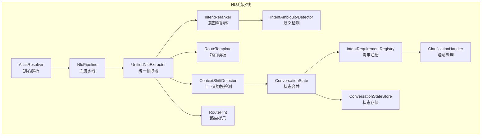

图表来源
- [NluPipeline.java:37-153](file://src/main/java/com/yupi/yuaiagent/nlu/NluPipeline.java#L37-L153)
- [UnifiedNluExtractor.java:24-114](file://src/main/java/com/yupi/yuaiagent/nlu/UnifiedNluExtractor.java#L24-L114)
- [IntentReranker.java:20-78](file://src/main/java/com/yupi/yuaiagent/nlu/IntentReranker.java#L20-L78)
- [IntentAmbiguityDetector.java:22-75](file://src/main/java/com/yupi/yuaiagent/nlu/IntentAmbiguityDetector.java#L22-L75)
- [RouteTemplate.java:21-42](file://src/main/java/com/yupi/yuaiagent/nlu/RouteTemplate.java#L21-L42)
- [ContextShiftDetector.java:11-29](file://src/main/java/com/yupi/yuaiagent/nlu/ContextShiftDetector.java#L11-L29)
- [ConversationState.java:11-78](file://src/main/java/com/yupi/yuaiagent/nlu/ConversationState.java#L11-L78)
- [IntentRequirementRegistry.java:19-103](file://src/main/java/com/yupi/yuaiagent/nlu/IntentRequirementRegistry.java#L19-L103)
- [ClarificationHandler.java:14-42](file://src/main/java/com/yupi/yuaiagent/nlu/ClarificationHandler.java#L14-L42)
- [ConversationStateStore.java:11-18](file://src/main/java/com/yupi/yuaiagent/nlu/ConversationStateStore.java#L11-L18)
- [RouteHint.java:13-39](file://src/main/java/com/yupi/yuaiagent/nlu/RouteHint.java#L13-L39)

章节来源
- [NluPipeline.java:14-34](file://src/main/java/com/yupi/yuaiagent/nlu/NluPipeline.java#L14-L34)

## 核心组件
- NluPipeline：NLU管道主控制器，串联别名解析、统一抽取、重排序、歧义检测、路由模板、上下文切换、状态合并、需求检查与澄清处理，并输出NluResult。
- UnifiedNluExtractor：单次LLM调用，输出意图排序、实体、指标、时间范围、维度、域、动作等。
- IntentReranker：基于别名域信号对意图分数进行加权调整，提升域内意图置信度。
- IntentAmbiguityDetector：基于类别与分数间隔判断是否存在歧义。
- RouteTemplate：将域/动作/指标组合成点分路由字符串。
- ContextShiftDetector：三态上下文切换检测（跟进/实体切换/新查询），规则实现见RuleContextShiftDetector。
- ConversationState：多轮对话状态，支持智能合并。
- ConversationStateStore：状态持久化抽象，默认内存实现。
- AliasResolver：从用户输入中提取别名元数据（不修改状态）。
- ClarificationHandler：模板化生成澄清问题，零LLM调用。
- NluContext：一次性上下文封装（状态+别名提示）。
- RouteHint：路由提示记录，可转换为AgentIntent用于路由。

章节来源
- [NluPipeline.java:39-67](file://src/main/java/com/yupi/yuaiagent/nlu/NluPipeline.java#L39-L67)
- [UnifiedNluExtractor.java:24-95](file://src/main/java/com/yupi/yuaiagent/nlu/UnifiedNluExtractor.java#L24-L95)
- [IntentReranker.java:19-78](file://src/main/java/com/yupi/yuaiagent/nlu/IntentReranker.java#L19-L78)
- [IntentAmbiguityDetector.java:22-75](file://src/main/java/com/yupi/yuaiagent/nlu/IntentAmbiguityDetector.java#L22-L75)
- [RouteTemplate.java:21-42](file://src/main/java/com/yupi/yuaiagent/nlu/RouteTemplate.java#L21-L42)
- [ContextShiftDetector.java:11-29](file://src/main/java/com/yupi/yuaiagent/nlu/ContextShiftDetector.java#L11-L29)
- [RuleContextShiftDetector.java:20-84](file://src/main/java/com/yupi/yuaiagent/nlu/RuleContextShiftDetector.java#L20-L84)
- [ConversationState.java:11-78](file://src/main/java/com/yupi/yuaiagent/nlu/ConversationState.java#L11-L78)
- [ConversationStateStore.java:11-18](file://src/main/java/com/yupi/yuaiagent/nlu/ConversationStateStore.java#L11-L18)
- [InMemoryConversationStateStore.java:16-42](file://src/main/java/com/yupi/yuaiagent/nlu/InMemoryConversationStateStore.java#L16-L42)
- [AliasResolver.java:24-107](file://src/main/java/com/yupi/yuaiagent/nlu/AliasResolver.java#L24-L107)
- [ClarificationHandler.java:14-42](file://src/main/java/com/yupi/yuaiagent/nlu/ClarificationHandler.java#L14-L42)
- [NluContext.java:17-44](file://src/main/java/com/yupi/yuaiagent/nlu/NluContext.java#L17-L44)
- [RouteHint.java:13-39](file://src/main/java/com/yupi/yuaiagent/nlu/RouteHint.java#L13-L39)

## 架构总览
NLU管道以“单次LLM调用+后处理”为核心，通过别名域信号增强意图置信度，结合规则与嵌入相似度（接口定义）进行上下文切换判定，最终生成路由提示与澄清指令。

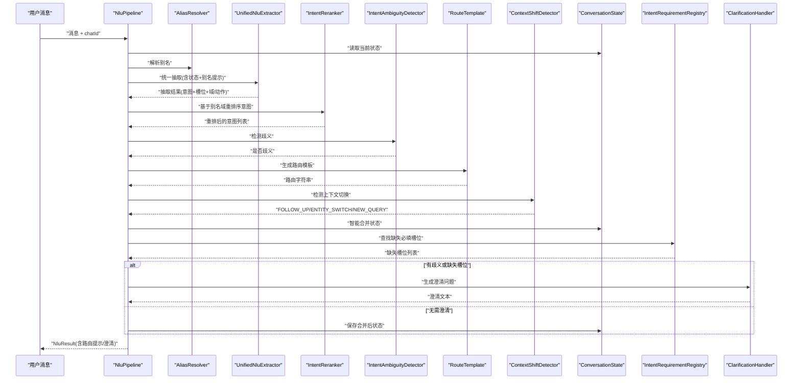

图表来源
- [NluPipeline.java:69-153](file://src/main/java/com/yupi/yuaiagent/nlu/NluPipeline.java#L69-L153)
- [UnifiedNluExtractor.java:100-114](file://src/main/java/com/yupi/yuaiagent/nlu/UnifiedNluExtractor.java#L100-L114)
- [IntentReranker.java:50-78](file://src/main/java/com/yupi/yuaiagent/nlu/IntentReranker.java#L50-L78)
- [IntentAmbiguityDetector.java:36-65](file://src/main/java/com/yupi/yuaiagent/nlu/IntentAmbiguityDetector.java#L36-L65)
- [RouteTemplate.java:32-42](file://src/main/java/com/yupi/yuaiagent/nlu/RouteTemplate.java#L32-L42)
- [ContextShiftDetector.java:13-14](file://src/main/java/com/yupi/yuaiagent/nlu/ContextShiftDetector.java#L13-L14)
- [ConversationState.java:47-77](file://src/main/java/com/yupi/yuaiagent/nlu/ConversationState.java#L47-L77)
- [IntentRequirementRegistry.java:55-85](file://src/main/java/com/yupi/yuaiagent/nlu/IntentRequirementRegistry.java#L55-L85)
- [ClarificationHandler.java:24-41](file://src/main/java/com/yupi/yuaiagent/nlu/ClarificationHandler.java#L24-L41)

## 详细组件分析

### UnifiedNluExtractor（意图识别机制）
- 单次LLM调用产出：
  - 意图排序（前2-3个，相对权重，非校准概率）
  - 实体、指标、时间范围、维度
  - 域（广告主/简历/薪资/职业咨询等）、动作（查询/分析/优化/创建/预约）
- 别名提示：通过NluContext传入别名映射，指导实体标准化但不污染状态
- 解析容错：自动清理代码块包裹的JSON，异常时返回空抽取结果
- 置信度启发式：Top1分数减去Top2分数作为置信度

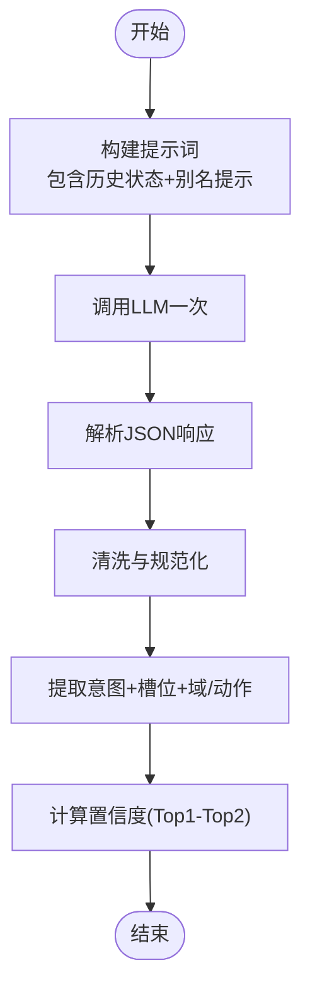

图表来源
- [UnifiedNluExtractor.java:29-91](file://src/main/java/com/yupi/yuaiagent/nlu/UnifiedNluExtractor.java#L29-L91)
- [UnifiedNluExtractor.java:100-114](file://src/main/java/com/yupi/yuaiagent/nlu/UnifiedNluExtractor.java#L100-L114)
- [UnifiedNluExtractor.java:129-159](file://src/main/java/com/yupi/yuaiagent/nlu/UnifiedNluExtractor.java#L129-L159)
- [UnifiedNluExtractor.java:170-201](file://src/main/java/com/yupi/yuaiagent/nlu/UnifiedNluExtractor.java#L170-L201)

章节来源
- [UnifiedNluExtractor.java:14-21](file://src/main/java/com/yupi/yuaiagent/nlu/UnifiedNluExtractor.java#L14-L21)
- [UnifiedNluExtractor.java:29-91](file://src/main/java/com/yupi/yuaiagent/nlu/UnifiedNluExtractor.java#L29-L91)
- [UnifiedNluExtractor.java:100-114](file://src/main/java/com/yupi/yuaiagent/nlu/UnifiedNluExtractor.java#L100-L114)
- [UnifiedNluExtractor.java:129-159](file://src/main/java/com/yupi/yuaiagent/nlu/UnifiedNluExtractor.java#L129-L159)
- [UnifiedNluExtractor.java:170-201](file://src/main/java/com/yupi/yuaiagent/nlu/UnifiedNluExtractor.java#L170-L201)

### IntentReranker（意图重排序算法）
- 输入：原始意图分数、别名匹配（含实体类型）
- 策略：根据别名实体类型（域）对意图分数加权调整
  - 域-意图权重表：正向奖励、负向惩罚
  - 对每个意图累加所有命中的域的权重，再归一到[0.01,1.0]
  - 最终按新分数降序排序
- 时机：在歧义检测之前执行，影响后续歧义判断与最终意图选择

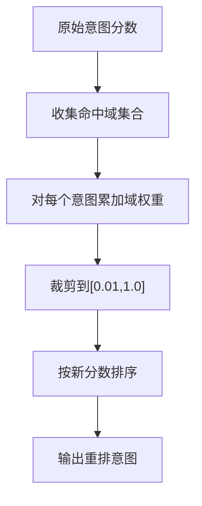

图表来源
- [IntentReranker.java:22-41](file://src/main/java/com/yupi/yuaiagent/nlu/IntentReranker.java#L22-L41)
- [IntentReranker.java:50-78](file://src/main/java/com/yupi/yuaiagent/nlu/IntentReranker.java#L50-L78)

章节来源
- [IntentReranker.java:9-18](file://src/main/java/com/yupi/yuaiagent/nlu/IntentReranker.java#L9-L18)
- [IntentReranker.java:22-41](file://src/main/java/com/yupi/yuaiagent/nlu/IntentReranker.java#L22-L41)
- [IntentReranker.java:50-78](file://src/main/java/com/yupi/yuaiagent/nlu/IntentReranker.java#L50-L78)

### ContextShiftDetector（上下文切换检测）
- 接口定义三态：FOLLOW_UP（跟进）、ENTITY_SWITCH（实体切换）、NEW_QUERY（新查询）
- 规则实现（Rule-based）：
  - 显式查询动词开头 → NEW_QUERY
  - 存在跟随语气词/短语 → 可能为跟进
  - 实体是否变化决定是否归类为跟进或实体切换
  - 默认保守地视为新查询
- 嵌入相似度检测（接口预留）：后续可接入向量相似度进行二阶段判定

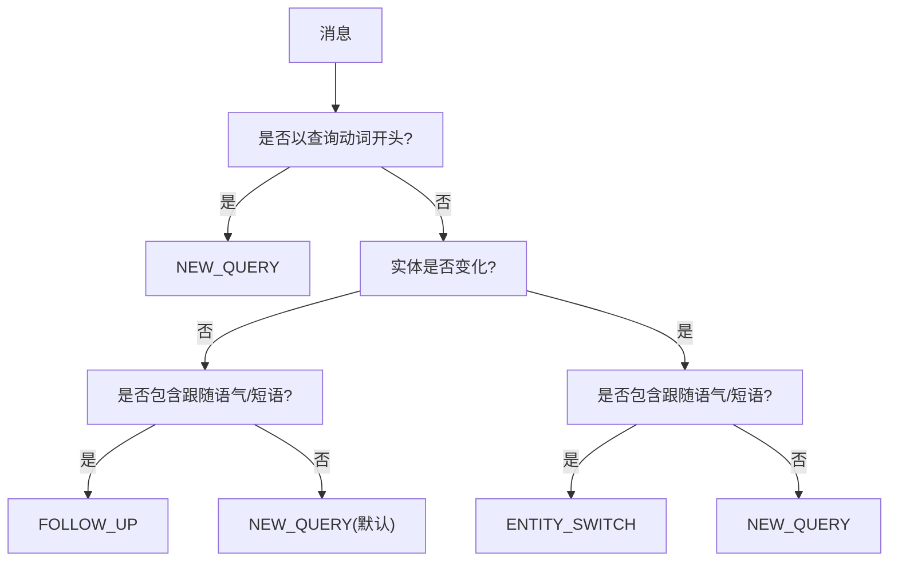

图表来源
- [ContextShiftDetector.java:11-29](file://src/main/java/com/yupi/yuaiagent/nlu/ContextShiftDetector.java#L11-L29)
- [RuleContextShiftDetector.java:36-78](file://src/main/java/com/yupi/yuaiagent/nlu/RuleContextShiftDetector.java#L36-L78)

章节来源
- [ContextShiftDetector.java:3-10](file://src/main/java/com/yupi/yuaiagent/nlu/ContextShiftDetector.java#L3-L10)
- [ContextShiftDetector.java:13-29](file://src/main/java/com/yupi/yuaiagent/nlu/ContextShiftDetector.java#L13-L29)
- [RuleContextShiftDetector.java:7-19](file://src/main/java/com/yupi/yuaiagent/nlu/RuleContextShiftDetector.java#L7-L19)
- [RuleContextShiftDetector.java:36-78](file://src/main/java/com/yupi/yuaiagent/nlu/RuleContextShiftDetector.java#L36-L78)

### AliasResolver（别名解析）
- 功能：扫描输入提取别名元数据（别名→规范名、实体类型），不修改状态
- 策略：
  - 短别名（≤2字符）使用单词边界避免误匹配
  - 中文别名仅使用后边界，英文别名使用双侧边界
  - 初始化内置别名（如“TX→腾讯资方”，类型为ADVERTISER）
- 扩展：生产环境建议升级为Aho-Corasick或Trie以支持大规模别名

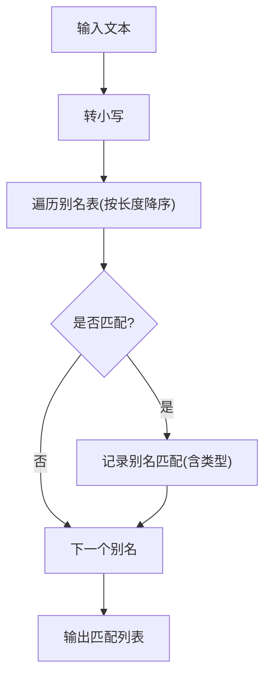

图表来源
- [AliasResolver.java:58-81](file://src/main/java/com/yupi/yuaiagent/nlu/AliasResolver.java#L58-L81)
- [AliasResolver.java:95-106](file://src/main/java/com/yupi/yuaiagent/nlu/AliasResolver.java#L95-L106)

章节来源
- [AliasResolver.java:12-23](file://src/main/java/com/yupi/yuaiagent/nlu/AliasResolver.java#L12-L23)
- [AliasResolver.java:34-43](file://src/main/java/com/yupi/yuaiagent/nlu/AliasResolver.java#L34-L43)
- [AliasResolver.java:58-81](file://src/main/java/com/yupi/yuaiagent/nlu/AliasResolver.java#L58-L81)
- [AliasResolver.java:95-106](file://src/main/java/com/yupi/yuaiagent/nlu/AliasResolver.java#L95-L106)

### ClarificationHandler（澄清处理）
- 模板化生成澄清问题，零LLM调用
- 依据缺失槽位（entity/metric/timeRange/dimension）生成简洁问题
- 已知槽位会在澄清中前置说明，提升用户反馈效率

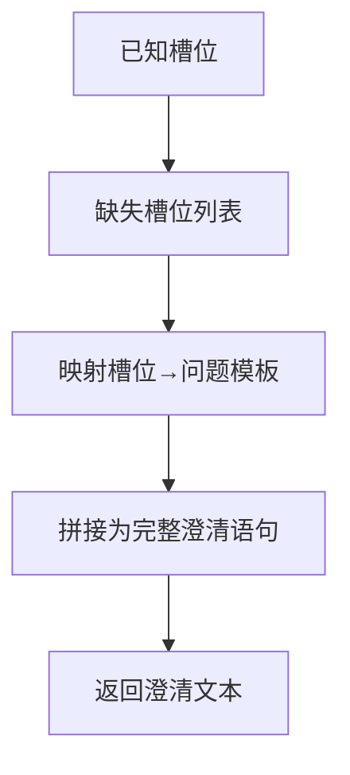

图表来源
- [ClarificationHandler.java:24-41](file://src/main/java/com/yupi/yuaiagent/nlu/ClarificationHandler.java#L24-L41)

章节来源
- [ClarificationHandler.java:8-13](file://src/main/java/com/yupi/yuaiagent/nlu/ClarificationHandler.java#L8-L13)
- [ClarificationHandler.java:24-41](file://src/main/java/com/yupi/yuaiagent/nlu/ClarificationHandler.java#L24-L41)

### ConversationState（状态管理）
- 字段：实体、指标、时间范围、维度、最近意图、置信度、最后更新时间、版本号
- 智能合并（smartMerge）：
  - FOLLOW_UP：继承旧值，显式提及字段覆盖
  - ENTITY_SWITCH：保留度量维度，切换实体
  - NEW_QUERY：完全采用新值，丢弃过时上下文
- 版本号用于乐观并发控制（内存存储中用于合并决策）

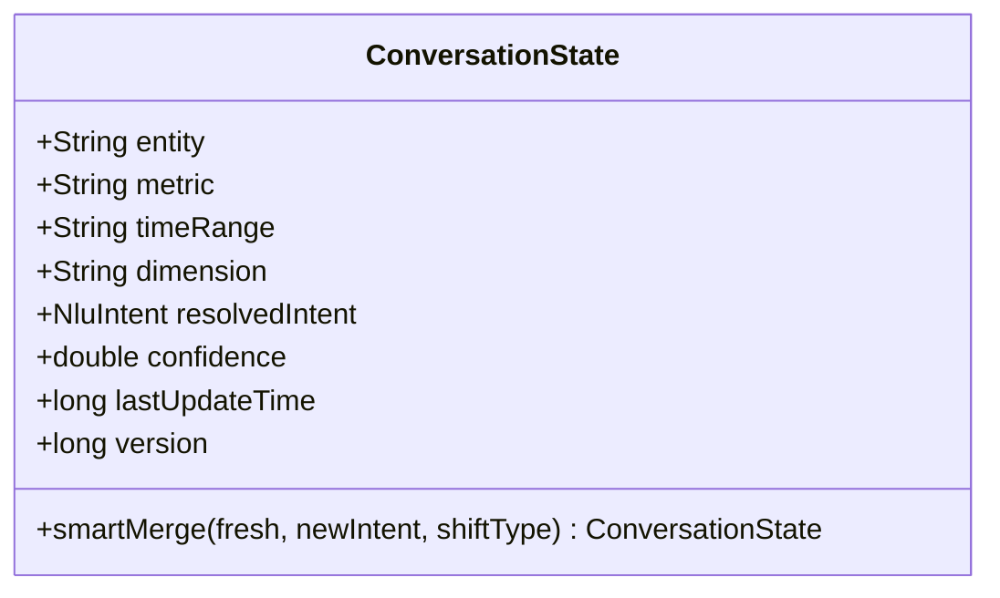

图表来源
- [ConversationState.java:11-78](file://src/main/java/com/yupi/yuaiagent/nlu/ConversationState.java#L11-L78)

章节来源
- [ConversationState.java:38-77](file://src/main/java/com/yupi/yuaiagent/nlu/ConversationState.java#L38-L77)

### ConversationStateStore（状态存储）
- 抽象接口：get/save/delete
- 开发默认实现：InMemoryConversationStateStore（ConcurrentHashMap + 版本合并）
- 生产建议：替换为Redis实现（CAS + TTL）

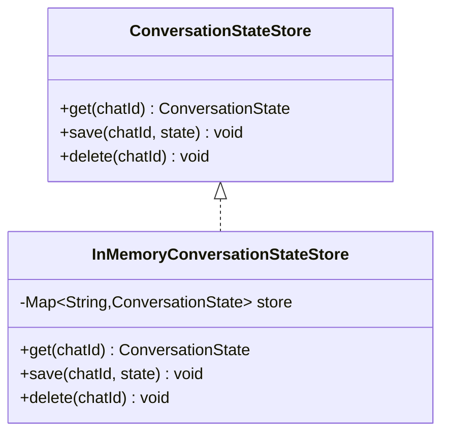

图表来源
- [ConversationStateStore.java:11-18](file://src/main/java/com/yupi/yuaiagent/nlu/ConversationStateStore.java#L11-L18)
- [InMemoryConversationStateStore.java:16-42](file://src/main/java/com/yupi/yuaiagent/nlu/InMemoryConversationStateStore.java#L16-L42)

章节来源
- [ConversationStateStore.java:3-10](file://src/main/java/com/yupi/yuaiagent/nlu/ConversationStateStore.java#L3-L10)
- [InMemoryConversationStateStore.java:10-15](file://src/main/java/com/yupi/yuaiagent/nlu/InMemoryConversationStateStore.java#L10-L15)

### RouteTemplate（路由模板系统）
- 将域、动作、指标组合为点分字符串（如“advertiser.query.roi”）
- 支持前缀匹配（WorkflowMatcher可按“域.动作.*”捕获）
- 未提供域/动作时返回null

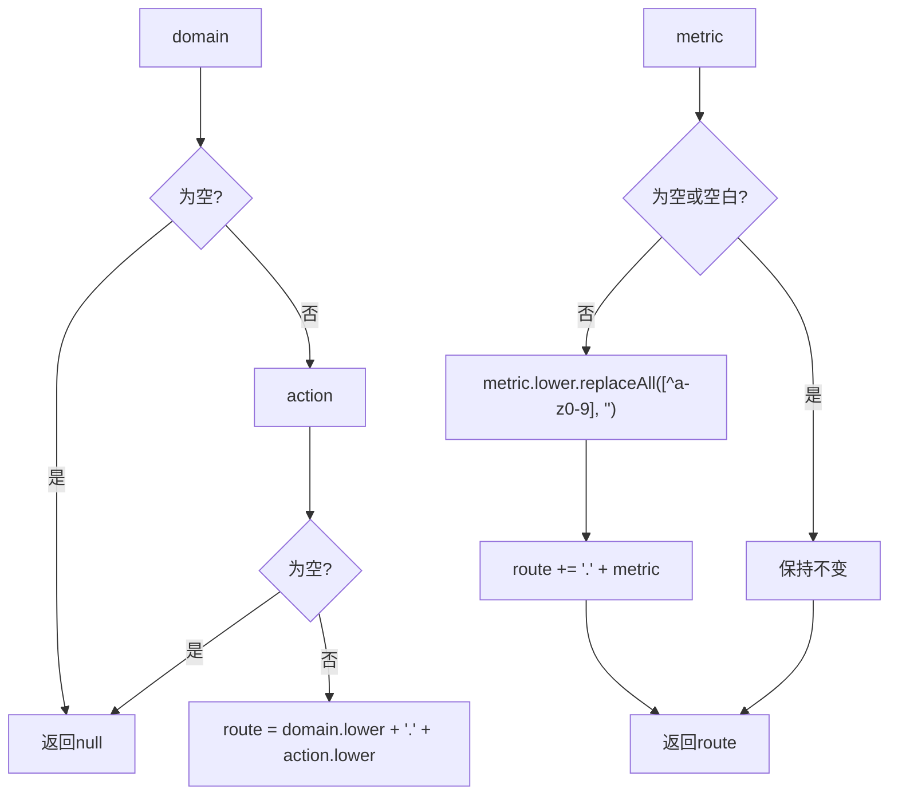

图表来源
- [RouteTemplate.java:32-42](file://src/main/java/com/yupi/yuaiagent/nlu/RouteTemplate.java#L32-L42)

章节来源
- [RouteTemplate.java:5-19](file://src/main/java/com/yupi/yuaiagent/nlu/RouteTemplate.java#L5-L19)
- [RouteTemplate.java:32-42](file://src/main/java/com/yupi/yuaiagent/nlu/RouteTemplate.java#L32-L42)

### IntentRequirementRegistry（需求注册机制）
- 双维查找：
  1) 精确匹配routeHint（如“advertiser.query.roi”）
  2) 前缀回退（如“advertiser.query”）
  3) 回退到意图级（如“QUERY_DATA”）
- 返回缺失的必填槽位列表，供澄清模块使用

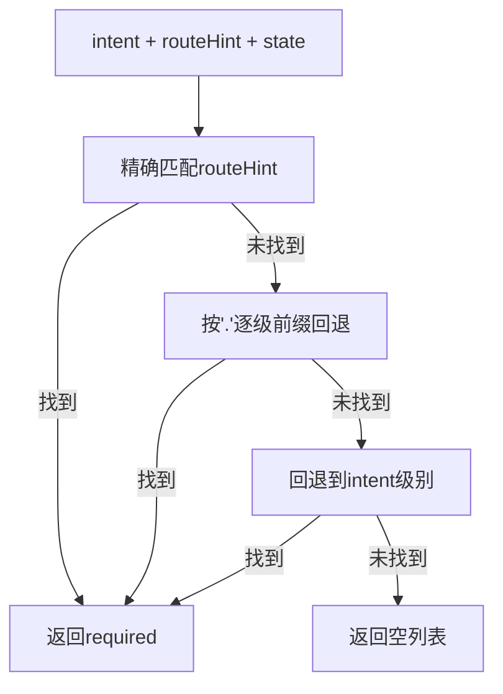

图表来源
- [IntentRequirementRegistry.java:55-85](file://src/main/java/com/yupi/yuaiagent/nlu/IntentRequirementRegistry.java#L55-L85)

章节来源
- [IntentRequirementRegistry.java:8-18](file://src/main/java/com/yupi/yuaiagent/nlu/IntentRequirementRegistry.java#L8-L18)
- [IntentRequirementRegistry.java:24-46](file://src/main/java/com/yupi/yuaiagent/nlu/IntentRequirementRegistry.java#L24-L46)
- [IntentRequirementRegistry.java:55-85](file://src/main/java/com/yupi/yuaiagent/nlu/IntentRequirementRegistry.java#L55-L85)

### NluPipeline（流水线编排）
- 步骤概览：
  1) 加载状态
  2) 别名解析（元数据）
  3) 构建NluContext（状态+别名提示）
  4) 统一抽取（1次LLM）
  5) 域信号重排序
  6) 歧义检测
  7) 选择Top意图
  8) 生成路由模板
  9) 上下文切换检测
  10) 构建新鲜状态
  11) 智能合并
  12) 缺失槽位检查与澄清
  13) 生成RouteHint
  14) 保存状态（若无需澄清）
- 输出：NluResult（包含状态、抽取、别名、重排意图、路由提示、澄清信息）

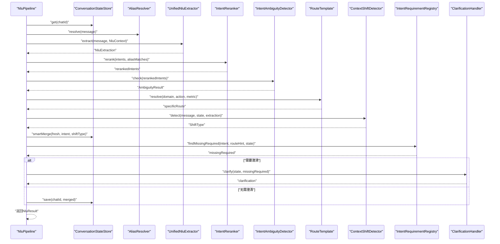

图表来源
- [NluPipeline.java:69-153](file://src/main/java/com/yupi/yuaiagent/nlu/NluPipeline.java#L69-L153)

章节来源
- [NluPipeline.java:14-34](file://src/main/java/com/yupi/yuaiagent/nlu/NluPipeline.java#L14-L34)
- [NluPipeline.java:69-153](file://src/main/java/com/yupi/yuaiagent/nlu/NluPipeline.java#L69-L153)

## 依赖分析
- 组件耦合：
  - NluPipeline聚合所有子组件，是编排中心
  - UnifiedNluExtractor依赖LLM客户端；IntentReranker与AliasResolver配合；ContextShiftDetector为接口，规则实现独立
  - ConversationStateStore抽象，内存实现用于开发
- 外部依赖：
  - LLM调用（ChatClient/ChatModel）
  - Jackson JSON解析
  - Spring注解（@Component、@PostConstruct、@ConditionalOnMissingBean）

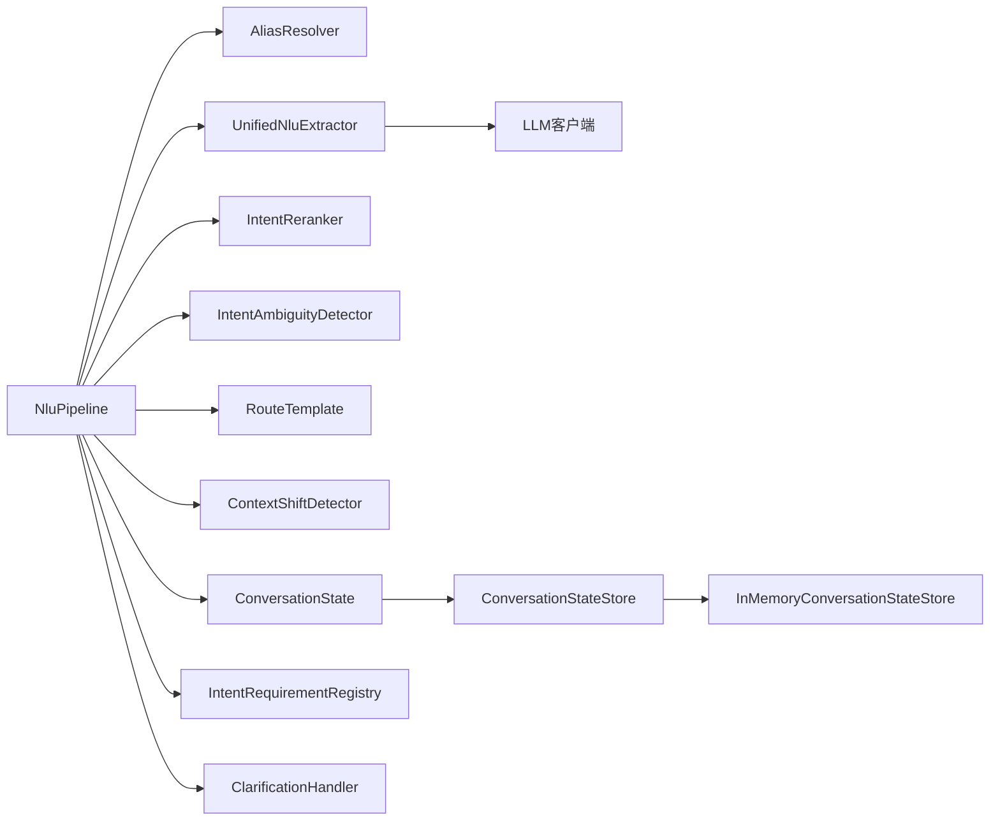

图表来源
- [NluPipeline.java:39-67](file://src/main/java/com/yupi/yuaiagent/nlu/NluPipeline.java#L39-L67)
- [ConversationStateStore.java:11-18](file://src/main/java/com/yupi/yuaiagent/nlu/ConversationStateStore.java#L11-L18)
- [InMemoryConversationStateStore.java:16-42](file://src/main/java/com/yupi/yuaiagent/nlu/InMemoryConversationStateStore.java#L16-L42)

章节来源
- [NluPipeline.java:39-67](file://src/main/java/com/yupi/yuaiagent/nlu/NluPipeline.java#L39-L67)
- [ConversationStateStore.java:3-10](file://src/main/java/com/yupi/yuaiagent/nlu/ConversationStateStore.java#L3-L10)
- [InMemoryConversationStateStore.java:16-42](file://src/main/java/com/yupi/yuaiagent/nlu/InMemoryConversationStateStore.java#L16-L42)

## 性能考虑
- LLM调用次数
  - 统一抽取器仅一次LLM调用，显著降低延迟与成本
  - 澄清处理为模板化，零LLM调用
- 计算复杂度
  - 别名扫描：O(M×K)，M为别名数，K为平均别名长度；建议大规模场景采用AC/Trie
  - 重排序：O(M)（域-意图权重表固定大小）
  - 智能合并：常数时间
- 存储与并发
  - 内存存储：高吞吐低延迟；生产建议Redis（CAS + TTL）
- 提示词与解析
  - JSON解析具备容错清洗逻辑，减少失败重试
  - 建议在LLM端启用结构化输出约束，进一步降低解析失败

## 故障排查指南
- 抽取失败/解析异常
  - 现象：日志出现解析警告，返回空抽取
  - 排查：检查提示词是否被截断或包裹代码块；确认LLM输出严格JSON
  - 参考路径：[UnifiedNluExtractor.java:129-159](file://src/main/java/com/yupi/yuaiagent/nlu/UnifiedNluExtractor.java#L129-L159)
- 意图歧义导致澄清频繁
  - 现象：频繁触发澄清
  - 排查：检查域-意图权重是否过于保守；调整阈值或类别划分
  - 参考路径：[IntentAmbiguityDetector.java:36-65](file://src/main/java/com/yupi/yuaiagent/nlu/IntentAmbiguityDetector.java#L36-L65)
- 上下文切换误判
  - 现象：跟进/实体切换/新查询分类错误
  - 排查：检查跟随词/短语集合与实体变更判断；必要时引入嵌入相似度检测
  - 参考路径：[RuleContextShiftDetector.java:36-78](file://src/main/java/com/yupi/yuaiagent/nlu/RuleContextShiftDetector.java#L36-L78)
- 状态未持久化
  - 现象：澄清后状态丢失
  - 排查：确认NluPipeline在需要澄清时不保存状态；生产需替换为Redis存储
  - 参考路径：[NluPipeline.java:142-145](file://src/main/java/com/yupi/yuaiagent/nlu/NluPipeline.java#L142-L145)、[InMemoryConversationStateStore.java:29-36](file://src/main/java/com/yupi/yuaiagent/nlu/InMemoryConversationStateStore.java#L29-L36)

章节来源
- [UnifiedNluExtractor.java:129-159](file://src/main/java/com/yupi/yuaiagent/nlu/UnifiedNluExtractor.java#L129-L159)
- [IntentAmbiguityDetector.java:36-65](file://src/main/java/com/yupi/yuaiagent/nlu/IntentAmbiguityDetector.java#L36-L65)
- [RuleContextShiftDetector.java:36-78](file://src/main/java/com/yupi/yuaiagent/nlu/RuleContextShiftDetector.java#L36-L78)
- [NluPipeline.java:142-145](file://src/main/java/com/yupi/yuaiagent/nlu/NluPipeline.java#L142-L145)
- [InMemoryConversationStateStore.java:29-36](file://src/main/java/com/yupi/yuaiagent/nlu/InMemoryConversationStateStore.java#L29-L36)

## 结论
该NLU管道以“单次LLM抽取+后处理”为核心，通过别名域信号增强意图置信度、规则驱动的上下文切换检测与模板化澄清，实现了高效、可控且可扩展的自然语言理解能力。建议在生产环境中替换状态存储为Redis，并根据业务场景持续优化域-意图权重、类别阈值与规则集。

## 附录

### NLU配置优化清单
- 别名表扩展
  - 在AliasResolver中注册更多别名与实体类型，提升实体标准化准确率
  - 参考路径：[AliasResolver.java:34-43](file://src/main/java/com/yupi/yuaiagent/nlu/AliasResolver.java#L34-L43)
- 域-意图权重调优
  - 根据业务分布调整DOMAIN_INTENT_WEIGHTS，平衡域内意图与跨域抑制
  - 参考路径：[IntentReranker.java:22-41](file://src/main/java/com/yupi/yuaiagent/nlu/IntentReranker.java#L22-L41)
- 澄清模板定制
  - 按业务槽位定制ClarificationHandler的问题模板，提高澄清效率
  - 参考路径：[ClarificationHandler.java:17-22](file://src/main/java/com/yupi/yuaiagent/nlu/ClarificationHandler.java#L17-L22)
- 状态存储替换
  - 开启Redis实现以支持分布式与持久化
  - 参考路径：[ConversationStateStore.java:6-7](file://src/main/java/com/yupi/yuaiagent/nlu/ConversationStateStore.java#L6-L7)
- 提示词与解析健壮性
  - 在LLM端启用结构化输出约束，减少解析失败
  - 参考路径：[UnifiedNluExtractor.java:29-91](file://src/main/java/com/yupi/yuaiagent/nlu/UnifiedNluExtractor.java#L29-L91)

### 调试方法
- 日志定位
  - 关注NluPipeline的日志输出，包含意图、置信度、路由、实体、切换类型与是否需要澄清
  - 参考路径：[NluPipeline.java:147-149](file://src/main/java/com/yupi/yuaiagent/nlu/NluPipeline.java#L147-L149)
- 分步验证
  - 单独测试AliasResolver、UnifiedNluExtractor、IntentReranker、ContextShiftDetector与ClarificationHandler的行为
  - 参考路径：各组件对应文件
- 状态一致性
  - 使用InMemoryConversationStateStore进行本地验证，确认智能合并逻辑正确
  - 参考路径：[ConversationState.java:47-77](file://src/main/java/com/yupi/yuaiagent/nlu/ConversationState.java#L47-L77)、[InMemoryConversationStateStore.java:29-36](file://src/main/java/com/yupi/yuaiagent/nlu/InMemoryConversationStateStore.java#L29-L36)