# 基础设施层架构

<cite>
**本文档引用的文件**
- [ChatMemoryManager.java](file://src/main/java/com/yupi/yuaiagent/chatmemory/ChatMemoryManager.java)
- [UserProfileService.java](file://src/main/java/com/yupi/yuaiagent/profile/UserProfileService.java)
- [ArtifactShelf.java](file://src/main/java/com/yupi/yuaiagent/artifact/ArtifactShelf.java)
- [TraceRepository.java](file://src/main/java/com/yupi/yuaiagent/trace/TraceRepository.java)
- [SessionManager.java](file://src/main/java/com/yupi/yuaiagent/session/SessionManager.java)
- [AuthService.java](file://src/main/java/com/yupi/yuaiagent/auth/AuthService.java)
- [CalendarService.java](file://src/main/java/com/yupi/yuaiagent/calendar/CalendarService.java)
- [UsageTracker.java](file://src/main/java/com/yupi/yuaiagent/usage/UsageTracker.java)
- [PersistentMessageRepository.java](file://src/main/java/com/yupi/yuaiagent/message/PersistentMessageRepository.java)
- [application.yml](file://src/main/resources/application.yml)
- [application-prod.yml](file://src/main/resources/application-prod.yml)
</cite>

## 目录
1. [引言](#引言)
2. [项目结构](#项目结构)
3. [核心组件](#核心组件)
4. [架构总览](#架构总览)
5. [详细组件分析](#详细组件分析)
6. [依赖关系分析](#依赖关系分析)
7. [性能考虑](#性能考虑)
8. [故障排查指南](#故障排查指南)
9. [结论](#结论)
10. [附录](#附录)

## 引言
本文件面向基础设施层架构，系统化梳理并说明以下核心子系统的职责边界、交互关系与运行机制：
- ChatMemoryManager：对话记忆统一管理与自动压缩
- UserProfileService：用户画像抽取、合并与提示词注入
- ArtifactShelf：交付物（工件）的统一货架与查询
- TraceRepository：执行追踪数据的持久化与保留策略
- SessionManager：会话生命周期管理（软删除与清理）
- AuthService：统一鉴权入口（JWT解析与校验）
- CalendarService：企业日历服务抽象与多提供商支持
- UsageTracker：使用事件采集与统计分析
- PersistentMessageRepository：消息持久化与压缩支持

同时给出配置要点、性能优化建议与运维实践，帮助读者快速理解并高效扩展基础设施能力。

## 项目结构
基础设施层位于后端应用的核心包内，采用“按功能域分层”的组织方式：
- chatmemory：对话记忆与压缩
- profile：用户画像系统
- artifact：工件管理
- trace：追踪数据
- session：会话管理
- auth：身份认证
- calendar：日历服务
- usage：使用统计
- message：消息持久化

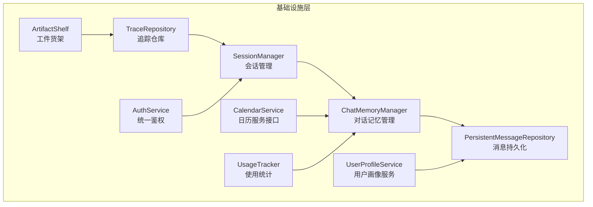

**图表来源**
- [ChatMemoryManager.java:36-340](file://src/main/java/com/yupi/yuaiagent/chatmemory/ChatMemoryManager.java#L36-L340)
- [UserProfileService.java:26-94](file://src/main/java/com/yupi/yuaiagent/profile/UserProfileService.java#L26-L94)
- [ArtifactShelf.java:24-129](file://src/main/java/com/yupi/yuaiagent/artifact/ArtifactShelf.java#L24-L129)
- [TraceRepository.java:35-243](file://src/main/java/com/yupi/yuaiagent/trace/TraceRepository.java#L35-L243)
- [SessionManager.java:29-309](file://src/main/java/com/yupi/yuaiagent/session/SessionManager.java#L29-L309)
- [AuthService.java:17-53](file://src/main/java/com/yupi/yuaiagent/auth/AuthService.java#L17-L53)
- [CalendarService.java:14-75](file://src/main/java/com/yupi/yuaiagent/calendar/CalendarService.java#L14-L75)
- [UsageTracker.java:29-143](file://src/main/java/com/yupi/yuaiagent/usage/UsageTracker.java#L29-L143)
- [PersistentMessageRepository.java:34-229](file://src/main/java/com/yupi/yuaiagent/message/PersistentMessageRepository.java#L34-L229)

**章节来源**
- [ChatMemoryManager.java:36-340](file://src/main/java/com/yupi/yuaiagent/chatmemory/ChatMemoryManager.java#L36-L340)
- [UserProfileService.java:26-94](file://src/main/java/com/yupi/yuaiagent/profile/UserProfileService.java#L26-L94)
- [ArtifactShelf.java:24-129](file://src/main/java/com/yupi/yuaiagent/artifact/ArtifactShelf.java#L24-L129)
- [TraceRepository.java:35-243](file://src/main/java/com/yupi/yuaiagent/trace/TraceRepository.java#L35-L243)
- [SessionManager.java:29-309](file://src/main/java/com/yupi/yuaiagent/session/SessionManager.java#L29-L309)
- [AuthService.java:17-53](file://src/main/java/com/yupi/yuaiagent/auth/AuthService.java#L17-L53)
- [CalendarService.java:14-75](file://src/main/java/com/yupi/yuaiagent/calendar/CalendarService.java#L14-L75)
- [UsageTracker.java:29-143](file://src/main/java/com/yupi/yuaiagent/usage/UsageTracker.java#L29-L143)
- [PersistentMessageRepository.java:34-229](file://src/main/java/com/yupi/yuaiagent/message/PersistentMessageRepository.java#L34-L229)

## 核心组件
本节从职责、数据结构、处理流程与性能特征四个维度，对基础设施层的关键组件进行概览式说明。

- ChatMemoryManager
  - 职责：统一管理不同Agent类型的对话记忆，提供压缩状态查询与自动触发压缩的能力，确保对话连续性。
  - 关键点：支持Token阈值与轮数阈值双策略，压缩过程在写锁保护下完成，异常不向上抛出，避免影响对话。
  - 复杂度：状态查询O(1)，压缩触发O(n)（n为待压缩消息数）。
  - 性能：并发Map存储，压缩状态消息通过Consumer推送，避免阻塞主流程。

- UserProfileService
  - 职责：异步抽取、合并与持久化用户画像，提供画像查询与提示词注入。
  - 关键点：抽取失败返回空画像而非异常，合并去重并刷新时间戳，异常仅记录日志不传播。
  - 复杂度：异步执行，主线程开销极小；查询与构建提示词为O(1)/O(k)（k为画像维度数）。

- ArtifactShelf
  - 职责：交付物的统一入口，负责放货、读取、查询与标记消费，封装作用域校验与幂等消费。
  - 关键点：按作用域（任务/用户画像）进行参数校验，委托仓库进行持久化，线程安全由仓库读写锁保障。
  - 复杂度：查询为O(n)（n为仓库总数），按条件过滤后排序，时间复杂度受过滤条件影响。

- TraceRepository
  - 职责：执行追踪数据的持久化与查询，支持按会话与用户维度检索，并强制每用户保留策略。
  - 关键点：文件JSON存储，读写锁保护，初始化时加载历史数据；保存后执行保留策略，删除最旧条目。
  - 复杂度：保存O(1)，按用户查询O(n)（n为该用户追踪数），保留策略O(n log n)（排序+截断）。

- SessionManager
  - 职责：会话生命周期管理（ACTIVE/ARCHIVED/DELETED），软删除与定期物理清理。
  - 关键点：文件JSON存储，读写锁保护；提供反向索引chatId→userId，支持权限校验。
  - 复杂度：创建/更新/删除O(1)，查询O(n)（n为用户会话数）。

- AuthService
  - 职责：统一解析JWT（URL参数或Authorization头），校验并返回userId，失败抛业务异常。
  - 关键点：支持两种来源，校验失败统一抛出401错误，调用方无需空指针判断。
  - 复杂度：O(1)。

- CalendarService
  - 职责：抽象企业日历（飞书/钉钉）差异，提供统一的事件创建、取消、修改与可用性检查接口。
  - 关键点：通过配置选择提供商，异常向上抛出供上层处理。
  - 复杂度：接口调用取决于具体提供商API，此处为抽象层。

- UsageTracker
  - 职责：记录使用事件并提供统计分析（事件总数、按类型/代理/日期分布、总时长）。
  - 关键点：文件JSON追加存储，初始化加载历史；统计聚合为O(n)。
  - 复杂度：记录O(1)，统计O(n)。

- PersistentMessageRepository
  - 职责：聊天消息的持久化与索引，支持压缩替换为摘要+最近消息。
  - 关键点：双索引（会话→消息列表、消息ID→消息），压缩时原子替换并更新索引。
  - 复杂度：保存O(1)，查询O(n)，压缩O(n)。

**章节来源**
- [ChatMemoryManager.java:36-340](file://src/main/java/com/yupi/yuaiagent/chatmemory/ChatMemoryManager.java#L36-L340)
- [UserProfileService.java:26-94](file://src/main/java/com/yupi/yuaiagent/profile/UserProfileService.java#L26-L94)
- [ArtifactShelf.java:24-129](file://src/main/java/com/yupi/yuaiagent/artifact/ArtifactShelf.java#L24-L129)
- [TraceRepository.java:35-243](file://src/main/java/com/yupi/yuaiagent/trace/TraceRepository.java#L35-L243)
- [SessionManager.java:29-309](file://src/main/java/com/yupi/yuaiagent/session/SessionManager.java#L29-L309)
- [AuthService.java:17-53](file://src/main/java/com/yupi/yuaiagent/auth/AuthService.java#L17-L53)
- [CalendarService.java:14-75](file://src/main/java/com/yupi/yuaiagent/calendar/CalendarService.java#L14-L75)
- [UsageTracker.java:29-143](file://src/main/java/com/yupi/yuaiagent/usage/UsageTracker.java#L29-L143)
- [PersistentMessageRepository.java:34-229](file://src/main/java/com/yupi/yuaiagent/message/PersistentMessageRepository.java#L34-L229)

## 架构总览
基础设施层围绕“数据持久化 + 生命周期管理 + 统一入口”展开，形成如下交互闭环：
- ChatMemoryManager与PersistentMessageRepository协作完成对话记忆的持久化与压缩
- UserProfileService与PersistentMessageRepository配合，实现对话结束后的画像更新
- ArtifactShelf与TraceRepository共同支撑交付物与追踪数据的统一管理
- SessionManager贯穿会话创建、归档、删除与清理
- AuthService为上述组件提供统一鉴权入口
- CalendarService作为外部系统适配层
- UsageTracker提供使用行为的可观测性

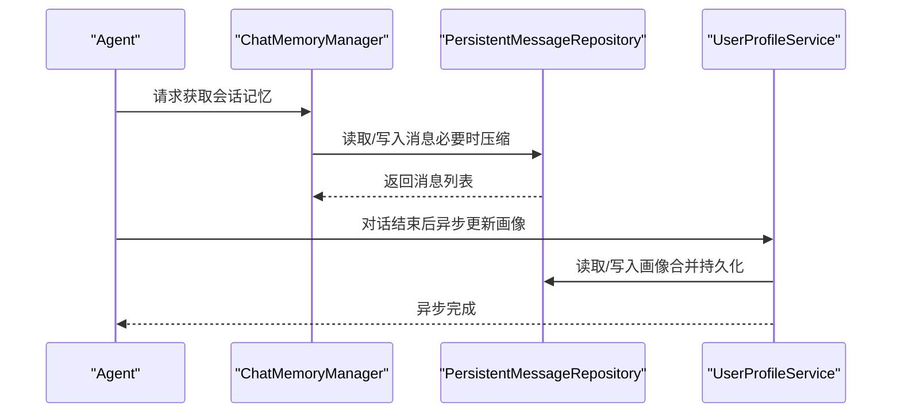

**图表来源**
- [ChatMemoryManager.java:79-188](file://src/main/java/com/yupi/yuaiagent/chatmemory/ChatMemoryManager.java#L79-L188)
- [PersistentMessageRepository.java:109-186](file://src/main/java/com/yupi/yuaiagent/message/PersistentMessageRepository.java#L109-L186)
- [UserProfileService.java:49-61](file://src/main/java/com/yupi/yuaiagent/profile/UserProfileService.java#L49-L61)

## 详细组件分析

### ChatMemoryManager 分析
- 设计要点
  - 统一管理不同Agent类型的内存实例，避免重复创建
  - 提供压缩状态查询与自动触发压缩，保证阈值语义集中且可配置
  - 压缩过程在写锁保护下完成，异常吞掉不影响对话连续性
- 数据结构
  - ConcurrentHashMap维护agent类型到ChatMemory的映射
  - FileBasedChatMemory实例按类型缓存，支持按会话查询压缩状态
- 处理流程
  - autoCompressIfNeeded：阈值判定→推送状态→压缩持久化→推送完成
  - getCompressionStatus：封装底层状态并附加上下文
- 复杂度与性能
  - 状态查询O(1)，压缩触发O(n)，异常处理避免阻塞

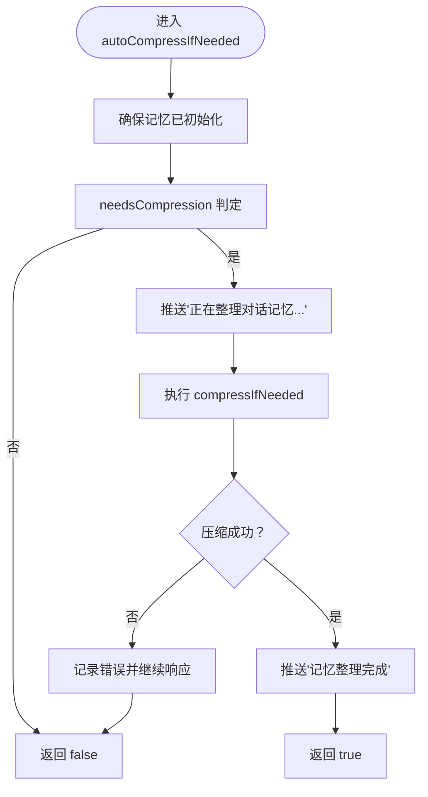

**图表来源**
- [ChatMemoryManager.java:156-188](file://src/main/java/com/yupi/yuaiagent/chatmemory/ChatMemoryManager.java#L156-L188)

**章节来源**
- [ChatMemoryManager.java:36-340](file://src/main/java/com/yupi/yuaiagent/chatmemory/ChatMemoryManager.java#L36-L340)

### UserProfileService 分析
- 设计要点
  - 异步更新画像，不阻塞对话响应
  - 抽取失败返回空画像，合并失败仅记录日志
  - 提供提示词注入，支持字符上限与默认回退
- 数据流
  - updateAsync：抽取→合并→持久化
  - buildPromptInjection：查询→构建→返回片段
- 复杂度
  - 异步执行，主线程开销低；查询与构建为O(1)/O(k)

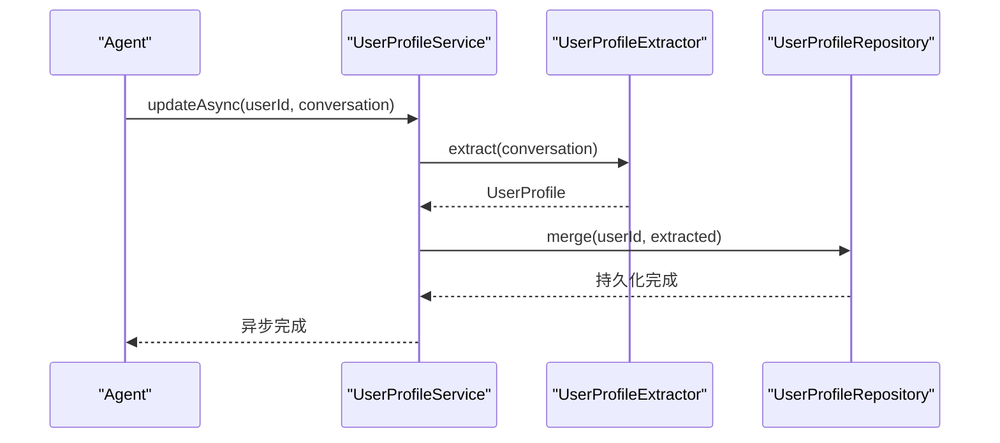

**图表来源**
- [UserProfileService.java:49-61](file://src/main/java/com/yupi/yuaiagent/profile/UserProfileService.java#L49-L61)

**章节来源**
- [UserProfileService.java:26-94](file://src/main/java/com/yupi/yuaiagent/profile/UserProfileService.java#L26-L94)

### ArtifactShelf 分析
- 设计要点
  - 放货前进行作用域校验（任务需chatId，用户画像需userId）
  - 统一委托仓库进行持久化，生成全局唯一ID并维护时间戳
  - 支持多条件AND过滤与按时间倒序排列
  - 标记消费幂等，查询仍返回并保留状态
- 复杂度
  - 放货O(1)，查询O(n)（n为仓库总数）

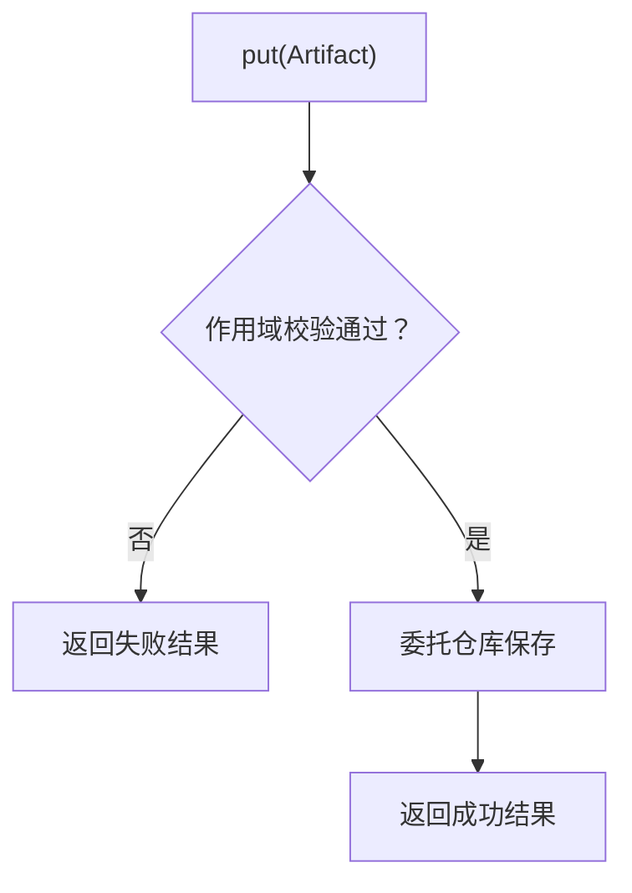

**图表来源**
- [ArtifactShelf.java:42-59](file://src/main/java/com/yupi/yuaiagent/artifact/ArtifactShelf.java#L42-L59)

**章节来源**
- [ArtifactShelf.java:24-129](file://src/main/java/com/yupi/yuaiagent/artifact/ArtifactShelf.java#L24-L129)

### TraceRepository 分析
- 设计要点
  - 文件JSON存储，初始化加载历史数据
  - 读写锁保护并发访问
  - 保存后执行每用户保留策略，删除最旧条目
  - 支持按chatId与userId查询，支持分页
- 复杂度
  - 保存O(1)，查询O(n)，保留策略O(n log n)

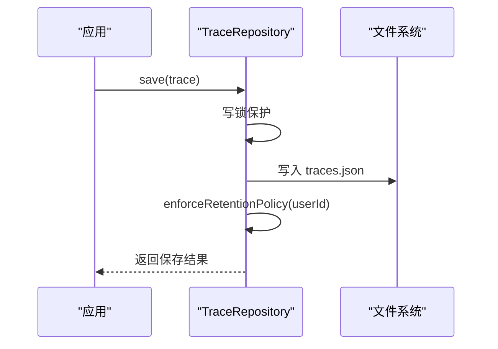

**图表来源**
- [TraceRepository.java:73-83](file://src/main/java/com/yupi/yuaiagent/trace/TraceRepository.java#L73-L83)
- [TraceRepository.java:163-191](file://src/main/java/com/yupi/yuaiagent/trace/TraceRepository.java#L163-L191)

**章节来源**
- [TraceRepository.java:35-243](file://src/main/java/com/yupi/yuaiagent/trace/TraceRepository.java#L35-L243)

### SessionManager 分析
- 设计要点
  - 三态生命周期：ACTIVE/ARCHIVED/DELETED
  - 软删除：状态置为DELETED，30天后清理
  - 文件JSON存储，读写锁保护
  - 反向索引chatId→userId，支持权限校验
- 复杂度
  - 创建/更新/删除O(1)，查询O(n)

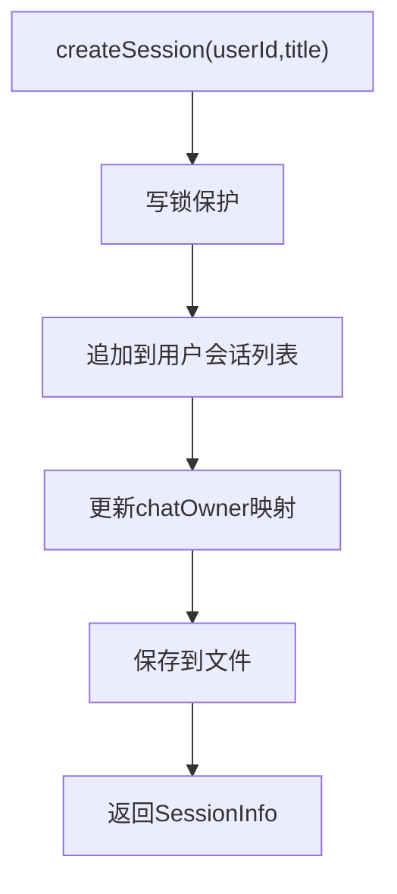

**图表来源**
- [SessionManager.java:68-81](file://src/main/java/com/yupi/yuaiagent/session/SessionManager.java#L68-L81)
- [SessionManager.java:269-279](file://src/main/java/com/yupi/yuaiagent/session/SessionManager.java#L269-L279)

**章节来源**
- [SessionManager.java:29-309](file://src/main/java/com/yupi/yuaiagent/session/SessionManager.java#L29-L309)

### AuthService 分析
- 设计要点
  - 支持URL参数token与Authorization头两种来源
  - 校验失败统一抛出401业务异常
  - 调用方无需空指针判断
- 复杂度
  - O(1)

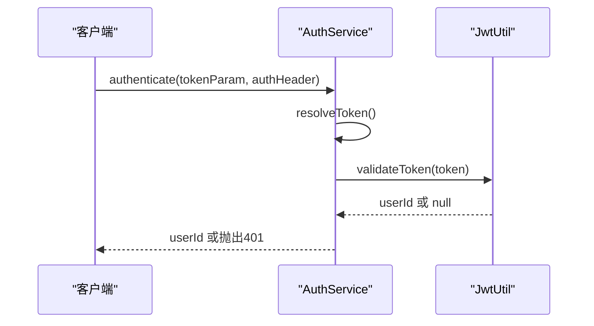

**图表来源**
- [AuthService.java:32-42](file://src/main/java/com/yupi/yuaiagent/auth/AuthService.java#L32-L42)

**章节来源**
- [AuthService.java:17-53](file://src/main/java/com/yupi/yuaiagent/auth/AuthService.java#L17-L53)

### CalendarService 分析
- 设计要点
  - 抽象飞书/钉钉等企业日历差异
  - 提供事件创建、取消、修改与可用性检查
  - 异常向上抛出，由上层处理
- 扩展策略
  - 通过配置选择提供商，新增提供商只需实现接口并注册

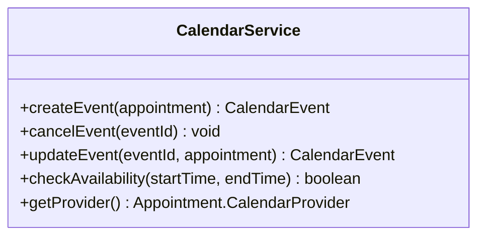

**图表来源**
- [CalendarService.java:14-75](file://src/main/java/com/yupi/yuaiagent/calendar/CalendarService.java#L14-L75)

**章节来源**
- [CalendarService.java:14-75](file://src/main/java/com/yupi/yuaiagent/calendar/CalendarService.java#L14-L75)

### UsageTracker 分析
- 设计要点
  - 文件JSON追加存储，初始化加载历史
  - 提供按用户统计（事件类型、代理类型、每日计数、总时长）
- 复杂度
  - 记录O(1)，统计O(n)

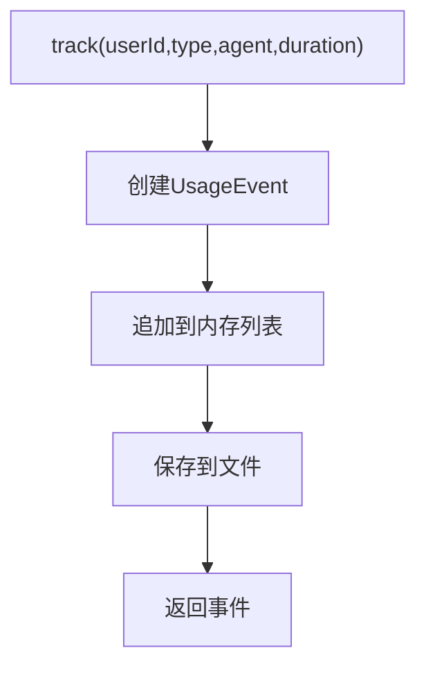

**图表来源**
- [UsageTracker.java:55-67](file://src/main/java/com/yupi/yuaiagent/usage/UsageTracker.java#L55-L67)
- [UsageTracker.java:115-133](file://src/main/java/com/yupi/yuaiagent/usage/UsageTracker.java#L115-L133)

**章节来源**
- [UsageTracker.java:29-143](file://src/main/java/com/yupi/yuaiagent/usage/UsageTracker.java#L29-L143)

### PersistentMessageRepository 分析
- 设计要点
  - 双索引：chatId→消息列表、messageId→消息
  - 压缩支持：替换为摘要+最近N条消息
  - 文件JSON按会话存储
- 复杂度
  - 保存O(1)，查询O(n)，压缩O(n)

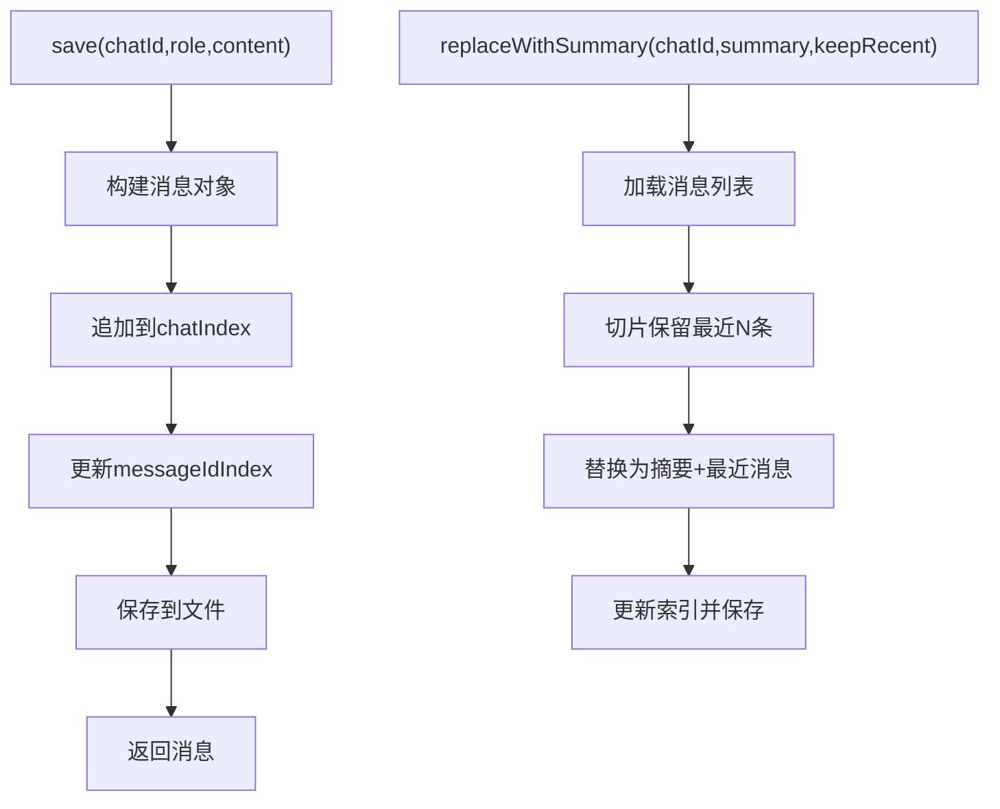

**图表来源**
- [PersistentMessageRepository.java:72-106](file://src/main/java/com/yupi/yuaiagent/message/PersistentMessageRepository.java#L72-L106)
- [PersistentMessageRepository.java:157-186](file://src/main/java/com/yupi/yuaiagent/message/PersistentMessageRepository.java#L157-L186)

**章节来源**
- [PersistentMessageRepository.java:34-229](file://src/main/java/com/yupi/yuaiagent/message/PersistentMessageRepository.java#L34-L229)

## 依赖关系分析
- 组件耦合
  - ChatMemoryManager依赖PersistentMessageRepository进行消息持久化与压缩
  - UserProfileService依赖PersistentMessageRepository进行画像持久化
  - ArtifactShelf依赖TraceRepository进行交付物与追踪关联（间接）
  - SessionManager与TraceRepository共同维护会话与追踪的用户维度
  - AuthService为SessionManager等组件提供鉴权支持
- 外部依赖
  - 文件系统：各仓库均采用本地JSON文件存储
  - 第三方SDK：CalendarService通过提供商SDK实现具体API调用

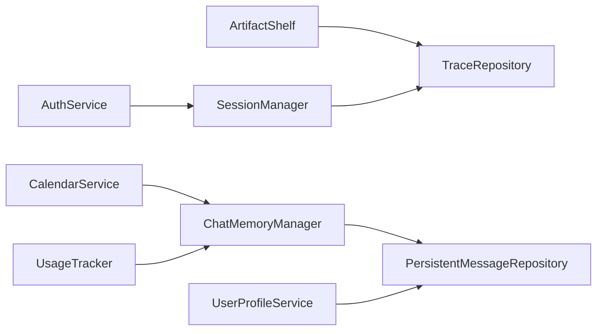

**图表来源**
- [ChatMemoryManager.java:79-86](file://src/main/java/com/yupi/yuaiagent/chatmemory/ChatMemoryManager.java#L79-L86)
- [PersistentMessageRepository.java:109-186](file://src/main/java/com/yupi/yuaiagent/message/PersistentMessageRepository.java#L109-L186)
- [UserProfileService.java:49-61](file://src/main/java/com/yupi/yuaiagent/profile/UserProfileService.java#L49-L61)
- [ArtifactShelf.java:28-29](file://src/main/java/com/yupi/yuaiagent/artifact/ArtifactShelf.java#L28-L29)
- [TraceRepository.java:73-83](file://src/main/java/com/yupi/yuaiagent/trace/TraceRepository.java#L73-L83)
- [SessionManager.java:68-81](file://src/main/java/com/yupi/yuaiagent/session/SessionManager.java#L68-L81)
- [AuthService.java:32-42](file://src/main/java/com/yupi/yuaiagent/auth/AuthService.java#L32-L42)
- [CalendarService.java:14-75](file://src/main/java/com/yupi/yuaiagent/calendar/CalendarService.java#L14-L75)
- [UsageTracker.java:55-67](file://src/main/java/com/yupi/yuaiagent/usage/UsageTracker.java#L55-L67)

**章节来源**
- [ChatMemoryManager.java:36-340](file://src/main/java/com/yupi/yuaiagent/chatmemory/ChatMemoryManager.java#L36-L340)
- [UserProfileService.java:26-94](file://src/main/java/com/yupi/yuaiagent/profile/UserProfileService.java#L26-L94)
- [ArtifactShelf.java:24-129](file://src/main/java/com/yupi/yuaiagent/artifact/ArtifactShelf.java#L24-L129)
- [TraceRepository.java:35-243](file://src/main/java/com/yupi/yuaiagent/trace/TraceRepository.java#L35-L243)
- [SessionManager.java:29-309](file://src/main/java/com/yupi/yuaiagent/session/SessionManager.java#L29-L309)
- [AuthService.java:17-53](file://src/main/java/com/yupi/yuaiagent/auth/AuthService.java#L17-L53)
- [CalendarService.java:14-75](file://src/main/java/com/yupi/yuaiagent/calendar/CalendarService.java#L14-L75)
- [UsageTracker.java:29-143](file://src/main/java/com/yupi/yuaiagent/usage/UsageTracker.java#L29-L143)
- [PersistentMessageRepository.java:34-229](file://src/main/java/com/yupi/yuaiagent/message/PersistentMessageRepository.java#L34-L229)

## 性能考虑
- 存储与并发
  - 读写锁保护：TraceRepository、SessionManager、PersistentMessageRepository均采用读写锁，提升并发读性能
  - 文件JSON：单文件存储，适合中小规模数据；大规模场景建议迁移到数据库
- 压缩与索引
  - ChatMemoryManager自动压缩阈值可配置，避免Token/轮数超限导致响应延迟
  - PersistentMessageRepository双索引支持O(1)消息定位，但压缩时需重建索引
- 异步处理
  - UserProfileService异步更新画像，避免阻塞对话响应
  - UsageTracker追加写入，统计聚合O(n)
- 缓存与持久化
  - ChatMemoryManager缓存不同类型记忆实例，减少重复创建
  - SessionManager与TraceRepository均提供初始化加载，启动时恢复状态

[本节为通用性能指导，不直接分析具体文件]

## 故障排查指南
- 记忆压缩失败
  - 现象：自动压缩触发后仍继续响应，日志出现错误
  - 排查：检查压缩状态消息推送是否被消费端吞掉；确认磁盘空间与文件权限
  - 参考路径：[ChatMemoryManager.java:177-182](file://src/main/java/com/yupi/yuaiagent/chatmemory/ChatMemoryManager.java#L177-L182)
- 画像更新异常
  - 现象：用户画像未更新或异常
  - 排查：查看UserProfileService日志，确认抽取与合并是否抛出异常
  - 参考路径：[UserProfileService.java:56-60](file://src/main/java/com/yupi/yuaiagent/profile/UserProfileService.java#L56-L60)
- 交付物查询为空
  - 现象：按条件查询无结果
  - 排查：确认查询条件是否为null；核对作用域与参数校验
  - 参考路径：[ArtifactShelf.java:79-93](file://src/main/java/com/yupi/yuaiagent/artifact/ArtifactShelf.java#L79-L93)
- 追踪数据丢失
  - 现象：保存后查询不到或被清理
  - 排查：检查保留策略配置与文件权限；确认初始化是否成功
  - 参考路径：[TraceRepository.java:163-191](file://src/main/java/com/yupi/yuaiagent/trace/TraceRepository.java#L163-L191)
- 会话权限问题
  - 现象：非拥有者操作会话
  - 排查：确认chatId→userId映射是否正确；检查鉴权流程
  - 参考路径：[SessionManager.java:124-126](file://src/main/java/com/yupi/yuaiagent/session/SessionManager.java#L124-L126)
- 鉴权失败
  - 现象：401未登录
  - 排查：确认token来源（URL参数或Authorization头）；检查JWT有效性
  - 参考路径：[AuthService.java:32-42](file://src/main/java/com/yupi/yuaiagent/auth/AuthService.java#L32-L42)
- 日历服务异常
  - 现象：创建/取消/修改事件失败
  - 排查：检查提供商配置与网络连通性；捕获CalendarException并记录日志
  - 参考路径：[CalendarService.java:65-74](file://src/main/java/com/yupi/yuaiagent/calendar/CalendarService.java#L65-L74)
- 使用统计异常
  - 现象：统计结果不准确
  - 排查：确认事件记录是否成功写入；检查文件权限
  - 参考路径：[UsageTracker.java:115-133](file://src/main/java/com/yupi/yuaiagent/usage/UsageTracker.java#L115-L133)
- 消息持久化异常
  - 现象：消息保存失败或丢失
  - 排查：检查存储目录权限；确认文件写入是否抛出IO异常
  - 参考路径：[PersistentMessageRepository.java:190-197](file://src/main/java/com/yupi/yuaiagent/message/PersistentMessageRepository.java#L190-L197)

**章节来源**
- [ChatMemoryManager.java:177-182](file://src/main/java/com/yupi/yuaiagent/chatmemory/ChatMemoryManager.java#L177-L182)
- [UserProfileService.java:56-60](file://src/main/java/com/yupi/yuaiagent/profile/UserProfileService.java#L56-L60)
- [ArtifactShelf.java:79-93](file://src/main/java/com/yupi/yuaiagent/artifact/ArtifactShelf.java#L79-L93)
- [TraceRepository.java:163-191](file://src/main/java/com/yupi/yuaiagent/trace/TraceRepository.java#L163-L191)
- [SessionManager.java:124-126](file://src/main/java/com/yupi/yuaiagent/session/SessionManager.java#L124-L126)
- [AuthService.java:32-42](file://src/main/java/com/yupi/yuaiagent/auth/AuthService.java#L32-L42)
- [CalendarService.java:65-74](file://src/main/java/com/yupi/yuaiagent/calendar/CalendarService.java#L65-L74)
- [UsageTracker.java:115-133](file://src/main/java/com/yupi/yuaiagent/usage/UsageTracker.java#L115-L133)
- [PersistentMessageRepository.java:190-197](file://src/main/java/com/yupi/yuaiagent/message/PersistentMessageRepository.java#L190-L197)

## 结论
基础设施层通过模块化的组件设计实现了“统一入口、可扩展、可观测”的目标：
- ChatMemoryManager与PersistentMessageRepository确保对话记忆的可靠与高效
- UserProfileService提供异步画像更新，增强个性化体验
- ArtifactShelf与TraceRepository支撑交付物与追踪数据的统一管理
- SessionManager与AuthService完善会话生命周期与鉴权控制
- CalendarService、UsageTracker与日志体系共同构成完整的可观测性基础

建议在生产环境中结合配置文件进行容量规划与监控告警，逐步引入数据库与分布式缓存以满足更大规模需求。

[本节为总结性内容，不直接分析具体文件]

## 附录

### 基础设施配置要点
- 应用配置文件
  - [application.yml](file://src/main/resources/application.yml)
  - [application-prod.yml](file://src/main/resources/application-prod.yml)
- 关键配置项（示例）
  - 会话存储目录：session.storage.dir
  - 追踪存储目录：trace.storage.dir
  - 交付物存储目录：artifact.storage.dir
  - 每用户最大追踪数：trace.maxTracesPerUser
  - 日历提供商：calendar.provider（FEISHU/DINGTALK）

**章节来源**
- [application.yml](file://src/main/resources/application.yml)
- [application-prod.yml](file://src/main/resources/application-prod.yml)

### 运维指南
- 目录与权限
  - 确保存储目录具备读写权限；监控磁盘空间
- 备份策略
  - 定期备份JSON文件；验证恢复流程
- 监控指标
  - 记忆压缩成功率、追踪保留命中率、会话数量与大小
- 扩展建议
  - 大规模场景迁移至数据库；引入缓存与异步队列
  - 增加健康检查与熔断降级

[本节为通用运维建议，不直接分析具体文件]