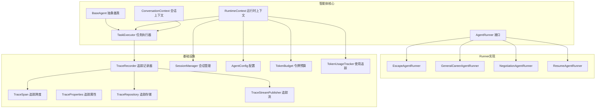
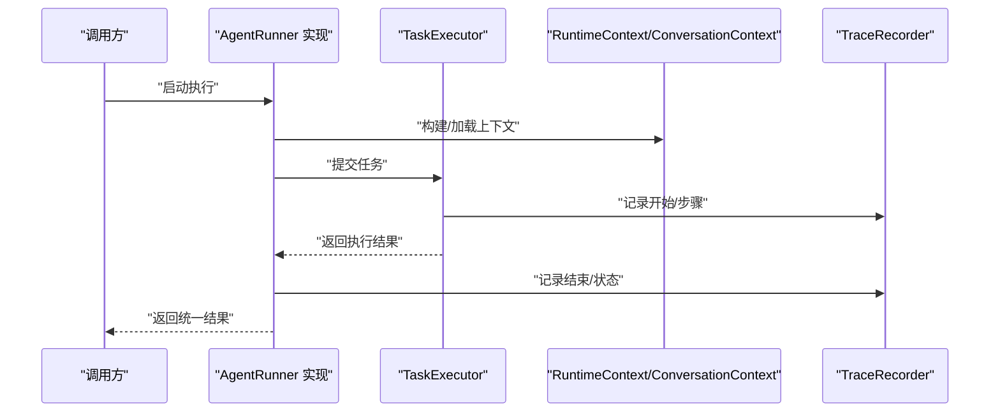
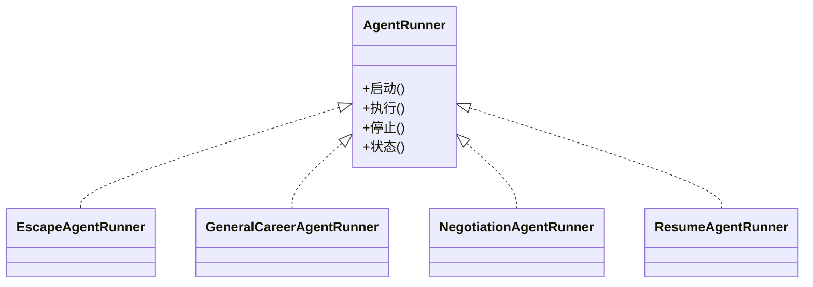
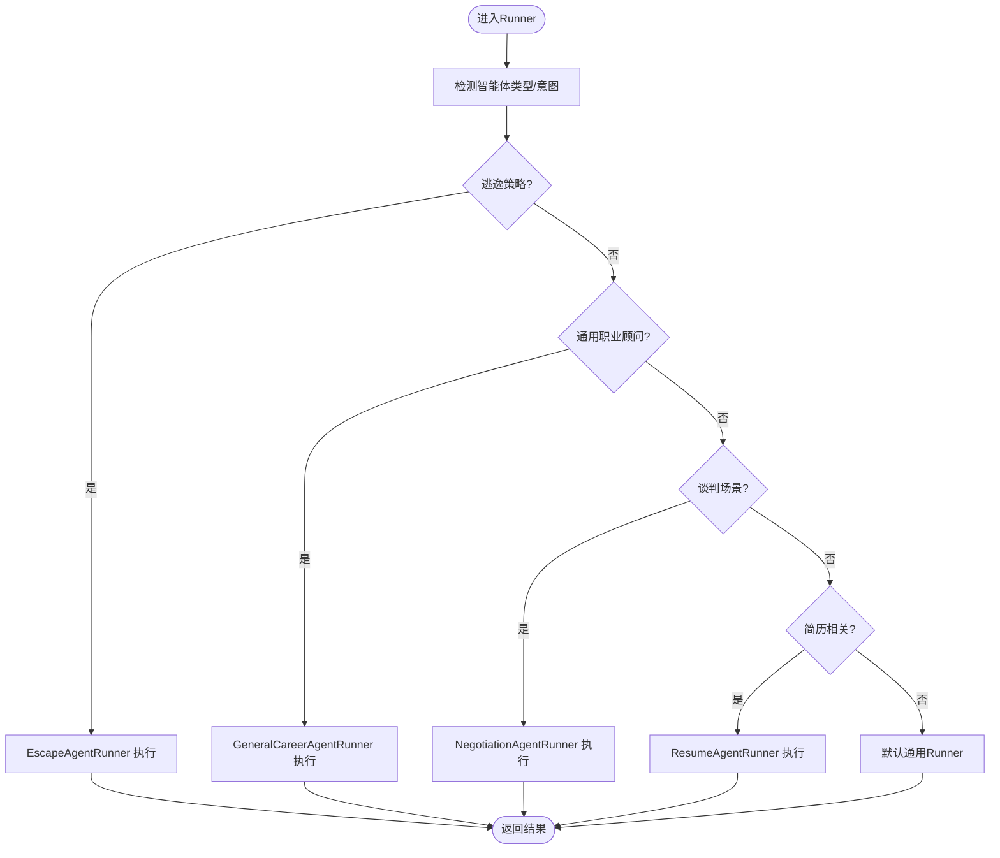
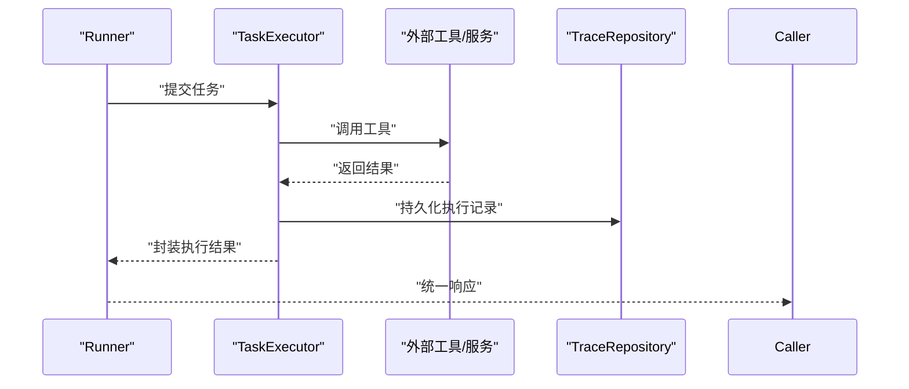
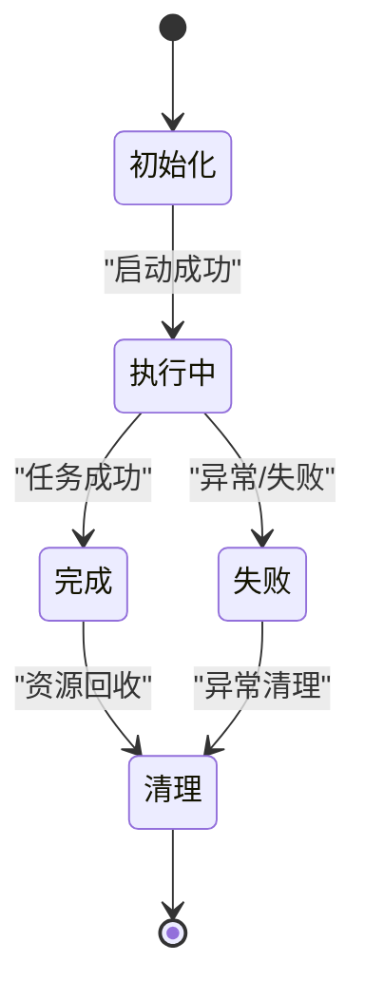
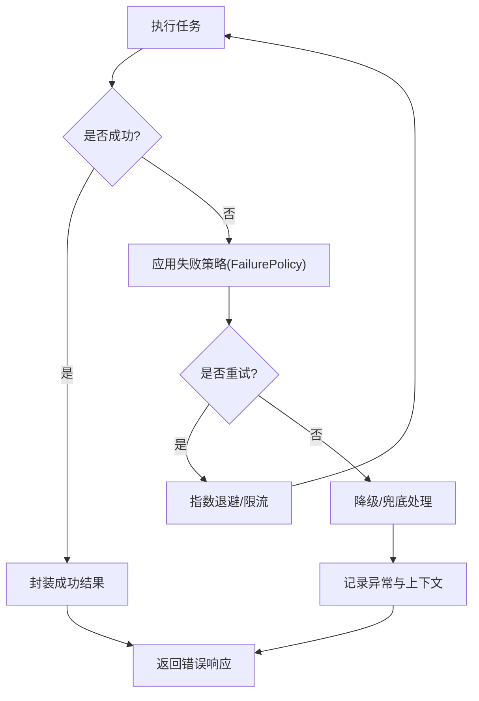
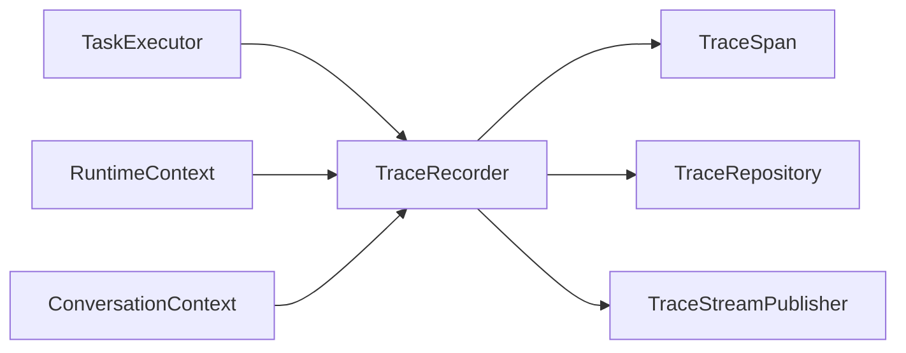
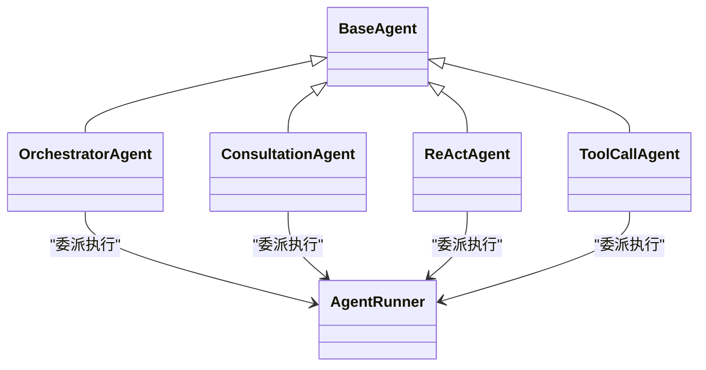
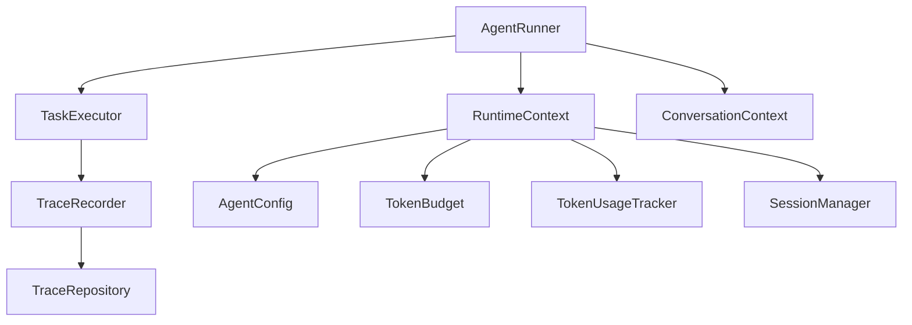

# AgentRunner适配器

<cite>
**本文引用的文件**
- [AgentRunner.java](file://src/main/java/com/yupi/yuaiagent/agent/AgentRunner.java)
- [EscapeAgentRunner.java](file://src/main/java/com/yupi/yuaiagent/agent/runner/EscapeAgentRunner.java)
- [GeneralCareerAgentRunner.java](file://src/main/java/com/yupi/yuaiagent/agent/runner/GeneralCareerAgentRunner.java)
- [NegotiationAgentRunner.java](file://src/main/java/com/yupi/yuaiagent/agent/runner/NegotiationAgentRunner.java)
- [ResumeAgentRunner.java](file://src/main/java/com/yupi/yuaiagent/agent/runner/ResumeAgentRunner.java)
- [BaseAgent.java](file://src/main/java/com/yupi/yuaiagent/agent/BaseAgent.java)
- [TaskExecutor.java](file://src/main/java/com/yupi/yuaiagent/agent/TaskExecutor.java)
- [ExecutionResult.java](file://src/main/java/com/yupi/yuaiagent/agent/task/ExecutionResult.java)
- [FailurePolicy.java](file://src/main/java/com/yupi/yuaiagent/agent/task/FailurePolicy.java)
- [TaskStatus.java](file://src/main/java/com/yupi/yuaiagent/agent/task/TaskStatus.java)
- [AgentState.java](file://src/main/java/com/yupi/yuaiagent/agent/model/AgentState.java)
- [OrchestratorAgent.java](file://src/main/java/com/yupi/yuaiagent/agent/OrchestratorAgent.java)
- [YuManus.java](file://src/main/java/com/yupi/yuaiagent/agent/YuManus.java)
- [ConsultationAgent.java](file://src/main/java/com/yupi/yuaiagent/agent/ConsultationAgent.java)
- [ReActAgent.java](file://src/main/java/com/yupi/yuaiagent/agent/ReActAgent.java)
- [ToolCallAgent.java](file://src/main/java/com/yupi/yuaiagent/agent/ToolCallAgent.java)
- [Result.java](file://src/main/java/com/yupi/yuaiagent/common/Result.java)
- [Response.java](file://src/main/java/com/yupi/yuaiagent/common/Response.java)
- [GlobalExceptionHandler.java](file://src/main/java/com/yupi/yuaiagent/exception/GlobalExceptionHandler.java)
- [TraceRecorder.java](file://src/main/java/com/yupi/yuaiagent/trace/TraceRecorder.java)
- [TraceContext.java](file://src/main/java/com/yupi/yuaiagent/trace/TraceContext.java)
- [TraceSpan.java](file://src/main/java/com/yupi/yuaiagent/trace/model/TraceSpan.java)
- [TraceStatus.java](file://src/main/java/com/yupi/yuaiagent/trace/model/TraceStatus.java)
- [TraceStepStatus.java](file://src/main/java/com/yupi/yuaiagent/trace/model/TraceStepStatus.java)
- [TraceStepType.java](file://src/main/java/com/yupi/yuaiagent/trace/model/TraceStepType.java)
- [TraceRepository.java](file://src/main/java/com/yupi/yuaiagent/trace/TraceRepository.java)
- [TraceStreamPublisher.java](file://src/main/java/com/yupi/yuaiagent/trace/TraceStreamPublisher.java)
- [RuntimeContext.java](file://src/main/java/com/yupi/yuaiagent/context/RuntimeContext.java)
- [ConversationContext.java](file://src/main/java/com/yupi/yuaiagent/context/ConversationContext.java)
- [ConversationContextBuilder.java](file://src/main/java/com/yupi/yuaiagent/context/ConversationContextBuilder.java)
- [AgentConfig.java](file://src/main/java/com/yupi/yuaiagent/config/AgentConfig.java)
- [TokenBudget.java](file://src/main/java/com/yupi/yuaiagent/budget/TokenBudget.java)
- [TokenUsageTracker.java](file://src/main/java/com/yupi/yuaiagent/budget/TokenUsageTracker.java)
- [SessionManager.java](file://src/main/java/com/yupi/yuaiagent/session/SessionManager.java)
- [SessionStatus.java](file://src/main/java/com/yupi/yuaiagent/session/SessionStatus.java)
- [AiAgentApplication.java](file://src/main/java/com/yupi/yuaiagent/AiAgentApplication.java)
</cite>

## 目录
1. [引言](#引言)
2. [项目结构](#项目结构)
3. [核心组件](#核心组件)
4. [架构总览](#架构总览)
5. [详细组件分析](#详细组件分析)
6. [依赖关系分析](#依赖关系分析)
7. [性能考虑](#性能考虑)
8. [故障排查指南](#故障排查指南)
9. [结论](#结论)
10. [附录](#附录)

## 引言
本文件面向AgentRunner适配器系统，系统性阐述适配器模式在智能体运行中的作用与设计原理，重点说明AgentRunner接口的统一抽象、各类Runner实现的差异化逻辑与运行时切换机制；解释适配器如何处理不同智能体类型的差异性、标准化执行流程与异常处理策略；梳理Runner的生命周期管理、状态转换与资源清理机制；并提供扩展指南、自定义Runner开发与性能优化建议。

## 项目结构
AgentRunner适配器位于智能体模块的runner包下，配合通用Agent基类、任务执行器、上下文与追踪等基础设施协同工作。整体采用“接口抽象 + 多实现适配”的分层设计，便于在不改变上层调用方式的前提下替换或扩展具体Runner。

图表来源
- [AgentRunner.java](file://src/main/java/com/yupi/yuaiagent/agent/AgentRunner.java)
- [EscapeAgentRunner.java](file://src/main/java/com/yupi/yuaiagent/agent/runner/EscapeAgentRunner.java)
- [GeneralCareerAgentRunner.java](file://src/main/java/com/yupi/yuaiagent/agent/runner/GeneralCareerAgentRunner.java)
- [NegotiationAgentRunner.java](file://src/main/java/com/yupi/yuaiagent/agent/runner/NegotiationAgentRunner.java)
- [ResumeAgentRunner.java](file://src/main/java/com/yupi/yuaiagent/agent/runner/ResumeAgentRunner.java)
- [BaseAgent.java](file://src/main/java/com/yupi/yuaiagent/agent/BaseAgent.java)
- [TaskExecutor.java](file://src/main/java/com/yupi/yuaiagent/agent/TaskExecutor.java)
- [TraceRecorder.java](file://src/main/java/com/yupi/yuaiagent/trace/TraceRecorder.java)
- [TraceSpan.java](file://src/main/java/com/yupi/yuaiagent/trace/model/TraceSpan.java)
- [TraceRepository.java](file://src/main/java/com/yupi/yuaiagent/trace/TraceRepository.java)
- [TraceStreamPublisher.java](file://src/main/java/com/yupi/yuaiagent/trace/TraceStreamPublisher.java)
- [RuntimeContext.java](file://src/main/java/com/yupi/yuaiagent/context/RuntimeContext.java)
- [ConversationContext.java](file://src/main/java/com/yupi/yuaiagent/context/ConversationContext.java)
- [AgentConfig.java](file://src/main/java/com/yupi/yuaiagent/config/AgentConfig.java)
- [TokenBudget.java](file://src/main/java/com/yupi/yuaiagent/budget/TokenBudget.java)
- [TokenUsageTracker.java](file://src/main/java/com/yupi/yuaiagent/budget/TokenUsageTracker.java)
- [SessionManager.java](file://src/main/java/com/yupi/yuaiagent/session/SessionManager.java)

章节来源
- [AgentRunner.java](file://src/main/java/com/yupi/yuaiagent/agent/AgentRunner.java)
- [BaseAgent.java](file://src/main/java/com/yupi/yuaiagent/agent/BaseAgent.java)
- [TaskExecutor.java](file://src/main/java/com/yupi/yuaiagent/agent/TaskExecutor.java)
- [RuntimeContext.java](file://src/main/java/com/yupi/yuaiagent/context/RuntimeContext.java)
- [ConversationContext.java](file://src/main/java/com/yupi/yuaiagent/context/ConversationContext.java)

## 核心组件
- AgentRunner接口：定义统一的Runner抽象，约束执行入口、状态管理与生命周期钩子，确保不同Runner可被无差别调度与替换。
- 各Runner实现：针对特定业务场景（如求职、谈判、简历、逃逸）封装差异化执行策略、工具链与决策逻辑。
- BaseAgent与TaskExecutor：提供通用的智能体行为与任务执行框架，Runner通过它们完成实际工作。
- 上下文与配置：RuntimeContext/ConversationContext承载运行时信息；AgentConfig、TokenBudget/TokenUsageTracker提供资源与预算控制。
- 追踪与会话：TraceRecorder/TraceSpan/TraceRepository/TraceStreamPublisher负责执行轨迹记录与流式输出；SessionManager维护会话状态。

章节来源
- [AgentRunner.java](file://src/main/java/com/yupi/yuaiagent/agent/AgentRunner.java)
- [EscapeAgentRunner.java](file://src/main/java/com/yupi/yuaiagent/agent/runner/EscapeAgentRunner.java)
- [GeneralCareerAgentRunner.java](file://src/main/java/com/yupi/yuaiagent/agent/runner/GeneralCareerAgentRunner.java)
- [NegotiationAgentRunner.java](file://src/main/java/com/yupi/yuaiagent/agent/runner/NegotiationAgentRunner.java)
- [ResumeAgentRunner.java](file://src/main/java/com/yupi/yuaiagent/agent/runner/ResumeAgentRunner.java)
- [BaseAgent.java](file://src/main/java/com/yupi/yuaiagent/agent/BaseAgent.java)
- [TaskExecutor.java](file://src/main/java/com/yupi/yuaiagent/agent/TaskExecutor.java)
- [RuntimeContext.java](file://src/main/java/com/yupi/yuaiagent/context/RuntimeContext.java)
- [ConversationContext.java](file://src/main/java/com/yupi/yuaiagent/context/ConversationContext.java)
- [AgentConfig.java](file://src/main/java/com/yupi/yuaiagent/config/AgentConfig.java)
- [TokenBudget.java](file://src/main/java/com/yupi/yuaiagent/budget/TokenBudget.java)
- [TokenUsageTracker.java](file://src/main/java/com/yupi/yuaiagent/budget/TokenUsageTracker.java)
- [TraceRecorder.java](file://src/main/java/com/yupi/yuaiagent/trace/TraceRecorder.java)
- [TraceRepository.java](file://src/main/java/com/yupi/yuaiagent/trace/TraceRepository.java)
- [TraceStreamPublisher.java](file://src/main/java/com/yupi/yuaiagent/trace/TraceStreamPublisher.java)
- [SessionManager.java](file://src/main/java/com/yupi/yuaiagent/session/SessionManager.java)

## 架构总览
适配器模式在此系统中的核心价值在于“统一接口 + 多态实现”。上层仅依赖AgentRunner接口进行调度，具体Runner由业务意图、配置或运行时上下文动态选择。执行流程通过TaskExecutor标准化，结合上下文与追踪，形成可观察、可治理的闭环。

图表来源
- [AgentRunner.java](file://src/main/java/com/yupi/yuaiagent/agent/AgentRunner.java)
- [TaskExecutor.java](file://src/main/java/com/yupi/yuaiagent/agent/TaskExecutor.java)
- [TraceRecorder.java](file://src/main/java/com/yupi/yuaiagent/trace/TraceRecorder.java)
- [RuntimeContext.java](file://src/main/java/com/yupi/yuaiagent/context/RuntimeContext.java)
- [ConversationContext.java](file://src/main/java/com/yupi/yuaiagent/context/ConversationContext.java)

## 详细组件分析

### AgentRunner接口与适配器职责
- 统一抽象：定义Runner的生命周期钩子、执行入口与状态管理接口，屏蔽具体实现差异。
- 适配器职责：将不同智能体类型（求职顾问、面试谈判、简历助手、逃逸策略）的差异化逻辑封装为统一Runner，供上层按需调用。
- 运行时切换：通过配置、意图识别或上下文参数决定选用哪个Runner实现，实现“同一接口，多态执行”。

图表来源
- [AgentRunner.java](file://src/main/java/com/yupi/yuaiagent/agent/AgentRunner.java)
- [EscapeAgentRunner.java](file://src/main/java/com/yupi/yuaiagent/agent/runner/EscapeAgentRunner.java)
- [GeneralCareerAgentRunner.java](file://src/main/java/com/yupi/yuaiagent/agent/runner/GeneralCareerAgentRunner.java)
- [NegotiationAgentRunner.java](file://src/main/java/com/yupi/yuaiagent/agent/runner/NegotiationAgentRunner.java)
- [ResumeAgentRunner.java](file://src/main/java/com/yupi/yuaiagent/agent/runner/ResumeAgentRunner.java)

章节来源
- [AgentRunner.java](file://src/main/java/com/yupi/yuaiagent/agent/AgentRunner.java)

### 各Runner实现的差异化逻辑
- EscapeAgentRunner：聚焦“逃逸”策略，可能包含规避风险、快速退出、降级处理等逻辑，强调稳健性与安全性。
- GeneralCareerAgentRunner：通用职业顾问型Runner，覆盖常见咨询与规划场景，强调流程化与可复用性。
- NegotiationAgentRunner：谈判型Runner，强调策略性对话、条件拆解与让步边界，注重交互质量与目标达成。
- ResumeAgentRunner：简历相关Runner，强调结构化解析、内容优化与格式标准化，注重产出质量与一致性。

图表来源
- [EscapeAgentRunner.java](file://src/main/java/com/yupi/yuaiagent/agent/runner/EscapeAgentRunner.java)
- [GeneralCareerAgentRunner.java](file://src/main/java/com/yupi/yuaiagent/agent/runner/GeneralCareerAgentRunner.java)
- [NegotiationAgentRunner.java](file://src/main/java/com/yupi/yuaiagent/agent/runner/NegotiationAgentRunner.java)
- [ResumeAgentRunner.java](file://src/main/java/com/yupi/yuaiagent/agent/runner/ResumeAgentRunner.java)

章节来源
- [EscapeAgentRunner.java](file://src/main/java/com/yupi/yuaiagent/agent/runner/EscapeAgentRunner.java)
- [GeneralCareerAgentRunner.java](file://src/main/java/com/yupi/yuaiagent/agent/runner/GeneralCareerAgentRunner.java)
- [NegotiationAgentRunner.java](file://src/main/java/com/yupi/yuaiagent/agent/runner/NegotiationAgentRunner.java)
- [ResumeAgentRunner.java](file://src/main/java/com/yupi/yuaiagent/agent/runner/ResumeAgentRunner.java)

### 执行流程与标准化
- 统一入口：所有Runner均通过AgentRunner接口暴露统一的启动/执行/停止能力。
- 任务执行：Runner将高层意图转化为具体任务，交由TaskExecutor执行，确保工具调用、状态更新与异常捕获的一致性。
- 结果封装：执行结果以统一的数据结构返回，便于上层编排与后续处理。

图表来源
- [AgentRunner.java](file://src/main/java/com/yupi/yuaiagent/agent/AgentRunner.java)
- [TaskExecutor.java](file://src/main/java/com/yupi/yuaiagent/agent/TaskExecutor.java)
- [TraceRepository.java](file://src/main/java/com/yupi/yuaiagent/trace/TraceRepository.java)

章节来源
- [AgentRunner.java](file://src/main/java/com/yupi/yuaiagent/agent/AgentRunner.java)
- [TaskExecutor.java](file://src/main/java/com/yupi/yuaiagent/agent/TaskExecutor.java)

### 生命周期管理、状态转换与资源清理
- 生命周期：Runner在启动前准备上下文与资源，执行期间受控于TaskExecutor与追踪系统，结束后进行资源回收与状态落盘。
- 状态模型：Runner内部维护状态机（如初始化、执行中、完成、失败），并与TaskStatus/TraceStatus保持一致映射。
- 资源清理：通过上下文与会话管理器确保临时资源释放，避免泄漏；追踪系统负责最终归档。

图表来源
- [AgentState.java](file://src/main/java/com/yupi/yuaiagent/agent/model/AgentState.java)
- [TaskStatus.java](file://src/main/java/com/yupi/yuaiagent/agent/task/TaskStatus.java)
- [TraceStatus.java](file://src/main/java/com/yupi/yuaiagent/trace/model/TraceStatus.java)
- [SessionStatus.java](file://src/main/java/com/yupi/yuaiagent/session/SessionStatus.java)

章节来源
- [AgentState.java](file://src/main/java/com/yupi/yuaiagent/agent/model/AgentState.java)
- [TaskStatus.java](file://src/main/java/com/yupi/yuaiagent/agent/task/TaskStatus.java)
- [TraceStatus.java](file://src/main/java/com/yupi/yuaiagent/trace/model/TraceStatus.java)
- [SessionStatus.java](file://src/main/java/com/yupi/yuaiagent/session/SessionStatus.java)

### 异常处理策略
- 统一异常：Runner与TaskExecutor对异常进行捕获与包装，遵循FailurePolicy策略决定重试、降级或终止。
- 全局异常：GlobalExceptionHandler提供全局兜底，保证错误响应与日志输出的一致性。
- 追踪异常：TraceRecorder记录异常发生点与上下文，便于回溯与审计。

图表来源
- [FailurePolicy.java](file://src/main/java/com/yupi/yuaiagent/agent/task/FailurePolicy.java)
- [GlobalExceptionHandler.java](file://src/main/java/com/yupi/yuaiagent/exception/GlobalExceptionHandler.java)
- [TraceRecorder.java](file://src/main/java/com/yupi/yuaiagent/trace/TraceRecorder.java)

章节来源
- [FailurePolicy.java](file://src/main/java/com/yupi/yuaiagent/agent/task/FailurePolicy.java)
- [GlobalExceptionHandler.java](file://src/main/java/com/yupi/yuaiagent/exception/GlobalExceptionHandler.java)
- [TraceRecorder.java](file://src/main/java/com/yupi/yuaiagent/trace/TraceRecorder.java)

### 追踪与可观测性
- 追踪记录：TraceRecorder在关键节点写入TraceSpan，记录步骤类型、状态与耗时。
- 流式输出：TraceStreamPublisher将执行过程推送到前端或下游系统，支持实时可视化。
- 存储归档：TraceRepository持久化轨迹，TraceContext提供跨线程/跨组件的上下文传递。

图表来源
- [TraceRecorder.java](file://src/main/java/com/yupi/yuaiagent/trace/TraceRecorder.java)
- [TraceSpan.java](file://src/main/java/com/yupi/yuaiagent/trace/model/TraceSpan.java)
- [TraceRepository.java](file://src/main/java/com/yupi/yuaiagent/trace/TraceRepository.java)
- [TraceStreamPublisher.java](file://src/main/java/com/yupi/yuaiagent/trace/TraceStreamPublisher.java)
- [TraceContext.java](file://src/main/java/com/yupi/yuaiagent/trace/TraceContext.java)
- [RuntimeContext.java](file://src/main/java/com/yupi/yuaiagent/context/RuntimeContext.java)
- [ConversationContext.java](file://src/main/java/com/yupi/yuaiagent/context/ConversationContext.java)

章节来源
- [TraceRecorder.java](file://src/main/java/com/yupi/yuaiagent/trace/TraceRecorder.java)
- [TraceSpan.java](file://src/main/java/com/yupi/yuaiagent/trace/model/TraceSpan.java)
- [TraceRepository.java](file://src/main/java/com/yupi/yuaiagent/trace/TraceRepository.java)
- [TraceStreamPublisher.java](file://src/main/java/com/yupi/yuaiagent/trace/TraceStreamPublisher.java)
- [TraceContext.java](file://src/main/java/com/yupi/yuaiagent/trace/TraceContext.java)
- [RuntimeContext.java](file://src/main/java/com/yupi/yuaiagent/context/RuntimeContext.java)
- [ConversationContext.java](file://src/main/java/com/yupi/yuaiagent/context/ConversationContext.java)

### 与智能体家族的协作
- OrchestratorAgent/ConsultationAgent/ReActAgent/ToolCallAgent等作为更高层的编排与执行主体，Runner作为其底层执行单元，提供统一的适配能力。
- BaseAgent提供通用能力，Runner在其之上叠加业务特性。

图表来源
- [BaseAgent.java](file://src/main/java/com/yupi/yuaiagent/agent/BaseAgent.java)
- [OrchestratorAgent.java](file://src/main/java/com/yupi/yuaiagent/agent/OrchestratorAgent.java)
- [ConsultationAgent.java](file://src/main/java/com/yupi/yuaiagent/agent/ConsultationAgent.java)
- [ReActAgent.java](file://src/main/java/com/yupi/yuaiagent/agent/ReActAgent.java)
- [ToolCallAgent.java](file://src/main/java/com/yupi/yuaiagent/agent/ToolCallAgent.java)
- [AgentRunner.java](file://src/main/java/com/yupi/yuaiagent/agent/AgentRunner.java)

章节来源
- [BaseAgent.java](file://src/main/java/com/yupi/yuaiagent/agent/BaseAgent.java)
- [OrchestratorAgent.java](file://src/main/java/com/yupi/yuaiagent/agent/OrchestratorAgent.java)
- [ConsultationAgent.java](file://src/main/java/com/yupi/yuaiagent/agent/ConsultationAgent.java)
- [ReActAgent.java](file://src/main/java/com/yupi/yuaiagent/agent/ReActAgent.java)
- [ToolCallAgent.java](file://src/main/java/com/yupi/yuaiagent/agent/ToolCallAgent.java)
- [AgentRunner.java](file://src/main/java/com/yupi/yuaiagent/agent/AgentRunner.java)

## 依赖关系分析
- Runner对TaskExecutor与上下文的依赖体现了“策略与执行分离”，提升内聚与可测试性。
- 追踪系统与会话管理器独立于Runner，通过接口耦合，降低侵入性。
- 配置与预算模块（AgentConfig、TokenBudget/TokenUsageTracker）为Runner提供资源约束，保障系统稳定性。

图表来源
- [AgentRunner.java](file://src/main/java/com/yupi/yuaiagent/agent/AgentRunner.java)
- [TaskExecutor.java](file://src/main/java/com/yupi/yuaiagent/agent/TaskExecutor.java)
- [RuntimeContext.java](file://src/main/java/com/yupi/yuaiagent/context/RuntimeContext.java)
- [ConversationContext.java](file://src/main/java/com/yupi/yuaiagent/context/ConversationContext.java)
- [AgentConfig.java](file://src/main/java/com/yupi/yuaiagent/config/AgentConfig.java)
- [TokenBudget.java](file://src/main/java/com/yupi/yuaiagent/budget/TokenBudget.java)
- [TokenUsageTracker.java](file://src/main/java/com/yupi/yuaiagent/budget/TokenUsageTracker.java)
- [SessionManager.java](file://src/main/java/com/yupi/yuaiagent/session/SessionManager.java)
- [TraceRecorder.java](file://src/main/java/com/yupi/yuaiagent/trace/TraceRecorder.java)
- [TraceRepository.java](file://src/main/java/com/yupi/yuaiagent/trace/TraceRepository.java)

章节来源
- [AgentRunner.java](file://src/main/java/com/yupi/yuaiagent/agent/AgentRunner.java)
- [TaskExecutor.java](file://src/main/java/com/yupi/yuaiagent/agent/TaskExecutor.java)
- [RuntimeContext.java](file://src/main/java/com/yupi/yuaiagent/context/RuntimeContext.java)
- [ConversationContext.java](file://src/main/java/com/yupi/yuaiagent/context/ConversationContext.java)
- [AgentConfig.java](file://src/main/java/com/yupi/yuaiagent/config/AgentConfig.java)
- [TokenBudget.java](file://src/main/java/com/yupi/yuaiagent/budget/TokenBudget.java)
- [TokenUsageTracker.java](file://src/main/java/com/yupi/yuaiagent/budget/TokenUsageTracker.java)
- [SessionManager.java](file://src/main/java/com/yupi/yuaiagent/session/SessionManager.java)
- [TraceRecorder.java](file://src/main/java/com/yupi/yuaiagent/trace/TraceRecorder.java)
- [TraceRepository.java](file://src/main/java/com/yupi/yuaiagent/trace/TraceRepository.java)

## 性能考虑
- 任务批量化：TaskExecutor应尽量合并同类任务，减少外部调用次数与上下文切换开销。
- 缓存与压缩：利用上下文与内存压缩策略降低传输与存储成本。
- 令牌预算：通过TokenBudget与TokenUsageTracker限制长链路调用，避免超预算导致的失败风暴。
- 追踪采样：TraceRecorder可按策略采样记录，平衡可观测性与性能。
- 并发与限流：在Runner与TaskExecutor层面实施并发控制与限流，防止资源争用。

## 故障排查指南
- 统一错误响应：使用Result/Response封装错误码与消息，便于前端与监控系统识别。
- 全局异常：GlobalExceptionHandler负责兜底，确保异常不会穿透到外部。
- 追踪定位：通过TraceRecorder与TraceRepository定位异常发生点与上下文，结合TraceSpan的步骤类型与状态判断根因。
- 会话与状态：检查SessionManager与SessionStatus，确认会话是否被意外关闭或状态不一致。
- 配置核验：核对AgentConfig、TokenBudget与TokenUsageTracker配置，排除资源不足或策略不当导致的失败。

章节来源
- [Result.java](file://src/main/java/com/yupi/yuaiagent/common/Result.java)
- [Response.java](file://src/main/java/com/yupi/yuaiagent/common/Response.java)
- [GlobalExceptionHandler.java](file://src/main/java/com/yupi/yuaiagent/exception/GlobalExceptionHandler.java)
- [TraceRecorder.java](file://src/main/java/com/yupi/yuaiagent/trace/TraceRecorder.java)
- [TraceRepository.java](file://src/main/java/com/yupi/yuaiagent/trace/TraceRepository.java)
- [SessionManager.java](file://src/main/java/com/yupi/yuaiagent/session/SessionManager.java)
- [SessionStatus.java](file://src/main/java/com/yupi/yuaiagent/session/SessionStatus.java)
- [AgentConfig.java](file://src/main/java/com/yupi/yuaiagent/config/AgentConfig.java)
- [TokenBudget.java](file://src/main/java/com/yupi/yuaiagent/budget/TokenBudget.java)
- [TokenUsageTracker.java](file://src/main/java/com/yupi/yuaiagent/budget/TokenUsageTracker.java)

## 结论
AgentRunner适配器通过统一接口与多实现策略，有效隔离了不同智能体类型的差异性，实现了标准化执行流程与可插拔的运行时切换。配合完善的上下文、追踪与会话管理，系统在可扩展性、可观测性与稳定性方面具备良好基础。建议在新增Runner时严格遵循接口契约与生命周期规范，并充分利用追踪与预算控制保障生产可用性。

## 附录
- 扩展指南
  - 新增Runner：实现AgentRunner接口，定义自身执行策略与状态机，确保与TaskExecutor与上下文的协作。
  - 集成追踪：在关键节点调用TraceRecorder，记录TraceSpan并持久化到TraceRepository。
  - 资源控制：合理设置AgentConfig与TokenBudget，结合TokenUsageTracker进行动态调整。
- 自定义Runner开发要点
  - 明确Runner职责边界，避免过度耦合。
  - 严格遵循FailurePolicy，确保异常可预期与可恢复。
  - 在停止阶段进行资源清理，避免悬挂连接或文件句柄。
- 性能优化技巧
  - 合并任务与减少外部调用。
  - 使用缓存与压缩策略降低带宽与存储压力。
  - 对长链路调用实施超时与重试策略，避免阻塞。
  - 控制追踪采样率，兼顾可观测性与性能。