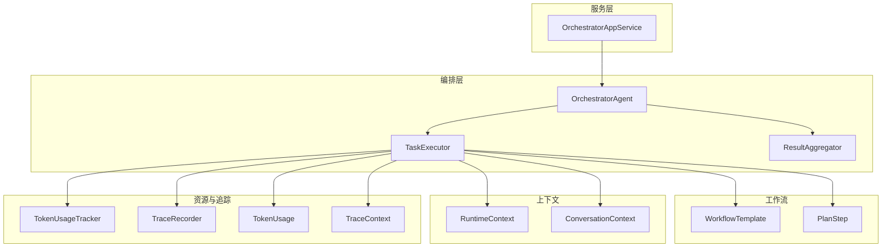
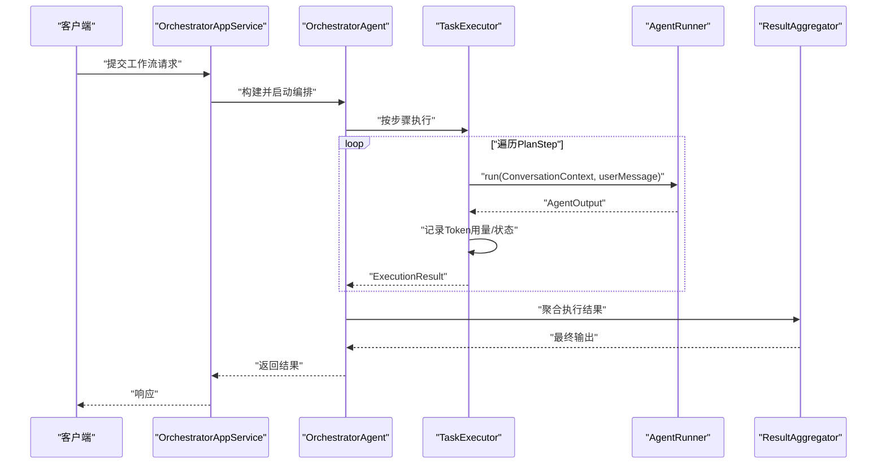
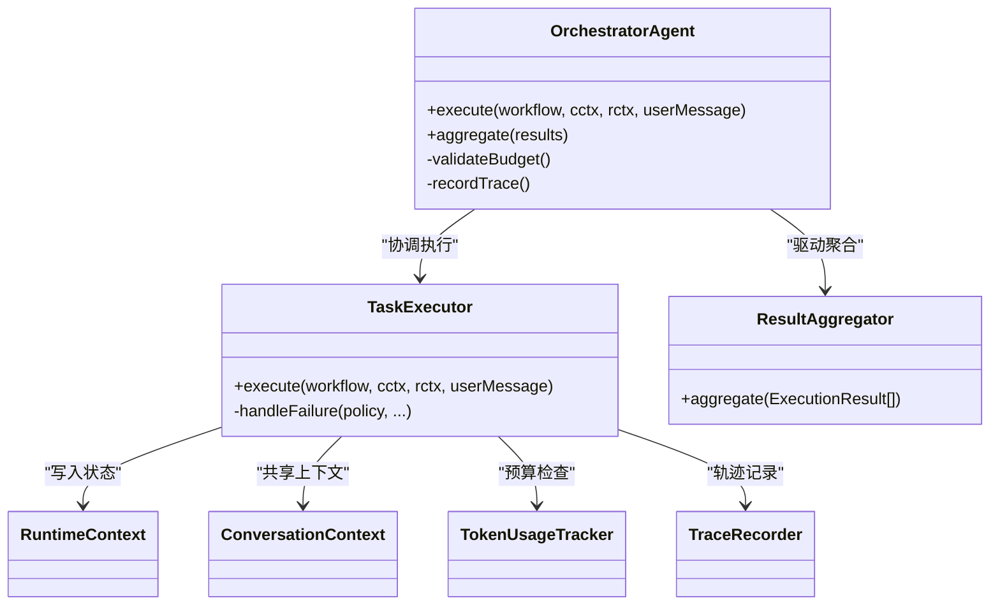
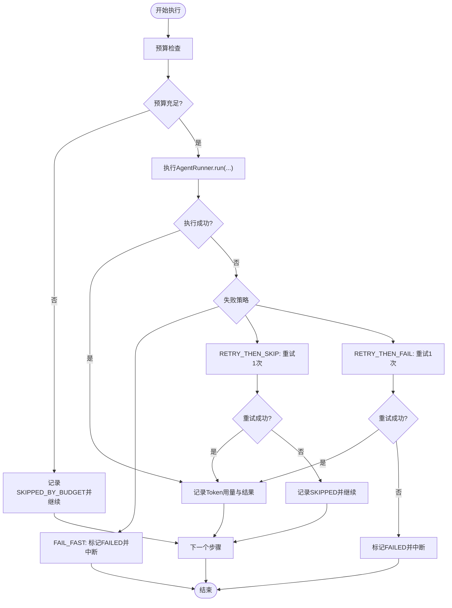
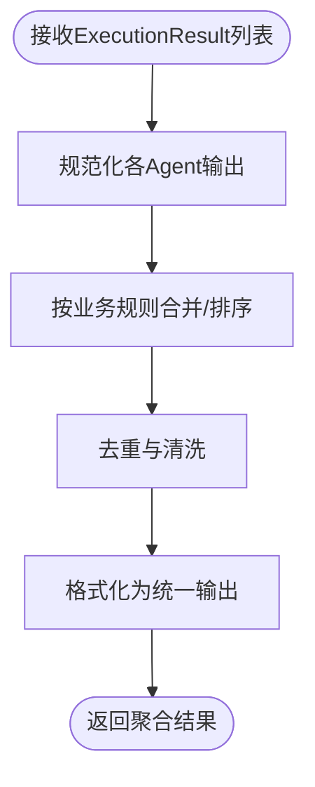
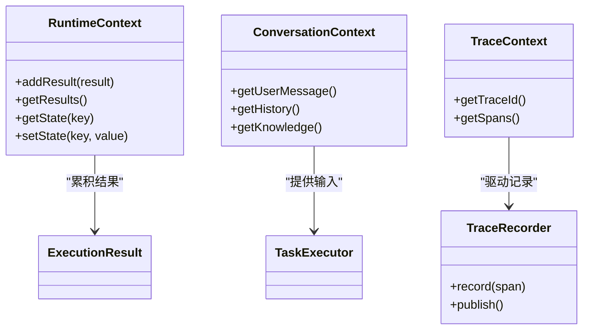
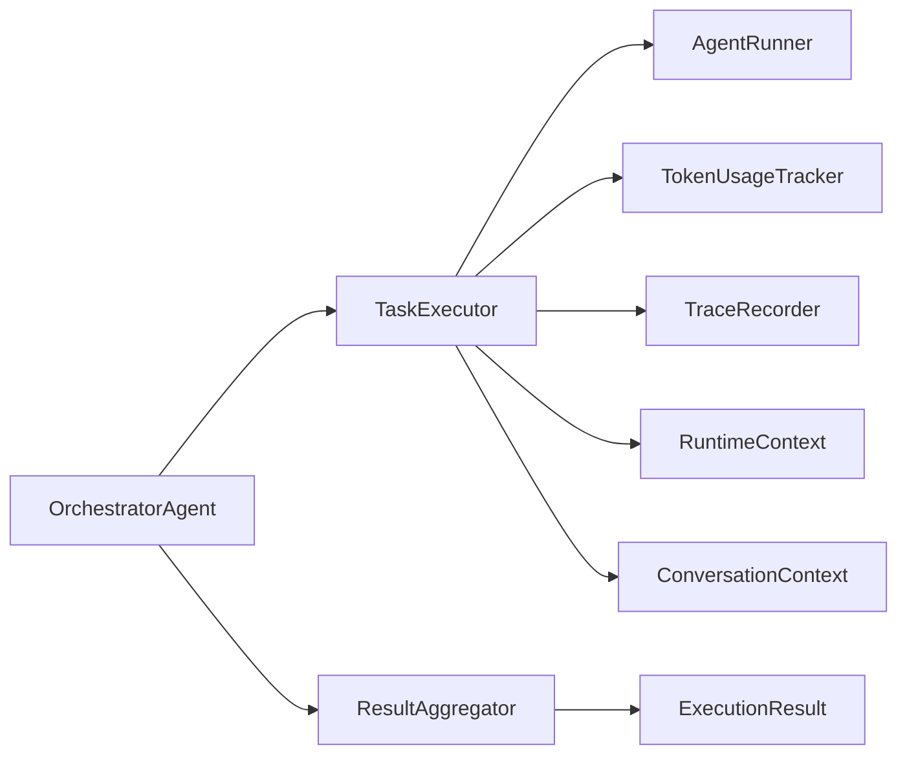

# Orchestrator编排器

<cite>
**本文引用的文件**
- [OrchestratorAgent.java](file://src/main/java/com/yupi/yuaiagent/agent/OrchestratorAgent.java)
- [TaskExecutor.java](file://src/main/java/com/yupi/yuaiagent/agent/TaskExecutor.java)
- [ResultAggregator.java](file://src/main/java/com/yupi/yuaiagent/agent/ResultAggregator.java)
- [ExecutionResult.java](file://src/main/java/com/yupi/yuaiagent/agent/task/ExecutionResult.java)
- [TaskStatus.java](file://src/main/java/com/yupi/yuaiagent/agent/task/TaskStatus.java)
- [FailurePolicy.java](file://src/main/java/com/yupi/yuaiagent/agent/task/FailurePolicy.java)
- [AgentRunner.java](file://src/main/java/com/yupi/yuaiagent/agent/AgentRunner.java)
- [OrchestratorAppService.java](file://src/main/java/com/yupi/yuaiagent/service/OrchestratorAppService.java)
- [WorkflowTemplate.java](file://src/main/java/com/yupi/yuaiagent/workflow/WorkflowTemplate.java)
- [PlanStep.java](file://src/main/java/com/yupi/yuaiagent/workflow/PlanStep.java)
- [RuntimeContext.java](file://src/main/java/com/yupi/yuaiagent/context/RuntimeContext.java)
- [ConversationContext.java](file://src/main/java/com/yupi/yuaiagent/context/ConversationContext.java)
- [TokenUsageTracker.java](file://src/main/java/com/yupi/yuaiagent/budget/TokenUsageTracker.java)
- [TokenUsage.java](file://src/main/java/com/yupi/yuaiagent/budget/TokenUsage.java)
- [TraceRecorder.java](file://src/main/java/com/yupi/yuaiagent/trace/TraceRecorder.java)
- [TraceContext.java](file://src/main/java/com/yupi/yuaiagent/trace/TraceContext.java)
- [multi-agent-runtime-architecture.md](file://docs/multi-agent-runtime-architecture.md)
- [review-report-2026-06-10.md](file://docs/review-report-2026-06-10.md)
</cite>

## 目录
1. [简介](#简介)
2. [项目结构](#项目结构)
3. [核心组件](#核心组件)
4. [架构总览](#架构总览)
5. [详细组件分析](#详细组件分析)
6. [依赖分析](#依赖分析)
7. [性能考虑](#性能考虑)
8. [故障排除指南](#故障排除指南)
9. [结论](#结论)
10. [附录](#附录)

## 简介
本文件为 Orchestrator 编排器的深度架构文档，聚焦于编排器的核心职责、工作流调度机制与任务分发策略；阐述其如何协调多个智能体的执行顺序、处理任务依赖关系与管理执行状态；详解任务执行器的任务调度算法、失败重试机制与超时处理策略；解释结果聚合器的数据整合逻辑与输出格式化机制；并提供编排器配置选项、性能优化技巧与故障恢复策略。文档同时给出具体代码示例的路径，帮助读者快速定位实现细节并进行扩展。

## 项目结构
本项目采用模块化与分层设计，多智能体运行时位于 agent 包下，服务层通过 OrchestratorAppService 提供编排能力，工作流模板与计划节点定义在 workflow 包中，预算与追踪分别由 budget 与 trace 包支撑。

**图表来源**
- [OrchestratorAgent.java](file://src/main/java/com/yupi/yuaiagent/agent/OrchestratorAgent.java)
- [TaskExecutor.java](file://src/main/java/com/yupi/yuaiagent/agent/TaskExecutor.java)
- [ResultAggregator.java](file://src/main/java/com/yupi/yuaiagent/agent/ResultAggregator.java)
- [WorkflowTemplate.java](file://src/main/java/com/yupi/yuaiagent/workflow/WorkflowTemplate.java)
- [PlanStep.java](file://src/main/java/com/yupi/yuaiagent/workflow/PlanStep.java)
- [RuntimeContext.java](file://src/main/java/com/yupi/yuaiagent/context/RuntimeContext.java)
- [ConversationContext.java](file://src/main/java/com/yupi/yuaiagent/context/ConversationContext.java)
- [TokenUsageTracker.java](file://src/main/java/com/yupi/yuaiagent/budget/TokenUsageTracker.java)
- [TraceRecorder.java](file://src/main/java/com/yupi/yuaiagent/trace/TraceRecorder.java)
- [TokenUsage.java](file://src/main/java/com/yupi/yuaiagent/budget/TokenUsage.java)
- [TraceContext.java](file://src/main/java/com/yupi/yuaiagent/trace/TraceContext.java)

**章节来源**
- [OrchestratorAgent.java](file://src/main/java/com/yupi/yuaiagent/agent/OrchestratorAgent.java)
- [TaskExecutor.java](file://src/main/java/com/yupi/yuaiagent/agent/TaskExecutor.java)
- [ResultAggregator.java](file://src/main/java/com/yupi/yuaiagent/agent/ResultAggregator.java)
- [WorkflowTemplate.java](file://src/main/java/com/yupi/yuaiagent/workflow/WorkflowTemplate.java)
- [PlanStep.java](file://src/main/java/com/yupi/yuaiagent/workflow/PlanStep.java)
- [RuntimeContext.java](file://src/main/java/com/yupi/yuaiagent/context/RuntimeContext.java)
- [ConversationContext.java](file://src/main/java/com/yupi/yuaiagent/context/ConversationContext.java)
- [TokenUsageTracker.java](file://src/main/java/com/yupi/yuaiagent/budget/TokenUsageTracker.java)
- [TraceRecorder.java](file://src/main/java/com/yupi/yuaiagent/trace/TraceRecorder.java)
- [TokenUsage.java](file://src/main/java/com/yupi/yuaiagent/budget/TokenUsage.java)
- [TraceContext.java](file://src/main/java/com/yupi/yuaiagent/trace/TraceContext.java)

## 核心组件
- OrchestratorAgent：编排器主体，负责加载与解析工作流、协调任务执行、驱动结果聚合与状态管理。
- TaskExecutor：任务执行器，按步骤顺序执行，内置预算检查、失败策略与事件通知。
- ResultAggregator：结果聚合器，整合各步骤输出，形成最终产物或中间态。
- ExecutionResult/TaskStatus：统一执行结果模型与状态枚举，覆盖成功、失败、跳过等状态。
- WorkflowTemplate/PlanStep：工作流模板与计划步骤，定义执行序列与依赖关系。
- RuntimeContext/ConversationContext：运行时上下文与会话上下文，承载状态与共享信息。
- TokenUsageTracker/TokenUsage：令牌预算跟踪与用量记录，保障成本控制。
- TraceRecorder/TraceContext：轨迹记录与上下文，支持可观测性与审计。

**章节来源**
- [OrchestratorAgent.java](file://src/main/java/com/yupi/yuaiagent/agent/OrchestratorAgent.java)
- [TaskExecutor.java](file://src/main/java/com/yupi/yuaiagent/agent/TaskExecutor.java)
- [ResultAggregator.java](file://src/main/java/com/yupi/yuaiagent/agent/ResultAggregator.java)
- [ExecutionResult.java](file://src/main/java/com/yupi/yuaiagent/agent/task/ExecutionResult.java)
- [TaskStatus.java](file://src/main/java/com/yupi/yuaiagent/agent/task/TaskStatus.java)
- [WorkflowTemplate.java](file://src/main/java/com/yupi/yuaiagent/workflow/WorkflowTemplate.java)
- [PlanStep.java](file://src/main/java/com/yupi/yuaiagent/workflow/PlanStep.java)
- [RuntimeContext.java](file://src/main/java/com/yupi/yuaiagent/context/RuntimeContext.java)
- [ConversationContext.java](file://src/main/java/com/yupi/yuaiagent/context/ConversationContext.java)
- [TokenUsageTracker.java](file://src/main/java/com/yupi/yuaiagent/budget/TokenUsageTracker.java)
- [TokenUsage.java](file://src/main/java/com/yupi/yuaiagent/budget/TokenUsage.java)
- [TraceRecorder.java](file://src/main/java/com/yupi/yuaiagent/trace/TraceRecorder.java)
- [TraceContext.java](file://src/main/java/com/yupi/yuaiagent/trace/TraceContext.java)

## 架构总览
编排器以“模板驱动 + 步骤顺序执行”为核心，结合预算与追踪能力，确保在可控成本与可观测的前提下完成复杂任务链路。

**图表来源**
- [OrchestratorAppService.java](file://src/main/java/com/yupi/yuaiagent/service/OrchestratorAppService.java)
- [OrchestratorAgent.java](file://src/main/java/com/yupi/yuaiagent/agent/OrchestratorAgent.java)
- [TaskExecutor.java](file://src/main/java/com/yupi/yuaiagent/agent/TaskExecutor.java)
- [AgentRunner.java](file://src/main/java/com/yupi/yuaiagent/agent/AgentRunner.java)
- [ResultAggregator.java](file://src/main/java/com/yupi/yuaiagent/agent/ResultAggregator.java)

## 详细组件分析

### OrchestratorAgent（编排器）
- 职责
  - 解析与加载工作流模板，生成执行计划。
  - 协调 TaskExecutor 的执行，收集并传递上下文。
  - 驱动 ResultAggregator 完成结果整合。
  - 管理执行状态与生命周期（建议通过 AgentRuntime 统一）。
- 关键流程
  - 输入：用户消息、会话上下文、工作流模板。
  - 输出：聚合后的最终结果。
  - 控制点：按 PlanStep 顺序推进；根据失败策略决定是否中断。
- 依赖
  - TaskExecutor：执行步骤。
  - ResultAggregator：汇总结果。
  - RuntimeContext/ConversationContext：状态与共享数据。
  - TokenUsageTracker/TraceRecorder：预算与追踪。
- 设计建议
  - 将构造函数参数从 22 个精简至约 8 个，通过 AgentRuntime 统一生命周期管理（预处理/加载/执行/保存/记录/后处理）。

**图表来源**
- [OrchestratorAgent.java](file://src/main/java/com/yupi/yuaiagent/agent/OrchestratorAgent.java)
- [TaskExecutor.java](file://src/main/java/com/yupi/yuaiagent/agent/TaskExecutor.java)
- [ResultAggregator.java](file://src/main/java/com/yupi/yuaiagent/agent/ResultAggregator.java)
- [RuntimeContext.java](file://src/main/java/com/yupi/yuaiagent/context/RuntimeContext.java)
- [ConversationContext.java](file://src/main/java/com/yupi/yuaiagent/context/ConversationContext.java)
- [TokenUsageTracker.java](file://src/main/java/com/yupi/yuaiagent/budget/TokenUsageTracker.java)
- [TraceRecorder.java](file://src/main/java/com/yupi/yuaiagent/trace/TraceRecorder.java)

**章节来源**
- [OrchestratorAgent.java](file://src/main/java/com/yupi/yuaiagent/agent/OrchestratorAgent.java)
- [review-report-2026-06-10.md](file://docs/review-report-2026-06-10.md)

### TaskExecutor（任务执行器）
- 调度机制
  - 顺序遍历 PlanStep，逐个执行。
  - 每步生成唯一 taskId，便于追踪与聚合。
- 预算与成本控制
  - 基于 TokenUsageTracker 进行预算检查，不足则跳过并记录 SKIPPED_BY_BUDGET。
  - 成功后记录实际 TokenUsage。
- 失败策略（FailurePolicy）
  - FAIL_FAST：直接标记 FAILED 并中断后续步骤。
  - RETRY_THEN_SKIP：重试一次，成功则继续，失败则 SKIP。
  - RETRY_THEN_FAIL：重试一次，成功则继续，失败则标记 FAILED。
- 事件与可观测性
  - 发送开始/完成/跳过事件，配合 TraceRecorder 记录轨迹。
- 超时处理
  - 当前实现未显式设置超时；可在 Runner 层或外部线程池增加超时控制。

**图表来源**
- [TaskExecutor.java](file://src/main/java/com/yupi/yuaiagent/agent/TaskExecutor.java)
- [FailurePolicy.java](file://src/main/java/com/yupi/yuaiagent/agent/task/FailurePolicy.java)
- [ExecutionResult.java](file://src/main/java/com/yupi/yuaiagent/agent/task/ExecutionResult.java)
- [TokenUsageTracker.java](file://src/main/java/com/yupi/yuaiagent/budget/TokenUsageTracker.java)

**章节来源**
- [TaskExecutor.java](file://src/main/java/com/yupi/yuaiagent/agent/TaskExecutor.java)
- [ExecutionResult.java](file://src/main/java/com/yupi/yuaiagent/agent/task/ExecutionResult.java)
- [FailurePolicy.java](file://src/main/java/com/yupi/yuaiagent/agent/task/FailurePolicy.java)
- [TokenUsageTracker.java](file://src/main/java/com/yupi/yuaiagent/budget/TokenUsageTracker.java)

### ResultAggregator（结果聚合器）
- 数据整合逻辑
  - 接收 ExecutionResult 列表，按业务规则合并/转换。
  - 可对不同 Agent 的输出进行归一化、去重、排序或拼接。
- 输出格式化机制
  - 将内部结构化数据转为对外统一格式（如 JSON/Markdown/HTML），便于前端渲染或下游消费。
- 与编排器协作
  - 在所有步骤完成后调用，作为编排器的最后一个阶段。

**图表来源**
- [ResultAggregator.java](file://src/main/java/com/yupi/yuaiagent/agent/ResultAggregator.java)
- [ExecutionResult.java](file://src/main/java/com/yupi/yuaiagent/agent/task/ExecutionResult.java)

**章节来源**
- [ResultAggregator.java](file://src/main/java/com/yupi/yuaiagent/agent/ResultAggregator.java)
- [ExecutionResult.java](file://src/main/java/com/yupi/yuaiagent/agent/task/ExecutionResult.java)

### 上下文与状态管理
- RuntimeContext
  - 可变执行状态容器，用于累积 ExecutionResult、共享中间变量与控制流。
- ConversationContext
  - 会话级上下文，承载历史消息、用户画像、领域知识等。
- TraceContext/TraceRecorder
  - 轨迹上下文与记录器，支持端到端可观测性与审计。

**图表来源**
- [RuntimeContext.java](file://src/main/java/com/yupi/yuaiagent/context/RuntimeContext.java)
- [ConversationContext.java](file://src/main/java/com/yupi/yuaiagent/context/ConversationContext.java)
- [TraceContext.java](file://src/main/java/com/yupi/yuaiagent/trace/TraceContext.java)
- [TraceRecorder.java](file://src/main/java/com/yupi/yuaiagent/trace/TraceRecorder.java)

**章节来源**
- [RuntimeContext.java](file://src/main/java/com/yupi/yuaiagent/context/RuntimeContext.java)
- [ConversationContext.java](file://src/main/java/com/yupi/yuaiagent/context/ConversationContext.java)
- [TraceContext.java](file://src/main/java/com/yupi/yuaiagent/trace/TraceContext.java)
- [TraceRecorder.java](file://src/main/java/com/yupi/yuaiagent/trace/TraceRecorder.java)

## 依赖分析
- 组件耦合
  - OrchestratorAgent 与 TaskExecutor 强耦合（编排与执行），建议通过接口隔离。
  - TaskExecutor 与 AgentRunner 松耦合（Map 注入），利于扩展新 Agent。
  - ResultAggregator 与 TaskExecutor 解耦，仅依赖 ExecutionResult。
- 外部依赖
  - TokenUsageTracker：预算控制。
  - TraceRecorder：可观测性。
  - 工作流模板：PlanStep 定义顺序与依赖。

**图表来源**
- [OrchestratorAgent.java](file://src/main/java/com/yupi/yuaiagent/agent/OrchestratorAgent.java)
- [TaskExecutor.java](file://src/main/java/com/yupi/yuaiagent/agent/TaskExecutor.java)
- [ResultAggregator.java](file://src/main/java/com/yupi/yuaiagent/agent/ResultAggregator.java)
- [AgentRunner.java](file://src/main/java/com/yupi/yuaiagent/agent/AgentRunner.java)
- [TokenUsageTracker.java](file://src/main/java/com/yupi/yuaiagent/budget/TokenUsageTracker.java)
- [TraceRecorder.java](file://src/main/java/com/yupi/yuaiagent/trace/TraceRecorder.java)
- [RuntimeContext.java](file://src/main/java/com/yupi/yuaiagent/context/RuntimeContext.java)
- [ConversationContext.java](file://src/main/java/com/yupi/yuaiagent/context/ConversationContext.java)
- [ExecutionResult.java](file://src/main/java/com/yupi/yuaiagent/agent/task/ExecutionResult.java)

**章节来源**
- [OrchestratorAgent.java](file://src/main/java/com/yupi/yuaiagent/agent/OrchestratorAgent.java)
- [TaskExecutor.java](file://src/main/java/com/yupi/yuaiagent/agent/TaskExecutor.java)
- [ResultAggregator.java](file://src/main/java/com/yupi/yuaiagent/agent/ResultAggregator.java)
- [AgentRunner.java](file://src/main/java/com/yupi/yuaiagent/agent/AgentRunner.java)
- [TokenUsageTracker.java](file://src/main/java/com/yupi/yuaiagent/budget/TokenUsageTracker.java)
- [TraceRecorder.java](file://src/main/java/com/yupi/yuaiagent/trace/TraceRecorder.java)
- [RuntimeContext.java](file://src/main/java/com/yupi/yuaiagent/context/RuntimeContext.java)
- [ConversationContext.java](file://src/main/java/com/yupi/yuaiagent/context/ConversationContext.java)
- [ExecutionResult.java](file://src/main/java/com/yupi/yuaiagent/agent/task/ExecutionResult.java)

## 性能考虑
- 预算前置检查：在执行前估算并校验 Token，避免无效调用。
- 共享 Prompt 上下文：复用 PromptContext，减少重复计算。
- 结果增量聚合：仅对必要字段进行合并，降低内存与 CPU 开销。
- 事件驱动与异步：利用 SSE 事件流推送进度，避免阻塞主线程。
- 超时与重试：为长耗时步骤设置超时阈值与指数退避重试策略。
- 并行化探索：在无状态且独立的步骤间引入并行执行（需谨慎处理共享状态）。

## 故障排除指南
- 常见问题
  - 预算不足导致跳过：检查 TokenUsageTracker 配置与 WorkflowTemplate 的 tokenBudget。
  - 失败策略误判：确认 FailurePolicy 设置与异常类型。
  - 结果缺失：核对 RuntimeContext 是否正确累积 ExecutionResult。
- 排查步骤
  - 查看 TraceRecorder 输出，定位失败步骤与错误栈。
  - 检查 AgentRunner 的系统提示词与工具调用日志。
  - 对比 ExecutionResult.status 与 TaskStatus 枚举，确认跳过原因。
- 恢复策略
  - 失败快速中断：适用于强一致场景。
  - 重试后跳过：适用于偶发性失败。
  - 重试后失败：适用于关键路径，确保问题被放大。

**章节来源**
- [TaskExecutor.java](file://src/main/java/com/yupi/yuaiagent/agent/TaskExecutor.java)
- [ExecutionResult.java](file://src/main/java/com/yupi/yuaiagent/agent/task/ExecutionResult.java)
- [TaskStatus.java](file://src/main/java/com/yupi/yuaiagent/agent/task/TaskStatus.java)
- [TraceRecorder.java](file://src/main/java/com/yupi/yuaiagent/trace/TraceRecorder.java)

## 结论
Orchestrator 编排器通过“模板驱动 + 顺序执行 + 预算与追踪”的组合，实现了对多智能体任务的有序编排与可观测治理。TaskExecutor 提供稳健的调度与失败策略，ResultAggregator 负责最终输出的整合与格式化。建议进一步通过 AgentRuntime 统一生命周期、引入超时与并行化优化，并完善失败重试与可观测性指标，以提升整体稳定性与性能。

## 附录

### 使用模式与扩展方法
- 基本使用模式
  - 通过 OrchestratorAppService 提交工作流请求，获取聚合结果。
  - 示例路径：[OrchestratorAppService.java](file://src/main/java/com/yupi/yuaiagent/service/OrchestratorAppService.java)
- 自定义 AgentRunner
  - 实现 AgentRunner 接口，注册到 TaskExecutor 的 runner 映射中。
  - 示例路径：[AgentRunner.java](file://src/main/java/com/yupi/yuaiagent/agent/AgentRunner.java)
- 扩展失败策略
  - 在 FailurePolicy 中新增策略，并在 TaskExecutor.handleFailure 中实现。
  - 示例路径：[FailurePolicy.java](file://src/main/java/com/yupi/yuaiagent/agent/task/FailurePolicy.java)，[TaskExecutor.java](file://src/main/java/com/yupi/yuaiagent/agent/TaskExecutor.java)
- 预算与追踪配置
  - 调整 TokenUsageTracker 与 TraceRecorder 的行为，以适配不同场景。
  - 示例路径：[TokenUsageTracker.java](file://src/main/java/com/yupi/yuaiagent/budget/TokenUsageTracker.java)，[TraceRecorder.java](file://src/main/java/com/yupi/yuaiagent/trace/TraceRecorder.java)

### 配置选项与最佳实践
- 配置项
  - WorkflowTemplate.tokenBudget：全局预算上限。
  - FailurePolicy：FAIL_FAST/RETRY_THEN_SKIP/RETRY_THEN_FAIL。
  - TraceProperties：轨迹采样与存储策略。
- 最佳实践
  - 将构造函数参数从 22 个精简至 8 个，通过 AgentRuntime 统一生命周期。
  - 为长耗时步骤设置超时与重试，避免阻塞。
  - 使用 SSE 事件流实时反馈进度，提升用户体验。

**章节来源**
- [OrchestratorAppService.java](file://src/main/java/com/yupi/yuaiagent/service/OrchestratorAppService.java)
- [AgentRunner.java](file://src/main/java/com/yupi/yuaiagent/agent/AgentRunner.java)
- [FailurePolicy.java](file://src/main/java/com/yupi/yuaiagent/agent/task/FailurePolicy.java)
- [TaskExecutor.java](file://src/main/java/com/yupi/yuaiagent/agent/TaskExecutor.java)
- [TokenUsageTracker.java](file://src/main/java/com/yupi/yuaiagent/budget/TokenUsageTracker.java)
- [TraceRecorder.java](file://src/main/java/com/yupi/yuaiagent/trace/TraceRecorder.java)
- [review-report-2026-06-10.md](file://docs/review-report-2026-06-10.md)