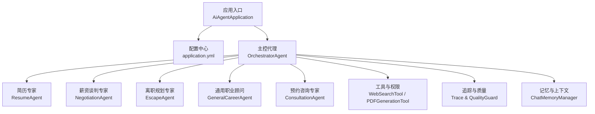
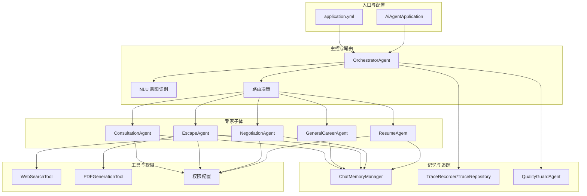
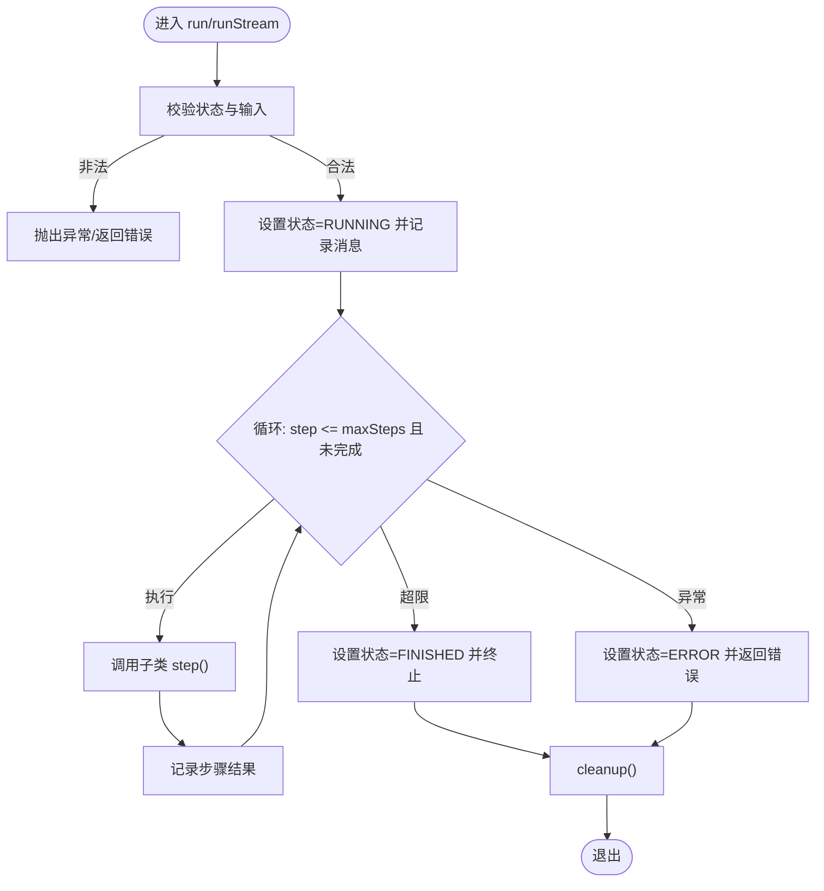
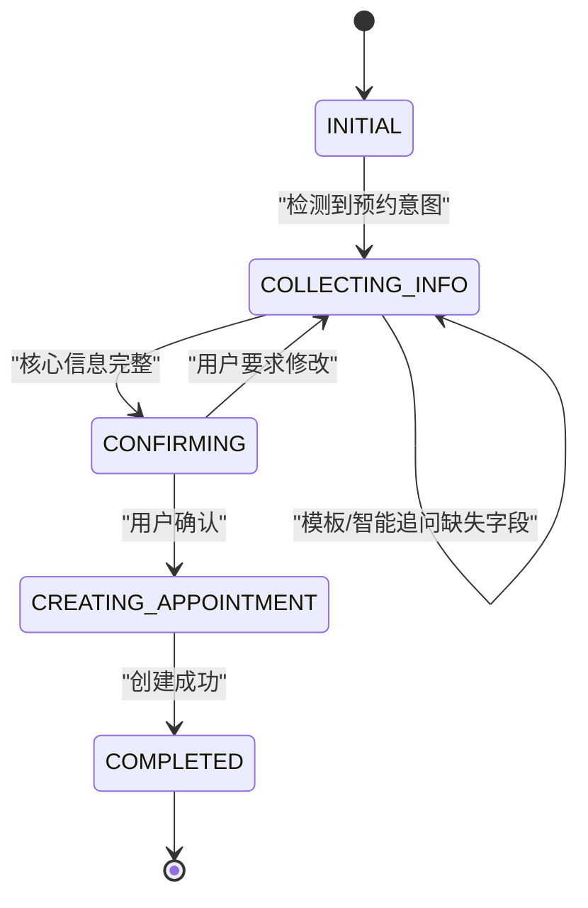
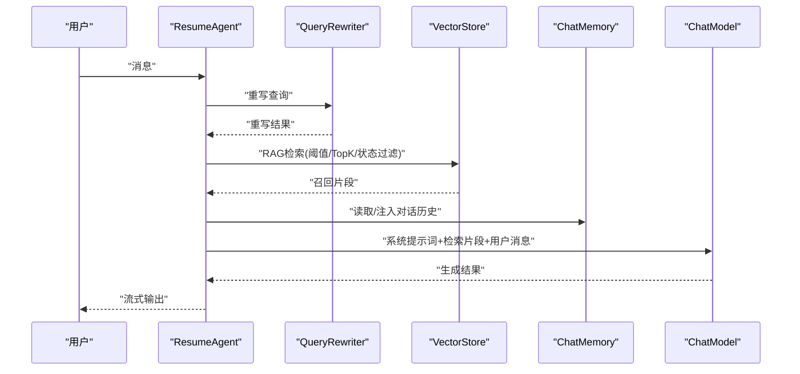
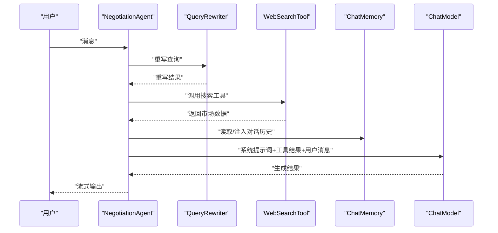
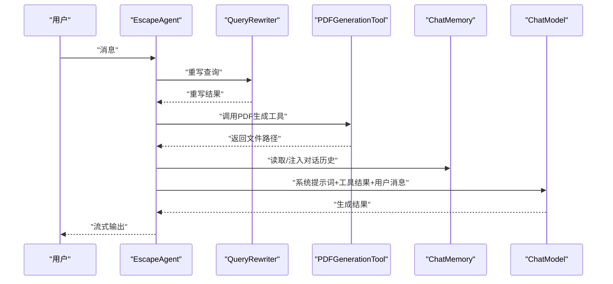
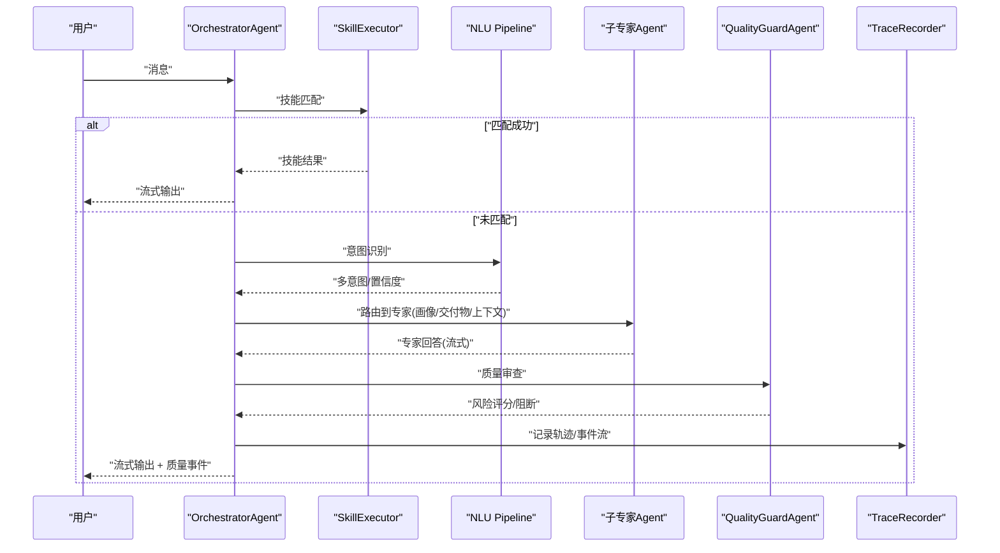
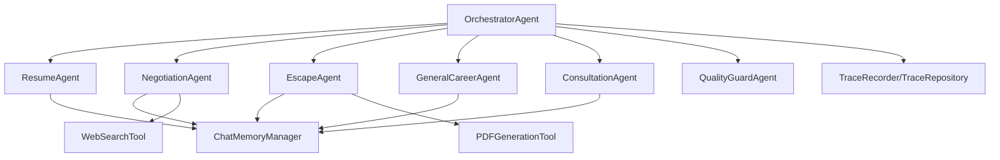

# 专业智能体

<cite>
**本文引用的文件**
- [AiAgentApplication.java](file://src/main/java/com/yupi/yuaiagent/AiAgentApplication.java)
- [application.yml](file://src/main/resources/application.yml)
- [BaseAgent.java](file://src/main/java/com/yupi/yuaiagent/agent/BaseAgent.java)
- [ConsultationAgent.java](file://src/main/java/com/yupi/yuaiagent/agent/ConsultationAgent.java)
- [ResumeAgent.java](file://src/main/java/com/yupi/yuaiagent/agent/ResumeAgent.java)
- [NegotiationAgent.java](file://src/main/java/com/yupi/yuaiagent/agent/NegotiationAgent.java)
- [EscapeAgent.java](file://src/main/java/com/yupi/yuaiagent/agent/EscapeAgent.java)
- [GeneralCareerAgent.java](file://src/main/java/com/yupi/yuaiagent/agent/GeneralCareerAgent.java)
- [OrchestratorAgent.java](file://src/main/java/com/yupi/yuaiagent/agent/OrchestratorAgent.java)
- [CoreInformation.java](file://src/main/java/com/yupi/yuaiagent/agent/model/CoreInformation.java)
- [negotiation-agent.yaml](file://src/main/resources/agents/negotiation-agent.yaml)
- [permissions/negotiation-agent.yaml](file://src/main/resources/permissions/negotiation-agent.yaml)
- [permissions/resume-agent.yaml](file://src/main/resources/permissions/resume-agent.yaml)
- [WebSearchTool.java](file://src/main/java/com/yupi/yuaiagent/tools/WebSearchTool.java)
- [PDFGenerationTool.java](file://src/main/java/com/yupi/yuaiagent/tools/PDFGenerationTool.java)
</cite>

## 目录
1. [简介](#简介)
2. [项目结构](#项目结构)
3. [核心组件](#核心组件)
4. [架构总览](#架构总览)
5. [详细组件分析](#详细组件分析)
6. [依赖分析](#依赖分析)
7. [性能考虑](#性能考虑)
8. [故障排查指南](#故障排查指南)
9. [结论](#结论)
10. [附录](#附录)

## 简介
本项目是一个面向职场场景的专业智能体系统，围绕“主控路由 + 多专家子体”的架构设计，提供简历优化、薪资谈判、离职规划、通用职业咨询以及预约咨询等能力。系统通过统一的执行轨迹、对话记忆压缩、质量守卫与交付物注入等机制，保障多专家协同的稳定性与一致性。本文档从架构、组件、数据流、性能与运维等维度，全面阐述系统设计理念与实现要点，并给出个性化配置、参数调优、协作模式与扩展实践。

## 项目结构
系统采用分层与模块化组织，核心目录与职责概览如下：
- 应用入口与配置：应用启动类与全局配置文件
- 代理与路由：主控代理、各专业代理与工具
- 记忆与追踪：对话记忆管理、执行轨迹与质量审查
- 工具与权限：网络搜索、PDF生成等工具及代理权限配置
- 文档与资源：代理与权限YAML、RAG文档、模板与演示

图表来源
- [AiAgentApplication.java:1-24](file://src/main/java/com/yupi/yuaiagent/AiAgentApplication.java#L1-L24)
- [application.yml:1-154](file://src/main/resources/application.yml#L1-L154)
- [OrchestratorAgent.java:1-754](file://src/main/java/com/yupi/yuaiagent/agent/OrchestratorAgent.java#L1-L754)

章节来源
- [AiAgentApplication.java:1-24](file://src/main/java/com/yupi/yuaiagent/AiAgentApplication.java#L1-L24)
- [application.yml:1-154](file://src/main/resources/application.yml#L1-L154)

## 核心组件
- 基础代理基类：提供统一的状态机、执行循环、SSE流式输出与资源清理能力
- 专业代理：简历优化、薪资谈判、离职规划、通用职业咨询、预约咨询
- 主控代理：意图识别、路由决策、跨专家上下文同步、质量审查与轨迹持久化
- 工具与权限：网络搜索、PDF生成、代理工具绑定与访问控制
- 记忆与追踪：对话记忆压缩、执行轨迹记录与事件流推送

章节来源
- [BaseAgent.java:1-257](file://src/main/java/com/yupi/yuaiagent/agent/BaseAgent.java#L1-L257)
- [OrchestratorAgent.java:1-754](file://src/main/java/com/yupi/yuaiagent/agent/OrchestratorAgent.java#L1-L754)

## 架构总览
系统采用“主控路由 + 多专家子体”架构，结合意图识别、上下文注入、质量守卫与执行轨迹，形成稳定可控的多专家协同体系。

图表来源
- [OrchestratorAgent.java:1-754](file://src/main/java/com/yupi/yuaiagent/agent/OrchestratorAgent.java#L1-L754)
- [application.yml:1-154](file://src/main/resources/application.yml#L1-L154)

## 详细组件分析

### 基础代理基类（BaseAgent）
- 设计要点
  - 统一状态机：IDLE/RUNNING/FINISHED/ERROR
  - 步骤循环：maxSteps限制、currentStep跟踪
  - SSE流式输出：支持外部SseEmitter合并多专家输出
  - 资源清理：清理消息历史、重置状态
- 关键流程
  - run/runStream：执行循环与异常处理
  - 抽象step：子类实现单步逻辑
  - cleanup：实例复用保障

图表来源
- [BaseAgent.java:61-100](file://src/main/java/com/yupi/yuaiagent/agent/BaseAgent.java#L61-L100)
- [BaseAgent.java:109-153](file://src/main/java/com/yupi/yuaiagent/agent/BaseAgent.java#L109-L153)
- [BaseAgent.java:161-239](file://src/main/java/com/yupi/yuaiagent/agent/BaseAgent.java#L161-L239)

章节来源
- [BaseAgent.java:1-257](file://src/main/java/com/yupi/yuaiagent/agent/BaseAgent.java#L1-L257)

### 预约咨询专家（ConsultationAgent）
- 设计理念
  - 状态机驱动：INITIAL -> COLLECTING_INFO -> CONFIRMING -> CREATING_APPOINTMENT -> COMPLETED
  - 模板与追问：核心信息模板追问、非核心信息AI智能追问、防重复追问
  - 结构化抽取：JSON抽取姓名/联系方式/时间/主题/备注
  - 日历集成：创建日历事件并回填链接
- 关键流程
  - 意图识别：判断是否为预约咨询
  - 信息收集：校验与保存、缺失字段优先模板追问、完整后AI智能追问
  - 确认与创建：渲染确认信息、调用日历服务、持久化预约记录

图表来源
- [ConsultationAgent.java:98-105](file://src/main/java/com/yupi/yuaiagent/agent/ConsultationAgent.java#L98-L105)
- [ConsultationAgent.java:190-246](file://src/main/java/com/yupi/yuaiagent/agent/ConsultationAgent.java#L190-L246)
- [ConsultationAgent.java:276-320](file://src/main/java/com/yupi/yuaiagent/agent/ConsultationAgent.java#L276-L320)

章节来源
- [ConsultationAgent.java:1-738](file://src/main/java/com/yupi/yuaiagent/agent/ConsultationAgent.java#L1-L738)
- [CoreInformation.java:1-112](file://src/main/java/com/yupi/yuaiagent/agent/model/CoreInformation.java#L1-L112)

### 简历优化专家（ResumeAgent）
- 设计理念
  - RAG召回：基于向量库召回求职文档，支持相似度阈值与topK
  - 查询重写：提升检索命中与上下文相关性
  - 画像注入：在系统提示词中拼接用户画像片段
  - 记忆管理：统一的对话记忆，支持跨轮次上下文
- 关键流程
  - 查询重写 -> RAG检索 -> 系统提示词注入 -> LLM生成 -> 流式输出

图表来源
- [ResumeAgent.java:81-122](file://src/main/java/com/yupi/yuaiagent/agent/ResumeAgent.java#L81-L122)

章节来源
- [ResumeAgent.java:1-133](file://src/main/java/com/yupi/yuaiagent/agent/ResumeAgent.java#L1-L133)

### 薪资谈判专家（NegotiationAgent）
- 设计理念
  - 工具回调：内置网络搜索工具，获取市场薪资数据
  - 查询重写：提升检索准确性
  - 画像注入：在系统提示词中拼接用户画像片段
  - 记忆管理：统一的对话记忆，支持跨轮次上下文
- 关键流程
  - 查询重写 -> 工具调用 -> 系统提示词注入 -> LLM生成 -> 流式输出

图表来源
- [NegotiationAgent.java:73-84](file://src/main/java/com/yupi/yuaiagent/agent/NegotiationAgent.java#L73-L84)
- [WebSearchTool.java:29-53](file://src/main/java/com/yupi/yuaiagent/tools/WebSearchTool.java#L29-L53)

章节来源
- [NegotiationAgent.java:1-118](file://src/main/java/com/yupi/yuaiagent/agent/NegotiationAgent.java#L1-L118)
- [WebSearchTool.java:1-55](file://src/main/java/com/yupi/yuaiagent/tools/WebSearchTool.java#L1-L55)

### 离职规划专家（EscapeAgent）
- 设计理念
  - 工具回调：内置PDF生成工具，生成交接清单与证据整理文档
  - 查询重写：提升检索准确性
  - 画像注入：在系统提示词中拼接用户画像片段
  - 记忆管理：统一的对话记忆，支持跨轮次上下文
- 关键流程
  - 查询重写 -> 工具调用 -> 系统提示词注入 -> LLM生成 -> 流式输出

图表来源
- [EscapeAgent.java:78-85](file://src/main/java/com/yupi/yuaiagent/agent/EscapeAgent.java#L78-L85)
- [PDFGenerationTool.java:26-113](file://src/main/java/com/yupi/yuaiagent/tools/PDFGenerationTool.java#L26-L113)

章节来源
- [EscapeAgent.java:1-119](file://src/main/java/com/yupi/yuaiagent/agent/EscapeAgent.java#L1-L119)
- [PDFGenerationTool.java:1-115](file://src/main/java/com/yupi/yuaiagent/tools/PDFGenerationTool.java#L1-L115)

### 通用职业顾问（GeneralCareerAgent）
- 设计理念
  - 对话型专家：提供情感支持、人际关系、职业规划与压力管理建议
  - 记忆管理：统一的对话记忆，支持跨轮次上下文
  - 画像注入：在系统提示词中拼接用户画像片段
- 关键流程
  - 系统提示词注入 -> LLM生成 -> 流式输出

章节来源
- [GeneralCareerAgent.java:1-119](file://src/main/java/com/yupi/yuaiagent/agent/GeneralCareerAgent.java#L1-L119)

### 主控代理（OrchestratorAgent）
- 设计理念
  - 意图识别：NLU管道识别多意图与置信度
  - 路由策略：根据意图路由到对应专家，支持预约咨询锁定
  - 上下文注入：画像注入、交付物注入、跨专家对话摘要
  - 质量守卫：质量审查与阻断，支持红队模式
  - 执行轨迹：全程记录Trace，支持事件流推送
- 关键流程
  - 技能匹配 -> NLU意图识别 -> 路由决策 -> 专家执行 -> 质量审查 -> 轨迹持久化

图表来源
- [OrchestratorAgent.java:168-190](file://src/main/java/com/yupi/yuaiagent/agent/OrchestratorAgent.java#L168-L190)
- [OrchestratorAgent.java:214-284](file://src/main/java/com/yupi/yuaiagent/agent/OrchestratorAgent.java#L214-L284)
- [OrchestratorAgent.java:464-532](file://src/main/java/com/yupi/yuaiagent/agent/OrchestratorAgent.java#L464-L532)

章节来源
- [OrchestratorAgent.java:1-754](file://src/main/java/com/yupi/yuaiagent/agent/OrchestratorAgent.java#L1-L754)

## 依赖分析
- 组件耦合
  - 主控代理聚合各专家代理与工具，形成高内聚低耦合
  - 专家代理共享对话记忆管理器，避免重复实现
  - 质量守卫与执行轨迹独立于业务逻辑，便于扩展
- 外部依赖
  - 模型服务：DashScope（多模态）、Ollama（本地）
  - 搜索API：SearchAPI（网页搜索）
  - 向量库：PgVector（RAG）
  - 日历服务：飞书/钉钉（预约日历）

图表来源
- [OrchestratorAgent.java:127-132](file://src/main/java/com/yupi/yuaiagent/agent/OrchestratorAgent.java#L127-L132)
- [application.yml:11-41](file://src/main/resources/application.yml#L11-L41)

章节来源
- [application.yml:1-154](file://src/main/resources/application.yml#L1-154)

## 性能考虑
- 记忆压缩
  - Token阈值与轮数阈值控制对话历史长度，降低上下文开销
  - 保留最近N轮完整内容，兼顾上下文连贯性
- 流式输出
  - SSE事件流实时推送，降低端到端延迟
  - 主控代理真正串行流式输出，避免阻塞
- 质量审查
  - 质量模式可配置（OFF/AUTO/RED_TEAM），平衡准确性与性能
- 工具调用
  - 搜索与PDF生成限制调用次数，避免资源滥用

章节来源
- [application.yml:121-129](file://src/main/resources/application.yml#L121-L129)
- [OrchestratorAgent.java:647-704](file://src/main/java/com/yupi/yuaiagent/agent/OrchestratorAgent.java#L647-L704)

## 故障排查指南
- 启动与配置
  - 数据源自动配置排除：便于本地开发调试
  - 模型配置：DashScope多模态与Ollama冲突排除
- 执行轨迹
  - 轨迹开关、最大跨度、元数据长度与用户配额可调
  - SSE事件流开启，便于前端实时展示
- 日志级别
  - Spring AI与治理/沙箱/MCP日志级别可调整，便于定位问题
- 常见问题
  - 代理状态异常：检查BaseAgent状态机与清理逻辑
  - 路由冲突：ConsultationAgent进行中时锁定路由
  - 质量阻断：关注质量审查事件，必要时切换为红队模式

章节来源
- [AiAgentApplication.java:11-16](file://src/main/java/com/yupi/yuaiagent/AiAgentApplication.java#L11-L16)
- [application.yml:111-119](file://src/main/resources/application.yml#L111-L119)
- [application.yml:147-154](file://src/main/resources/application.yml#L147-L154)
- [OrchestratorAgent.java:366-406](file://src/main/java/com/yupi/yuaiagent/agent/OrchestratorAgent.java#L366-L406)

## 结论
本系统通过“主控路由 + 多专家子体”的架构，结合意图识别、上下文注入、质量守卫与执行轨迹，实现了稳定、可扩展、可审计的专业智能体平台。专家代理聚焦特定领域，具备良好的可维护性；主控代理负责编排与治理，保障整体一致性。配合工具与权限体系，系统既满足多样化职场需求，又具备良好的安全性与可观测性。

## 附录

### 个性化配置与参数调优
- 模型与多模态
  - DashScope模型与多模态开关：按需启用
  - Ollama本地模型：避免与DashScope冲突
- 访问控制
  - 代理权限配置：工具模式、最小信任分、网络访问、文件系统访问
  - 代理注册：代理代码、显示名称、能力标签、意图关键词
- 记忆与轨迹
  - 记忆压缩阈值：Token阈值、轮数阈值、最近轮数
  - 轨迹存储与事件流：开关、最大跨度、元数据长度、用户配额
- 工具调用
  - 搜索API密钥：通过环境变量注入
  - PDF生成：输出目录与字体配置

章节来源
- [application.yml:11-41](file://src/main/resources/application.yml#L11-L41)
- [permissions/negotiation-agent.yaml:1-15](file://src/main/resources/permissions/negotiation-agent.yaml#L1-L15)
- [permissions/resume-agent.yaml:1-15](file://src/main/resources/permissions/resume-agent.yaml#L1-L15)
- [negotiation-agent.yaml:1-23](file://src/main/resources/agents/negotiation-agent.yaml#L1-L23)

### 智能体间协作与信息共享
- 跨专家上下文同步：从持久化消息仓库加载完整历史，注入目标专家记忆
- 交付物注入：查询READY交付物，拼接为中文上下文注入专家
- 质量审查：对组合回答进行质量审查，支持阻断与红队模式
- 轨迹绑定：SSE事件流与Trace上下文绑定，实现端到端可观测

章节来源
- [OrchestratorAgent.java:299-356](file://src/main/java/com/yupi/yuaiagent/agent/OrchestratorAgent.java#L299-L356)
- [OrchestratorAgent.java:537-568](file://src/main/java/com/yupi/yuaiagent/agent/OrchestratorAgent.java#L537-L568)
- [OrchestratorAgent.java:647-704](file://src/main/java/com/yupi/yuaiagent/agent/OrchestratorAgent.java#L647-L704)

### 开发指南与扩展实践
- 新增专家代理
  - 继承对话型/工具型模式，接入统一记忆管理
  - 在主控代理中注册路由与Runner
  - 编写权限配置与代理注册文件
- 工具扩展
  - 实现ToolCallback接口，遵循参数与返回规范
  - 在权限配置中开放工具模式与信任分
- 最佳实践
  - 使用查询重写提升检索质量
  - 控制工具调用次数与输出大小
  - 启用质量守卫与执行轨迹，确保可审计性

章节来源
- [OrchestratorAgent.java:154-162](file://src/main/java/com/yupi/yuaiagent/agent/OrchestratorAgent.java#L154-L162)
- [permissions/negotiation-agent.yaml:5-14](file://src/main/resources/permissions/negotiation-agent.yaml#L5-L14)
- [negotiation-agent.yaml:8-22](file://src/main/resources/agents/negotiation-agent.yaml#L8-L22)