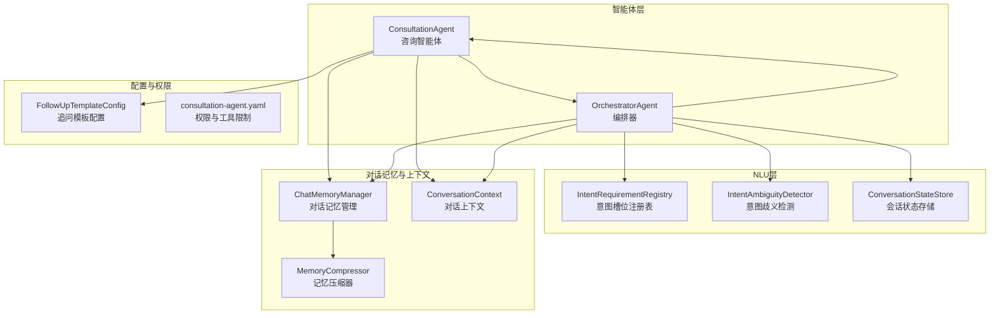
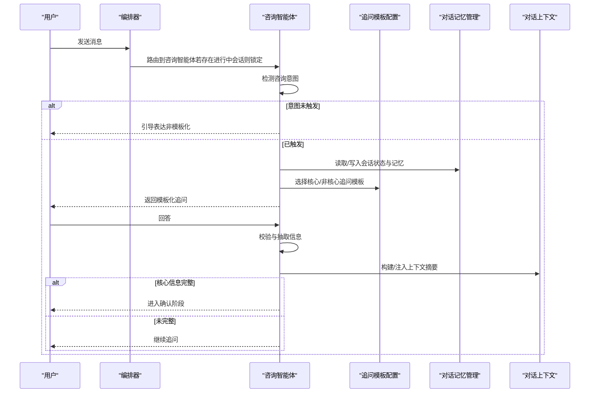
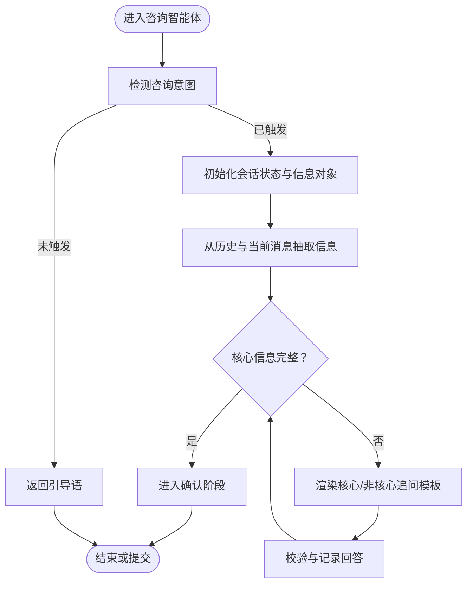
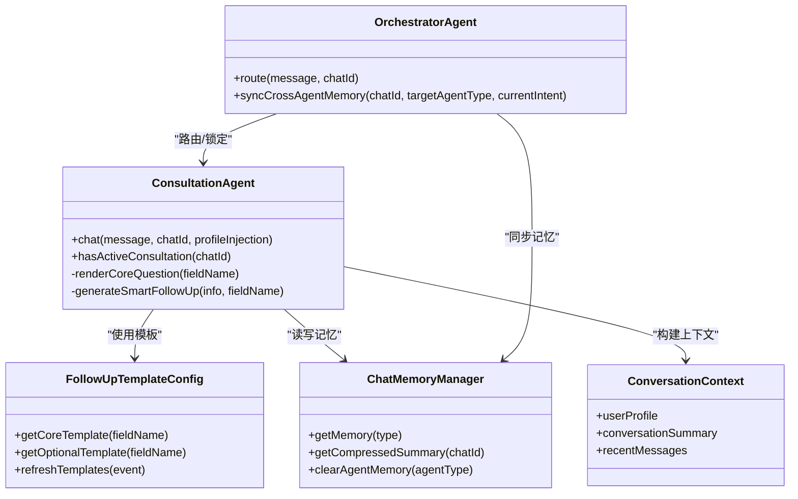
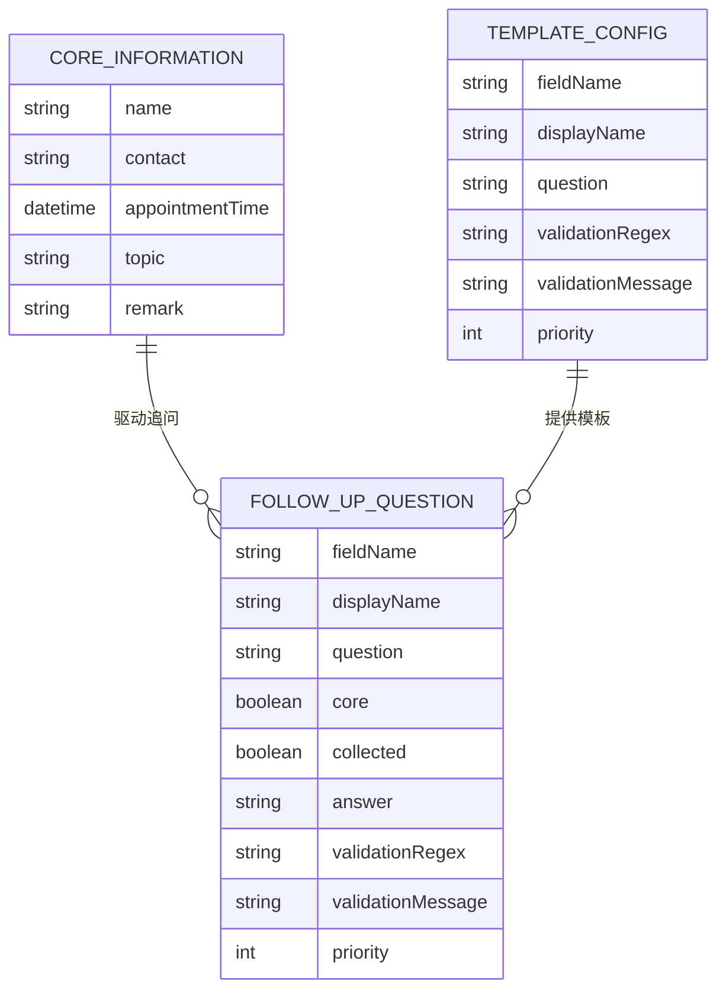

# 咨询智能体

<cite>
**本文引用的文件**
- [ConsultationAgent.java](file://src/main/java/com/yupi/yuaiagent/agent/ConsultationAgent.java)
- [FollowUpTemplateConfig.java](file://src/main/java/com/yupi/yuaiagent/config/FollowUpTemplateConfig.java)
- [FollowUpQuestion.java](file://src/main/java/com/yupi/yuaiagent/agent/model/FollowUpQuestion.java)
- [CoreInformation.java](file://src/main/java/com/yupi/yuaiagent/agent/model/CoreInformation.java)
- [OrchestratorAgent.java](file://src/main/java/com/yupi/yuaiagent/agent/OrchestratorAgent.java)
- [IntentRequirementRegistry.java](file://src/main/java/com/yupi/yuaiagent/nlu/IntentRequirementRegistry.java)
- [IntentAmbiguityDetector.java](file://src/main/java/com/yupi/yuaiagent/nlu/IntentAmbiguityDetector.java)
- [ConversationStateStore.java](file://src/main/java/com/yupi/yuaiagent/nlu/ConversationStateStore.java)
- [InMemoryConversationStateStore.java](file://src/main/java/com/yupi/yuaiagent/nlu/InMemoryConversationStateStore.java)
- [ChatMemoryManager.java](file://src/main/java/com/yupi/yuaiagent/chatmemory/ChatMemoryManager.java)
- [MemoryCompressor.java](file://src/main/java/com/yupi/yuaiagent/chatmemory/MemoryCompressor.java)
- [ConversationContext.java](file://src/main/java/com/yupi/yuaiagent/context/ConversationContext.java)
- [consultation-agent.yaml](file://src/main/resources/permissions/consultation-agent.yaml)
- [ConsultationAgentIntegrationTest.java](file://src/test/java/com/yupi/yuaiagent/agent/ConsultationAgentIntegrationTest.java)
</cite>

## 目录
1. [引言](#引言)
2. [项目结构](#项目结构)
3. [核心组件](#核心组件)
4. [架构总览](#架构总览)
5. [详细组件分析](#详细组件分析)
6. [依赖关系分析](#依赖关系分析)
7. [性能考量](#性能考量)
8. [故障排查指南](#故障排查指南)
9. [结论](#结论)
10. [附录](#附录)

## 引言
本文件为“咨询智能体”的功能文档，聚焦于对话管理、问题澄清与信息收集机制，阐述智能体如何引导用户表达、识别核心需求并提供针对性建议。文档覆盖多轮对话处理、上下文保持与情感智能交互策略，并给出提问技巧、反馈收集与满意度评估方法，同时提供对话流程优化与用户体验提升的实现细节及咨询场景模拟与交互模式指南。

## 项目结构
本项目采用分层与模块化组织，核心围绕“智能体”“自然语言理解（NLU）”“对话记忆与上下文”“权限与工具”等子系统协同工作。咨询智能体位于“agent”层，负责预约咨询的意图识别、信息收集与状态流转；“nlu”层提供意图歧义检测与槽位要求管理；“chatmemory”层负责对话记忆的压缩与共享；“config”层提供模板与配置能力；“permission”层定义工具访问与信任阈值。

图表来源
- [ConsultationAgent.java:123-141](file://src/main/java/com/yupi/yuaiagent/agent/ConsultationAgent.java#L123-L141)
- [OrchestratorAgent.java:364-378](file://src/main/java/com/yupi/yuaiagent/agent/OrchestratorAgent.java#L364-L378)
- [FollowUpTemplateConfig.java:11-396](file://src/main/java/com/yupi/yuaiagent/config/FollowUpTemplateConfig.java#L11-L396)
- [IntentRequirementRegistry.java:1-103](file://src/main/java/com/yupi/yuaiagent/nlu/IntentRequirementRegistry.java#L1-L103)
- [IntentAmbiguityDetector.java:41-75](file://src/main/java/com/yupi/yuaiagent/nlu/IntentAmbiguityDetector.java#L41-L75)
- [ConversationStateStore.java:1-18](file://src/main/java/com/yupi/yuaiagent/nlu/ConversationStateStore.java#L1-L18)
- [InMemoryConversationStateStore.java:1-42](file://src/main/java/com/yupi/yuaiagent/nlu/InMemoryConversationStateStore.java#L1-L42)
- [ChatMemoryManager.java:259-310](file://src/main/java/com/yupi/yuaiagent/chatmemory/ChatMemoryManager.java#L259-L310)
- [MemoryCompressor.java:208-239](file://src/main/java/com/yupi/yuaiagent/chatmemory/MemoryCompressor.java#L208-L239)
- [ConversationContext.java:1-20](file://src/main/java/com/yupi/yuaiagent/context/ConversationContext.java#L1-L20)
- [consultation-agent.yaml:1-13](file://src/main/resources/permissions/consultation-agent.yaml#L1-L13)

章节来源
- [ConsultationAgent.java:123-141](file://src/main/java/com/yupi/yuaiagent/agent/ConsultationAgent.java#L123-L141)
- [OrchestratorAgent.java:364-378](file://src/main/java/com/yupi/yuaiagent/agent/OrchestratorAgent.java#L364-L378)
- [FollowUpTemplateConfig.java:11-396](file://src/main/java/com/yupi/yuaiagent/config/FollowUpTemplateConfig.java#L11-L396)
- [IntentRequirementRegistry.java:1-103](file://src/main/java/com/yupi/yuaiagent/nlu/IntentRequirementRegistry.java#L1-L103)
- [IntentAmbiguityDetector.java:41-75](file://src/main/java/com/yupi/yuaiagent/nlu/IntentAmbiguityDetector.java#L41-L75)
- [ConversationStateStore.java:1-18](file://src/main/java/com/yupi/yuaiagent/nlu/ConversationStateStore.java#L1-L18)
- [InMemoryConversationStateStore.java:1-42](file://src/main/java/com/yupi/yuaiagent/nlu/InMemoryConversationStateStore.java#L1-L42)
- [ChatMemoryManager.java:259-310](file://src/main/java/com/yupi/yuaiagent/chatmemory/ChatMemoryManager.java#L259-L310)
- [MemoryCompressor.java:208-239](file://src/main/java/com/yupi/yuaiagent/chatmemory/MemoryCompressor.java#L208-L239)
- [ConversationContext.java:1-20](file://src/main/java/com/yupi/yuaiagent/context/ConversationContext.java#L1-L20)
- [consultation-agent.yaml:1-13](file://src/main/resources/permissions/consultation-agent.yaml#L1-L13)

## 核心组件
- 咨询智能体（ConsultationAgent）：负责意图识别、信息收集、状态机流转、模板渲染与追问生成，支持同步与流式对话。
- 编排器（OrchestratorAgent）：在多智能体协作中进行路由与跨智能体记忆同步，确保会话连续性。
- 追问模板配置（FollowUpTemplateConfig）：提供核心与非核心信息的模板化追问，支持热更新。
- 会话状态存储（ConversationStateStore/InMemoryConversationStateStore）：保存与恢复对话状态，支持内存与生产态（Redis）。
- 对话记忆与上下文（ChatMemoryManager/MemoryCompressor/ConversationContext）：压缩与注入上下文，维持长对话连贯性。
- 权限与工具（consultation-agent.yaml）：定义工具访问范围、信任阈值与网络访问策略。

章节来源
- [ConsultationAgent.java:123-141](file://src/main/java/com/yupi/yuaiagent/agent/ConsultationAgent.java#L123-L141)
- [FollowUpTemplateConfig.java:11-396](file://src/main/java/com/yupi/yuaiagent/config/FollowUpTemplateConfig.java#L11-L396)
- [ConversationStateStore.java:1-18](file://src/main/java/com/yupi/yuaiagent/nlu/ConversationStateStore.java#L1-L18)
- [InMemoryConversationStateStore.java:1-42](file://src/main/java/com/yupi/yuaiagent/nlu/InMemoryConversationStateStore.java#L1-L42)
- [ChatMemoryManager.java:259-310](file://src/main/java/com/yupi/yuaiagent/chatmemory/ChatMemoryManager.java#L259-L310)
- [MemoryCompressor.java:208-239](file://src/main/java/com/yupi/yuaiagent/chatmemory/MemoryCompressor.java#L208-L239)
- [ConversationContext.java:1-20](file://src/main/java/com/yupi/yuaiagent/context/ConversationContext.java#L1-L20)
- [consultation-agent.yaml:1-13](file://src/main/resources/permissions/consultation-agent.yaml#L1-L13)

## 架构总览
咨询智能体在编排器的统一调度下，结合NLU层的意图与槽位管理、模板配置与记忆压缩，形成“意图识别—信息收集—状态流转—模板渲染—上下文注入”的闭环。编排器在跨智能体切换时同步历史消息，确保上下文一致性；记忆压缩器将长对话摘要化注入系统消息，降低上下文开销。

图表来源
- [OrchestratorAgent.java:364-378](file://src/main/java/com/yupi/yuaiagent/agent/OrchestratorAgent.java#L364-L378)
- [ConsultationAgent.java:184-200](file://src/main/java/com/yupi/yuaiagent/agent/ConsultationAgent.java#L184-L200)
- [FollowUpTemplateConfig.java:11-396](file://src/main/java/com/yupi/yuaiagent/config/FollowUpTemplateConfig.java#L11-L396)
- [ChatMemoryManager.java:259-310](file://src/main/java/com/yupi/yuaiagent/chatmemory/ChatMemoryManager.java#L259-L310)
- [ConversationContext.java:1-20](file://src/main/java/com/yupi/yuaiagent/context/ConversationContext.java#L1-L20)

## 详细组件分析

### 咨询智能体（ConsultationAgent）
- 角色与职责
  - 意图识别：判断用户是否表达“预约咨询”意图，未触发时引导表达。
  - 信息收集：基于状态机推进“姓名—联系方式—预约时间”等核心信息，必要时生成智能追问。
  - 模板驱动：使用追问模板配置渲染问题，保证一致性与可维护性。
  - 上下文注入：在同步对话中避免画像注入污染结构化输出，保障向后兼容。
  - 锁定路由：当存在进行中的会话时，编排器直接路由至咨询智能体，避免重复意图识别。

- 关键流程
  - 初始状态：检测咨询意图；未触发则返回引导语。
  - 收集信息：从历史与当前消息抽取信息，按模板与优先级生成追问。
  - 核心信息完整：进入确认阶段；否则继续追问。
  - 智能追问：在模板之外，基于上下文生成个性化问题，失败时回退到模板。

图表来源
- [ConsultationAgent.java:184-200](file://src/main/java/com/yupi/yuaiagent/agent/ConsultationAgent.java#L184-L200)
- [ConsultationAgent.java:362-419](file://src/main/java/com/yupi/yuaiagent/agent/ConsultationAgent.java#L362-L419)
- [FollowUpTemplateConfig.java:11-396](file://src/main/java/com/yupi/yuaiagent/config/FollowUpTemplateConfig.java#L11-L396)

章节来源
- [ConsultationAgent.java:123-141](file://src/main/java/com/yupi/yuaiagent/agent/ConsultationAgent.java#L123-L141)
- [ConsultationAgent.java:184-200](file://src/main/java/com/yupi/yuaiagent/agent/ConsultationAgent.java#L184-L200)
- [ConsultationAgent.java:362-419](file://src/main/java/com/yupi/yuaiagent/agent/ConsultationAgent.java#L362-L419)
- [ConsultationAgentIntegrationTest.java:119-151](file://src/test/java/com/yupi/yuaiagent/agent/ConsultationAgentIntegrationTest.java#L119-L151)

### 追问模板配置（FollowUpTemplateConfig）
- 设计要点
  - 核心信息模板：姓名、联系方式、预约时间，具备字段名、显示名、问题、验证规则与优先级。
  - 非核心信息模板：咨询主题、备注等，支持动态扩展。
  - 热更新机制：通过事件监听与运行时更新，无需重启即可生效。
  - 默认回退：未配置时自动加载内置默认模板，满足最小可用性。

- 使用方式
  - 核心字段：按优先级与收集状态选择模板渲染问题。
  - 非核心字段：首次收集时生成问题，避免重复追问。
  - 智能追问回退：AI生成失败时回退到模板，保证体验连续性。

章节来源
- [FollowUpTemplateConfig.java:11-396](file://src/main/java/com/yupi/yuaiagent/config/FollowUpTemplateConfig.java#L11-L396)
- [FollowUpQuestion.java:1-63](file://src/main/java/com/yupi/yuaiagent/agent/model/FollowUpQuestion.java#L1-L63)

### 会话状态与上下文（ConversationStateStore/ConversationContext）
- 会话状态存储
  - 抽象接口与内存实现：提供获取、保存与删除能力，默认开发环境使用内存存储。
  - 生产替换：可通过实现Redis存储以支持分布式与持久化。

- 对话上下文
  - 不可变记录：包含用户画像注入文本、压缩摘要与最近消息列表，作为共享上下文注入LLM。
  - 与记忆管理配合：通过压缩摘要与最近消息共同构建高质量上下文。

章节来源
- [ConversationStateStore.java:1-18](file://src/main/java/com/yupi/yuaiagent/nlu/ConversationStateStore.java#L1-L18)
- [InMemoryConversationStateStore.java:1-42](file://src/main/java/com/yupi/yuaiagent/nlu/InMemoryConversationStateStore.java#L1-L42)
- [ConversationContext.java:1-20](file://src/main/java/com/yupi/yuaiagent/context/ConversationContext.java#L1-L20)

### 对话记忆与压缩（ChatMemoryManager/MemoryCompressor）
- 记忆管理
  - 支持按Agent类型管理会话记忆，提供清理与状态查询能力。
  - 当前返回空摘要（未来可从消息仓库提取）。

- 记忆压缩
  - 结构化摘要：将历史消息拆分为“需求/已确认信息/未决问题/决策/协议”等部分。
  - 系统消息注入：将压缩摘要封装为系统消息注入LLM上下文，减少token消耗。

章节来源
- [ChatMemoryManager.java:259-310](file://src/main/java/com/yupi/yuaiagent/chatmemory/ChatMemoryManager.java#L259-L310)
- [MemoryCompressor.java:208-239](file://src/main/java/com/yupi/yuaiagent/chatmemory/MemoryCompressor.java#L208-L239)

### 编排器与跨智能体协作（OrchestratorAgent）
- 路由锁定
  - 若咨询智能体存在进行中的会话，则直接路由到该智能体，避免重复意图识别与状态冲突。

- 跨智能体记忆同步
  - 从持久化消息仓库加载完整历史，注入目标智能体的ChatMemory，确保LLM上下文中包含完整对话。
  - 处理前一智能体未持久化的消息，避免上下文丢失。

章节来源
- [OrchestratorAgent.java:364-378](file://src/main/java/com/yupi/yuaiagent/agent/OrchestratorAgent.java#L364-L378)
- [OrchestratorAgent.java:283-306](file://src/main/java/com/yupi/yuaiagent/agent/OrchestratorAgent.java#L283-L306)
- [OrchestratorAgent.java:461-466](file://src/main/java/com/yupi/yuaiagent/agent/OrchestratorAgent.java#L461-L466)

### 意图识别与槽位管理（IntentRequirementRegistry/IntentAmbiguityDetector）
- 槽位要求注册表
  - 支持按意图与路由提示（routeHint）两级查找缺失槽位，优先精确匹配再前缀回退，最后意图回退。
  - 为“咨询”意图提供基础槽位要求，支撑信息收集策略。

- 意图歧义检测
  - 基于分数差距与类别冲突判定歧义，避免错误路由与重复追问。

章节来源
- [IntentRequirementRegistry.java:1-103](file://src/main/java/com/yupi/yuaiagent/nlu/IntentRequirementRegistry.java#L1-L103)
- [IntentAmbiguityDetector.java:41-75](file://src/main/java/com/yupi/yuaiagent/nlu/IntentAmbiguityDetector.java#L41-L75)

### 权限与工具（consultation-agent.yaml）
- 工具访问范围：限定以“consultation.”“calendar.”“rag.query.”开头的工具模式。
- 信任阈值：最小MCP信任分数为50，确保工具调用安全。
- 请求限制：每请求最大工具调用次数为20。
- 网络访问：允许网络访问，禁用文件系统访问，符合最小权限原则。

章节来源
- [consultation-agent.yaml:1-13](file://src/main/resources/permissions/consultation-agent.yaml#L1-L13)

## 依赖关系分析
- 组件耦合
  - 咨询智能体依赖模板配置、记忆管理与上下文，耦合度适中，便于测试与演进。
  - 编排器对多个智能体与记忆系统有协调作用，承担“粘合层”职责。
  - NLU层提供意图与状态抽象，与业务逻辑解耦。

- 外部依赖
  - 工具调用受权限配置约束，避免越权操作。
  - 记忆压缩依赖LLM结构化输出，需保证提示质量与稳定性。

图表来源
- [ConsultationAgent.java:123-141](file://src/main/java/com/yupi/yuaiagent/agent/ConsultationAgent.java#L123-L141)
- [FollowUpTemplateConfig.java:11-396](file://src/main/java/com/yupi/yuaiagent/config/FollowUpTemplateConfig.java#L11-L396)
- [ChatMemoryManager.java:259-310](file://src/main/java/com/yupi/yuaiagent/chatmemory/ChatMemoryManager.java#L259-L310)
- [ConversationContext.java:1-20](file://src/main/java/com/yupi/yuaiagent/context/ConversationContext.java#L1-L20)
- [OrchestratorAgent.java:364-378](file://src/main/java/com/yupi/yuaiagent/agent/OrchestratorAgent.java#L364-L378)

## 性能考量
- 上下文控制
  - 使用记忆压缩将长对话摘要化注入系统消息，降低token占用，提升响应速度。
- 模板驱动
  - 通过模板统一问题风格，减少LLM自由生成带来的不确定性与token浪费。
- 状态与缓存
  - 会话状态与记忆按会话粒度管理，避免全局锁与高并发下的竞争。
- 路由优化
  - 锁定路由避免重复意图识别，减少无效调用与延迟。

## 故障排查指南
- 模板未生效或热更新无效
  - 检查模板事件监听与运行时更新逻辑是否触发，确认配置项是否正确加载。
- 智能追问失败回退频繁
  - 校验LLM调用稳定性与提示质量，必要时调整提示词或增加降级策略。
- 会话状态异常
  - 确认状态存储实现（内存/Redis）是否正确，版本比较与CAS逻辑是否生效。
- 跨智能体上下文缺失
  - 检查持久化消息仓库是否存在历史消息，确认同步逻辑是否执行。

章节来源
- [FollowUpTemplateConfig.java:314-324](file://src/main/java/com/yupi/yuaiagent/config/FollowUpTemplateConfig.java#L314-L324)
- [ConsultationAgent.java:398-419](file://src/main/java/com/yupi/yuaiagent/agent/ConsultationAgent.java#L398-L419)
- [InMemoryConversationStateStore.java:23-36](file://src/main/java/com/yupi/yuaiagent/nlu/InMemoryConversationStateStore.java#L23-L36)
- [OrchestratorAgent.java:300-306](file://src/main/java/com/yupi/yuaiagent/agent/OrchestratorAgent.java#L300-L306)

## 结论
咨询智能体通过“意图识别—模板驱动—状态机流转—上下文注入”的闭环，实现了稳定、可扩展的预约咨询流程。结合编排器的路由锁定与跨智能体记忆同步、NLU层的槽位与歧义处理、以及记忆压缩与权限控制，系统在保证用户体验的同时兼顾了安全性与可维护性。后续可在智能追问生成、模板热更新与跨Agent上下文一致性方面持续优化。

## 附录

### 对话流程优化与用户体验提升
- 优化建议
  - 引导语与模板风格一致，减少认知负担。
  - 在核心信息收集阶段提供“跳过/不确定”选项，降低压力。
  - 对高频错误格式提供即时纠正提示，缩短迭代轮次。
  - 在确认阶段提供摘要与二次确认按钮，增强掌控感。

### 咨询场景模拟与交互模式
- 场景示例
  - 场景A：用户模糊表达“我想聊聊”，智能体引导明确咨询主题与时间。
  - 场景B：用户只提供姓名，智能体追问联系方式与时间，必要时生成智能追问。
  - 场景C：用户多次打断或跑题，智能体通过上下文摘要与状态恢复，回到主流程。
- 交互模式
  - 分层递进：从模糊到具体，逐步收敛。
  - 情感智能：在确认与失败场景提供共情与替代方案提示。
  - 一致性：模板化问题与回复风格统一，建立信任感。

### 核心数据模型

图表来源
- [CoreInformation.java](file://src/main/java/com/yupi/yuaiagent/agent/model/CoreInformation.java)
- [FollowUpQuestion.java:1-63](file://src/main/java/com/yupi/yuaiagent/agent/model/FollowUpQuestion.java#L1-L63)
- [FollowUpTemplateConfig.java:11-396](file://src/main/java/com/yupi/yuaiagent/config/FollowUpTemplateConfig.java#L11-L396)