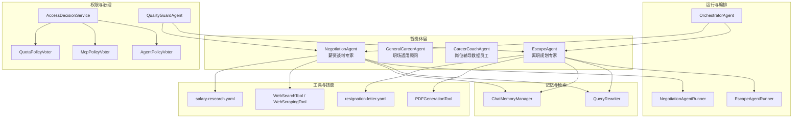
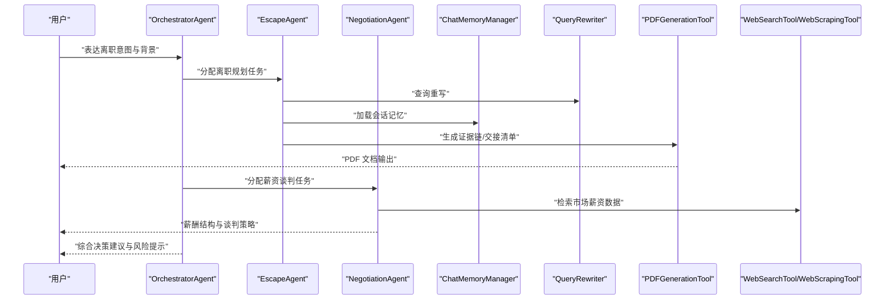
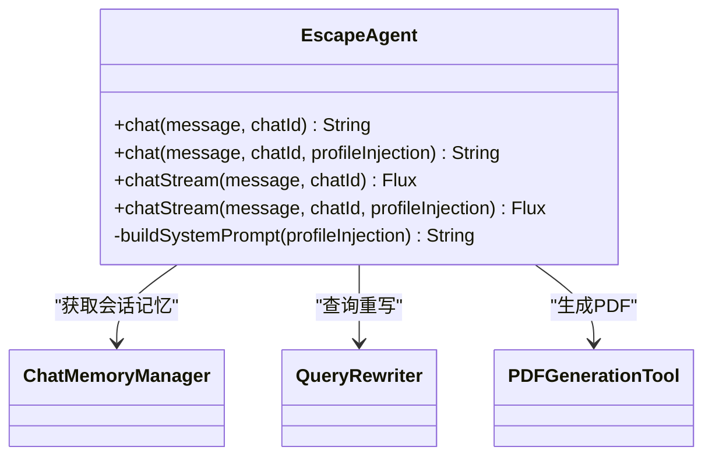
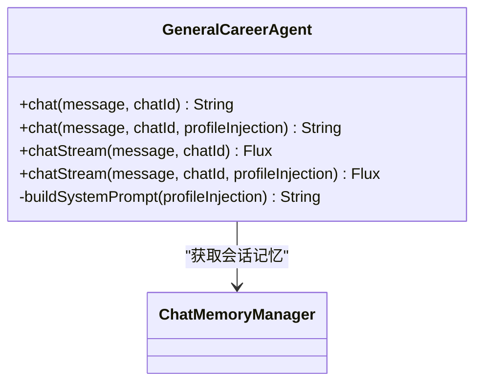
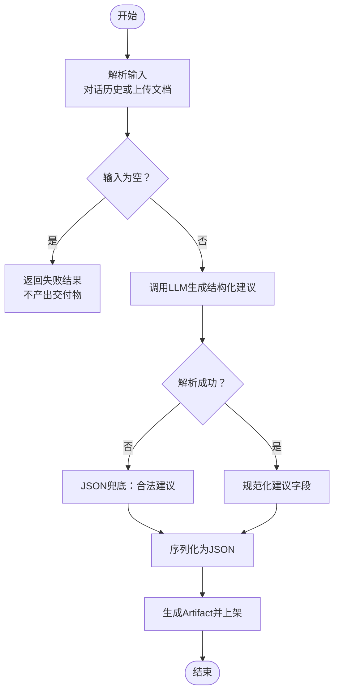
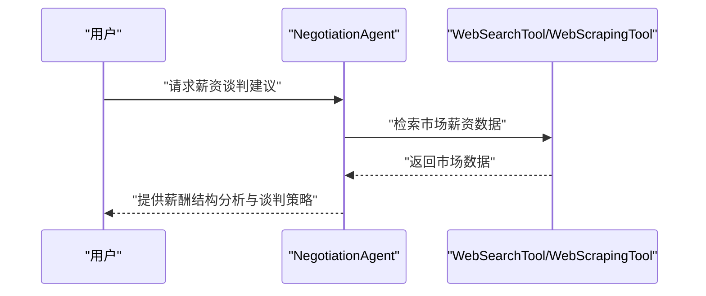
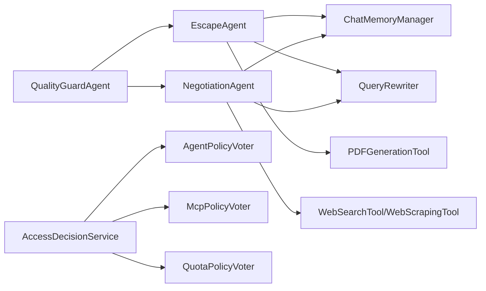

# 离职规划智能体

<cite>
**本文引用的文件**
- [EscapeAgent.java](file://src/main/java/com/yupi/yuaiagent/agent/EscapeAgent.java)
- [EscapeAgentRunner.java](file://src/main/java/com/yupi/yuaiagent/agent/runner/EscapeAgentRunner.java)
- [GeneralCareerAgent.java](file://src/main/java/com/yupi/yuaiagent/agent/GeneralCareerAgent.java)
- [CareerCoachAgent.java](file://src/main/java/com/yupi/yuaiagent/agent/data/CareerCoachAgent.java)
- [resignation-letter.yaml](file://src/main/resources/skills/resignation-letter.yaml)
- [salary-research.yaml](file://src/main/resources/skills/salary-research.yaml)
- [negotiation-agent.yaml](file://src/main/resources/agents/negotiation-agent.yaml)
- [NegotiationAgentRunner.java](file://src/main/java/com/yupi/yuaiagent/agent/runner/NegotiationAgentRunner.java)
- [NegotiationAgent.java](file://src/main/java/com/yupi/yuaiagent/agent/NegotiationAgent.java)
- [MyLoggerAdvisor.java](file://src/main/java/com/yupi/yuaiagent/advisor/MyLoggerAdvisor.java)
- [ChatMemoryManager.java](file://src/main/java/com/yupi/yuaiagent/chatmemory/ChatMemoryManager.java)
- [QueryRewriter.java](file://src/main/java/com/yupi/yuaiagent/rag/QueryRewriter.java)
- [PDFGenerationTool.java](file://src/main/java/com/yupi/yuaiagent/tools/PDFGenerationTool.java)
- [WebSearchTool.java](file://src/main/java/com/yupi/yuaiagent/tools/WebSearchTool.java)
- [WebScrapingTool.java](file://src/main/java/com/yupi/yuaiagent/tools/WebScrapingTool.java)
- [FileOperationTool.java](file://src/main/java/com/yupi/yuaiagent/tools/FileOperationTool.java)
- [ToolRegistration.java](file://src/main/java/com/yupi/yuaiagent/tools/ToolRegistration.java)
- [OrchestratorAgent.java](file://src/main/java/com/yupi/yuaiagent/agent/OrchestratorAgent.java)
- [AgentRegistry.java](file://src/main/java/com/yupi/yuaiagent/registry/AgentRegistry.java)
- [AgentRunner.java](file://src/main/java/com/yupi/yuaiagent/agent/AgentRunner.java)
- [ProductionContext.java](file://src/main/java/com/yupi/yuaiagent/agent/data/ProductionContext.java)
- [ArtifactShelf.java](file://src/main/java/com/yupi/yuaiagent/artifact/ArtifactShelf.java)
- [Artifact.java](file://src/main/java/com/yupi/yuaiagent/artifact/model/Artifact.java)
- [UserProfileService.java](file://src/main/java/com/yupi/yuaiagent/profile/UserProfileService.java)
- [UserProfile.java](file://src/main/java/com/yupi/yuaiagent/profile/model/UserProfile.java)
- [AccessDecisionService.java](file://src/main/java/com/yupi/yuaiagent/access/AccessDecisionService.java)
- [AccessVoter.java](file://src/main/java/com/yupi/yuaiagent/access/AccessVoter.java)
- [AgentPolicyVoter.java](file://src/main/java/com/yupi/yuaiagent/access/AgentPolicyVoter.java)
- [McpPolicyVoter.java](file://src/main/java/com/yupi/yuaiagent/access/McpPolicyVoter.java)
- [QuotaPolicyVoter.java](file://src/main/java/com/yupi/yuaiagent/access/QuotaPolicyVoter.java)
- [QualityGuardAgent.java](file://src/main/java/com/yupi/yuaiagent/quality/QualityGuardAgent.java)
- [RiskLevel.java](file://src/main/java/com/yupi/yuaiagent/quality/RiskLevel.java)
- [DocumentController.java](file://src/main/java/com/yupi/yuaiagent/controller/DocumentController.java)
- [DocumentAppService.java](file://src/main/java/com/yupi/yuaiagent/service/DocumentAppService.java)
- [DocumentMeta.java](file://src/main/java/com/yupi/yuaiagent/document/DocumentMeta.java)
- [DocumentMetadataManager.java](file://src/main/java/com/yupi/yuaiagent/document/DocumentMetadataManager.java)
- [DocumentStatus.java](file://src/main/java/com/yupi/yuaiagent/document/DocumentStatus.java)
- [AiChatAgent.java](file://src/main/java/com/yupi/yuaiagent/app/AiChatAgent.java)
- [AiChatAgentTest.java](file://src/test/java/com/yupi/yuaiagent/app/AiChatAgentTest.java)
</cite>

## 目录
1. [简介](#简介)
2. [项目结构](#项目结构)
3. [核心组件](#核心组件)
4. [架构总览](#架构总览)
5. [详细组件分析](#详细组件分析)
6. [依赖关系分析](#依赖关系分析)
7. [性能考量](#性能考量)
8. [故障排查指南](#故障排查指南)
9. [结论](#结论)
10. [附录](#附录)

## 简介
本文件为“离职规划智能体”的功能文档，聚焦于离职原因分析、风险评估与最佳时机选择机制，以及如何评估当前工作状况、分析离职影响、制定安全退出策略。文档还涵盖法律条款解读、经济补偿计算、职业过渡规划与心理调适建议，解释合规性检查、权益保护与风险规避策略，并提供离职流程模拟、替代方案比较与决策支持的实现细节。最后，给出具体案例分析与应对策略指南，帮助用户在复杂职场环境中做出理性、稳健的离职决策。

## 项目结构
本项目采用多智能体架构，围绕“离职规划”主题构建了多个专用 Agent 与配套工具、权限控制与质量治理模块。与离职规划直接相关的组件包括：
- 离职规划专家智能体：EscapeAgent，负责离职时机评估、证据链整理、交接清单生成、离职谈判与劳动权益保护等。
- 职场通用顾问智能体：GeneralCareerAgent，提供心理支持、压力管理与职业规划建议，辅助离职决策。
- 岗位辅导数据员工：CareerCoachAgent，基于对话历史或上传文档生成结构化“岗位辅导建议”，支撑离职前的自我审视与准备。
- 薪资谈判专家：NegotiationAgent，结合市场数据与谈判策略，辅助离职后的薪酬谈判与补偿争取。
- 技能与工具：resignation-letter、salary-research 等 YAML 技能定义，配合 PDF 生成、网络搜索、网页抓取等工具完成文档生成与信息检索。
- 运行器与编排：EscapeAgentRunner、NegotiationAgentRunner、OrchestratorAgent 等，负责对话调度、工具调用与输出整合。
- 权限与合规：AccessDecisionService、AgentPolicyVoter、McpPolicyVoter、QuotaPolicyVoter 等，保障工具调用与资源使用的合规性。
- 质量治理：QualityGuardAgent、RiskLevel 等，对输出质量与风险进行评估与控制。

图表来源
- [EscapeAgent.java:24-63](file://src/main/java/com/yupi/yuaiagent/agent/EscapeAgent.java#L24-L63)
- [EscapeAgentRunner.java:12-22](file://src/main/java/com/yupi/yuaiagent/agent/runner/EscapeAgentRunner.java#L12-L22)
- [GeneralCareerAgent.java:26-65](file://src/main/java/com/yupi/yuaiagent/agent/GeneralCareerAgent.java#L26-L65)
- [CareerCoachAgent.java:44-106](file://src/main/java/com/yupi/yuaiagent/agent/data/CareerCoachAgent.java#L44-L106)
- [NegotiationAgent.java:31-62](file://src/main/java/com/yupi/yuaiagent/agent/NegotiationAgent.java#L31-L62)
- [resignation-letter.yaml:1-55](file://src/main/resources/skills/resignation-letter.yaml#L1-L55)
- [salary-research.yaml:1-69](file://src/main/resources/skills/salary-research.yaml#L1-L69)
- [AccessDecisionService.java](file://src/main/java/com/yupi/yuaiagent/access/AccessDecisionService.java)
- [AgentPolicyVoter.java](file://src/main/java/com/yupi/yuaiagent/access/AgentPolicyVoter.java)
- [McpPolicyVoter.java](file://src/main/java/com/yupi/yuaiagent/access/McpPolicyVoter.java)
- [QuotaPolicyVoter.java](file://src/main/java/com/yupi/yuaiagent/access/QuotaPolicyVoter.java)
- [QualityGuardAgent.java](file://src/main/java/com/yupi/yuaiagent/quality/QualityGuardAgent.java)

章节来源
- [EscapeAgent.java:15-37](file://src/main/java/com/yupi/yuaiagent/agent/EscapeAgent.java#L15-L37)
- [GeneralCareerAgent.java:13-45](file://src/main/java/com/yupi/yuaiagent/agent/GeneralCareerAgent.java#L13-L45)
- [CareerCoachAgent.java:27-76](file://src/main/java/com/yupi/yuaiagent/agent/data/CareerCoachAgent.java#L27-L76)
- [NegotiationAgent.java:31-36](file://src/main/java/com/yupi/yuaiagent/agent/NegotiationAgent.java#L31-L36)

## 核心组件
- 离职规划专家智能体（EscapeAgent）
  - 职责：离职时机评估、证据链整理、交接清单生成、离职谈判、劳动权益保护、离职后规划。
  - 特性：集成 ChatMemoryManager 会话记忆、QueryRewriter 查询重写、工具回调（PDF 生成、搜索等）。
  - 输出：文本回复与可选的 PDF 文档（证据链、交接清单等）。
- 职场通用顾问智能体（GeneralCareerAgent）
  - 职责：情感支持、人际关系处理、压力管理、职业规划与转型建议。
  - 特性：温暖、真诚的对话风格，强调共情—分析—建议的三段式结构。
- 岗位辅导数据员工（CareerCoachAgent）
  - 职责：基于对话历史或上传文档生成结构化的“岗位辅导建议”，包含研判摘要、建议清单、行动项与技能推荐。
  - 特性：输入解析（对话/文档）、结构化解析与 JSON 兜底、Artifact 托管与生命周期管理。
- 薪资谈判专家（NegotiationAgent）
  - 职责：市场薪资调研、薪酬结构拆解、谈判话术与时机把握。
  - 特性：结合 WebSearchTool/WebScrapingTool 获取实时数据，提供可执行的谈判策略。
- 技能与工具
  - resignation-letter.yaml：离职工具链，覆盖离职申请、交接清单、离职话术与注意事项。
  - salary-research.yaml：薪资调研工具链，提供市场薪资范围、结构分析与谈薪策略。
  - PDFGenerationTool：将对话结果或结构化数据生成 PDF 文档，便于归档与提交。
  - WebSearchTool/WebScrapingTool：用于检索外部数据，支撑谈判与补偿计算。
- 运行器与编排
  - EscapeAgentRunner/NegotiationAgentRunner：封装智能体运行与输出格式化。
  - OrchestratorAgent：协调多智能体与工具调用，实现复杂流程编排。

章节来源
- [EscapeAgent.java:26-86](file://src/main/java/com/yupi/yuaiagent/agent/EscapeAgent.java#L26-L86)
- [GeneralCareerAgent.java:28-87](file://src/main/java/com/yupi/yuaiagent/agent/GeneralCareerAgent.java#L28-L87)
- [CareerCoachAgent.java:108-136](file://src/main/java/com/yupi/yuaiagent/agent/data/CareerCoachAgent.java#L108-L136)
- [resignation-letter.yaml:7-51](file://src/main/resources/skills/resignation-letter.yaml#L7-L51)
- [salary-research.yaml:7-65](file://src/main/resources/skills/salary-research.yaml#L7-L65)
- [EscapeAgentRunner.java:15-18](file://src/main/java/com/yupi/yuaiagent/agent/runner/EscapeAgentRunner.java#L15-L18)
- [NegotiationAgentRunner.java:15-18](file://src/main/java/com/yupi/yuaiagent/agent/runner/NegotiationAgentRunner.java#L15-L18)

## 架构总览
下图展示离职规划智能体在系统中的交互关系与数据流：

图表来源
- [EscapeAgent.java:74-85](file://src/main/java/com/yupi/yuaiagent/agent/EscapeAgent.java#L74-L85)
- [NegotiationAgent.java:31-36](file://src/main/java/com/yupi/yuaiagent/agent/NegotiationAgent.java#L31-L36)
- [PDFGenerationTool.java](file://src/main/java/com/yupi/yuaiagent/tools/PDFGenerationTool.java)
- [WebSearchTool.java](file://src/main/java/com/yupi/yuaiagent/tools/WebSearchTool.java)
- [WebScrapingTool.java](file://src/main/java/com/yupi/yuaiagent/tools/WebScrapingTool.java)
- [ChatMemoryManager.java](file://src/main/java/com/yupi/yuaiagent/chatmemory/ChatMemoryManager.java)
- [QueryRewriter.java](file://src/main/java/com/yupi/yuaiagent/rag/QueryRewriter.java)

## 详细组件分析

### 离职规划专家智能体（EscapeAgent）
- 系统提示词设计：明确“优雅、体面地完成离职过程”的职责边界，覆盖时机评估、证据链整理、交接清单、离职谈判、劳动权益保护与离职后规划。
- 会话记忆：通过 ChatMemoryManager 获取共享记忆，支持跨轮对话的记忆延续。
- 查询重写：使用 QueryRewriter 对用户输入进行重写，提升检索与生成质量。
- 工具集成：支持 PDF 生成工具，按需输出证据链与交接清单文档。
- 对话接口：同步与流式对话均支持画像注入（profileInjection），增强个性化建议。

图表来源
- [EscapeAgent.java:24-118](file://src/main/java/com/yupi/yuaiagent/agent/EscapeAgent.java#L24-L118)
- [ChatMemoryManager.java](file://src/main/java/com/yupi/yuaiagent/chatmemory/ChatMemoryManager.java)
- [QueryRewriter.java](file://src/main/java/com/yupi/yuaiagent/rag/QueryRewriter.java)
- [PDFGenerationTool.java](file://src/main/java/com/yupi/yuaiagent/tools/PDFGenerationTool.java)

章节来源
- [EscapeAgent.java:26-118](file://src/main/java/com/yupi/yuaiagent/agent/EscapeAgent.java#L26-L118)

### 职场通用顾问智能体（GeneralCareerAgent）
- 系统提示词设计：强调共情—分析—建议的三段式风格，覆盖情感支持、人际关系、压力管理、职业规划与转型。
- 会话记忆：通过 ChatMemoryManager 获取“general”记忆空间，独立于其他智能体。
- 对话接口：支持同步与流式对话，支持画像注入以增强个性化建议。

图表来源
- [GeneralCareerAgent.java:26-118](file://src/main/java/com/yupi/yuaiagent/agent/GeneralCareerAgent.java#L26-L118)
- [ChatMemoryManager.java](file://src/main/java/com/yupi/yuaiagent/chatmemory/ChatMemoryManager.java)

章节来源
- [GeneralCareerAgent.java:28-118](file://src/main/java/com/yupi/yuaiagent/agent/GeneralCareerAgent.java#L28-L118)

### 岗位辅导数据员工（CareerCoachAgent）
- 生产流程：解析输入（对话历史或上传文档）→ 结构化解析 → JSON 兜底 → 生成 Artifact → 放置到共享货架。
- 输入解析：根据 AnalysisSource 选择对话历史或文档内容；对话历史通过 ChatMemoryManager 读取并格式化。
- 结构化解析：使用 Spring AI 实体映射生成结构化建议对象，再序列化为 JSON。
- 兜底策略：解析失败时返回预设合法 JSON，确保交付物内容可用。

图表来源
- [CareerCoachAgent.java:114-136](file://src/main/java/com/yupi/yuaiagent/agent/data/CareerCoachAgent.java#L114-L136)
- [CareerCoachAgent.java:220-233](file://src/main/java/com/yupi/yuaiagent/agent/data/CareerCoachAgent.java#L220-L233)
- [CareerCoachAgent.java:238-272](file://src/main/java/com/yupi/yuaiagent/agent/data/CareerCoachAgent.java#L238-L272)

章节来源
- [CareerCoachAgent.java:108-136](file://src/main/java/com/yupi/yuaiagent/agent/data/CareerCoachAgent.java#L108-L136)
- [CareerCoachAgent.java:147-174](file://src/main/java/com/yupi/yuaiagent/agent/data/CareerCoachAgent.java#L147-L174)
- [CareerCoachAgent.java:220-272](file://src/main/java/com/yupi/yuaiagent/agent/data/CareerCoachAgent.java#L220-L272)

### 薪资谈判专家（NegotiationAgent）
- 系统提示词：强调先了解市场数据再给出建议，覆盖薪资范围分析、结构拆解、谈判话术与时机把握。
- 工具集成：结合 WebSearchTool/WebScrapingTool 获取实时市场数据，支撑谈判策略制定。
- 会话记忆：通过 ChatMemoryManager 获取“negotiation”记忆空间，独立管理谈判对话。

图表来源
- [NegotiationAgent.java:31-36](file://src/main/java/com/yupi/yuaiagent/agent/NegotiationAgent.java#L31-L36)
- [WebSearchTool.java](file://src/main/java/com/yupi/yuaiagent/tools/WebSearchTool.java)
- [WebScrapingTool.java](file://src/main/java/com/yupi/yuaiagent/tools/WebScrapingTool.java)

章节来源
- [NegotiationAgent.java:31-62](file://src/main/java/com/yupi/yuaiagent/agent/NegotiationAgent.java#L31-L62)
- [negotiation-agent.yaml:1-22](file://src/main/resources/agents/negotiation-agent.yaml#L1-L22)

### 技能与工具链
- resignation-letter.yaml：定义离职工具链，输出包括离职申请、通知邮件、交接清单、离职面谈话术与注意事项。
- salary-research.yaml：定义薪资调研工具链，输出市场薪资范围、薪资结构分析、谈薪策略与注意事项。
- PDFGenerationTool：将结构化内容或对话结果生成 PDF，便于归档与提交。
- WebSearchTool/WebScrapingTool：用于检索外部数据，支撑谈判与补偿计算。

章节来源
- [resignation-letter.yaml:1-55](file://src/main/resources/skills/resignation-letter.yaml#L1-L55)
- [salary-research.yaml:1-69](file://src/main/resources/skills/salary-research.yaml#L1-L69)
- [PDFGenerationTool.java](file://src/main/java/com/yupi/yuaiagent/tools/PDFGenerationTool.java)
- [WebSearchTool.java](file://src/main/java/com/yupi/yuaiagent/tools/WebSearchTool.java)
- [WebScrapingTool.java](file://src/main/java/com/yupi/yuaiagent/tools/WebScrapingTool.java)

### 运行器与编排
- EscapeAgentRunner/NegotiationAgentRunner：封装智能体运行，统一输出格式化与令牌用量统计。
- OrchestratorAgent：协调多智能体与工具调用，实现复杂流程编排与决策支持。

章节来源
- [EscapeAgentRunner.java:15-22](file://src/main/java/com/yupi/yuaiagent/agent/runner/EscapeAgentRunner.java#L15-L22)
- [NegotiationAgentRunner.java:15-22](file://src/main/java/com/yupi/yuaiagent/agent/runner/NegotiationAgentRunner.java#L15-L22)
- [OrchestratorAgent.java](file://src/main/java/com/yupi/yuaiagent/agent/OrchestratorAgent.java)

## 依赖关系分析
- 智能体与工具
  - EscapeAgent 依赖 ChatMemoryManager、QueryRewriter、PDFGenerationTool。
  - NegotiationAgent 依赖 ChatMemoryManager、QueryRewriter、WebSearchTool/WebScrapingTool。
- 权限与合规
  - AccessDecisionService 统一决策，AgentPolicyVoter/McpPolicyVoter/QuotaPolicyVoter 分别负责智能体策略、MCP 策略与配额策略。
- 质量治理
  - QualityGuardAgent 与 RiskLevel 对输出质量与风险进行评估与控制。

图表来源
- [EscapeAgent.java:39-60](file://src/main/java/com/yupi/yuaiagent/agent/EscapeAgent.java#L39-L60)
- [NegotiationAgent.java:38-62](file://src/main/java/com/yupi/yuaiagent/agent/NegotiationAgent.java#L38-L62)
- [AccessDecisionService.java](file://src/main/java/com/yupi/yuaiagent/access/AccessDecisionService.java)
- [AgentPolicyVoter.java](file://src/main/java/com/yupi/yuaiagent/access/AgentPolicyVoter.java)
- [McpPolicyVoter.java](file://src/main/java/com/yupi/yuaiagent/access/McpPolicyVoter.java)
- [QuotaPolicyVoter.java](file://src/main/java/com/yupi/yuaiagent/access/QuotaPolicyVoter.java)
- [QualityGuardAgent.java](file://src/main/java/com/yupi/yuaiagent/quality/QualityGuardAgent.java)

章节来源
- [AccessDecisionService.java](file://src/main/java/com/yupi/yuaiagent/access/AccessDecisionService.java)
- [AgentPolicyVoter.java](file://src/main/java/com/yupi/yuaiagent/access/AgentPolicyVoter.java)
- [McpPolicyVoter.java](file://src/main/java/com/yupi/yuaiagent/access/McpPolicyVoter.java)
- [QuotaPolicyVoter.java](file://src/main/java/com/yupi/yuaiagent/access/QuotaPolicyVoter.java)
- [QualityGuardAgent.java](file://src/main/java/com/yupi/yuaiagent/quality/QualityGuardAgent.java)

## 性能考量
- 会话记忆复用：通过 ChatMemoryManager 统一管理记忆，减少重复输入与上下文开销。
- 查询重写：QueryRewriter 提升检索与生成质量，降低无效对话轮次。
- 工具调用限制：通过 ToolCallback 与权限策略控制工具调用频率与范围，避免资源滥用。
- 输出格式化：统一使用 TextOutput/Artifact 输出，便于前端渲染与归档。

## 故障排查指南
- 离职规划专家智能体
  - 症状：无法生成 PDF 或输出为空。
  - 排查：确认 PDFGenerationTool 是否正确注册与可用；检查 resignation-letter.yaml 的输出格式是否匹配。
  - 参考：EscapeAgent 的工具回调与系统提示词。
- 薪资谈判专家
  - 症状：无法获取市场数据或输出不稳定。
  - 排查：检查 WebSearchTool/WebScrapingTool 的可用性与网络访问权限；确认 negotiation-agent.yaml 的权限配置。
- 记忆与会话
  - 症状：对话记忆丢失或错乱。
  - 排查：确认 ChatMemoryManager 的记忆空间命名与会话 ID；检查 MemoryCompressor/CompressionStrategy 的压缩策略。
- 权限与合规
  - 症状：工具调用被拒绝或超限。
  - 排查：检查 AccessDecisionService 的投票结果与策略配置；核对 AgentPolicyVoter/McpPolicyVoter/QuotaPolicyVoter 的阈值。
- 质量治理
  - 症状：输出质量不达标或风险较高。
  - 排查：查看 QualityGuardAgent 的评估日志与 RiskLevel 的分级结果。

章节来源
- [EscapeAgent.java:39-86](file://src/main/java/com/yupi/yuaiagent/agent/EscapeAgent.java#L39-L86)
- [resignation-letter.yaml:33-51](file://src/main/resources/skills/resignation-letter.yaml#L33-L51)
- [negotiation-agent.yaml:5-14](file://src/main/resources/agents/negotiation-agent.yaml#L5-L14)
- [AccessDecisionService.java](file://src/main/java/com/yupi/yuaiagent/access/AccessDecisionService.java)
- [QualityGuardAgent.java](file://src/main/java/com/yupi/yuaiagent/quality/QualityGuardAgent.java)

## 结论
离职规划智能体通过多智能体协同、结构化输出与合规治理，为用户提供从“离职原因分析—风险评估—最佳时机选择—安全退出策略—法律与经济保障—职业过渡与心理调适”的全链路支持。借助会话记忆、查询重写与工具链，系统能够稳定、可扩展地处理复杂的离职场景，并在权限与质量层面提供可靠保障。

## 附录

### 离职流程模拟与替代方案比较
- 流程模拟
  - 步骤一：现状评估（工作满意度、收入与晋升空间、人际关系与压力）
  - 步骤二：风险评估（竞业协议、经济补偿、背调应对、社保公积金转移）
  - 步骤三：时机选择（合同到期、试用期、法定情形、协商一致）
  - 步骤四：证据链整理（工作成果、绩效记录、沟通记录）
  - 步骤五：交接清单制定（知识、系统、客户、流程）
  - 步骤六：谈判策略（补偿、代通知金、N+1、服务期约定）
  - 步骤七：后续规划（简历优化、面试准备、心理调适）
- 替代方案比较
  - 内部转岗：评估内部机会与成本收益，减少跳槽成本与不确定性。
  - 降薪留任：权衡短期收入与长期发展，关注技能积累与平台价值。
  - 申请离职：在满足法定或约定条件下，确保程序合规与补偿到位。

章节来源
- [EscapeAgent.java:26-37](file://src/main/java/com/yupi/yuaiagent/agent/EscapeAgent.java#L26-L37)
- [resignation-letter.yaml:23-51](file://src/main/resources/skills/resignation-letter.yaml#L23-L51)

### 法律条款解读与经济补偿计算
- 法律条款解读
  - 试用期解除：需证明不符合录用条件，保留培训记录与考核材料。
  - 不胜任调岗：需有明确的调岗安排与培训计划，避免单方变更。
  - 严重违纪：需有制度依据与程序合规，保留书面警告与申诉记录。
- 经济补偿计算
  - N：工作年限（不满一年按一年算，满半年不满一年按半年算）
  - 月平均工资：合同解除前十二个月平均工资，若低于当地最低工资则按最低工资计算。
  - 计算方式：N × 月平均工资；若存在违法解除，可能适用双倍补偿。

章节来源
- [EscapeAgent.java:31-34](file://src/main/java/com/yupi/yuaiagent/agent/EscapeAgent.java#L31-L34)
- [resignation-letter.yaml:14-21](file://src/main/resources/skills/resignation-letter.yaml#L14-L21)

### 职业过渡规划与心理调适建议
- 职业过渡规划
  - 明确目标：岗位方向、城市选择、薪资预期与成长路径。
  - 能力建模：识别差距与学习计划，利用 CareerCoachAgent 的技能推荐。
  - 简历与作品集：突出关键成果与可量化指标，参考 ResumeAgent 的优化建议。
- 心理调适
  - 接纳变化：允许焦虑与不确定感的存在，建立阶段性目标。
  - 社交支持：维护同事与导师关系，寻求情感与经验支持。
  - 新环境适应：提前了解公司文化与团队氛围，做好角色转换准备。

章节来源
- [GeneralCareerAgent.java:28-44](file://src/main/java/com/yupi/yuaiagent/agent/GeneralCareerAgent.java#L28-L44)
- [CareerCoachAgent.java:69-76](file://src/main/java/com/yupi/yuaiagent/agent/data/CareerCoachAgent.java#L69-L76)

### 合规性检查、权益保护与风险规避策略
- 合规性检查
  - 工具调用：通过 AccessDecisionService 与各类 Voter 进行策略校验，防止越权与滥用。
  - 输出质量：QualityGuardAgent 评估输出风险等级，必要时触发人工复核。
- 权益保护
  - 竞业协议：识别限制范围与补偿标准，必要时通过法律途径维权。
  - 背调应对：提前准备事实依据与证人材料，避免不实信息影响求职。
- 风险规避
  - 证据保全：定期导出工作成果与沟通记录，形成完整证据链。
  - 时间管理：合理安排交接与离职日期，避免违约与连带责任。

章节来源
- [AccessDecisionService.java](file://src/main/java/com/yupi/yuaiagent/access/AccessDecisionService.java)
- [AgentPolicyVoter.java](file://src/main/java/com/yupi/yuaiagent/access/AgentPolicyVoter.java)
- [McpPolicyVoter.java](file://src/main/java/com/yupi/yuaiagent/access/McpPolicyVoter.java)
- [QuotaPolicyVoter.java](file://src/main/java/com/yupi/yuaiagent/access/QuotaPolicyVoter.java)
- [QualityGuardAgent.java](file://src/main/java/com/yupi/yuaiagent/quality/QualityGuardAgent.java)

### 决策支持实现细节
- 多智能体协同：EscapeAgent 负责流程与文档，NegotiationAgent 负责数据与策略，GeneralCareerAgent 提供心理与规划支持，CareerCoachAgent 提供结构化建议。
- 工具绑定：通过 ToolRegistration 与技能 YAML 定义，将工具与智能体能力绑定，实现即插即用。
- 输出标准化：统一使用 Artifact/TextOutput 承载结果，便于前端展示与归档。

章节来源
- [EscapeAgentRunner.java:15-18](file://src/main/java/com/yupi/yuaiagent/agent/runner/EscapeAgentRunner.java#L15-L18)
- [NegotiationAgentRunner.java:15-18](file://src/main/java/com/yupi/yuaiagent/agent/runner/NegotiationAgentRunner.java#L15-L18)
- [ToolRegistration.java](file://src/main/java/com/yupi/yuaiagent/tools/ToolRegistration.java)
- [resignation-letter.yaml:1-5](file://src/main/resources/skills/resignation-letter.yaml#L1-L5)
- [salary-research.yaml:1-5](file://src/main/resources/skills/salary-research.yaml#L1-L5)

### 具体案例分析与应对策略指南
- 案例一：因晋升通道受限而离职
  - 分析：评估内部转岗机会与外部市场对比，识别核心竞争力与缺口。
  - 策略：优先内部转岗，若失败则按法定条件申请离职，确保补偿与交接规范。
- 案例二：遭遇不公正辞退
  - 分析：收集试用期不符合录用条件、培训记录与考核材料。
  - 策略：协商优先，协商不成可申请仲裁，必要时寻求法律援助。
- 案例三：准备跳槽期间被调岗降薪
  - 分析：评估调岗合理性与补偿差异，识别是否构成单方变更。
  - 策略：保留沟通记录与调岗文件，协商补偿或依法解除劳动关系。

章节来源
- [EscapeAgent.java:26-37](file://src/main/java/com/yupi/yuaiagent/agent/EscapeAgent.java#L26-L37)
- [resignation-letter.yaml:17-21](file://src/main/resources/skills/resignation-letter.yaml#L17-L21)
- [salary-research.yaml:17-25](file://src/main/resources/skills/salary-research.yaml#L17-L25)