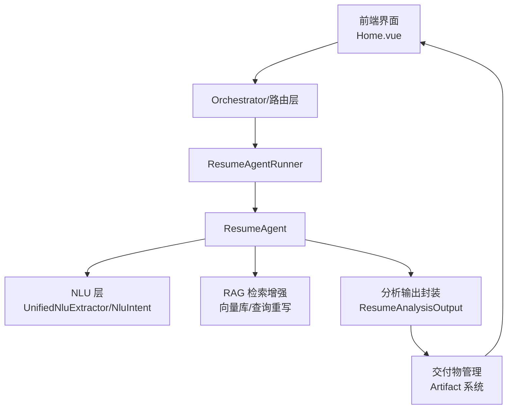
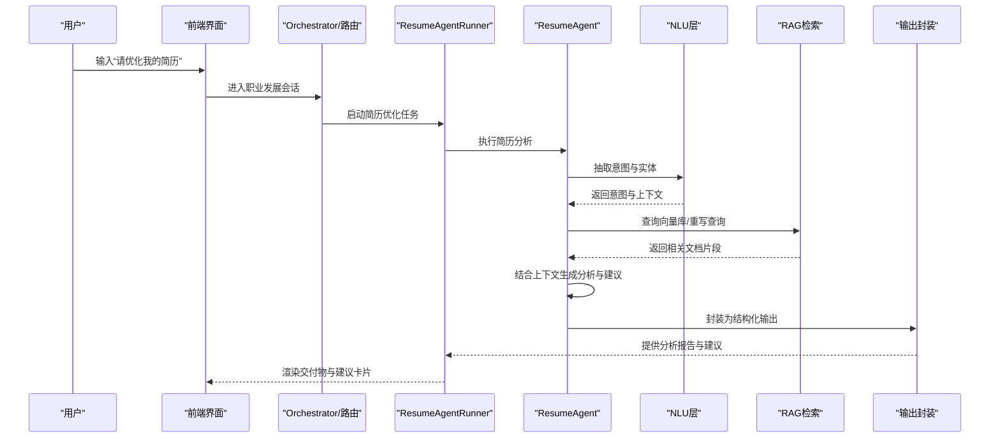
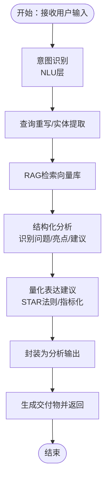
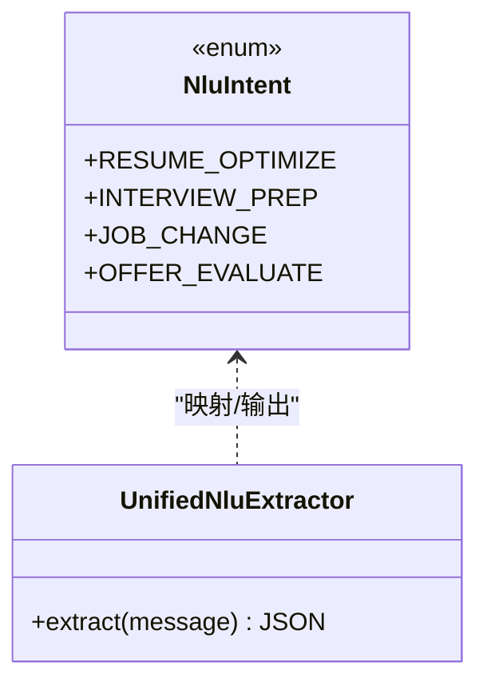
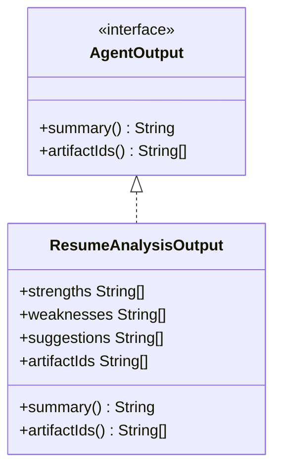
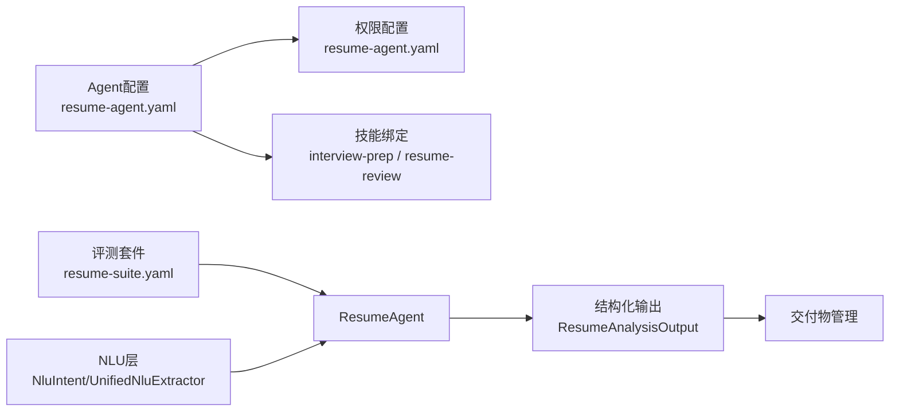

# 简历专家智能体

<cite>
**本文引用的文件**
- [ResumeAgent.java](file://src/main/java/com/yupi/yuaiagent/agent/ResumeAgent.java)
- [ResumeAgentRunner.java](file://src/main/java/com/yupi/yuaiagent/agent/runner/ResumeAgentRunner.java)
- [resume-agent.yaml](file://src/main/resources/agents/resume-agent.yaml)
- [resume-agent.yaml](file://src/main/resources/permissions/resume-agent.yaml)
- [resume-suite.yaml](file://src/main/resources/eval/resume-suite.yaml)
- [UnifiedNluExtractor.java](file://src/main/java/com/yupi/yuaiagent/nlu/UnifiedNluExtractor.java)
- [NluIntent.java](file://src/main/java/com/yupi/yuaiagent/nlu/NluIntent.java)
- [ResumeAnalysisOutput.java](file://docs/multi-agent-runtime-architecture.md)
- [prototype-chat.html](file://docs/prototype-chat.html)
- [Home.vue](file://yu-ai-agent-frontend/src/views/Home.vue)
</cite>

## 目录
1. [简介](#简介)
2. [项目结构](#项目结构)
3. [核心组件](#核心组件)
4. [架构总览](#架构总览)
5. [详细组件分析](#详细组件分析)
6. [依赖关系分析](#依赖关系分析)
7. [性能与扩展性](#性能与扩展性)
8. [故障排查指南](#故障排查指南)
9. [结论](#结论)
10. [附录](#附录)

## 简介
本文件面向“简历专家智能体”的功能与实现进行系统化说明，聚焦以下目标：
- 简历优化核心算法与文档分析技术
- 改进建议生成机制与交付物管理
- 简历内容处理、关键信息识别、结构布局分析与表达优化
- 格式标准化、关键词优化、工作经验描述改进与技能展示策略
- 个性化定制、行业适配与输出质量控制
- 分析报告生成、多版本对比与最终优化建议的实现细节
- 使用示例与最佳实践

## 项目结构
简历专家智能体在整体多智能体平台中以“咨询型”Agent形式提供服务，前端通过聊天界面引导用户进入“职业发展”会话，后端由 ResumeAgent 负责意图识别、RAG检索增强、分析与建议生成，并通过统一的交付物体系输出结果。

图表来源
- [ResumeAgentRunner.java](file://src/main/java/com/yupi/yuaiagent/agent/runner/ResumeAgentRunner.java)
- [ResumeAgent.java](file://src/main/java/com/yupi/yuaiagent/agent/ResumeAgent.java)
- [UnifiedNluExtractor.java](file://src/main/java/com/yupi/yuaiagent/nlu/UnifiedNluExtractor.java)
- [NluIntent.java](file://src/main/java/com/yupi/yuaiagent/nlu/NluIntent.java)
- [ResumeAnalysisOutput.java](file://docs/multi-agent-runtime-architecture.md)

章节来源
- [Home.vue:105-122](file://yu-ai-agent-frontend/src/views/Home.vue#L105-L122)
- [resume-agent.yaml:1-26](file://src/main/resources/agents/resume-agent.yaml#L1-L26)
- [resume-agent.yaml:1-14](file://src/main/resources/permissions/resume-agent.yaml#L1-L14)

## 核心组件
- ResumeAgent：简历优化主流程执行者，负责意图理解、RAG检索、分析与建议生成、交付物产出。
- ResumeAgentRunner：任务编排器，协调工具调用、状态流转与结果聚合。
- NLU层：统一意图抽取与实体识别，将用户输入映射到简历相关意图。
- RAG检索：基于向量存储与查询重写，增强简历分析的知识支撑。
- 输出封装：统一的分析输出结构，便于交付物管理与前端渲染。
- 权限与配置：Agent元数据、权限策略、能力绑定与意图关键词。

章节来源
- [ResumeAgent.java:31-59](file://src/main/java/com/yupi/yuaiagent/agent/ResumeAgent.java#L31-L59)
- [ResumeAgentRunner.java](file://src/main/java/com/yupi/yuaiagent/agent/runner/ResumeAgentRunner.java)
- [UnifiedNluExtractor.java:29-56](file://src/main/java/com/yupi/yuaiagent/nlu/UnifiedNluExtractor.java#L29-L56)
- [NluIntent.java:1-33](file://src/main/java/com/yupi/yuaiagent/nlu/NluIntent.java#L1-L33)
- [ResumeAnalysisOutput.java:71-137](file://docs/multi-agent-runtime-architecture.md#L71-L137)
- [resume-agent.yaml:1-26](file://src/main/resources/agents/resume-agent.yaml#L1-L26)
- [resume-agent.yaml:1-14](file://src/main/resources/permissions/resume-agent.yaml#L1-L14)

## 架构总览
简历专家智能体采用“意图识别 + 检索增强 + 结构化分析 + 交付物输出”的闭环架构。用户通过前端发起“简历优化”请求，系统经由 Runner 调度 ResumeAgent，后者结合 NLU 与 RAG 完成分析，最终以结构化输出与交付物形式呈现。

图表来源
- [ResumeAgentRunner.java](file://src/main/java/com/yupi/yuaiagent/agent/runner/ResumeAgentRunner.java)
- [ResumeAgent.java:31-59](file://src/main/java/com/yupi/yuaiagent/agent/ResumeAgent.java#L31-L59)
- [UnifiedNluExtractor.java:29-56](file://src/main/java/com/yupi/yuaiagent/nlu/UnifiedNluExtractor.java#L29-L56)
- [ResumeAnalysisOutput.java:71-137](file://docs/multi-agent-runtime-architecture.md#L71-L137)

## 详细组件分析

### ResumeAgent：简历优化主流程
- 专长范围：简历结构优化、成果量化表达、面试技巧、Offer评估、求职策略。
- RAG配置：相似度阈值、TopK、状态过滤等参数用于检索增强。
- 记忆集成：通过共享记忆模块维护会话上下文，提升个性化建议质量。
- 处理流程：接收用户输入 → 意图识别 → RAG检索 → 结构化分析 → 建议生成 → 交付物封装。

图表来源
- [ResumeAgent.java:31-59](file://src/main/java/com/yupi/yuaiagent/agent/ResumeAgent.java#L31-L59)
- [UnifiedNluExtractor.java:29-56](file://src/main/java/com/yupi/yuaiagent/nlu/UnifiedNluExtractor.java#L29-L56)

章节来源
- [ResumeAgent.java:31-59](file://src/main/java/com/yupi/yuaiagent/agent/ResumeAgent.java#L31-L59)

### ResumeAgentRunner：任务编排与工具调度
- 职责：根据任务描述与上下文，驱动 ResumeAgent 执行分析与建议生成。
- 协调：管理工具调用次数、权限校验与错误恢复。
- 输出：将结构化分析结果交由统一输出封装与交付物管理。

章节来源
- [ResumeAgentRunner.java](file://src/main/java/com/yupi/yuaiagent/agent/runner/ResumeAgentRunner.java)

### NLU层：意图识别与实体抽取
- 统一提示词模板：定义简历相关意图类别（如简历优化、面试准备、求职换岗等）。
- 输出格式：严格JSON结构，包含意图列表、置信度、实体、维度等。
- 映射关系：NLU枚举与下游 AgentIntent 一一对应，确保语义一致性。

图表来源
- [NluIntent.java:1-33](file://src/main/java/com/yupi/yuaiagent/nlu/NluIntent.java#L1-L33)
- [UnifiedNluExtractor.java:29-56](file://src/main/java/com/yupi/yuaiagent/nlu/UnifiedNluExtractor.java#L29-L56)

章节来源
- [NluIntent.java:1-33](file://src/main/java/com/yupi/yuaiagent/nlu/NluIntent.java#L1-L33)
- [UnifiedNluExtractor.java:29-56](file://src/main/java/com/yupi/yuaiagent/nlu/UnifiedNluExtractor.java#L29-L56)

### 结构化输出与交付物
- ResumeAnalysisOutput：封装“优势/劣势/建议/交付物ID”等字段，支持统一摘要与交付物关联。
- 典型用途：前端“预览面板”展示问题诊断、建议标签与修改方向，支持导出PDF等。

图表来源
- [ResumeAnalysisOutput.java:71-137](file://docs/multi-agent-runtime-architecture.md#L71-L137)

章节来源
- [ResumeAnalysisOutput.java:71-137](file://docs/multi-agent-runtime-architecture.md#L71-L137)
- [prototype-chat.html:305-383](file://docs/prototype-chat.html#L305-L383)

### 前端交互与交付物预览
- 首页能力卡片：提供“简历优化”入口，引导至职业发展会话。
- 聊天原型：展示“诊断结果”“建议标签”“修改方向”“导出PDF”等交互元素。
- 交付物面板：问题诊断、建议标签、修改方向分区块展示，支持查看详情与导出。

章节来源
- [Home.vue:105-122](file://yu-ai-agent-frontend/src/views/Home.vue#L105-L122)
- [prototype-chat.html:305-383](file://docs/prototype-chat.html#L305-L383)

## 依赖关系分析
- Agent配置与权限：resume-agent.yaml 定义能力、技能绑定、意图关键词与元数据；权限文件限制工具模式、信任分与访问范围。
- 评测套件：resume-suite.yaml 定义典型用例、评分规则与通过阈值，覆盖简历优化、STAR法则应用、关键词匹配与行业适配等场景。
- 意图映射：NLU层与 AgentIntent 的一对一映射，保证下游逻辑一致性。

图表来源
- [resume-agent.yaml:1-26](file://src/main/resources/agents/resume-agent.yaml#L1-L26)
- [resume-agent.yaml:1-14](file://src/main/resources/permissions/resume-agent.yaml#L1-L14)
- [resume-suite.yaml:1-18](file://src/main/resources/eval/resume-suite.yaml#L1-L18)
- [NluIntent.java:1-33](file://src/main/java/com/yupi/yuaiagent/nlu/NluIntent.java#L1-L33)
- [UnifiedNluExtractor.java:29-56](file://src/main/java/com/yupi/yuaiagent/nlu/UnifiedNluExtractor.java#L29-L56)
- [ResumeAnalysisOutput.java:71-137](file://docs/multi-agent-runtime-architecture.md#L71-L137)

章节来源
- [resume-agent.yaml:1-26](file://src/main/resources/agents/resume-agent.yaml#L1-L26)
- [resume-agent.yaml:1-14](file://src/main/resources/permissions/resume-agent.yaml#L1-L14)
- [resume-suite.yaml:1-18](file://src/main/resources/eval/resume-suite.yaml#L1-L18)
- [NluIntent.java:1-33](file://src/main/java/com/yupi/yuaiagent/nlu/NluIntent.java#L1-L33)
- [UnifiedNluExtractor.java:29-56](file://src/main/java/com/yupi/yuaiagent/nlu/UnifiedNluExtractor.java#L29-L56)

## 性能与扩展性
- 检索效率：通过 TopK 与相似度阈值控制检索规模，降低无关文档干扰。
- 上下文压缩：结合聊天记忆与压缩策略，减少重复信息传输，提高响应速度。
- 可扩展性：新增意图与技能可通过配置文件快速接入；评测套件持续完善覆盖度。

[本节为通用性能讨论，不直接分析具体文件]

## 故障排查指南
- 意图识别异常：检查 NLU 提示词与输出格式是否符合预期，确认意图枚举映射正确。
- RAG检索无结果：核对查询重写逻辑、向量库构建与相似度阈值设置。
- 交付物为空：确认输出封装字段是否正确填充，检查 Runner 是否正确收集与传递结果。
- 权限不足：核对权限配置中的工具模式与访问范围，确保文件系统与网络访问策略满足需求。

章节来源
- [UnifiedNluExtractor.java:29-56](file://src/main/java/com/yupi/yuaiagent/nlu/UnifiedNluExtractor.java#L29-L56)
- [ResumeAgent.java:31-59](file://src/main/java/com/yupi/yuaiagent/agent/ResumeAgent.java#L31-L59)
- [ResumeAnalysisOutput.java:71-137](file://docs/multi-agent-runtime-architecture.md#L71-L137)
- [resume-agent.yaml:1-14](file://src/main/resources/permissions/resume-agent.yaml#L1-L14)

## 结论
简历专家智能体通过“意图识别 + 检索增强 + 结构化分析 + 交付物输出”的闭环，实现了简历内容的深度分析与可落地的优化建议。其配置化能力、评测驱动的质量控制与前端友好的交付物预览，共同构成了可扩展、可验证、易使用的简历优化解决方案。

[本节为总结性内容，不直接分析具体文件]

## 附录

### 使用示例与最佳实践
- 示例1：请优化一份Java开发工程师的简历，突出项目经验和技术栈
  - 建议：使用STAR法则重写经历，量化指标（QPS、可用性、降本比例），按JD优先级重排技能栈。
- 示例2：简历中一段工作经历写的是“负责公司后台管理系统开发”，请优化
  - 建议：补充具体技术、规模、成果，体现个人贡献与业务价值。
- 示例3：针对阿里巴巴Java后端岗位调整简历重点
  - 建议：匹配关键词、突出高并发与电商系统经验，提炼差异化竞争力。

章节来源
- [resume-suite.yaml:1-18](file://src/main/resources/eval/resume-suite.yaml#L1-L18)
- [prototype-chat.html:305-383](file://docs/prototype-chat.html#L305-L383)