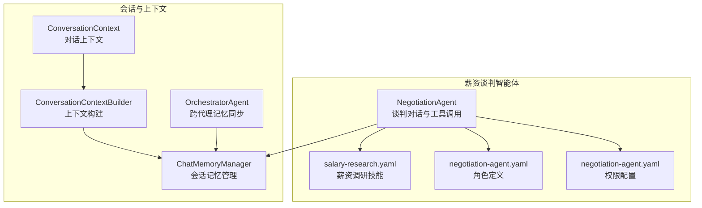
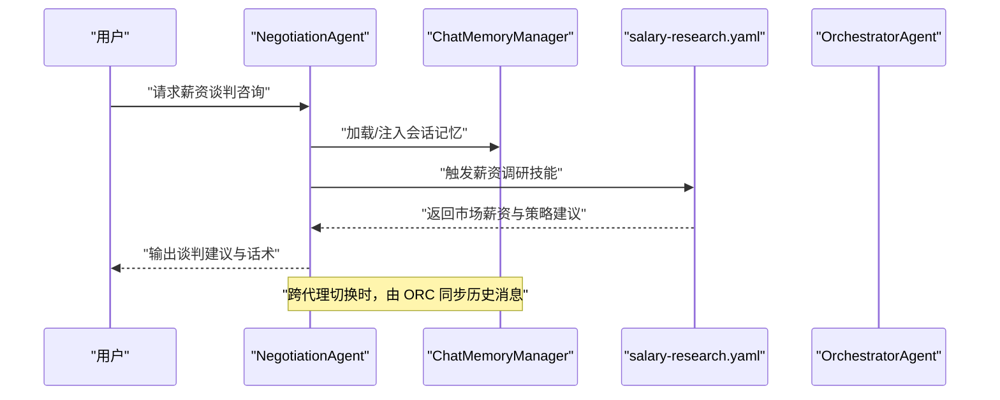
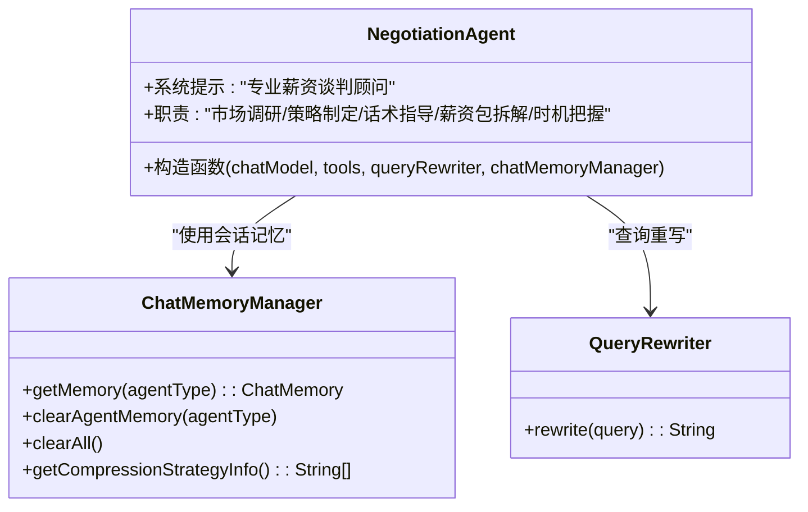
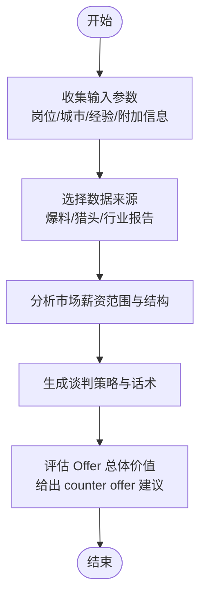
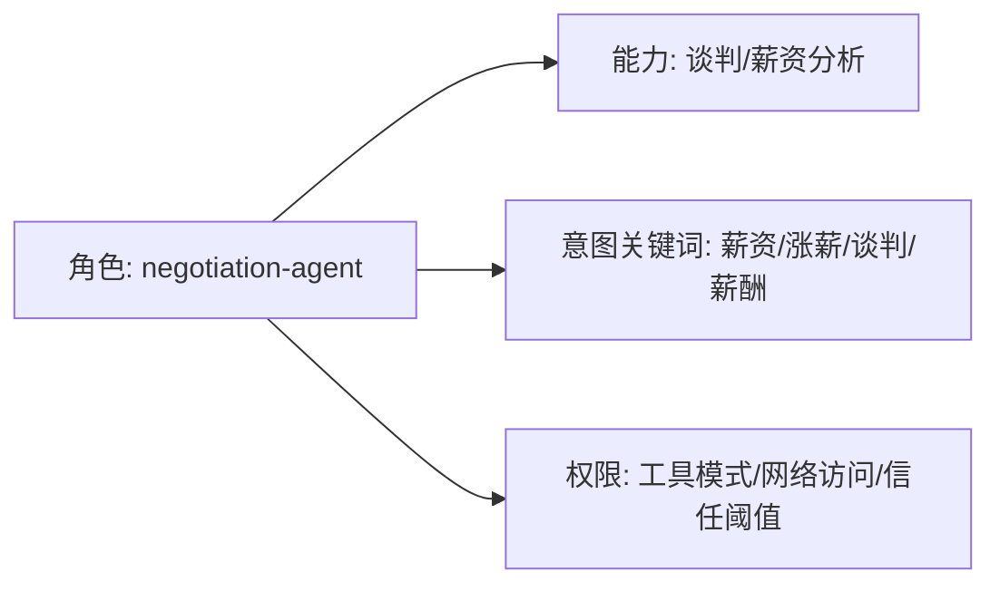
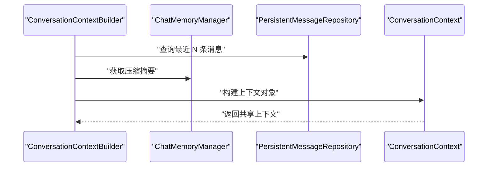
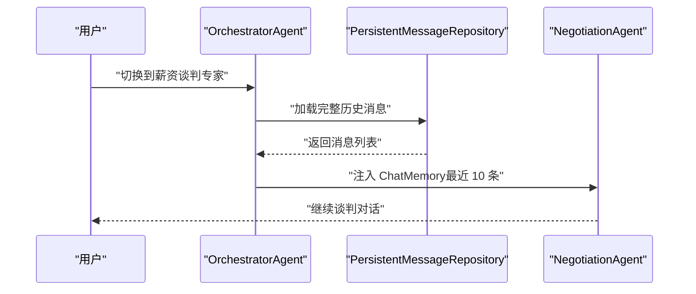
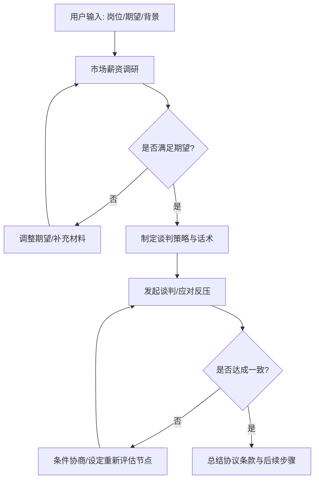
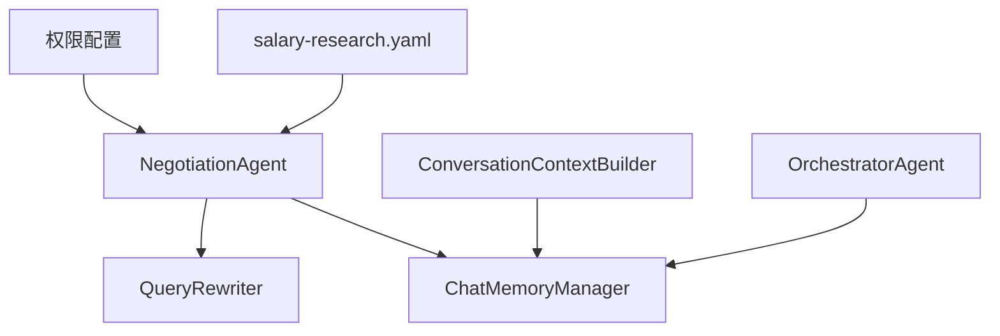

# 薪资谈判智能体

<cite>
**本文引用的文件**
- [NegotiationAgent.java](file://src/main/java/com/yupi/yuaiagent/agent/NegotiationAgent.java)
- [salary-research.yaml](file://src/main/resources/skills/salary-research.yaml)
- [negotiation-agent.yaml](file://src/main/resources/agents/negotiation-agent.yaml)
- [negotiation-agent.yaml（权限配置）](file://src/main/resources/permissions/negotiation-agent.yaml)
- [ChatMemoryManager.java](file://src/main/java/com/yupi/yuaiagent/chatmemory/ChatMemoryManager.java)
- [ConversationContext.java](file://src/main/java/com/yupi/yuaiagent/context/ConversationContext.java)
- [ConversationContextBuilder.java](file://src/main/java/com/yupi/yuaiagent/context/ConversationContextBuilder.java)
- [OrchestratorAgent.java（跨代理记忆同步）](file://src/main/java/com/yupi/yuaiagent/agent/OrchestratorAgent.java)
- [multi-agent-runtime-architecture.md](file://docs/multi-agent-runtime-architecture.md)
- [职场常见问题和回答 - 晋升篇.md](file://src/main/resources/document/职场常见问题和回答 - 晋升篇.md)
</cite>

## 目录
1. [简介](#简介)
2. [项目结构](#项目结构)
3. [核心组件](#核心组件)
4. [架构总览](#架构总览)
5. [详细组件分析](#详细组件分析)
6. [依赖关系分析](#依赖关系分析)
7. [性能考量](#性能考量)
8. [故障排查指南](#故障排查指南)
9. [结论](#结论)
10. [附录](#附录)

## 简介
本文件面向“薪资谈判智能体”的功能设计与实现，系统性阐述其在谈判策略制定、市场行情分析与最优报价生成方面的机制；说明智能体如何收集薪资数据、分析行业标准、评估个人价值并制定谈判方案；解释谈判对话管理、反问处理、条件协商与最终达成协议的流程；并介绍风险评估算法、心理博弈策略与沟通技巧优化。文档同时提供谈判场景模拟、历史数据分析与效果评估的实现细节，并给出具体谈判案例与策略选择指南。

## 项目结构
围绕薪资谈判智能体的关键文件组织如下：
- 智能体定义与运行：NegotiationAgent 负责谈判对话与工具调用
- 技能与提示词：salary-research.yaml 定义薪资调研技能与输入模板
- 角色与权限：negotiation-agent.yaml（角色）、negotiation-agent.yaml（权限）定义可用工具与信任阈值
- 会话记忆与上下文：ChatMemoryManager、ConversationContext、ConversationContextBuilder
- 跨代理协作：OrchestratorAgent 负责跨智能体会话记忆同步
- 文档与案例：职场常见问题和回答 - 晋升篇.md 提供实战案例

**图表来源**
- [NegotiationAgent.java:24-62](file://src/main/java/com/yupi/yuaiagent/agent/NegotiationAgent.java#L24-L62)
- [salary-research.yaml:1-45](file://src/main/resources/skills/salary-research.yaml#L1-L45)
- [negotiation-agent.yaml:1-22](file://src/main/resources/agents/negotiation-agent.yaml#L1-L22)
- [negotiation-agent.yaml（权限配置）:1-14](file://src/main/resources/permissions/negotiation-agent.yaml#L1-L14)
- [ChatMemoryManager.java:259-310](file://src/main/java/com/yupi/yuaiagent/chatmemory/ChatMemoryManager.java#L259-L310)
- [ConversationContext.java:16-20](file://src/main/java/com/yupi/yuaiagent/context/ConversationContext.java#L16-L20)
- [ConversationContextBuilder.java:34-54](file://src/main/java/com/yupi/yuaiagent/context/ConversationContextBuilder.java#L34-L54)
- [OrchestratorAgent.java（跨代理记忆同步）:283-582](file://src/main/java/com/yupi/yuaiagent/agent/OrchestratorAgent.java#L283-L582)

**章节来源**
- [NegotiationAgent.java:24-62](file://src/main/java/com/yupi/yuaiagent/agent/NegotiationAgent.java#L24-L62)
- [salary-research.yaml:1-45](file://src/main/resources/skills/salary-research.yaml#L1-L45)
- [negotiation-agent.yaml:1-22](file://src/main/resources/agents/negotiation-agent.yaml#L1-L22)
- [negotiation-agent.yaml（权限配置）:1-14](file://src/main/resources/permissions/negotiation-agent.yaml#L1-L14)
- [ChatMemoryManager.java:259-310](file://src/main/java/com/yupi/yuaiagent/chatmemory/ChatMemoryManager.java#L259-L310)
- [ConversationContext.java:16-20](file://src/main/java/com/yupi/yuaiagent/context/ConversationContext.java#L16-L20)
- [ConversationContextBuilder.java:34-54](file://src/main/java/com/yupi/yuaiagent/context/ConversationContextBuilder.java#L34-L54)
- [OrchestratorAgent.java（跨代理记忆同步）:283-582](file://src/main/java/com/yupi/yuaiagent/agent/OrchestratorAgent.java#L283-L582)

## 核心组件
- 薪资谈判智能体（NegotiationAgent）
  - 职责：提供谈判策略、市场薪资调研、话术指导、薪资包拆解与时机把握
  - 特性：集成会话记忆、日志顾问、查询重写能力
- 薪资调研技能（salary-research.yaml）
  - 能力：分析岗位市场薪资范围、解读薪资结构、提供谈薪话术与 counter offer 建议
  - 输入：岗位、城市、工作年限、附加信息
- 角色与权限（negotiation-agent.yaml）
  - 角色：薪资谈判专家，具备谈判与薪资分析能力
  - 权限：允许使用 negotiation.*、web.search、data.query、rag.query 等工具，网络访问开启
- 会话与上下文（ChatMemoryManager、ConversationContext、ConversationContextBuilder）
  - 会话记忆：按 agentType 管理聊天记忆，支持清理与压缩策略信息
  - 上下文构建：抽取用户画像、压缩对话摘要、最近消息，避免 Token 爆炸
- 跨代理协作（OrchestratorAgent）
  - 将持久化消息仓库中的完整对话历史同步至目标 Agent 的 ChatMemory，保证切换 Agent 后上下文连贯

**章节来源**
- [NegotiationAgent.java:24-62](file://src/main/java/com/yupi/yuaiagent/agent/NegotiationAgent.java#L24-L62)
- [salary-research.yaml:7-35](file://src/main/resources/skills/salary-research.yaml#L7-L35)
- [negotiation-agent.yaml:1-22](file://src/main/resources/agents/negotiation-agent.yaml#L1-L22)
- [negotiation-agent.yaml（权限配置）:5-13](file://src/main/resources/permissions/negotiation-agent.yaml#L5-L13)
- [ChatMemoryManager.java:259-310](file://src/main/java/com/yupi/yuaiagent/chatmemory/ChatMemoryManager.java#L259-L310)
- [ConversationContext.java:16-20](file://src/main/java/com/yupi/yuaiagent/context/ConversationContext.java#L16-L20)
- [ConversationContextBuilder.java:34-54](file://src/main/java/com/yupi/yuaiagent/context/ConversationContextBuilder.java#L34-L54)
- [OrchestratorAgent.java（跨代理记忆同步）:283-582](file://src/main/java/com/yupi/yuaiagent/agent/OrchestratorAgent.java#L283-L582)

## 架构总览
薪资谈判智能体采用多智能体协作与工具调用相结合的架构。NegotiationAgent 作为谈判专家，通过 ChatClient 与工具回调组合，结合会话记忆与上下文构建，实现对用户输入的动态响应。权限配置与角色定义确保工具调用的安全边界，跨代理记忆同步保障对话连续性。

**图表来源**
- [NegotiationAgent.java:50-62](file://src/main/java/com/yupi/yuaiagent/agent/NegotiationAgent.java#L50-L62)
- [salary-research.yaml:1-45](file://src/main/resources/skills/salary-research.yaml#L1-L45)
- [ChatMemoryManager.java:259-310](file://src/main/java/com/yupi/yuaiagent/chatmemory/ChatMemoryManager.java#L259-L310)
- [OrchestratorAgent.java（跨代理记忆同步）:283-582](file://src/main/java/com/yupi/yuaiagent/agent/OrchestratorAgent.java#L283-L582)

## 详细组件分析

### 薪资谈判智能体（NegotiationAgent）
- 设计要点
  - 使用 ChatMemoryManager 获取共享的 ChatMemory，确保会话记忆跨轮次延续
  - 默认系统提示强调“先了解市场薪资水平再给出建议”，体现数据驱动的谈判策略
  - 集成 MyLoggerAdvisor 与 QueryRewriter，增强可观测性与查询质量
- 关键职责
  - 市场薪资调研：通过工具调用获取实时数据
  - 谈判策略制定：结合用户画像与历史对话，定制化策略
  - 话术指导：提供具体谈判话术与应对策略
  - 薪资包拆解：分析基本工资、绩效、股票、福利等综合薪酬结构
  - 时机把握：指导何时提出薪资要求、如何应对反压

**图表来源**
- [NegotiationAgent.java:24-62](file://src/main/java/com/yupi/yuaiagent/agent/NegotiationAgent.java#L24-L62)
- [ChatMemoryManager.java:259-310](file://src/main/java/com/yupi/yuaiagent/chatmemory/ChatMemoryManager.java#L259-L310)

**章节来源**
- [NegotiationAgent.java:24-62](file://src/main/java/com/yupi/yuaiagent/agent/NegotiationAgent.java#L24-L62)

### 薪资调研技能（salary-research.yaml）
- 能力矩阵
  - 分析特定岗位的市场薪资范围
  - 解读薪资结构（基本工资、绩效、股票、福利）
  - 提供谈薪话术与策略
  - 评估 Offer 的整体价值
  - 给出 counter offer 建议
- 数据来源
  - 互联网大厂薪资爆料
  - 猎头渠道薪资数据
  - 行业薪酬报告
- 输入模板
  - 岗位、城市、工作年限、附加信息

**图表来源**
- [salary-research.yaml:7-35](file://src/main/resources/skills/salary-research.yaml#L7-L35)

**章节来源**
- [salary-research.yaml:1-45](file://src/main/resources/skills/salary-research.yaml#L1-L45)

### 角色与权限（negotiation-agent.yaml 与权限配置）
- 角色定义
  - agentCode: negotiation-agent
  - displayName: 薪资谈判专家
  - capabilities: negotiation, salary-analysis
  - intentKeywords: 薪资、涨薪、谈判、薪酬
- 权限配置
  - allowedToolPatterns: negotiation.*, web.search, data.query, rag.query
  - networkAccess: true
  - minMcpTrustScore: 30

**图表来源**
- [negotiation-agent.yaml:1-22](file://src/main/resources/agents/negotiation-agent.yaml#L1-L22)
- [negotiation-agent.yaml（权限配置）:5-13](file://src/main/resources/permissions/negotiation-agent.yaml#L5-L13)

**章节来源**
- [negotiation-agent.yaml:1-22](file://src/main/resources/agents/negotiation-agent.yaml#L1-L22)
- [negotiation-agent.yaml（权限配置）:1-14](file://src/main/resources/permissions/negotiation-agent.yaml#L1-L14)

### 会话与上下文（ChatMemoryManager、ConversationContext、ConversationContextBuilder）
- 会话记忆
  - 按 agentType 管理会话，支持清理与压缩策略信息
- 上下文构建
  - 用户画像注入
  - 对话摘要压缩（复用 MemoryCompressor）
  - 最近消息（最多 20 条）避免 Token 爆炸
- 多智能体运行时架构
  - ConversationContextBuilder 一次性构建，所有 Agent 共享
  - AgentRunner 与 TaskExecutor 分离，避免耦合

**图表来源**
- [ConversationContextBuilder.java:34-54](file://src/main/java/com/yupi/yuaiagent/context/ConversationContextBuilder.java#L34-L54)
- [ChatMemoryManager.java:259-310](file://src/main/java/com/yupi/yuaiagent/chatmemory/ChatMemoryManager.java#L259-L310)
- [multi-agent-runtime-architecture.md:400-428](file://docs/multi-agent-runtime-architecture.md#L400-L428)

**章节来源**
- [ConversationContext.java:16-20](file://src/main/java/com/yupi/yuaiagent/context/ConversationContext.java#L16-L20)
- [ConversationContextBuilder.java:34-54](file://src/main/java/com/yupi/yuaiagent/context/ConversationContextBuilder.java#L34-L54)
- [ChatMemoryManager.java:259-310](file://src/main/java/com/yupi/yuaiagent/chatmemory/ChatMemoryManager.java#L259-L310)
- [multi-agent-runtime-architecture.md:385-428](file://docs/multi-agent-runtime-architecture.md#L385-L428)

### 跨代理记忆同步（OrchestratorAgent）
- 功能概述
  - 当用户在同一聊天中切换 Agent（如 ResumeAgent → NegotiationAgent），新 Agent 的 ChatMemory 为空
  - 从 PersistentMessageRepository 加载完整历史到目标 Agent 的 ChatMemory
  - 自然注入 LLM 上下文，保证对话连贯性
- 关键点
  - 最近 10 条消息用于上下文拼接
  - 检查前一个 Agent 的 ChatMemory 是否存在未持久化的消息

**图表来源**
- [OrchestratorAgent.java（跨代理记忆同步）:283-582](file://src/main/java/com/yupi/yuaiagent/agent/OrchestratorAgent.java#L283-L582)

**章节来源**
- [OrchestratorAgent.java（跨代理记忆同步）:283-582](file://src/main/java/com/yupi/yuaiagent/agent/OrchestratorAgent.java#L283-L582)

### 谈判流程与策略
- 市场行情分析
  - 通过 salary-research.yaml 技能获取岗位市场薪资区间与结构
  - 结合城市生活成本、行业与公司规模因素
- 个人价值评估
  - 基于用户画像与历史对话，量化过往成果与贡献
- 谈判方案制定
  - 制定个性化策略，包括提出时机、话术与底线
- 反问处理与条件协商
  - 针对“为什么”“能否调整”等反问，提供标准化应答模板
- 协议达成与后续跟进
  - 明确 Offer 条款与后续评估节点，形成闭环

[本图为概念流程图，无需图表来源]

### 实战案例与策略选择指南
- 案例参考
  - 晋升后薪资谈判陷入僵局：通过充分的市场调研与成果量化，争取到高于初始方案 20% 的薪资包
- 策略建议
  - 数据支撑诉求：提前了解同岗位薪资区间
  - 成果量化：用具体收益说话
  - 灵活协商：除基本薪资外，可协商绩效、股权或晋升时间线
  - 时间节点：若无法满足期望，坦诚表达并给出合理重新评估时间

**章节来源**
- [职场常见问题和回答 - 晋升篇.md:18-21](file://src/main/resources/document/职场常见问题和回答 - 晋升篇.md#L18-L21)

## 依赖关系分析
- 组件耦合
  - NegotiationAgent 依赖 ChatMemoryManager 与 QueryRewriter，耦合度低、内聚性强
  - ConversationContextBuilder 与 ChatMemoryManager 解耦，避免重复计算
- 外部依赖
  - 工具调用：salary-research.yaml 技能与权限配置共同决定可用能力
  - 网络访问：权限配置允许网络搜索，支撑实时数据获取
- 潜在循环依赖
  - 通过上下文构建与消息仓库解耦，避免循环依赖风险

**图表来源**
- [NegotiationAgent.java:45-62](file://src/main/java/com/yupi/yuaiagent/agent/NegotiationAgent.java#L45-L62)
- [salary-research.yaml:1-45](file://src/main/resources/skills/salary-research.yaml#L1-L45)
- [negotiation-agent.yaml（权限配置）:5-13](file://src/main/resources/permissions/negotiation-agent.yaml#L5-L13)
- [ChatMemoryManager.java:259-310](file://src/main/java/com/yupi/yuaiagent/chatmemory/ChatMemoryManager.java#L259-L310)
- [ConversationContextBuilder.java:34-54](file://src/main/java/com/yupi/yuaiagent/context/ConversationContextBuilder.java#L34-L54)
- [OrchestratorAgent.java（跨代理记忆同步）:283-582](file://src/main/java/com/yupi/yuaiagent/agent/OrchestratorAgent.java#L283-L582)

**章节来源**
- [NegotiationAgent.java:45-62](file://src/main/java/com/yupi/yuaiagent/agent/NegotiationAgent.java#L45-L62)
- [salary-research.yaml:1-45](file://src/main/resources/skills/salary-research.yaml#L1-L45)
- [negotiation-agent.yaml（权限配置）:5-13](file://src/main/resources/permissions/negotiation-agent.yaml#L5-L13)
- [ChatMemoryManager.java:259-310](file://src/main/java/com/yupi/yuaiagent/chatmemory/ChatMemoryManager.java#L259-L310)
- [ConversationContextBuilder.java:34-54](file://src/main/java/com/yupi/yuaiagent/context/ConversationContextBuilder.java#L34-L54)
- [OrchestratorAgent.java（跨代理记忆同步）:283-582](file://src/main/java/com/yupi/yuaiagent/agent/OrchestratorAgent.java#L283-L582)

## 性能考量
- Token 控制
  - ConversationContextBuilder 限制最近消息数量，避免 Token 爆炸
- 记忆压缩
  - ChatMemoryManager 提供压缩策略信息接口，便于扩展压缩能力
- 工具调用频率
  - 权限配置 maxToolCallsPerRequest 限制单次请求工具调用次数，防止资源滥用

[本节为通用性能建议，无需章节来源]

## 故障排查指南
- 会话记忆异常
  - 检查 ChatMemoryManager 的 agentType 与清理逻辑，必要时调用 clearAgentMemory 或 clearAll
- 跨代理上下文缺失
  - 确认 OrchestratorAgent 是否正确从 PersistentMessageRepository 加载历史消息
- 工具调用失败
  - 核验 negotiation-agent.yaml 权限配置中的 allowedToolPatterns 与网络访问设置
- 日志与可观测性
  - MyLoggerAdvisor 已集成，可通过日志定位工具调用与内存注入问题

**章节来源**
- [ChatMemoryManager.java:279-290](file://src/main/java/com/yupi/yuaiagent/chatmemory/ChatMemoryManager.java#L279-L290)
- [OrchestratorAgent.java（跨代理记忆同步）:283-582](file://src/main/java/com/yupi/yuaiagent/agent/OrchestratorAgent.java#L283-L582)
- [negotiation-agent.yaml（权限配置）:5-13](file://src/main/resources/permissions/negotiation-agent.yaml#L5-L13)
- [NegotiationAgent.java:56-58](file://src/main/java/com/yupi/yuaiagent/agent/NegotiationAgent.java#L56-L58)

## 结论
薪资谈判智能体通过明确的角色定义、严格的权限控制、完善的会话记忆与上下文构建，以及跨代理协作机制，实现了数据驱动的谈判策略制定与执行。结合薪资调研技能与实战案例，智能体能够帮助用户在谈判中掌握主动权，提升职业价值最大化的机会。

[本节为总结，无需章节来源]

## 附录
- 谈判场景模拟建议
  - 场景一：校招/社招初入职场，期望与市场偏差较大
  - 场景二：晋升后薪资谈判陷入僵局
  - 场景三：跨公司跳槽，需综合考虑总包与期权
- 历史数据分析与效果评估
  - 基于 PersistentMessageRepository 的历史消息统计，评估策略命中率与用户满意度
- 沟通技巧优化
  - 使用标准化话术模板，结合 QueryRewriter 提升查询质量，减少无效对话

[本节为通用建议，无需章节来源]