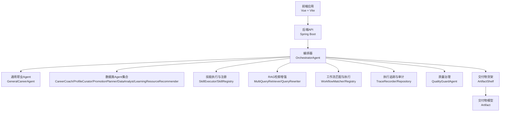
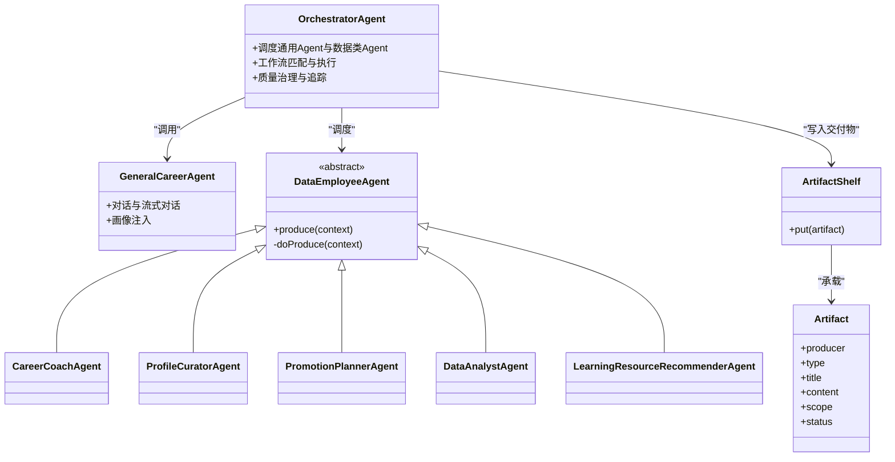
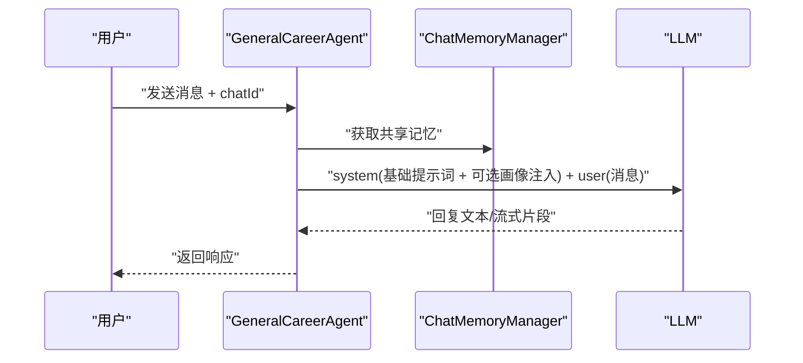
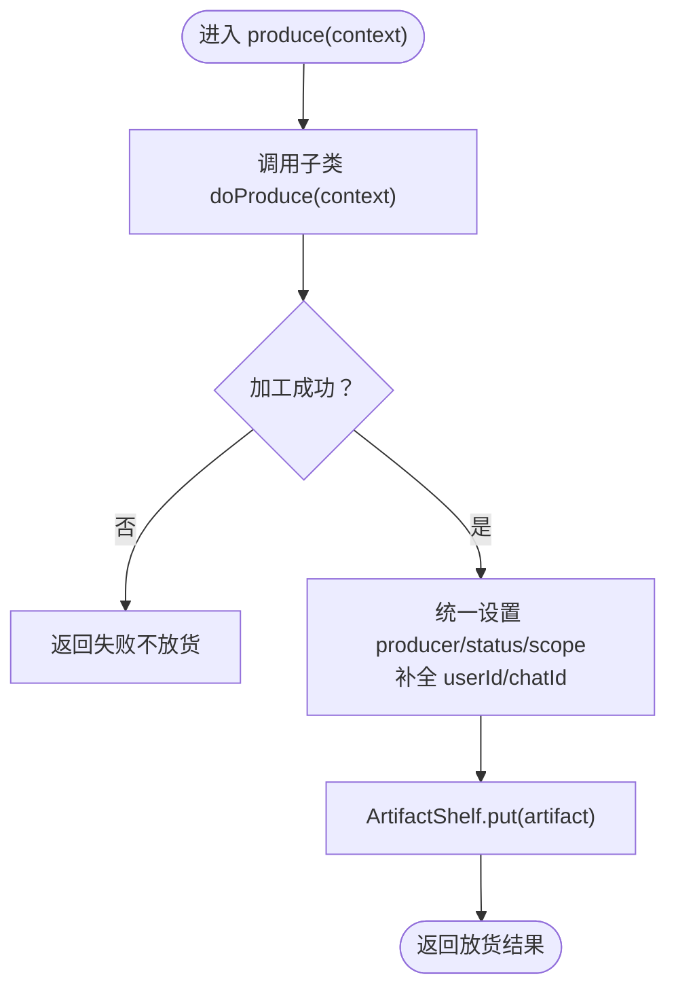
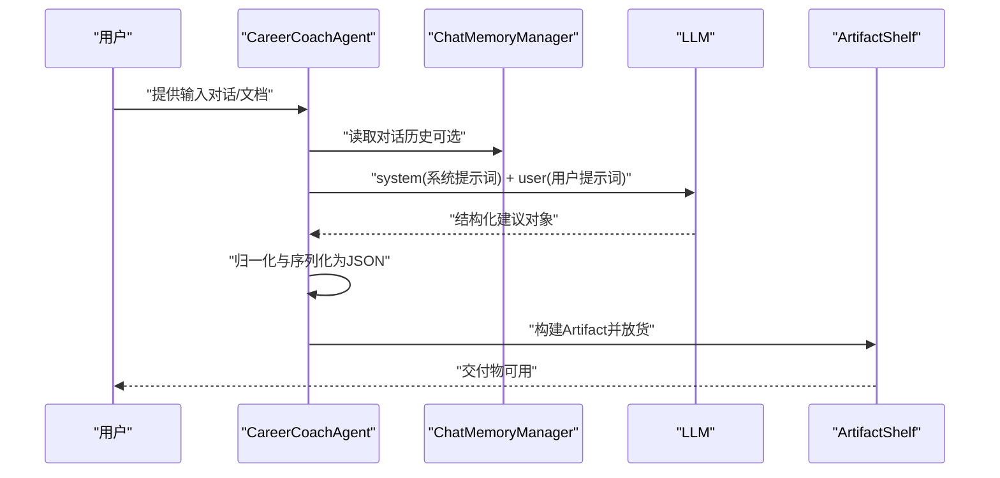
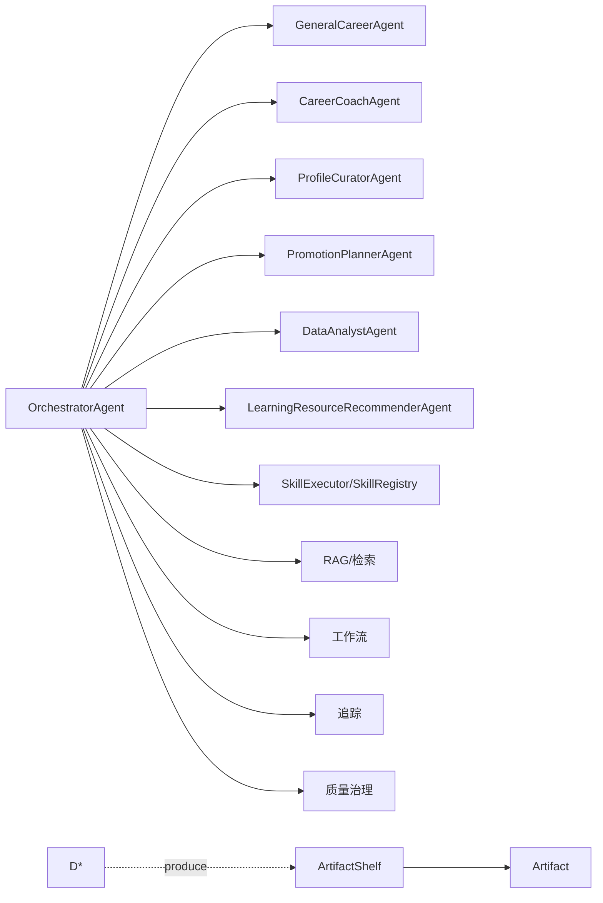

# 通用职业智能体

<cite>
**本文引用的文件**
- [CareerCoachAgent.java](file://src/main/java/com/yupi/yuaiagent/agent/data/CareerCoachAgent.java)
- [ProfileCuratorAgent.java](file://src/main/java/com/yupi/yuaiagent/agent/data/ProfileCuratorAgent.java)
- [PromotionPlannerAgent.java](file://src/main/java/com/yupi/yuaiagent/agent/data/PromotionPlannerAgent.java)
- [LearningResourceRecommenderAgent.java](file://src/main/java/com/yupi/yuaiagent/agent/data/LearningResourceRecommenderAgent.java)
- [DataAnalystAgent.java](file://src/main/java/com/yupi/yuaiagent/agent/data/DataAnalystAgent.java)
- [DataEmployeeAgent.java](file://src/main/java/com/yupi/yuaiagent/agent/data/DataEmployeeAgent.java)
- [GeneralCareerAgent.java](file://src/main/java/com/yupi/yuaiagent/agent/GeneralCareerAgent.java)
- [OrchestratorAgent.java](file://src/main/java/com/yupi/yuaiagent/agent/OrchestratorAgent.java)
- [AgentConfig.java](file://src/main/java/com/yupi/yuaiagent/config/AgentConfig.java)
- [Artifact.java](file://src/main/java/com/yupi/yuaiagent/artifact/model/Artifact.java)
- [ArtifactShelf.java](file://src/main/java/com/yupi/yuaiagent/artifact/ArtifactShelf.java)
- [UserProfileService.java](file://src/main/java/com/yupi/yuaiagent/profile/UserProfileService.java)
- [ChatMemoryManager.java](file://src/main/java/com/yupi/yuaiagent/chatmemory/ChatMemoryManager.java)
- [MyLoggerAdvisor.java](file://src/main/java/com/yupi/yuaiagent/advisor/MyLoggerAdvisor.java)
- [AiChatRagCloudAdvisorConfig.java](file://src/main/java/com/yupi/yuaiagent/rag/AiChatRagCloudAdvisorConfig.java)
- [AiChatVectorStoreConfig.java](file://src/main/java/com/yupi/yuaiagent/rag/AiChatVectorStoreConfig.java)
- [MultiQueryRetriever.java](file://src/main/java/com/yupi/yuaiagent/rag/MultiQueryRetriever.java)
- [QueryRewriter.java](file://src/main/java/com/yupi/yuaiagent/rag/QueryRewriter.java)
- [NluPipeline.java](file://src/main/java/com/yupi/yuaiagent/nlu/NluPipeline.java)
- [WorkflowMatcher.java](file://src/main/java/com/yupi/yuaiagent/workflow/WorkflowMatcher.java)
- [WorkflowRegistry.java](file://src/main/java/com/yupi/yuaiagent/workflow/WorkflowRegistry.java)
- [TaskExecutor.java](file://src/main/java/com/yupi/yuaiagent/agent/TaskExecutor.java)
- [ResultAggregator.java](file://src/main/java/com/yupi/yuaiagent/agent/ResultAggregator.java)
- [AccessDecisionService.java](file://src/main/java/com/yupi/yuaiagent/access/AccessDecisionService.java)
- [QualityGuardAgent.java](file://src/main/java/com/yupi/yuaiagent/quality/QualityGuardAgent.java)
- [TraceRecorder.java](file://src/main/java/com/yupi/yuaiagent/trace/TraceRecorder.java)
- [TraceRepository.java](file://src/main/java/com/yupi/yuaiagent/trace/TraceRepository.java)
- [PersistentMessageRepository.java](file://src/main/java/com/yupi/yuaiagent/message/PersistentMessageRepository.java)
- [application.yml](file://src/main/resources/application.yml)
- [general-agent.yaml](file://src/main/resources/agents/general-agent.yaml)
- [negotiation-agent.yaml](file://src/main/resources/agents/negotiation-agent.yaml)
- [resume-agent.yaml](file://src/main/resources/agents/resume-agent.yaml)
- [permissions/admin-agent.yaml](file://src/main/resources/permissions/admin-agent.yaml)
- [permissions/consultation-agent.yaml](file://src/main/resources/permissions/consultation-agent.yaml)
- [permissions/data-agent.yaml](file://src/main/resources/permissions/data-agent.yaml)
- [permissions/escape-agent.yaml](file://src/main/resources/permissions/escape-agent.yaml)
- [permissions/general-agent.yaml](file://src/main/resources/permissions/general-agent.yaml)
- [permissions/negotiation-agent.yaml](file://src/main/resources/permissions/negotiation-agent.yaml)
- [permissions/resume-agent.yaml](file://src/main/resources/permissions/resume-agent.yaml)
</cite>

## 目录
1. [简介](#简介)
2. [项目结构](#项目结构)
3. [核心组件](#核心组件)
4. [架构总览](#架构总览)
5. [详细组件分析](#详细组件分析)
6. [依赖分析](#依赖分析)
7. [性能考虑](#性能考虑)
8. [故障排查指南](#故障排查指南)
9. [结论](#结论)
10. [附录](#附录)

## 简介
本项目是一个面向“通用职业智能体”的企业级智能体平台，围绕职业发展路径规划、技能矩阵分析与学习资源推荐三大核心能力，提供从对话交互到结构化交付物的完整闭环。系统通过多Agent协同、结构化提示词工程、RAG检索增强与质量治理等手段，实现：
- 职业目标设定与能力差距分析
- 个性化学习计划制定与实践指导
- 技能认证与导师匹配的辅助决策
- 知识库管理、信息检索与智能推荐
- 进度评估与交付物追踪

## 项目结构
系统采用分层+多Agent的模块化设计，前端通过Vue应用提供交互界面，后端以Spring Boot为基础，集成多Agent、RAG、工作流与质量治理等能力。

图表来源
- [OrchestratorAgent.java:100-163](file://src/main/java/com/yupi/yuaiagent/agent/OrchestratorAgent.java#L100-L163)
- [GeneralCareerAgent.java:25-118](file://src/main/java/com/yupi/yuaiagent/agent/GeneralCareerAgent.java#L25-L118)
- [DataEmployeeAgent.java:21-91](file://src/main/java/com/yupi/yuaiagent/agent/data/DataEmployeeAgent.java#L21-L91)
- [ArtifactShelf.java](file://src/main/java/com/yupi/yuaiagent/artifact/ArtifactShelf.java)
- [Artifact.java](file://src/main/java/com/yupi/yuaiagent/artifact/model/Artifact.java)

章节来源
- [application.yml](file://src/main/resources/application.yml)
- [general-agent.yaml](file://src/main/resources/agents/general-agent.yaml)
- [negotiation-agent.yaml](file://src/main/resources/agents/negotiation-agent.yaml)
- [resume-agent.yaml](file://src/main/resources/agents/resume-agent.yaml)

## 核心组件
- 编排器（OrchestratorAgent）：统一调度通用Agent与数据类Agent，协调技能、RAG、工作流、追踪与质量治理。
- 通用职业Agent（GeneralCareerAgent）：提供对话式职业咨询与情感支持，支持画像注入增强个性化。
- 数据类Agent集合：
  - 岗位辅导员（CareerCoachAgent）：基于对话或文档生成岗位辅导建议。
  - 画像整理员（ProfileCuratorAgent）：从对话历史提取用户画像摘要。
  - 晋升规划师（PromotionPlannerAgent）：制定可执行的晋升路径规划。
  - 数据分析师（DataAnalystAgent）：生成结构化数据分析报告。
  - 学习资源推荐器（LearningResourceRecommenderAgent）：结合画像与需求推荐学习资源。
- 交付物系统（Artifact/ArtifactShelf）：标准化承载结构化输出，支持生命周期管理与查询。
- RAG与检索（AiChatRagCloudAdvisorConfig/AiChatVectorStoreConfig/MultiQueryRetriever/QueryRewriter）：增强信息检索与上下文丰富度。
- 工作流与质量治理（WorkflowMatcher/Registry、QualityGuardAgent）：保障流程规范与输出质量。
- 访问控制与权限（AccessDecisionService、权限YAML）：保护敏感操作与数据访问。

章节来源
- [OrchestratorAgent.java:100-163](file://src/main/java/com/yupi/yuaiagent/agent/OrchestratorAgent.java#L100-L163)
- [GeneralCareerAgent.java:25-118](file://src/main/java/com/yupi/yuaiagent/agent/GeneralCareerAgent.java#L25-L118)
- [DataEmployeeAgent.java:21-91](file://src/main/java/com/yupi/yuaiagent/agent/data/DataEmployeeAgent.java#L21-L91)
- [Artifact.java](file://src/main/java/com/yupi/yuaiagent/artifact/model/Artifact.java)
- [ArtifactShelf.java](file://src/main/java/com/yupi/yuaiagent/artifact/ArtifactShelf.java)

## 架构总览
系统采用“编排器 + 多Agent + 结构化交付物 + RAG + 质量治理”的整体架构。编排器负责意图识别、路由、工具调用与结果聚合；数据类Agent专注于结构化输出；RAG提供知识增强；质量治理与追踪保障安全与可观测性。

图表来源
- [OrchestratorAgent.java:100-163](file://src/main/java/com/yupi/yuaiagent/agent/OrchestratorAgent.java#L100-L163)
- [GeneralCareerAgent.java:25-118](file://src/main/java/com/yupi/yuaiagent/agent/GeneralCareerAgent.java#L25-L118)
- [DataEmployeeAgent.java:21-91](file://src/main/java/com/yupi/yuaiagent/agent/data/DataEmployeeAgent.java#L21-L91)
- [CareerCoachAgent.java:43-305](file://src/main/java/com/yupi/yuaiagent/agent/data/CareerCoachAgent.java#L43-L305)
- [ProfileCuratorAgent.java:46-301](file://src/main/java/com/yupi/yuaiagent/agent/data/ProfileCuratorAgent.java#L46-L301)
- [PromotionPlannerAgent.java:43-313](file://src/main/java/com/yupi/yuaiagent/agent/data/PromotionPlannerAgent.java#L43-L313)
- [DataAnalystAgent.java:38-264](file://src/main/java/com/yupi/yuaiagent/agent/data/DataAnalystAgent.java#L38-L264)
- [LearningResourceRecommenderAgent.java:48-371](file://src/main/java/com/yupi/yuaiagent/agent/data/LearningResourceRecommenderAgent.java#L48-L371)
- [ArtifactShelf.java](file://src/main/java/com/yupi/yuaiagent/artifact/ArtifactShelf.java)
- [Artifact.java](file://src/main/java/com/yupi/yuaiagent/artifact/model/Artifact.java)

## 详细组件分析

### 通用职业Agent（GeneralCareerAgent）
- 职责：提供温暖、专业的职场咨询与情感支持，支持同步与流式对话，可注入用户画像增强个性化。
- 关键点：
  - 默认系统提示词明确角色与回答风格。
  - 支持动态拼接画像注入片段，实现“画像驱动”的个性化建议。
  - 对话记忆通过ChatMemoryManager共享，确保会话连贯性。

图表来源
- [GeneralCareerAgent.java:25-118](file://src/main/java/com/yupi/yuaiagent/agent/GeneralCareerAgent.java#L25-L118)
- [ChatMemoryManager.java](file://src/main/java/com/yupi/yuaiagent/chatmemory/ChatMemoryManager.java)

章节来源
- [GeneralCareerAgent.java:25-118](file://src/main/java/com/yupi/yuaiagent/agent/GeneralCareerAgent.java#L25-L118)

### 数据类Agent模板（DataEmployeeAgent）
- 职责：统一数据加工流程（模板方法），负责：
  - 输入解析（对话历史/上传文档）
  - LLM结构化解析与兜底JSON
  - 统一设置producer、status、scope并放货到ArtifactShelf
- 关键点：
  - 子类仅需实现doProduce，产出Artifact主体内容。
  - 异常与空输入均返回失败，不放货，保证交付物合法性。

图表来源
- [DataEmployeeAgent.java:21-91](file://src/main/java/com/yupi/yuaiagent/agent/data/DataEmployeeAgent.java#L21-L91)

章节来源
- [DataEmployeeAgent.java:21-91](file://src/main/java/com/yupi/yuaiagent/agent/data/DataEmployeeAgent.java#L21-L91)

### 岗位辅导员（CareerCoachAgent）
- 职责：基于输入内容生成结构化岗位辅导建议，包含摘要、建议、行动项与技能建议。
- 输入来源：对话历史或上传文档。
- 输出：JSON结构化建议，作为Artifact.content承载。

图表来源
- [CareerCoachAgent.java:43-305](file://src/main/java/com/yupi/yuaiagent/agent/data/CareerCoachAgent.java#L43-L305)
- [ChatMemoryManager.java](file://src/main/java/com/yupi/yuaiagent/chatmemory/ChatMemoryManager.java)
- [ArtifactShelf.java](file://src/main/java/com/yupi/yuaiagent/artifact/ArtifactShelf.java)

章节来源
- [CareerCoachAgent.java:43-305](file://src/main/java/com/yupi/yuaiagent/agent/data/CareerCoachAgent.java#L43-L305)

### 画像整理员（ProfileCuratorAgent）
- 职责：从对话历史提取用户画像摘要，包含沟通偏好、关注领域、已知背景与历史诉求。
- 输出：结构化JSON摘要，scope设为USER_PROFILE，便于后续个性化服务。

章节来源
- [ProfileCuratorAgent.java:46-301](file://src/main/java/com/yupi/yuaiagent/agent/data/ProfileCuratorAgent.java#L46-L301)

### 晋升规划师（PromotionPlannerAgent）
- 职责：制定可执行的晋升路径规划，包含摘要、目标岗位、阶段目标、能力差距与行动项。
- 输入：对话历史或上传文档。
- 输出：结构化JSON规划，作为Artifact.content承载。

章节来源
- [PromotionPlannerAgent.java:43-313](file://src/main/java/com/yupi/yuaiagent/agent/data/PromotionPlannerAgent.java#L43-L313)

### 数据分析师（DataAnalystAgent）
- 职责：对输入数据进行分析，输出摘要、关键发现、可量化指标与建议。
- 输出：结构化JSON报告，作为Artifact.content承载。

章节来源
- [DataAnalystAgent.java:38-264](file://src/main/java/com/yupi/yuaiagent/agent/data/DataAnalystAgent.java#L38-L264)

### 学习资源推荐器（LearningResourceRecommenderAgent）
- 职责：结合用户画像与需求，推荐学习资源（课程、书籍、文章等），并提供评分与理由。
- 实现要点：
  - 依赖UserProfileService获取画像摘要。
  - 结合RAG检索增强与规则/策略生成推荐清单。
  - 输出结构化推荐结果，作为Artifact.content承载。

章节来源
- [LearningResourceRecommenderAgent.java:48-371](file://src/main/java/com/yupi/yuaiagent/agent/data/LearningResourceRecommenderAgent.java#L48-L371)
- [UserProfileService.java](file://src/main/java/com/yupi/yuaiagent/profile/UserProfileService.java)

### 编排器（OrchestratorAgent）
- 职责：统一调度多个Agent，协调技能、RAG、工作流、追踪与质量治理；注册AgentRunner映射。
- 关键点：
  - 注入通用Agent与数据类Agent实例。
  - 集成技能执行与注册、NLU、工作流、追踪与质量治理。
  - 通过TaskExecutor与ResultAggregator实现任务编排与结果聚合。

章节来源
- [OrchestratorAgent.java:100-163](file://src/main/java/com/yupi/yuaiagent/agent/OrchestratorAgent.java#L100-L163)
- [TaskExecutor.java](file://src/main/java/com/yupi/yuaiagent/agent/TaskExecutor.java)
- [ResultAggregator.java](file://src/main/java/com/yupi/yuaiagent/agent/ResultAggregator.java)

### 交付物系统（Artifact/ArtifactShelf）
- 职责：标准化承载结构化输出，统一producer、type、title、content、scope、status等字段；提供放货与查询能力。
- 关键点：
  - 数据类Agent通过produce统一设置字段并放货。
  - 支持按scope（如TASK、USER_PROFILE）隔离与检索。

章节来源
- [Artifact.java](file://src/main/java/com/yupi/yuaiagent/artifact/model/Artifact.java)
- [ArtifactShelf.java](file://src/main/java/com/yupi/yuaiagent/artifact/ArtifactShelf.java)

### RAG与检索增强
- 能力：MultiQueryRetriever与QueryRewriter提升检索质量；AiChatRagCloudAdvisorConfig/AiChatVectorStoreConfig提供向量存储配置。
- 应用：在需要外部知识支撑的场景（如学习资源推荐、晋升规划背景调研）增强上下文。

章节来源
- [AiChatRagCloudAdvisorConfig.java](file://src/main/java/com/yupi/yuaiagent/rag/AiChatRagCloudAdvisorConfig.java)
- [AiChatVectorStoreConfig.java](file://src/main/java/com/yupi/yuaiagent/rag/AiChatVectorStoreConfig.java)
- [MultiQueryRetriever.java](file://src/main/java/com/yupi/yuaiagent/rag/MultiQueryRetriever.java)
- [QueryRewriter.java](file://src/main/java/com/yupi/yuaiagent/rag/QueryRewriter.java)

### 工作流与质量治理
- 工作流：WorkflowMatcher/Registry根据意图与上下文匹配并执行工作流节点。
- 质量治理：QualityGuardAgent与QualityModeResolver保障输出质量与合规性；TraceRecorder/TraceRepository记录执行轨迹。

章节来源
- [WorkflowMatcher.java](file://src/main/java/com/yupi/yuaiagent/workflow/WorkflowMatcher.java)
- [WorkflowRegistry.java](file://src/main/java/com/yupi/yuaiagent/workflow/WorkflowRegistry.java)
- [QualityGuardAgent.java](file://src/main/java/com/yupi/yuaiagent/quality/QualityGuardAgent.java)
- [TraceRecorder.java](file://src/main/java/com/yupi/yuaiagent/trace/TraceRecorder.java)
- [TraceRepository.java](file://src/main/java/com/yupi/yuaiagent/trace/TraceRepository.java)

## 依赖分析
- 组件耦合：
  - 编排器聚合多个Agent与基础设施，是系统的中枢。
  - 数据类Agent依赖ChatMemoryManager与LLM客户端，统一通过ArtifactShelf放货。
  - RAG与NLU为横切能力，贯穿对话与数据加工过程。
- 外部依赖：
  - LLM服务（DashScope示例）、向量数据库、权限与日志等基础设施。
- 潜在风险：
  - LLM调用失败或解析异常需确保兜底JSON与错误信息可追踪。
  - 交付物scope与归属键缺失可能导致作用域校验失败。

图表来源
- [OrchestratorAgent.java:100-163](file://src/main/java/com/yupi/yuaiagent/agent/OrchestratorAgent.java#L100-L163)
- [DataEmployeeAgent.java:21-91](file://src/main/java/com/yupi/yuaiagent/agent/data/DataEmployeeAgent.java#L21-L91)
- [ArtifactShelf.java](file://src/main/java/com/yupi/yuaiagent/artifact/ArtifactShelf.java)
- [Artifact.java](file://src/main/java/com/yupi/yuaiagent/artifact/model/Artifact.java)

## 性能考虑
- 提示词工程与结构化解析：
  - 使用Spring AI实体绑定减少后处理开销，同时保留兜底JSON确保稳定性。
- 对话记忆与压缩：
  - ChatMemoryManager与压缩策略降低上下文长度，提升响应速度。
- RAG检索优化：
  - MultiQueryRetriever与QueryRewriter提升召回质量，减少无关上下文。
- 并发与限流：
  - 通过Token预算与配额策略控制LLM调用频率，避免资源耗尽。
- 日志与追踪：
  - MyLoggerAdvisor与TraceRecorder提供可观测性，便于定位性能瓶颈。

## 故障排查指南
- LLM调用失败或解析异常：
  - 现象：结构化解析抛出异常或返回空对象。
  - 处置：检查系统提示词与用户提示词格式；启用兜底JSON；查看日志与追踪。
- 交付物为空或未放货：
  - 现象：加工标记成功但未产出Artifact或scope缺失。
  - 处置：确认上下文是否包含userId/chatId；检查produce模板方法字段设置。
- 对话历史为空：
  - 现象：画像整理/岗位辅导/晋升规划等输入为空。
  - 处置：确认chatId与agentType；检查ChatMemoryManager配置。
- 权限与访问控制：
  - 现象：某些Agent或接口不可用。
  - 处置：核对权限YAML与AccessDecisionService策略。

章节来源
- [MyLoggerAdvisor.java](file://src/main/java/com/yupi/yuaiagent/advisor/MyLoggerAdvisor.java)
- [TraceRecorder.java](file://src/main/java/com/yupi/yuaiagent/trace/TraceRecorder.java)
- [TraceRepository.java](file://src/main/java/com/yupi/yuaiagent/trace/TraceRepository.java)
- [AccessDecisionService.java](file://src/main/java/com/yupi/yuaiagent/access/AccessDecisionService.java)
- [permissions/admin-agent.yaml](file://src/main/resources/permissions/admin-agent.yaml)
- [permissions/consultation-agent.yaml](file://src/main/resources/permissions/consultation-agent.yaml)
- [permissions/data-agent.yaml](file://src/main/resources/permissions/data-agent.yaml)
- [permissions/escape-agent.yaml](file://src/main/resources/permissions/escape-agent.yaml)
- [permissions/general-agent.yaml](file://src/main/resources/permissions/general-agent.yaml)
- [permissions/negotiation-agent.yaml](file://src/main/resources/permissions/negotiation-agent.yaml)
- [permissions/resume-agent.yaml](file://src/main/resources/permissions/resume-agent.yaml)

## 结论
本系统通过“编排器 + 多Agent + 结构化交付物 + RAG + 质量治理”的架构，实现了从对话到结构化输出的闭环，覆盖职业发展路径规划、技能矩阵分析与学习资源推荐等关键场景。其模块化设计与兜底策略确保了稳定性与可扩展性，适合在企业环境中持续演进与规模化部署。

## 附录

### 职业发展规划案例与学习路径指南（概念性说明）
- 案例目标：从初级工程师成长为技术专家，周期18个月。
- 步骤：
  1) 目标设定：明确晋升目标岗位与职级。
  2) 能力差距分析：对比目标岗位要求与现状，列出关键差距。
  3) 学习计划制定：按阶段拆解学习目标，分配资源与时间。
  4) 实践指导：结合项目实战与认证考试，固化能力。
  5) 进度评估：定期复盘与调整，形成闭环。
- 推荐机制：结合画像偏好与历史诉求，推荐课程、书籍与实践项目；通过追踪与质量治理保障执行效果。

[本节为概念性内容，不直接分析具体文件]