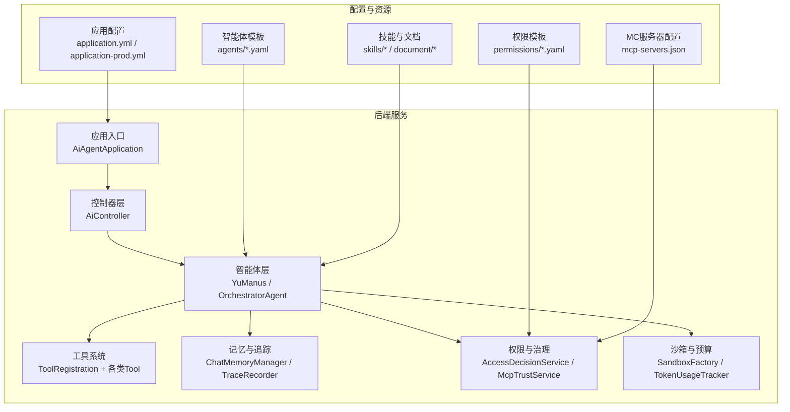
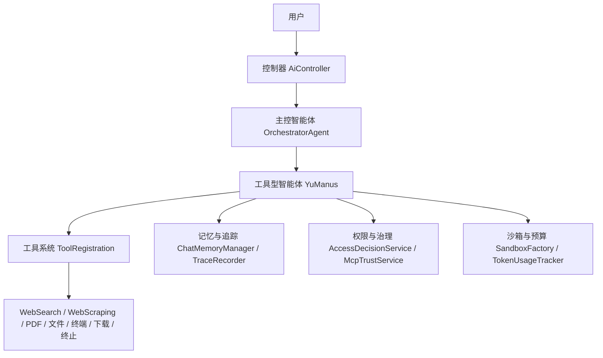
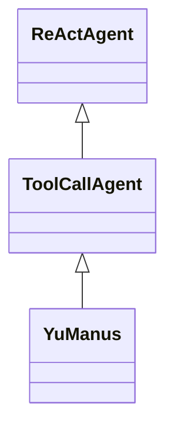
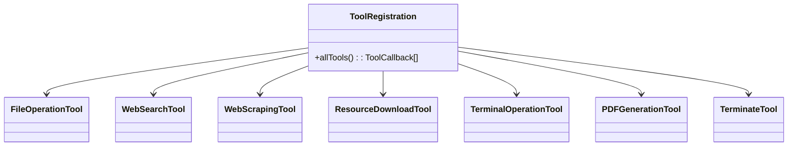
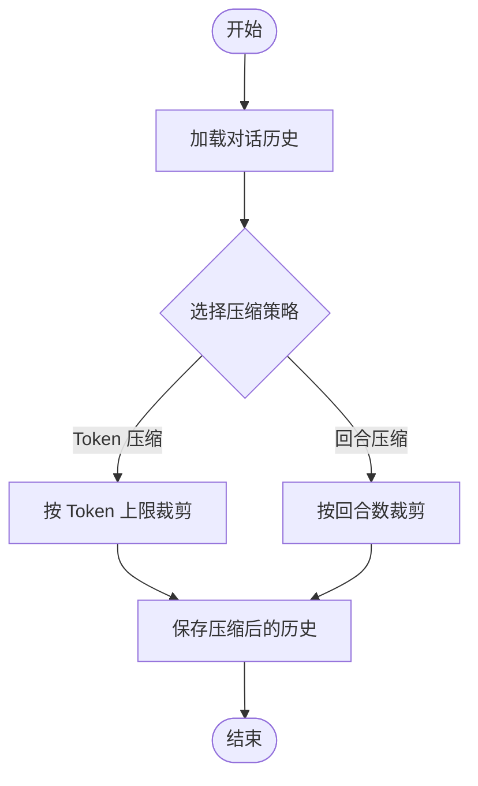
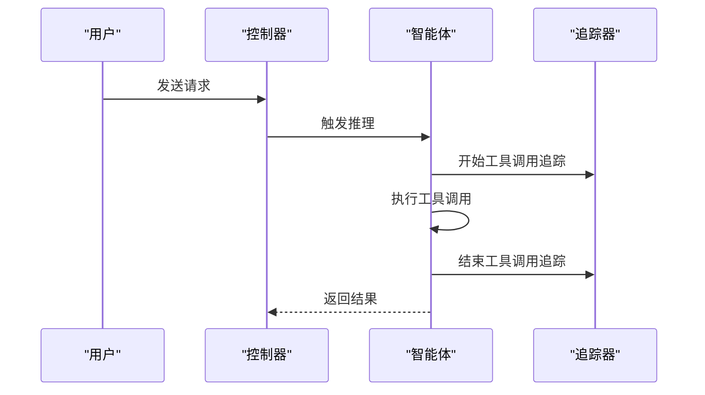
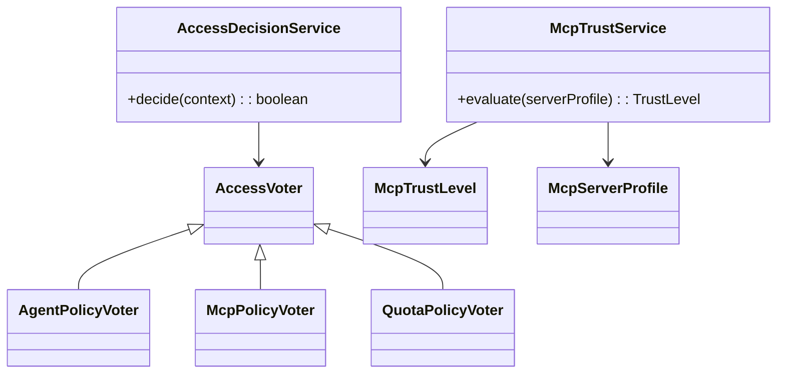
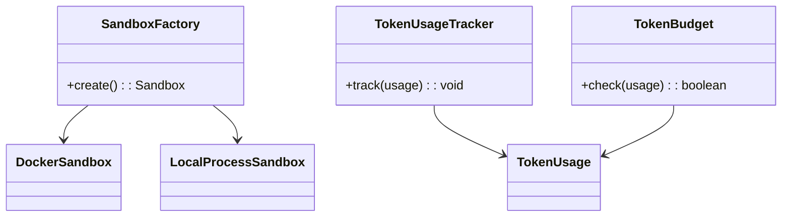
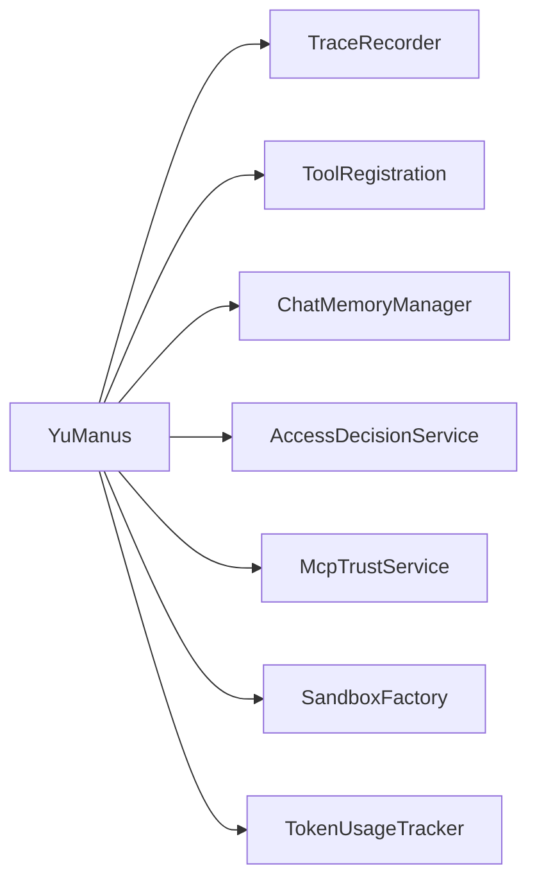

# 鱼 manus 智能体

<cite>
**本文引用的文件**
- [YuManus.java](file://src/main/java/com/yupi/yuaiagent/agent/YuManus.java)
- [ToolCallAgent.java](file://src/main/java/com/yupi/yuaiagent/agent/ToolCallAgent.java)
- [ReActAgent.java](file://src/main/java/com/yupi/yuaiagent/agent/ReActAgent.java)
- [ToolRegistration.java](file://src/main/java/com/yupi/yuaiagent/tools/ToolRegistration.java)
- [FileOperationTool.java](file://src/main/java/com/yupi/yuaiagent/tools/FileOperationTool.java)
- [WebSearchTool.java](file://src/main/java/com/yupi/yuaiagent/tools/WebSearchTool.java)
- [WebScrapingTool.java](file://src/main/java/com/yupi/yuaiagent/tools/WebScrapingTool.java)
- [ResourceDownloadTool.java](file://src/main/java/com/yupi/yuaiagent/tools/ResourceDownloadTool.java)
- [TerminalOperationTool.java](file://src/main/java/com/yupi/yuaiagent/tools/TerminalOperationTool.java)
- [PDFGenerationTool.java](file://src/main/java/com/yupi/yuaiagent/tools/PDFGenerationTool.java)
- [TerminateTool.java](file://src/main/java/com/yupi/yuaiagent/tools/TerminateTool.java)
- [AiController.java](file://src/main/java/com/yupi/yuaiagent/controller/AiController.java)
- [OrchestratorAgent.java](file://src/main/java/com/yupi/yuaiagent/agent/OrchestratorAgent.java)
- [ChatMemoryManager.java](file://src/main/java/com/yupi/yuaiagent/chatmemory/ChatMemoryManager.java)
- [TokenCompressionStrategy.java](file://src/main/java/com/yupi/yuaiagent/chatmemory/TokenCompressionStrategy.java)
- [TurnCompressionStrategy.java](file://src/main/java/com/yupi/yuaiagent/chatmemory/TurnCompressionStrategy.java)
- [TraceRecorder.java](file://src/main/java/com/yupi/yuaiagent/trace/TraceRecorder.java)
- [TraceContext.java](file://src/main/java/com/yupi/yuaiagent/trace/TraceContext.java)
- [TraceSpan.java](file://src/main/java/com/yupi/yuaiagent/trace/model/TraceSpan.java)
- [TraceStepType.java](file://src/main/java/com/yupi/yuaiagent/trace/model/TraceStepType.java)
- [QualityGuardAgent.java](file://src/main/java/com/yupi/yuaiagent/quality/QualityGuardAgent.java)
- [EvalCenter.java](file://src/main/java/com/yupi/yuaiagent/eval/EvalCenter.java)
- [EvalReport.java](file://src/main/java/com/yupi/yuaiagent/eval/EvalReport.java)
- [GlobalExceptionHandler.java](file://src/main/java/com/yupi/yuaiagent/exception/GlobalExceptionHandler.java)
- [AccessDecisionService.java](file://src/main/java/com/yupi/yuaiagent/access/AccessDecisionService.java)
- [AccessVoter.java](file://src/main/java/com/yupi/yuaiagent/access/AccessVoter.java)
- [AgentPolicyVoter.java](file://src/main/java/com/yupi/yuaiagent/access/AgentPolicyVoter.java)
- [McpPolicyVoter.java](file://src/main/java/com/yupi/yuaiagent/access/McpPolicyVoter.java)
- [QuotaPolicyVoter.java](file://src/main/java/com/yupi/yuaiagent/access/QuotaPolicyVoter.java)
- [McpTrustService.java](file://src/main/java/com/yupi/yuaiagent/mcp/McpTrustService.java)
- [McpTrustLevel.java](file://src/main/java/com/yupi/yuaiagent/mcp/McpTrustLevel.java)
- [McpServerProfile.java](file://src/main/java/com/yupi/yuaiagent/mcp/McpServerProfile.java)
- [DockerSandbox.java](file://src/main/java/com/yupi/yuaiagent/sandbox/DockerSandbox.java)
- [LocalProcessSandbox.java](file://src/main/java/com/yupi/yuaiagent/sandbox/LocalProcessSandbox.java)
- [SandboxFactory.java](file://src/main/java/com/yupi/yuaiagent/sandbox/SandboxFactory.java)
- [TokenUsageTracker.java](file://src/main/java/com/yupi/yuaiagent/budget/TokenUsageTracker.java)
- [TokenBudget.java](file://src/main/java/com/yupi/yuaiagent/budget/TokenBudget.java)
- [TokenUsage.java](file://src/main/java/com/yupi/yuaiagent/budget/TokenUsage.java)
- [AiAgentApplication.java](file://src/main/java/com/yupi/yuaiagent/AiAgentApplication.java)
- [application.yml](file://src/main/resources/application.yml)
- [application-prod.yml](file://src/main/resources/application-prod.yml)
- [application-local.yml.example](file://src/main/resources/application-local.yml.example)
- [mcp-servers.json](file://src/main/resources/mcp-servers.json)
- [general-agent.yaml](file://src/main/resources/agents/general-agent.yaml)
- [negotiation-agent.yaml](file://src/main/resources/agents/negotiation-agent.yaml)
- [resume-agent.yaml](file://src/main/resources/agents/resume-agent.yaml)
- [permissions/admin-agent.yaml](file://src/main/resources/permissions/admin-agent.yaml)
- [permissions/consultation-agent.yaml](file://src/main/resources/permissions/consultation-agent.yaml)
- [permissions/data-agent.yaml](file://src/main/resources/permissions/data-agent.yaml)
- [permissions/escape-agent.yaml](file://src/main/resources/permissions/escape-agent.yaml)
- [permissions/general-agent.yaml](file://src/main/resources/permissions/general-agent.yaml)
- [permissions/negotiation-agent.yaml](file://src/main/resources/permissions/negotiation-agent.yaml)
- [permissions/resume-agent.yaml](file://src/main/resources/permissions/resume-agent.yaml)
- [skills/resignation-letter.yaml](file://src/main/resources/skills/resignation-letter.yaml)
- [skills/salary-research.yaml](file://src/main/resources/skills/salary-research.yaml)
- [templates/follow-up-templates.yml](file://src/main/resources/templates/follow-up-templates.yml)
- [document/面试硬伤美颜术-空窗期·跳槽频次·年龄.md](file://src/main/resources/document/面试硬伤美颜术-空窗期·跳槽频次·年龄.md)
- [document/饭局社交生存法则-敬酒·拒酒·场面话.md](file://src/main/resources/document/饭局社交生存法则-敬酒·拒酒·场面话.md)
- [document/职场常见问题和回答 - 晋升篇.md](file://src/main/resources/document/职场常见问题和回答 - 晋升篇.md)
- [document/职场常见问题和回答 - 求职篇.md](file://src/main/resources/document/职场常见问题和回答 - 求职篇.md)
- [document/休假博弈术-请假·调休·失联自由.md](file://src/main/resources/document/休假博弈术-请假·调休·失联自由.md)
- [document/冷板凳自救白皮书-边缘化中找回存在感.md](file://src/main/resources/document/冷板凳自救白皮书-边缘化中找回存在感.md)
- [YuManusTest.java](file://src/test/java/com/yupi/yuaiagent/agent/YuManusTest.java)
</cite>

## 目录
1. [简介](#简介)
2. [项目结构](#项目结构)
3. [核心组件](#核心组件)
4. [架构总览](#架构总览)
5. [详细组件分析](#详细组件分析)
6. [依赖关系分析](#依赖关系分析)
7. [性能考虑](#性能考虑)
8. [故障排查指南](#故障排查指南)
9. [结论](#结论)
10. [附录](#附录)

## 简介
鱼 manus 智能体是一个面向复杂任务的通用型工具型智能体，旨在通过多模态交互与工具编排，解决用户提出的多样化需求。其核心设计理念包括：
- 以工具调用为核心：通过统一的工具回调机制，将搜索、文件操作、终端执行、PDF生成等能力整合到一个可扩展的工具集。
- 强大的对话与记忆：内置对话记忆压缩与回放机制，支持长时间对话的高效管理。
- 可观测性与治理：提供完整的执行追踪、质量守卫、权限控制与配额管理，确保安全与可控。
- 可扩展的路由与协作：通过主控智能体进行意图识别与任务分发，支持与其他专业智能体协同工作。

## 项目结构
后端采用 Spring Boot 架构，核心模块围绕“智能体”“工具系统”“记忆与追踪”“权限与治理”展开；前端提供聊天界面与可视化仪表盘。

**图表来源**
- [AiAgentApplication.java](file://src/main/java/com/yupi/yuaiagent/AiAgentApplication.java)
- [AiController.java](file://src/main/java/com/yupi/yuaiagent/controller/AiController.java)
- [YuManus.java](file://src/main/java/com/yupi/yuaiagent/agent/YuManus.java)
- [ToolRegistration.java](file://src/main/java/com/yupi/yuaiagent/tools/ToolRegistration.java)
- [ChatMemoryManager.java](file://src/main/java/com/yupi/yuaiagent/chatmemory/ChatMemoryManager.java)
- [TraceRecorder.java](file://src/main/java/com/yupi/yuaiagent/trace/TraceRecorder.java)
- [AccessDecisionService.java](file://src/main/java/com/yupi/yuaiagent/access/AccessDecisionService.java)
- [McpTrustService.java](file://src/main/java/com/yupi/yuaiagent/mcp/McpTrustService.java)
- [SandboxFactory.java](file://src/main/java/com/yupi/yuaiagent/sandbox/SandboxFactory.java)
- [TokenUsageTracker.java](file://src/main/java/com/yupi/yuaiagent/budget/TokenUsageTracker.java)
- [application.yml](file://src/main/resources/application.yml)
- [application-prod.yml](file://src/main/resources/application-prod.yml)
- [mcp-servers.json](file://src/main/resources/mcp-servers.json)

**章节来源**
- [AiAgentApplication.java](file://src/main/java/com/yupi/yuaiagent/AiAgentApplication.java)
- [application.yml](file://src/main/resources/application.yml)
- [application-prod.yml](file://src/main/resources/application-prod.yml)

## 核心组件
- 工具型智能体 YuManus：继承自工具调用智能体，具备系统提示词、下一步引导提示词、最大步数限制，并通过统一的 ChatClient 进行推理与工具调用。
- 工具调用智能体 ToolCallAgent：封装 think/act 的 ReAct 流程，负责与大模型交互、解析工具调用、执行工具并更新对话历史。
- 工具注册中心 ToolRegistration：集中注册所有可用工具，形成 ToolCallback 数组供智能体使用。
- 记忆与追踪 ChatMemoryManager / TraceRecorder：管理对话历史压缩与回放，记录执行轨迹，支撑可观测性与审计。
- 权限与治理 AccessDecisionService / McpTrustService：基于策略与信任等级对访问与 MCP 服务器进行决策与控制。
- 沙箱与预算 SandboxFactory / TokenUsageTracker：在受控环境中执行外部命令，跟踪 Token 使用情况，防止资源滥用。

**章节来源**
- [YuManus.java](file://src/main/java/com/yupi/yuaiagent/agent/YuManus.java)
- [ToolCallAgent.java](file://src/main/java/com/yupi/yuaiagent/agent/ToolCallAgent.java)
- [ToolRegistration.java](file://src/main/java/com/yupi/yuaiagent/tools/ToolRegistration.java)
- [ChatMemoryManager.java](file://src/main/java/com/yupi/yuaiagent/chatmemory/ChatMemoryManager.java)
- [TraceRecorder.java](file://src/main/java/com/yupi/yuaiagent/trace/TraceRecorder.java)
- [AccessDecisionService.java](file://src/main/java/com/yupi/yuaiagent/access/AccessDecisionService.java)
- [McpTrustService.java](file://src/main/java/com/yupi/yuaiagent/mcp/McpTrustService.java)
- [SandboxFactory.java](file://src/main/java/com/yupi/yuaiagent/sandbox/SandboxFactory.java)
- [TokenUsageTracker.java](file://src/main/java/com/yupi/yuaiagent/budget/TokenUsageTracker.java)

## 架构总览
鱼 manus 智能体的整体架构遵循“控制器-智能体-工具-资源”的分层设计，支持多模态输入与工具链式调用，同时通过权限、追踪与质量守卫保障运行安全与稳定性。

**图表来源**
- [AiController.java](file://src/main/java/com/yupi/yuaiagent/controller/AiController.java)
- [OrchestratorAgent.java](file://src/main/java/com/yupi/yuaiagent/agent/OrchestratorAgent.java)
- [YuManus.java](file://src/main/java/com/yupi/yuaiagent/agent/YuManus.java)
- [ToolRegistration.java](file://src/main/java/com/yupi/yuaiagent/tools/ToolRegistration.java)
- [ChatMemoryManager.java](file://src/main/java/com/yupi/yuaiagent/chatmemory/ChatMemoryManager.java)
- [TraceRecorder.java](file://src/main/java/com/yupi/yuaiagent/trace/TraceRecorder.java)
- [AccessDecisionService.java](file://src/main/java/com/yupi/yuaiagent/access/AccessDecisionService.java)
- [McpTrustService.java](file://src/main/java/com/yupi/yuaiagent/mcp/McpTrustService.java)
- [SandboxFactory.java](file://src/main/java/com/yupi/yuaiagent/sandbox/SandboxFactory.java)
- [TokenUsageTracker.java](file://src/main/java/com/yupi/yuaiagent/budget/TokenUsageTracker.java)

## 详细组件分析

### 工具型智能体 YuManus
- 设计要点
  - 继承自工具调用智能体，具备系统提示词与下一步引导提示词，明确工具选择与逐步执行的策略。
  - 设置最大步数上限，避免无限循环或过度调用。
  - 通过 ChatClient 构建器注入日志顾问，增强可观测性。
- 关键行为
  - think：拼接用户提示词，调用大模型生成工具调用计划，记录工具选择信息。
  - act：执行工具调用，更新对话历史，检测终止工具并结束流程。
- 适用场景
  - 需要组合多种工具完成复杂任务（如搜索+下载+生成PDF）。
  - 用户希望获得“思考—行动—反馈”的透明过程。

**图表来源**
- [ReActAgent.java](file://src/main/java/com/yupi/yuaiagent/agent/ReActAgent.java)
- [ToolCallAgent.java](file://src/main/java/com/yupi/yuaiagent/agent/ToolCallAgent.java)
- [YuManus.java](file://src/main/java/com/yupi/yuaiagent/agent/YuManus.java)

**章节来源**
- [YuManus.java](file://src/main/java/com/yupi/yuaiagent/agent/YuManus.java)
- [ToolCallAgent.java](file://src/main/java/com/yupi/yuaiagent/agent/ToolCallAgent.java)

### 工具系统与工具编排
- 工具注册中心
  - 集中注册文件操作、网页搜索、网页抓取、资源下载、终端执行、PDF生成、终止等工具。
  - 通过 ToolCallback 数组向智能体暴露可用能力。
- 工具能力清单
  - 文件操作：读写、移动、删除等基础文件操作。
  - 网络能力：WebSearchTool 基于外部搜索 API，WebScrapingTool 抓取网页内容。
  - 资源能力：ResourceDownloadTool 下载远程资源。
  - 执行能力：TerminalOperationTool 在受控沙箱中执行命令。
  - 文档能力：PDFGenerationTool 生成 PDF 报告。
  - 控制能力：TerminateTool 提前终止流程。
- 编排策略
  - 智能体在 think 阶段根据用户需求选择工具，在 act 阶段顺序执行并更新上下文。

**图表来源**
- [ToolRegistration.java](file://src/main/java/com/yupi/yuaiagent/tools/ToolRegistration.java)
- [FileOperationTool.java](file://src/main/java/com/yupi/yuaiagent/tools/FileOperationTool.java)
- [WebSearchTool.java](file://src/main/java/com/yupi/yuaiagent/tools/WebSearchTool.java)
- [WebScrapingTool.java](file://src/main/java/com/yupi/yuaiagent/tools/WebScrapingTool.java)
- [ResourceDownloadTool.java](file://src/main/java/com/yupi/yuaiagent/tools/ResourceDownloadTool.java)
- [TerminalOperationTool.java](file://src/main/java/com/yupi/yuaiagent/tools/TerminalOperationTool.java)
- [PDFGenerationTool.java](file://src/main/java/com/yupi/yuaiagent/tools/PDFGenerationTool.java)
- [TerminateTool.java](file://src/main/java/com/yupi/yuaiagent/tools/TerminateTool.java)

**章节来源**
- [ToolRegistration.java](file://src/main/java/com/yupi/yuaiagent/tools/ToolRegistration.java)
- [FileOperationTool.java](file://src/main/java/com/yupi/yuaiagent/tools/FileOperationTool.java)
- [WebSearchTool.java](file://src/main/java/com/yupi/yuaiagent/tools/WebSearchTool.java)
- [WebScrapingTool.java](file://src/main/java/com/yupi/yuaiagent/tools/WebScrapingTool.java)
- [ResourceDownloadTool.java](file://src/main/java/com/yupi/yuaiagent/tools/ResourceDownloadTool.java)
- [TerminalOperationTool.java](file://src/main/java/com/yupi/yuaiagent/tools/TerminalOperationTool.java)
- [PDFGenerationTool.java](file://src/main/java/com/yupi/yuaiagent/tools/PDFGenerationTool.java)
- [TerminateTool.java](file://src/main/java/com/yupi/yuaiagent/tools/TerminateTool.java)

### 对话记忆与多轮压缩
- 记忆管理
  - ChatMemoryManager 负责对话历史的持久化与压缩，支持基于 Token 与回合数的两种压缩策略。
  - TokenCompressionStrategy 与 TurnCompressionStrategy 分别按长度与轮次进行裁剪，平衡上下文长度与信息保留。
- 应用价值
  - 在长对话场景下，有效控制上下文大小，降低延迟与成本。
  - 通过压缩策略可适配不同模型的上下文窗口。

**图表来源**
- [ChatMemoryManager.java](file://src/main/java/com/yupi/yuaiagent/chatmemory/ChatMemoryManager.java)
- [TokenCompressionStrategy.java](file://src/main/java/com/yupi/yuaiagent/chatmemory/TokenCompressionStrategy.java)
- [TurnCompressionStrategy.java](file://src/main/java/com/yupi/yuaiagent/chatmemory/TurnCompressionStrategy.java)

**章节来源**
- [ChatMemoryManager.java](file://src/main/java/com/yupi/yuaiagent/chatmemory/ChatMemoryManager.java)
- [TokenCompressionStrategy.java](file://src/main/java/com/yupi/yuaiagent/chatmemory/TokenCompressionStrategy.java)
- [TurnCompressionStrategy.java](file://src/main/java/com/yupi/yuaiagent/chatmemory/TurnCompressionStrategy.java)

### 执行追踪与可观测性
- 追踪上下文
  - TraceContext 提供当前追踪会话的上下文信息。
  - TraceRecorder 负责启动/结束追踪节点，记录每个步骤的状态与类型。
- 步骤类型
  - TraceStepType 定义了工具调用、LLM 推理、结果聚合等关键步骤。
- 应用价值
  - 支持端到端的执行链路可视化，便于调试、审计与性能分析。

**图表来源**
- [AiController.java](file://src/main/java/com/yupi/yuaiagent/controller/AiController.java)
- [YuManus.java](file://src/main/java/com/yupi/yuaiagent/agent/YuManus.java)
- [TraceRecorder.java](file://src/main/java/com/yupi/yuaiagent/trace/TraceRecorder.java)
- [TraceContext.java](file://src/main/java/com/yupi/yuaiagent/trace/TraceContext.java)
- [TraceSpan.java](file://src/main/java/com/yupi/yuaiagent/trace/model/TraceSpan.java)
- [TraceStepType.java](file://src/main/java/com/yupi/yuaiagent/trace/model/TraceStepType.java)

**章节来源**
- [TraceRecorder.java](file://src/main/java/com/yupi/yuaiagent/trace/TraceRecorder.java)
- [TraceContext.java](file://src/main/java/com/yupi/yuaiagent/trace/TraceContext.java)
- [TraceSpan.java](file://src/main/java/com/yupi/yuaiagent/trace/model/TraceSpan.java)
- [TraceStepType.java](file://src/main/java/com/yupi/yuaiagent/trace/model/TraceStepType.java)

### 权限控制与 MCP 信任
- 权限决策
  - AccessDecisionService 聚合多个投票器（AgentPolicyVoter、McpPolicyVoter、QuotaPolicyVoter），综合判断访问许可。
- MCP 信任
  - McpTrustService 基于 McpTrustLevel 与 McpServerProfile，对第三方 MCP 服务器进行信任度评估与接入控制。
- 应用价值
  - 在开放生态中确保工具与外部服务的安全接入，防止越权与滥用。

**图表来源**
- [AccessDecisionService.java](file://src/main/java/com/yupi/yuaiagent/access/AccessDecisionService.java)
- [AccessVoter.java](file://src/main/java/com/yupi/yuaiagent/access/AccessVoter.java)
- [AgentPolicyVoter.java](file://src/main/java/com/yupi/yuaiagent/access/AgentPolicyVoter.java)
- [McpPolicyVoter.java](file://src/main/java/com/yupi/yuaiagent/access/McpPolicyVoter.java)
- [QuotaPolicyVoter.java](file://src/main/java/com/yupi/yuaiagent/access/QuotaPolicyVoter.java)
- [McpTrustService.java](file://src/main/java/com/yupi/yuaiagent/mcp/McpTrustService.java)
- [McpTrustLevel.java](file://src/main/java/com/yupi/yuaiagent/mcp/McpTrustLevel.java)
- [McpServerProfile.java](file://src/main/java/com/yupi/yuaiagent/mcp/McpServerProfile.java)

**章节来源**
- [AccessDecisionService.java](file://src/main/java/com/yupi/yuaiagent/access/AccessDecisionService.java)
- [McpTrustService.java](file://src/main/java/com/yupi/yuaiagent/mcp/McpTrustService.java)

### 沙箱与资源预算
- 沙箱执行
  - SandboxFactory 根据环境选择 DockerSandbox 或 LocalProcessSandbox，隔离外部命令执行。
- 资源预算
  - TokenUsageTracker 与 TokenBudget 协同，统计与限制 Token 使用，避免超支。
- 应用价值
  - 在保证功能强大的同时，严格控制计算与存储资源消耗。

**图表来源**
- [SandboxFactory.java](file://src/main/java/com/yupi/yuaiagent/sandbox/SandboxFactory.java)
- [DockerSandbox.java](file://src/main/java/com/yupi/yuaiagent/sandbox/DockerSandbox.java)
- [LocalProcessSandbox.java](file://src/main/java/com/yupi/yuaiagent/sandbox/LocalProcessSandbox.java)
- [TokenUsageTracker.java](file://src/main/java/com/yupi/yuaiagent/budget/TokenUsageTracker.java)
- [TokenBudget.java](file://src/main/java/com/yupi/yuaiagent/budget/TokenBudget.java)
- [TokenUsage.java](file://src/main/java/com/yupi/yuaiagent/budget/TokenUsage.java)

**章节来源**
- [SandboxFactory.java](file://src/main/java/com/yupi/yuaiagent/sandbox/SandboxFactory.java)
- [TokenUsageTracker.java](file://src/main/java/com/yupi/yuaiagent/budget/TokenUsageTracker.java)
- [TokenBudget.java](file://src/main/java/com/yupi/yuaiagent/budget/TokenBudget.java)

### 质量守卫与评估
- 质量守卫
  - QualityGuardAgent 对输出进行质量审查，结合 RiskLevel 与 QualityReview 记录风险点。
- 评估体系
  - EvalCenter 与 EvalReport 提供评估用例与报告生成，支撑持续改进。
- 应用价值
  - 保障输出质量，建立闭环优化机制。

**章节来源**
- [QualityGuardAgent.java](file://src/main/java/com/yupi/yuaiagent/quality/QualityGuardAgent.java)
- [EvalCenter.java](file://src/main/java/com/yupi/yuaiagent/eval/EvalCenter.java)
- [EvalReport.java](file://src/main/java/com/yupi/yuaiagent/eval/EvalReport.java)

### 主控智能体与路由
- 路由策略
  - OrchestratorAgent 根据用户意图将请求分发至专业智能体（ResumeAgent、NegotiationAgent、EscapeAgent、GeneralCareerAgent）。
  - YuManus 不再通过主控路由，可通过独立接口直接调用。
- 应用价值
  - 实现“通用工具型智能体 + 专业化智能体”的混合架构，兼顾灵活性与专业性。

**章节来源**
- [OrchestratorAgent.java](file://src/main/java/com/yupi/yuaiagent/agent/OrchestratorAgent.java)

### API 与使用示例
- 聊天接口
  - /ai_chat/rag/sync：同步 RAG 聊天接口，适合快速验证。
- 工具型智能体调用
  - 通过控制器触发 YuManus 执行复杂任务（如搜索+生成 PDF）。
- 示例场景
  - 场景一：根据用户输入，自动搜索相关信息并生成 PDF 报告。
  - 场景二：在受限环境下执行终端命令，返回执行结果。
  - 场景三：结合知识库与工具链，完成简历优化建议与投递策略。

**章节来源**
- [AiController.java](file://src/main/java/com/yupi/yuaiagent/controller/AiController.java)
- [YuManusTest.java](file://src/test/java/com/yupi/yuaiagent/agent/YuManusTest.java)

## 依赖关系分析
- 模块耦合
  - 智能体层依赖工具系统与追踪系统，耦合度适中，职责清晰。
  - 权限与治理模块作为横切关注点，被各层复用。
- 外部依赖
  - 搜索 API、MC 服务器、容器沙箱等外部资源通过配置与策略进行接入与控制。
- 循环依赖
  - 当前结构未发现循环依赖，工具注册与智能体解耦良好。

**图表来源**
- [YuManus.java](file://src/main/java/com/yupi/yuaiagent/agent/YuManus.java)
- [TraceRecorder.java](file://src/main/java/com/yupi/yuaiagent/trace/TraceRecorder.java)
- [ToolRegistration.java](file://src/main/java/com/yupi/yuaiagent/tools/ToolRegistration.java)
- [ChatMemoryManager.java](file://src/main/java/com/yupi/yuaiagent/chatmemory/ChatMemoryManager.java)
- [AccessDecisionService.java](file://src/main/java/com/yupi/yuaiagent/access/AccessDecisionService.java)
- [McpTrustService.java](file://src/main/java/com/yupi/yuaiagent/mcp/McpTrustService.java)
- [SandboxFactory.java](file://src/main/java/com/yupi/yuaiagent/sandbox/SandboxFactory.java)
- [TokenUsageTracker.java](file://src/main/java/com/yupi/yuaiagent/budget/TokenUsageTracker.java)

## 性能考虑
- 上下文控制
  - 使用 TokenCompressionStrategy 与 TurnCompressionStrategy 控制上下文长度，减少推理开销。
- 工具调用批量化
  - 在 think 阶段一次性选择工具，减少往返次数。
- 资源预算
  - 通过 TokenBudget 与 TokenUsageTracker 防止资源超支，提升稳定性。
- 沙箱隔离
  - DockerSandbox 与 LocalProcessSandbox 提供隔离执行环境，避免资源争用。

## 故障排查指南
- 工具缺失错误
  - 现象：工具未找到（如 read_file）。
  - 排查：确认 ToolRegistration 中是否注册该工具；检查工具类是否存在。
- 权限拒绝
  - 现象：访问被拒绝。
  - 排查：检查 AccessDecisionService 的投票结果与策略配置；核对 McpTrustService 的信任级别。
- 追踪异常
  - 现象：追踪节点缺失或状态异常。
  - 排查：确认 TraceRecorder 的初始化与 TraceContext 的传递；检查 TraceStepType 的定义。
- 全局异常处理
  - GlobalExceptionHandler 统一捕获异常并返回标准响应，便于定位问题。

**章节来源**
- [GlobalExceptionHandler.java](file://src/main/java/com/yupi/yuaiagent/exception/GlobalExceptionHandler.java)

## 结论
鱼 manus 智能体通过“工具驱动 + 可观测 + 治理 + 预算”的架构设计，实现了高扩展性与强可控性的统一。它既能作为通用工具型智能体满足多样化的复杂任务，又能在权限、追踪与质量方面提供完善的保障。配合主控智能体与专业智能体的协作，可进一步拓展到更复杂的业务场景。

## 附录
- 配置参考
  - application.yml / application-prod.yml：应用运行参数与环境配置。
  - mcp-servers.json：MC 服务器接入配置。
  - agents/*.yaml：智能体模板与能力声明。
  - permissions/*.yaml：权限模板与策略。
  - skills/*：技能模板。
  - document/*：知识库文档。
- 测试参考
  - YuManusTest：工具型智能体端到端测试样例。

**章节来源**
- [application.yml](file://src/main/resources/application.yml)
- [application-prod.yml](file://src/main/resources/application-prod.yml)
- [mcp-servers.json](file://src/main/resources/mcp-servers.json)
- [general-agent.yaml](file://src/main/resources/agents/general-agent.yaml)
- [negotiation-agent.yaml](file://src/main/resources/agents/negotiation-agent.yaml)
- [resume-agent.yaml](file://src/main/resources/agents/resume-agent.yaml)
- [permissions/admin-agent.yaml](file://src/main/resources/permissions/admin-agent.yaml)
- [permissions/consultation-agent.yaml](file://src/main/resources/permissions/consultation-agent.yaml)
- [permissions/data-agent.yaml](file://src/main/resources/permissions/data-agent.yaml)
- [permissions/escape-agent.yaml](file://src/main/resources/permissions/escape-agent.yaml)
- [permissions/general-agent.yaml](file://src/main/resources/permissions/general-agent.yaml)
- [permissions/negotiation-agent.yaml](file://src/main/resources/permissions/negotiation-agent.yaml)
- [permissions/resume-agent.yaml](file://src/main/resources/permissions/resume-agent.yaml)
- [skills/resignation-letter.yaml](file://src/main/resources/skills/resignation-letter.yaml)
- [skills/salary-research.yaml](file://src/main/resources/skills/salary-research.yaml)
- [document/面试硬伤美颜术-空窗期·跳槽频次·年龄.md](file://src/main/resources/document/面试硬伤美颜术-空窗期·跳槽频次·年龄.md)
- [document/饭局社交生存法则-敬酒·拒酒·场面话.md](file://src/main/resources/document/饭局社交生存法则-敬酒·拒酒·场面话.md)
- [document/职场常见问题和回答 - 晋升篇.md](file://src/main/resources/document/职场常见问题和回答 - 晋升篇.md)
- [document/职场常见问题和回答 - 求职篇.md](file://src/main/resources/document/职场常见问题和回答 - 求职篇.md)
- [document/休假博弈术-请假·调休·失联自由.md](file://src/main/resources/document/休假博弈术-请假·调休·失联自由.md)
- [document/冷板凳自救白皮书-边缘化中找回存在感.md](file://src/main/resources/document/冷板凳自救白皮书-边缘化中找回存在感.md)
- [YuManusTest.java](file://src/test/java/com/yupi/yuaiagent/agent/YuManusTest.java)