# 多智能体运行时架构

<cite>
**本文引用的文件**
- [OrchestratorAgent.java](file://src/main/java/com/yupi/yuaiagent/agent/OrchestratorAgent.java)
- [AgentRunner.java](file://src/main/java/com/yupi/yuaiagent/agent/AgentRunner.java)
- [ResumeAgentRunner.java](file://src/main/java/com/yupi/yuaiagent/agent/runner/ResumeAgentRunner.java)
- [NegotiationAgentRunner.java](file://src/main/java/com/yupi/yuaiagent/agent/runner/NegotiationAgentRunner.java)
- [EscapeAgentRunner.java](file://src/main/java/com/yupi/yuaiagent/agent/runner/EscapeAgentRunner.java)
- [GeneralCareerAgentRunner.java](file://src/main/java/com/yupi/yuaiagent/agent/runner/GeneralCareerAgentRunner.java)
- [ResultAggregator.java](file://src/main/java/com/yupi/yuaiagent/agent/ResultAggregator.java)
- [TaskExecutor.java](file://src/main/java/com/yupi/yuaiagent/agent/TaskExecutor.java)
- [AgentConfig.java](file://src/main/java/com/yupi/yuaiagent/config/AgentConfig.java)
- [DataEmployeeAgent.java](file://src/main/java/com/yupi/yuaiagent/agent/data/DataEmployeeAgent.java)
- [DataAnalystAgent.java](file://src/main/java/com/yupi/yuaiagent/agent/data/DataAnalystAgent.java)
- [CareerCoachAgent.java](file://src/main/java/com/yupi/yuaiagent/agent/data/CareerCoachAgent.java)
- [ProfileCuratorAgent.java](file://src/main/java/com/yupi/yuaiagent/agent/data/ProfileCuratorAgent.java)
- [PromotionPlannerAgent.java](file://src/main/java/com/yupi/yuaiagent/agent/data/PromotionPlannerAgent.java)
- [ArtifactShelf.java](file://src/main/java/com/yupi/yuaiagent/artifact/ArtifactShelf.java)
- [ArtifactRepository.java](file://src/main/java/com/yupi/yuaiagent/artifact/ArtifactRepository.java)
- [ArtifactLifecycleManager.java](file://src/main/java/com/yupi/yuaiagent/artifact/ArtifactLifecycleManager.java)
- [AgentRegistry.java](file://src/main/java/com/yupi/yuaiagent/registry/AgentRegistry.java)
- [InMemoryAgentRegistry.java](file://src/main/java/com/yupi/yuaiagent/registry/InMemoryAgentRegistry.java)
- [AgentDescriptor.java](file://src/main/java/com/yupi/yuaiagent/registry/AgentDescriptor.java)
- [AccessDecisionService.java](file://src/main/java/com/yupi/yuaiagent/access/AccessDecisionService.java)
- [AccessVoter.java](file://src/main/java/com/yupi/yuaiagent/access/AccessVoter.java)
- [AgentPolicyVoter.java](file://src/main/java/com/yupi/yuaiagent/access/AgentPolicyVoter.java)
- [McpPolicyVoter.java](file://src/main/java/com/yupi/yuaiagent/access/McpPolicyVoter.java)
- [QuotaPolicyVoter.java](file://src/main/java/com/yupi/yuaiagent/access/QuotaPolicyVoter.java)
- [TokenBudget.java](file://src/main/java/com/yupi/yuaiagent/budget/TokenBudget.java)
- [TokenUsageTracker.java](file://src/main/java/com/yupi/yuaiagent/budget/TokenUsageTracker.java)
- [ConversationContext.java](file://src/main/java/com/yupi/yuaiagent/context/ConversationContext.java)
- [ConversationContextBuilder.java](file://src/main/java/com/yupi/yuaiagent/context/ConversationContextBuilder.java)
- [RuntimeContext.java](file://src/main/java/com/yupi/yuaiagent/context/RuntimeContext.java)
- [ChatMemoryManager.java](file://src/main/java/com/yupi/yuaiagent/chatmemory/ChatMemoryManager.java)
- [SkillRegistry.java](file://src/main/java/com/yupi/yuaiagent/skill/SkillRegistry.java)
- [SkillExecutor.java](file://src/main/java/com/yupi/yuaiagent/skill/SkillExecutor.java)
- [NluPipeline.java](file://src/main/java/com/yupi/yuaiagent/nlu/NluPipeline.java)
- [IntentRequirementRegistry.java](file://src/main/java/com/yupi/yuaiagent/nlu/IntentRequirementRegistry.java)
- [WorkflowTemplate.java](file://src/main/java/com/yupi/yuaiagent/workflow/WorkflowTemplate.java)
- [WorkflowRegistry.java](file://src/main/java/com/yupi/yuaiagent/workflow/WorkflowRegistry.java)
- [WorkflowMatcher.java](file://src/main/java/com/yupi/yuaiagent/workflow/WorkflowMatcher.java)
- [WorkflowInstance.java](file://src/main/java/com/yupi/yuaiagent/workflow/runtime/WorkflowInstance.java)
- [WorkflowRuntime.java](file://src/main/java/com/yupi/yuaiagent/workflow/runtime/WorkflowRuntime.java)
- [TraceRecorder.java](file://src/main/java/com/yupi/yuaiagent/trace/TraceRecorder.java)
- [TraceContext.java](file://src/main/java/com/yupi/yuaiagent/trace/TraceContext.java)
- [TraceRepository.java](file://src/main/java/com/yupi/yuaiagent/trace/TraceRepository.java)
- [TraceStreamPublisher.java](file://src/main/java/com/yupi/yuaiagent/trace/TraceStreamPublisher.java)
- [QualityGuardAgent.java](file://src/main/java/com/yupi/yuaiagent/quality/QualityGuardAgent.java)
- [UserProfileService.java](file://src/main/java/com/yupi/yuaiagent/profile/UserProfileService.java)
- [UserProfileExtractor.java](file://src/main/java/com/yupi/yuaiagent/profile/UserProfileExtractor.java)
- [UserProfileRepository.java](file://src/main/java/com/yupi/yuaiagent/profile/UserProfileRepository.java)
- [AiController.java](file://src/main/java/com/yupi/yuaiagent/controller/AiController.java)
- [SessionManager.java](file://src/main/java/com/yupi/yuaiagent/session/SessionManager.java)
- [SessionStatus.java](file://src/main/java/com/yupi/yuaiagent/session/SessionStatus.java)
- [OrchestratorAppService.java](file://src/main/java/com/yupi/yuaiagent/service/OrchestratorAppService.java)
- [multi-agent-runtime-architecture.md](file://docs/multi-agent-runtime-architecture.md)
- [architecture.html](file://docs/architecture.html)
- [design.md](file://.kiro/specs/data-employee-agents/design.md)
- [tasks.md](file://.kiro/specs/data-employee-agents/tasks.md)
- [review-report-2026-06-10.md](file://docs/review-report-2026-06-10.md)
</cite>

## 目录
1. [引言](#引言)
2. [项目结构](#项目结构)
3. [核心组件](#核心组件)
4. [架构总览](#架构总览)
5. [详细组件分析](#详细组件分析)
6. [依赖关系分析](#依赖关系分析)
7. [性能考量](#性能考量)
8. [故障排查指南](#故障排查指南)
9. [结论](#结论)
10. [附录](#附录)

## 引言
本文件面向多智能体运行时架构，系统性阐述高层设计理念、运行时调度机制与智能体协作模式。重点覆盖以下主题：
- OrchestratorAgent 的编排逻辑与意图路由
- AgentRunner 适配器模式与专业智能体的执行边界
- 智能体生命周期管理、消息传递与状态同步策略
- 智能体注册与发现、权限控制与资源分配
- 数据员工（Data Employees）系统的设计理念与实现
- 开发指南、扩展点与最佳实践
- 具体代码示例与集成模式

## 项目结构
多智能体运行时采用分层与功能域结合的组织方式：
- 运行时与编排层：OrchestratorAgent、AgentRunner、TaskExecutor、ResultAggregator
- 专业智能体层：ResumeAgent、NegotiationAgent、EscapeAgent、GeneralCareerAgent、ConsultationAgent
- 数据员工与交付物层：DataEmployeeAgent、DataAnalystAgent、扩展数据员工、ArtifactShelf、ArtifactRepository
- 注册与发现：AgentRegistry、AgentDescriptor、InMemoryAgentRegistry
- 权限与配额：AccessDecisionService、AccessVoter、AgentPolicyVoter、McpPolicyVoter、QuotaPolicyVoter、TokenBudget、TokenUsageTracker
- 上下文与记忆：ConversationContext、ConversationContextBuilder、RuntimeContext、ChatMemoryManager
- 工作流与追踪：WorkflowTemplate、WorkflowRegistry、WorkflowMatcher、WorkflowRuntime、TraceRecorder、TraceContext、TraceRepository、TraceStreamPublisher
- 用户画像：UserProfileService、UserProfileExtractor、UserProfileRepository
- 控制器与服务：AiController、OrchestratorAppService、SessionManager

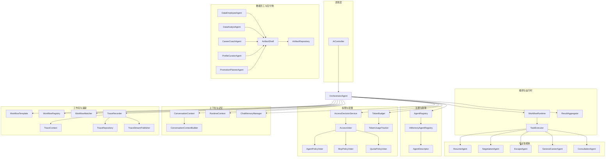

图表来源
- [OrchestratorAgent.java](file://src/main/java/com/yupi/yuaiagent/agent/OrchestratorAgent.java)
- [WorkflowRuntime.java](file://src/main/java/com/yupi/yuaiagent/workflow/runtime/WorkflowRuntime.java)
- [TaskExecutor.java](file://src/main/java/com/yupi/yuaiagent/agent/TaskExecutor.java)
- [ResultAggregator.java](file://src/main/java/com/yupi/yuaiagent/agent/ResultAggregator.java)
- [DataEmployeeAgent.java](file://src/main/java/com/yupi/yuaiagent/agent/data/DataEmployeeAgent.java)
- [ArtifactShelf.java](file://src/main/java/com/yupi/yuaiagent/artifact/ArtifactShelf.java)
- [AgentRegistry.java](file://src/main/java/com/yupi/yuaiagent/registry/AgentRegistry.java)
- [InMemoryAgentRegistry.java](file://src/main/java/com/yupi/yuaiagent/registry/InMemoryAgentRegistry.java)
- [AccessDecisionService.java](file://src/main/java/com/yupi/yuaiagent/access/AccessDecisionService.java)
- [TokenBudget.java](file://src/main/java/com/yupi/yuaiagent/budget/TokenBudget.java)
- [ConversationContext.java](file://src/main/java/com/yupi/yuaiagent/context/ConversationContext.java)
- [ChatMemoryManager.java](file://src/main/java/com/yupi/yuaiagent/chatmemory/ChatMemoryManager.java)
- [WorkflowTemplate.java](file://src/main/java/com/yupi/yuaiagent/workflow/WorkflowTemplate.java)
- [WorkflowRegistry.java](file://src/main/java/com/yupi/yuaiagent/workflow/WorkflowRegistry.java)
- [WorkflowMatcher.java](file://src/main/java/com/yupi/yuaiagent/workflow/WorkflowMatcher.java)
- [TraceRecorder.java](file://src/main/java/com/yupi/yuaiagent/trace/TraceRecorder.java)
- [TraceContext.java](file://src/main/java/com/yupi/yuaiagent/trace/TraceContext.java)
- [TraceRepository.java](file://src/main/java/com/yupi/yuaiagent/trace/TraceRepository.java)
- [TraceStreamPublisher.java](file://src/main/java/com/yupi/yuaiagent/trace/TraceStreamPublisher.java)

章节来源
- [OrchestratorAgent.java](file://src/main/java/com/yupi/yuaiagent/agent/OrchestratorAgent.java)
- [AgentConfig.java](file://src/main/java/com/yupi/yuaiagent/config/AgentConfig.java)
- [multi-agent-runtime-architecture.md](file://docs/multi-agent-runtime-architecture.md)
- [architecture.html](file://docs/architecture.html)

## 核心组件
- OrchestratorAgent：意图识别与路由中枢，协调专业智能体与数据员工，驱动工作流执行与结果聚合。
- AgentRunner 适配器：将不同专业智能体封装为统一执行接口，屏蔽差异，便于编排层调度。
- TaskExecutor：任务执行器，负责令牌预算检查、失败策略、并行/串行执行与结果收集。
- ResultAggregator：结果格式化与合成，统一输出结构。
- 数据员工体系：以 DataEmployeeAgent 为抽象，实现“加工 → 封装 → 放货”的黑板模式，支撑跨 Agent 协作与上下文注入。
- 注册与发现：AgentRegistry 提供声明式 Agent 发现与能力检索。
- 权限与配额：AccessDecisionService 与 Voter 组合实现策略投票，TokenBudget/TokenUsageTracker 实现资源约束。
- 上下文与记忆：ConversationContext/Builder/RuntimeContext 管理会话与跨会话状态；ChatMemoryManager 提供压缩与持久化。
- 工作流与追踪：WorkflowTemplate/Registry/Matcher 驱动任务图执行；TraceRecorder/TraceContext/TraceRepository/TraceStreamPublisher 记录执行轨迹。
- 用户画像：UserProfileService/Extractor/Repository 实现画像抽取、合并与注入。

章节来源
- [OrchestratorAgent.java](file://src/main/java/com/yupi/yuaiagent/agent/OrchestratorAgent.java)
- [AgentRunner.java](file://src/main/java/com/yupi/yuaiagent/agent/AgentRunner.java)
- [TaskExecutor.java](file://src/main/java/com/yupi/yuaiagent/agent/TaskExecutor.java)
- [ResultAggregator.java](file://src/main/java/com/yupi/yuaiagent/agent/ResultAggregator.java)
- [DataEmployeeAgent.java](file://src/main/java/com/yupi/yuaiagent/agent/data/DataEmployeeAgent.java)
- [AgentRegistry.java](file://src/main/java/com/yupi/yuaiagent/registry/AgentRegistry.java)
- [AccessDecisionService.java](file://src/main/java/com/yupi/yuaiagent/access/AccessDecisionService.java)
- [TokenBudget.java](file://src/main/java/com/yupi/yuaiagent/budget/TokenBudget.java)
- [ConversationContext.java](file://src/main/java/com/yupi/yuaiagent/context/ConversationContext.java)
- [ChatMemoryManager.java](file://src/main/java/com/yupi/yuaiagent/chatmemory/ChatMemoryManager.java)
- [WorkflowTemplate.java](file://src/main/java/com/yupi/yuaiagent/workflow/WorkflowTemplate.java)
- [WorkflowRegistry.java](file://src/main/java/com/yupi/yuaiagent/workflow/WorkflowRegistry.java)
- [WorkflowMatcher.java](file://src/main/java/com/yupi/yuaiagent/workflow/WorkflowMatcher.java)
- [TraceRecorder.java](file://src/main/java/com/yupi/yuaiagent/trace/TraceRecorder.java)
- [TraceContext.java](file://src/main/java/com/yupi/yuaiagent/trace/TraceContext.java)
- [TraceRepository.java](file://src/main/java/com/yupi/yuaiagent/trace/TraceRepository.java)
- [TraceStreamPublisher.java](file://src/main/java/com/yupi/yuaiagent/trace/TraceStreamPublisher.java)
- [UserProfileService.java](file://src/main/java/com/yupi/yuaiagent/profile/UserProfileService.java)
- [UserProfileExtractor.java](file://src/main/java/com/yupi/yuaiagent/profile/UserProfileExtractor.java)
- [UserProfileRepository.java](file://src/main/java/com/yupi/yuaiagent/profile/UserProfileRepository.java)

## 架构总览
多智能体运行时采用“意图识别 → 工作流匹配 → 任务执行 → 结果聚合”的流水线。OrchestratorAgent 作为编排中枢，结合 NLU 与工作流模板，将多意图映射为任务图，交由 TaskExecutor 并行/串行执行。数据员工通过 ArtifactShelf 形成黑板，实现跨 Agent 的交付物共享与上下文注入。权限与配额在执行前进行决策，上下文与记忆贯穿全链路，追踪系统记录每一步状态。

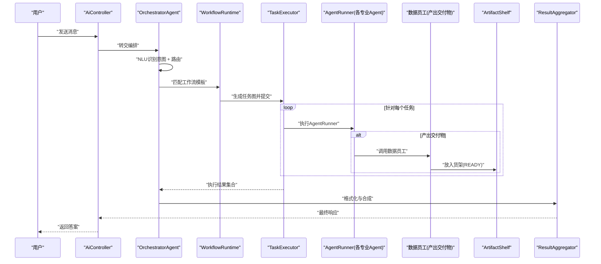

图表来源
- [OrchestratorAgent.java](file://src/main/java/com/yupi/yuaiagent/agent/OrchestratorAgent.java)
- [WorkflowRuntime.java](file://src/main/java/com/yupi/yuaiagent/workflow/runtime/WorkflowRuntime.java)
- [TaskExecutor.java](file://src/main/java/com/yupi/yuaiagent/agent/TaskExecutor.java)
- [ResultAggregator.java](file://src/main/java/com/yupi/yuaiagent/agent/ResultAggregator.java)
- [DataEmployeeAgent.java](file://src/main/java/com/yupi/yuaiagent/agent/data/DataEmployeeAgent.java)
- [ArtifactShelf.java](file://src/main/java/com/yupi/yuaiagent/artifact/ArtifactShelf.java)

## 详细组件分析

### OrchestratorAgent 编排逻辑
- 意图识别与路由：通过 NLU 与工作流匹配，将多意图映射为任务图，决定执行顺序与并行度。
- 专业智能体编排：维护 AgentRunner 映射，按任务类型选择对应 Runner，确保执行边界清晰。
- 技能优先：若技能匹配成功，优先使用技能回答，避免不必要的智能体开销。
- 生命周期钩子：预处理（鉴权、预算检查）、加载上下文（会话+跨智能体）、保存记忆、记录轨迹、后处理（画像更新、质量审查）。
- 交付物注入：在对话请求时查询 READY 交付物并注入子 Agent 上下文，消费后标记 CONSUMED。

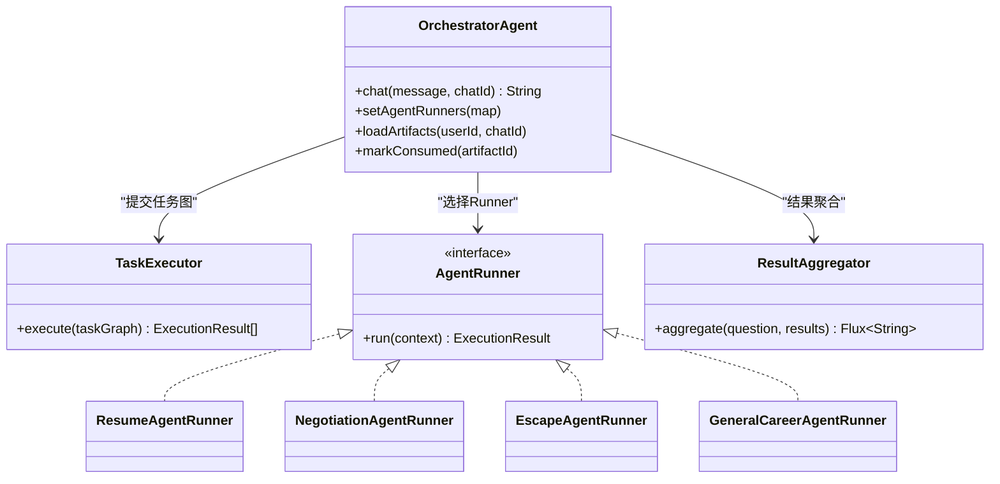

图表来源
- [OrchestratorAgent.java](file://src/main/java/com/yupi/yuaiagent/agent/OrchestratorAgent.java)
- [TaskExecutor.java](file://src/main/java/com/yupi/yuaiagent/agent/TaskExecutor.java)
- [AgentRunner.java](file://src/main/java/com/yupi/yuaiagent/agent/AgentRunner.java)
- [ResumeAgentRunner.java](file://src/main/java/com/yupi/yuaiagent/agent/runner/ResumeAgentRunner.java)
- [NegotiationAgentRunner.java](file://src/main/java/com/yupi/yuaiagent/agent/runner/NegotiationAgentRunner.java)
- [EscapeAgentRunner.java](file://src/main/java/com/yupi/yuaiagent/agent/runner/EscapeAgentRunner.java)
- [GeneralCareerAgentRunner.java](file://src/main/java/com/yupi/yuaiagent/agent/runner/GeneralCareerAgentRunner.java)
- [ResultAggregator.java](file://src/main/java/com/yupi/yuaiagent/agent/ResultAggregator.java)

章节来源
- [OrchestratorAgent.java](file://src/main/java/com/yupi/yuaiagent/agent/OrchestratorAgent.java)
- [ResultAggregator.java](file://src/main/java/com/yupi/yuaiagent/agent/ResultAggregator.java)
- [tasks.md](file://.kiro/specs/data-employee-agents/tasks.md)
- [review-report-2026-06-10.md](file://docs/review-report-2026-06-10.md)

### AgentRunner 适配器模式
- 统一接口：AgentRunner 定义 run(context) 返回 ExecutionResult，屏蔽不同智能体的内部差异。
- 专业智能体封装：ResumeAgentRunner、NegotiationAgentRunner、EscapeAgentRunner、GeneralCareerAgentRunner 将各自智能体包装为 Runner，便于编排层调度。
- 与 TaskExecutor 配合：TaskExecutor 依据工作流节点类型选择对应 Runner，执行并收集结果。

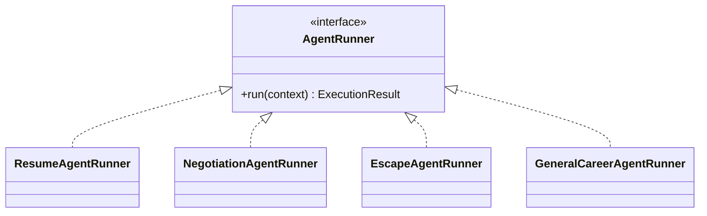

图表来源
- [AgentRunner.java](file://src/main/java/com/yupi/yuaiagent/agent/AgentRunner.java)
- [ResumeAgentRunner.java](file://src/main/java/com/yupi/yuaiagent/agent/runner/ResumeAgentRunner.java)
- [NegotiationAgentRunner.java](file://src/main/java/com/yupi/yuaiagent/agent/runner/NegotiationAgentRunner.java)
- [EscapeAgentRunner.java](file://src/main/java/com/yupi/yuaiagent/agent/runner/EscapeAgentRunner.java)
- [GeneralCareerAgentRunner.java](file://src/main/java/com/yupi/yuaiagent/agent/runner/GeneralCareerAgentRunner.java)

章节来源
- [AgentRunner.java](file://src/main/java/com/yupi/yuaiagent/agent/AgentRunner.java)
- [ResumeAgentRunner.java](file://src/main/java/com/yupi/yuaiagent/agent/runner/ResumeAgentRunner.java)
- [NegotiationAgentRunner.java](file://src/main/java/com/yupi/yuaiagent/agent/runner/NegotiationAgentRunner.java)
- [EscapeAgentRunner.java](file://src/main/java/com/yupi/yuaiagent/agent/runner/EscapeAgentRunner.java)
- [GeneralCareerAgentRunner.java](file://src/main/java/com/yupi/yuaiagent/agent/runner/GeneralCareerAgentRunner.java)

### 数据员工（Data Employees）系统
- 设计理念：遵循黑板模式，上游智能体产出交付物（Artifact），下游智能体按需查询并消费，形成跨 Agent 的协作闭环。
- DataEmployeeAgent 抽象：统一“加工 → 封装 → 放货”流程，子类仅实现具体加工逻辑。
- DataAnalystAgent：分析对话历史或上传文档，产出结构化 JSON 报告，放入货架。
- 扩展数据员工：岗位辅导（CareerCoachAgent）、画像整理（ProfileCuratorAgent）、晋升规划（PromotionPlannerAgent）。
- 作用域与消费：支持 USER_PROFILE（跨会话）与 TASK（会话内）两种作用域；消费后标记 CONSUMED。

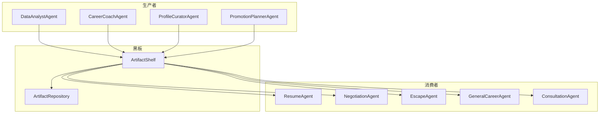

图表来源
- [DataEmployeeAgent.java](file://src/main/java/com/yupi/yuaiagent/agent/data/DataEmployeeAgent.java)
- [DataAnalystAgent.java](file://src/main/java/com/yupi/yuaiagent/agent/data/DataAnalystAgent.java)
- [CareerCoachAgent.java](file://src/main/java/com/yupi/yuaiagent/agent/data/CareerCoachAgent.java)
- [ProfileCuratorAgent.java](file://src/main/java/com/yupi/yuaiagent/agent/data/ProfileCuratorAgent.java)
- [PromotionPlannerAgent.java](file://src/main/java/com/yupi/yuaiagent/agent/data/PromotionPlannerAgent.java)
- [ArtifactShelf.java](file://src/main/java/com/yupi/yuaiagent/artifact/ArtifactShelf.java)
- [ArtifactRepository.java](file://src/main/java/com/yupi/yuaiagent/artifact/ArtifactRepository.java)

章节来源
- [design.md](file://.kiro/specs/data-employee-agents/design.md)
- [tasks.md](file://.kiro/specs/data-employee-agents/tasks.md)
- [DataEmployeeAgent.java](file://src/main/java/com/yupi/yuaiagent/agent/data/DataEmployeeAgent.java)
- [DataAnalystAgent.java](file://src/main/java/com/yupi/yuaiagent/agent/data/DataAnalystAgent.java)

### 智能体注册与发现
- AgentDescriptor：声明式定义 Agent 的元数据（编码、版本、能力标签、绑定技能、MCP 服务器等）。
- InMemoryAgentRegistry：启动时从 classpath:agents/*.yaml 加载内置 Agent，支持运行时动态注册。
- AgentRegistry：对外暴露注册、查询、按能力/意图关键词检索与统计能力。

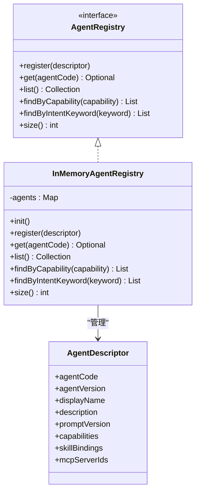

图表来源
- [AgentRegistry.java](file://src/main/java/com/yupi/yuaiagent/registry/AgentRegistry.java)
- [InMemoryAgentRegistry.java](file://src/main/java/com/yupi/yuaiagent/registry/InMemoryAgentRegistry.java)
- [AgentDescriptor.java](file://src/main/java/com/yupi/yuaiagent/registry/AgentDescriptor.java)

章节来源
- [AgentRegistry.java](file://src/main/java/com/yupi/yuaiagent/registry/AgentRegistry.java)
- [InMemoryAgentRegistry.java](file://src/main/java/com/yupi/yuaiagent/registry/InMemoryAgentRegistry.java)
- [AgentDescriptor.java](file://src/main/java/com/yupi/yuaiagent/registry/AgentDescriptor.java)

### 权限控制与资源分配
- AccessDecisionService：综合多个 AccessVoter（AgentPolicyVoter、McpPolicyVoter、QuotaPolicyVoter）进行策略投票，决定访问许可。
- TokenBudget/TokenUsageTracker：在执行前进行预算检查，防止超支；执行后记录使用量，支持配额审计。

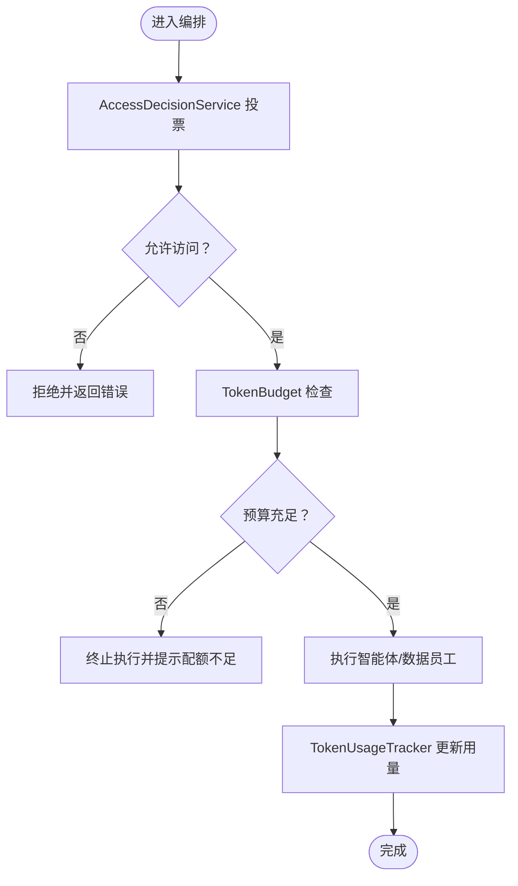

图表来源
- [AccessDecisionService.java](file://src/main/java/com/yupi/yuaiagent/access/AccessDecisionService.java)
- [AccessVoter.java](file://src/main/java/com/yupi/yuaiagent/access/AccessVoter.java)
- [AgentPolicyVoter.java](file://src/main/java/com/yupi/yuaiagent/access/AgentPolicyVoter.java)
- [McpPolicyVoter.java](file://src/main/java/com/yupi/yuaiagent/access/McpPolicyVoter.java)
- [QuotaPolicyVoter.java](file://src/main/java/com/yupi/yuaiagent/access/QuotaPolicyVoter.java)
- [TokenBudget.java](file://src/main/java/com/yupi/yuaiagent/budget/TokenBudget.java)
- [TokenUsageTracker.java](file://src/main/java/com/yupi/yuaiagent/budget/TokenUsageTracker.java)

章节来源
- [AccessDecisionService.java](file://src/main/java/com/yupi/yuaiagent/access/AccessDecisionService.java)
- [AccessVoter.java](file://src/main/java/com/yupi/yuaiagent/access/AccessVoter.java)
- [AgentPolicyVoter.java](file://src/main/java/com/yupi/yuaiagent/access/AgentPolicyVoter.java)
- [McpPolicyVoter.java](file://src/main/java/com/yupi/yuaiagent/access/McpPolicyVoter.java)
- [QuotaPolicyVoter.java](file://src/main/java/com/yupi/yuaiagent/access/QuotaPolicyVoter.java)
- [TokenBudget.java](file://src/main/java/com/yupi/yuaiagent/budget/TokenBudget.java)
- [TokenUsageTracker.java](file://src/main/java/com/yupi/yuaiagent/budget/TokenUsageTracker.java)

### 智能体生命周期管理、消息传递与状态同步
- 生命周期钩子：beforeExecute（鉴权、预算检查）、loadMemory（会话+跨智能体）、execute（子类实现）、saveMemory（持久化）、recordTrace（轨迹）、afterExecute（画像更新、质量审查）。
- 消息传递：AiController 接收请求，OrchestratorAgent 负责路由与编排，ResultAggregator 输出最终结果。
- 状态同步：ConversationContext/Builder/RuntimeContext 管理会话状态；ChatMemoryManager 提供压缩与持久化；ArtifactShelf 支持跨智能体状态共享。

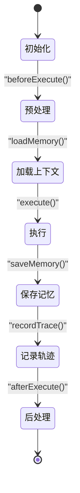

图表来源
- [OrchestratorAgent.java](file://src/main/java/com/yupi/yuaiagent/agent/OrchestratorAgent.java)
- [ConversationContext.java](file://src/main/java/com/yupi/yuaiagent/context/ConversationContext.java)
- [ConversationContextBuilder.java](file://src/main/java/com/yupi/yuaiagent/context/ConversationContextBuilder.java)
- [RuntimeContext.java](file://src/main/java/com/yupi/yuaiagent/context/RuntimeContext.java)
- [ChatMemoryManager.java](file://src/main/java/com/yupi/yuaiagent/chatmemory/ChatMemoryManager.java)
- [ResultAggregator.java](file://src/main/java/com/yupi/yuaiagent/agent/ResultAggregator.java)

章节来源
- [OrchestratorAgent.java](file://src/main/java/com/yupi/yuaiagent/agent/OrchestratorAgent.java)
- [ConversationContext.java](file://src/main/java/com/yupi/yuaiagent/context/ConversationContext.java)
- [ConversationContextBuilder.java](file://src/main/java/com/yupi/yuaiagent/context/ConversationContextBuilder.java)
- [RuntimeContext.java](file://src/main/java/com/yupi/yuaiagent/context/RuntimeContext.java)
- [ChatMemoryManager.java](file://src/main/java/com/yupi/yuaiagent/chatmemory/ChatMemoryManager.java)
- [ResultAggregator.java](file://src/main/java/com/yupi/yuaiagent/agent/ResultAggregator.java)

### 工作流与追踪
- 工作流：WorkflowTemplate/Registry/Matcher 将意图映射为任务图；WorkflowRuntime 驱动执行。
- 追踪：TraceRecorder 记录步骤与状态；TraceContext 管理上下文；TraceRepository 持久化；TraceStreamPublisher 实时推送。

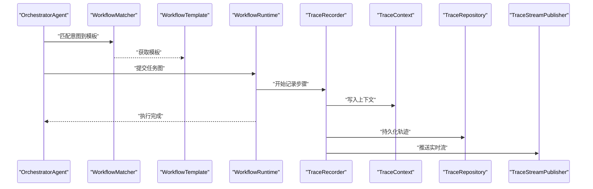

图表来源
- [WorkflowTemplate.java](file://src/main/java/com/yupi/yuaiagent/workflow/WorkflowTemplate.java)
- [WorkflowRegistry.java](file://src/main/java/com/yupi/yuaiagent/workflow/WorkflowRegistry.java)
- [WorkflowMatcher.java](file://src/main/java/com/yupi/yuaiagent/workflow/WorkflowMatcher.java)
- [WorkflowRuntime.java](file://src/main/java/com/yupi/yuaiagent/workflow/runtime/WorkflowRuntime.java)
- [TraceRecorder.java](file://src/main/java/com/yupi/yuaiagent/trace/TraceRecorder.java)
- [TraceContext.java](file://src/main/java/com/yupi/yuaiagent/trace/TraceContext.java)
- [TraceRepository.java](file://src/main/java/com/yupi/yuaiagent/trace/TraceRepository.java)
- [TraceStreamPublisher.java](file://src/main/java/com/yupi/yuaiagent/trace/TraceStreamPublisher.java)

章节来源
- [WorkflowTemplate.java](file://src/main/java/com/yupi/yuaiagent/workflow/WorkflowTemplate.java)
- [WorkflowRegistry.java](file://src/main/java/com/yupi/yuaiagent/workflow/WorkflowRegistry.java)
- [WorkflowMatcher.java](file://src/main/java/com/yupi/yuaiagent/workflow/WorkflowMatcher.java)
- [WorkflowRuntime.java](file://src/main/java/com/yupi/yuaiagent/workflow/runtime/WorkflowRuntime.java)
- [TraceRecorder.java](file://src/main/java/com/yupi/yuaiagent/trace/TraceRecorder.java)
- [TraceContext.java](file://src/main/java/com/yupi/yuaiagent/trace/TraceContext.java)
- [TraceRepository.java](file://src/main/java/com/yupi/yuaiagent/trace/TraceRepository.java)
- [TraceStreamPublisher.java](file://src/main/java/com/yupi/yuaiagent/trace/TraceStreamPublisher.java)

### 用户画像系统
- UserProfileService：抽取、合并、查询、清空与注入画像。
- UserProfileExtractor：对话结束后异步抽取画像特征。
- UserProfileRepository：持久化画像数据。
- 与编排集成：画像注入到各智能体的 system prompt，实现个性化。

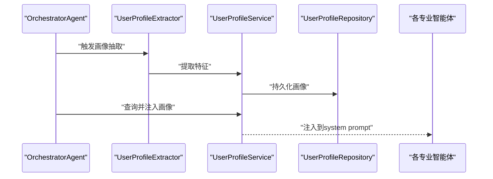

图表来源
- [UserProfileService.java](file://src/main/java/com/yupi/yuaiagent/profile/UserProfileService.java)
- [UserProfileExtractor.java](file://src/main/java/com/yupi/yuaiagent/profile/UserProfileExtractor.java)
- [UserProfileRepository.java](file://src/main/java/com/yupi/yuaiagent/profile/UserProfileRepository.java)
- [OrchestratorAgent.java](file://src/main/java/com/yupi/yuaiagent/agent/OrchestratorAgent.java)

章节来源
- [UserProfileService.java](file://src/main/java/com/yupi/yuaiagent/profile/UserProfileService.java)
- [UserProfileExtractor.java](file://src/main/java/com/yupi/yuaiagent/profile/UserProfileExtractor.java)
- [UserProfileRepository.java](file://src/main/java/com/yupi/yuaiagent/profile/UserProfileRepository.java)
- [OrchestratorAgent.java](file://src/main/java/com/yupi/yuaiagent/agent/OrchestratorAgent.java)

## 依赖关系分析
- 组件耦合：OrchestratorAgent 与 AgentRunner、TaskExecutor、ResultAggregator、AgentRegistry、AccessDecisionService、TokenBudget、WorkflowRuntime、TraceRecorder、UserProfileService 等存在直接依赖；通过接口与装配降低耦合。
- 外部依赖：Spring Boot、Spring AI、Jackson、YAML 解析器、数据库/文件存储（用于 ArtifactRepository 与 UserProfileRepository）。
- 潜在循环依赖：当前结构通过接口与装配避免循环依赖；建议保持 Runner 与智能体解耦，避免在 Runner 中直接调用编排层。

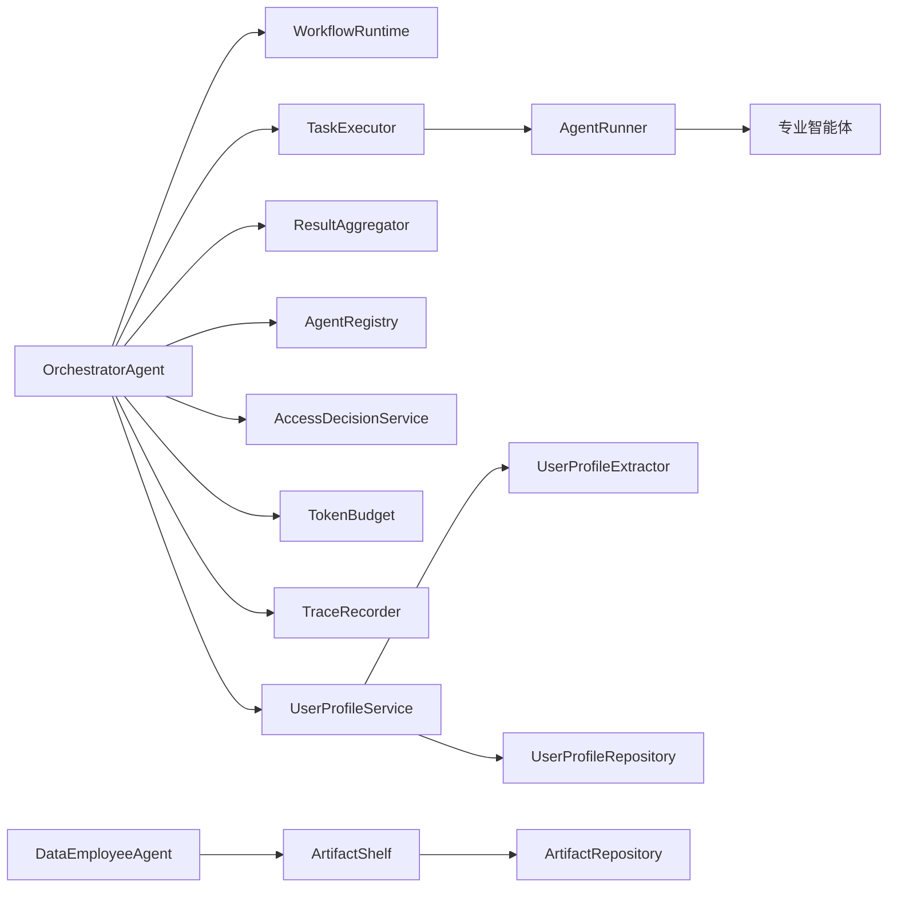

图表来源
- [OrchestratorAgent.java](file://src/main/java/com/yupi/yuaiagent/agent/OrchestratorAgent.java)
- [WorkflowRuntime.java](file://src/main/java/com/yupi/yuaiagent/workflow/runtime/WorkflowRuntime.java)
- [TaskExecutor.java](file://src/main/java/com/yupi/yuaiagent/agent/TaskExecutor.java)
- [ResultAggregator.java](file://src/main/java/com/yupi/yuaiagent/agent/ResultAggregator.java)
- [AgentRegistry.java](file://src/main/java/com/yupi/yuaiagent/registry/AgentRegistry.java)
- [AccessDecisionService.java](file://src/main/java/com/yupi/yuaiagent/access/AccessDecisionService.java)
- [TokenBudget.java](file://src/main/java/com/yupi/yuaiagent/budget/TokenBudget.java)
- [TraceRecorder.java](file://src/main/java/com/yupi/yuaiagent/trace/TraceRecorder.java)
- [UserProfileService.java](file://src/main/java/com/yupi/yuaiagent/profile/UserProfileService.java)
- [UserProfileExtractor.java](file://src/main/java/com/yupi/yuaiagent/profile/UserProfileExtractor.java)
- [UserProfileRepository.java](file://src/main/java/com/yupi/yuaiagent/profile/UserProfileRepository.java)
- [DataEmployeeAgent.java](file://src/main/java/com/yupi/yuaiagent/agent/data/DataEmployeeAgent.java)
- [ArtifactShelf.java](file://src/main/java/com/yupi/yuaiagent/artifact/ArtifactShelf.java)
- [ArtifactRepository.java](file://src/main/java/com/yupi/yuaiagent/artifact/ArtifactRepository.java)

章节来源
- [OrchestratorAgent.java](file://src/main/java/com/yupi/yuaiagent/agent/OrchestratorAgent.java)
- [AgentRunner.java](file://src/main/java/com/yupi/yuaiagent/agent/AgentRunner.java)
- [TaskExecutor.java](file://src/main/java/com/yupi/yuaiagent/agent/TaskExecutor.java)
- [ResultAggregator.java](file://src/main/java/com/yupi/yuaiagent/agent/ResultAggregator.java)
- [AgentRegistry.java](file://src/main/java/com/yupi/yuaiagent/registry/AgentRegistry.java)
- [AccessDecisionService.java](file://src/main/java/com/yupi/yuaiagent/access/AccessDecisionService.java)
- [TokenBudget.java](file://src/main/java/com/yupi/yuaiagent/budget/TokenBudget.java)
- [TraceRecorder.java](file://src/main/java/com/yupi/yuaiagent/trace/TraceRecorder.java)
- [UserProfileService.java](file://src/main/java/com/yupi/yuaiagent/profile/UserProfileService.java)
- [UserProfileExtractor.java](file://src/main/java/com/yupi/yuaiagent/profile/UserProfileExtractor.java)
- [UserProfileRepository.java](file://src/main/java/com/yupi/yuaiagent/profile/UserProfileRepository.java)
- [DataEmployeeAgent.java](file://src/main/java/com/yupi/yuaiagent/agent/data/DataEmployeeAgent.java)
- [ArtifactShelf.java](file://src/main/java/com/yupi/yuaiagent/artifact/ArtifactShelf.java)
- [ArtifactRepository.java](file://src/main/java/com/yupi/yuaiagent/artifact/ArtifactRepository.java)

## 性能考量
- 并行执行：TaskExecutor 支持并行节点，充分利用多核与外部工具调用的并发能力。
- 记忆压缩：TokenCompressionStrategy/TurnCompressionStrategy 减少上下文开销。
- 预算控制：TokenBudget 与 TokenUsageTracker 防止大模型调用过度消耗。
- 缓存与货架：ArtifactShelf 避免重复计算，提升跨智能体协作效率。
- 追踪与可观测：TraceRecorder/TraceStreamPublisher 提供实时监控与回溯能力。

## 故障排查指南
- 权限拒绝：检查 AccessDecisionService 的投票结果与各 Voter 的策略配置，确认 AgentPolicy、McpPolicy、QuotaPolicy 是否满足。
- 预算不足：确认 TokenBudget 与 TokenUsageTracker 的累计用量是否超过阈值。
- 交付物未注入：检查 ArtifactShelf 的查询与 markConsumed 流程，确保 READY 状态与作用域正确。
- 意图路由异常：验证 NLU 与工作流匹配器的配置，确认 WorkflowTemplate/Registry/Matcher 的一致性。
- 画像注入失败：检查 UserProfileExtractor 的抽取逻辑与 UserProfileService 的注入流程。

章节来源
- [AccessDecisionService.java](file://src/main/java/com/yupi/yuaiagent/access/AccessDecisionService.java)
- [AccessVoter.java](file://src/main/java/com/yupi/yuaiagent/access/AccessVoter.java)
- [AgentPolicyVoter.java](file://src/main/java/com/yupi/yuaiagent/access/AgentPolicyVoter.java)
- [McpPolicyVoter.java](file://src/main/java/com/yupi/yuaiagent/access/McpPolicyVoter.java)
- [QuotaPolicyVoter.java](file://src/main/java/com/yupi/yuaiagent/access/QuotaPolicyVoter.java)
- [TokenBudget.java](file://src/main/java/com/yupi/yuaiagent/budget/TokenBudget.java)
- [TokenUsageTracker.java](file://src/main/java/com/yupi/yuaiagent/budget/TokenUsageTracker.java)
- [ArtifactShelf.java](file://src/main/java/com/yupi/yuaiagent/artifact/ArtifactShelf.java)
- [WorkflowTemplate.java](file://src/main/java/com/yupi/yuaiagent/workflow/WorkflowTemplate.java)
- [WorkflowRegistry.java](file://src/main/java/com/yupi/yuaiagent/workflow/WorkflowRegistry.java)
- [WorkflowMatcher.java](file://src/main/java/com/yupi/yuaiagent/workflow/WorkflowMatcher.java)
- [UserProfileService.java](file://src/main/java/com/yupi/yuaiagent/profile/UserProfileService.java)
- [UserProfileExtractor.java](file://src/main/java/com/yupi/yuaiagent/profile/UserProfileExtractor.java)

## 结论
该多智能体运行时架构以 OrchestratorAgent 为核心，结合工作流、数据员工货架、权限与配额控制、上下文与追踪系统，实现了高内聚、低耦合的智能体编排与协作。通过适配器模式与统一生命周期钩子，系统具备良好的扩展性与可维护性；通过黑板模式与作用域隔离，实现了跨智能体的状态共享与安全消费。建议持续完善工作流 DAG 引擎与前端可视化，进一步提升企业级编排能力。

## 附录
- 开发指南与扩展点
  - 新增专业智能体：实现 AgentRunner 并在 OrchestratorAgent 中注册映射。
  - 新增数据员工：继承 DataEmployeeAgent，实现 doProduce 并返回结构化结果。
  - 新增 Agent：编写 resources/agents/*.yaml，InMemoryAgentRegistry 将自动加载。
  - 新增工作流模板：在 resources/workflows 下新增模板，WorkflowRegistry 自动注册。
  - 新增权限策略：实现 AccessVoter 并加入 AccessDecisionService 的投票集合。
  - 新增追踪字段：在 TraceRecorder/TraceContext 中扩展字段，TraceRepository/TraceStreamPublisher 自动适配。
- 最佳实践
  - 将智能体内部复杂逻辑收敛到 Runner，保持编排层简洁。
  - 使用 ArtifactShelf 进行跨智能体状态共享，避免直接耦合。
  - 严格控制 TokenBudget，启用压缩策略减少上下文开销。
  - 为每个关键步骤添加 Trace，便于问题定位与性能分析。
  - 通过 UserProfileService 注入个性化提示，提升用户体验。