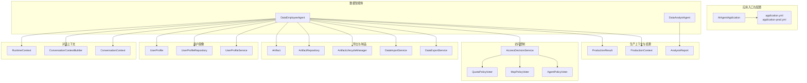
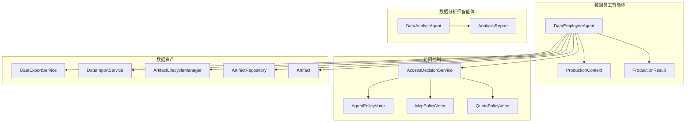
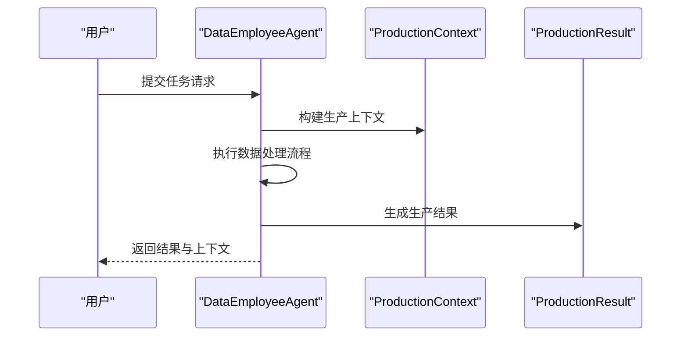
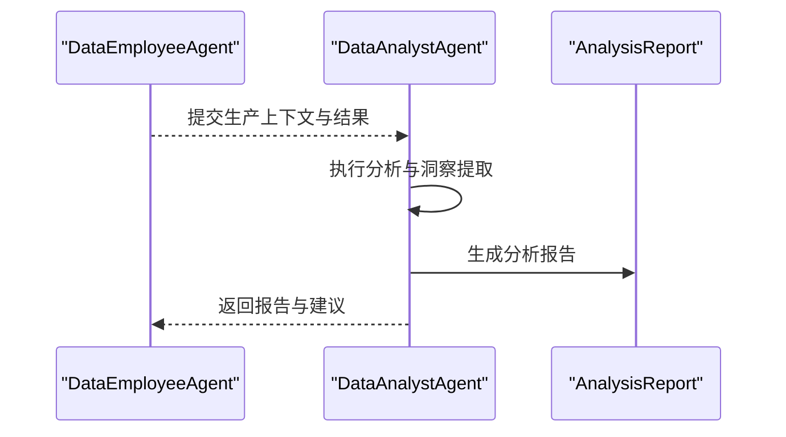
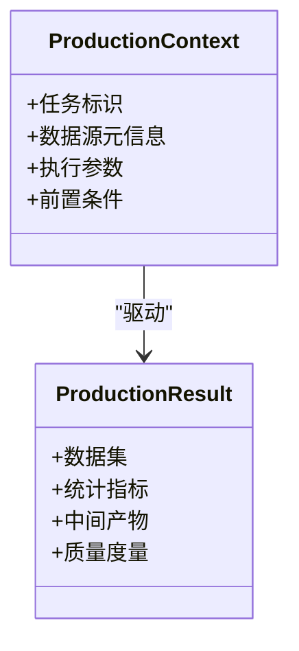
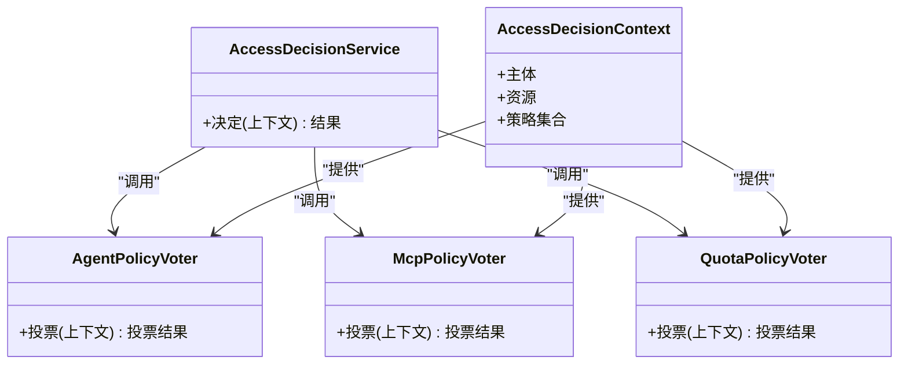
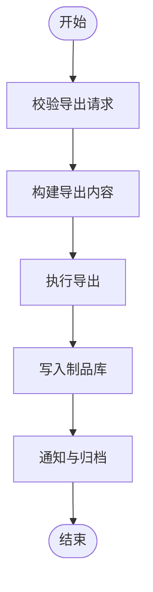
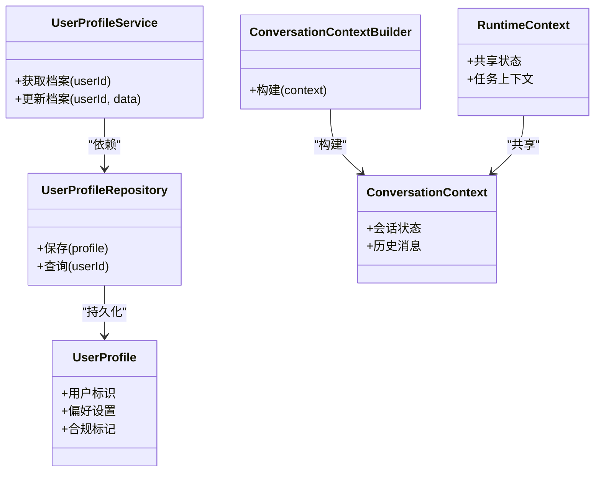
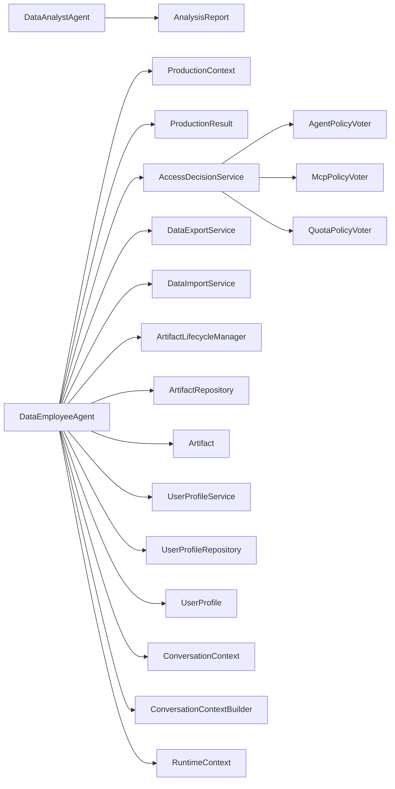

# 数据员工系统

<cite>
**本文引用的文件**
- [DataEmployeeAgent.java](file://src/main/java/com/yupi/yuaiagent/agent/data/DataEmployeeAgent.java)
- [DataAnalystAgent.java](file://src/main/java/com/yupi/yuaiagent/agent/data/DataAnalystAgent.java)
- [ProductionContext.java](file://src/main/java/com/yupi/yuaiagent/agent/data/ProductionContext.java)
- [ProductionResult.java](file://src/main/java/com/yupi/yuaiagent/agent/data/ProductionResult.java)
- [AnalysisReport.java](file://src/main/java/com/yupi/yuaiagent/agent/data/AnalysisReport.java)
- [AccessDecisionService.java](file://src/main/java/com/yupi/yuaiagent/access/AccessDecisionService.java)
- [AccessDecisionContext.java](file://src/main/java/com/yupi/yuaiagent/access/AccessDecisionContext.java)
- [AgentPolicyVoter.java](file://src/main/java/com/yupi/yuaiagent/access/AgentPolicyVoter.java)
- [McpPolicyVoter.java](file://src/main/java/com/yupi/yuaiagent/access/McpPolicyVoter.java)
- [QuotaPolicyVoter.java](file://src/main/java/com/yupi/yuaiagent/access/QuotaPolicyVoter.java)
- [DataExportService.java](file://src/main/java/com/yupi/yuaiagent/export/DataExportService.java)
- [DataImportService.java](file://src/main/java/com/yupi/yuaiagent/export/DataImportService.java)
- [ExportController.java](file://src/main/java/com/yupi/yuaiagent/controller/ExportController.java)
- [ArtifactLifecycleManager.java](file://src/main/java/com/yupi/yuaiagent/artifact/ArtifactLifecycleManager.java)
- [ArtifactRepository.java](file://src/main/java/com/yupi/yuaiagent/artifact/ArtifactRepository.java)
- [Artifact.java](file://src/main/java/com/yupi/yuaiagent/artifact/model/Artifact.java)
- [UserProfileService.java](file://src/main/java/com/yupi/yuaiagent/profile/UserProfileService.java)
- [UserProfileRepository.java](file://src/main/java/com/yupi/yuaiagent/profile/UserProfileRepository.java)
- [UserProfile.java](file://src/main/java/com/yupi/yuaiagent/profile/model/UserProfile.java)
- [ConversationContext.java](file://src/main/java/com/yupi/yuaiagent/context/ConversationContext.java)
- [ConversationContextBuilder.java](file://src/main/java/com/yupi/yuaiagent/context/ConversationContextBuilder.java)
- [RuntimeContext.java](file://src/main/java/com/yupi/yuaiagent/context/RuntimeContext.java)
- [AiAgentApplication.java](file://src/main/java/com/yupi/yuaiagent/AiAgentApplication.java)
- [application.yml](file://src/main/resources/application.yml)
- [application-prod.yml](file://src/main/resources/application-prod.yml)
- [permissions/data-agent.yaml](file://src/main/resources/permissions/data-agent.yaml)
- [README.md](file://README.md)
</cite>

## 目录
1. [引言](#引言)
2. [项目结构](#项目结构)
3. [核心组件](#核心组件)
4. [架构总览](#架构总览)
5. [详细组件分析](#详细组件分析)
6. [依赖关系分析](#依赖关系分析)
7. [性能考虑](#性能考虑)
8. [故障排查指南](#故障排查指南)
9. [结论](#结论)
10. [附录](#附录)

## 引言
本文件面向“数据员工系统”的架构与实现，聚焦于数据分析师智能体的数据挖掘逻辑、分析报告生成机制、洞察提取策略，以及在生产上下文中的数据封装、结果格式化与流转机制。同时，系统通过访问决策服务与策略投票器实现权限控制、配额管理与合规约束；通过导出/导入服务与制品生命周期管理保障数据安全与可追溯性。本文旨在帮助技术与非技术读者全面理解系统设计、运行流程与最佳实践。

## 项目结构
系统采用分层与功能域结合的组织方式：
- 应用入口与配置：应用启动类、全局配置与环境配置
- 访问控制与权限：访问决策服务、策略投票器（代理策略、MCP信任策略、配额策略）
- 数据智能体：数据员工与数据分析师智能体，负责数据挖掘、分析与报告生成
- 生产上下文与结果：生产上下文封装、生产结果模型与分析报告模型
- 导出与制品：数据导出/导入服务、制品仓库与生命周期管理
- 用户画像：用户档案服务与存储
- 对话上下文：会话构建与运行时上下文
- 控制器：导出接口控制器

图表来源
- [AiAgentApplication.java:1-200](file://src/main/java/com/yupi/yuaiagent/AiAgentApplication.java#L1-L200)
- [application.yml:1-200](file://src/main/resources/application.yml#L1-L200)
- [application-prod.yml:1-200](file://src/main/resources/application-prod.yml#L1-L200)
- [AccessDecisionService.java:1-200](file://src/main/java/com/yupi/yuaiagent/access/AccessDecisionService.java#L1-L200)
- [AgentPolicyVoter.java:1-200](file://src/main/java/com/yupi/yuaiagent/access/AgentPolicyVoter.java#L1-L200)
- [McpPolicyVoter.java:1-200](file://src/main/java/com/yupi/yuaiagent/access/McpPolicyVoter.java#L1-L200)
- [QuotaPolicyVoter.java:1-200](file://src/main/java/com/yupi/yuaiagent/access/QuotaPolicyVoter.java#L1-L200)
- [DataEmployeeAgent.java:1-200](file://src/main/java/com/yupi/yuaiagent/agent/data/DataEmployeeAgent.java#L1-L200)
- [DataAnalystAgent.java:1-200](file://src/main/java/com/yupi/yuaiagent/agent/data/DataAnalystAgent.java#L1-L200)
- [ProductionContext.java:1-200](file://src/main/java/com/yupi/yuaiagent/agent/data/ProductionContext.java#L1-L200)
- [ProductionResult.java:1-200](file://src/main/java/com/yupi/yuaiagent/agent/data/ProductionResult.java#L1-L200)
- [AnalysisReport.java:1-200](file://src/main/java/com/yupi/yuaiagent/agent/data/AnalysisReport.java#L1-L200)
- [DataExportService.java:1-200](file://src/main/java/com/yupi/yuaiagent/export/DataExportService.java#L1-L200)
- [DataImportService.java:1-200](file://src/main/java/com/yupi/yuaiagent/export/DataImportService.java#L1-L200)
- [ArtifactLifecycleManager.java:1-200](file://src/main/java/com/yupi/yuaiagent/artifact/ArtifactLifecycleManager.java#L1-L200)
- [ArtifactRepository.java:1-200](file://src/main/java/com/yupi/yuaiagent/artifact/ArtifactRepository.java#L1-L200)
- [Artifact.java:1-200](file://src/main/java/com/yupi/yuaiagent/artifact/model/Artifact.java#L1-L200)
- [UserProfileService.java:1-200](file://src/main/java/com/yupi/yuaiagent/profile/UserProfileService.java#L1-L200)
- [UserProfileRepository.java:1-200](file://src/main/java/com/yupi/yuaiagent/profile/UserProfileRepository.java#L1-L200)
- [UserProfile.java:1-200](file://src/main/java/com/yupi/yuaiagent/profile/model/UserProfile.java#L1-L200)
- [ConversationContext.java:1-200](file://src/main/java/com/yupi/yuaiagent/context/ConversationContext.java#L1-L200)
- [ConversationContextBuilder.java:1-200](file://src/main/java/com/yupi/yuaiagent/context/ConversationContextBuilder.java#L1-L200)
- [RuntimeContext.java:1-200](file://src/main/java/com/yupi/yuaiagent/context/RuntimeContext.java#L1-L200)

章节来源
- [AiAgentApplication.java:1-200](file://src/main/java/com/yupi/yuaiagent/AiAgentApplication.java#L1-L200)
- [application.yml:1-200](file://src/main/resources/application.yml#L1-L200)
- [application-prod.yml:1-200](file://src/main/resources/application-prod.yml#L1-L200)

## 核心组件
- 数据员工智能体：负责在给定业务目标下进行数据采集、清洗、聚合与洞察提取，并生成可执行的生产上下文与结果。
- 数据分析师智能体：基于数据员工产出的上下文与结果，生成结构化的分析报告，支持多维度解读与建议。
- 生产上下文与结果：封装数据员工在特定任务中的输入、中间状态与最终产物，确保可复现与可审计。
- 访问决策服务与策略投票器：统一接入权限、MCP信任与配额策略，保障合规与资源控制。
- 导出/导入与制品管理：提供标准化的数据导出能力与制品生命周期管理，确保数据资产的安全与可追溯。
- 用户画像：维护用户档案，支撑个性化与合规场景下的数据使用边界。

章节来源
- [DataEmployeeAgent.java:1-200](file://src/main/java/com/yupi/yuaiagent/agent/data/DataEmployeeAgent.java#L1-L200)
- [DataAnalystAgent.java:1-200](file://src/main/java/com/yupi/yuaiagent/agent/data/DataAnalystAgent.java#L1-L200)
- [ProductionContext.java:1-200](file://src/main/java/com/yupi/yuaiagent/agent/data/ProductionContext.java#L1-L200)
- [ProductionResult.java:1-200](file://src/main/java/com/yupi/yuaiagent/agent/data/ProductionResult.java#L1-L200)
- [AnalysisReport.java:1-200](file://src/main/java/com/yupi/yuaiagent/agent/data/AnalysisReport.java#L1-L200)
- [AccessDecisionService.java:1-200](file://src/main/java/com/yupi/yuaiagent/access/AccessDecisionService.java#L1-L200)
- [AgentPolicyVoter.java:1-200](file://src/main/java/com/yupi/yuaiagent/access/AgentPolicyVoter.java#L1-L200)
- [McpPolicyVoter.java:1-200](file://src/main/java/com/yupi/yuaiagent/access/McpPolicyVoter.java#L1-L200)
- [QuotaPolicyVoter.java:1-200](file://src/main/java/com/yupi/yuaiagent/access/QuotaPolicyVoter.java#L1-L200)
- [DataExportService.java:1-200](file://src/main/java/com/yupi/yuaiagent/export/DataExportService.java#L1-L200)
- [DataImportService.java:1-200](file://src/main/java/com/yupi/yuaiagent/export/DataImportService.java#L1-L200)
- [ArtifactLifecycleManager.java:1-200](file://src/main/java/com/yupi/yuaiagent/artifact/ArtifactLifecycleManager.java#L1-L200)
- [ArtifactRepository.java:1-200](file://src/main/java/com/yupi/yuaiagent/artifact/ArtifactRepository.java#L1-L200)
- [Artifact.java:1-200](file://src/main/java/com/yupi/yuaiagent/artifact/model/Artifact.java#L1-L200)
- [UserProfileService.java:1-200](file://src/main/java/com/yupi/yuaiagent/profile/UserProfileService.java#L1-L200)
- [UserProfileRepository.java:1-200](file://src/main/java/com/yupi/yuaiagent/profile/UserProfileRepository.java#L1-L200)
- [UserProfile.java:1-200](file://src/main/java/com/yupi/yuaiagent/profile/model/UserProfile.java#L1-L200)
- [ConversationContext.java:1-200](file://src/main/java/com/yupi/yuaiagent/context/ConversationContext.java#L1-L200)
- [ConversationContextBuilder.java:1-200](file://src/main/java/com/yupi/yuaiagent/context/ConversationContextBuilder.java#L1-L200)
- [RuntimeContext.java:1-200](file://src/main/java/com/yupi/yuaiagent/context/RuntimeContext.java#L1-L200)

## 架构总览
系统以“智能体驱动 + 权限治理 + 数据资产化”为核心设计，形成从数据采集到报告输出的闭环。数据员工智能体承担“执行者”，数据分析师智能体承担“思考者”，访问决策服务与策略投票器保障“合规与资源”，导出/导入与制品管理确保“可审计与可复用”。

图表来源
- [DataEmployeeAgent.java:1-200](file://src/main/java/com/yupi/yuaiagent/agent/data/DataEmployeeAgent.java#L1-L200)
- [DataAnalystAgent.java:1-200](file://src/main/java/com/yupi/yuaiagent/agent/data/DataAnalystAgent.java#L1-L200)
- [AccessDecisionService.java:1-200](file://src/main/java/com/yupi/yuaiagent/access/AccessDecisionService.java#L1-L200)
- [AgentPolicyVoter.java:1-200](file://src/main/java/com/yupi/yuaiagent/access/AgentPolicyVoter.java#L1-L200)
- [McpPolicyVoter.java:1-200](file://src/main/java/com/yupi/yuaiagent/access/McpPolicyVoter.java#L1-L200)
- [QuotaPolicyVoter.java:1-200](file://src/main/java/com/yupi/yuaiagent/access/QuotaPolicyVoter.java#L1-L200)
- [DataExportService.java:1-200](file://src/main/java/com/yupi/yuaiagent/export/DataExportService.java#L1-L200)
- [DataImportService.java:1-200](file://src/main/java/com/yupi/yuaiagent/export/DataImportService.java#L1-L200)
- [ArtifactLifecycleManager.java:1-200](file://src/main/java/com/yupi/yuaiagent/artifact/ArtifactLifecycleManager.java#L1-L200)
- [ArtifactRepository.java:1-200](file://src/main/java/com/yupi/yuaiagent/artifact/ArtifactRepository.java#L1-L200)
- [Artifact.java:1-200](file://src/main/java/com/yupi/yuaiagent/artifact/model/Artifact.java#L1-L200)

## 详细组件分析

### 数据员工智能体（DataEmployeeAgent）
职责与流程
- 输入：业务目标、数据源信息、权限与配额上下文
- 处理：数据采集、清洗、聚合、洞察提取
- 输出：生产上下文与生产结果，供后续分析与导出

图表来源
- [DataEmployeeAgent.java:1-200](file://src/main/java/com/yupi/yuaiagent/agent/data/DataEmployeeAgent.java#L1-L200)
- [ProductionContext.java:1-200](file://src/main/java/com/yupi/yuaiagent/agent/data/ProductionContext.java#L1-L200)
- [ProductionResult.java:1-200](file://src/main/java/com/yupi/yuaiagent/agent/data/ProductionResult.java#L1-L200)

章节来源
- [DataEmployeeAgent.java:1-200](file://src/main/java/com/yupi/yuaiagent/agent/data/DataEmployeeAgent.java#L1-L200)
- [ProductionContext.java:1-200](file://src/main/java/com/yupi/yuaiagent/agent/data/ProductionContext.java#L1-L200)
- [ProductionResult.java:1-200](file://src/main/java/com/yupi/yuaiagent/agent/data/ProductionResult.java#L1-L200)

### 数据分析师智能体（DataAnalystAgent）
职责与流程
- 输入：数据员工的生产上下文与结果
- 处理：多维度分析、趋势解读、异常检测、建议生成
- 输出：结构化分析报告，支持可视化与导出

图表来源
- [DataAnalystAgent.java:1-200](file://src/main/java/com/yupi/yuaiagent/agent/data/DataAnalystAgent.java#L1-L200)
- [AnalysisReport.java:1-200](file://src/main/java/com/yupi/yuaiagent/agent/data/AnalysisReport.java#L1-L200)

章节来源
- [DataAnalystAgent.java:1-200](file://src/main/java/com/yupi/yuaiagent/agent/data/DataAnalystAgent.java#L1-L200)
- [AnalysisReport.java:1-200](file://src/main/java/com/yupi/yuaiagent/agent/data/AnalysisReport.java#L1-L200)

### 生产上下文与结果（ProductionContext / ProductionResult）
- 生产上下文：封装任务输入、数据源元信息、执行参数与前置条件，确保可复现性与可审计性
- 生产结果：承载处理后的数据集、统计指标、中间产物与质量度量，便于后续分析与导出

图表来源
- [ProductionContext.java:1-200](file://src/main/java/com/yupi/yuaiagent/agent/data/ProductionContext.java#L1-L200)
- [ProductionResult.java:1-200](file://src/main/java/com/yupi/yuaiagent/agent/data/ProductionResult.java#L1-L200)

章节来源
- [ProductionContext.java:1-200](file://src/main/java/com/yupi/yuaiagent/agent/data/ProductionContext.java#L1-L200)
- [ProductionResult.java:1-200](file://src/main/java/com/yupi/yuaiagent/agent/data/ProductionResult.java#L1-L200)

### 访问决策与权限控制（AccessDecisionService 及策略投票器）
- 统一接入点：AccessDecisionService 调用多个策略投票器进行综合决策
- 策略类型：
  - 代理策略：基于代理角色与任务类型的授权判定
  - MCP 策略：基于 MCP 服务器信任级别与调用范围的授权判定
  - 配额策略：基于令牌预算与使用情况的资源配额控制
- 决策上下文：AccessDecisionContext 封装当前请求的主体、资源与策略集合

图表来源
- [AccessDecisionService.java:1-200](file://src/main/java/com/yupi/yuaiagent/access/AccessDecisionService.java#L1-L200)
- [AgentPolicyVoter.java:1-200](file://src/main/java/com/yupi/yuaiagent/access/AgentPolicyVoter.java#L1-L200)
- [McpPolicyVoter.java:1-200](file://src/main/java/com/yupi/yuaiagent/access/McpPolicyVoter.java#L1-L200)
- [QuotaPolicyVoter.java:1-200](file://src/main/java/com/yupi/yuaiagent/access/QuotaPolicyVoter.java#L1-L200)
- [AccessDecisionContext.java:1-200](file://src/main/java/com/yupi/yuaiagent/access/AccessDecisionContext.java#L1-L200)

章节来源
- [AccessDecisionService.java:1-200](file://src/main/java/com/yupi/yuaiagent/access/AccessDecisionService.java#L1-L200)
- [AgentPolicyVoter.java:1-200](file://src/main/java/com/yupi/yuaiagent/access/AgentPolicyVoter.java#L1-L200)
- [McpPolicyVoter.java:1-200](file://src/main/java/com/yupi/yuaiagent/access/McpPolicyVoter.java#L1-L200)
- [QuotaPolicyVoter.java:1-200](file://src/main/java/com/yupi/yuaiagent/access/QuotaPolicyVoter.java#L1-L200)
- [AccessDecisionContext.java:1-200](file://src/main/java/com/yupi/yuaiagent/access/AccessDecisionContext.java#L1-L200)

### 导出/导入与制品管理
- 导出服务：DataExportService 提供统一的数据导出能力，支持多种格式与范围
- 导入服务：DataImportService 支持外部数据的批量导入与校验
- 制品管理：ArtifactLifecycleManager 与 ArtifactRepository 管理制品的全生命周期与版本控制，Artifact 模型定义制品的核心属性

图表来源
- [DataExportService.java:1-200](file://src/main/java/com/yupi/yuaiagent/export/DataExportService.java#L1-L200)
- [DataImportService.java:1-200](file://src/main/java/com/yupi/yuaiagent/export/DataImportService.java#L1-L200)
- [ArtifactLifecycleManager.java:1-200](file://src/main/java/com/yupi/yuaiagent/artifact/ArtifactLifecycleManager.java#L1-L200)
- [ArtifactRepository.java:1-200](file://src/main/java/com/yupi/yuaiagent/artifact/ArtifactRepository.java#L1-L200)
- [Artifact.java:1-200](file://src/main/java/com/yupi/yuaiagent/artifact/model/Artifact.java#L1-L200)

章节来源
- [DataExportService.java:1-200](file://src/main/java/com/yupi/yuaiagent/export/DataExportService.java#L1-L200)
- [DataImportService.java:1-200](file://src/main/java/com/yupi/yuaiagent/export/DataImportService.java#L1-L200)
- [ArtifactLifecycleManager.java:1-200](file://src/main/java/com/yupi/yuaiagent/artifact/ArtifactLifecycleManager.java#L1-L200)
- [ArtifactRepository.java:1-200](file://src/main/java/com/yupi/yuaiagent/artifact/ArtifactRepository.java#L1-L200)
- [Artifact.java:1-200](file://src/main/java/com/yupi/yuaiagent/artifact/model/Artifact.java#L1-L200)

### 用户画像与对话上下文
- 用户画像：UserProfileService 与 UserProfileRepository 提供用户档案的查询与更新能力，UserProfile 定义用户核心属性
- 对话上下文：ConversationContext 与 ConversationContextBuilder 负责会话状态的构建与持久化；RuntimeContext 提供运行时共享状态

图表来源
- [UserProfileService.java:1-200](file://src/main/java/com/yupi/yuaiagent/profile/UserProfileService.java#L1-L200)
- [UserProfileRepository.java:1-200](file://src/main/java/com/yupi/yuaiagent/profile/UserProfileRepository.java#L1-L200)
- [UserProfile.java:1-200](file://src/main/java/com/yupi/yuaiagent/profile/model/UserProfile.java#L1-L200)
- [ConversationContext.java:1-200](file://src/main/java/com/yupi/yuaiagent/context/ConversationContext.java#L1-L200)
- [ConversationContextBuilder.java:1-200](file://src/main/java/com/yupi/yuaiagent/context/ConversationContextBuilder.java#L1-L200)
- [RuntimeContext.java:1-200](file://src/main/java/com/yupi/yuaiagent/context/RuntimeContext.java#L1-L200)

章节来源
- [UserProfileService.java:1-200](file://src/main/java/com/yupi/yuaiagent/profile/UserProfileService.java#L1-L200)
- [UserProfileRepository.java:1-200](file://src/main/java/com/yupi/yuaiagent/profile/UserProfileRepository.java#L1-L200)
- [UserProfile.java:1-200](file://src/main/java/com/yupi/yuaiagent/profile/model/UserProfile.java#L1-L200)
- [ConversationContext.java:1-200](file://src/main/java/com/yupi/yuaiagent/context/ConversationContext.java#L1-L200)
- [ConversationContextBuilder.java:1-200](file://src/main/java/com/yupi/yuaiagent/context/ConversationContextBuilder.java#L1-L200)
- [RuntimeContext.java:1-200](file://src/main/java/com/yupi/yuaiagent/context/RuntimeContext.java#L1-L200)

## 依赖关系分析
- 模块内聚：数据智能体与上下文、结果模型耦合度高，便于端到端追踪
- 横向依赖：访问控制服务被所有智能体与服务调用，形成统一的治理面
- 外部集成：导出/导入与制品管理作为数据资产化基础设施，向上游智能体提供标准化输出能力
- 配置与环境：application.yml 与 application-prod.yml 提供运行时开关与环境变量

图表来源
- [DataEmployeeAgent.java:1-200](file://src/main/java/com/yupi/yuaiagent/agent/data/DataEmployeeAgent.java#L1-L200)
- [DataAnalystAgent.java:1-200](file://src/main/java/com/yupi/yuaiagent/agent/data/DataAnalystAgent.java#L1-L200)
- [AccessDecisionService.java:1-200](file://src/main/java/com/yupi/yuaiagent/access/AccessDecisionService.java#L1-L200)
- [AgentPolicyVoter.java:1-200](file://src/main/java/com/yupi/yuaiagent/access/AgentPolicyVoter.java#L1-L200)
- [McpPolicyVoter.java:1-200](file://src/main/java/com/yupi/yuaiagent/access/McpPolicyVoter.java#L1-L200)
- [QuotaPolicyVoter.java:1-200](file://src/main/java/com/yupi/yuaiagent/access/QuotaPolicyVoter.java#L1-L200)
- [DataExportService.java:1-200](file://src/main/java/com/yupi/yuaiagent/export/DataExportService.java#L1-L200)
- [DataImportService.java:1-200](file://src/main/java/com/yupi/yuaiagent/export/DataImportService.java#L1-L200)
- [ArtifactLifecycleManager.java:1-200](file://src/main/java/com/yupi/yuaiagent/artifact/ArtifactLifecycleManager.java#L1-L200)
- [ArtifactRepository.java:1-200](file://src/main/java/com/yupi/yuaiagent/artifact/ArtifactRepository.java#L1-L200)
- [Artifact.java:1-200](file://src/main/java/com/yupi/yuaiagent/artifact/model/Artifact.java#L1-L200)
- [UserProfileService.java:1-200](file://src/main/java/com/yupi/yuaiagent/profile/UserProfileService.java#L1-L200)
- [UserProfileRepository.java:1-200](file://src/main/java/com/yupi/yuaiagent/profile/UserProfileRepository.java#L1-L200)
- [UserProfile.java:1-200](file://src/main/java/com/yupi/yuaiagent/profile/model/UserProfile.java#L1-L200)
- [ConversationContext.java:1-200](file://src/main/java/com/yupi/yuaiagent/context/ConversationContext.java#L1-L200)
- [ConversationContextBuilder.java:1-200](file://src/main/java/com/yupi/yuaiagent/context/ConversationContextBuilder.java#L1-L200)
- [RuntimeContext.java:1-200](file://src/main/java/com/yupi/yuaiagent/context/RuntimeContext.java#L1-L200)

章节来源
- [application.yml:1-200](file://src/main/resources/application.yml#L1-L200)
- [application-prod.yml:1-200](file://src/main/resources/application-prod.yml#L1-L200)

## 性能考虑
- 数据处理批量化：优先采用批量读取与写入，减少 IO 次数
- 缓存与压缩：对中间结果与常用查询结果进行缓存，必要时启用压缩以降低内存占用
- 并行化与流水线：在不破坏一致性前提下，对独立子任务进行并行处理
- 资源配额：通过配额策略限制单次任务的资源消耗，避免雪崩效应
- 导出优化：按需导出与增量导出，避免全量重复传输

## 故障排查指南
- 权限相关
  - 现象：访问被拒绝或任务无法启动
  - 排查：检查代理策略、MCP 策略与配额策略的配置与投票结果
  - 参考路径：[AccessDecisionService.java:1-200](file://src/main/java/com/yupi/yuaiagent/access/AccessDecisionService.java#L1-L200)，[AgentPolicyVoter.java:1-200](file://src/main/java/com/yupi/yuaiagent/access/AgentPolicyVoter.java#L1-L200)，[McpPolicyVoter.java:1-200](file://src/main/java/com/yupi/yuaiagent/access/McpPolicyVoter.java#L1-L200)，[QuotaPolicyVoter.java:1-200](file://src/main/java/com/yupi/yuaiagent/access/QuotaPolicyVoter.java#L1-L200)
- 数据导出失败
  - 现象：导出任务报错或结果为空
  - 排查：确认导出范围、格式与目标存储可用性；检查制品生命周期与归档状态
  - 参考路径：[DataExportService.java:1-200](file://src/main/java/com/yupi/yuaiagent/export/DataExportService.java#L1-L200)，[ArtifactLifecycleManager.java:1-200](file://src/main/java/com/yupi/yuaiagent/artifact/ArtifactLifecycleManager.java#L1-L200)，[ArtifactRepository.java:1-200](file://src/main/java/com/yupi/yuaiagent/artifact/ArtifactRepository.java#L1-L200)
- 用户画像异常
  - 现象：用户偏好或合规标记缺失
  - 排查：核对 UserProfileService 的读写路径与 UserProfileRepository 的持久化状态
  - 参考路径：[UserProfileService.java:1-200](file://src/main/java/com/yupi/yuaiagent/profile/UserProfileService.java#L1-L200)，[UserProfileRepository.java:1-200](file://src/main/java/com/yupi/yuaiagent/profile/UserProfileRepository.java#L1-L200)

章节来源
- [AccessDecisionService.java:1-200](file://src/main/java/com/yupi/yuaiagent/access/AccessDecisionService.java#L1-L200)
- [AgentPolicyVoter.java:1-200](file://src/main/java/com/yupi/yuaiagent/access/AgentPolicyVoter.java#L1-L200)
- [McpPolicyVoter.java:1-200](file://src/main/java/com/yupi/yuaiagent/access/McpPolicyVoter.java#L1-L200)
- [QuotaPolicyVoter.java:1-200](file://src/main/java/com/yupi/yuaiagent/access/QuotaPolicyVoter.java#L1-L200)
- [DataExportService.java:1-200](file://src/main/java/com/yupi/yuaiagent/export/DataExportService.java#L1-L200)
- [ArtifactLifecycleManager.java:1-200](file://src/main/java/com/yupi/yuaiagent/artifact/ArtifactLifecycleManager.java#L1-L200)
- [ArtifactRepository.java:1-200](file://src/main/java/com/yupi/yuaiagent/artifact/ArtifactRepository.java#L1-L200)
- [UserProfileService.java:1-200](file://src/main/java/com/yupi/yuaiagent/profile/UserProfileService.java#L1-L200)
- [UserProfileRepository.java:1-200](file://src/main/java/com/yupi/yuaiagent/profile/UserProfileRepository.java#L1-L200)

## 结论
数据员工系统通过“智能体 + 权限 + 资产化”的架构实现了从数据采集到报告输出的闭环。数据员工智能体专注于执行与结果产出，数据分析师智能体负责深度解读与建议生成；访问决策服务与策略投票器确保合规与资源可控；导出/导入与制品管理保障数据资产的安全与可追溯。该体系既满足了生产级的稳定性与安全性要求，也为未来扩展与优化提供了清晰的演进路径。

## 附录
- 配置参考
  - 应用配置：[application.yml:1-200](file://src/main/resources/application.yml#L1-L200)
  - 生产配置：[application-prod.yml:1-200](file://src/main/resources/application-prod.yml#L1-L200)
- 权限策略样例
  - 数据代理权限：[permissions/data-agent.yaml:1-200](file://src/main/resources/permissions/data-agent.yaml#L1-L200)
- 入口类参考
  - 应用启动：[AiAgentApplication.java:1-200](file://src/main/java/com/yupi/yuaiagent/AiAgentApplication.java#L1-L200)
- 说明
  - 本文件为系统架构与实现的概览性文档，具体代码细节请参考各组件对应的源码路径。