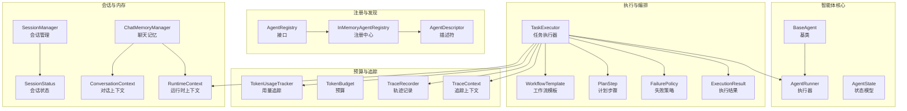
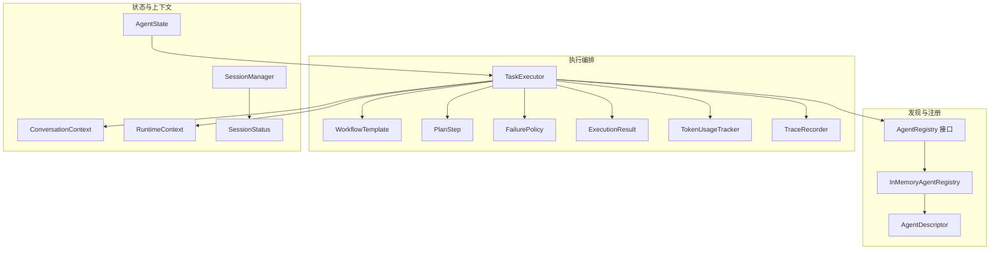
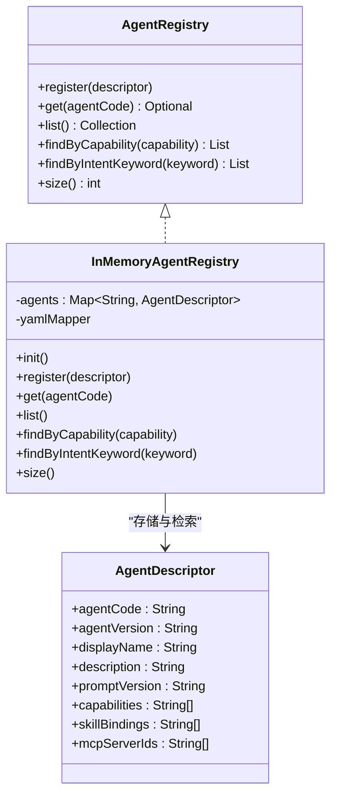
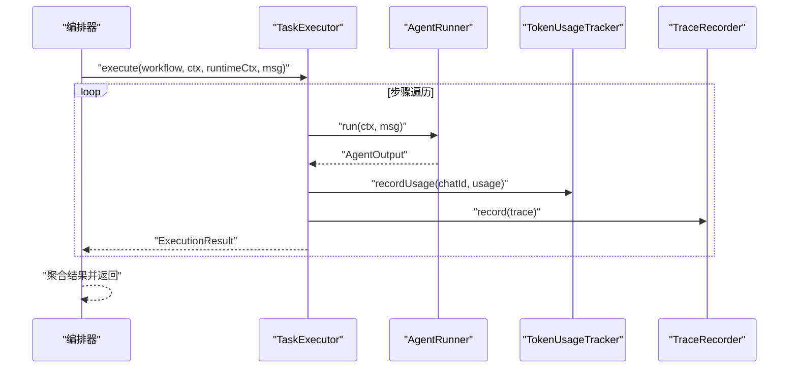
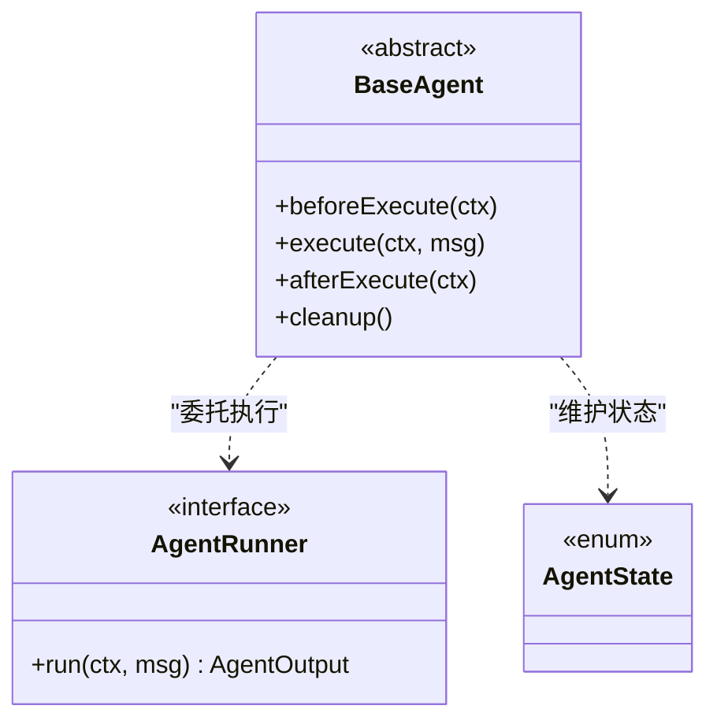
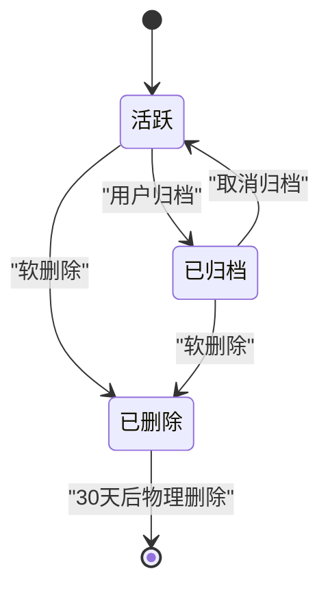
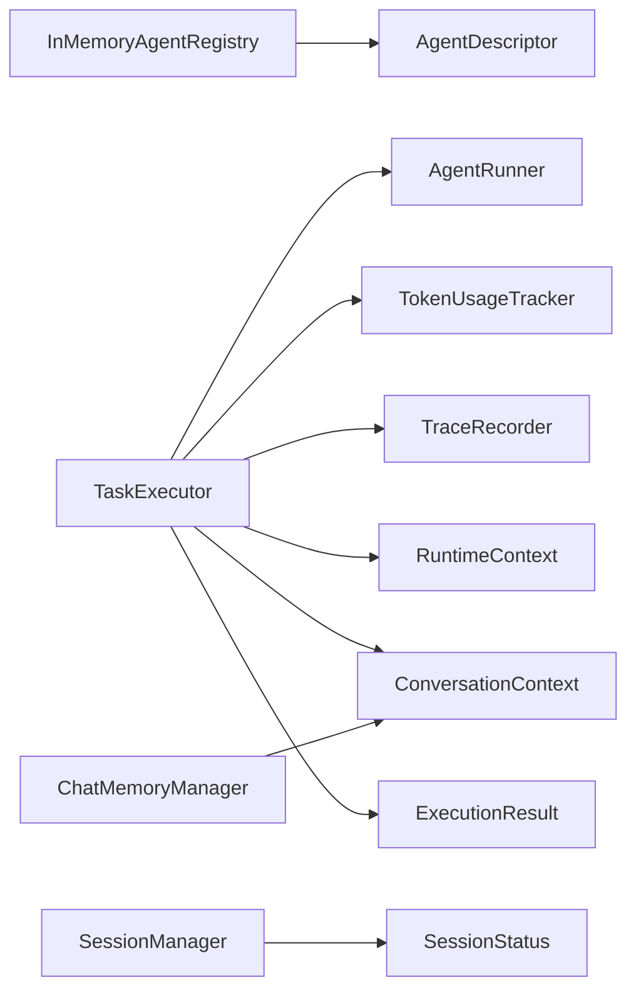

# 智能体生命周期管理

<cite>
**本文引用的文件**
- [BaseAgent.java](file://src/main/java/com/yupi/yuaiagent/agent/BaseAgent.java)
- [AgentRunner.java](file://src/main/java/com/yupi/yuaiagent/agent/AgentRunner.java)
- [AgentState.java](file://src/main/java/com/yupi/yuaiagent/agent/model/AgentState.java)
- [AgentRegistry.java](file://src/main/java/com/yupi/yuaiagent/registry/AgentRegistry.java)
- [InMemoryAgentRegistry.java](file://src/main/java/com/yupi/yuaiagent/registry/InMemoryAgentRegistry.java)
- [AgentDescriptor.java](file://src/main/java/com/yupi/yuaiagent/registry/AgentDescriptor.java)
- [TaskExecutor.java](file://src/main/java/com/yupi/yuaiagent/agent/TaskExecutor.java)
- [SessionManager.java](file://src/main/java/com/yupi/yuaiagent/session/SessionManager.java)
- [SessionStatus.java](file://src/main/java/com/yupi/yuaiagent/session/SessionStatus.java)
- [TokenUsageTracker.java](file://src/main/java/com/yupi/yuaiagent/budget/TokenUsageTracker.java)
- [TokenBudget.java](file://src/main/java/com/yupi/yuaiagent/budget/TokenBudget.java)
- [TraceRecorder.java](file://src/main/java/com/yupi/yuaiagent/trace/TraceRecorder.java)
- [TraceContext.java](file://src/main/java/com/yupi/yuaiagent/trace/TraceContext.java)
- [ChatMemoryManager.java](file://src/main/java/com/yupi/yuaiagent/chatmemory/ChatMemoryManager.java)
- [ConversationContext.java](file://src/main/java/com/yupi/yuaiagent/context/ConversationContext.java)
- [RuntimeContext.java](file://src/main/java/com/yupi/yuaiagent/context/RuntimeContext.java)
- [WorkflowTemplate.java](file://src/main/java/com/yupi/yuaiagent/workflow/runtime/WorkflowTemplate.java)
- [PlanStep.java](file://src/main/java/com/yupi/yuaiagent/workflow/node/PlanStep.java)
- [FailurePolicy.java](file://src/main/java/com/yupi/yuaiagent/agent/task/FailurePolicy.java)
- [ExecutionResult.java](file://src/main/java/com/yupi/yuaiagent/agent/task/ExecutionResult.java)
- [multi-agent-runtime-architecture.md](file://docs/multi-agent-runtime-architecture.md)
- [review-report-2026-06-10.md](file://docs/review-report-2026-06-10.md)
</cite>

## 目录
1. [引言](#引言)
2. [项目结构](#项目结构)
3. [核心组件](#核心组件)
4. [架构总览](#架构总览)
5. [详细组件分析](#详细组件分析)
6. [依赖关系分析](#依赖关系分析)
7. [性能考量](#性能考量)
8. [故障排查指南](#故障排查指南)
9. [结论](#结论)
10. [附录](#附录)

## 引言
本文件面向“智能体生命周期管理系统”，系统性梳理智能体从创建、注册、发现、执行、状态管理到销毁的全链路机制。重点覆盖以下方面：
- 智能体注册表的注册流程、发现机制与状态监控
- BaseAgent 基类的设计模式、公共功能抽象与扩展点
- 智能体状态管理、内存控制与资源清理策略
- 智能体池化管理、并发控制与性能优化
- 生命周期管理的代码示例路径与最佳实践

## 项目结构
项目采用分层与按功能域划分的组织方式，核心智能体相关模块集中在 agent 子包，并通过 registry、workflow、budget、trace、chatmemory、context 等子系统协同工作。

图表来源
- [BaseAgent.java](file://src/main/java/com/yupi/yuaiagent/agent/BaseAgent.java)
- [AgentRunner.java](file://src/main/java/com/yupi/yuaiagent/agent/AgentRunner.java)
- [AgentState.java](file://src/main/java/com/yupi/yuaiagent/agent/model/AgentState.java)
- [AgentRegistry.java](file://src/main/java/com/yupi/yuaiagent/registry/AgentRegistry.java)
- [InMemoryAgentRegistry.java](file://src/main/java/com/yupi/yuaiagent/registry/InMemoryAgentRegistry.java)
- [AgentDescriptor.java](file://src/main/java/com/yupi/yuaiagent/registry/AgentDescriptor.java)
- [TaskExecutor.java](file://src/main/java/com/yupi/yuaiagent/agent/TaskExecutor.java)
- [WorkflowTemplate.java](file://src/main/java/com/yupi/yuaiagent/workflow/runtime/WorkflowTemplate.java)
- [PlanStep.java](file://src/main/java/com/yupi/yuaiagent/workflow/node/PlanStep.java)
- [FailurePolicy.java](file://src/main/java/com/yupi/yuaiagent/agent/task/FailurePolicy.java)
- [ExecutionResult.java](file://src/main/java/com/yupi/yuaiagent/agent/task/ExecutionResult.java)
- [TokenUsageTracker.java](file://src/main/java/com/yupi/yuaiagent/budget/TokenUsageTracker.java)
- [TokenBudget.java](file://src/main/java/com/yupi/yuaiagent/budget/TokenBudget.java)
- [TraceRecorder.java](file://src/main/java/com/yupi/yuaiagent/trace/TraceRecorder.java)
- [TraceContext.java](file://src/main/java/com/yupi/yuaiagent/trace/TraceContext.java)
- [SessionManager.java](file://src/main/java/com/yupi/yuaiagent/session/SessionManager.java)
- [SessionStatus.java](file://src/main/java/com/yupi/yuaiagent/session/SessionStatus.java)
- [ChatMemoryManager.java](file://src/main/java/com/yupi/yuaiagent/chatmemory/ChatMemoryManager.java)
- [ConversationContext.java](file://src/main/java/com/yupi/yuaiagent/context/ConversationContext.java)
- [RuntimeContext.java](file://src/main/java/com/yupi/yuaiagent/context/RuntimeContext.java)

章节来源
- [AgentRegistry.java:1-43](file://src/main/java/com/yupi/yuaiagent/registry/AgentRegistry.java#L1-L43)
- [InMemoryAgentRegistry.java:1-105](file://src/main/java/com/yupi/yuaiagent/registry/InMemoryAgentRegistry.java#L1-L105)
- [AgentDescriptor.java:1-63](file://src/main/java/com/yupi/yuaiagent/registry/AgentDescriptor.java#L1-L63)
- [TaskExecutor.java:37-93](file://src/main/java/com/yupi/yuaiagent/agent/TaskExecutor.java#L37-L93)
- [SessionManager.java:83-212](file://src/main/java/com/yupi/yuaiagent/session/SessionManager.java#L83-L212)
- [SessionStatus.java:1-37](file://src/main/java/com/yupi/yuaiagent/session/SessionStatus.java#L1-L37)

## 核心组件
- 注册与发现：通过 AgentRegistry 接口与 InMemoryAgentRegistry 实现，支持启动时从资源目录加载内置智能体描述，以及运行时动态注册；提供按能力标签与意图关键词的检索能力。
- 执行与编排：TaskExecutor 负责遍历工作流步骤，结合 TokenUsageTracker 进行预算控制，依据 FailurePolicy 决策失败处理策略，并通过 TraceRecorder 记录执行轨迹。
- 状态与上下文：AgentState 定义智能体状态模型；ConversationContext 与 RuntimeContext 提供对话与运行时状态承载；SessionManager 管理会话生命周期状态。
- 基类与扩展：BaseAgent 作为统一基类，提供通用生命周期钩子与扩展点，便于各具体智能体继承与定制。

章节来源
- [AgentRegistry.java:1-43](file://src/main/java/com/yupi/yuaiagent/registry/AgentRegistry.java#L1-L43)
- [InMemoryAgentRegistry.java:30-105](file://src/main/java/com/yupi/yuaiagent/registry/InMemoryAgentRegistry.java#L30-L105)
- [AgentDescriptor.java:1-63](file://src/main/java/com/yupi/yuaiagent/registry/AgentDescriptor.java#L1-L63)
- [TaskExecutor.java:51-93](file://src/main/java/com/yupi/yuaiagent/agent/TaskExecutor.java#L51-L93)
- [AgentState.java](file://src/main/java/com/yupi/yuaiagent/agent/model/AgentState.java)
- [ConversationContext.java](file://src/main/java/com/yupi/yuaiagent/context/ConversationContext.java)
- [RuntimeContext.java](file://src/main/java/com/yupi/yuaiagent/context/RuntimeContext.java)
- [SessionManager.java:178-202](file://src/main/java/com/yupi/yuaiagent/session/SessionManager.java#L178-L202)
- [SessionStatus.java:17-37](file://src/main/java/com/yupi/yuaiagent/session/SessionStatus.java#L17-L37)

## 架构总览
下图展示智能体生命周期管理的整体架构：从注册表加载与发现，到工作流编排与执行，再到状态与内存管理、预算与追踪贯穿始终。

图表来源
- [AgentRegistry.java:1-43](file://src/main/java/com/yupi/yuaiagent/registry/AgentRegistry.java#L1-L43)
- [InMemoryAgentRegistry.java:1-105](file://src/main/java/com/yupi/yuaiagent/registry/InMemoryAgentRegistry.java#L1-L105)
- [AgentDescriptor.java:1-63](file://src/main/java/com/yupi/yuaiagent/registry/AgentDescriptor.java#L1-L63)
- [TaskExecutor.java:51-93](file://src/main/java/com/yupi/yuaiagent/agent/TaskExecutor.java#L51-L93)
- [WorkflowTemplate.java](file://src/main/java/com/yupi/yuaiagent/workflow/runtime/WorkflowTemplate.java)
- [PlanStep.java](file://src/main/java/com/yupi/yuaiagent/workflow/node/PlanStep.java)
- [FailurePolicy.java](file://src/main/java/com/yupi/yuaiagent/agent/task/FailurePolicy.java)
- [ExecutionResult.java](file://src/main/java/com/yupi/yuaiagent/agent/task/ExecutionResult.java)
- [TokenUsageTracker.java](file://src/main/java/com/yupi/yuaiagent/budget/TokenUsageTracker.java)
- [TraceRecorder.java](file://src/main/java/com/yupi/yuaiagent/trace/TraceRecorder.java)
- [AgentState.java](file://src/main/java/com/yupi/yuaiagent/agent/model/AgentState.java)
- [ConversationContext.java](file://src/main/java/com/yupi/yuaiagent/context/ConversationContext.java)
- [RuntimeContext.java](file://src/main/java/com/yupi/yuaiagent/context/RuntimeContext.java)
- [SessionManager.java:178-202](file://src/main/java/com/yupi/yuaiagent/session/SessionManager.java#L178-L202)
- [SessionStatus.java:17-37](file://src/main/java/com/yupi/yuaiagent/session/SessionStatus.java#L17-L37)

## 详细组件分析

### 注册表与发现机制
- 注册接口与实现：AgentRegistry 定义标准能力；InMemoryAgentRegistry 在启动时扫描 classpath:agents/*.yaml 并解析为 AgentDescriptor，支持运行时 register 动态注册。
- 发现能力：提供按能力标签与意图关键词的检索，便于工作流路由与意图识别。
- 线程安全：内部使用并发映射以支持多线程场景下的注册与查询。

图表来源
- [AgentRegistry.java:1-43](file://src/main/java/com/yupi/yuaiagent/registry/AgentRegistry.java#L1-L43)
- [InMemoryAgentRegistry.java:25-105](file://src/main/java/com/yupi/yuaiagent/registry/InMemoryAgentRegistry.java#L25-L105)
- [AgentDescriptor.java:23-63](file://src/main/java/com/yupi/yuaiagent/registry/AgentDescriptor.java#L23-L63)

章节来源
- [InMemoryAgentRegistry.java:30-105](file://src/main/java/com/yupi/yuaiagent/registry/InMemoryAgentRegistry.java#L30-L105)
- [AgentRegistry.java:14-42](file://src/main/java/com/yupi/yuaiagent/registry/AgentRegistry.java#L14-L42)
- [AgentDescriptor.java:25-63](file://src/main/java/com/yupi/yuaiagent/registry/AgentDescriptor.java#L25-L63)

### 执行器与工作流编排
- 预算与失败策略：在执行每一步前进行 Token 预估与预算检查；根据 FailurePolicy 决策失败时重试或跳过。
- 执行与追踪：执行后记录 Token 使用并写入 ExecutionResult，同时通过 TraceRecorder 记录执行轨迹。
- 上下文传递：统一通过 ConversationContext 与 RuntimeContext 传递状态，避免重复装载。

图表来源
- [TaskExecutor.java:51-93](file://src/main/java/com/yupi/yuaiagent/agent/TaskExecutor.java#L51-L93)
- [TokenUsageTracker.java](file://src/main/java/com/yupi/yuaiagent/budget/TokenUsageTracker.java)
- [TraceRecorder.java](file://src/main/java/com/yupi/yuaiagent/trace/TraceRecorder.java)
- [ExecutionResult.java](file://src/main/java/com/yupi/yuaiagent/agent/task/ExecutionResult.java)

章节来源
- [TaskExecutor.java:51-93](file://src/main/java/com/yupi/yuaiagent/agent/TaskExecutor.java#L51-L93)
- [multi-agent-runtime-architecture.md:782-895](file://docs/multi-agent-runtime-architecture.md#L782-L895)
- [FailurePolicy.java](file://src/main/java/com/yupi/yuaiagent/agent/task/FailurePolicy.java)
- [ExecutionResult.java](file://src/main/java/com/yupi/yuaiagent/agent/task/ExecutionResult.java)

### 基类设计与扩展点
- 设计模式：BaseAgent 作为抽象基类，提供统一的生命周期钩子（如预处理、执行、后处理），子类仅关注业务逻辑实现，降低耦合度。
- 扩展点：通过 Runner 接口与注册表解耦，便于替换不同实现；通过上下文与追踪模块扩展可观测性与治理能力。

图表来源
- [BaseAgent.java](file://src/main/java/com/yupi/yuaiagent/agent/BaseAgent.java)
- [AgentRunner.java](file://src/main/java/com/yupi/yuaiagent/agent/AgentRunner.java)
- [AgentState.java](file://src/main/java/com/yupi/yuaiagent/agent/model/AgentState.java)

章节来源
- [BaseAgent.java](file://src/main/java/com/yupi/yuaiagent/agent/BaseAgent.java)
- [AgentRunner.java](file://src/main/java/com/yupi/yuaiagent/agent/AgentRunner.java)
- [AgentState.java](file://src/main/java/com/yupi/yuaiagent/agent/model/AgentState.java)

### 状态管理与内存控制
- 会话状态：SessionStatus 采用三态模型（ACTIVE/ARCHIVED/DELETED），SessionManager 提供读写锁保护的状态变更与持久化。
- 记忆与压缩：ChatMemoryManager 结合压缩策略与 Token 压缩策略，控制上下文大小与成本。
- 运行时上下文：RuntimeContext 作为可变执行状态容器，避免重复装载与跨步骤状态丢失。

图表来源
- [SessionStatus.java:17-37](file://src/main/java/com/yupi/yuaiagent/session/SessionStatus.java#L17-L37)
- [SessionManager.java:178-202](file://src/main/java/com/yupi/yuaiagent/session/SessionManager.java#L178-L202)

章节来源
- [SessionStatus.java:17-37](file://src/main/java/com/yupi/yuaiagent/session/SessionStatus.java#L17-L37)
- [SessionManager.java:83-212](file://src/main/java/com/yupi/yuaiagent/session/SessionManager.java#L83-L212)
- [ChatMemoryManager.java](file://src/main/java/com/yupi/yuaiagent/chatmemory/ChatMemoryManager.java)
- [RuntimeContext.java](file://src/main/java/com/yupi/yuaiagent/context/RuntimeContext.java)

### 并发控制与性能优化
- 并发：SessionManager 使用读写锁分离读写压力；注册表使用并发映射保证线程安全。
- 性能：TaskExecutor 在执行前进行预算估算与快速短路判断；通过共享 PromptContext 减少重复计算；失败策略支持重试与快速失败，平衡可靠性与吞吐。
- 资源清理：基类提供 cleanup 钩子，确保资源释放与缓存清理。

章节来源
- [SessionManager.java:83-122](file://src/main/java/com/yupi/yuaiagent/session/SessionManager.java#L83-L122)
- [InMemoryAgentRegistry.java:27-34](file://src/main/java/com/yupi/yuaiagent/registry/InMemoryAgentRegistry.java#L27-L34)
- [TaskExecutor.java:71-82](file://src/main/java/com/yupi/yuaiagent/agent/TaskExecutor.java#L71-L82)
- [multi-agent-runtime-architecture.md:782-895](file://docs/multi-agent-runtime-architecture.md#L782-L895)

## 依赖关系分析
- 组件内聚：注册表、执行器、预算与追踪模块相对独立，通过接口与上下文解耦。
- 外部依赖：Jackson 用于 YAML 解析；Spring 资源加载与注解驱动；日志框架用于运行时观测。
- 潜在环路：当前结构未见直接循环依赖；若后续扩展 Runner 实现与注册表互相感知，需谨慎设计避免环路。

图表来源
- [InMemoryAgentRegistry.java:36-57](file://src/main/java/com/yupi/yuaiagent/registry/InMemoryAgentRegistry.java#L36-L57)
- [AgentDescriptor.java:23-63](file://src/main/java/com/yupi/yuaiagent/registry/AgentDescriptor.java#L23-L63)
- [TaskExecutor.java:51-93](file://src/main/java/com/yupi/yuaiagent/agent/TaskExecutor.java#L51-L93)
- [TokenUsageTracker.java](file://src/main/java/com/yupi/yuaiagent/budget/TokenUsageTracker.java)
- [TraceRecorder.java](file://src/main/java/com/yupi/yuaiagent/trace/TraceRecorder.java)
- [RuntimeContext.java](file://src/main/java/com/yupi/yuaiagent/context/RuntimeContext.java)
- [ConversationContext.java](file://src/main/java/com/yupi/yuaiagent/context/ConversationContext.java)
- [ExecutionResult.java](file://src/main/java/com/yupi/yuaiagent/agent/task/ExecutionResult.java)
- [SessionManager.java:178-202](file://src/main/java/com/yupi/yuaiagent/session/SessionManager.java#L178-L202)
- [SessionStatus.java:17-37](file://src/main/java/com/yupi/yuaiagent/session/SessionStatus.java#L17-L37)
- [ChatMemoryManager.java](file://src/main/java/com/yupi/yuaiagent/chatmemory/ChatMemoryManager.java)

章节来源
- [AgentRegistry.java:1-43](file://src/main/java/com/yupi/yuaiagent/registry/AgentRegistry.java#L1-L43)
- [TaskExecutor.java:51-93](file://src/main/java/com/yupi/yuaiagent/agent/TaskExecutor.java#L51-L93)

## 性能考量
- 预算前置：在执行前进行 Token 预估与预算检查，避免无效调用。
- 快速短路：当预算不足或已发生失败且策略为 FAIL_FAST 时，立即跳过后续步骤。
- 共享上下文：通过 PromptContext 与 RuntimeContext 避免重复装载与重复计算。
- 并发优化：读写锁分离与并发映射减少锁竞争。
- 观测与回放：TraceRecorder 记录执行轨迹，便于性能分析与问题定位。

章节来源
- [TaskExecutor.java:71-82](file://src/main/java/com/yupi/yuaiagent/agent/TaskExecutor.java#L71-L82)
- [multi-agent-runtime-architecture.md:782-895](file://docs/multi-agent-runtime-architecture.md#L782-L895)
- [SessionManager.java:83-122](file://src/main/java/com/yupi/yuaiagent/session/SessionManager.java#L83-L122)

## 故障排查指南
- 预算超限：检查 TokenUsageTracker 与 TokenBudget 配置，确认预估与实际使用是否一致。
- 失败策略：根据 FailurePolicy 选择 FAIL_FAST、RETRY_THEN_SKIP 或 RETRY_THEN_FAIL，评估重试次数与成本。
- 注册表异常：确认 YAML 文件格式正确，AgentDescriptor 字段完整；查看注册中心日志输出。
- 会话状态异常：核对 SessionManager 的状态转换逻辑与持久化时机，确认软删除后的清理作业是否执行。

章节来源
- [TokenUsageTracker.java](file://src/main/java/com/yupi/yuaiagent/budget/TokenUsageTracker.java)
- [TokenBudget.java](file://src/main/java/com/yupi/yuaiagent/budget/TokenBudget.java)
- [FailurePolicy.java](file://src/main/java/com/yupi/yuaiagent/agent/task/FailurePolicy.java)
- [InMemoryAgentRegistry.java:36-57](file://src/main/java/com/yupi/yuaiagent/registry/InMemoryAgentRegistry.java#L36-L57)
- [SessionManager.java:178-202](file://src/main/java/com/yupi/yuaiagent/session/SessionManager.java#L178-L202)

## 结论
本系统通过“注册表 + 执行器 + 预算与追踪 + 状态与上下文”的分层设计，实现了智能体生命周期的清晰管理与高效执行。BaseAgent 提供统一扩展点，InMemoryAgentRegistry 支持声明式注册与动态发现，TaskExecutor 将工作流编排与资源控制有机结合，SessionManager 与 ChatMemoryManager 则保障了状态与内存的可控性。建议在后续迭代中持续完善运行时抽象（如 review 报告中提出的 AgentRuntime 统一生命周期），进一步降低编排复杂度并提升可维护性。

## 附录
- 代码示例路径（不含具体代码内容）：
  - 注册表初始化与加载：[InMemoryAgentRegistry.java:30-57](file://src/main/java/com/yupi/yuaiagent/registry/InMemoryAgentRegistry.java#L30-L57)
  - 注册表动态注册：[InMemoryAgentRegistry.java:59-65](file://src/main/java/com/yupi/yuaiagent/registry/InMemoryAgentRegistry.java#L59-L65)
  - 按能力标签检索：[InMemoryAgentRegistry.java:80-85](file://src/main/java/com/yupi/yuaiagent/registry/InMemoryAgentRegistry.java#L80-L85)
  - 按意图关键词检索：[InMemoryAgentRegistry.java:87-99](file://src/main/java/com/yupi/yuaiagent/registry/InMemoryAgentRegistry.java#L87-L99)
  - 执行器预算检查与失败策略：[TaskExecutor.java:71-82](file://src/main/java/com/yupi/yuaiagent/agent/TaskExecutor.java#L71-L82)
  - 执行器重试与跳过分支：[TaskExecutor.java:84-93](file://src/main/java/com/yupi/yuaiagent/agent/TaskExecutor.java#L84-L93)
  - 会话状态转换：[SessionManager.java:178-202](file://src/main/java/com/yupi/yuaiagent/session/SessionManager.java#L178-L202)
  - 会话软删除与持久化：[SessionManager.java:204-212](file://src/main/java/com/yupi/yuaiagent/session/SessionManager.java#L204-L212)
  - 运行时架构参考（含执行器与预算、追踪等）：[multi-agent-runtime-architecture.md:782-895](file://docs/multi-agent-runtime-architecture.md#L782-L895)
  - 生命周期重构建议（AgentRuntime 统一生命周期）：[review-report-2026-06-10.md:135-156](file://docs/review-report-2026-06-10.md#L135-L156)