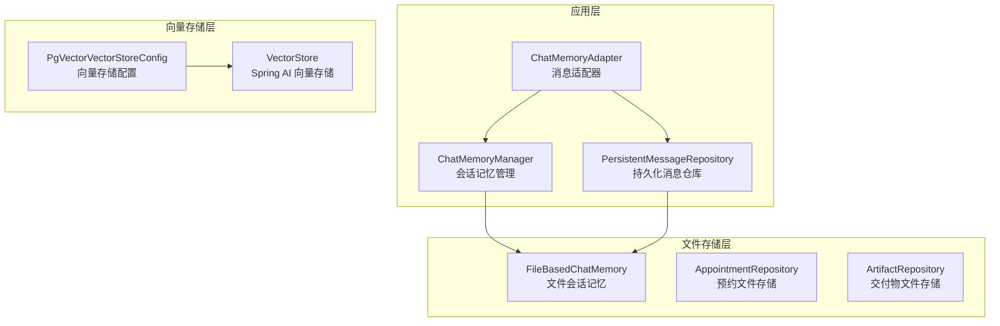
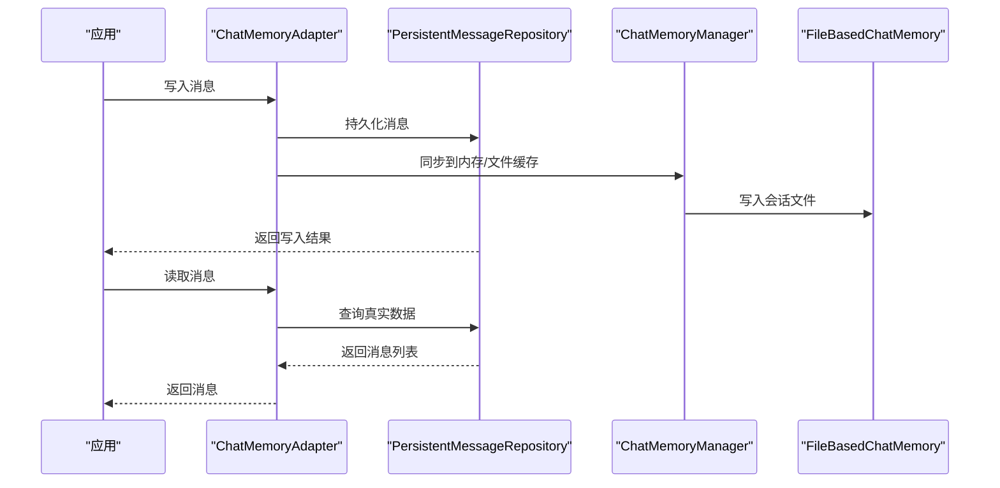
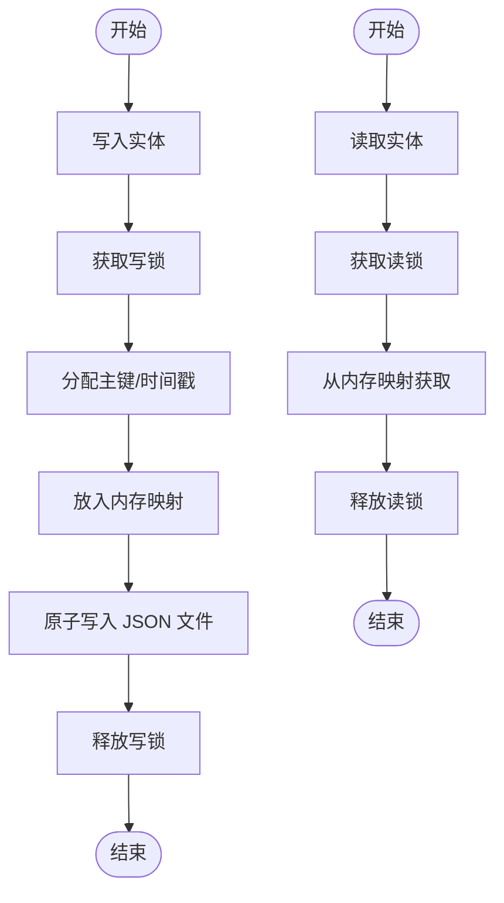
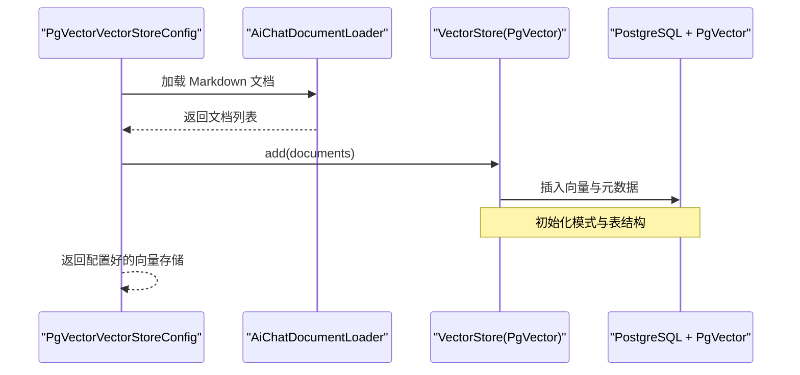
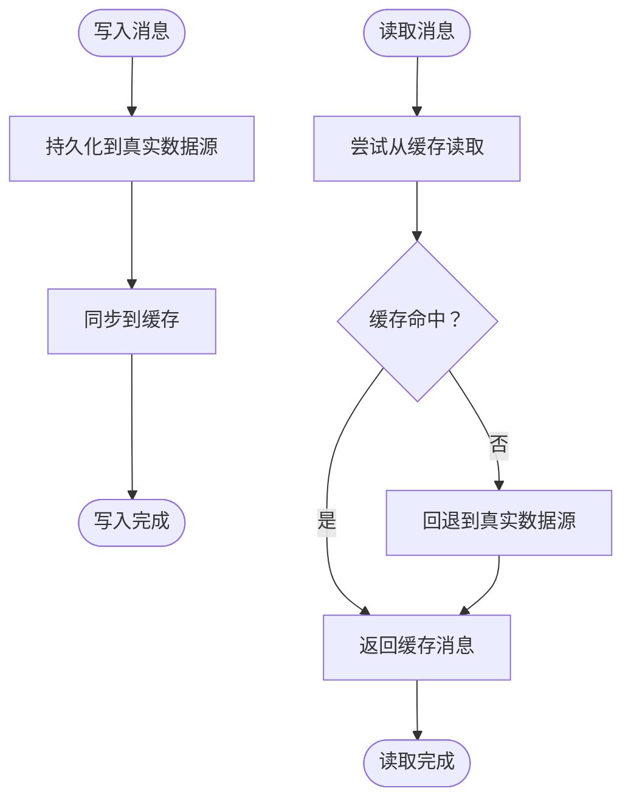
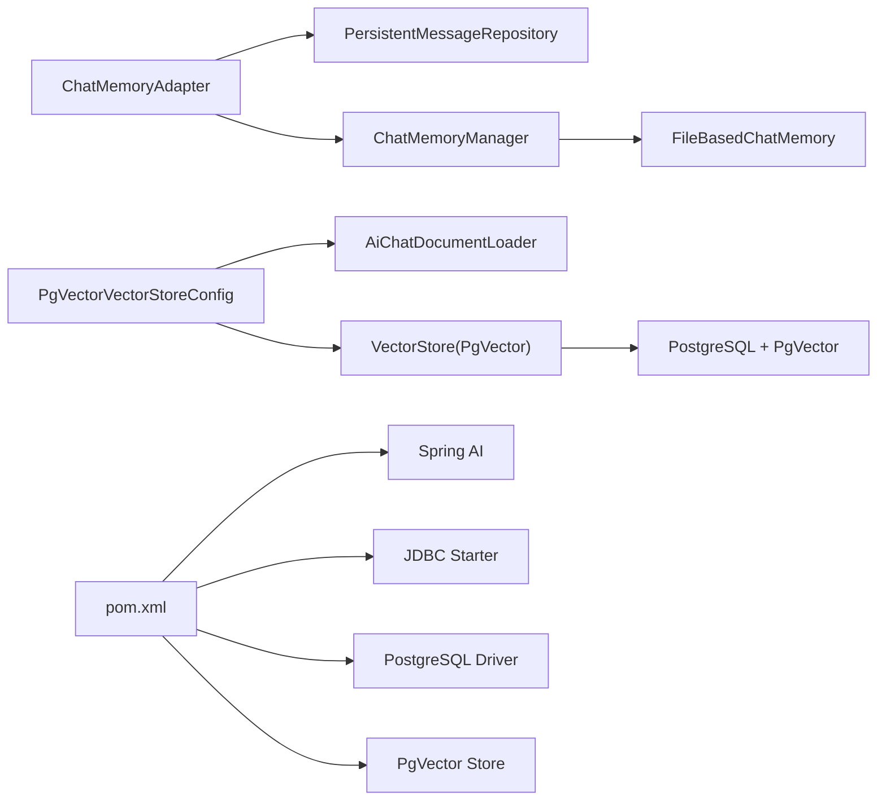

# 存储层架构

<cite>
**本文引用的文件**
- [PgVectorVectorStoreConfig.java](file://src/main/java/com/yupi/yuaiagent/rag/PgVectorVectorStoreConfig.java)
- [PgVectorVectorStoreConfigTest.java](file://src/test/java/com/yupi/yuaiagent/rag/PgVectorVectorStoreConfigTest.java)
- [pom.xml](file://pom.xml)
- [ChatMemoryManager.java](file://src/main/java/com/yupi/yuaiagent/chatmemory/ChatMemoryManager.java)
- [FileBasedChatMemory.java](file://src/main/java/com/yupi/yuaiagent/chatmemory/FileBasedChatMemory.java)
- [ChatMemoryAdapter.java](file://src/main/java/com/yupi/yuaiagent/message/ChatMemoryAdapter.java)
- [PersistentMessageRepository.java](file://src/main/java/com/yupi/yuaiagent/message/PersistentMessageRepository.java)
- [AppointmentRepository.java](file://src/main/java/com/yupi/yuaiagent/repository/AppointmentRepository.java)
- [ArtifactRepository.java](file://src/main/java/com/yupi/yuaiagent/artifact/ArtifactRepository.java)
- [architecture.html](file://docs/architecture.html)
- [design.md](file://.kiro/specs/data-employee-agents/design.md)
</cite>

## 目录
1. [简介](#简介)
2. [项目结构](#项目结构)
3. [核心组件](#核心组件)
4. [架构总览](#架构总览)
5. [详细组件分析](#详细组件分析)
6. [依赖关系分析](#依赖关系分析)
7. [性能考虑](#性能考虑)
8. [故障排查指南](#故障排查指南)
9. [结论](#结论)
10. [附录](#附录)

## 简介
本文件聚焦于本项目的存储层架构，系统性阐述文件存储（JSON 文件）、PgVector 向量存储以及与 RAG 系统的集成方式。内容涵盖数据模型、索引与查询优化、一致性与并发控制、性能优化与容量规划、备份与迁移策略，以及故障恢复方法。文档同时提供可操作的配置示例与实施建议，帮助读者快速理解并落地存储层的设计与运维。

## 项目结构
存储层由三层构成：
- 文件存储层：基于 JSON 的文件持久化，用于会话记忆、预约、交付物等实体的本地持久化。
- 关系型/嵌入式存储层：通过 JDBC 连接 PostgreSQL，并使用 PgVector 扩展实现向量检索。
- 应用适配层：消息适配器将持久化消息同步到内存/文件缓存，确保“真实数据源 + 双索引”一致。

图表来源
- [ChatMemoryManager.java:46-310](file://src/main/java/com/yupi/yuaiagent/chatmemory/ChatMemoryManager.java#L46-L310)
- [ChatMemoryAdapter.java:145-174](file://src/main/java/com/yupi/yuaiagent/message/ChatMemoryAdapter.java#L145-L174)
- [PersistentMessageRepository.java](file://src/main/java/com/yupi/yuaiagent/message/PersistentMessageRepository.java)
- [FileBasedChatMemory.java](file://src/main/java/com/yupi/yuaiagent/chatmemory/FileBasedChatMemory.java)
- [AppointmentRepository.java](file://src/main/java/com/yupi/yuaiagent/repository/AppointmentRepository.java)
- [ArtifactRepository.java](file://src/main/java/com/yupi/yuaiagent/artifact/ArtifactRepository.java)
- [PgVectorVectorStoreConfig.java:1-39](file://src/main/java/com/yupi/yuaiagent/rag/PgVectorVectorStoreConfig.java#L1-L39)

章节来源
- [architecture.html:324-327](file://docs/architecture.html#L324-L327)

## 核心组件
- 文件存储组件
  - FileBasedChatMemory：按会话 ID 维度的文件化存储，支持压缩策略与并发读写。
  - AppointmentRepository：预约实体的 JSON 文件持久化，具备并发安全与初始化加载。
  - ArtifactRepository：交付物实体的 JSON 文件持久化，具备并发安全与初始化加载。
- 消息与缓存适配
  - ChatMemoryManager：统一管理不同 Agent 类型的会话记忆，支持压缩状态查询与清理。
  - ChatMemoryAdapter：将持久化消息同步到内存/文件缓存，实现“真实数据源 + 双索引”。
  - PersistentMessageRepository：真实数据源，负责消息的增删改查。
- 向量存储组件
  - PgVectorVectorStoreConfig：基于 Spring AI 的 PgVector 集成，配置维度、距离类型、索引类型、表名、批量大小等。
  - 向量检索测试：验证相似度检索功能。

章节来源
- [ChatMemoryManager.java:46-310](file://src/main/java/com/yupi/yuaiagent/chatmemory/ChatMemoryManager.java#L46-L310)
- [FileBasedChatMemory.java](file://src/main/java/com/yupi/yuaiagent/chatmemory/FileBasedChatMemory.java)
- [ChatMemoryAdapter.java:145-174](file://src/main/java/com/yupi/yuaiagent/message/ChatMemoryAdapter.java#L145-L174)
- [PersistentMessageRepository.java](file://src/main/java/com/yupi/yuaiagent/message/PersistentMessageRepository.java)
- [AppointmentRepository.java](file://src/main/java/com/yupi/yuaiagent/repository/AppointmentRepository.java)
- [ArtifactRepository.java](file://src/main/java/com/yupi/yuaiagent/artifact/ArtifactRepository.java)
- [PgVectorVectorStoreConfig.java:1-39](file://src/main/java/com/yupi/yuaiagent/rag/PgVectorVectorStoreConfig.java#L1-L39)
- [PgVectorVectorStoreConfigTest.java:1-32](file://src/test/java/com/yupi/yuaiagent/rag/PgVectorVectorStoreConfigTest.java#L1-L32)

## 架构总览
存储层采用“真实数据源 + 双索引”的设计原则：
- 真实数据源：PersistentMessageRepository（消息）、文件系统（预约、交付物、会话记忆）。
- 双索引：内存/文件缓存（ChatMemoryManager/FileBasedChatMemory）+ PgVector 向量索引。
- 一致性保障：消息写入后通过 ChatMemoryAdapter 同步到缓存；文件存储通过读写锁与原子落盘保证并发安全。

图表来源
- [ChatMemoryAdapter.java:145-174](file://src/main/java/com/yupi/yuaiagent/message/ChatMemoryAdapter.java#L145-L174)
- [PersistentMessageRepository.java](file://src/main/java/com/yupi/yuaiagent/message/PersistentMessageRepository.java)
- [ChatMemoryManager.java:46-310](file://src/main/java/com/yupi/yuaiagent/chatmemory/ChatMemoryManager.java#L46-L310)
- [FileBasedChatMemory.java](file://src/main/java/com/yupi/yuaiagent/chatmemory/FileBasedChatMemory.java)

## 详细组件分析

### 文件存储系统（JSON 文件）
- 组织结构
  - 会话记忆：按 Agent 类型分目录，每个会话一个文件，支持压缩策略与状态查询。
  - 预约与交付物：独立目录，文件名为 JSON，对象包含主键、时间戳、状态等字段。
- 数据结构设计
  - 通用字段：主键、创建时间、更新时间；特定实体包含业务字段（如联系人、主题、状态）。
  - 并发控制：读写锁保护内存映射，写入时加写锁，读取时加读锁；落盘采用原子写。
  - 初始化策略：@PostConstruct 加载目录中的现有 JSON，异常仅记录日志，不中断启动。
- 索引策略与查询优化
  - 内存映射：ConcurrentHashMap 提供 O(1) 级别的查找；读写分离降低锁竞争。
  - 文件级索引：按会话 ID 分片，避免单文件过大；支持增量更新与快照导出。
  - 压缩策略：TokenCompressionStrategy/TurnCompressionStrategy 在写入前进行压缩，减少 IO 与存储占用。
- 一致性与事务
  - 单文件写入：采用一次性写入新 JSON，再重命名覆盖，避免部分写入导致损坏。
  - 多实例一致性：通过二次加载校验，确保序列化/反序列化前后字段一致。
- 典型流程（保存与读取）

图表来源
- [FileBasedChatMemory.java](file://src/main/java/com/yupi/yuaiagent/chatmemory/FileBasedChatMemory.java)
- [AppointmentRepository.java](file://src/main/java/com/yupi/yuaiagent/repository/AppointmentRepository.java)
- [ArtifactRepository.java](file://src/main/java/com/yupi/yuaiagent/artifact/ArtifactRepository.java)

章节来源
- [ChatMemoryManager.java:46-310](file://src/main/java/com/yupi/yuaiagent/chatmemory/ChatMemoryManager.java#L46-L310)
- [FileBasedChatMemory.java](file://src/main/java/com/yupi/yuaiagent/chatmemory/FileBasedChatMemory.java)
- [AppointmentRepository.java](file://src/main/java/com/yupi/yuaiagent/repository/AppointmentRepository.java)
- [ArtifactRepository.java](file://src/main/java/com/yupi/yuaiagent/artifact/ArtifactRepository.java)
- [design.md:244-318](file://.kiro/specs/data-employee-agents/design.md#L244-L318)

### PgVector 向量存储
- 配置要点
  - 维度：1536（与嵌入模型匹配）
  - 距离类型：余弦距离（COSINE_DISTANCE）
  - 索引类型：HNSW（近似最近邻）
  - 模式与表名：public.schema + vector_store 表
  - 批量大小：10000
  - 初始化：initializeSchema(true)，首次运行自动建表
- 集成方式
  - 通过 Spring AI 的 PgVectorStore 构建器装配 JdbcTemplate 与 EmbeddingModel。
  - 文档加载：AiChatDocumentLoader.loadMarkdowns() 读取 Markdown 文档，批量添加到向量库。
  - 查询：SimilaritySearch 支持 topK 检索，结合元数据过滤。
- 性能与优化
  - HNSW 参数调优：M、efConstruction、efSearch 影响召回与延迟。
  - 批量写入：合理设置 maxDocumentBatchSize，平衡内存与吞吐。
  - 索引维护：定期重建或刷新，保持高召回率。
- 测试验证
  - 单元测试验证 add 与 similaritySearch 的可用性与返回非空。

图表来源
- [PgVectorVectorStoreConfig.java:1-39](file://src/main/java/com/yupi/yuaiagent/rag/PgVectorVectorStoreConfig.java#L1-L39)
- [pom.xml:75-94](file://pom.xml#L75-L94)

章节来源
- [PgVectorVectorStoreConfig.java:1-39](file://src/main/java/com/yupi/yuaiagent/rag/PgVectorVectorStoreConfig.java#L1-L39)
- [PgVectorVectorStoreConfigTest.java:1-32](file://src/test/java/com/yupi/yuaiagent/rag/PgVectorVectorStoreConfigTest.java#L1-L32)
- [pom.xml:75-94](file://pom.xml#L75-L94)

### 消息与缓存适配（真实数据源 + 双索引）
- 设计目标
  - 真实数据源：PersistentMessageRepository，保证最终一致与可审计。
  - 缓存索引：ChatMemoryManager/FileBasedChatMemory，加速高频读取。
  - 同步策略：写入后同步到缓存；读取失败回退到真实数据源。
- 并发与一致性
  - 读写锁：文件存储层使用读写锁隔离并发；内存映射层使用线程安全容器。
  - 原子落盘：写入采用一次性写入 + 重命名，避免部分写入。
  - 回退机制：缓存读取异常时，从真实数据源重建消息列表。
- 压缩与状态
  - 压缩状态查询：对外暴露压缩状态，包含压缩次数、最近压缩时间、错误信息等。
  - 清理策略：支持按 Agent 类型或全局清理，释放内存与磁盘空间。

图表来源
- [ChatMemoryAdapter.java:145-174](file://src/main/java/com/yupi/yuaiagent/message/ChatMemoryAdapter.java#L145-L174)
- [PersistentMessageRepository.java](file://src/main/java/com/yupi/yuaiagent/message/PersistentMessageRepository.java)
- [ChatMemoryManager.java:46-310](file://src/main/java/com/yupi/yuaiagent/chatmemory/ChatMemoryManager.java#L46-L310)

章节来源
- [ChatMemoryAdapter.java:145-174](file://src/main/java/com/yupi/yuaiagent/message/ChatMemoryAdapter.java#L145-L174)
- [PersistentMessageRepository.java](file://src/main/java/com/yupi/yuaiagent/message/PersistentMessageRepository.java)
- [ChatMemoryManager.java:46-310](file://src/main/java/com/yupi/yuaiagent/chatmemory/ChatMemoryManager.java#L46-L310)

## 依赖关系分析
- 外部依赖
  - Spring AI + PgVector Store：提供向量存储能力与嵌入模型集成。
  - Spring Boot Starter JDBC + PostgreSQL Driver：提供数据库连接与驱动。
- 内部耦合
  - ChatMemoryAdapter 依赖 PersistentMessageRepository 与 ChatMemoryManager。
  - PgVectorVectorStoreConfig 依赖 AiChatDocumentLoader 与 EmbeddingModel/JdbcTemplate。
  - 文件存储组件（AppointmentRepository、ArtifactRepository、FileBasedChatMemory）彼此独立，均遵循相同的并发与落盘策略。

图表来源
- [ChatMemoryAdapter.java:145-174](file://src/main/java/com/yupi/yuaiagent/message/ChatMemoryAdapter.java#L145-L174)
- [PersistentMessageRepository.java](file://src/main/java/com/yupi/yuaiagent/message/PersistentMessageRepository.java)
- [ChatMemoryManager.java:46-310](file://src/main/java/com/yupi/yuaiagent/chatmemory/ChatMemoryManager.java#L46-L310)
- [FileBasedChatMemory.java](file://src/main/java/com/yupi/yuaiagent/chatmemory/FileBasedChatMemory.java)
- [PgVectorVectorStoreConfig.java:1-39](file://src/main/java/com/yupi/yuaiagent/rag/PgVectorVectorStoreConfig.java#L1-L39)
- [pom.xml:75-94](file://pom.xml#L75-L94)

章节来源
- [pom.xml:75-94](file://pom.xml#L75-L94)

## 性能考虑
- 文件存储
  - I/O 优化：批量写入、原子替换、分片存储（按会话 ID），降低单文件大小。
  - 并发优化：读写锁分离、内存映射、快照读取，减少锁持有时间。
  - 压缩策略：在写入阶段进行压缩，显著降低存储与网络传输成本。
- 向量检索
  - HNSW 参数：根据数据规模与延迟要求调整 M、efConstruction、efSearch。
  - 批量写入：合理设置批量大小，避免内存峰值过高。
  - 查询优化：topK 与元数据过滤结合，减少无效扫描。
- 缓存与回退
  - 缓存命中优先，异常回退真实数据源，确保一致性与可用性。
  - 定期清理过期会话与压缩状态，避免内存与磁盘膨胀。

## 故障排查指南
- 文件存储类问题
  - 写入失败：检查存储目录权限与磁盘空间；确认原子写入是否被中断。
  - 读取为空：确认初始化是否成功加载 JSON；检查异常日志。
  - 并发冲突：核对读写锁使用是否正确；避免跨线程共享未加锁的内存映射。
- 向量存储类问题
  - 初始化失败：确认数据库连接、PgVector 扩展安装与权限；检查 initializeSchema 配置。
  - 查询无结果：核对嵌入维度、距离类型与索引类型；检查文档是否成功入库。
- 消息同步类问题
  - 缓存读取异常：检查 ChatMemoryAdapter 的回退逻辑是否生效；核对 Agent 类型与会话 ID 映射。
  - 数据不一致：确认写入后是否及时同步到缓存；必要时触发重建流程。

章节来源
- [ChatMemoryAdapter.java:145-174](file://src/main/java/com/yupi/yuaiagent/message/ChatMemoryAdapter.java#L145-L174)
- [PgVectorVectorStoreConfig.java:1-39](file://src/main/java/com/yupi/yuaiagent/rag/PgVectorVectorStoreConfig.java#L1-L39)

## 结论
本项目的存储层通过“真实数据源 + 双索引”的设计，在保证数据一致性的同时兼顾了性能与可维护性。文件存储层提供轻量、可移植的持久化能力；PgVector 向量存储为 RAG 场景提供高效的相似度检索；消息适配器确保缓存与真实数据的一致性与可用性。配合合理的并发控制、压缩策略与参数调优，可在中小规模场景下实现稳定、高效的数据服务。

## 附录
- 配置示例（路径参考）
  - 向量存储配置：[PgVectorVectorStoreConfig.java:1-39](file://src/main/java/com/yupi/yuaiagent/rag/PgVectorVectorStoreConfig.java#L1-L39)
  - 依赖声明：[pom.xml:75-94](file://pom.xml#L75-L94)
- 数据迁移方案
  - 文件存储迁移：导出 JSON → 修改存储目录 → 导入新目录；校验主键与时间戳一致性。
  - 向量存储迁移：备份旧表 → 新建表结构 → 批量导入向量与元数据 → 切换引用。
- 备份策略
  - 文件存储：定期归档存储目录；对关键会话进行快照备份。
  - 向量存储：数据库层面的逻辑/物理备份；定期校验向量完整性。
- 故障恢复
  - 文件存储：回滚到最近一次原子写入；重建内存映射。
  - 向量存储：回滚到上次成功初始化状态；重新构建索引。