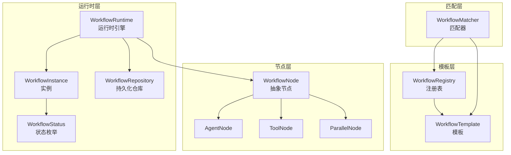
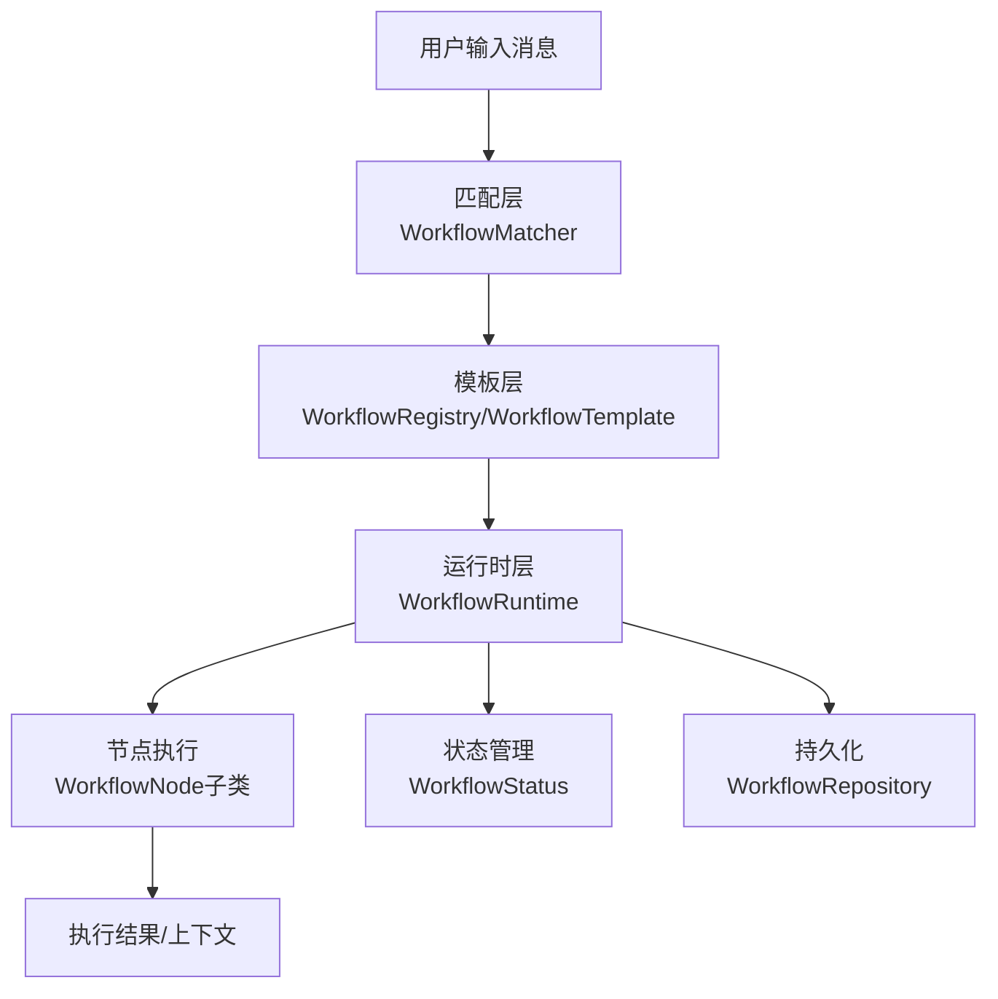
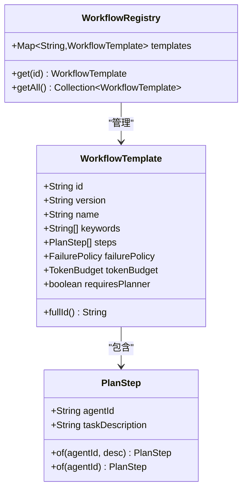
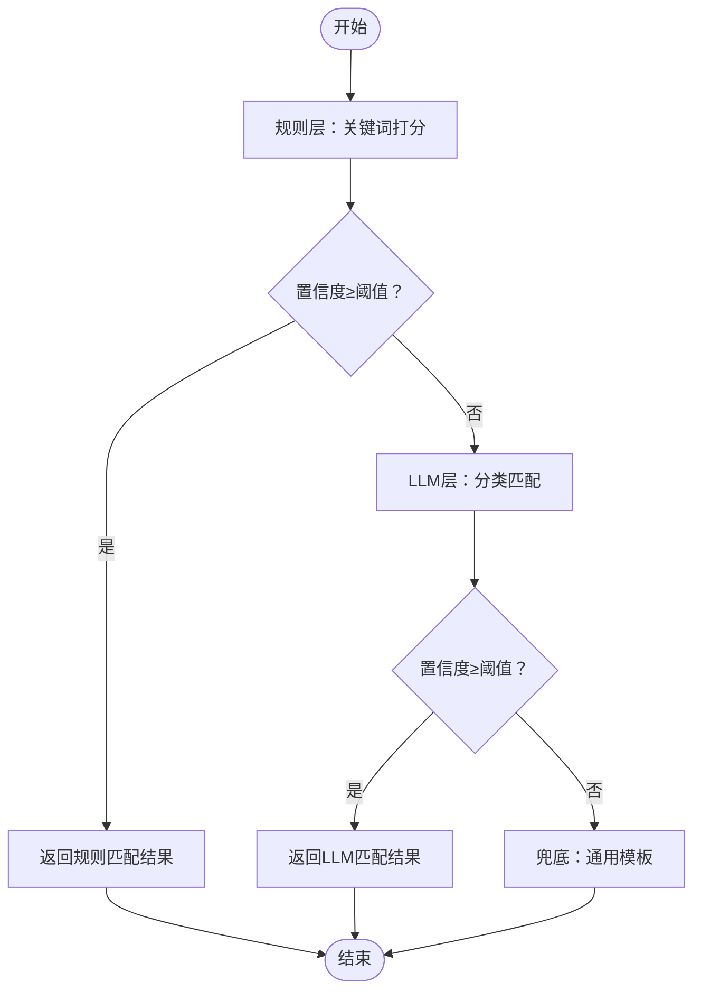
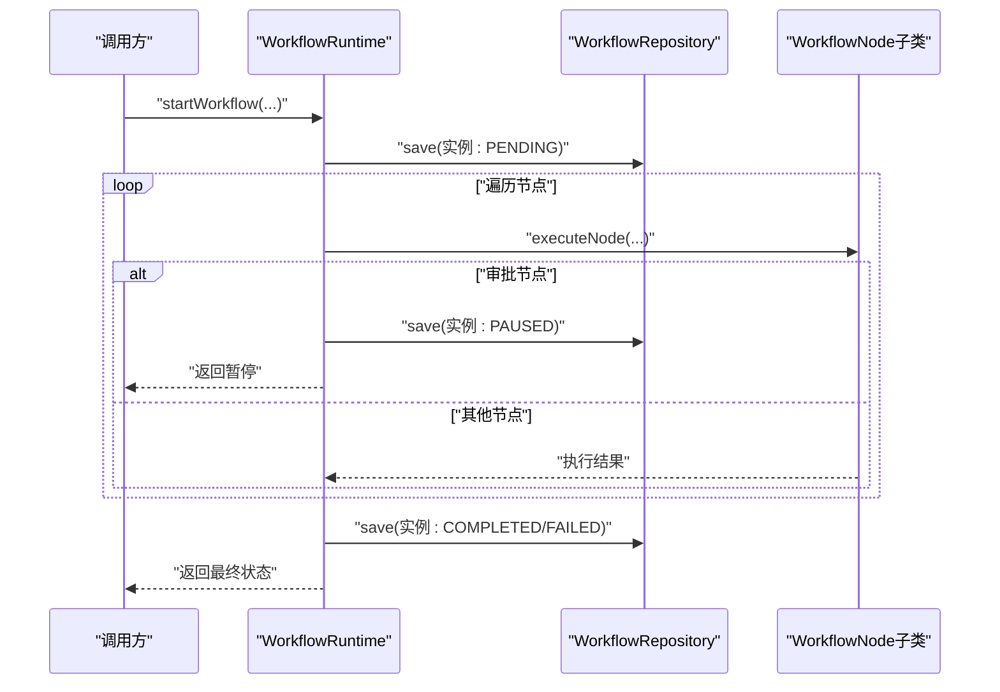
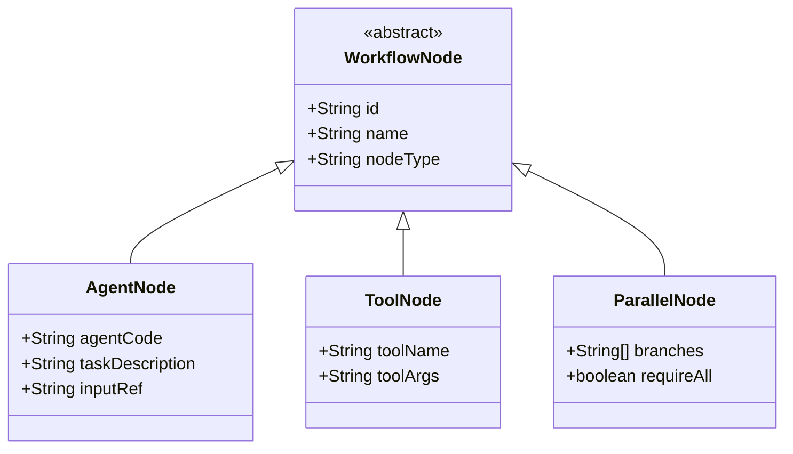
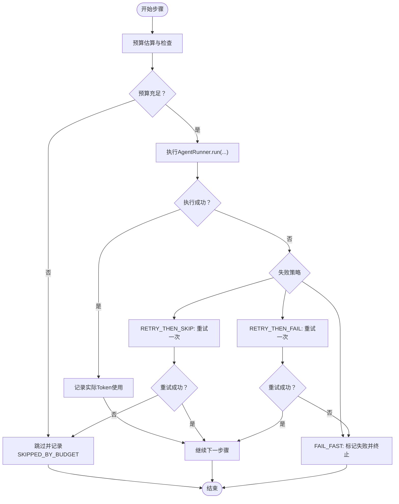
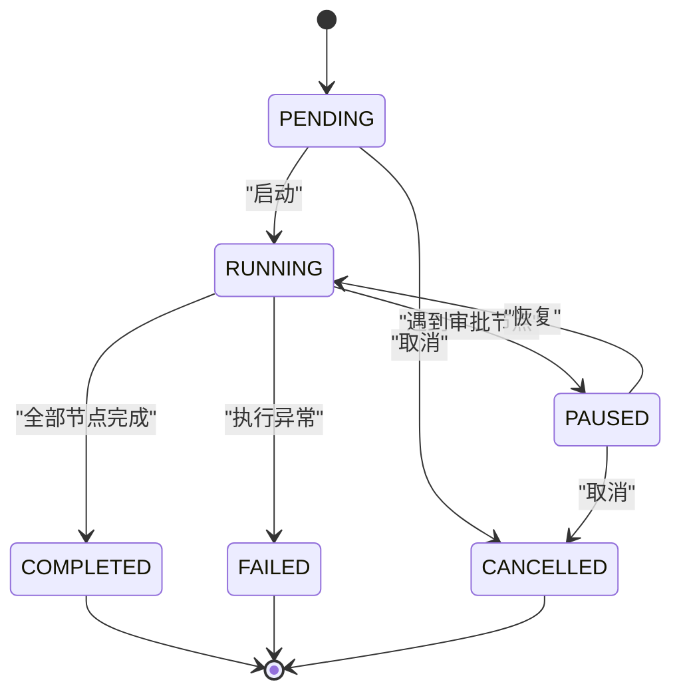
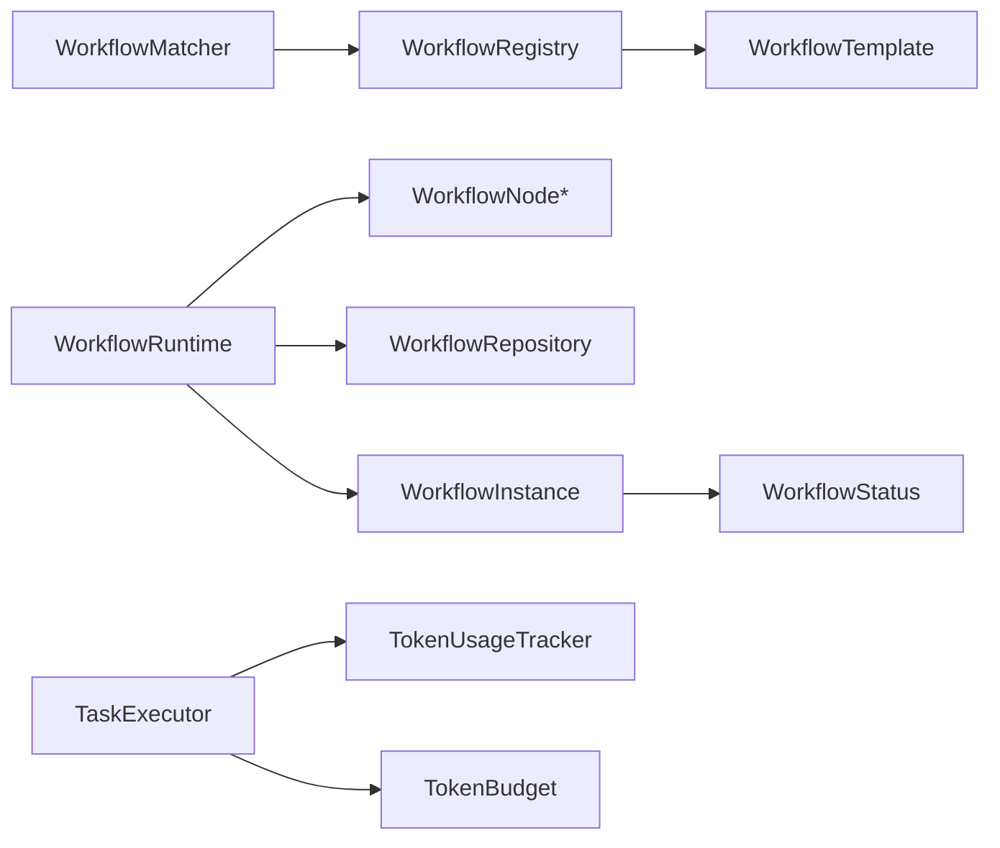

# 工作流引擎架构

<cite>
**本文引用的文件**
- [WorkflowMatcher.java](file://src/main/java/com/yupi/yuaiagent/workflow/WorkflowMatcher.java)
- [WorkflowRegistry.java](file://src/main/java/com/yupi/yuaiagent/workflow/WorkflowRegistry.java)
- [WorkflowTemplate.java](file://src/main/java/com/yupi/yuaiagent/workflow/WorkflowTemplate.java)
- [WorkflowMatchResult.java](file://src/main/java/com/yupi/yuaiagent/workflow/WorkflowMatchResult.java)
- [WorkflowNode.java](file://src/main/java/com/yupi/yuaiagent/workflow/node/WorkflowNode.java)
- [AgentNode.java](file://src/main/java/com/yupi/yuaiagent/workflow/node/AgentNode.java)
- [ToolNode.java](file://src/main/java/com/yupi/yuaiagent/workflow/node/ToolNode.java)
- [ParallelNode.java](file://src/main/java/com/yupi/yuaiagent/workflow/node/ParallelNode.java)
- [WorkflowRuntime.java](file://src/main/java/com/yupi/yuaiagent/workflow/runtime/WorkflowRuntime.java)
- [WorkflowInstance.java](file://src/main/java/com/yupi/yuaiagent/workflow/runtime/WorkflowInstance.java)
- [WorkflowStatus.java](file://src/main/java/com/yupi/yuaiagent/workflow/runtime/WorkflowStatus.java)
- [WorkflowRepository.java](file://src/main/java/com/yupi/yuaiagent/workflow/runtime/WorkflowRepository.java)
- [TaskExecutor.java](file://src/main/java/com/yupi/yuaiagent/agent/TaskExecutor.java)
- [RuntimeContext.java](file://src/main/java/com/yupi/yuaiagent/context/RuntimeContext.java)
- [TokenUsageTracker.java](file://src/main/java/com/yupi/yuaiagent/budget/TokenUsageTracker.java)
- [TokenBudget.java](file://src/main/java/com/yupi/yuaiagent/budget/TokenBudget.java)
- [multi-agent-runtime-architecture.md](file://docs/multi-agent-runtime-architecture.md)
</cite>

## 目录
1. [简介](#简介)
2. [项目结构](#项目结构)
3. [核心组件](#核心组件)
4. [架构总览](#架构总览)
5. [详细组件分析](#详细组件分析)
6. [依赖关系分析](#依赖关系分析)
7. [性能考量](#性能考量)
8. [故障排除指南](#故障排除指南)
9. [结论](#结论)
10. [附录](#附录)

## 简介
本技术文档系统性阐述工作流引擎的架构设计与实现，覆盖工作流模板设计原理、多层匹配算法、执行引擎架构、节点类型设计模式与实现机制、任务执行器的调度与失败处理策略、预算控制机制、实例状态管理与持久化、并发控制，以及模板开发指南、性能优化技巧与故障排除方法。文档面向工程实践，既适合开发者深入理解代码实现，也便于产品与运营人员把握整体流程。

## 项目结构
工作流引擎位于后端模块的 workflow 子包中，采用“模板-匹配-运行时-节点”分层组织：
- 模板层：定义工作流模板与计划步骤，包含关键词、失败策略、预算与是否需要规划器等元信息。
- 匹配层：基于关键词打分与LLM分类的两层匹配，输出最高置信度工作流与类型。
- 运行时层：负责实例生命周期管理、节点执行、状态流转与持久化。
- 节点层：抽象节点类型，支持代理节点、工具节点、条件节点、并行节点、循环节点与审批节点。

图表来源
- [WorkflowRegistry.java:689-751](file://src/main/java/com/yupi/yuaiagent/workflow/WorkflowRegistry.java#L689-L751)
- [WorkflowTemplate.java:755-779](file://src/main/java/com/yupi/yuaiagent/workflow/WorkflowTemplate.java#L755-L779)
- [WorkflowMatcher.java:584-656](file://src/main/java/com/yupi/yuaiagent/workflow/WorkflowMatcher.java#L584-L656)
- [WorkflowRuntime.java:23-171](file://src/main/java/com/yupi/yuaiagent/workflow/runtime/WorkflowRuntime.java#L23-L171)
- [WorkflowInstance.java:18-57](file://src/main/java/com/yupi/yuaiagent/workflow/runtime/WorkflowInstance.java#L18-L57)
- [WorkflowStatus.java:8-23](file://src/main/java/com/yupi/yuaiagent/workflow/runtime/WorkflowStatus.java#L8-L23)
- [WorkflowRepository.java:25-43](file://src/main/java/com/yupi/yuaiagent/workflow/runtime/WorkflowRepository.java#L25-L43)
- [WorkflowNode.java:21-29](file://src/main/java/com/yupi/yuaiagent/workflow/node/WorkflowNode.java#L21-L29)
- [AgentNode.java:8-31](file://src/main/java/com/yupi/yuaiagent/workflow/node/AgentNode.java#L8-L31)
- [ToolNode.java:8-26](file://src/main/java/com/yupi/yuaiagent/workflow/node/ToolNode.java#L8-L26)
- [ParallelNode.java:10-28](file://src/main/java/com/yupi/yuaiagent/workflow/node/ParallelNode.java#L10-L28)

章节来源
- [WorkflowRegistry.java:689-751](file://src/main/java/com/yupi/yuaiagent/workflow/WorkflowRegistry.java#L689-L751)
- [WorkflowTemplate.java:755-779](file://src/main/java/com/yupi/yuaiagent/workflow/WorkflowTemplate.java#L755-L779)
- [WorkflowMatcher.java:584-656](file://src/main/java/com/yupi/yuaiagent/workflow/WorkflowMatcher.java#L584-L656)
- [WorkflowRuntime.java:23-171](file://src/main/java/com/yupi/yuaiagent/workflow/runtime/WorkflowRuntime.java#L23-L171)
- [WorkflowInstance.java:18-57](file://src/main/java/com/yupi/yuaiagent/workflow/runtime/WorkflowInstance.java#L18-L57)
- [WorkflowStatus.java:8-23](file://src/main/java/com/yupi/yuaiagent/workflow/runtime/WorkflowStatus.java#L8-L23)
- [WorkflowRepository.java:25-43](file://src/main/java/com/yupi/yuaiagent/workflow/runtime/WorkflowRepository.java#L25-L43)
- [WorkflowNode.java:21-29](file://src/main/java/com/yupi/yuaiagent/workflow/node/WorkflowNode.java#L21-L29)
- [AgentNode.java:8-31](file://src/main/java/com/yupi/yuaiagent/workflow/node/AgentNode.java#L8-L31)
- [ToolNode.java:8-26](file://src/main/java/com/yupi/yuaiagent/workflow/node/ToolNode.java#L8-L26)
- [ParallelNode.java:10-28](file://src/main/java/com/yupi/yuaiagent/workflow/node/ParallelNode.java#L10-L28)

## 核心组件
- 工作流模板与注册表：以模板记录工作流元信息（关键词、步骤序列、失败策略、预算、是否需要规划器），注册表集中管理模板集合。
- 匹配器：两层匹配（规则打分与LLM分类），输出最高置信度匹配结果与类型。
- 运行时引擎：负责实例创建、节点顺序执行、状态推进、暂停与恢复、持久化保存。
- 节点体系：抽象节点基类与多种具体节点类型，支持代理委托、工具调用、条件分支、并行执行、循环与审批。
- 执行器与预算：在步骤级进行预算预估与使用记录，结合失败策略进行重试或跳过/失败。
- 实例与持久化：实例对象承载上下文、历史与状态，仓库负责文件存储与并发读写控制。

章节来源
- [WorkflowRegistry.java:689-751](file://src/main/java/com/yupi/yuaiagent/workflow/WorkflowRegistry.java#L689-L751)
- [WorkflowTemplate.java:755-779](file://src/main/java/com/yupi/yuaiagent/workflow/WorkflowTemplate.java#L755-L779)
- [WorkflowMatcher.java:584-656](file://src/main/java/com/yupi/yuaiagent/workflow/WorkflowMatcher.java#L584-L656)
- [WorkflowRuntime.java:23-171](file://src/main/java/com/yupi/yuaiagent/workflow/runtime/WorkflowRuntime.java#L23-L171)
- [WorkflowNode.java:21-29](file://src/main/java/com/yupi/yuaiagent/workflow/node/WorkflowNode.java#L21-L29)
- [TaskExecutor.java:95-110](file://src/main/java/com/yupi/yuaiagent/agent/TaskExecutor.java#L95-L110)
- [TokenUsageTracker.java](file://src/main/java/com/yupi/yuaiagent/budget/TokenUsageTracker.java)
- [TokenBudget.java](file://src/main/java/com/yupi/yuaiagent/budget/TokenBudget.java)
- [WorkflowInstance.java:18-57](file://src/main/java/com/yupi/yuaiagent/workflow/runtime/WorkflowInstance.java#L18-L57)
- [WorkflowRepository.java:25-43](file://src/main/java/com/yupi/yuaiagent/workflow/runtime/WorkflowRepository.java#L25-L43)

## 架构总览
工作流引擎采用“模板-匹配-运行时”的三层架构。模板层提供规则与元信息；匹配层根据输入消息选择最合适的模板；运行时层按节点图顺序执行，支持暂停与恢复，并通过仓库持久化实例状态。

图表来源
- [WorkflowMatcher.java:584-656](file://src/main/java/com/yupi/yuaiagent/workflow/WorkflowMatcher.java#L584-L656)
- [WorkflowRegistry.java:689-751](file://src/main/java/com/yupi/yuaiagent/workflow/WorkflowRegistry.java#L689-L751)
- [WorkflowTemplate.java:755-779](file://src/main/java/com/yupi/yuaiagent/workflow/WorkflowTemplate.java#L755-L779)
- [WorkflowRuntime.java:23-171](file://src/main/java/com/yupi/yuaiagent/workflow/runtime/WorkflowRuntime.java#L23-L171)
- [WorkflowStatus.java:8-23](file://src/main/java/com/yupi/yuaiagent/workflow/runtime/WorkflowStatus.java#L8-L23)
- [WorkflowRepository.java:25-43](file://src/main/java/com/yupi/yuaiagent/workflow/runtime/WorkflowRepository.java#L25-L43)
- [WorkflowNode.java:21-29](file://src/main/java/com/yupi/yuaiagent/workflow/node/WorkflowNode.java#L21-L29)

## 详细组件分析

### 工作流模板与注册表
- 模板字段：包含标识、版本、名称、关键词、步骤序列、失败策略、Token预算、是否需要规划器等。
- 注册表职责：集中维护模板映射，提供查询接口；内置若干示例模板（如跳槽准备、面试准备、咨询预约、通用职场）。
- 版本标识：完整ID由模板ID与版本拼接而成，便于演进追踪。

图表来源
- [WorkflowTemplate.java:755-779](file://src/main/java/com/yupi/yuaiagent/workflow/WorkflowTemplate.java#L755-L779)
- [WorkflowRegistry.java:689-751](file://src/main/java/com/yupi/yuaiagent/workflow/WorkflowRegistry.java#L689-L751)

章节来源
- [WorkflowTemplate.java:755-779](file://src/main/java/com/yupi/yuaiagent/workflow/WorkflowTemplate.java#L755-L779)
- [WorkflowRegistry.java:689-751](file://src/main/java/com/yupi/yuaiagent/workflow/WorkflowRegistry.java#L689-L751)

### 匹配算法（两层匹配）
- 第一层：基于关键词的打分匹配。对每个模板统计命中关键词数量，归一化得到置信度；若最高置信度达到阈值，则直接返回。
- 第二层：LLM分类匹配。当规则层无法确定时，使用提示词驱动的LLM进行分类，解析结果并返回。
- 第三层：兜底匹配。若仍无法判定，返回通用模板。

图表来源
- [WorkflowMatcher.java:584-656](file://src/main/java/com/yupi/yuaiagent/workflow/WorkflowMatcher.java#L584-L656)

章节来源
- [WorkflowMatcher.java:584-656](file://src/main/java/com/yupi/yuaiagent/workflow/WorkflowMatcher.java#L584-L656)

### 运行时引擎与实例管理
- 实例创建：生成唯一实例ID，复制初始上下文，设置状态为PENDING。
- 节点执行：按序遍历节点，根据节点类型分派到对应执行器；遇到审批节点则暂停并持久化。
- 状态推进：RUNNING状态下全部节点完成后置为COMPLETED；异常时置为FAILED；支持CANCELLED。
- 持久化：实例状态与上下文变更均写入仓库，采用读写锁保证并发安全。

图表来源
- [WorkflowRuntime.java:31-156](file://src/main/java/com/yupi/yuaiagent/workflow/runtime/WorkflowRuntime.java#L31-L156)
- [WorkflowRepository.java:25-43](file://src/main/java/com/yupi/yuaiagent/workflow/runtime/WorkflowRepository.java#L25-L43)
- [WorkflowInstance.java:18-57](file://src/main/java/com/yupi/yuaiagent/workflow/runtime/WorkflowInstance.java#L18-L57)
- [WorkflowStatus.java:8-23](file://src/main/java/com/yupi/yuaiagent/workflow/runtime/WorkflowStatus.java#L8-L23)

章节来源
- [WorkflowRuntime.java:31-156](file://src/main/java/com/yupi/yuaiagent/workflow/runtime/WorkflowRuntime.java#L31-L156)
- [WorkflowRepository.java:25-43](file://src/main/java/com/yupi/yuaiagent/workflow/runtime/WorkflowRepository.java#L25-L43)
- [WorkflowInstance.java:18-57](file://src/main/java/com/yupi/yuaiagent/workflow/runtime/WorkflowInstance.java#L18-L57)
- [WorkflowStatus.java:8-23](file://src/main/java/com/yupi/yuaiagent/workflow/runtime/WorkflowStatus.java#L8-L23)

### 节点类型设计与实现机制
- 抽象基类：统一节点标识与类型分发，支持Jackson多态反序列化。
- 代理节点（AgentNode）：委托给指定Agent执行，记录最近执行的Agent与任务描述。
- 工具节点（ToolNode）：直接调用指定工具，记录最近工具名。
- 并行节点（ParallelNode）：并行执行多个子节点，等待全部完成或按策略处理部分失败。

图表来源
- [WorkflowNode.java:21-29](file://src/main/java/com/yupi/yuaiagent/workflow/node/WorkflowNode.java#L21-L29)
- [AgentNode.java:8-31](file://src/main/java/com/yupi/yuaiagent/workflow/node/AgentNode.java#L8-L31)
- [ToolNode.java:8-26](file://src/main/java/com/yupi/yuaiagent/workflow/node/ToolNode.java#L8-L26)
- [ParallelNode.java:10-28](file://src/main/java/com/yupi/yuaiagent/workflow/node/ParallelNode.java#L10-L28)

章节来源
- [WorkflowNode.java:21-29](file://src/main/java/com/yupi/yuaiagent/workflow/node/WorkflowNode.java#L21-L29)
- [AgentNode.java:8-31](file://src/main/java/com/yupi/yuaiagent/workflow/node/AgentNode.java#L8-L31)
- [ToolNode.java:8-26](file://src/main/java/com/yupi/yuaiagent/workflow/node/ToolNode.java#L8-L26)
- [ParallelNode.java:10-28](file://src/main/java/com/yupi/yuaiagent/workflow/node/ParallelNode.java#L10-L28)

### 任务执行器与失败处理策略
- 步骤级预算控制：在执行前估算Token用量，结合当前聊天会话预算判断是否允许继续；不足则跳过该步骤并记录。
- 执行与计费：成功后记录实际Token使用；失败时依据失败策略进行处理：
  - FAIL_FAST：立即失败并终止后续步骤；
  - RETRY_THEN_SKIP：重试一次，成功则继续，失败则跳过；
  - RETRY_THEN_FAIL：重试一次，成功则继续，失败则标记失败。
- 结果聚合：将每步结果加入运行时上下文，供后续步骤引用。

图表来源
- [TaskExecutor.java:95-110](file://src/main/java/com/yupi/yuaiagent/agent/TaskExecutor.java#L95-L110)
- [TokenUsageTracker.java](file://src/main/java/com/yupi/yuaiagent/budget/TokenUsageTracker.java)
- [TokenBudget.java](file://src/main/java/com/yupi/yuaiagent/budget/TokenBudget.java)

章节来源
- [TaskExecutor.java:95-110](file://src/main/java/com/yupi/yuaiagent/agent/TaskExecutor.java#L95-L110)
- [TokenUsageTracker.java](file://src/main/java/com/yupi/yuaiagent/budget/TokenUsageTracker.java)
- [TokenBudget.java](file://src/main/java/com/yupi/yuaiagent/budget/TokenBudget.java)

### 实例状态管理、持久化与并发控制
- 状态枚举：PENDING、RUNNING、PAUSED、COMPLETED、FAILED、CANCELLED，清晰表达实例生命周期。
- 实例模型：包含实例ID、模板ID、当前节点索引、状态、节点列表、上下文、执行历史、创建/更新时间、触发用户与会话ID。
- 持久化策略：V1采用文件存储，目录可配置；使用读写锁协调并发读写，避免竞态。
- 并发控制：仓库内部使用线程安全容器与锁，确保实例状态一致性。

图表来源
- [WorkflowStatus.java:8-23](file://src/main/java/com/yupi/yuaiagent/workflow/runtime/WorkflowStatus.java#L8-L23)
- [WorkflowInstance.java:18-57](file://src/main/java/com/yupi/yuaiagent/workflow/runtime/WorkflowInstance.java#L18-L57)
- [WorkflowRepository.java:25-43](file://src/main/java/com/yupi/yuaiagent/workflow/runtime/WorkflowRepository.java#L25-L43)

章节来源
- [WorkflowStatus.java:8-23](file://src/main/java/com/yupi/yuaiagent/workflow/runtime/WorkflowStatus.java#L8-L23)
- [WorkflowInstance.java:18-57](file://src/main/java/com/yupi/yuaiagent/workflow/runtime/WorkflowInstance.java#L18-L57)
- [WorkflowRepository.java:25-43](file://src/main/java/com/yupi/yuaiagent/workflow/runtime/WorkflowRepository.java#L25-L43)

## 依赖关系分析
- 模板与匹配：匹配器依赖注册表与模板；注册表内含模板集合。
- 运行时与节点：运行时根据节点类型分派执行；节点继承自抽象基类。
- 执行与预算：执行器依赖预算跟踪器与Token预算；运行时与执行器共同决定实例状态与持久化时机。
- 实例与仓库：运行时持有仓库引用，负责保存实例状态与上下文。

图表来源
- [WorkflowMatcher.java:584-656](file://src/main/java/com/yupi/yuaiagent/workflow/WorkflowMatcher.java#L584-L656)
- [WorkflowRegistry.java:689-751](file://src/main/java/com/yupi/yuaiagent/workflow/WorkflowRegistry.java#L689-L751)
- [WorkflowTemplate.java:755-779](file://src/main/java/com/yupi/yuaiagent/workflow/WorkflowTemplate.java#L755-L779)
- [WorkflowRuntime.java:23-171](file://src/main/java/com/yupi/yuaiagent/workflow/runtime/WorkflowRuntime.java#L23-L171)
- [WorkflowRepository.java:25-43](file://src/main/java/com/yupi/yuaiagent/workflow/runtime/WorkflowRepository.java#L25-L43)
- [WorkflowInstance.java:18-57](file://src/main/java/com/yupi/yuaiagent/workflow/runtime/WorkflowInstance.java#L18-L57)
- [WorkflowStatus.java:8-23](file://src/main/java/com/yupi/yuaiagent/workflow/runtime/WorkflowStatus.java#L8-L23)
- [TaskExecutor.java:95-110](file://src/main/java/com/yupi/yuaiagent/agent/TaskExecutor.java#L95-L110)
- [TokenUsageTracker.java](file://src/main/java/com/yupi/yuaiagent/budget/TokenUsageTracker.java)
- [TokenBudget.java](file://src/main/java/com/yupi/yuaiagent/budget/TokenBudget.java)

章节来源
- [WorkflowMatcher.java:584-656](file://src/main/java/com/yupi/yuaiagent/workflow/WorkflowMatcher.java#L584-L656)
- [WorkflowRegistry.java:689-751](file://src/main/java/com/yupi/yuaiagent/workflow/WorkflowRegistry.java#L689-L751)
- [WorkflowTemplate.java:755-779](file://src/main/java/com/yupi/yuaiagent/workflow/WorkflowTemplate.java#L755-L779)
- [WorkflowRuntime.java:23-171](file://src/main/java/com/yupi/yuaiagent/workflow/runtime/WorkflowRuntime.java#L23-L171)
- [WorkflowRepository.java:25-43](file://src/main/java/com/yupi/yuaiagent/workflow/runtime/WorkflowRepository.java#L25-L43)
- [WorkflowInstance.java:18-57](file://src/main/java/com/yupi/yuaiagent/workflow/runtime/WorkflowInstance.java#L18-L57)
- [WorkflowStatus.java:8-23](file://src/main/java/com/yupi/yuaiagent/workflow/runtime/WorkflowStatus.java#L8-L23)
- [TaskExecutor.java:95-110](file://src/main/java/com/yupi/yuaiagent/agent/TaskExecutor.java#L95-L110)
- [TokenUsageTracker.java](file://src/main/java/com/yupi/yuaiagent/budget/TokenUsageTracker.java)
- [TokenBudget.java](file://src/main/java/com/yupi/yuaiagent/budget/TokenBudget.java)

## 性能考量
- 匹配效率：规则层采用关键词计数与归一化，复杂度近似O(N×K)，其中N为模板数，K为平均关键词数；建议控制模板数量与关键词密度，避免过多冲突。
- 执行预算：在步骤级进行预算估算与检查，减少无效调用；建议合理设置Token预算与Prompt上下文大小，降低API调用成本。
- 并发与持久化：仓库使用读写锁与线程安全容器，建议在高并发场景下限制实例并发量并优化磁盘IO。
- 日志与可观测性：运行时与执行器均记录关键事件与耗时，便于定位瓶颈与异常。

## 故障排除指南
- 匹配不到模板：检查消息关键词与模板关键词是否一致；必要时调整阈值或增加LLM层提示词。
- 预算不足导致跳过：适当提高Token预算或优化Prompt长度；关注实际使用记录。
- 审批节点未恢复：确认审批流程完成后调用恢复接口；检查实例状态与当前节点索引。
- 并发写入异常：检查仓库初始化与锁使用；避免多实例同时修改同一文件。
- 节点类型错误：确认节点序列化类型与运行时分派逻辑一致；核对节点类型字符串。

章节来源
- [WorkflowMatcher.java:584-656](file://src/main/java/com/yupi/yuaiagent/workflow/WorkflowMatcher.java#L584-L656)
- [TaskExecutor.java:95-110](file://src/main/java/com/yupi/yuaiagent/agent/TaskExecutor.java#L95-L110)
- [WorkflowRuntime.java:138-156](file://src/main/java/com/yupi/yuaiagent/workflow/runtime/WorkflowRuntime.java#L138-L156)
- [WorkflowRepository.java:25-43](file://src/main/java/com/yupi/yuaiagent/workflow/runtime/WorkflowRepository.java#L25-L43)

## 结论
工作流引擎通过模板-匹配-运行时三层架构实现了从意图识别到执行落地的闭环。模板层提供可演进的规则与元信息，匹配层兼顾确定性与灵活性，运行时层保障状态一致性与可恢复性。节点体系支持多样化的执行编排，预算与失败策略确保资源可控与鲁棒性。建议在实践中持续优化关键词与提示词、合理配置预算与并发、完善可观测性与告警，以获得稳定高效的生产体验。

## 附录

### 工作流模板开发指南
- 设计原则：关键词应具备区分度与稳定性；步骤顺序体现业务流程；失败策略与预算与业务风险匹配。
- 示例参考：可参照注册表中的模板定义，明确各字段含义与默认行为。
- 版本管理：通过版本号区分演进路径，完整ID用于精确引用。

章节来源
- [WorkflowRegistry.java:689-751](file://src/main/java/com/yupi/yuaiagent/workflow/WorkflowRegistry.java#L689-L751)
- [WorkflowTemplate.java:755-779](file://src/main/java/com/yupi/yuaiagent/workflow/WorkflowTemplate.java#L755-L779)

### 工作流设计案例与最佳实践
- 案例：跳槽准备、面试准备、咨询预约、通用职场等模板展示了不同业务场景下的节点组合与预算策略。
- 最佳实践：
  - 明确每个步骤的目标与产出，便于后续步骤引用。
  - 对关键步骤启用重试策略，对非关键步骤采用跳过策略。
  - 控制模板数量与关键词密度，提升匹配准确率。
  - 在高并发场景下优化实例持久化与并发控制。

章节来源
- [multi-agent-runtime-architecture.md:581-895](file://docs/multi-agent-runtime-architecture.md#L581-L895)
- [WorkflowRegistry.java:689-751](file://src/main/java/com/yupi/yuaiagent/workflow/WorkflowRegistry.java#L689-L751)