# 系统架构

<cite>
**本文引用的文件**
- [AiAgentApplication.java](file://src/main/java/com/yupi/yuaiagent/AiAgentApplication.java)
- [application.yml](file://src/main/resources/application.yml)
- [multi-agent-runtime-architecture.md](file://docs/multi-agent-runtime-architecture.md)
- [nlu-layer-design-v4.2.md](file://docs/nlu-layer-design-v4.2.md)
- [AgentRunner.java](file://src/main/java/com/yupi/yuaiagent/agent/runner/AgentRunner.java)
- [OrchestratorAgent.java](file://src/main/java/com/yupi/yuaiagent/agent/OrchestratorAgent.java)
- [WorkflowRuntime.java](file://src/main/java/com/yupi/yuaiagent/workflow/runtime/WorkflowRuntime.java)
- [NluPipeline.java](file://src/main/java/com/yupi/yuaiagent/nlu/NluPipeline.java)
- [TraceRecorder.java](file://src/main/java/com/yupi/yuaiagent/trace/TraceRecorder.java)
- [SessionManager.java](file://src/main/java/com/yupi/yuaiagent/session/SessionManager.java)
- [ChatMemoryManager.java](file://src/main/java/com/yupi/yuaiagent/chatmemory/ChatMemoryManager.java)
- [DockerSandbox.java](file://src/main/java/com/yupi/yuaiagent/sandbox/DockerSandbox.java)
- [LocalProcessSandbox.java](file://src/main/java/com/yupi/yuaiagent/sandbox/LocalProcessSandbox.java)
- [McpTrustService.java](file://src/main/java/com/yupi/yuaiagent/mcp/McpTrustService.java)
- [AgentConfig.java](file://src/main/java/com/yupi/yuaiagent/config/AgentConfig.java)
- [TokenUsageTracker.java](file://src/main/java/com/yupi/yuaiagent/budget/TokenUsageTracker.java)
- [GlobalExceptionHandler.java](file://src/main/java/com/yupi/yuaiagent/exception/GlobalExceptionHandler.java)
- [HealthController.java](file://src/main/java/com/yupi/yuaiagent/controller/HealthController.java)
- [pom.xml](file://pom.xml)
- [yu-image-search-mcp-server/pom.xml](file://yu-image-search-mcp-server/pom.xml)
- [yu-image-search-mcp-server/src/main/resources/application.yml](file://yu-image-search-mcp-server/src/main/resources/application.yml)
- [yu-ai-agent-frontend/package.json](file://yu-ai-agent-frontend/package.json)
- [yu-ai-agent-frontend/Dockerfile](file://yu-ai-agent-frontend/Dockerfile)
</cite>

## 目录
1. [引言](#引言)
2. [项目结构](#项目结构)
3. [核心组件](#核心组件)
4. [架构总览](#架构总览)
5. [详细组件分析](#详细组件分析)
6. [依赖分析](#依赖分析)
7. [性能考量](#性能考量)
8. [故障排查指南](#故障排查指南)
9. [结论](#结论)
10. [附录](#附录)

## 引言
本系统是一个多智能体协作平台，围绕“智能体执行、意图理解（NLU）、工作流编排、会话与记忆、沙箱安全、可观测性追踪”等核心能力构建。系统采用分层架构与模块化组织，通过统一的应用入口启动后端服务，并提供前端界面与独立的MCP（Model Context Protocol）服务器以扩展外部工具能力。平台强调可扩展性、安全性与可观测性，支持容器化部署与前后端分离。

## 项目结构
后端采用Spring Boot应用，核心代码位于src/main/java/com/yupi/yuaiagent下，按功能域划分包：agent（智能体）、workflow（工作流）、nlu（自然语言理解）、trace（追踪）、sandbox（沙箱）、mcp（信任与工具集成）、config（配置）、controller（接口）、service（应用服务）、chatmemory（对话记忆）、session（会话管理）、artifact（制品管理）、eval（评估）、quality（质量治理）、rag（检索增强）、permission（权限）、budget（配额与用量）、export（导入导出）、repository（持久化）、validation（校验）、event（事件总线）、exception（异常处理）等。

前端位于yu-ai-agent-frontend目录，采用现代前端框架，提供聊天室、知识库、制品管理、使用统计、管理员仪表盘等功能视图；同时提供Dockerfile用于容器化部署。

独立的MCP服务器位于yu-image-search-mcp-server，用于提供图像搜索工具能力，支持标准输入输出或SSE两种接入方式。

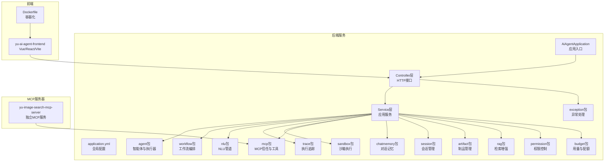

图表来源
- [AiAgentApplication.java](file://src/main/java/com/yupi/yuaiagent/AiAgentApplication.java)
- [application.yml](file://src/main/resources/application.yml)
- [yu-ai-agent-frontend/Dockerfile](file://yu-ai-agent-frontend/Dockerfile)
- [yu-image-search-mcp-server/src/main/resources/application.yml](file://yu-image-search-mcp-server/src/main/resources/application.yml)

章节来源
- [AiAgentApplication.java](file://src/main/java/com/yupi/yuaiagent/AiAgentApplication.java)
- [application.yml](file://src/main/resources/application.yml)

## 核心组件
- 应用入口与配置
  - 应用入口负责加载Spring上下文与自动装配各组件。
  - 全局配置文件集中定义数据库、缓存、日志、MCP服务器列表、跨域策略、会话与配额参数等。
- 控制器层
  - 提供会话、制品、文档、导出、收藏、健康检查等REST接口，作为系统对外交互面。
- 应用服务层
  - 将控制器请求转换为业务操作，协调智能体、工作流、NLU、沙箱、记忆等子系统。
- 智能体与执行器
  - 定义通用智能体基类、具体智能体类型（如顾问、数据员、简历助手等），以及执行器（AgentRunner）负责调度与执行。
- 工作流编排
  - 通过节点类型（AgentNode、ToolNode、ApprovalNode、ConditionNode、LoopNode、ParallelNode）实现复杂流程编排与运行时实例管理。
- NLU管道
  - 统一的意图识别、别名解析、歧义检测、上下文切换检测、重排序与提取器，支撑对话到动作的映射。
- 追踪与可观测性
  - 执行追踪记录步骤、状态、耗时与结果，支持流式发布与查询。
- 沙箱与安全
  - 支持Docker与本地进程沙箱，统一资源限制与策略，保障工具调用安全。
- 记忆与会话
  - 对话记忆压缩与持久化，会话状态管理，支持Token与回合级压缩策略。
- 权限与配额
  - 基于策略的访问投票、代理配额与用量跟踪，结合审计日志。
- 检索增强（RAG）
  - 文档加载、向量存储配置、查询重写与多查询扩展，提升问答准确性。
- 制品管理
  - 制品生命周期、查询与作用域管理，支持导出与导入。

章节来源
- [AiAgentApplication.java](file://src/main/java/com/yupi/yuaiagent/AiAgentApplication.java)
- [application.yml](file://src/main/resources/application.yml)
- [AgentRunner.java](file://src/main/java/com/yupi/yuaiagent/agent/runner/AgentRunner.java)
- [WorkflowRuntime.java](file://src/main/java/com/yupi/yuaiagent/workflow/runtime/WorkflowRuntime.java)
- [NluPipeline.java](file://src/main/java/com/yupi/yuaiagent/nlu/NluPipeline.java)
- [TraceRecorder.java](file://src/main/java/com/yupi/yuaiagent/trace/TraceRecorder.java)
- [DockerSandbox.java](file://src/main/java/com/yupi/yuaiagent/sandbox/DockerSandbox.java)
- [LocalProcessSandbox.java](file://src/main/java/com/yupi/yuaiagent/sandbox/LocalProcessSandbox.java)
- [ChatMemoryManager.java](file://src/main/java/com/yupi/yuaiagent/chatmemory/ChatMemoryManager.java)
- [SessionManager.java](file://src/main/java/com/yupi/yuaiagent/session/SessionManager.java)
- [McpTrustService.java](file://src/main/java/com/yupi/yuaiagent/mcp/McpTrustService.java)
- [AgentConfig.java](file://src/main/java/com/yupi/yuaiagent/config/AgentConfig.java)
- [TokenUsageTracker.java](file://src/main/java/com/yupi/yuaiagent/budget/TokenUsageTracker.java)

## 架构总览
系统采用分层架构：表现层（前端与MCP）、接入层（控制器）、应用层（服务）、领域层（智能体、工作流、NLU、沙箱、记忆、制品、RAG、权限、配额）、基础设施层（数据库、缓存、消息、向量库）。模块间通过清晰的接口与事件总线解耦，支持横向扩展与独立演进。

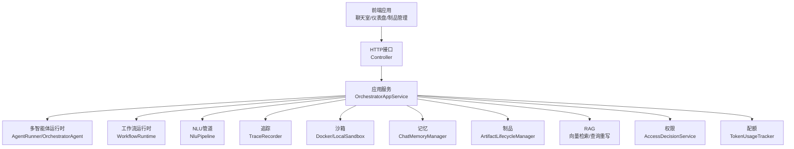

图表来源
- [AgentRunner.java](file://src/main/java/com/yupi/yuaiagent/agent/runner/AgentRunner.java)
- [OrchestratorAgent.java](file://src/main/java/com/yupi/yuaiagent/agent/OrchestratorAgent.java)
- [WorkflowRuntime.java](file://src/main/java/com/yupi/yuaiagent/workflow/runtime/WorkflowRuntime.java)
- [NluPipeline.java](file://src/main/java/com/yupi/yuaiagent/nlu/NluPipeline.java)
- [TraceRecorder.java](file://src/main/java/com/yupi/yuaiagent/trace/TraceRecorder.java)
- [DockerSandbox.java](file://src/main/java/com/yupi/yuaiagent/sandbox/DockerSandbox.java)
- [ChatMemoryManager.java](file://src/main/java/com/yupi/yuaiagent/chatmemory/ChatMemoryManager.java)
- [yu-ai-agent-frontend/package.json](file://yu-ai-agent-frontend/package.json)

## 详细组件分析

### 多智能体运行时架构
多智能体运行时由编排器（OrchestratorAgent）与执行器（AgentRunner）协同完成。编排器负责根据上下文与任务选择合适的智能体与工具，执行器负责实际调度、状态推进与错误处理。支持链式执行、并行分支、条件判断与循环等复杂控制流。

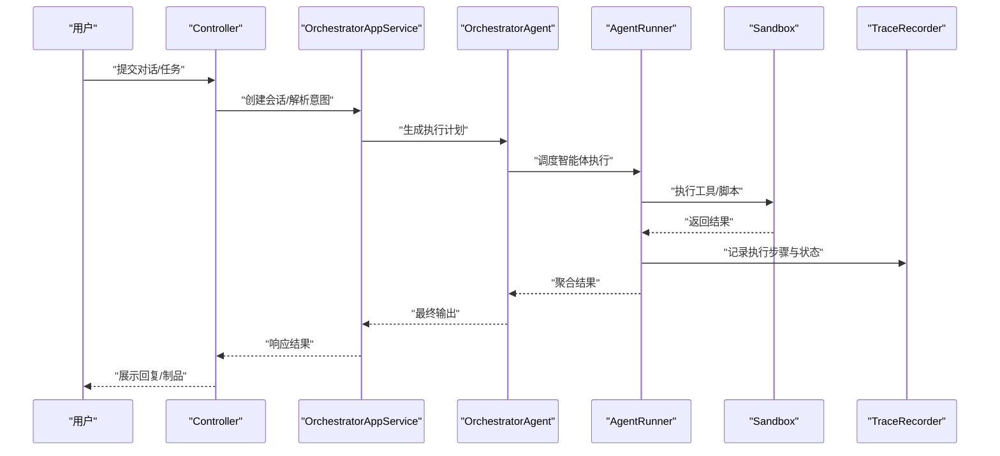

图表来源
- [OrchestratorAgent.java](file://src/main/java/com/yupi/yuaiagent/agent/OrchestratorAgent.java)
- [AgentRunner.java](file://src/main/java/com/yupi/yuaiagent/agent/runner/AgentRunner.java)
- [TraceRecorder.java](file://src/main/java/com/yupi/yuaiagent/trace/TraceRecorder.java)
- [DockerSandbox.java](file://src/main/java/com/yupi/yuaiagent/sandbox/DockerSandbox.java)

章节来源
- [OrchestratorAgent.java](file://src/main/java/com/yupi/yuaiagent/agent/OrchestratorAgent.java)
- [AgentRunner.java](file://src/main/java/com/yupi/yuaiagent/agent/runner/AgentRunner.java)

### 工作流引擎设计
工作流引擎通过节点模型抽象不同执行单元，运行时实例管理器负责实例生命周期与状态流转。匹配器根据输入与模板进行匹配，决定执行路径与并行度。

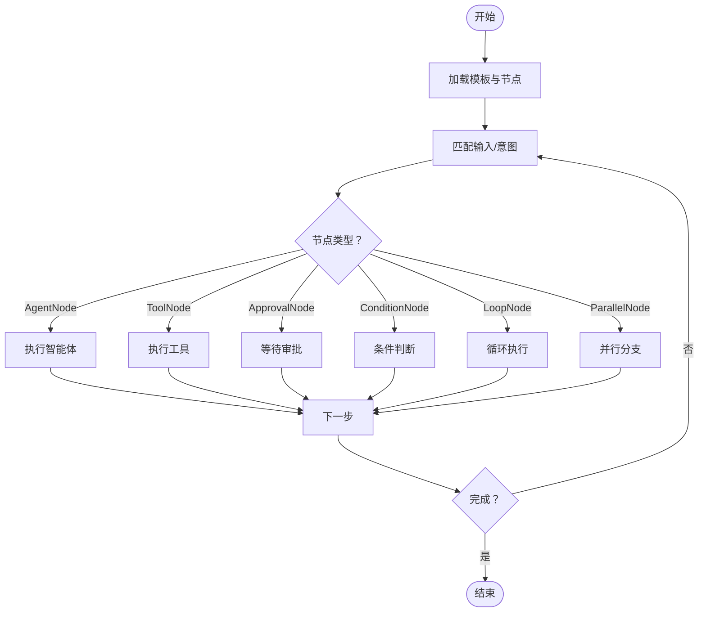

图表来源
- [WorkflowRuntime.java](file://src/main/java/com/yupi/yuaiagent/workflow/runtime/WorkflowRuntime.java)

章节来源
- [WorkflowRuntime.java](file://src/main/java/com/yupi/yuaiagent/workflow/runtime/WorkflowRuntime.java)

### NLU管道架构
NLU管道负责从原始对话中抽取意图、别名、上下文变化与路由提示，进行歧义检测与重排序，最终生成统一的意图对象，驱动后续编排与执行。

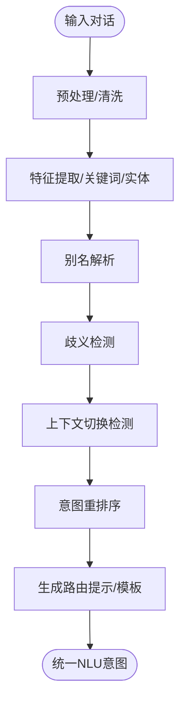

图表来源
- [NluPipeline.java](file://src/main/java/com/yupi/yuaiagent/nlu/NluPipeline.java)

章节来源
- [NluPipeline.java](file://src/main/java/com/yupi/yuaiagent/nlu/NluPipeline.java)
- [nlu-layer-design-v4.2.md](file://docs/nlu-layer-design-v4.2.md)

### 追踪与可观测性
追踪系统在执行过程中记录步骤、状态、耗时与结果，支持流式发布与查询，便于调试、审计与性能分析。

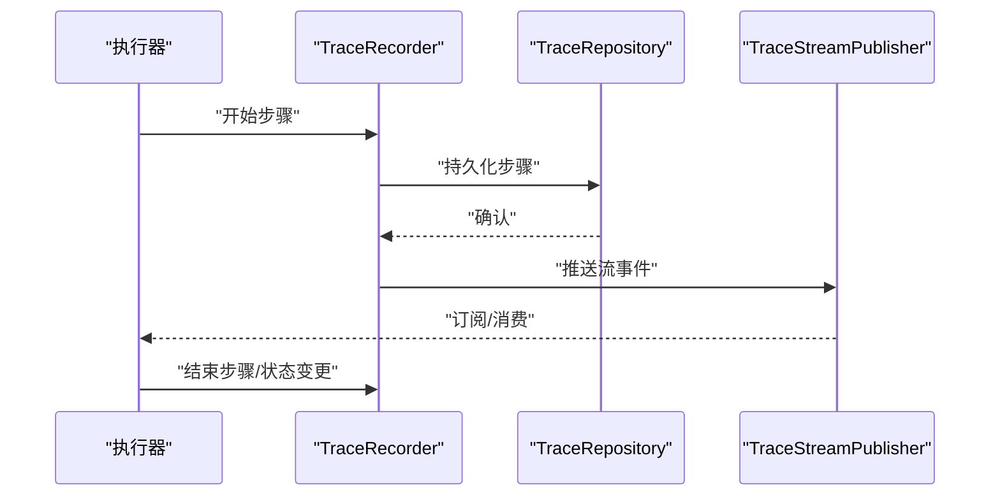

图表来源
- [TraceRecorder.java](file://src/main/java/com/yupi/yuaiagent/trace/TraceRecorder.java)
- [TraceRepository.java](file://src/main/java/com/yupi/yuaiagent/trace/TraceRepository.java)
- [TraceStreamPublisher.java](file://src/main/java/com/yupi/yuaiagent/trace/TraceStreamPublisher.java)

章节来源
- [TraceRecorder.java](file://src/main/java/com/yupi/yuaiagent/trace/TraceRecorder.java)

### 沙箱与安全
沙箱提供隔离执行环境，支持Docker与本地进程两种模式，统一资源限制与策略，防止恶意或高风险操作影响宿主系统。

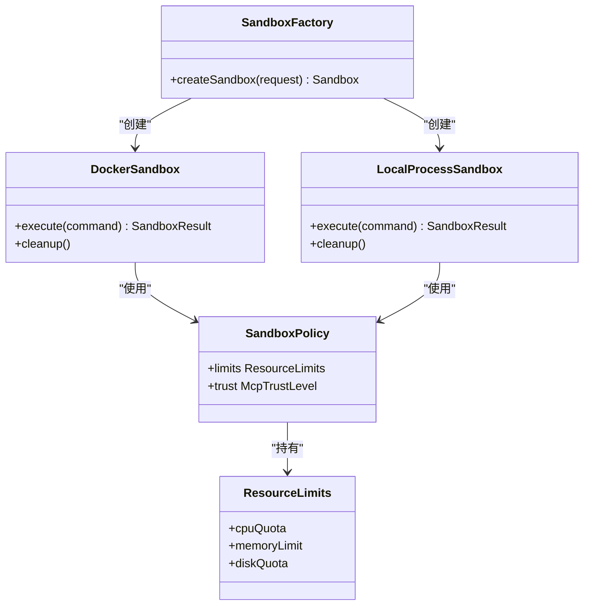

图表来源
- [DockerSandbox.java](file://src/main/java/com/yupi/yuaiagent/sandbox/DockerSandbox.java)
- [LocalProcessSandbox.java](file://src/main/java/com/yupi/yuaiagent/sandbox/LocalProcessSandbox.java)
- [SandboxFactory.java](file://src/main/java/com/yupi/yuaiagent/sandbox/SandboxFactory.java)
- [SandboxPolicy.java](file://src/main/java/com/yupi/yuaiagent/sandbox/SandboxPolicy.java)
- [ResourceLimits.java](file://src/main/java/com/yupi/yuaiagent/sandbox/ResourceLimits.java)

章节来源
- [DockerSandbox.java](file://src/main/java/com/yupi/yuaiagent/sandbox/DockerSandbox.java)
- [LocalProcessSandbox.java](file://src/main/java/com/yupi/yuaiagent/sandbox/LocalProcessSandbox.java)
- [McpTrustService.java](file://src/main/java/com/yupi/yuaiagent/mcp/McpTrustService.java)

### 记忆与会话
对话记忆支持Token与回合级压缩策略，会话管理维护状态与上下文，确保长对话的连贯性与成本可控。

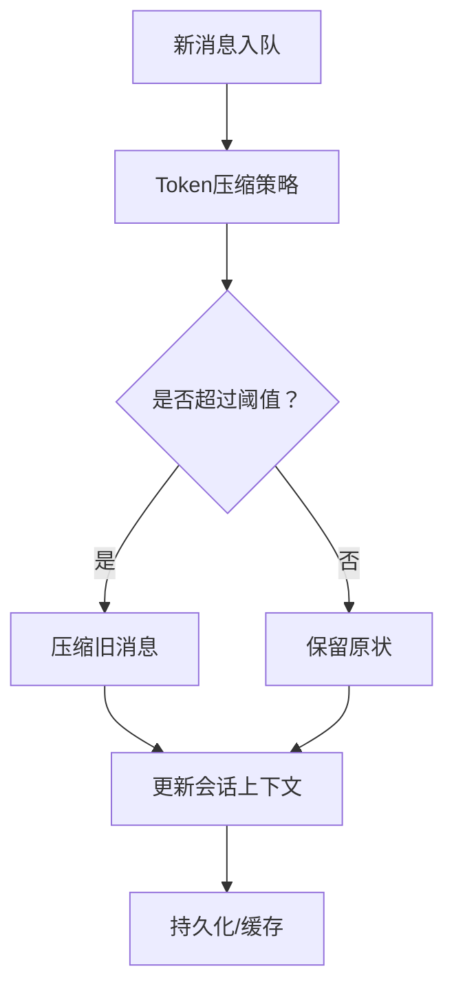

图表来源
- [ChatMemoryManager.java](file://src/main/java/com/yupi/yuaiagent/chatmemory/ChatMemoryManager.java)
- [TokenCompressionStrategy.java](file://src/main/java/com/yupi/yuaiagent/chatmemory/TokenCompressionStrategy.java)
- [TurnCompressionStrategy.java](file://src/main/java/com/yupi/yuaiagent/chatmemory/TurnCompressionStrategy.java)
- [SessionManager.java](file://src/main/java/com/yupi/yuaiagent/session/SessionManager.java)

章节来源
- [ChatMemoryManager.java](file://src/main/java/com/yupi/yuaiagent/chatmemory/ChatMemoryManager.java)
- [SessionManager.java](file://src/main/java/com/yupi/yuaiagent/session/SessionManager.java)

### 权限与配额
权限系统基于策略投票与代理配额，结合审计日志与用量跟踪，实现细粒度的访问控制与资源保护。

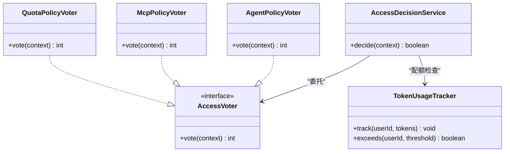

图表来源
- [AccessDecisionService.java](file://src/main/java/com/yupi/yuaiagent/access/AccessDecisionService.java)
- [AgentPolicyVoter.java](file://src/main/java/com/yupi/yuaiagent/access/AgentPolicyVoter.java)
- [McpPolicyVoter.java](file://src/main/java/com/yupi/yuaiagent/access/McpPolicyVoter.java)
- [QuotaPolicyVoter.java](file://src/main/java/com/yupi/yuaiagent/access/QuotaPolicyVoter.java)
- [TokenUsageTracker.java](file://src/main/java/com/yupi/yuaiagent/budget/TokenUsageTracker.java)

章节来源
- [AccessDecisionService.java](file://src/main/java/com/yupi/yuaiagent/access/AccessDecisionService.java)
- [TokenUsageTracker.java](file://src/main/java/com/yupi/yuaiagent/budget/TokenUsageTracker.java)

### 检索增强（RAG）
RAG模块负责文档加载、文本分割、向量嵌入与检索，支持查询重写与多查询扩展，提升问答质量与召回率。

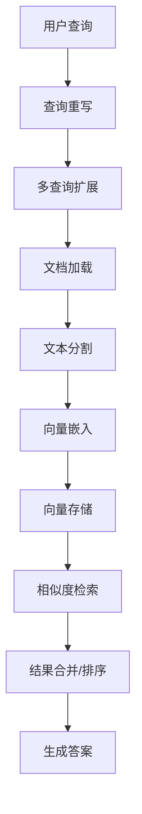

图表来源
- [AiChatDocumentLoader.java](file://src/main/java/com/yupi/yuaiagent/rag/AiChatDocumentLoader.java)
- [MyTokenTextSplitter.java](file://src/main/java/com/yupi/yuaiagent/rag/MyTokenTextSplitter.java)
- [PgVectorVectorStoreConfig.java](file://src/main/java/com/yupi/yuaiagent/rag/PgVectorVectorStoreConfig.java)
- [MultiQueryRetriever.java](file://src/main/java/com/yupi/yuaiagent/rag/MultiQueryRetriever.java)
- [QueryRewriter.java](file://src/main/java/com/yupi/yuaiagent/rag/QueryRewriter.java)

章节来源
- [AiChatDocumentLoader.java](file://src/main/java/com/yupi/yuaiagent/rag/AiChatDocumentLoader.java)
- [MultiQueryRetriever.java](file://src/main/java/com/yupi/yuaiagent/rag/MultiQueryRetriever.java)
- [QueryRewriter.java](file://src/main/java/com/yupi/yuaiagent/rag/QueryRewriter.java)

## 依赖分析
系统采用Maven管理依赖，后端主工程与MCP服务器分别维护各自依赖清单。前端使用npm管理依赖与打包配置。整体依赖关系体现为：后端核心依赖Spring生态、数据库与缓存客户端、向量存储SDK、日志与监控组件；前端依赖UI框架、路由与API封装；MCP服务器依赖工具SDK与Spring Boot。

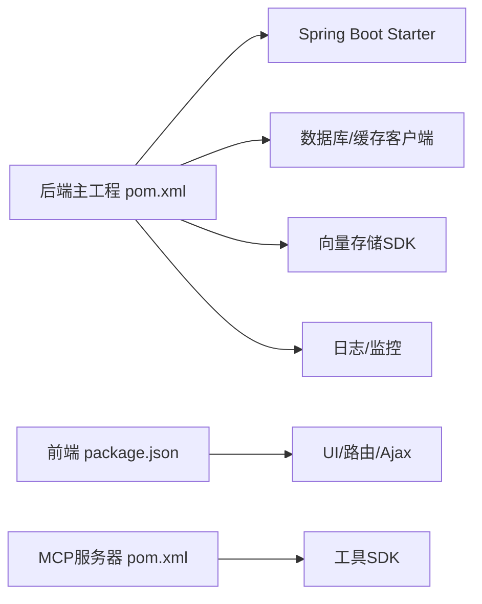

图表来源
- [pom.xml](file://pom.xml)
- [yu-image-search-mcp-server/pom.xml](file://yu-image-search-mcp-server/pom.xml)
- [yu-ai-agent-frontend/package.json](file://yu-ai-agent-frontend/package.json)

章节来源
- [pom.xml](file://pom.xml)
- [yu-image-search-mcp-server/pom.xml](file://yu-image-search-mcp-server/pom.xml)
- [yu-ai-agent-frontend/package.json](file://yu-ai-agent-frontend/package.json)

## 性能考量
- 分层与解耦：通过清晰的分层与模块边界，降低耦合度，便于独立优化与扩展。
- 缓存与压缩：对话记忆采用Token与回合级压缩策略，减少上下文开销；向量检索使用索引与相似度过滤，提升查询效率。
- 并行与异步：工作流支持并行节点与异步步骤，提高吞吐；追踪与日志采用流式发布，避免阻塞。
- 资源限制：沙箱统一资源限制，防止资源滥用；配额与用量跟踪避免超支。
- 可观测性：全链路追踪与指标采集，辅助定位瓶颈与容量规划。

## 故障排查指南
- 健康检查：通过健康接口快速判断服务可用性与依赖状态。
- 全局异常处理：统一捕获业务异常与系统异常，返回标准化错误码与信息。
- 追踪回放：利用执行追踪定位失败步骤与耗时热点。
- 日志与告警：结合日志级别与监控告警，快速定位问题根因。

章节来源
- [HealthController.java](file://src/main/java/com/yupi/yuaiagent/controller/HealthController.java)
- [GlobalExceptionHandler.java](file://src/main/java/com/yupi/yuaiagent/exception/GlobalExceptionHandler.java)
- [TraceRecorder.java](file://src/main/java/com/yupi/yuaiagent/trace/TraceRecorder.java)

## 结论
该多智能体协作平台以分层架构与模块化组织为核心，围绕智能体执行、意图理解、工作流编排、记忆与会话、沙箱安全、可观测性追踪构建完整能力闭环。通过统一的配置与接口、灵活的沙箱与权限策略、完善的RAG与追踪体系，平台具备良好的可扩展性、安全性与可运维性。建议持续完善测试与质量治理，强化跨模块契约与事件一致性，进一步提升系统的稳定性与用户体验。

## 附录
- 系统上下文图（概念性）
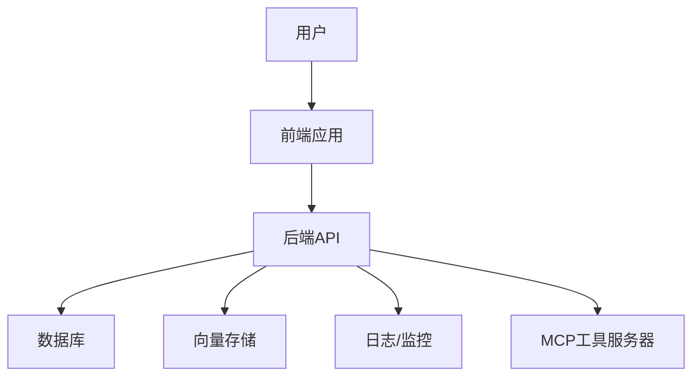

- 部署拓扑（概念性）
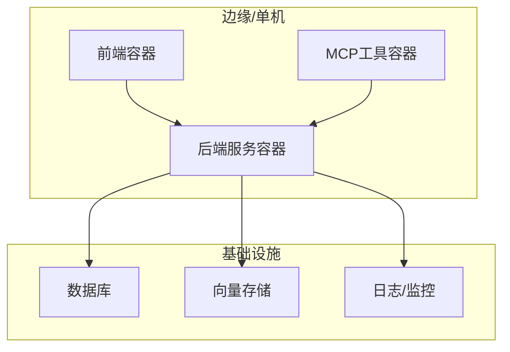