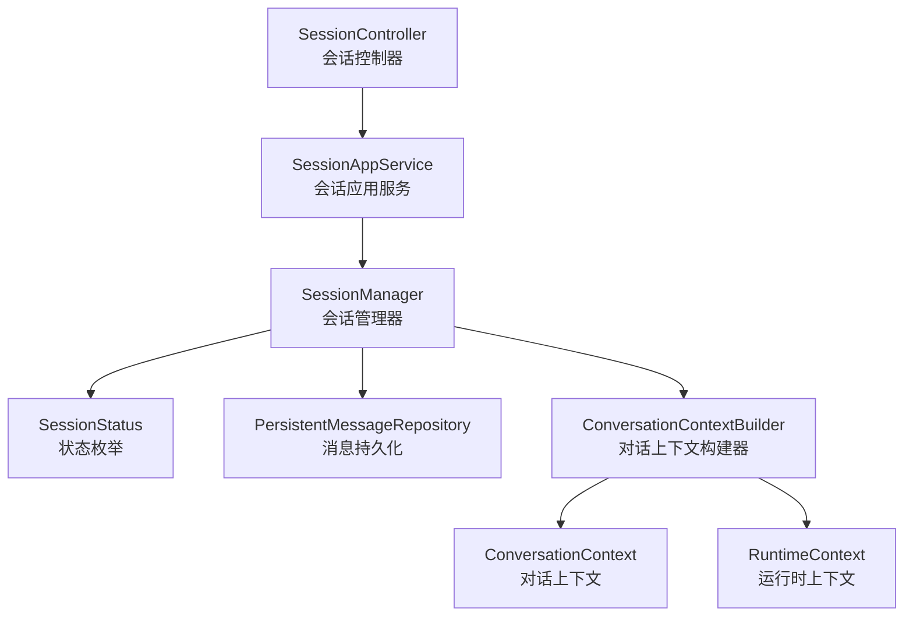
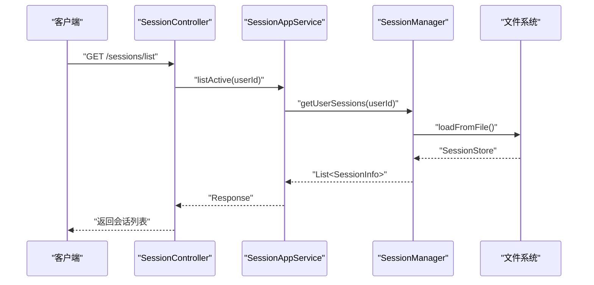
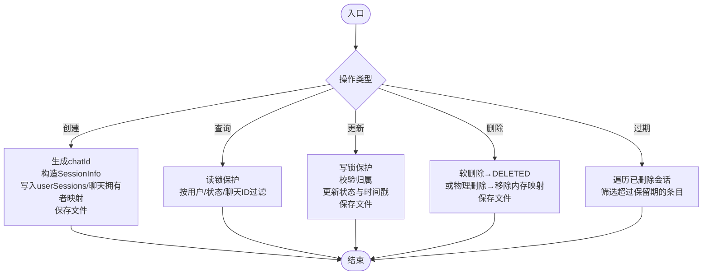
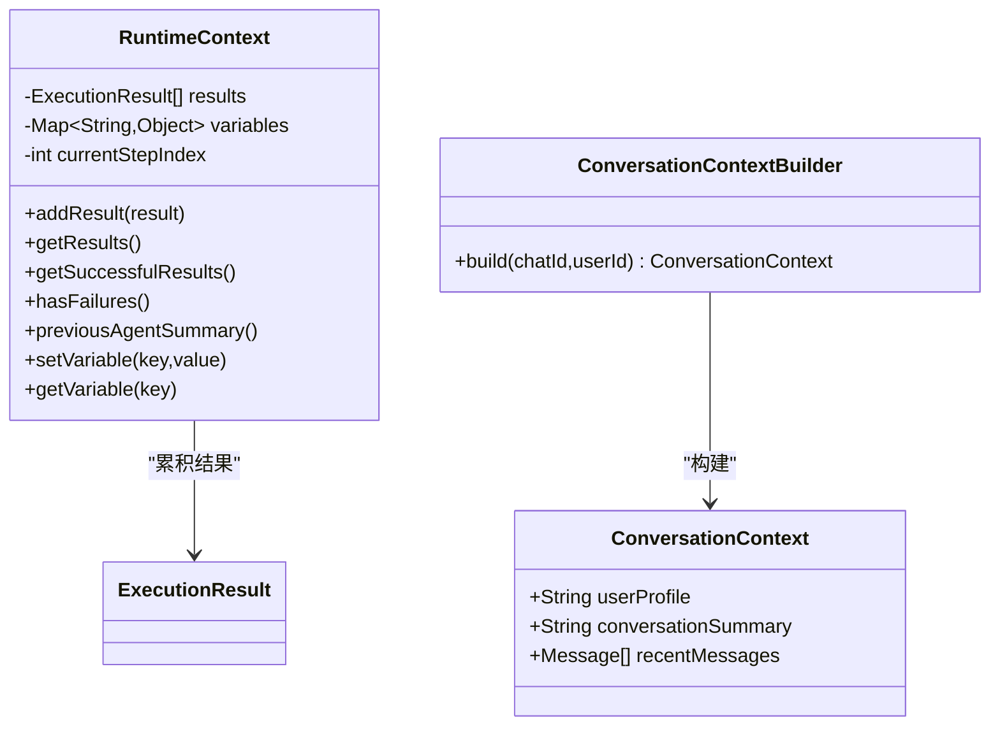
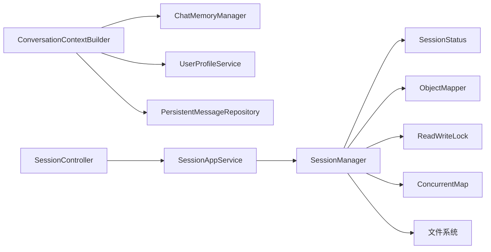
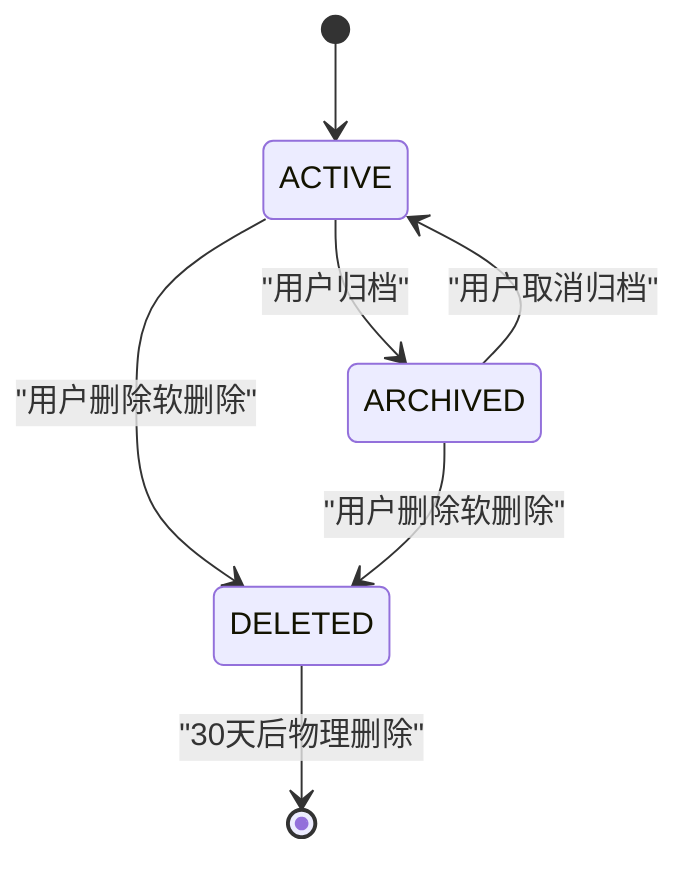

# 会话生命周期管理

<cite>
**本文引用的文件**
- [SessionManager.java](file://src/main/java/com/yupi/yuaiagent/session/SessionManager.java)
- [SessionStatus.java](file://src/main/java/com/yupi/yuaiagent/session/SessionStatus.java)
- [RuntimeContext.java](file://src/main/java/com/yupi/yuaiagent/context/RuntimeContext.java)
- [ConversationContext.java](file://src/main/java/com/yupi/yuaiagent/context/ConversationContext.java)
- [ConversationContextBuilder.java](file://src/main/java/com/yupi/yuaiagent/context/ConversationContextBuilder.java)
- [SessionController.java](file://src/main/java/com/yupi/yuaiagent/controller/SessionController.java)
- [SessionAppService.java](file://src/main/java/com/yupi/yuaiagent/service/SessionAppService.java)
- [PersistentMessageRepository.java](file://src/main/java/com/yupi/yuaiagent/message/PersistentMessageRepository.java)
- [WIKI.md](file://docs/WIKI.md)
</cite>

## 目录
1. [简介](#简介)
2. [项目结构](#项目结构)
3. [核心组件](#核心组件)
4. [架构总览](#架构总览)
5. [详细组件分析](#详细组件分析)
6. [依赖分析](#依赖分析)
7. [性能考虑](#性能考虑)
8. [故障排查指南](#故障排查指南)
9. [结论](#结论)
10. [附录](#附录)

## 简介
本技术文档围绕会话生命周期管理模块展开，系统性阐述会话从创建、初始化、运行、暂停、恢复到销毁的全过程；深入解析 SessionManager 的核心职责与实现机制，包括会话状态转换、软删除与物理清理、并发控制与持久化策略；并明确 RuntimeContext 与 ConversationContext 的职责边界与协作关系。文档同时给出会话配置参数、状态枚举、生命周期事件、并发与线程安全、异常恢复策略以及最佳实践与示例路径。

## 项目结构
会话生命周期管理涉及以下关键模块：
- 会话管理器：负责会话的创建、查询、更新、软删除、物理删除与持久化
- 会话状态：定义 ACTIVE/ARCHIVED/DELETED 三态模型与显示名
- 运行时上下文：可变执行状态，仅用于内部流程追踪
- 对话上下文：不可变共享上下文，承载用户与对话静态信息
- 控制层与应用服务：对外暴露会话列表、归档、回收站等接口
- 消息持久化：与会话一一对应的消息存储

图表来源
- [SessionManager.java:1-309](file://src/main/java/com/yupi/yuaiagent/session/SessionManager.java#L1-L309)
- [SessionStatus.java:1-37](file://src/main/java/com/yupi/yuaiagent/session/SessionStatus.java#L1-L37)
- [RuntimeContext.java:1-56](file://src/main/java/com/yupi/yuaiagent/context/RuntimeContext.java#L1-L56)
- [ConversationContext.java:1-20](file://src/main/java/com/yupi/yuaiagent/context/ConversationContext.java#L1-L20)
- [ConversationContextBuilder.java](file://src/main/java/com/yupi/yuaiagent/context/ConversationContextBuilder.java)
- [SessionController.java:60-84](file://src/main/java/com/yupi/yuaiagent/controller/SessionController.java#L60-L84)
- [SessionAppService.java](file://src/main/java/com/yupi/yuaiagent/service/SessionAppService.java)
- [PersistentMessageRepository.java](file://src/main/java/com/yupi/yuaiagent/message/PersistentMessageRepository.java)

章节来源
- [SessionManager.java:1-309](file://src/main/java/com/yupi/yuaiagent/session/SessionManager.java#L1-L309)
- [SessionStatus.java:1-37](file://src/main/java/com/yupi/yuaiagent/session/SessionStatus.java#L1-L37)
- [RuntimeContext.java:1-56](file://src/main/java/com/yupi/yuaiagent/context/RuntimeContext.java#L1-L56)
- [ConversationContext.java:1-20](file://src/main/java/com/yupi/yuaiagent/context/ConversationContext.java#L1-L20)
- [ConversationContextBuilder.java](file://src/main/java/com/yupi/yuaiagent/context/ConversationContextBuilder.java)
- [SessionController.java:60-84](file://src/main/java/com/yupi/yuaiagent/controller/SessionController.java#L60-L84)
- [SessionAppService.java](file://src/main/java/com/yupi/yuaiagent/service/SessionAppService.java)
- [PersistentMessageRepository.java](file://src/main/java/com/yupi/yuaiagent/message/PersistentMessageRepository.java)
- [WIKI.md](file://docs/WIKI.md)

## 核心组件
- SessionManager：提供会话 CRUD、状态变更、软删除与物理删除、过期查询与文件持久化
- SessionStatus：三态模型 ACTIVE/ARCHIVED/DELETED，含中文显示名
- RuntimeContext：可变执行状态容器，累积执行结果、维护变量、追踪当前步骤
- ConversationContext：不可变共享上下文，包含用户画像、对话摘要与最近消息
- ConversationContextBuilder：基于用户画像、压缩摘要与最近消息构建对话上下文
- SessionController/SessionAppService：对外提供会话列表、归档、回收站等接口
- PersistentMessageRepository：按 chatId 存储消息文件，与会话一一对应

章节来源
- [SessionManager.java:1-309](file://src/main/java/com/yupi/yuaiagent/session/SessionManager.java#L1-L309)
- [SessionStatus.java:1-37](file://src/main/java/com/yupi/yuaiagent/session/SessionStatus.java#L1-L37)
- [RuntimeContext.java:1-56](file://src/main/java/com/yupi/yuaiagent/context/RuntimeContext.java#L1-L56)
- [ConversationContext.java:1-20](file://src/main/java/com/yupi/yuaiagent/context/ConversationContext.java#L1-L20)
- [ConversationContextBuilder.java](file://src/main/java/com/yupi/yuaiagent/context/ConversationContextBuilder.java)
- [SessionController.java:60-84](file://src/main/java/com/yupi/yuaiagent/controller/SessionController.java#L60-L84)
- [SessionAppService.java](file://src/main/java/com/yupi/yuaiagent/service/SessionAppService.java)
- [PersistentMessageRepository.java](file://src/main/java/com/yupi/yuaiagent/message/PersistentMessageRepository.java)

## 架构总览
会话生命周期管理采用“三态模型 + 文件持久化 + 并发读写锁”的设计，结合对话上下文与运行时上下文的职责分离，确保多 Agent 协作时上下文清晰、执行状态可控。

图表来源
- [SessionController.java:60-84](file://src/main/java/com/yupi/yuaiagent/controller/SessionController.java#L60-L84)
- [SessionAppService.java](file://src/main/java/com/yupi/yuaiagent/service/SessionAppService.java)
- [SessionManager.java:51-64](file://src/main/java/com/yupi/yuaiagent/session/SessionManager.java#L51-L64)
- [SessionManager.java:251-279](file://src/main/java/com/yupi/yuaiagent/session/SessionManager.java#L251-L279)

## 详细组件分析

### SessionManager：会话生命周期与状态管理
- 职责
  - 创建会话：生成唯一 chatId，初始化时间戳，写入内存与文件
  - 查询会话：按用户、状态、chatId 查询；支持最新优先排序
  - 更新会话：重命名、归档/解档、软删除/物理删除
  - 状态管理：维护 ACTIVE/ARCHIVED/DELETED 三态，自动更新最后活跃时间与归档/删除时间
  - 清理策略：软删除保留30天后由定时任务物理删除
  - 并发控制：读写锁保证多线程安全；ConcurrentHashMap 提升并发读性能
  - 持久化：JSON 文件存储 userSessions 与 chatOwner 反向索引
- 关键流程
  - 创建：写锁保护，生成 SessionInfo，写入 userSessions 与 chatOwner，保存文件
  - 查询：读锁保护，按条件过滤
  - 更新：写锁保护，校验归属，更新状态与时间戳，保存文件
  - 删除：软删除走状态变更；物理删除移除内存映射并保存文件
  - 过期查询：遍历已删除会话，筛选超过保留期的条目
- 并发与线程安全
  - 读多写少场景使用读写锁分离，提升吞吐
  - 写操作统一加写锁，避免竞态
  - 重要字段使用原子性更新（时间戳、状态）
- 异常恢复
  - 初始化失败记录错误日志
  - 文件读写异常捕获并记录，避免中断业务
  - 归档/删除/过期查询均在读锁下进行，降低阻塞风险

图表来源
- [SessionManager.java:68-81](file://src/main/java/com/yupi/yuaiagent/session/SessionManager.java#L68-L81)
- [SessionManager.java:85-122](file://src/main/java/com/yupi/yuaiagent/session/SessionManager.java#L85-L122)
- [SessionManager.java:178-202](file://src/main/java/com/yupi/yuaiagent/session/SessionManager.java#L178-L202)
- [SessionManager.java:206-233](file://src/main/java/com/yupi/yuaiagent/session/SessionManager.java#L206-L233)
- [SessionManager.java:235-247](file://src/main/java/com/yupi/yuaiagent/session/SessionManager.java#L235-L247)

章节来源
- [SessionManager.java:1-309](file://src/main/java/com/yupi/yuaiagent/session/SessionManager.java#L1-L309)
- [WIKI.md](file://docs/WIKI.md)

### SessionStatus：三态模型与显示名
- ACTIVE：活跃会话，侧边栏可见
- ARCHIVED：已归档会话，折叠在“归档”区
- DELETED：软删除会话，保留30天后物理删除
- 显示名：中文“活跃/已归档/已删除”，便于前端展示

章节来源
- [SessionStatus.java:1-37](file://src/main/java/com/yupi/yuaiagent/session/SessionStatus.java#L1-L37)

### RuntimeContext 与 ConversationContext：职责与关系
- ConversationContext（不可变）
  - 职责：承载用户画像、对话摘要、最近消息等静态上下文
  - 特点：所有 Agent 共享同一实例，不包含执行过程中的状态
- RuntimeContext（可变）
  - 职责：累积各 Agent 的执行结果、维护步骤间传递的变量、追踪当前步骤索引
  - 特点：不传给 Agent，仅由执行器维护，避免上下文被污染
- 构建流程
  - ConversationContextBuilder 基于用户画像、压缩摘要与最近消息构建不可变上下文
  - 执行器在每次 Agent 运行后将结果写入 RuntimeContext，并可设置/读取变量

图表来源
- [RuntimeContext.java:1-56](file://src/main/java/com/yupi/yuaiagent/context/RuntimeContext.java#L1-L56)
- [ConversationContext.java:1-20](file://src/main/java/com/yupi/yuaiagent/context/ConversationContext.java#L1-L20)
- [ConversationContextBuilder.java](file://src/main/java/com/yupi/yuaiagent/context/ConversationContextBuilder.java)

章节来源
- [RuntimeContext.java:1-56](file://src/main/java/com/yupi/yuaiagent/context/RuntimeContext.java#L1-L56)
- [ConversationContext.java:1-20](file://src/main/java/com/yupi/yuaiagent/context/ConversationContext.java#L1-L20)
- [ConversationContextBuilder.java](file://src/main/java/com/yupi/yuaiagent/context/ConversationContextBuilder.java)

### 控制层与应用服务：会话接口
- SessionController 提供会话列表、归档列表、回收站列表等接口，鉴权后调用 SessionAppService
- SessionAppService 封装业务逻辑，调用 SessionManager 完成具体操作
- 典型接口路径
  - GET /sessions/list → 返回 ACTIVE 会话
  - GET /sessions/archived → 返回 ARCHIVED 会话
  - GET /sessions/trash → 返回 DELETED 会话

章节来源
- [SessionController.java:60-84](file://src/main/java/com/yupi/yuaiagent/controller/SessionController.java#L60-L84)
- [SessionAppService.java](file://src/main/java/com/yupi/yuaiagent/service/SessionAppService.java)

### 消息持久化：与会话一一对应
- 每个会话对应一个消息文件，路径为 {session.storage.dir}/messages/{chatId}.json
- 该文件由 PersistentMessageRepository 负责读写，与 SessionManager 的会话元数据互补

章节来源
- [PersistentMessageRepository.java](file://src/main/java/com/yupi/yuaiagent/message/PersistentMessageRepository.java)
- [WIKI.md](file://docs/WIKI.md)

## 依赖分析
- SessionManager 依赖
  - SessionStatus：状态枚举
  - ObjectMapper：JSON 序列化/反序列化
  - ReadWriteLock：并发控制
  - ConcurrentMap：高并发存储
  - 文件系统：sessions.json 持久化
- ConversationContextBuilder 依赖
  - ChatMemoryManager：压缩摘要
  - UserProfileService：用户画像注入
  - PersistentMessageRepository：最近消息查询
- 控制层与应用服务
  - SessionController → SessionAppService → SessionManager

图表来源
- [SessionManager.java:1-309](file://src/main/java/com/yupi/yuaiagent/session/SessionManager.java#L1-L309)
- [SessionStatus.java:1-37](file://src/main/java/com/yupi/yuaiagent/session/SessionStatus.java#L1-L37)
- [ConversationContextBuilder.java](file://src/main/java/com/yupi/yuaiagent/context/ConversationContextBuilder.java)
- [SessionController.java:60-84](file://src/main/java/com/yupi/yuaiagent/controller/SessionController.java#L60-L84)
- [SessionAppService.java](file://src/main/java/com/yupi/yuaiagent/service/SessionAppService.java)
- [PersistentMessageRepository.java](file://src/main/java/com/yupi/yuaiagent/message/PersistentMessageRepository.java)

## 性能考虑
- 并发读写分离：读多写少场景下，读锁与写锁分离显著提升吞吐
- 内存结构：ConcurrentHashMap 提供高并发读取；SessionInfo 列表按创建时间倒序插入，便于前端展示
- 文件 I/O：批量写入，避免频繁落盘；初始化阶段加载一次，减少重复 IO
- 上下文构建：ConversationContextBuilder 复用压缩摘要与最近消息查询，避免重复计算

## 故障排查指南
- 初始化失败
  - 现象：启动时报错，无法加载会话存储
  - 排查：检查 session.storage.dir 目录权限与磁盘空间；查看日志中的异常堆栈
  - 参考路径：[SessionManager.java:51-64](file://src/main/java/com/yupi/yuaiagent/session/SessionManager.java#L51-L64)
- 文件读写异常
  - 现象：保存/加载 sessions.json 失败
  - 排查：确认文件权限、磁盘可用空间；检查 JSON 结构是否被外部修改
  - 参考路径：[SessionManager.java:251-279](file://src/main/java/com/yupi/yuaiagent/session/SessionManager.java#L251-L279)
- 权限校验失败
  - 现象：重命名/归档/删除返回失败
  - 排查：确认 chatId 对应的用户归属；检查 isOwner 校验逻辑
  - 参考路径：[SessionManager.java:124-126](file://src/main/java/com/yupi/yuaiagent/session/SessionManager.java#L124-L126)
- 过期清理未生效
  - 现象：DELETED 会话未被清理
  - 排查：确认定时任务触发频率与 cutoff 时间；检查 deletedAt 字段是否正确更新
  - 参考路径：[SessionManager.java:235-247](file://src/main/java/com/yupi/yuaiagent/session/SessionManager.java#L235-L247)

章节来源
- [SessionManager.java:51-64](file://src/main/java/com/yupi/yuaiagent/session/SessionManager.java#L51-L64)
- [SessionManager.java:251-279](file://src/main/java/com/yupi/yuaiagent/session/SessionManager.java#L251-L279)
- [SessionManager.java:124-126](file://src/main/java/com/yupi/yuaiagent/session/SessionManager.java#L124-L126)
- [SessionManager.java:235-247](file://src/main/java/com/yupi/yuaiagent/session/SessionManager.java#L235-L247)

## 结论
会话生命周期管理模块以三态模型为核心，结合文件持久化与读写锁并发控制，实现了稳定、可扩展的会话管理能力。通过将对话上下文与运行时上下文职责分离，确保了多 Agent 场景下的上下文清晰与执行状态可控。配合完善的接口与异常处理策略，模块具备良好的可维护性与可扩展性。

## 附录

### 会话配置参数
- session.storage.dir：会话存储根目录，默认 ./tmp/sessions
- 消息存储：每个会话一个 JSON 文件，路径为 {session.storage.dir}/messages/{chatId}.json

章节来源
- [SessionManager.java:33-34](file://src/main/java/com/yupi/yuaiagent/session/SessionManager.java#L33-L34)
- [WIKI.md](file://docs/WIKI.md)

### 会话状态枚举与生命周期事件
- 状态枚举：ACTIVE、ARCHIVED、DELETED
- 生命周期事件：
  - 创建：生成 chatId，设置 createdAt/lastActiveAt
  - 更新：重命名、归档/解档、软删除
  - 过期：DELETED 保留30天后物理删除
- 状态转换图

图表来源
- [SessionStatus.java:6-13](file://src/main/java/com/yupi/yuaiagent/session/SessionStatus.java#L6-L13)
- [SessionManager.java:206-212](file://src/main/java/com/yupi/yuaiagent/session/SessionManager.java#L206-L212)
- [SessionManager.java:218-233](file://src/main/java/com/yupi/yuaiagent/session/SessionManager.java#L218-L233)

### 会话管理最佳实践
- 并发访问：对写操作统一加写锁；读操作尽量批量处理，减少锁持有时间
- 状态更新：更新状态时同步更新 lastActiveAt；归档/删除时分别设置 archivedAt/deletedAt
- 持久化策略：定期备份 sessions.json；避免外部直接修改文件结构
- 上下文隔离：Agent 仅消费 ConversationContext，执行状态仅在 RuntimeContext 中维护
- 异常处理：捕获并记录文件 I/O 异常，必要时降级为内存模式继续运行

### 实际会话管理代码示例与路径
- 创建会话
  - [SessionManager.createSession:68-81](file://src/main/java/com/yupi/yuaiagent/session/SessionManager.java#L68-L81)
- 查询会话
  - [SessionManager.getUserSessions:85-95](file://src/main/java/com/yupi/yuaiagent/session/SessionManager.java#L85-L95)
  - [SessionManager.getSessionsByStatus:97-107](file://src/main/java/com/yupi/yuaiagent/session/SessionManager.java#L97-L107)
  - [SessionManager.findByChatId:109-122](file://src/main/java/com/yupi/yuaiagent/session/SessionManager.java#L109-L122)
- 更新会话
  - [SessionManager.rename:149-166](file://src/main/java/com/yupi/yuaiagent/session/SessionManager.java#L149-L166)
  - [SessionManager.updateStatus:178-202](file://src/main/java/com/yupi/yuaiagent/session/SessionManager.java#L178-L202)
- 删除会话
  - [SessionManager.softDelete:210-212](file://src/main/java/com/yupi/yuaiagent/session/SessionManager.java#L210-L212)
  - [SessionManager.physicalDelete:218-233](file://src/main/java/com/yupi/yuaiagent/session/SessionManager.java#L218-L233)
- 过期查询
  - [SessionManager.findExpiredDeleted:235-247](file://src/main/java/com/yupi/yuaiagent/session/SessionManager.java#L235-L247)
- 对话上下文构建
  - [ConversationContextBuilder.build](file://src/main/java/com/yupi/yuaiagent/context/ConversationContextBuilder.java)
- 控制层接口
  - [SessionController.listSessions:60-66](file://src/main/java/com/yupi/yuaiagent/controller/SessionController.java#L60-L66)
  - [SessionController.listArchived:68-74](file://src/main/java/com/yupi/yuaiagent/controller/SessionController.java#L68-L74)
  - [SessionController.listTrash:76-82](file://src/main/java/com/yupi/yuaiagent/controller/SessionController.java#L76-L82)