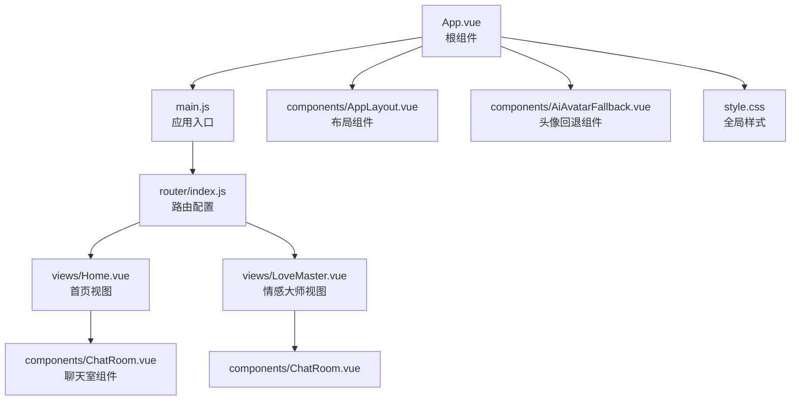
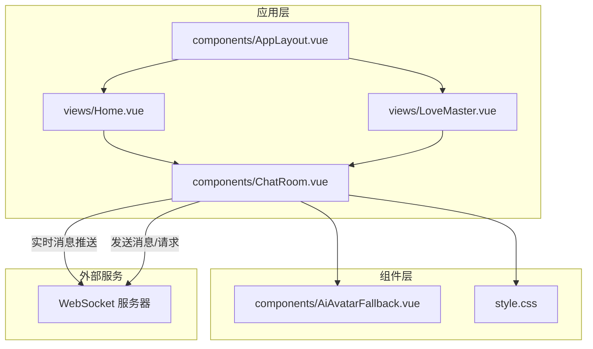
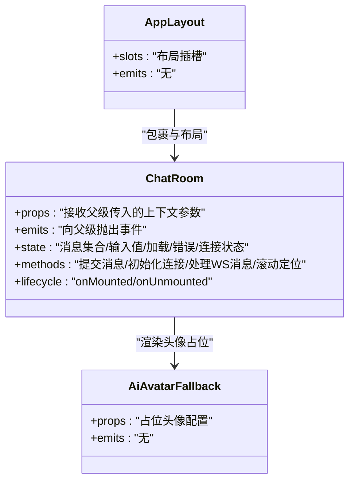
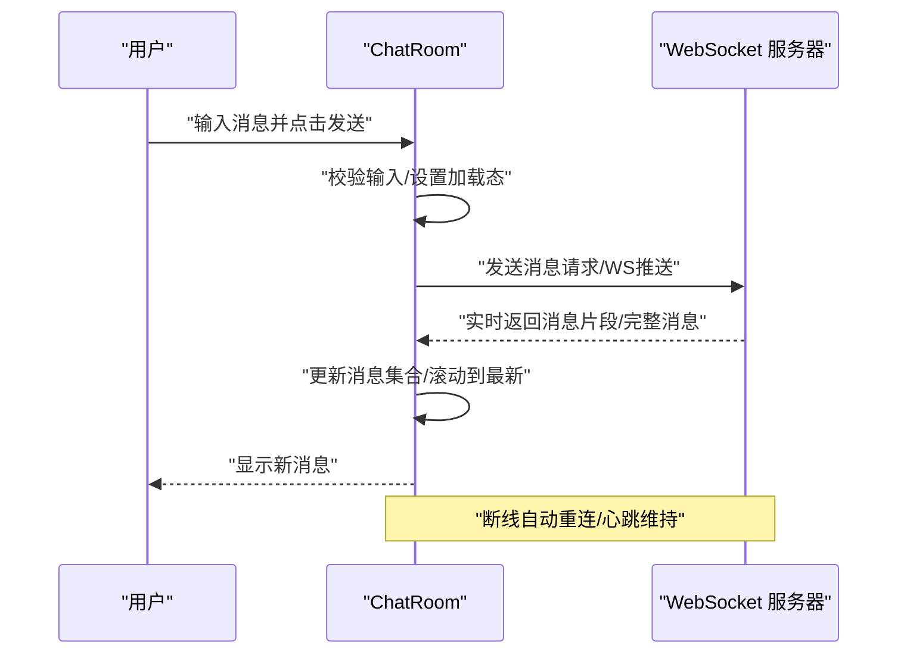
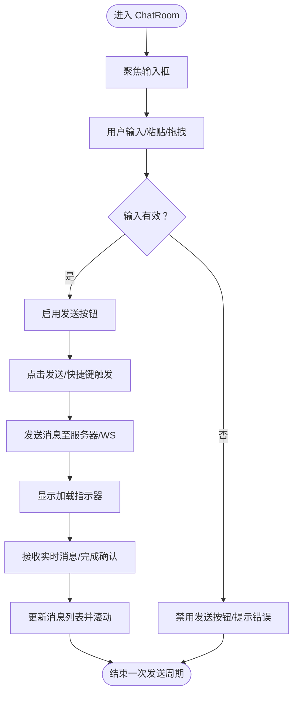
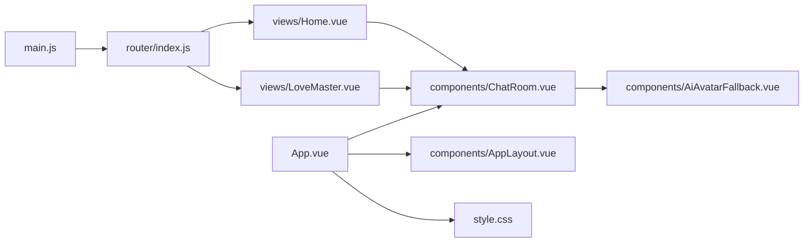

# 前端聊天界面

<cite>
**本文引用的文件**
- [ChatRoom.vue](file://yu-ai-agent-frontend/src/components/ChatRoom.vue)
- [App.vue](file://yu-ai-agent-frontend/src/App.vue)
- [main.js](file://yu-ai-agent-frontend/src/main.js)
- [router/index.js](file://yu-ai-agent-frontend/src/router/index.js)
- [style.css](file://yu-ai-agent-frontend/src/style.css)
- [AiAvatarFallback.vue](file://yu-ai-agent-frontend/src/components/AiAvatarFallback.vue)
- [AppLayout.vue](file://yu-ai-agent-frontend/src/components/AppLayout.vue)
- [Home.vue](file://yu-ai-agent-frontend/src/views/Home.vue)
- [LoveMaster.vue](file://yu-ai-agent-frontend/src/views/LoveMaster.vue)
</cite>

## 目录
1. [简介](#简介)
2. [项目结构](#项目结构)
3. [核心组件](#核心组件)
4. [架构总览](#架构总览)
5. [详细组件分析](#详细组件分析)
6. [依赖分析](#依赖分析)
7. [性能考虑](#性能考虑)
8. [故障排查指南](#故障排查指南)
9. [结论](#结论)
10. [附录](#附录)

## 简介
本文件面向前端聊天界面的开发与维护，围绕 ChatRoom 组件展开，系统性阐述其架构设计、状态管理、用户交互、组件通信、消息渲染与发送流程、WebSocket 连接与实时消息处理、错误处理策略、Props 定义、事件与生命周期使用、样式与主题、性能优化与体验改进，并提供可直接参考的组件使用示例与集成指导。本文所有技术结论均基于仓库中实际源码文件进行归纳总结。

## 项目结构
前端工程位于 yu-ai-agent-frontend 目录，采用 Vue 3 单页应用结构，核心入口为 main.js，路由在 router/index.js 中配置，页面视图位于 views 目录，通用组件位于 components 目录，样式集中在 style.css。ChatRoom 作为聊天主组件，位于 components 目录下，通常由页面视图（如 Home.vue、LoveMaster.vue）引入并渲染。

**图表来源**
- [App.vue](file://yu-ai-agent-frontend/src/App.vue)
- [main.js](file://yu-ai-agent-frontend/src/main.js)
- [router/index.js](file://yu-ai-agent-frontend/src/router/index.js)
- [Home.vue](file://yu-ai-agent-frontend/src/views/Home.vue)
- [LoveMaster.vue](file://yu-ai-agent-frontend/src/views/LoveMaster.vue)
- [ChatRoom.vue](file://yu-ai-agent-frontend/src/components/ChatRoom.vue)
- [AppLayout.vue](file://yu-ai-agent-frontend/src/components/AppLayout.vue)
- [AiAvatarFallback.vue](file://yu-ai-agent-frontend/src/components/AiAvatarFallback.vue)
- [style.css](file://yu-ai-agent-frontend/src/style.css)

**章节来源**
- [App.vue](file://yu-ai-agent-frontend/src/App.vue)
- [main.js](file://yu-ai-agent-frontend/src/main.js)
- [router/index.js](file://yu-ai-agent-frontend/src/router/index.js)

## 核心组件
本节聚焦 ChatRoom 组件，从职责边界、状态模型、数据流、事件与生命周期四个维度进行拆解，帮助读者快速把握组件全貌。

- 职责边界
  - 负责渲染聊天消息列表、处理用户输入、触发消息发送、管理 WebSocket 实时连接与消息接收、展示加载态与错误态。
  - 通过 Props 接收外部上下文（如会话标识、用户信息等），通过 emits 向父级传递事件（如“开始新会话”、“消息发送失败”等）。

- 状态模型
  - 消息集合：用于存储历史消息与待渲染项。
  - 输入内容：双向绑定的文本输入框值。
  - 加载与错误：控制发送按钮禁用、加载指示器与错误提示。
  - WebSocket 连接：连接状态、重连策略、心跳或断线检测。

- 数据流
  - 输入 -> 提交 -> 发送请求/WS -> 推送消息 -> 列表更新 -> 滚动定位。
  - 实时消息 -> WS 接收 -> 更新本地消息集合 -> 视图刷新。

- 事件与生命周期
  - 生命周期：onMounted 初始化连接与滚动；onUnmounted 清理连接与定时器。
  - 事件：用户提交、粘贴/拖拽上传、快捷键（如 Enter/Ctrl+Enter）等。

**章节来源**
- [ChatRoom.vue](file://yu-ai-agent-frontend/src/components/ChatRoom.vue)

## 架构总览
下图展示了 ChatRoom 在应用中的位置与交互关系：页面视图负责承载组件与导航，AppLayout 提供统一布局，ChatRoom 通过 props 获取上下文，通过 emits 与父级通信，内部通过 WebSocket 与后端保持实时连接。

**图表来源**
- [Home.vue](file://yu-ai-agent-frontend/src/views/Home.vue)
- [LoveMaster.vue](file://yu-ai-agent-frontend/src/views/LoveMaster.vue)
- [ChatRoom.vue](file://yu-ai-agent-frontend/src/components/ChatRoom.vue)
- [AppLayout.vue](file://yu-ai-agent-frontend/src/components/AppLayout.vue)
- [AiAvatarFallback.vue](file://yu-ai-agent-frontend/src/components/AiAvatarFallback.vue)
- [style.css](file://yu-ai-agent-frontend/src/style.css)

## 详细组件分析

### ChatRoom 组件类图
该图为 ChatRoom 的核心类型与关系抽象，便于理解 Props、Emits、状态与方法之间的耦合。

**图表来源**
- [ChatRoom.vue](file://yu-ai-agent-frontend/src/components/ChatRoom.vue)
- [AiAvatarFallback.vue](file://yu-ai-agent-frontend/src/components/AiAvatarFallback.vue)
- [AppLayout.vue](file://yu-ai-agent-frontend/src/components/AppLayout.vue)

**章节来源**
- [ChatRoom.vue](file://yu-ai-agent-frontend/src/components/ChatRoom.vue)
- [AiAvatarFallback.vue](file://yu-ai-agent-frontend/src/components/AiAvatarFallback.vue)
- [AppLayout.vue](file://yu-ai-agent-frontend/src/components/AppLayout.vue)

### 消息发送与实时接收序列图
该序列图描述了典型的消息发送与实时接收流程，包括输入校验、发送、WS 推送、列表更新与滚动定位。

**图表来源**
- [ChatRoom.vue](file://yu-ai-agent-frontend/src/components/ChatRoom.vue)

**章节来源**
- [ChatRoom.vue](file://yu-ai-agent-frontend/src/components/ChatRoom.vue)

### 输入处理与发送流程流程图
该流程图聚焦于用户输入到消息发送的关键决策点，覆盖粘贴/拖拽上传、快捷键与发送按钮的状态控制。

**图表来源**
- [ChatRoom.vue](file://yu-ai-agent-frontend/src/components/ChatRoom.vue)

**章节来源**
- [ChatRoom.vue](file://yu-ai-agent-frontend/src/components/ChatRoom.vue)

### 组件 Props、事件与生命周期使用指南
- Props（建议定义）
  - 会话标识：用于区分不同对话上下文。
  - 用户信息：用于头像、名称与权限判断。
  - 主题配置：深浅色、字体大小、间距等。
  - 能力开关：是否允许上传、快捷键行为、自动滚动等。
- Emits（建议定义）
  - onNewSession：开始新会话。
  - onMessageSendFailed：发送失败事件，携带错误信息。
  - onMessageReceived：收到实时消息事件，携带消息体。
  - onConnectionStatusChanged：连接状态变化事件。
- 生命周期
  - onMounted：初始化 WebSocket 连接、滚动容器、监听窗口尺寸变化。
  - onUnmounted：清理连接、定时器、事件监听器。

**章节来源**
- [ChatRoom.vue](file://yu-ai-agent-frontend/src/components/ChatRoom.vue)

### 组件通信机制
- 父子通信
  - 父组件通过 Props 向 ChatRoom 注入上下文（如会话 ID、用户信息、主题）。
  - 子组件通过 emits 向父组件上报事件（如发送失败、连接状态变更）。
- 页面视图集成
  - Home.vue 与 LoveMaster.vue 分别引入 ChatRoom 并传递所需 Props。
  - AppLayout 提供统一布局与导航，确保 ChatRoom 在不同页面场景下一致呈现。

**章节来源**
- [Home.vue](file://yu-ai-agent-frontend/src/views/Home.vue)
- [LoveMaster.vue](file://yu-ai-agent-frontend/src/views/LoveMaster.vue)
- [AppLayout.vue](file://yu-ai-agent-frontend/src/components/AppLayout.vue)

### 样式设计、响应式布局与主题定制
- 全局样式
  - style.css 提供基础排版、颜色变量与组件默认样式，建议在此集中管理主题变量（如主色调、背景、边框圆角等）。
- 响应式布局
  - 使用媒体查询适配移动端与桌面端，保证输入区、消息列表与操作按钮在小屏设备上仍具可用性。
- 主题定制
  - 通过 CSS 变量与 BEM 命名规范，支持浅色/深色主题切换，避免内联样式的重复与冲突。
- 头像占位
  - AiAvatarFallback.vue 提供统一的头像占位符，减少图片加载失败对布局的影响。

**章节来源**
- [style.css](file://yu-ai-agent-frontend/src/style.css)
- [AiAvatarFallback.vue](file://yu-ai-agent-frontend/src/components/AiAvatarFallback.vue)

### WebSocket 连接管理、实时消息与错误处理
- 连接管理
  - 初始化：onMounted 中建立连接，设置重连策略（指数退避）、心跳检测。
  - 断线恢复：监听断开事件，延迟重连；在页面隐藏或网络异常时暂停重连，恢复后继续。
- 实时消息
  - 接收：按消息类型分发（文本、文件、系统提示），合并片段消息，避免重复渲染。
  - 渲染：将新消息插入列表末尾，自动滚动到底部；对长文本提供折叠/展开能力。
- 错误处理
  - 发送失败：捕获网络异常与业务错误，提示用户并允许重试。
  - 连接异常：显示连接状态图标与提示文案，提供手动重连按钮。
  - 异常兜底：对未知消息格式进行安全解析，避免影响后续消息处理。

**章节来源**
- [ChatRoom.vue](file://yu-ai-agent-frontend/src/components/ChatRoom.vue)

### 性能优化与用户体验改进
- 渲染优化
  - 虚拟列表：对超长消息列表使用虚拟滚动，降低 DOM 节点数量。
  - 懒加载：图片与附件采用懒加载，减少首屏压力。
- 交互优化
  - 自动滚动：新消息到达时自动滚动到底部；用户手动滚动时暂停自动滚动，避免打断阅读。
  - 快捷键：支持 Enter 发送、Ctrl+Enter 换行，提升输入效率。
  - 防抖/节流：输入联想与搜索建议使用防抖，滚动事件使用节流。
- 网络优化
  - 增量更新：仅更新新增消息，避免整列表重绘。
  - 缓存策略：对已渲染的消息块进行缓存，提高二次打开速度。
- 可访问性
  - 语义化标签与键盘可达性，为屏幕阅读器提供清晰的上下文信息。

**章节来源**
- [ChatRoom.vue](file://yu-ai-agent-frontend/src/components/ChatRoom.vue)

## 依赖分析
- 组件依赖
  - ChatRoom 依赖 AppLayout 提供布局，依赖 AiAvatarFallback 提供头像占位。
  - 页面视图 Home.vue 与 LoveMaster.vue 依赖 ChatRoom。
- 应用入口
  - main.js 作为应用入口，router/index.js 配置路由，App.vue 作为根组件挂载。
- 样式依赖
  - style.css 为全局样式入口，被 App.vue 引入并在各页面生效。

**图表来源**
- [main.js](file://yu-ai-agent-frontend/src/main.js)
- [router/index.js](file://yu-ai-agent-frontend/src/router/index.js)
- [App.vue](file://yu-ai-agent-frontend/src/App.vue)
- [Home.vue](file://yu-ai-agent-frontend/src/views/Home.vue)
- [LoveMaster.vue](file://yu-ai-agent-frontend/src/views/LoveMaster.vue)
- [ChatRoom.vue](file://yu-ai-agent-frontend/src/components/ChatRoom.vue)
- [AppLayout.vue](file://yu-ai-agent-frontend/src/components/AppLayout.vue)
- [AiAvatarFallback.vue](file://yu-ai-agent-frontend/src/components/AiAvatarFallback.vue)
- [style.css](file://yu-ai-agent-frontend/src/style.css)

**章节来源**
- [main.js](file://yu-ai-agent-frontend/src/main.js)
- [router/index.js](file://yu-ai-agent-frontend/src/router/index.js)
- [App.vue](file://yu-ai-agent-frontend/src/App.vue)

## 性能考虑
- 渲染层面
  - 对消息列表使用虚拟滚动，限制可见节点数量。
  - 图片与附件懒加载，避免阻塞主线程。
- 网络层面
  - 合理设置重连间隔与最大重试次数，避免频繁抖动。
  - 对高频事件（如输入）使用防抖，降低请求频率。
- 交互层面
  - 自动滚动与用户滚动冲突时，采用“用户主动滚动时暂停自动滚动”的策略。
  - 对长文本消息提供折叠/展开，减少一次性渲染压力。

## 故障排查指南
- 连接无法建立
  - 检查 WebSocket 地址与鉴权参数是否正确。
  - 查看浏览器开发者工具 Network 面板中的 WS 连接状态与握手日志。
- 消息不显示
  - 检查消息类型与渲染逻辑，确认消息集合更新链路。
  - 关注自动滚动与虚拟列表导致的可视区域问题。
- 发送失败
  - 捕获网络异常与业务错误，记录错误码与提示文案，提供重试按钮。
- 主题不生效
  - 确认 style.css 是否被正确引入，CSS 变量命名是否一致。
  - 检查组件内是否覆盖了关键样式。

**章节来源**
- [ChatRoom.vue](file://yu-ai-agent-frontend/src/components/ChatRoom.vue)
- [style.css](file://yu-ai-agent-frontend/src/style.css)

## 结论
ChatRoom 组件以清晰的职责划分与稳定的生命周期管理为基础，结合 WebSocket 实现实时通信，并通过 Props/Emits 与页面视图及布局组件形成松耦合的协作关系。配合合理的样式体系、响应式布局与主题定制，以及完善的性能优化与错误处理策略，能够为用户提供流畅、稳定且可扩展的聊天体验。建议在后续迭代中持续完善消息类型扩展、富媒体支持与无障碍能力。

## 附录
- 组件使用示例（路径参考）
  - 在页面视图中引入 ChatRoom 并传入必要 Props：[Home.vue](file://yu-ai-agent-frontend/src/views/Home.vue)，[LoveMaster.vue](file://yu-ai-agent-frontend/src/views/LoveMaster.vue)
  - 根组件与入口配置：[App.vue](file://yu-ai-agent-frontend/src/App.vue)，[main.js](file://yu-ai-agent-frontend/src/main.js)，[router/index.js](file://yu-ai-agent-frontend/src/router/index.js)
- 样式与主题
  - 全局样式入口：[style.css](file://yu-ai-agent-frontend/src/style.css)
  - 头像占位组件：[AiAvatarFallback.vue](file://yu-ai-agent-frontend/src/components/AiAvatarFallback.vue)
  - 布局组件：[AppLayout.vue](file://yu-ai-agent-frontend/src/components/AppLayout.vue)