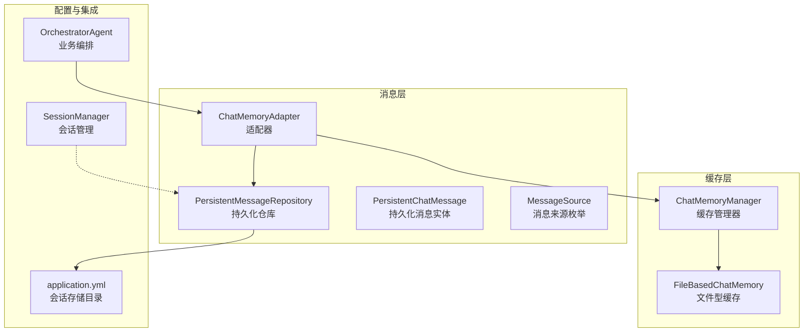
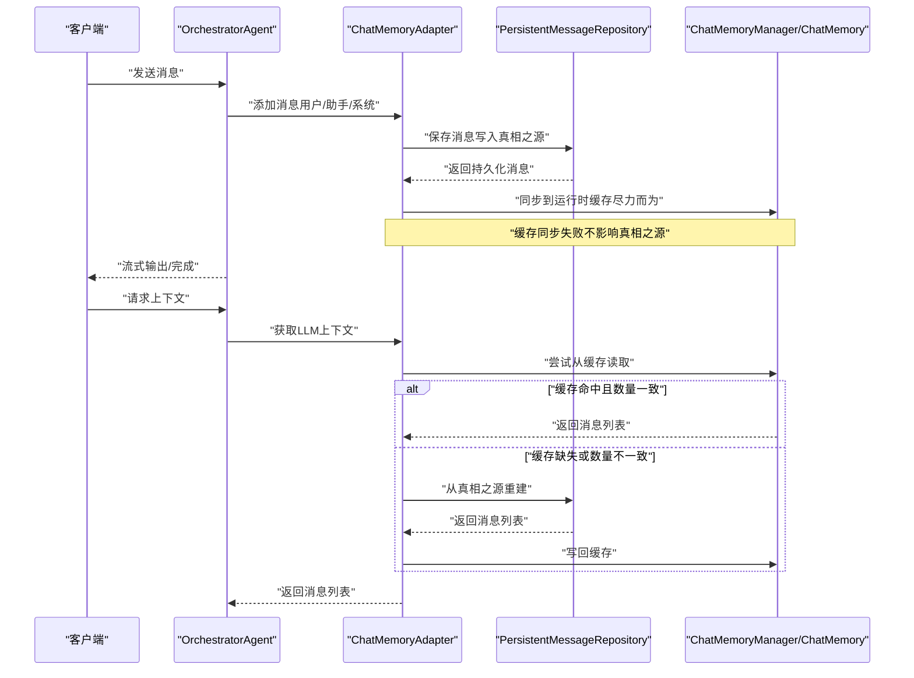
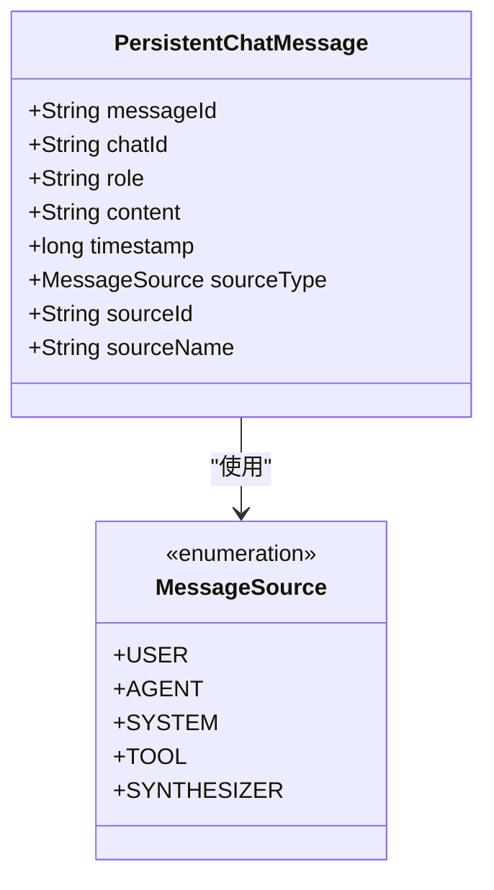
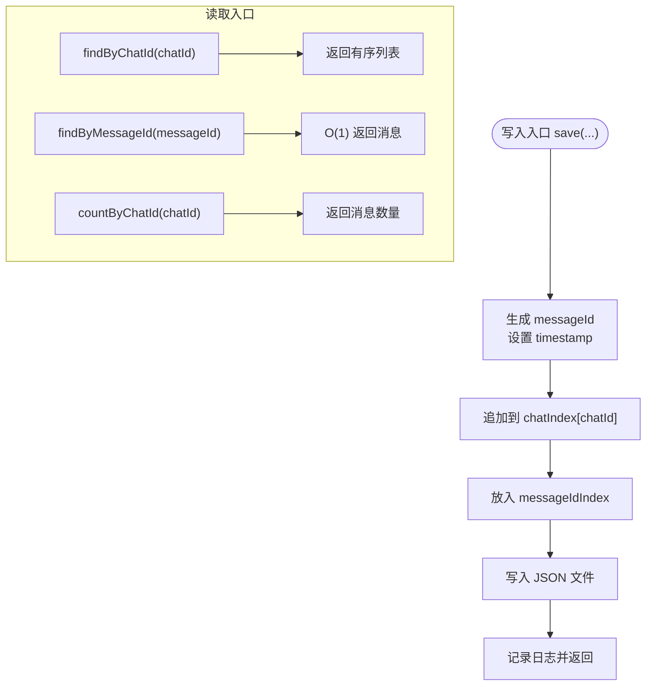
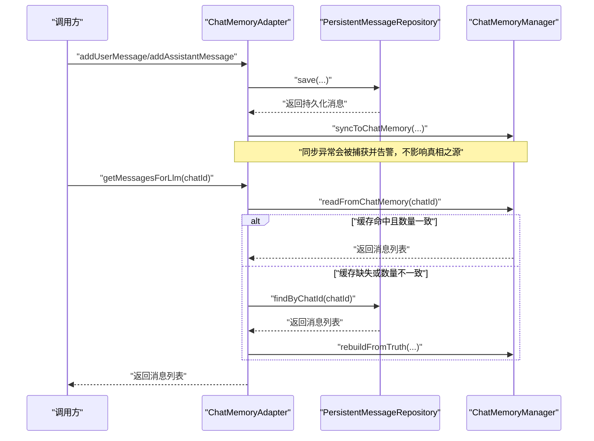
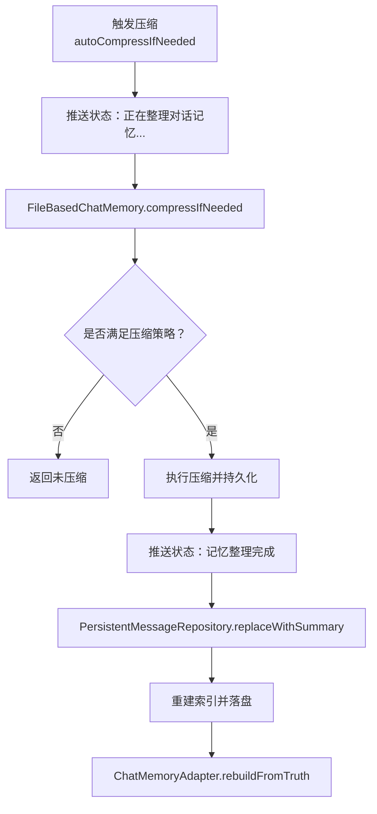
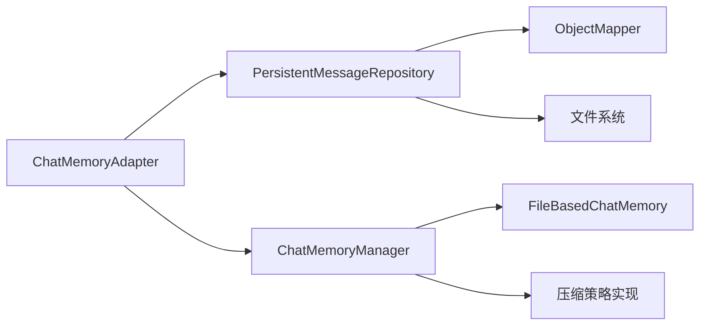

# 消息持久化系统

<cite>
**本文档引用的文件**
- [PersistentChatMessage.java](file://src/main/java/com/yupi/yuaiagent/message/PersistentChatMessage.java)
- [PersistentMessageRepository.java](file://src/main/java/com/yupi/yuaiagent/message/PersistentMessageRepository.java)
- [MessageSource.java](file://src/main/java/com/yupi/yuaiagent/message/MessageSource.java)
- [ChatMemoryAdapter.java](file://src/main/java/com/yupi/yuaiagent/message/ChatMemoryAdapter.java)
- [ChatMemoryManager.java](file://src/main/java/com/yupi/yuaiagent/chatmemory/ChatMemoryManager.java)
- [application.yml](file://src/main/resources/application.yml)
- [application-prod.yml](file://src/main/resources/application-prod.yml)
- [FileBasedChatMemory.java](file://src/main/java/com/yupi/yuaiagent/chatmemory/FileBasedChatMemory.java)
- [OrchestratorAgent.java](file://src/main/java/com/yupi/yuaiagent/agent/OrchestratorAgent.java)
- [SessionManager.java](file://src/main/java/com/yupi/yuaiagent/session/SessionManager.java)
- [DataImportService.java](file://src/main/java/com/yupi/yuaiagent/export/DataImportService.java)
</cite>

## 目录
1. [简介](#简介)
2. [项目结构](#项目结构)
3. [核心组件](#核心组件)
4. [架构概览](#架构概览)
5. [详细组件分析](#详细组件分析)
6. [依赖分析](#依赖分析)
7. [性能考虑](#性能考虑)
8. [故障排除指南](#故障排除指南)
9. [结论](#结论)
10. [附录](#附录)

## 简介
本文件面向消息持久化系统，围绕以下目标展开：  
- 深入解析消息存储架构、数据模型设计与持久化策略  
- 阐述 PersistentChatMessage 实体的设计理念与字段含义（含消息类型、内容格式与元数据管理）  
- 说明 PersistentMessageRepository 的数据访问模式与查询优化  
- 解释 MessageSource 的消息来源标识与 ChatMemoryAdapter 的适配器模式实现  
- 提供消息序列化/反序列化与版本兼容性处理方案  
- 给出数据库设计、索引策略与性能优化建议  
- 提供消息持久化的实际使用示例与故障排除方法  

## 项目结构
消息持久化系统位于后端模块的 message 包与 chatmemory 包中，配合 Spring AI 的 ChatMemory 作为运行时缓存，形成“真相之源（持久化）+ 缓存（运行时）”的双层架构。

图表来源
- [PersistentMessageRepository.java:1-230](file://src/main/java/com/yupi/yuaiagent/message/PersistentMessageRepository.java#L1-L230)
- [ChatMemoryAdapter.java:1-206](file://src/main/java/com/yupi/yuaiagent/message/ChatMemoryAdapter.java#L1-L206)
- [ChatMemoryManager.java:1-341](file://src/main/java/com/yupi/yuaiagent/chatmemory/ChatMemoryManager.java#L1-L341)
- [application.yml:88-90](file://src/main/resources/application.yml#L88-L90)
- [OrchestratorAgent.java:495-523](file://src/main/java/com/yupi/yuaiagent/agent/OrchestratorAgent.java#L495-L523)
- [SessionManager.java:66-81](file://src/main/java/com/yupi/yuaiagent/session/SessionManager.java#L66-L81)

章节来源
- [application.yml:88-90](file://src/main/resources/application.yml#L88-L90)
- [PersistentMessageRepository.java:29-31](file://src/main/java/com/yupi/yuaiagent/message/PersistentMessageRepository.java#L29-L31)

## 核心组件
- PersistentChatMessage：定义消息的稳定标识、所属会话、角色、内容、时间戳以及多智能体来源追踪元数据（sourceType、sourceId、sourceName）。  
- PersistentMessageRepository：负责消息的写入、读取、删除与压缩替换，采用“聊天索引 + 消息ID索引”的双索引结构，结合文件系统进行持久化。  
- MessageSource：枚举定义消息来源类型，支撑多智能体协作场景下的消息归属识别。  
- ChatMemoryAdapter：桥接“真相之源”与“运行时缓存”，确保写路径强一致、读路径一致性校验与回退重建。  
- ChatMemoryManager：统一管理不同 Agent 类型的 ChatMemory，提供压缩状态查询、自动压缩触发与状态推送。  
- FileBasedChatMemory：基于文件的缓存实现，支持策略驱动的压缩与持久化。  

章节来源
- [PersistentChatMessage.java:18-48](file://src/main/java/com/yupi/yuaiagent/message/PersistentChatMessage.java#L18-L48)
- [PersistentMessageRepository.java:35-230](file://src/main/java/com/yupi/yuaiagent/message/PersistentMessageRepository.java#L35-L230)
- [MessageSource.java:12-28](file://src/main/java/com/yupi/yuaiagent/message/MessageSource.java#L12-L28)
- [ChatMemoryAdapter.java:28-206](file://src/main/java/com/yupi/yuaiagent/message/ChatMemoryAdapter.java#L28-L206)
- [ChatMemoryManager.java:38-341](file://src/main/java/com/yupi/yuaiagent/chatmemory/ChatMemoryManager.java#L38-L341)
- [FileBasedChatMemory.java:116-264](file://src/main/java/com/yupi/yuaiagent/chatmemory/FileBasedChatMemory.java#L116-L264)

## 架构概览
系统采用“真相之源 + 运行时缓存”的分层设计：  
- 真相之源：PersistentMessageRepository 以 JSON 文件形式按会话持久化消息，维护 chatId → 消息列表与 messageId → 消息的双索引，确保 O(1) 查询与一致性。  
- 运行时缓存：ChatMemoryAdapter 将持久化消息同步到 Spring AI ChatMemory（文件型缓存），LLM 侧优先读取缓存并进行一致性校验，前端侧直接读取真相之源。  
- 压缩与重建：ChatMemoryManager 与 FileBasedChatMemory 提供策略驱动的压缩与状态推送，压缩完成后由 ChatMemoryAdapter 重建缓存。

图表来源
- [ChatMemoryAdapter.java:75-118](file://src/main/java/com/yupi/yuaiagent/message/ChatMemoryAdapter.java#L75-L118)
- [PersistentMessageRepository.java:113-130](file://src/main/java/com/yupi/yuaiagent/message/PersistentMessageRepository.java#L113-L130)
- [ChatMemoryManager.java:156-188](file://src/main/java/com/yupi/yuaiagent/chatmemory/ChatMemoryManager.java#L156-L188)

## 详细组件分析

### PersistentChatMessage 实体设计
- 设计理念：以“稳定标识 + 会话关联 + 时间戳 + 来源追踪”为核心，确保消息可追溯、可搜索、可重建。  
- 字段含义：  
  - messageId：ULID 格式的稳定唯一标识，生成后不可变更。  
  - chatId：所属会话标识。  
  - role：消息角色（user/assistant/system）。  
  - content：消息内容（纯文本或 Markdown）。  
  - timestamp：创建时间（毫秒）。  
  - sourceType：消息来源类型（USER/AGENT/SYSTEM/TOOL/SYNTHESIZER）。  
  - sourceId：来源标识（如 AGENT→"RESUME"、TOOL→"web_search"、USER→userId）。  
  - sourceName：前端展示名称（如 AGENT→"简历专家"、TOOL→"Web 搜索"）。  

图表来源
- [PersistentChatMessage.java:18-48](file://src/main/java/com/yupi/yuaiagent/message/PersistentChatMessage.java#L18-L48)
- [MessageSource.java:12-28](file://src/main/java/com/yupi/yuaiagent/message/MessageSource.java#L12-L28)

章节来源
- [PersistentChatMessage.java:20-47](file://src/main/java/com/yupi/yuaiagent/message/PersistentChatMessage.java#L20-L47)

### PersistentMessageRepository 数据访问模式与查询优化
- 存储策略：每个会话一个 JSON 文件，文件名即 chatId.json，内容为消息列表。  
- 索引结构：  
  - chatIndex：chatId → 消息列表（插入顺序即时间顺序）。  
  - messageIdIndex：messageId → 消息（O(1) 查询）。  
- 写入流程：生成 messageId、设置时间戳、写入 chatIndex 与 messageIdIndex、落盘。  
- 读取流程：  
  - findByChatId：按 chatId 返回有序列表。  
  - findByMessageId：按 messageId 返回单条消息。  
  - countByChatId：用于缓存一致性校验。  
- 删除流程：移除 chatIndex 中的列表并同步清理 messageIdIndex，删除对应 JSON 文件。  
- 压缩流程：在保持最近 N 轮的前提下，用“压缩摘要 + 最近消息”替换旧消息，同时重建索引并落盘。  
- 查询复杂度：  
  - findByChatId：O(k)，k 为该会话消息数。  
  - findByMessageId：O(1)。  
  - countByChatId：O(k)。  
- 并发控制：chatIndex 的列表使用并发安全容器与同步块，保障多线程写入安全。  
- 序列化：使用 Jackson ObjectMapper，启用缩进输出，便于人工阅读与调试。  

图表来源
- [PersistentMessageRepository.java:72-106](file://src/main/java/com/yupi/yuaiagent/message/PersistentMessageRepository.java#L72-L106)
- [PersistentMessageRepository.java:113-130](file://src/main/java/com/yupi/yuaiagent/message/PersistentMessageRepository.java#L113-L130)
- [PersistentMessageRepository.java:157-186](file://src/main/java/com/yupi/yuaiagent/message/PersistentMessageRepository.java#L157-L186)

章节来源
- [PersistentMessageRepository.java:20-60](file://src/main/java/com/yupi/yuaiagent/message/PersistentMessageRepository.java#L20-L60)
- [PersistentMessageRepository.java:190-228](file://src/main/java/com/yupi/yuaiagent/message/PersistentMessageRepository.java#L190-L228)

### MessageSource 消息来源标识
- 作用：在多智能体协作场景中，明确区分“用户输入”、“智能体输出”、“系统消息”、“工具输出”、“合成器输出”。  
- 使用场景：  
  - ChatMemoryAdapter 在写入时传入 sourceType/sourceId/sourceName，确保前端可正确渲染与溯源。  
  - OrchestratorAgent 在聚合答案时标记为 SYNTHESIZER，便于统一展示与审计。  

章节来源
- [MessageSource.java:12-28](file://src/main/java/com/yupi/yuaiagent/message/MessageSource.java#L12-L28)
- [ChatMemoryAdapter.java:75-90](file://src/main/java/com/yupi/yuaiagent/message/ChatMemoryAdapter.java#L75-L90)
- [OrchestratorAgent.java:513-514](file://src/main/java/com/yupi/yuaiagent/agent/OrchestratorAgent.java#L513-L514)

### ChatMemoryAdapter 适配器模式实现
- 写路径：先持久化到真相之源，再尽力同步到运行时缓存；若同步失败，下次读取时从真相之源重建。  
- 读路径 for LLM：优先从缓存读取，通过 countByChatId 进行一致性校验，不一致则回退重建。  
- 读路径 for 前端：直接从真相之源读取，保证绝对一致。  
- 工具方法：强制重建缓存、获取消息计数、删除会话消息。  
- 类型转换：将 PersistentChatMessage 映射为 Spring AI 的 Message（User/Assistant/System）。  
- Agent 类型解析：当前默认返回 "general"，未来可扩展为按 chatId 解析具体 Agent 类型。  

图表来源
- [ChatMemoryAdapter.java:75-118](file://src/main/java/com/yupi/yuaiagent/message/ChatMemoryAdapter.java#L75-L118)
- [ChatMemoryAdapter.java:155-186](file://src/main/java/com/yupi/yuaiagent/message/ChatMemoryAdapter.java#L155-L186)

章节来源
- [ChatMemoryAdapter.java:13-25](file://src/main/java/com/yupi/yuaiagent/message/ChatMemoryAdapter.java#L13-L25)
- [ChatMemoryAdapter.java:188-195](file://src/main/java/com/yupi/yuaiagent/message/ChatMemoryAdapter.java#L188-L195)

### 压缩与重建流程
- 触发条件：ChatMemoryManager.autoCompressIfNeeded 根据 Token 阈值与轮次阈值判断是否需要压缩。  
- 执行过程：FileBasedChatMemory 在写锁保护下原地压缩并持久化，完成后推送状态消息。  
- 后续处理：PersistentMessageRepository.replaceWithSummary 用“压缩摘要 + 最近 N 轮”替换旧消息，重建索引并落盘。  
- 适配器重建：ChatMemoryAdapter.rebuildFromTruth 从真相之源重建缓存。  

图表来源
- [ChatMemoryManager.java:156-188](file://src/main/java/com/yupi/yuaiagent/chatmemory/ChatMemoryManager.java#L156-L188)
- [FileBasedChatMemory.java:243-257](file://src/main/java/com/yupi/yuaiagent/chatmemory/FileBasedChatMemory.java#L243-L257)
- [PersistentMessageRepository.java:157-186](file://src/main/java/com/yupi/yuaiagent/message/PersistentMessageRepository.java#L157-L186)
- [ChatMemoryAdapter.java:171-186](file://src/main/java/com/yupi/yuaiagent/message/ChatMemoryAdapter.java#L171-L186)

章节来源
- [ChatMemoryManager.java:115-138](file://src/main/java/com/yupi/yuaiagent/chatmemory/ChatMemoryManager.java#L115-L138)
- [FileBasedChatMemory.java:116-131](file://src/main/java/com/yupi/yuaiagent/chatmemory/FileBasedChatMemory.java#L116-L131)

## 依赖分析
- 组件耦合：  
  - ChatMemoryAdapter 依赖 PersistentMessageRepository 与 ChatMemoryManager。  
  - ChatMemoryManager 依赖 FileBasedChatMemory 与压缩策略实现。  
  - PersistentMessageRepository 依赖 Jackson ObjectMapper 与文件系统。  
- 外部依赖：Spring AI ChatMemory 接口、Hutool IdUtil（UUID 生成）。  
- 配置依赖：application.yml 中的 session.storage.dir 控制消息存储根目录。  

图表来源
- [ChatMemoryAdapter.java:30-34](file://src/main/java/com/yupi/yuaiagent/message/ChatMemoryAdapter.java#L30-L34)
- [ChatMemoryManager.java:56-62](file://src/main/java/com/yupi/yuaiagent/chatmemory/ChatMemoryManager.java#L56-L62)
- [PersistentMessageRepository.java:40-41](file://src/main/java/com/yupi/yuaiagent/message/PersistentMessageRepository.java#L40-L41)
- [application.yml:88-90](file://src/main/resources/application.yml#L88-L90)

章节来源
- [application.yml:88-90](file://src/main/resources/application.yml#L88-L90)
- [PersistentMessageRepository.java:37-38](file://src/main/java/com/yupi/yuaiagent/message/PersistentMessageRepository.java#L37-L38)

## 性能考虑
- 存储与索引  
  - 双索引结构：chatIndex 与 messageIdIndex 分别满足“范围查询 + O(1) 单点查询”。  
  - 文件粒度：按会话拆分 JSON 文件，避免单文件过大；读取时按需加载。  
  - 并发安全：chatIndex 的列表使用并发容器与同步块，写入路径串行化，读取路径无锁。  
- 序列化与 I/O  
  - Jackson 启用缩进输出，便于调试；生产环境可关闭以降低体积。  
  - 写入采用追加写，删除采用整会话批量清理，避免频繁随机写。  
- 缓存一致性  
  - LLM 侧通过 countByChatId 校验缓存一致性，不一致时回退重建，确保正确性。  
- 压缩策略  
  - 基于 Token 数与轮次阈值的策略驱动压缩，减少上下文长度，提升推理效率。  
- 建议  
  - 对大会话启用定期压缩，避免单文件过大导致加载缓慢。  
  - 在高并发场景下，可考虑引入更细粒度的锁或分片策略。  
  - 对频繁查询的会话，可在 JVM 内缓存最近 N 个会话的索引以降低磁盘访问频率。  

章节来源
- [PersistentMessageRepository.java:43-47](file://src/main/java/com/yupi/yuaiagent/message/PersistentMessageRepository.java#L43-L47)
- [PersistentMessageRepository.java:190-228](file://src/main/java/com/yupi/yuaiagent/message/PersistentMessageRepository.java#L190-L228)
- [ChatMemoryAdapter.java:101-118](file://src/main/java/com/yupi/yuaiagent/message/ChatMemoryAdapter.java#L101-L118)
- [application.yml:120-129](file://src/main/resources/application.yml#L120-L129)

## 故障排除指南
- 写入失败  
  - 现象：保存消息后未落盘或索引未更新。  
  - 排查：检查 session.storage.dir 目录权限与磁盘空间；确认 ObjectMapper 初始化与文件写入异常日志。  
  - 参考  
    - [PersistentMessageRepository.java:190-197](file://src/main/java/com/yupi/yuaiagent/message/PersistentMessageRepository.java#L190-L197)  
    - [application.yml:88-90](file://src/main/resources/application.yml#L88-L90)  
- 缓存同步失败  
  - 现象：消息已持久化但运行时缓存未更新。  
  - 排查：查看 ChatMemoryAdapter 的警告日志；确认 ChatMemoryManager 正常初始化。  
  - 参考  
    - [ChatMemoryAdapter.java:82-87](file://src/main/java/com/yupi/yuaiagent/message/ChatMemoryAdapter.java#L82-L87)  
    - [ChatMemoryAdapter.java:155-159](file://src/main/java/com/yupi/yuaiagent/message/ChatMemoryAdapter.java#L155-L159)  
- 缓存不一致  
  - 现象：LLM 上下文与真相之源不一致。  
  - 排查：检查 countByChatId 是否与缓存大小一致；必要时调用 rebuildFromTruth 强制重建。  
  - 参考  
    - [ChatMemoryAdapter.java:101-118](file://src/main/java/com/yupi/yuaiagent/message/ChatMemoryAdapter.java#L101-L118)  
    - [ChatMemoryAdapter.java:171-186](file://src/main/java/com/yupi/yuaiagent/message/ChatMemoryAdapter.java#L171-L186)  
- 压缩异常  
  - 现象：压缩失败或状态未推送。  
  - 排查：查看 ChatMemoryManager 的异常日志；确认压缩策略配置与阈值合理。  
  - 参考  
    - [ChatMemoryManager.java:174-182](file://src/main/java/com/yupi/yuaiagent/chatmemory/ChatMemoryManager.java#L174-L182)  
    - [application.yml:120-129](file://src/main/resources/application.yml#L120-L129)  
- 会话删除后数据残留  
  - 现象：删除会话后仍可见历史消息。  
  - 排查：确认 deleteByChatId 已调用并删除对应 JSON 文件；检查前端是否直接读取真相之源。  
  - 参考  
    - [PersistentMessageRepository.java:137-145](file://src/main/java/com/yupi/yuaiagent/message/PersistentMessageRepository.java#L137-L145)  
    - [ChatMemoryAdapter.java:148-151](file://src/main/java/com/yupi/yuaiagent/message/ChatMemoryAdapter.java#L148-L151)  

## 结论
消息持久化系统通过“真相之源 + 运行时缓存”的双层架构，在保证数据一致性的同时兼顾性能与可扩展性。PersistentChatMessage 的多来源追踪设计为多智能体协作提供了清晰的溯源能力；PersistentMessageRepository 的双索引与文件化存储实现了高效读写；ChatMemoryAdapter 的适配器模式确保了写路径强一致与读路径的容错重建；ChatMemoryManager 的策略驱动压缩进一步提升了长对话的推理效率。整体设计既满足当前需求，也为未来的扩展（如按会话解析 Agent 类型、引入数据库等）预留了空间。

## 附录
- 实际使用示例（路径参考）  
  - 添加用户消息并持久化：  
    - [ChatMemoryAdapter.java:41-51](file://src/main/java/com/yupi/yuaiagent/message/ChatMemoryAdapter.java#L41-L51)  
    - [PersistentMessageRepository.java:72-106](file://src/main/java/com/yupi/yuaiagent/message/PersistentMessageRepository.java#L72-L106)  
  - 添加助手消息并标记来源：  
    - [ChatMemoryAdapter.java:56-66](file://src/main/java/com/yupi/yuaiagent/message/ChatMemoryAdapter.java#L56-L66)  
    - [OrchestratorAgent.java:513-514](file://src/main/java/com/yupi/yuaiagent/agent/OrchestratorAgent.java#L513-L514)  
  - 获取 LLM 上下文（带缓存一致性校验）：  
    - [ChatMemoryAdapter.java:101-118](file://src/main/java/com/yupi/yuaiagent/message/ChatMemoryAdapter.java#L101-L118)  
  - 获取前端显示列表（直接从真相之源）：  
    - [ChatMemoryAdapter.java:125-127](file://src/main/java/com/yupi/yuaiagent/message/ChatMemoryAdapter.java#L125-L127)  
  - 删除会话并清理文件：  
    - [PersistentMessageRepository.java:137-145](file://src/main/java/com/yupi/yuaiagent/message/PersistentMessageRepository.java#L137-L145)  
  - 导入数据（包含消息导入）：  
    - [DataImportService.java:49-67](file://src/main/java/com/yupi/yuaiagent/export/DataImportService.java#L49-L67)  
- 配置参考  
  - 会话存储目录：  
    - [application.yml:88-90](file://src/main/resources/application.yml#L88-L90)  
  - 压缩阈值与最近轮次：  
    - [application.yml:120-129](file://src/main/resources/application.yml#L120-L129)  
- 版本兼容性建议  
  - 采用 JSON 文件按会话存储，升级时保留现有文件结构，新增字段默认为空或使用默认值，读取时忽略未知字段。  
  - 对于字段迁移，提供一次性脚本或服务端迁移流程，确保旧数据可平滑过渡。