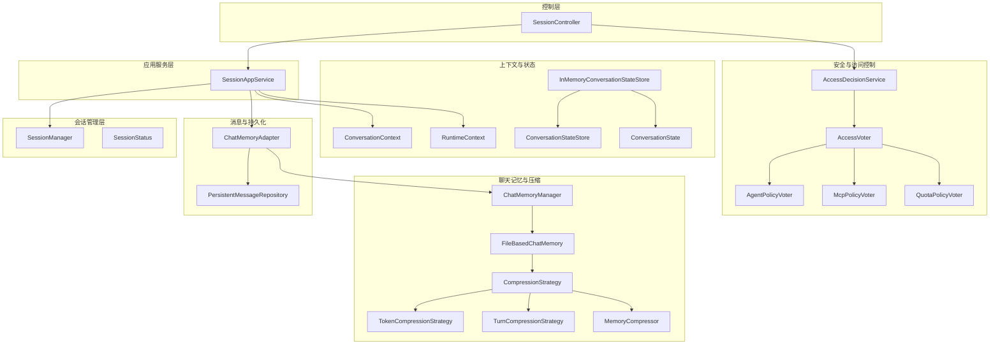
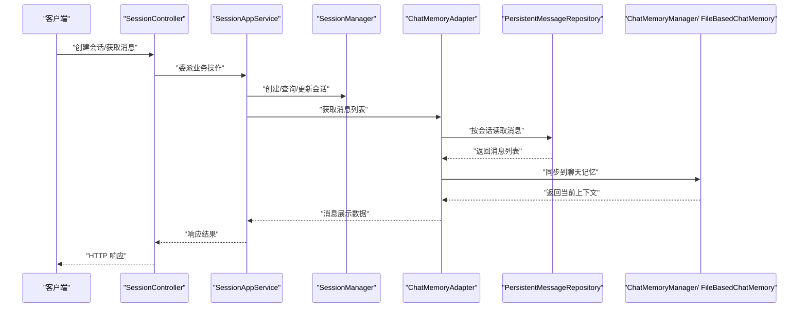
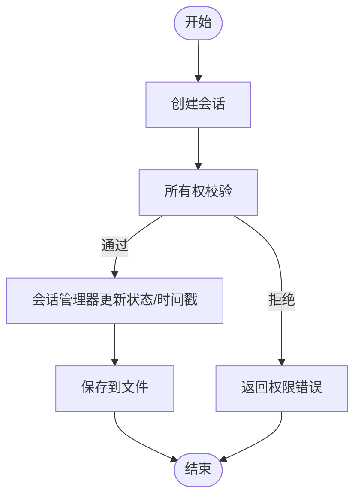
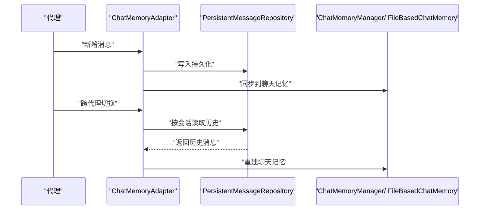
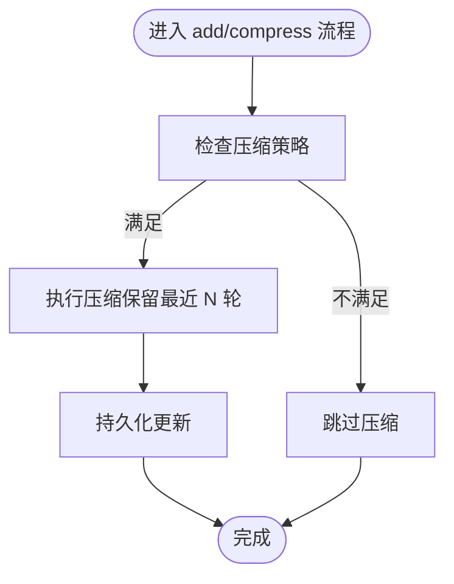
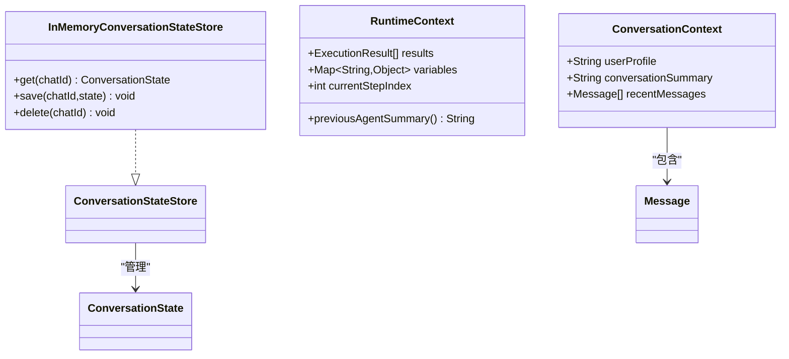
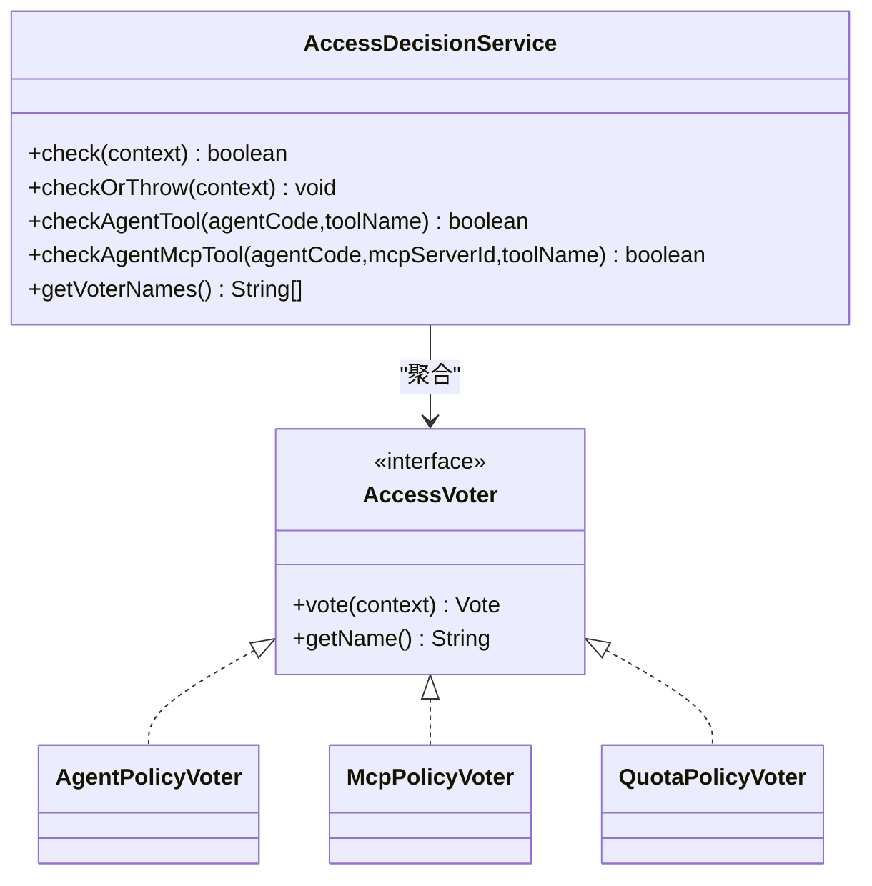
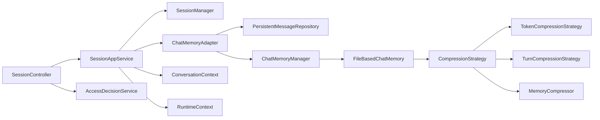

# 聊天和会话管理

<cite>
**本文引用的文件**
- [ChatMemoryAdapter.java](file://src/main/java/com/yupi/yuaiagent/message/ChatMemoryAdapter.java)
- [PersistentMessageRepository.java](file://src/main/java/com/yupi/yuaiagent/message/PersistentMessageRepository.java)
- [SessionAppService.java](file://src/main/java/com/yupi/yuaiagent/service/SessionAppService.java)
- [SessionManager.java](file://src/main/java/com/yupi/yuaiagent/session/SessionManager.java)
- [SessionController.java](file://src/main/java/com/yupi/yuaiagent/controller/SessionController.java)
- [FileBasedChatMemory.java](file://src/main/java/com/yupi/yuaiagent/chatmemory/FileBasedChatMemory.java)
- [ChatMemoryManager.java](file://src/main/java/com/yupi/yuaiagent/chatmemory/ChatMemoryManager.java)
- [CompressionStrategy.java](file://src/main/java/com/yupi/yuaiagent/chatmemory/CompressionStrategy.java)
- [TokenCompressionStrategy.java](file://src/main/java/com/yupi/yuaiagent/chatmemory/TokenCompressionStrategy.java)
- [TurnCompressionStrategy.java](file://src/main/java/com/yupi/yuaiagent/chatmemory/TurnCompressionStrategy.java)
- [MemoryCompressor.java](file://src/main/java/com/yupi/yuaiagent/chatmemory/MemoryCompressor.java)
- [ConversationContext.java](file://src/main/java/com/yupi/yuaiagent/context/ConversationContext.java)
- [RuntimeContext.java](file://src/main/java/com/yupi/yuaiagent/context/RuntimeContext.java)
- [OrchestratorAgent.java](file://src/main/java/com/yupi/yuaiagent/agent/OrchestratorAgent.java)
- [InMemoryConversationStateStore.java](file://src/main/java/com/yupi/yuaiagent/nlu/InMemoryConversationStateStore.java)
- [AccessDecisionService.java](file://src/main/java/com/yupi/yuaiagent/access/AccessDecisionService.java)
- [AccessVoter.java](file://src/main/java/com/yupi/yuaiagent/access/AccessVoter.java)
- [AgentPolicyVoter.java](file://src/main/java/com/yupi/yuaiagent/access/AgentPolicyVoter.java)
- [McpPolicyVoter.java](file://src/main/java/com/yupi/yuaiagent/access/McpPolicyVoter.java)
- [QuotaPolicyVoter.java](file://src/main/java/com/yupi/yuaiagent/access/QuotaPolicyVoter.java)
- [SessionStatus.java](file://src/main/java/com/yupi/yuaiagent/session/SessionStatus.java)
- [ConversationStateStore.java](file://src/main/java/com/yupi/yuaiagent/nlu/ConversationStateStore.java)
- [ConversationState.java](file://src/main/java/com/yupi/yuaiagent/nlu/ConversationState.java)
</cite>

## 目录
1. [简介](#简介)
2. [项目结构](#项目结构)
3. [核心组件](#核心组件)
4. [架构总览](#架构总览)
5. [详细组件分析](#详细组件分析)
6. [依赖关系分析](#依赖关系分析)
7. [性能考量](#性能考量)
8. [故障排除指南](#故障排除指南)
9. [结论](#结论)
10. [附录](#附录)

## 简介
本技术文档围绕聊天与会话管理系统，系统性阐述会话生命周期管理、消息持久化与状态同步机制；深入解析聊天记忆系统（文件存储、内存缓存与压缩策略）；说明会话状态管理、上下文维护与历史记录处理；提供会话配置指南、性能优化与容量规划建议；解释消息格式、序列化机制与传输协议；涵盖会话安全策略、访问控制与数据保护；并给出实际会话管理示例与故障排除方法，帮助开发者完成会话系统的开发与维护。

## 项目结构
后端采用分层架构，核心模块包括：
- 控制层：会话控制器负责对外暴露会话与消息的 REST 接口
- 应用服务层：会话应用服务协调会话管理器与消息适配器，提供业务能力
- 会话管理层：负责会话的创建、归档、软删除、重命名与状态变更
- 消息与持久化：消息适配器桥接内存聊天记忆与持久化仓库；持久化仓库提供消息读取、删除与压缩支持
- 聊天记忆与压缩：文件型聊天记忆结合多种压缩策略，保障长对话的可维护性
- 上下文与状态：会话上下文与运行时上下文分别承载对话静态信息与执行状态
- 安全与访问控制：统一访问决策服务聚合多个投票器，实施“一票否决”的安全策略

**图表来源**
- [SessionController.java](file://src/main/java/com/yupi/yuaiagent/controller/SessionController.java)
- [SessionAppService.java](file://src/main/java/com/yupi/yuaiagent/service/SessionAppService.java)
- [SessionManager.java](file://src/main/java/com/yupi/yuaiagent/session/SessionManager.java)
- [ChatMemoryAdapter.java](file://src/main/java/com/yupi/yuaiagent/message/ChatMemoryAdapter.java)
- [PersistentMessageRepository.java](file://src/main/java/com/yupi/yuaiagent/message/PersistentMessageRepository.java)
- [ChatMemoryManager.java](file://src/main/java/com/yupi/yuaiagent/chatmemory/ChatMemoryManager.java)
- [FileBasedChatMemory.java](file://src/main/java/com/yupi/yuaiagent/chatmemory/FileBasedChatMemory.java)
- [CompressionStrategy.java](file://src/main/java/com/yupi/yuaiagent/chatmemory/CompressionStrategy.java)
- [TokenCompressionStrategy.java](file://src/main/java/com/yupi/yuaiagent/chatmemory/TokenCompressionStrategy.java)
- [TurnCompressionStrategy.java](file://src/main/java/com/yupi/yuaiagent/chatmemory/TurnCompressionStrategy.java)
- [MemoryCompressor.java](file://src/main/java/com/yupi/yuaiagent/chatmemory/MemoryCompressor.java)
- [ConversationContext.java](file://src/main/java/com/yupi/yuaiagent/context/ConversationContext.java)
- [RuntimeContext.java](file://src/main/java/com/yupi/yuaiagent/context/RuntimeContext.java)
- [InMemoryConversationStateStore.java](file://src/main/java/com/yupi/yuaiagent/nlu/InMemoryConversationStateStore.java)
- [AccessDecisionService.java](file://src/main/java/com/yupi/yuaiagent/access/AccessDecisionService.java)
- [AccessVoter.java](file://src/main/java/com/yupi/yuaiagent/access/AccessVoter.java)
- [AgentPolicyVoter.java](file://src/main/java/com/yupi/yuaiagent/access/AgentPolicyVoter.java)
- [McpPolicyVoter.java](file://src/main/java/com/yupi/yuaiagent/access/McpPolicyVoter.java)
- [QuotaPolicyVoter.java](file://src/main/java/com/yupi/yuaiagent/access/QuotaPolicyVoter.java)

**章节来源**
- [SessionController.java](file://src/main/java/com/yupi/yuaiagent/controller/SessionController.java)
- [SessionAppService.java](file://src/main/java/com/yupi/yuaiagent/service/SessionAppService.java)
- [SessionManager.java](file://src/main/java/com/yupi/yuaiagent/session/SessionManager.java)

## 核心组件
- 会话生命周期管理：由会话管理器负责创建、重命名、归档/解档、软删除与状态变更，并以文件形式持久化用户会话映射与拥有者关系
- 消息持久化与状态同步：消息适配器在新增消息时同步至聊天记忆，并在跨代理切换时从持久化仓库重建聊天记忆，确保上下文一致性
- 聊天记忆系统：文件型聊天记忆支持多压缩策略（令牌级、轮次级），并在写锁保护下执行压缩与持久化，保证连续性与一致性
- 会话状态与上下文：会话状态存储于内存（开发/测试）或可替换的状态存储（生产建议使用 Redis 实现），会话上下文与运行时上下文分别承载静态对话信息与执行状态
- 安全与访问控制：统一访问决策服务聚合多个投票器（代理策略、MCP 策略、配额策略），采用“一票否决”与默认拒绝的安全策略

**章节来源**
- [SessionManager.java](file://src/main/java/com/yupi/yuaiagent/session/SessionManager.java)
- [ChatMemoryAdapter.java](file://src/main/java/com/yupi/yuaiagent/message/ChatMemoryAdapter.java)
- [FileBasedChatMemory.java](file://src/main/java/com/yupi/yuaiagent/chatmemory/FileBasedChatMemory.java)
- [ConversationContext.java](file://src/main/java/com/yupi/yuaiagent/context/ConversationContext.java)
- [RuntimeContext.java](file://src/main/java/com/yupi/yuaiagent/context/RuntimeContext.java)
- [AccessDecisionService.java](file://src/main/java/com/yupi/yuaiagent/access/AccessDecisionService.java)

## 架构总览
系统采用“控制器-应用服务-领域模型-基础设施”的分层设计。消息流经消息适配器进入聊天记忆，同时写入持久化仓库；会话状态变更由会话管理器统一管控；上下文在不同代理间共享；安全策略贯穿访问入口。

**图表来源**
- [SessionController.java](file://src/main/java/com/yupi/yuaiagent/controller/SessionController.java)
- [SessionAppService.java](file://src/main/java/com/yupi/yuaiagent/service/SessionAppService.java)
- [SessionManager.java](file://src/main/java/com/yupi/yuaiagent/session/SessionManager.java)
- [ChatMemoryAdapter.java](file://src/main/java/com/yupi/yuaiagent/message/ChatMemoryAdapter.java)
- [PersistentMessageRepository.java](file://src/main/java/com/yupi/yuaiagent/message/PersistentMessageRepository.java)
- [ChatMemoryManager.java](file://src/main/java/com/yupi/yuaiagent/chatmemory/ChatMemoryManager.java)
- [FileBasedChatMemory.java](file://src/main/java/com/yupi/yuaiagent/chatmemory/FileBasedChatMemory.java)

## 详细组件分析

### 会话生命周期管理
- 创建与所有权校验：应用服务在获取消息前进行所有权校验，确保用户只能访问自己的会话
- 重命名与状态变更：会话管理器提供重命名、归档/解档、软删除等操作，并在写锁保护下更新状态与时间戳
- 文件持久化：会话状态以文件形式保存，避免重启丢失；软删除后延迟清理（清理作业在 30 天后执行）

**图表来源**
- [SessionAppService.java](file://src/main/java/com/yupi/yuaiagent/service/SessionAppService.java)
- [SessionManager.java](file://src/main/java/com/yupi/yuaiagent/session/SessionManager.java)

**章节来源**
- [SessionAppService.java](file://src/main/java/com/yupi/yuaiagent/service/SessionAppService.java)
- [SessionManager.java](file://src/main/java/com/yupi/yuaiagent/session/SessionManager.java)
- [SessionStatus.java](file://src/main/java/com/yupi/yuaiagent/session/SessionStatus.java)

### 消息持久化与状态同步
- 新增消息同步：消息适配器在新增消息后，将消息转换为 LLM 可用的消息对象并写入聊天记忆
- 跨代理上下文同步：当用户在同一会话内切换代理时，从持久化仓库加载完整历史到目标代理的聊天记忆，确保上下文连贯
- 删除与重建：删除会话时同步删除持久化消息；必要时从真实源重建聊天记忆

**图表来源**
- [ChatMemoryAdapter.java](file://src/main/java/com/yupi/yuaiagent/message/ChatMemoryAdapter.java)
- [PersistentMessageRepository.java](file://src/main/java/com/yupi/yuaiagent/message/PersistentMessageRepository.java)
- [OrchestratorAgent.java](file://src/main/java/com/yupi/yuaiagent/agent/OrchestratorAgent.java)

**章节来源**
- [ChatMemoryAdapter.java](file://src/main/java/com/yupi/yuaiagent/message/ChatMemoryAdapter.java)
- [PersistentMessageRepository.java](file://src/main/java/com/yupi/yuaiagent/message/PersistentMessageRepository.java)
- [OrchestratorAgent.java](file://src/main/java/com/yupi/yuaiagent/agent/OrchestratorAgent.java)

### 聊天记忆系统（文件存储、内存缓存与压缩策略）
- 文件存储：文件型聊天记忆以会话为单位持久化，支持压缩后的消息集合与最近若干轮次保留
- 内存缓存：聊天记忆管理器按代理类型维护内存缓存，加速上下文注入
- 压缩策略：
  - 令牌级压缩：基于令牌数量阈值触发压缩
  - 轮次级压缩：基于最近 N 轮保留策略
  - 统一压缩器：提供默认保留轮数与压缩算法
- 压缩流程：在写锁保护下判定策略、执行压缩、更新索引并持久化，保证压缩前后消息数减少且上下文连续

**图表来源**
- [FileBasedChatMemory.java](file://src/main/java/com/yupi/yuaiagent/chatmemory/FileBasedChatMemory.java)
- [CompressionStrategy.java](file://src/main/java/com/yupi/yuaiagent/chatmemory/CompressionStrategy.java)
- [TokenCompressionStrategy.java](file://src/main/java/com/yupi/yuaiagent/chatmemory/TokenCompressionStrategy.java)
- [TurnCompressionStrategy.java](file://src/main/java/com/yupi/yuaiagent/chatmemory/TurnCompressionStrategy.java)
- [MemoryCompressor.java](file://src/main/java/com/yupi/yuaiagent/chatmemory/MemoryCompressor.java)

**章节来源**
- [FileBasedChatMemory.java](file://src/main/java/com/yupi/yuaiagent/chatmemory/FileBasedChatMemory.java)
- [ChatMemoryManager.java](file://src/main/java/com/yupi/yuaiagent/chatmemory/ChatMemoryManager.java)
- [CompressionStrategy.java](file://src/main/java/com/yupi/yuaiagent/chatmemory/CompressionStrategy.java)
- [TokenCompressionStrategy.java](file://src/main/java/com/yupi/yuaiagent/chatmemory/TokenCompressionStrategy.java)
- [TurnCompressionStrategy.java](file://src/main/java/com/yupi/yuaiagent/chatmemory/TurnCompressionStrategy.java)
- [MemoryCompressor.java](file://src/main/java/com/yupi/yuaiagent/chatmemory/MemoryCompressor.java)

### 会话状态管理、上下文维护与历史记录处理
- 会话状态存储：开发/测试默认使用内存状态存储；生产建议替换为分布式状态存储（如 Redis）
- 会话上下文：不可变的对话上下文包含用户画像、压缩后的对话摘要与最近消息，作为 LLM 上下文注入
- 运行时上下文：可变的运行时上下文跟踪工作流执行结果与变量，不直接传递给代理
- 历史记录处理：跨代理切换时从持久化仓库构建最近 N 条消息作为上下文，确保上下文连贯

**图表来源**
- [ConversationContext.java](file://src/main/java/com/yupi/yuaiagent/context/ConversationContext.java)
- [RuntimeContext.java](file://src/main/java/com/yupi/yuaiagent/context/RuntimeContext.java)
- [InMemoryConversationStateStore.java](file://src/main/java/com/yupi/yuaiagent/nlu/InMemoryConversationStateStore.java)
- [ConversationStateStore.java](file://src/main/java/com/yupi/yuaiagent/nlu/ConversationStateStore.java)
- [ConversationState.java](file://src/main/java/com/yupi/yuaiagent/nlu/ConversationState.java)

**章节来源**
- [ConversationContext.java](file://src/main/java/com/yupi/yuaiagent/context/ConversationContext.java)
- [RuntimeContext.java](file://src/main/java/com/yupi/yuaiagent/context/RuntimeContext.java)
- [InMemoryConversationStateStore.java](file://src/main/java/com/yupi/yuaiagent/nlu/InMemoryConversationStateStore.java)

### 会话安全策略、访问控制与数据保护
- 统一访问决策：访问决策服务聚合多个投票器，采用“一票否决”与默认拒绝策略
- 投票器维度：代理策略、MCP 策略、配额策略分别从不同维度评估访问合法性
- 数据保护：消息持久化与会话状态均具备删除与软删除机制，配合清理作业保障数据生命周期管理

**图表来源**
- [AccessDecisionService.java](file://src/main/java/com/yupi/yuaiagent/access/AccessDecisionService.java)
- [AccessVoter.java](file://src/main/java/com/yupi/yuaiagent/access/AccessVoter.java)
- [AgentPolicyVoter.java](file://src/main/java/com/yupi/yuaiagent/access/AgentPolicyVoter.java)
- [McpPolicyVoter.java](file://src/main/java/com/yupi/yuaiagent/access/McpPolicyVoter.java)
- [QuotaPolicyVoter.java](file://src/main/java/com/yupi/yuaiagent/access/QuotaPolicyVoter.java)

**章节来源**
- [AccessDecisionService.java](file://src/main/java/com/yupi/yuaiagent/access/AccessDecisionService.java)
- [AccessVoter.java](file://src/main/java/com/yupi/yuaiagent/access/AccessVoter.java)

## 依赖关系分析
- 控制器依赖应用服务；应用服务依赖会话管理器与消息适配器；消息适配器依赖持久化仓库与聊天记忆管理器；聊天记忆管理器依赖文件型聊天记忆与压缩策略；上下文与状态模块相互独立；安全模块贯穿各层。

**图表来源**
- [SessionController.java](file://src/main/java/com/yupi/yuaiagent/controller/SessionController.java)
- [SessionAppService.java](file://src/main/java/com/yupi/yuaiagent/service/SessionAppService.java)
- [SessionManager.java](file://src/main/java/com/yupi/yuaiagent/session/SessionManager.java)
- [ChatMemoryAdapter.java](file://src/main/java/com/yupi/yuaiagent/message/ChatMemoryAdapter.java)
- [PersistentMessageRepository.java](file://src/main/java/com/yupi/yuaiagent/message/PersistentMessageRepository.java)
- [ChatMemoryManager.java](file://src/main/java/com/yupi/yuaiagent/chatmemory/ChatMemoryManager.java)
- [FileBasedChatMemory.java](file://src/main/java/com/yupi/yuaiagent/chatmemory/FileBasedChatMemory.java)
- [CompressionStrategy.java](file://src/main/java/com/yupi/yuaiagent/chatmemory/CompressionStrategy.java)
- [TokenCompressionStrategy.java](file://src/main/java/com/yupi/yuaiagent/chatmemory/TokenCompressionStrategy.java)
- [TurnCompressionStrategy.java](file://src/main/java/com/yupi/yuaiagent/chatmemory/TurnCompressionStrategy.java)
- [MemoryCompressor.java](file://src/main/java/com/yupi/yuaiagent/chatmemory/MemoryCompressor.java)
- [ConversationContext.java](file://src/main/java/com/yupi/yuaiagent/context/ConversationContext.java)
- [RuntimeContext.java](file://src/main/java/com/yupi/yuaiagent/context/RuntimeContext.java)
- [AccessDecisionService.java](file://src/main/java/com/yupi/yuaiagent/access/AccessDecisionService.java)

**章节来源**
- [SessionController.java](file://src/main/java/com/yupi/yuaiagent/controller/SessionController.java)
- [SessionAppService.java](file://src/main/java/com/yupi/yuaiagent/service/SessionAppService.java)
- [SessionManager.java](file://src/main/java/com/yupi/yuaiagent/session/SessionManager.java)

## 性能考量
- 压缩策略选择：根据对话长度与令牌消耗选择令牌级或轮次级压缩，平衡上下文质量与成本
- 写锁保护：压缩与持久化在写锁保护下执行，避免并发冲突，提升一致性
- 缓存命中：聊天记忆按代理类型缓存，减少重复读取与重建成本
- 索引与查找：持久化仓库提供按会话与消息 ID 的索引，支持 O(1) 查找与批量删除
- 清理与容量：软删除配合清理作业，避免长期占用磁盘空间；合理设置保留轮数与压缩阈值

**章节来源**
- [FileBasedChatMemory.java](file://src/main/java/com/yupi/yuaiagent/chatmemory/FileBasedChatMemory.java)
- [PersistentMessageRepository.java](file://src/main/java/com/yupi/yuaiagent/message/PersistentMessageRepository.java)

## 故障排除指南
- 跨代理上下文缺失：确认消息适配器是否成功从持久化仓库重建聊天记忆；检查异常日志与返回空值的兜底逻辑
- 压缩失败：查看压缩状态与错误信息，定位策略判定与执行阶段的问题；必要时降低保留轮数或调整阈值
- 会话状态异常：核对会话管理器的写锁保护与文件保存流程；检查状态变更日志与时间戳更新
- 权限拒绝：检查访问决策服务的投票器配置与审计日志，确认是否存在 DENY 投票或全部弃权导致的默认拒绝

**章节来源**
- [ChatMemoryAdapter.java](file://src/main/java/com/yupi/yuaiagent/message/ChatMemoryAdapter.java)
- [FileBasedChatMemory.java](file://src/main/java/com/yupi/yuaiagent/chatmemory/FileBasedChatMemory.java)
- [SessionManager.java](file://src/main/java/com/yupi/yuaiagent/session/SessionManager.java)
- [AccessDecisionService.java](file://src/main/java/com/yupi/yuaiagent/access/AccessDecisionService.java)

## 结论
该会话管理系统通过清晰的分层设计与完善的机制，实现了会话生命周期管理、消息持久化与状态同步、聊天记忆的文件存储与压缩、上下文维护与历史记录处理，并提供了安全的访问控制与数据保护策略。结合合理的配置与优化建议，可在保证一致性与性能的同时，支撑长对话与多代理场景下的稳定运行。

## 附录
- 会话配置指南
  - 压缩策略配置：根据业务对话长度与令牌消耗，选择令牌级或轮次级压缩策略，并设置合适的阈值与保留轮数
  - 会话状态存储：开发/测试使用内存状态存储；生产建议替换为分布式状态存储（如 Redis）
  - 清理策略：启用软删除与清理作业，定期清理过期会话与消息
- 性能优化与容量规划
  - 合理设置保留轮数与压缩阈值，避免过度压缩影响上下文质量
  - 使用缓存与索引提升读取效率，减少重建成本
  - 监控压缩状态与错误日志，及时调整策略参数
- 实际会话管理示例
  - 创建会话：通过控制器调用应用服务创建会话，随后进行消息交互
  - 跨代理切换：在代理切换时自动从持久化仓库重建聊天记忆，确保上下文连贯
  - 归档与软删除：对不再使用的会话进行归档或软删除，配合清理作业释放资源
- 消息格式、序列化机制与传输协议
  - 消息格式：采用 LLM 可用的消息对象，包含角色与内容
  - 序列化机制：消息与会话状态通过文件与内存结构进行持久化与缓存
  - 传输协议：控制器通过 HTTP 提供 REST 接口，应用服务封装业务逻辑

**章节来源**
- [SessionController.java](file://src/main/java/com/yupi/yuaiagent/controller/SessionController.java)
- [SessionAppService.java](file://src/main/java/com/yupi/yuaiagent/service/SessionAppService.java)
- [SessionManager.java](file://src/main/java/com/yupi/yuaiagent/session/SessionManager.java)
- [ChatMemoryAdapter.java](file://src/main/java/com/yupi/yuaiagent/message/ChatMemoryAdapter.java)
- [FileBasedChatMemory.java](file://src/main/java/com/yupi/yuaiagent/chatmemory/FileBasedChatMemory.java)
- [ConversationContext.java](file://src/main/java/com/yupi/yuaiagent/context/ConversationContext.java)
- [RuntimeContext.java](file://src/main/java/com/yupi/yuaiagent/context/RuntimeContext.java)
- [AccessDecisionService.java](file://src/main/java/com/yupi/yuaiagent/access/AccessDecisionService.java)