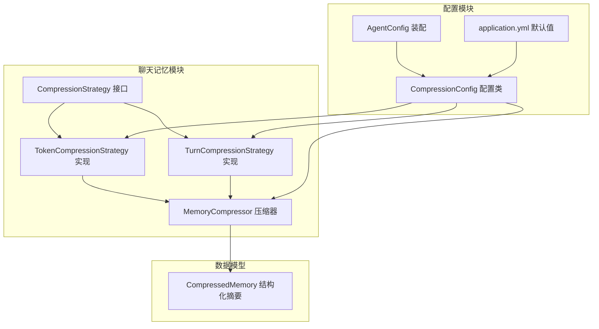
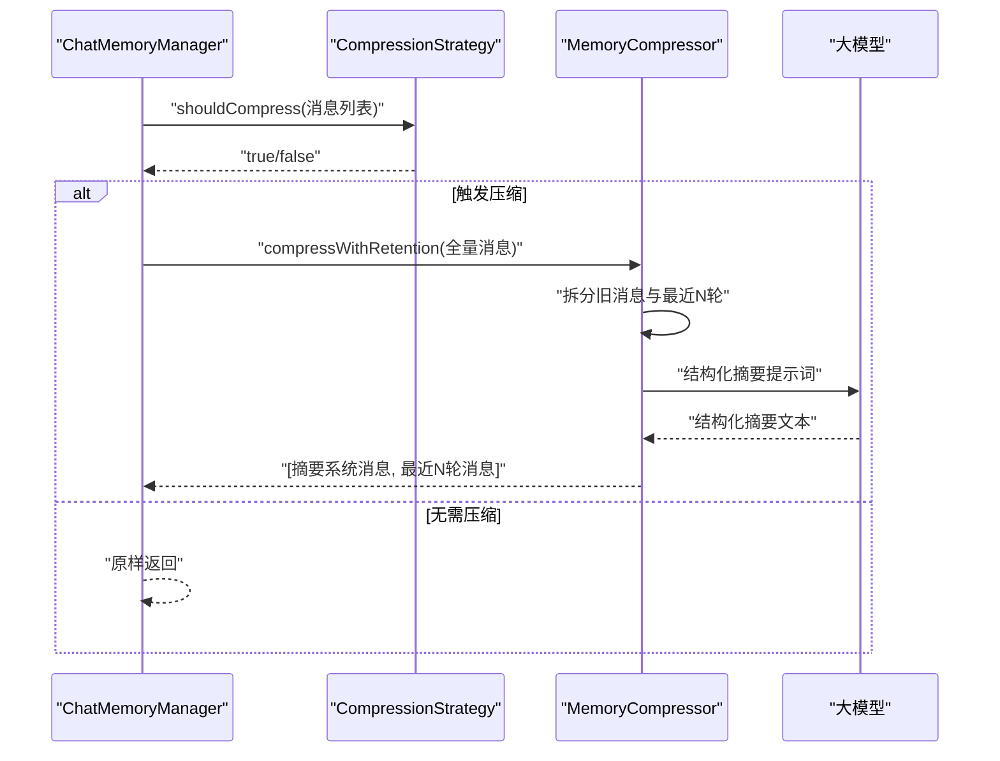
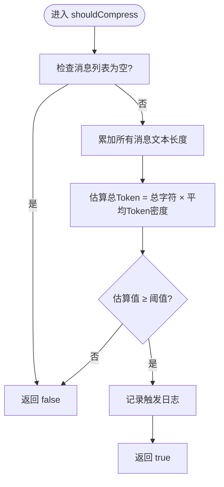
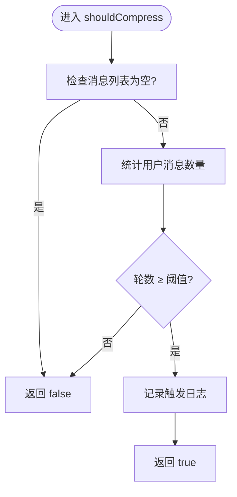
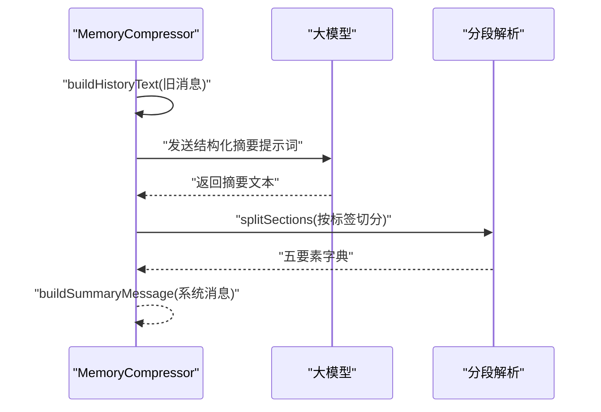
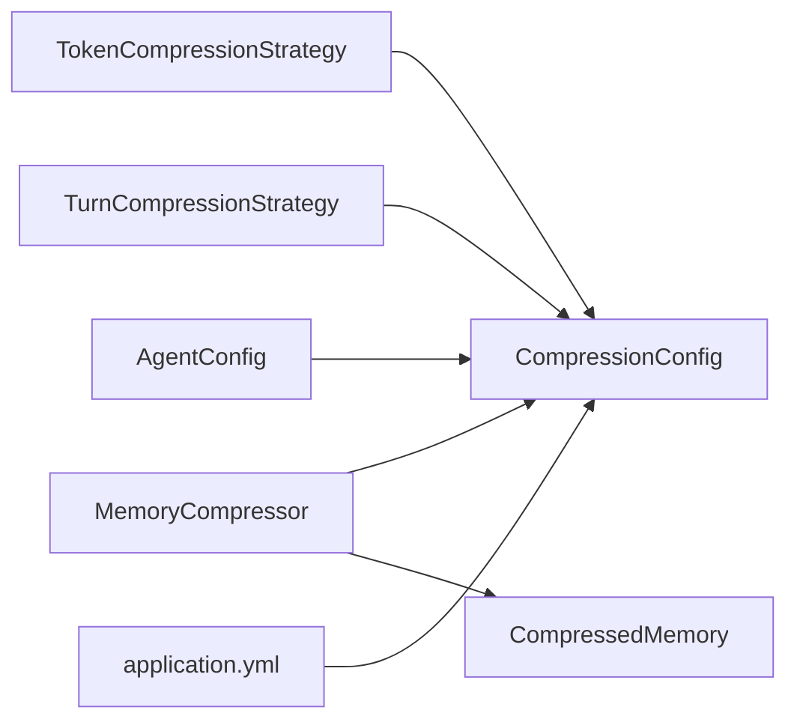

# Token压缩策略

<cite>
**本文引用的文件**
- [TokenCompressionStrategy.java](file://src/main/java/com/yupi/yuaiagent/chatmemory/TokenCompressionStrategy.java)
- [CompressionStrategy.java](file://src/main/java/com/yupi/yuaiagent/chatmemory/CompressionStrategy.java)
- [MemoryCompressor.java](file://src/main/java/com/yupi/yuaiagent/chatmemory/MemoryCompressor.java)
- [CompressionConfig.java](file://src/main/java/com/yupi/yuaiagent/config/CompressionConfig.java)
- [application.yml](file://src/main/resources/application.yml)
- [AgentConfig.java](file://src/main/java/com/yupi/yuaiagent/config/AgentConfig.java)
- [TurnCompressionStrategy.java](file://src/main/java/com/yupi/yuaiagent/chatmemory/TurnCompressionStrategy.java)
- [CompressedMemory.java](file://src/main/java/com/yupi/yuaiagent/agent/model/CompressedMemory.java)
</cite>

## 目录
1. [引言](#引言)
2. [项目结构](#项目结构)
3. [核心组件](#核心组件)
4. [架构总览](#架构总览)
5. [详细组件分析](#详细组件分析)
6. [依赖分析](#依赖分析)
7. [性能考虑](#性能考虑)
8. [故障排查指南](#故障排查指南)
9. [结论](#结论)
10. [附录](#附录)

## 引言
本技术文档围绕“Token压缩策略”展开，系统阐述基于Token阈值的压缩策略实现原理、算法机制与上下文保留规则，解释如何估算消息的Token数量并在超过阈值时进行智能截断，说明配置参数、默认阈值与自定义配置方法，并给出压缩过程中的上下文完整性保障机制、效果评估指标、性能影响分析与资源节省效果，最后提供实际使用示例与最佳实践。

## 项目结构
与Token压缩策略直接相关的模块主要分布在以下位置：
- chatmemory 包：压缩策略接口与具体实现（Token、轮数）、记忆压缩器
- config 包：压缩配置类与Spring Boot配置装配
- agent.model 包：压缩后的结构化记忆数据模型
- application.yml：默认阈值与保留轮数的配置来源

图表来源
- [CompressionStrategy.java:1-56](file://src/main/java/com/yupi/yuaiagent/chatmemory/CompressionStrategy.java#L1-L56)
- [TokenCompressionStrategy.java:1-96](file://src/main/java/com/yupi/yuaiagent/chatmemory/TokenCompressionStrategy.java#L1-L96)
- [TurnCompressionStrategy.java:1-139](file://src/main/java/com/yupi/yuaiagent/chatmemory/TurnCompressionStrategy.java#L1-L139)
- [MemoryCompressor.java:1-417](file://src/main/java/com/yupi/yuaiagent/chatmemory/MemoryCompressor.java#L1-L417)
- [CompressionConfig.java:1-45](file://src/main/java/com/yupi/yuaiagent/config/CompressionConfig.java#L1-L45)
- [AgentConfig.java:42-44](file://src/main/java/com/yupi/yuaiagent/config/AgentConfig.java#L42-L44)
- [application.yml:120-129](file://src/main/resources/application.yml#L120-L129)
- [CompressedMemory.java:1-78](file://src/main/java/com/yupi/yuaiagent/agent/model/CompressedMemory.java#L1-L78)

章节来源
- [CompressionStrategy.java:1-56](file://src/main/java/com/yupi/yuaiagent/chatmemory/CompressionStrategy.java#L1-L56)
- [TokenCompressionStrategy.java:1-96](file://src/main/java/com/yupi/yuaiagent/chatmemory/TokenCompressionStrategy.java#L1-L96)
- [TurnCompressionStrategy.java:1-139](file://src/main/java/com/yupi/yuaiagent/chatmemory/TurnCompressionStrategy.java#L1-L139)
- [MemoryCompressor.java:1-417](file://src/main/java/com/yupi/yuaiagent/chatmemory/MemoryCompressor.java#L1-L417)
- [CompressionConfig.java:1-45](file://src/main/java/com/yupi/yuaiagent/config/CompressionConfig.java#L1-L45)
- [AgentConfig.java:42-44](file://src/main/java/com/yupi/yuaiagent/config/AgentConfig.java#L42-L44)
- [application.yml:120-129](file://src/main/resources/application.yml#L120-L129)
- [CompressedMemory.java:1-78](file://src/main/java/com/yupi/yuaiagent/agent/model/CompressedMemory.java#L1-L78)

## 核心组件
- 压缩策略接口：定义shouldCompress、策略名称与描述等通用能力，支持多种策略类型（Token、轮数、混合）。
- Token压缩策略：基于消息总字符数估算Token数量，超过阈值触发压缩。
- 轮数压缩策略：基于对话轮数阈值触发压缩，同时提供最近N轮完整消息的保留与拆分能力。
- 记忆压缩器：调用大模型生成结构化摘要，保留最近N轮完整对话，构建系统消息加入上下文。
- 压缩配置：集中管理压缩开关、Token阈值、轮数阈值、最近保留轮数等配置项。
- 结构化压缩记忆：压缩后的五要素（关键需求、已确认信息、未解决问题、重要决策、约定事项）模型。

章节来源
- [CompressionStrategy.java:13-55](file://src/main/java/com/yupi/yuaiagent/chatmemory/CompressionStrategy.java#L13-L55)
- [TokenCompressionStrategy.java:18-96](file://src/main/java/com/yupi/yuaiagent/chatmemory/TokenCompressionStrategy.java#L18-L96)
- [TurnCompressionStrategy.java:19-139](file://src/main/java/com/yupi/yuaiagent/chatmemory/TurnCompressionStrategy.java#L19-L139)
- [MemoryCompressor.java:46-417](file://src/main/java/com/yupi/yuaiagent/chatmemory/MemoryCompressor.java#L46-L417)
- [CompressionConfig.java:21-44](file://src/main/java/com/yupi/yuaiagent/config/CompressionConfig.java#L21-L44)
- [CompressedMemory.java:17-78](file://src/main/java/com/yupi/yuaiagent/agent/model/CompressedMemory.java#L17-L78)

## 架构总览
Token压缩策略在整体架构中的位置如下：
- ChatMemoryManager在合适时机调用CompressionStrategy判断是否需要压缩
- 若需要，调用MemoryCompressor对旧消息进行压缩，保留最近N轮完整消息
- 压缩结果以系统消息形式加入上下文，继续后续推理

图表来源
- [TokenCompressionStrategy.java:32-46](file://src/main/java/com/yupi/yuaiagent/chatmemory/TokenCompressionStrategy.java#L32-L46)
- [MemoryCompressor.java:138-173](file://src/main/java/com/yupi/yuaiagent/chatmemory/MemoryCompressor.java#L138-L173)

## 详细组件分析

### 基于Token的压缩策略
- 判定逻辑：遍历消息文本，累加字符数，乘以平均每个字符的Token系数，得到估算的总Token数，与阈值比较。
- 阈值来源：支持从配置文件读取默认值，也支持运行时动态设置。
- 估算精度：采用保守的平均Token密度，适合快速估算与阈值控制；如需更精确，可替换为真实分词器。
- 上下文保留：该策略本身不负责保留最近轮数，保留逻辑由MemoryCompressor统一处理。

图表来源
- [TokenCompressionStrategy.java:32-46](file://src/main/java/com/yupi/yuaiagent/chatmemory/TokenCompressionStrategy.java#L32-L46)
- [TokenCompressionStrategy.java:62-70](file://src/main/java/com/yupi/yuaiagent/chatmemory/TokenCompressionStrategy.java#L62-L70)

章节来源
- [TokenCompressionStrategy.java:18-96](file://src/main/java/com/yupi/yuaiagent/chatmemory/TokenCompressionStrategy.java#L18-L96)

### 基于轮数的压缩策略
- 判定逻辑：统计用户消息数量作为轮数，与轮数阈值比较。
- 保留与拆分：提供获取最近N轮完整消息与需要压缩的旧消息的方法，便于MemoryCompressor统一处理。
- 与Token策略的关系：两者可独立工作，也可配合使用（例如在Agent层选择合适的策略类型）。

图表来源
- [TurnCompressionStrategy.java:34-47](file://src/main/java/com/yupi/yuaiagent/chatmemory/TurnCompressionStrategy.java#L34-L47)
- [TurnCompressionStrategy.java:63-71](file://src/main/java/com/yupi/yuaiagent/chatmemory/TurnCompressionStrategy.java#L63-L71)

章节来源
- [TurnCompressionStrategy.java:19-139](file://src/main/java/com/yupi/yuaiagent/chatmemory/TurnCompressionStrategy.java#L19-L139)

### 记忆压缩器与上下文保留
- 结构化摘要：通过固定标签的提示词要求大模型输出五要素摘要，便于稳定解析。
- 上下文保留：默认保留最近N轮完整对话（每轮约2条消息），其余历史压缩为摘要系统消息。
- 降级策略：当大模型输出异常时，回退为统计式摘要，仍保持五要素结构，确保上下文一致性。
- 结果封装：压缩结果可直接作为系统消息加入上下文，或进一步封装为结构化压缩记忆对象。

图表来源
- [MemoryCompressor.java:205-232](file://src/main/java/com/yupi/yuaiagent/chatmemory/MemoryCompressor.java#L205-L232)
- [MemoryCompressor.java:265-291](file://src/main/java/com/yupi/yuaiagent/chatmemory/MemoryCompressor.java#L265-L291)
- [MemoryCompressor.java:237-259](file://src/main/java/com/yupi/yuaiagent/chatmemory/MemoryCompressor.java#L237-L259)

章节来源
- [MemoryCompressor.java:46-417](file://src/main/java/com/yupi/yuaiagent/chatmemory/MemoryCompressor.java#L46-L417)
- [CompressedMemory.java:17-78](file://src/main/java/com/yupi/yuaiagent/agent/model/CompressedMemory.java#L17-L78)

### 压缩配置与默认阈值
- 配置项：
  - 启用开关：是否启用记忆压缩
  - Token阈值：超过此值触发压缩
  - 轮数阈值：超过此轮数触发压缩
  - 最近保留轮数：压缩后保留最近N轮完整消息
- 默认值来源：application.yml中的环境变量占位符，便于在不同环境灵活调整。
- 统一装配：通过AgentConfig启用配置属性绑定，集中管理阈值语义。

章节来源
- [CompressionConfig.java:21-44](file://src/main/java/com/yupi/yuaiagent/config/CompressionConfig.java#L21-L44)
- [application.yml:120-129](file://src/main/resources/application.yml#L120-L129)
- [AgentConfig.java:42-44](file://src/main/java/com/yupi/yuaiagent/config/AgentConfig.java#L42-L44)

## 依赖分析
- TokenCompressionStrategy依赖：
  - 配置：从环境变量读取阈值
  - 日志：触发压缩时记录日志
- MemoryCompressor依赖：
  - 大模型：用于生成结构化摘要
  - 配置：最近保留轮数
  - 降级策略：当大模型异常时生成统计摘要
- 配置装配：
  - CompressionConfig通过@EnableConfigurationProperties装配为Bean
  - AgentConfig启用CompressionConfig，确保全局可用

图表来源
- [TokenCompressionStrategy.java:23-24](file://src/main/java/com/yupi/yuaiagent/chatmemory/TokenCompressionStrategy.java#L23-L24)
- [TurnCompressionStrategy.java:24-31](file://src/main/java/com/yupi/yuaiagent/chatmemory/TurnCompressionStrategy.java#L24-L31)
- [MemoryCompressor.java:54-55](file://src/main/java/com/yupi/yuaiagent/chatmemory/MemoryCompressor.java#L54-L55)
- [CompressionConfig.java:22-43](file://src/main/java/com/yupi/yuaiagent/config/CompressionConfig.java#L22-L43)
- [AgentConfig.java:42-44](file://src/main/java/com/yupi/yuaiagent/config/AgentConfig.java#L42-L44)
- [application.yml:120-129](file://src/main/resources/application.yml#L120-L129)
- [CompressedMemory.java:17-78](file://src/main/java/com/yupi/yuaiagent/agent/model/CompressedMemory.java#L17-L78)

章节来源
- [TokenCompressionStrategy.java:1-96](file://src/main/java/com/yupi/yuaiagent/chatmemory/TokenCompressionStrategy.java#L1-L96)
- [TurnCompressionStrategy.java:1-139](file://src/main/java/com/yupi/yuaiagent/chatmemory/TurnCompressionStrategy.java#L1-L139)
- [MemoryCompressor.java:1-417](file://src/main/java/com/yupi/yuaiagent/chatmemory/MemoryCompressor.java#L1-L417)
- [CompressionConfig.java:1-45](file://src/main/java/com/yupi/yuaiagent/config/CompressionConfig.java#L1-L45)
- [AgentConfig.java:42-44](file://src/main/java/com/yupi/yuaiagent/config/AgentConfig.java#L42-L44)
- [application.yml:120-129](file://src/main/resources/application.yml#L120-L129)
- [CompressedMemory.java:1-78](file://src/main/java/com/yupi/yuaiagent/agent/model/CompressedMemory.java#L1-L78)

## 性能考虑
- Token估算复杂度：线性扫描消息列表，时间复杂度O(n)，空间复杂度O(1)，开销极低。
- 压缩调用成本：一次压缩涉及大模型调用与文本解析，成本取决于模型与输入长度。
- 上下文保留策略：保留最近N轮完整消息，既能保证上下文连贯，又能显著降低Token占用。
- 降级策略：在大模型异常时仍能输出结构化摘要，避免中断，提升鲁棒性。
- 资源节省：通过压缩历史消息，可在长对话场景下显著减少Token消耗，降低推理成本。

## 故障排查指南
- 压缩未触发
  - 检查消息列表是否为空或文本为空
  - 核对阈值配置与环境变量是否正确
- 压缩触发但上下文异常
  - 确认最近保留轮数配置合理
  - 检查MemoryCompressor的拆分逻辑是否符合预期
- 大模型输出异常
  - 查看日志中压缩失败记录
  - 确认提示词格式与标签是否满足要求
  - 检查降级策略是否生效
- 配置未生效
  - 确认AgentConfig已启用CompressionConfig
  - 检查application.yml中的占位符是否被正确替换

章节来源
- [TokenCompressionStrategy.java:32-46](file://src/main/java/com/yupi/yuaiagent/chatmemory/TokenCompressionStrategy.java#L32-L46)
- [MemoryCompressor.java:118-126](file://src/main/java/com/yupi/yuaiagent/chatmemory/MemoryCompressor.java#L118-L126)
- [MemoryCompressor.java:327-365](file://src/main/java/com/yupi/yuaiagent/chatmemory/MemoryCompressor.java#L327-L365)
- [AgentConfig.java:42-44](file://src/main/java/com/yupi/yuaiagent/config/AgentConfig.java#L42-L44)

## 结论
Token压缩策略通过简单的字符计数与阈值比较，实现了对长对话的有效控制；结合MemoryCompressor的结构化摘要与最近轮次保留，既保证了上下文完整性，又显著降低了Token消耗。通过集中配置与统一装配，系统具备良好的可扩展性与可维护性。在实际部署中，建议根据业务对话长度与模型成本，动态调整阈值与保留轮数，以达到最佳的成本与效果平衡。

## 附录

### 配置参数与默认值
- 启用开关：chat.memory.compression.enabled（默认启用）
- Token阈值：chat.memory.compression.token-threshold（默认4000）
- 轮数阈值：chat.memory.compression.turn-threshold（默认20）
- 最近保留轮数：chat.memory.compression.recent-turns（默认5）

章节来源
- [CompressionConfig.java:25-43](file://src/main/java/com/yupi/yuaiagent/config/CompressionConfig.java#L25-L43)
- [application.yml:120-129](file://src/main/resources/application.yml#L120-L129)

### 自定义配置方法
- 通过application.yml覆盖默认值
- 通过环境变量注入（占位符方式）
- 在运行时通过Setter方法动态调整（适用于Token与轮数阈值）

章节来源
- [application.yml:120-129](file://src/main/resources/application.yml#L120-L129)
- [TokenCompressionStrategy.java:92-94](file://src/main/java/com/yupi/yuaiagent/chatmemory/TokenCompressionStrategy.java#L92-L94)
- [TurnCompressionStrategy.java:121-123](file://src/main/java/com/yupi/yuaiagent/chatmemory/TurnCompressionStrategy.java#L121-L123)

### 使用示例与最佳实践
- 示例场景
  - 长对话客服：提高Token阈值，延长保留轮数，确保上下文连贯
  - 知识问答：适度降低阈值，频繁压缩，控制成本
- 最佳实践
  - 根据模型与预算设定合理阈值
  - 保留最近2-5轮完整对话，兼顾成本与效果
  - 监控压缩失败率，必要时优化提示词或增加降级策略
  - 在生产环境通过环境变量统一管理配置，避免硬编码