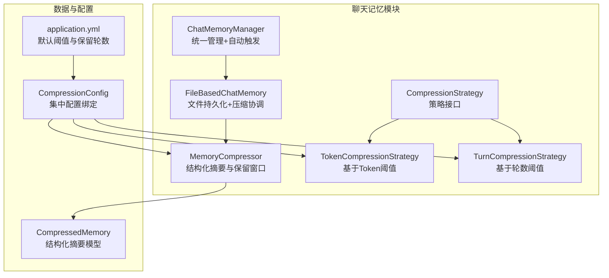
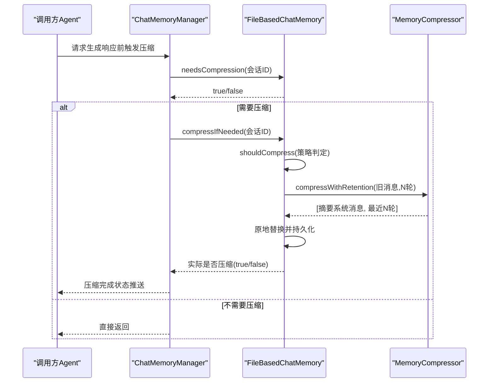
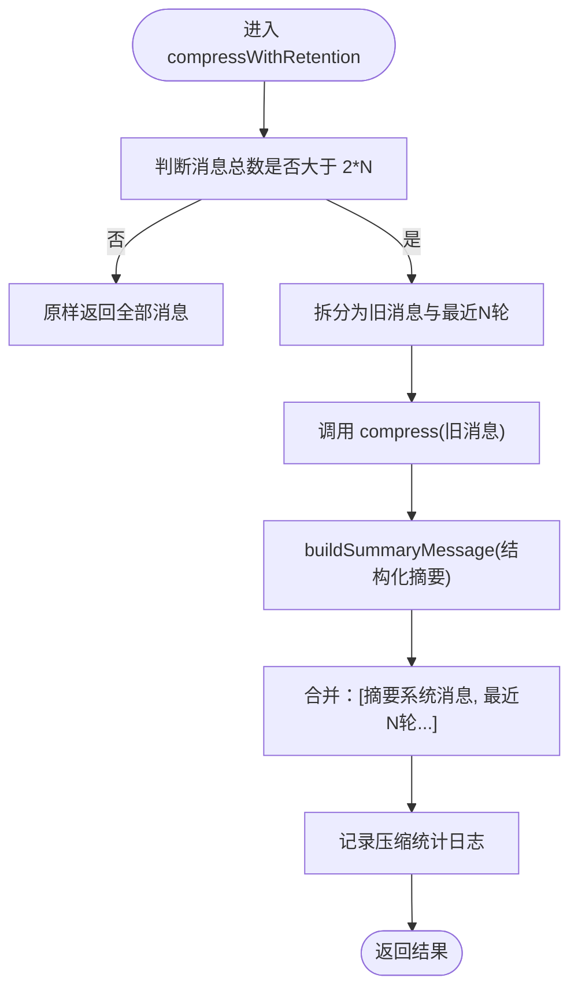
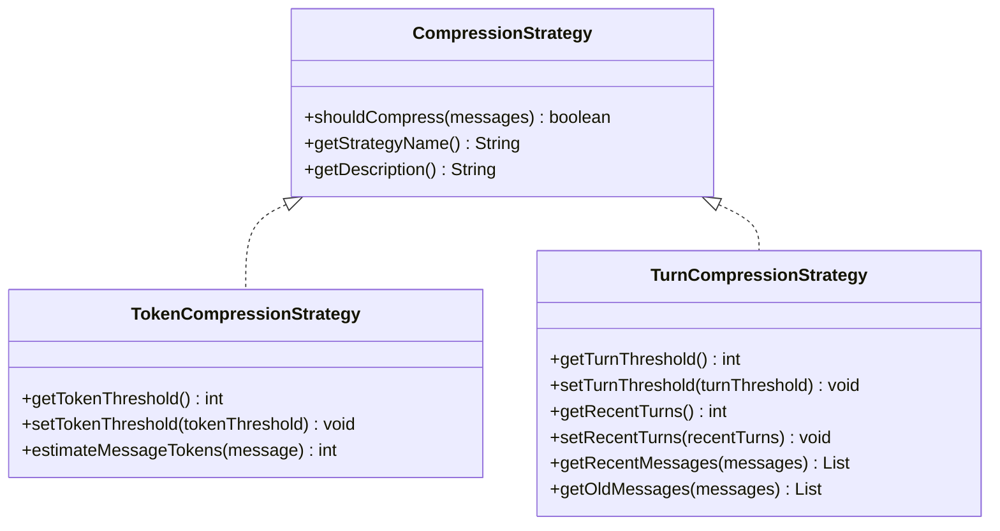
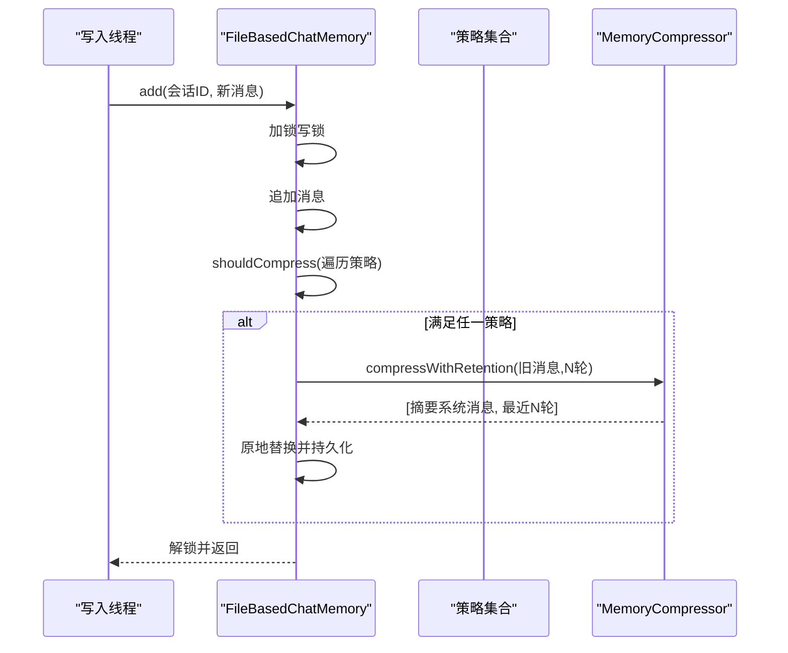
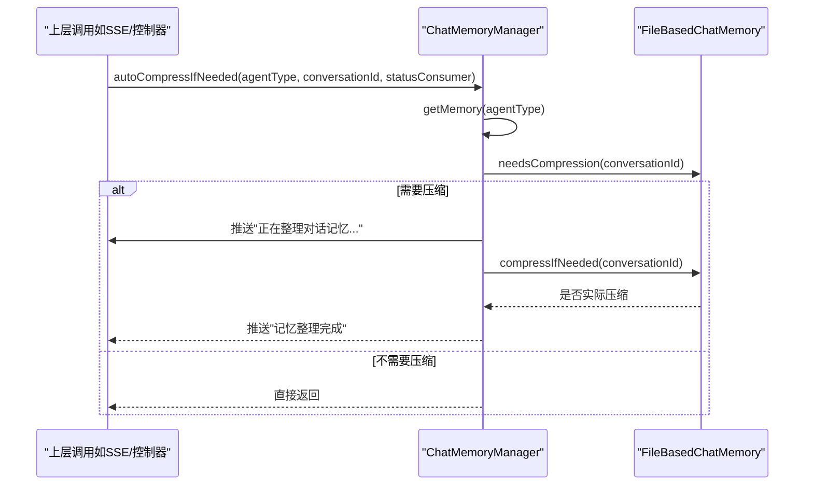
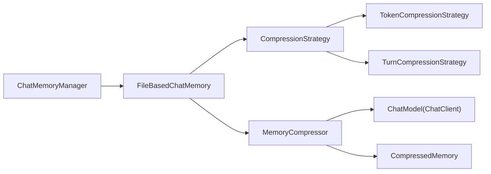

# 内存压缩器核心

<cite>
**本文引用的文件**
- [MemoryCompressor.java](file://src/main/java/com/yupi/yuaiagent/chatmemory/MemoryCompressor.java)
- [CompressionStrategy.java](file://src/main/java/com/yupi/yuaiagent/chatmemory/CompressionStrategy.java)
- [TokenCompressionStrategy.java](file://src/main/java/com/yupi/yuaiagent/chatmemory/TokenCompressionStrategy.java)
- [TurnCompressionStrategy.java](file://src/main/java/com/yupi/yuaiagent/chatmemory/TurnCompressionStrategy.java)
- [FileBasedChatMemory.java](file://src/main/java/com/yupi/yuaiagent/chatmemory/FileBasedChatMemory.java)
- [ChatMemoryManager.java](file://src/main/java/com/yupi/yuaiagent/chatmemory/ChatMemoryManager.java)
- [CompressedMemory.java](file://src/main/java/com/yupi/yuaiagent/agent/model/CompressedMemory.java)
- [CompressionConfig.java](file://src/main/java/com/yupi/yuaiagent/config/CompressionConfig.java)
- [application.yml](file://src/main/resources/application.yml)
</cite>

## 目录
1. [简介](#简介)
2. [项目结构](#项目结构)
3. [核心组件](#核心组件)
4. [架构总览](#架构总览)
5. [详细组件分析](#详细组件分析)
6. [依赖分析](#依赖分析)
7. [性能考虑](#性能考虑)
8. [故障排除指南](#故障排除指南)
9. [结论](#结论)
10. [附录](#附录)

## 简介
本文件面向MemoryCompressor核心组件，提供从架构设计到运行机制、配置接口、扩展方式、并发与状态管理、错误处理、性能监控与优化建议的全景式技术文档。重点涵盖：
- 压缩调度机制：策略选择算法与触发条件
- 执行协调过程：MemoryCompressor与FileBasedChatMemory、ChatMemoryManager之间的协作
- 复杂场景处理：多策略并存、保留窗口、降级摘要
- 配置接口与扩展：如何通过配置与策略接口扩展自定义策略
- 并发控制与状态管理：读写锁、压缩状态、线程安全序列化
- 错误处理与降级：压缩失败时的降级摘要与状态回滚
- 性能监控与优化：日志指标、资源使用与优化建议
- 使用示例、集成指南与故障排除

## 项目结构
围绕“对话记忆压缩”主题，核心文件分布如下：
- chatmemory 包：MemoryCompressor、策略接口与实现、文件持久化聊天记忆、统一管理器
- agent/model 包：CompressedMemory 数据模型
- config 包：CompressionConfig 集中式配置绑定
- resources：application.yml 提供默认阈值与保留轮数配置

图表来源
- [MemoryCompressor.java:1-417](file://src/main/java/com/yupi/yuaiagent/chatmemory/MemoryCompressor.java#L1-L417)
- [CompressionStrategy.java:1-56](file://src/main/java/com/yupi/yuaiagent/chatmemory/CompressionStrategy.java#L1-L56)
- [TokenCompressionStrategy.java:1-96](file://src/main/java/com/yupi/yuaiagent/chatmemory/TokenCompressionStrategy.java#L1-L96)
- [TurnCompressionStrategy.java:1-139](file://src/main/java/com/yupi/yuaiagent/chatmemory/TurnCompressionStrategy.java#L1-L139)
- [FileBasedChatMemory.java:1-339](file://src/main/java/com/yupi/yuaiagent/chatmemory/FileBasedChatMemory.java#L1-L339)
- [ChatMemoryManager.java:1-341](file://src/main/java/com/yupi/yuaiagent/chatmemory/ChatMemoryManager.java#L1-L341)
- [CompressedMemory.java:1-78](file://src/main/java/com/yupi/yuaiagent/agent/model/CompressedMemory.java#L1-L78)
- [CompressionConfig.java:1-44](file://src/main/java/com/yupi/yuaiagent/config/CompressionConfig.java#L1-L44)
- [application.yml:120-129](file://src/main/resources/application.yml#L120-L129)

章节来源
- [application.yml:120-129](file://src/main/resources/application.yml#L120-L129)
- [CompressionConfig.java:1-44](file://src/main/java/com/yupi/yuaiagent/config/CompressionConfig.java#L1-L44)

## 核心组件
- MemoryCompressor：负责将历史对话压缩为结构化摘要（五要素），并按“保留最近N轮完整对话”的策略组织上下文消息。
- CompressionStrategy 及其实现：定义何时触发压缩（Token阈值、轮数阈值、混合策略类型）。
- FileBasedChatMemory：文件持久化聊天记忆，负责在写入时自动触发压缩、在读取时并发安全访问。
- ChatMemoryManager：统一管理不同Agent类型的记忆，提供自动触发压缩、状态查询与状态消息推送。
- CompressedMemory：结构化摘要的数据模型，承载五要素字段与元信息。
- CompressionConfig 与 application.yml：集中配置压缩阈值与保留轮数。

章节来源
- [MemoryCompressor.java:1-417](file://src/main/java/com/yupi/yuaiagent/chatmemory/MemoryCompressor.java#L1-L417)
- [CompressionStrategy.java:1-56](file://src/main/java/com/yupi/yuaiagent/chatmemory/CompressionStrategy.java#L1-L56)
- [TokenCompressionStrategy.java:1-96](file://src/main/java/com/yupi/yuaiagent/chatmemory/TokenCompressionStrategy.java#L1-L96)
- [TurnCompressionStrategy.java:1-139](file://src/main/java/com/yupi/yuaiagent/chatmemory/TurnCompressionStrategy.java#L1-L139)
- [FileBasedChatMemory.java:1-339](file://src/main/java/com/yupi/yuaiagent/chatmemory/FileBasedChatMemory.java#L1-L339)
- [ChatMemoryManager.java:1-341](file://src/main/java/com/yupi/yuaiagent/chatmemory/ChatMemoryManager.java#L1-L341)
- [CompressedMemory.java:1-78](file://src/main/java/com/yupi/yuaiagent/agent/model/CompressedMemory.java#L1-L78)
- [CompressionConfig.java:1-44](file://src/main/java/com/yupi/yuaiagent/config/CompressionConfig.java#L1-L44)
- [application.yml:120-129](file://src/main/resources/application.yml#L120-L129)

## 架构总览
MemoryCompressor在整体架构中的职责与交互如下：
- 输入：全量对话消息（历史+最新）
- 处理：拆分“旧消息”与“最近N轮”，对旧消息调用LLM生成结构化摘要，保留最近N轮完整消息
- 输出：系统消息（摘要）+ 最近N轮消息，作为新的上下文
- 协作：FileBasedChatMemory在写入时触发策略判定与压缩；ChatMemoryManager在生成响应前自动触发压缩并推送状态

图表来源
- [ChatMemoryManager.java:156-188](file://src/main/java/com/yupi/yuaiagent/chatmemory/ChatMemoryManager.java#L156-L188)
- [FileBasedChatMemory.java:243-257](file://src/main/java/com/yupi/yuaiagent/chatmemory/FileBasedChatMemory.java#L243-L257)
- [MemoryCompressor.java:138-173](file://src/main/java/com/yupi/yuaiagent/chatmemory/MemoryCompressor.java#L138-L173)

## 详细组件分析

### MemoryCompressor：结构化摘要与保留窗口
- 功能要点
  - 将历史消息转为结构化摘要（五要素：关键需求、已确认信息、未解决问题、重要决策、约定事项）
  - 保留最近N轮完整对话（默认5轮），不足时原样返回
  - LLM调用失败时的降级摘要，保证上下文连续性
- 关键流程
  - compressWithRetention：拆分旧消息与最近N轮，调用compress处理旧消息，拼接结果
  - summarize：构建历史文本、调用LLM、按标签切分、封装CompressedMemory
  - buildSummaryMessage：将结构化摘要封装为系统消息
  - createSimpleSummary：失败降级，仍保留五要素结构
- 配置入口
  - recentTurns：通过@Value读取配置项，也可动态设置
- 数据模型
  - CompressedMemory：承载摘要与五要素字段

图表来源
- [MemoryCompressor.java:138-173](file://src/main/java/com/yupi/yuaiagent/chatmemory/MemoryCompressor.java#L138-L173)
- [MemoryCompressor.java:205-232](file://src/main/java/com/yupi/yuaiagent/chatmemory/MemoryCompressor.java#L205-L232)
- [MemoryCompressor.java:237-259](file://src/main/java/com/yupi/yuaiagent/chatmemory/MemoryCompressor.java#L237-L259)

章节来源
- [MemoryCompressor.java:1-417](file://src/main/java/com/yupi/yuaiagent/chatmemory/MemoryCompressor.java#L1-L417)
- [CompressedMemory.java:1-78](file://src/main/java/com/yupi/yuaiagent/agent/model/CompressedMemory.java#L1-L78)

### 策略接口与实现：Token与轮数
- CompressionStrategy：定义shouldCompress、策略名与描述，枚举StrategyType（TOKEN_BASED、TURN_BASED、HYBRID）
- TokenCompressionStrategy：基于消息总字符数估算Token，超过阈值触发压缩（默认4000）
- TurnCompressionStrategy：基于用户消息计数计算轮数，超过阈值触发压缩（默认20轮），同时提供最近N轮保留逻辑

图表来源
- [CompressionStrategy.java:1-56](file://src/main/java/com/yupi/yuaiagent/chatmemory/CompressionStrategy.java#L1-L56)
- [TokenCompressionStrategy.java:1-96](file://src/main/java/com/yupi/yuaiagent/chatmemory/TokenCompressionStrategy.java#L1-L96)
- [TurnCompressionStrategy.java:1-139](file://src/main/java/com/yupi/yuaiagent/chatmemory/TurnCompressionStrategy.java#L1-L139)

章节来源
- [CompressionStrategy.java:1-56](file://src/main/java/com/yupi/yuaiagent/chatmemory/CompressionStrategy.java#L1-L56)
- [TokenCompressionStrategy.java:1-96](file://src/main/java/com/yupi/yuaiagent/chatmemory/TokenCompressionStrategy.java#L1-L96)
- [TurnCompressionStrategy.java:1-139](file://src/main/java/com/yupi/yuaiagent/chatmemory/TurnCompressionStrategy.java#L1-L139)

### 文件持久化聊天记忆：自动压缩与并发控制
- FileBasedChatMemory
  - add：写入时在写锁保护下追加消息，随后判定是否需要压缩并持久化
  - compressIfNeeded：在写锁保护下原地压缩并持久化，保证对话连续性
  - needsCompression：只做阈值判定，不执行压缩
  - shouldCompress：遍历策略集合，任一满足即触发
  - resolveRetainTurns：优先使用TurnCompressionStrategy的recentTurns，否则回退到MemoryCompressor默认值
  - 线程安全：Kryo通过ThreadLocal隔离，避免并发序列化污染
  - 压缩状态：CompressionState记录压缩中、次数、最近时间、成功与否、累计压缩消息数

图表来源
- [FileBasedChatMemory.java:74-90](file://src/main/java/com/yupi/yuaiagent/chatmemory/FileBasedChatMemory.java#L74-L90)
- [FileBasedChatMemory.java:119-131](file://src/main/java/com/yupi/yuaiagent/chatmemory/FileBasedChatMemory.java#L119-L131)
- [FileBasedChatMemory.java:147-194](file://src/main/java/com/yupi/yuaiagent/chatmemory/FileBasedChatMemory.java#L147-L194)

章节来源
- [FileBasedChatMemory.java:1-339](file://src/main/java/com/yupi/yuaiagent/chatmemory/FileBasedChatMemory.java#L1-L339)

### 统一管理器：自动触发与状态推送
- ChatMemoryManager
  - autoCompressIfNeeded：在生成响应前按策略阈值自动触发压缩，推送“正在整理对话记忆...”与“记忆整理完成”
  - getCompressionStatus：对外暴露压缩状态视图（包含agentType、conversationId、compressing、compressionCount、lastCompressionTime、lastCompressionSuccess、lastErrorMessage、totalMessagesCompressed）
  - pushStatus：安全推送状态消息，吞掉接收者异常，避免影响压缩与对话流程
  - getMemory：按Agent类型懒加载FileBasedChatMemory实例

图表来源
- [ChatMemoryManager.java:156-188](file://src/main/java/com/yupi/yuaiagent/chatmemory/ChatMemoryManager.java#L156-L188)
- [ChatMemoryManager.java:115-138](file://src/main/java/com/yupi/yuaiagent/chatmemory/ChatMemoryManager.java#L115-L138)

章节来源
- [ChatMemoryManager.java:1-341](file://src/main/java/com/yupi/yuaiagent/chatmemory/ChatMemoryManager.java#L1-L341)

### 结构化摘要数据模型：CompressedMemory
- 字段：chatId、agentType、summary、keyNeeds、confirmedInfo、unresolvedIssues、decisions、agreements、originalMessageCount、compressedAt、version
- 用途：承载MemoryCompressor产出的五要素摘要，便于后续检索与展示

章节来源
- [CompressedMemory.java:1-78](file://src/main/java/com/yupi/yuaiagent/agent/model/CompressedMemory.java#L1-L78)

### 配置接口与扩展机制
- CompressionConfig：集中绑定chat.memory.compression.*配置项（enabled、tokenThreshold、turnThreshold、recentTurns）
- application.yml：提供默认阈值与保留轮数（可通过环境变量覆盖）
- 扩展机制
  - 自定义策略：实现CompressionStrategy接口，注册为Spring Bean即可参与shouldCompress判定
  - 自定义保留轮数：通过TurnCompressionStrategy或MemoryCompressor的recentTurns进行配置
  - 自定义阈值：通过CompressionConfig或application.yml覆盖默认值

章节来源
- [CompressionConfig.java:1-44](file://src/main/java/com/yupi/yuaiagent/config/CompressionConfig.java#L1-L44)
- [application.yml:120-129](file://src/main/resources/application.yml#L120-L129)
- [CompressionStrategy.java:1-56](file://src/main/java/com/yupi/yuaiagent/chatmemory/CompressionStrategy.java#L1-L56)

## 依赖分析
- 组件耦合
  - FileBasedChatMemory 依赖 MemoryCompressor 与 CompressionStrategy 列表
  - ChatMemoryManager 依赖 FileBasedChatMemory 与 CompressionStrategy 列表
  - MemoryCompressor 依赖 ChatModel（通过ChatClient）与 CompressedMemory
- 外部依赖
  - Spring AI ChatClient/ChatModel
  - Kryo（序列化）
  - Lombok（日志、Builder、Getter/Setter）

图表来源
- [ChatMemoryManager.java:56-62](file://src/main/java/com/yupi/yuaiagent/chatmemory/ChatMemoryManager.java#L56-L62)
- [FileBasedChatMemory.java:56-65](file://src/main/java/com/yupi/yuaiagent/chatmemory/FileBasedChatMemory.java#L56-L65)
- [MemoryCompressor.java:97-101](file://src/main/java/com/yupi/yuaiagent/chatmemory/MemoryCompressor.java#L97-L101)

章节来源
- [ChatMemoryManager.java:1-341](file://src/main/java/com/yupi/yuaiagent/chatmemory/ChatMemoryManager.java#L1-L341)
- [FileBasedChatMemory.java:1-339](file://src/main/java/com/yupi/yuaiagent/chatmemory/FileBasedChatMemory.java#L1-L339)
- [MemoryCompressor.java:1-417](file://src/main/java/com/yupi/yuaiagent/chatmemory/MemoryCompressor.java#L1-L417)

## 性能考虑
- 压缩触发频率
  - Token阈值与轮数阈值共同作用，避免频繁压缩；合理设置recentTurns平衡上下文长度与性能
- LLM调用成本
  - 历史文本越长，调用成本越高；通过保留窗口有效控制输入长度
- 序列化性能
  - Kryo通过ThreadLocal隔离，避免并发序列化竞争；建议定期清理磁盘缓存目录
- 并发与锁
  - 写锁保护压缩与持久化，读锁用于只读访问；在高并发场景下，建议评估阈值与保留窗口以降低写锁持有时间
- 降级摘要
  - LLM失败时的降级摘要可保证对话连续性，但会损失结构化信息；建议在监控中关注压缩失败率

[本节为通用性能指导，无需特定文件引用]

## 故障排除指南
- 压缩失败
  - 现象：日志报错“对话记忆压缩失败”，MemoryCompressor返回降级摘要
  - 处理：检查LLM可用性、网络连通性；查看降级摘要内容以定位问题
- 压缩未触发
  - 现象：消息增长但未压缩
  - 处理：确认策略是否启用、阈值是否过大；通过ChatMemoryManager.getCompressionStatus查看状态
- 状态推送异常
  - 现象：前端未收到“正在整理对话记忆...”或“记忆整理完成”
  - 处理：ChatMemoryManager.pushStatus已吞掉接收者异常，检查上层调用链路
- 文件读写失败
  - 现象：读取/保存记忆文件失败
  - 处理：检查磁盘权限与空间；确认BASE_DIR路径存在且可写

章节来源
- [FileBasedChatMemory.java:274-297](file://src/main/java/com/yupi/yuaiagent/chatmemory/FileBasedChatMemory.java#L274-L297)
- [MemoryCompressor.java:118-126](file://src/main/java/com/yupi/yuaiagent/chatmemory/MemoryCompressor.java#L118-L126)
- [ChatMemoryManager.java:241-250](file://src/main/java/com/yupi/yuaiagent/chatmemory/ChatMemoryManager.java#L241-L250)

## 结论
MemoryCompressor通过“结构化摘要+最近N轮保留”的双轨机制，在保证上下文完整性的同时显著降低历史对话的Token占用。其与策略接口、文件持久化记忆与统一管理器的协同，实现了可配置、可扩展、可监控的压缩调度体系。通过合理的阈值与保留窗口配置、完善的错误降级与状态推送，能够在复杂业务场景中稳定运行并持续优化性能。

[本节为总结性内容，无需特定文件引用]

## 附录

### 使用示例与集成指南
- 在生成响应前调用 ChatMemoryManager.autoCompressIfNeeded，自动触发压缩并推送状态
- 通过 CompressionConfig 或 application.yml 调整阈值与保留轮数
- 自定义策略：实现 CompressionStrategy 并注册为Bean，参与shouldCompress判定

章节来源
- [ChatMemoryManager.java:156-188](file://src/main/java/com/yupi/yuaiagent/chatmemory/ChatMemoryManager.java#L156-L188)
- [CompressionConfig.java:1-44](file://src/main/java/com/yupi/yuaiagent/config/CompressionConfig.java#L1-L44)
- [application.yml:120-129](file://src/main/resources/application.yml#L120-L129)

### 性能监控指标与优化建议
- 指标
  - 压缩次数、最近压缩时间、上次成功与否、累计压缩消息数
  - 压缩失败率（结合降级摘要）
  - Token阈值与轮数阈值命中率
- 建议
  - 根据业务对话长度与Token消耗趋势调整阈值
  - 合理设置recentTurns，避免过度保留导致上下文冗余
  - 监控LLM调用耗时与失败率，必要时引入缓存或限流

章节来源
- [ChatMemoryManager.java:115-138](file://src/main/java/com/yupi/yuaiagent/chatmemory/ChatMemoryManager.java#L115-L138)
- [FileBasedChatMemory.java:185-194](file://src/main/java/com/yupi/yuaiagent/chatmemory/FileBasedChatMemory.java#L185-L194)