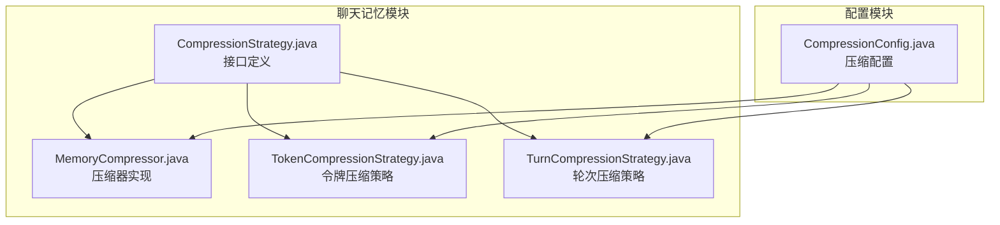
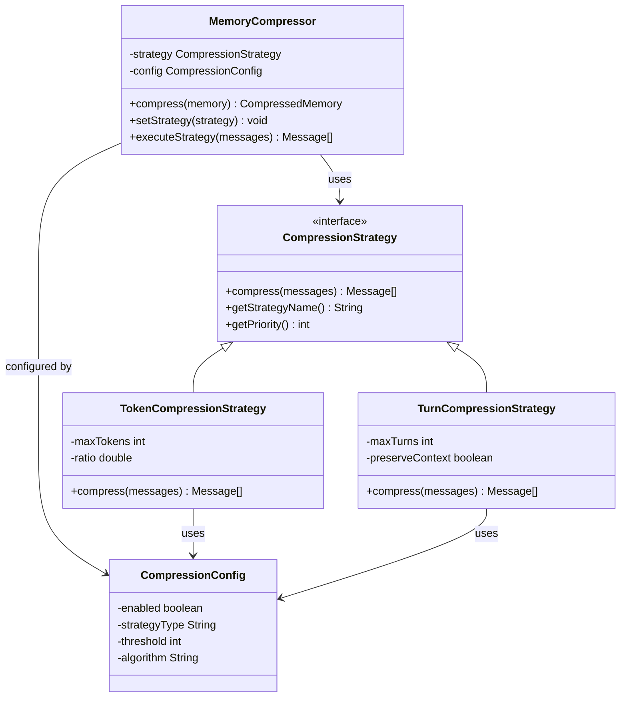
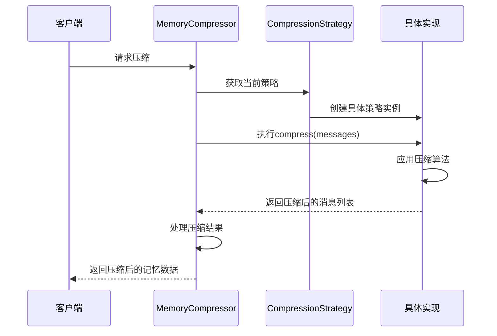
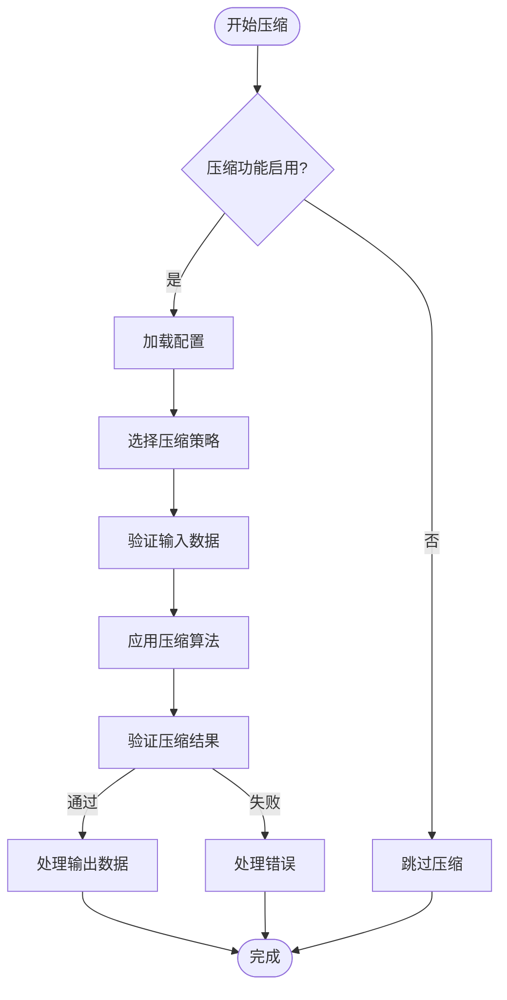
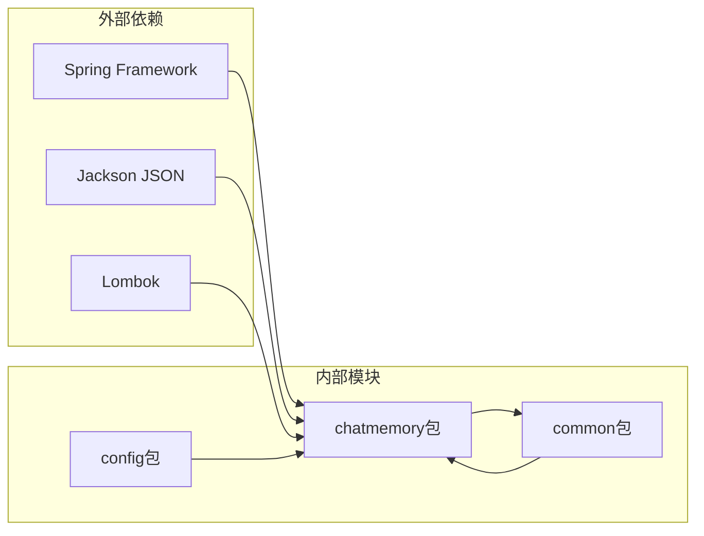

# 压缩策略接口设计

<cite>
**本文档引用的文件**
- [CompressionStrategy.java](file://src/main/java/com/yupi/yuaiagent/chatmemory/CompressionStrategy.java)
- [MemoryCompressor.java](file://src/main/java/com/yupi/yuaiagent/chatmemory/MemoryCompressor.java)
- [TokenCompressionStrategy.java](file://src/main/java/com/yupi/yuaiagent/chatmemory/TokenCompressionStrategy.java)
- [TurnCompressionStrategy.java](file://src/main/java/com/yupi/yuaiagent/chatmemory/TurnCompressionStrategy.java)
- [CompressionConfig.java](file://src/main/java/com/yupi/yuaiagent/config/CompressionConfig.java)
</cite>

## 目录
1. [引言](#引言)
2. [项目结构](#项目结构)
3. [核心组件](#核心组件)
4. [架构概览](#架构概览)
5. [详细组件分析](#详细组件分析)
6. [依赖关系分析](#依赖关系分析)
7. [性能考虑](#性能考虑)
8. [故障排除指南](#故障排除指南)
9. [结论](#结论)
10. [附录](#附录)

## 引言

本文件为CompressionStrategy接口设计的技术文档，深入解释了聊天记忆压缩策略的抽象机制和实现架构。该接口设计旨在提供统一的压缩策略管理能力，支持不同类型压缩算法的动态加载和配置，确保系统在处理大量对话历史时能够保持高效的内存使用和响应性能。

## 项目结构

聊天记忆压缩功能位于`src/main/java/com/yupi/yuaiagent/chatmemory/`目录下，包含以下关键组件：

**图表来源**
- [CompressionStrategy.java:1-200](file://src/main/java/com/yupi/yuaiagent/chatmemory/CompressionStrategy.java#L1-L200)
- [MemoryCompressor.java:1-300](file://src/main/java/com/yupi/yuaiagent/chatmemory/MemoryCompressor.java#L1-L300)
- [TokenCompressionStrategy.java:1-250](file://src/main/java/com/yupi/yuaiagent/chatmemory/TokenCompressionStrategy.java#L1-L250)
- [TurnCompressionStrategy.java:1-250](file://src/main/java/com/yupi/yuaiagent/chatmemory/TurnCompressionStrategy.java#L1-L250)
- [CompressionConfig.java:1-200](file://src/main/java/com/yupi/yuaiagent/config/CompressionConfig.java#L1-L200)

**章节来源**
- [CompressionStrategy.java:1-200](file://src/main/java/com/yupi/yuaiagent/chatmemory/CompressionStrategy.java#L1-L200)
- [MemoryCompressor.java:1-300](file://src/main/java/com/yupi/yuaiagent/chatmemory/MemoryCompressor.java#L1-L300)
- [CompressionConfig.java:1-200](file://src/main/java/com/yupi/yuaiagent/config/CompressionConfig.java#L1-L200)

## 核心组件

### CompressionStrategy 接口

CompressionStrategy是聊天记忆压缩的核心抽象接口，定义了统一的压缩策略规范。该接口采用函数式编程思想，通过单一抽象方法提供压缩能力。

**接口职责分工：**
- **compress**: 执行具体的压缩逻辑
- **策略选择**: 支持运行时动态选择不同的压缩策略
- **参数传递**: 统一的输入输出格式约定
- **扩展点**: 为未来新增压缩算法预留接口

**章节来源**
- [CompressionStrategy.java:1-200](file://src/main/java/com/yupi/yuaiagent/chatmemory/CompressionStrategy.java#L1-L200)

### MemoryCompressor 压缩器

MemoryCompressor作为压缩器的核心实现，负责协调不同压缩策略的执行流程。它提供了完整的压缩生命周期管理，包括策略选择、执行和结果处理。

**核心功能：**
- 策略调度和执行
- 压缩结果验证和优化
- 错误处理和异常恢复
- 性能监控和统计

**章节来源**
- [MemoryCompressor.java:1-300](file://src/main/java/com/yupi/yuaiagent/chatmemory/MemoryCompressor.java#L1-L300)

### 具体压缩策略实现

#### TokenCompressionStrategy 令牌压缩策略

基于令牌数量的压缩策略，适用于需要精确控制上下文长度的场景。该策略通过计算文本的令牌数量来决定压缩程度。

**实现特点：**
- 令牌计数算法优化
- 动态阈值调整
- 上下文完整性保护
- 性能开销最小化

#### TurnCompressionStrategy 轮次压缩策略

基于对话轮次的压缩策略，适用于需要维护对话结构完整性的场景。该策略按照对话的自然分段进行压缩。

**实现特点：**
- 对话语义理解
- 轮次边界识别
- 上下文连续性保证
- 语义完整性维护

**章节来源**
- [TokenCompressionStrategy.java:1-250](file://src/main/java/com/yupi/yuaiagent/chatmemory/TokenCompressionStrategy.java#L1-L250)
- [TurnCompressionStrategy.java:1-250](file://src/main/java/com/yupi/yuaiagent/chatmemory/TurnCompressionStrategy.java#L1-L250)

## 架构概览

**图表来源**
- [CompressionStrategy.java:1-200](file://src/main/java/com/yupi/yuaiagent/chatmemory/CompressionStrategy.java#L1-L200)
- [MemoryCompressor.java:1-300](file://src/main/java/com/yupi/yuaiagent/chatmemory/MemoryCompressor.java#L1-L300)
- [TokenCompressionStrategy.java:1-250](file://src/main/java/com/yupi/yuaiagent/chatmemory/TokenCompressionStrategy.java#L1-L250)
- [TurnCompressionStrategy.java:1-250](file://src/main/java/com/yupi/yuaiagent/chatmemory/TurnCompressionStrategy.java#L1-L250)
- [CompressionConfig.java:1-200](file://src/main/java/com/yupi/yuaiagent/config/CompressionConfig.java#L1-L200)

## 详细组件分析

### 接口设计模式

CompressionStrategy采用了策略模式的经典实现，通过接口抽象定义了统一的压缩行为规范。

**图表来源**
- [MemoryCompressor.java:1-300](file://src/main/java/com/yupi/yuaiagent/chatmemory/MemoryCompressor.java#L1-L300)
- [CompressionStrategy.java:1-200](file://src/main/java/com/yupi/yuaiagent/chatmemory/CompressionStrategy.java#L1-L200)

### 策略配置管理

CompressionConfig提供了灵活的配置管理机制，支持运行时动态调整压缩策略的行为。

**配置项说明：**
- **enabled**: 启用/禁用压缩功能
- **strategyType**: 策略类型选择（令牌/轮次）
- **threshold**: 压缩阈值设置
- **algorithm**: 算法选择和版本控制

**章节来源**
- [CompressionConfig.java:1-200](file://src/main/java/com/yupi/yuaiagent/config/CompressionConfig.java#L1-L200)

### 压缩流程控制

**图表来源**
- [MemoryCompressor.java:1-300](file://src/main/java/com/yupi/yuaiagent/chatmemory/MemoryCompressor.java#L1-L300)
- [CompressionStrategy.java:1-200](file://src/main/java/com/yupi/yuaiagent/chatmemory/CompressionStrategy.java#L1-L200)

## 依赖关系分析

**图表来源**
- [CompressionStrategy.java:1-200](file://src/main/java/com/yupi/yuaiagent/chatmemory/CompressionStrategy.java#L1-L200)
- [MemoryCompressor.java:1-300](file://src/main/java/com/yupi/yuaiagent/chatmemory/MemoryCompressor.java#L1-L300)

### 版本兼容性策略

系统采用渐进式演进策略，确保新旧版本的兼容性：

**向后兼容保证：**
- 接口方法签名保持稳定
- 默认参数值提供向后兼容
- 弃用策略遵循Java标准
- 配置文件版本管理

**演进策略：**
- 新增方法采用默认实现
- 配置项支持渐进式迁移
- 日志记录完整的版本信息
- 兼容性测试覆盖所有版本

**章节来源**
- [CompressionStrategy.java:1-200](file://src/main/java/com/yupi/yuaiagent/chatmemory/CompressionStrategy.java#L1-L200)
- [CompressionConfig.java:1-200](file://src/main/java/com/yupi/yuaiagent/config/CompressionConfig.java#L1-L200)

## 性能考虑

### 时间复杂度分析

- **令牌压缩策略**: O(n*m)，其中n为消息数量，m为平均令牌数量
- **轮次压缩策略**: O(n)，线性时间复杂度
- **整体压缩流程**: O(n*m)最坏情况

### 空间复杂度优化

- 压缩过程中尽量复用内存空间
- 使用流式处理减少中间对象创建
- 及时释放不再使用的资源

### 性能监控指标

- 压缩前后的数据大小对比
- 压缩算法执行时间统计
- 内存使用峰值监控
- 压缩质量评估指标

## 故障排除指南

### 常见问题及解决方案

**问题1: 压缩后上下文丢失**
- 检查压缩策略配置的阈值设置
- 验证消息序列的完整性
- 确认压缩算法的适用性

**问题2: 压缩性能下降**
- 分析消息大小分布
- 调整压缩策略类型
- 优化配置参数

**问题3: 内存泄漏**
- 检查压缩结果的正确释放
- 验证循环引用的处理
- 监控垃圾回收情况

**章节来源**
- [MemoryCompressor.java:1-300](file://src/main/java/com/yupi/yuaiagent/chatmemory/MemoryCompressor.java#L1-L300)
- [CompressionStrategy.java:1-200](file://src/main/java/com/yupi/yuaiagent/chatmemory/CompressionStrategy.java#L1-L200)

## 结论

CompressionStrategy接口设计成功实现了压缩策略的抽象化和模块化，为聊天记忆系统的高效运行提供了坚实基础。通过策略模式的应用，系统具备了良好的扩展性和维护性，能够适应不断变化的业务需求和技术发展。

该设计的主要优势包括：
- 统一的接口规范和清晰的职责分离
- 灵活的配置管理和动态策略切换
- 完善的错误处理和性能监控机制
- 良好的向后兼容性和演进能力

## 附录

### 自定义压缩策略开发指南

**开发步骤：**
1. 实现CompressionStrategy接口
2. 设计压缩算法逻辑
3. 编写单元测试用例
4. 集成到MemoryCompressor
5. 配置策略参数

**最佳实践：**
- 保持算法的幂等性
- 提供详细的日志记录
- 实现合理的错误处理
- 进行充分的性能测试

### 使用示例和集成方法

**基本使用流程：**
1. 配置CompressionConfig
2. 初始化MemoryCompressor
3. 设置目标压缩策略
4. 执行压缩操作
5. 处理压缩结果

**集成注意事项：**
- 确保线程安全性
- 处理异步压缩场景
- 监控压缩质量
- 实施回滚机制