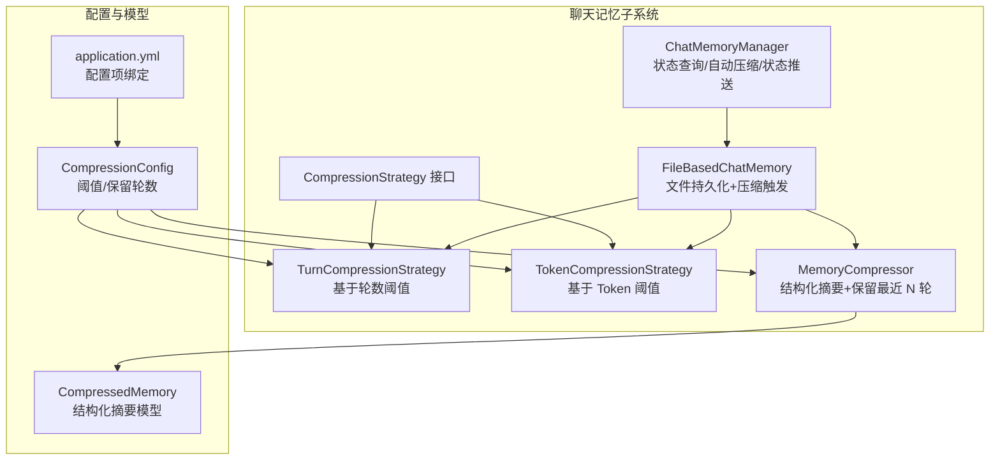
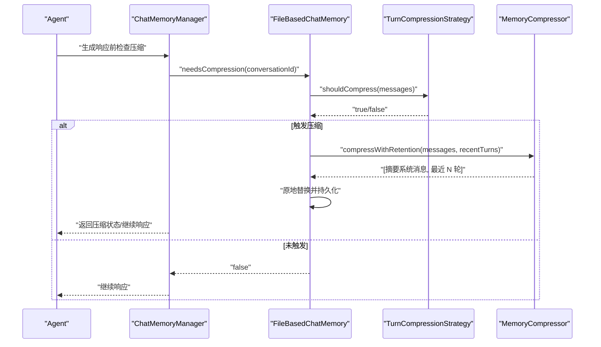
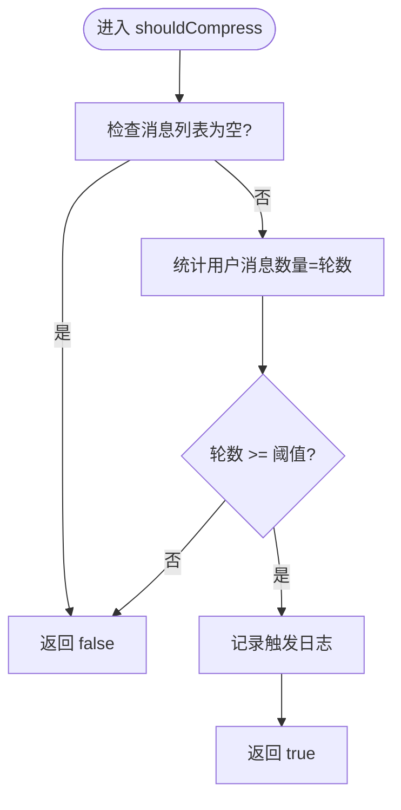
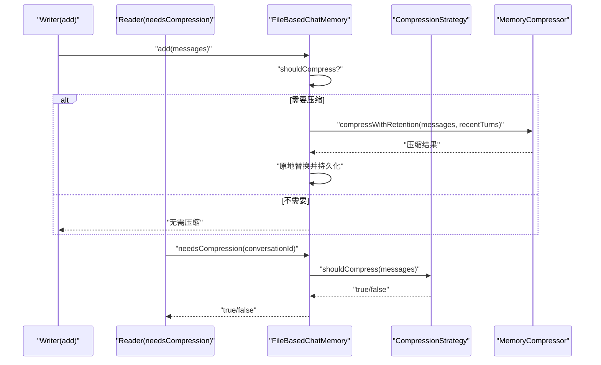
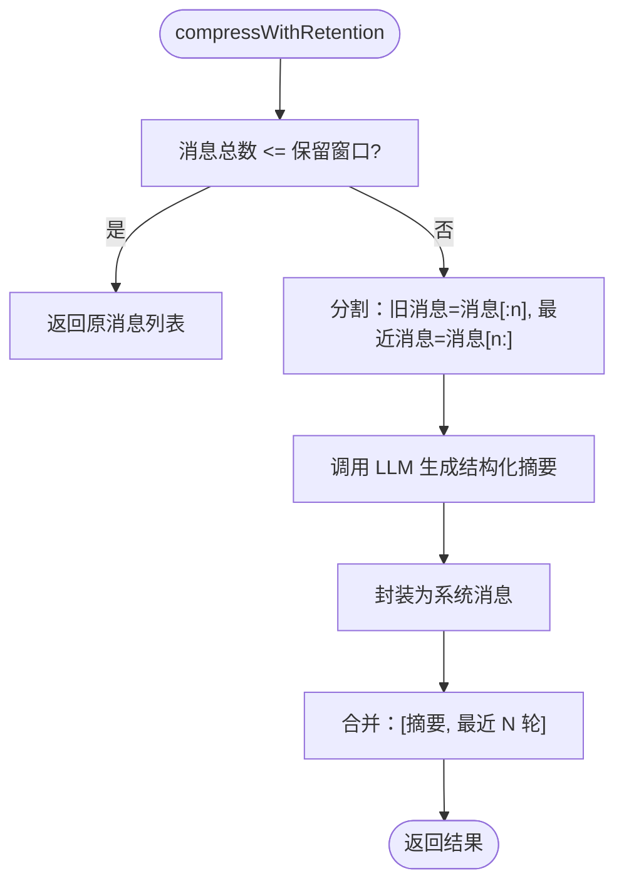
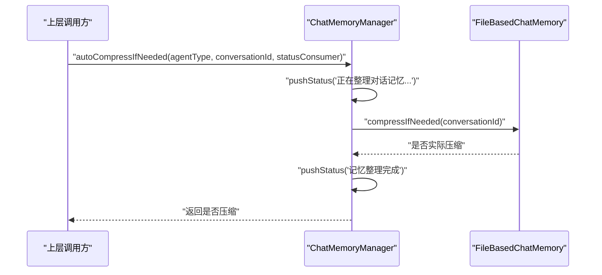
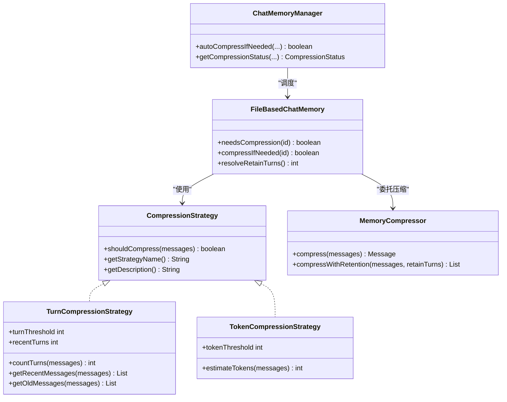

# 回合压缩策略

<cite>
**本文引用的文件**
- [TurnCompressionStrategy.java](file://src/main/java/com/yupi/yuaiagent/chatmemory/TurnCompressionStrategy.java)
- [CompressionStrategy.java](file://src/main/java/com/yupi/yuaiagent/chatmemory/CompressionStrategy.java)
- [MemoryCompressor.java](file://src/main/java/com/yupi/yuaiagent/chatmemory/MemoryCompressor.java)
- [FileBasedChatMemory.java](file://src/main/java/com/yupi/yuaiagent/chatmemory/FileBasedChatMemory.java)
- [ChatMemoryManager.java](file://src/main/java/com/yupi/yuaiagent/chatmemory/ChatMemoryManager.java)
- [TokenCompressionStrategy.java](file://src/main/java/com/yupi/yuaiagent/chatmemory/TokenCompressionStrategy.java)
- [CompressionConfig.java](file://src/main/java/com/yupi/yuaiagent/config/CompressionConfig.java)
- [application.yml](file://src/main/resources/application.yml)
- [CompressedMemory.java](file://src/main/java/com/yupi/yuaiagent/agent/model/CompressedMemory.java)
</cite>

## 目录
1. [引言](#引言)
2. [项目结构](#项目结构)
3. [核心组件](#核心组件)
4. [架构总览](#架构总览)
5. [详细组件分析](#详细组件分析)
6. [依赖分析](#依赖分析)
7. [性能考量](#性能考量)
8. [故障排查指南](#故障排查指南)
9. [结论](#结论)
10. [附录](#附录)

## 引言
本文件围绕“回合压缩策略”展开，系统性阐述 TurnCompressionStrategy 的设计理念、实现机制与工程实践，包括对话回合识别方法、回合边界判断、压缩触发时机、阈值配置、压缩比例控制、质量评估标准，以及对用户体验的影响与优化策略。文档同时给出与 Token 压缩策略、结构化摘要压缩器的协同使用方式与最佳实践。

## 项目结构
围绕对话记忆压缩的关键模块如下：
- 压缩策略接口与具体实现：定义何时触发压缩、策略名称与描述
- 文件持久化聊天记忆：负责会话消息的增删查、压缩触发与持久化
- 记忆压缩器：将历史对话压缩为结构化摘要并保留最近 N 轮完整消息
- 管理器：统一对外提供压缩状态查询、自动触发压缩与状态推送
- 配置：集中管理压缩阈值与保留轮数

**图表来源**
- [CompressionStrategy.java:13-54](file://src/main/java/com/yupi/yuaiagent/chatmemory/CompressionStrategy.java#L13-L54)
- [TurnCompressionStrategy.java:19-57](file://src/main/java/com/yupi/yuaiagent/chatmemory/TurnCompressionStrategy.java#L19-L57)
- [TokenCompressionStrategy.java:18-56](file://src/main/java/com/yupi/yuaiagent/chatmemory/TokenCompressionStrategy.java#L18-L56)
- [FileBasedChatMemory.java:33-65](file://src/main/java/com/yupi/yuaiagent/chatmemory/FileBasedChatMemory.java#L33-L65)
- [MemoryCompressor.java:46-102](file://src/main/java/com/yupi/yuaiagent/chatmemory/MemoryCompressor.java#L46-L102)
- [ChatMemoryManager.java:38-63](file://src/main/java/com/yupi/yuaiagent/chatmemory/ChatMemoryManager.java#L38-L63)
- [CompressionConfig.java:21-44](file://src/main/java/com/yupi/yuaiagent/config/CompressionConfig.java#L21-L44)
- [application.yml:120-129](file://src/main/resources/application.yml#L120-L129)
- [CompressedMemory.java:17-77](file://src/main/java/com/yupi/yuaiagent/agent/model/CompressedMemory.java#L17-L77)

**章节来源**
- [CompressionStrategy.java:13-54](file://src/main/java/com/yupi/yuaiagent/chatmemory/CompressionStrategy.java#L13-L54)
- [TurnCompressionStrategy.java:19-57](file://src/main/java/com/yupi/yuaiagent/chatmemory/TurnCompressionStrategy.java#L19-L57)
- [TokenCompressionStrategy.java:18-56](file://src/main/java/com/yupi/yuaiagent/chatmemory/TokenCompressionStrategy.java#L18-L56)
- [FileBasedChatMemory.java:33-65](file://src/main/java/com/yupi/yuaiagent/chatmemory/FileBasedChatMemory.java#L33-L65)
- [MemoryCompressor.java:46-102](file://src/main/java/com/yupi/yuaiagent/chatmemory/MemoryCompressor.java#L46-L102)
- [ChatMemoryManager.java:38-63](file://src/main/java/com/yupi/yuaiagent/chatmemory/ChatMemoryManager.java#L38-L63)
- [CompressionConfig.java:21-44](file://src/main/java/com/yupi/yuaiagent/config/CompressionConfig.java#L21-L44)
- [application.yml:120-129](file://src/main/resources/application.yml#L120-L129)
- [CompressedMemory.java:17-77](file://src/main/java/com/yupi/yuaiagent/agent/model/CompressedMemory.java#L17-L77)

## 核心组件
- 压缩策略接口：定义 shouldCompress、策略名与描述，统一策略类型枚举
- 轮数压缩策略：基于“用户消息数量”计算对话轮数，超过阈值触发压缩
- Token 压缩策略：基于字符数估算 Token 数，超过阈值触发压缩
- 文件持久化聊天记忆：在写锁保护下原地压缩并持久化，支持多策略判定
- 记忆压缩器：将旧消息压缩为结构化摘要系统消息，保留最近 N 轮完整消息
- 管理器：对外提供压缩状态查询、自动触发压缩与状态消息推送
- 配置：集中管理压缩阈值与保留轮数，绑定 application.yml

**章节来源**
- [CompressionStrategy.java:13-54](file://src/main/java/com/yupi/yuaiagent/chatmemory/CompressionStrategy.java#L13-L54)
- [TurnCompressionStrategy.java:19-57](file://src/main/java/com/yupi/yuaiagent/chatmemory/TurnCompressionStrategy.java#L19-L57)
- [TokenCompressionStrategy.java:18-56](file://src/main/java/com/yupi/yuaiagent/chatmemory/TokenCompressionStrategy.java#L18-L56)
- [FileBasedChatMemory.java:33-65](file://src/main/java/com/yupi/yuaiagent/chatmemory/FileBasedChatMemory.java#L33-L65)
- [MemoryCompressor.java:46-102](file://src/main/java/com/yupi/yuaiagent/chatmemory/MemoryCompressor.java#L46-L102)
- [ChatMemoryManager.java:38-63](file://src/main/java/com/yupi/yuaiagent/chatmemory/ChatMemoryManager.java#L38-L63)
- [CompressionConfig.java:21-44](file://src/main/java/com/yupi/yuaiagent/config/CompressionConfig.java#L21-L44)

## 架构总览
回合压缩策略在整体架构中的位置与交互如下：

**图表来源**
- [ChatMemoryManager.java:156-188](file://src/main/java/com/yupi/yuaiagent/chatmemory/ChatMemoryManager.java#L156-L188)
- [FileBasedChatMemory.java:223-257](file://src/main/java/com/yupi/yuaiagent/chatmemory/FileBasedChatMemory.java#L223-L257)
- [TurnCompressionStrategy.java:33-47](file://src/main/java/com/yupi/yuaiagent/chatmemory/TurnCompressionStrategy.java#L33-L47)
- [MemoryCompressor.java:138-173](file://src/main/java/com/yupi/yuaiagent/chatmemory/MemoryCompressor.java#L138-L173)

## 详细组件分析

### 轮数压缩策略（TurnCompressionStrategy）
- 设计理念
  - 以“用户消息数量”作为对话轮数的近似指标，一轮=一个用户消息+一个助手回复
  - 当轮数达到阈值时触发压缩，保留最近 N 轮完整消息，其余历史压缩为结构化摘要
- 关键实现点
  - 轮数统计：遍历消息列表，统计用户消息数量即为轮数
  - 触发判定：轮数≥阈值返回 true
  - 保留策略：最近 N 轮=2N 条消息（每轮两条）
  - 配置项：轮数阈值与最近轮数，支持运行时读取与设置
- 复杂度与性能
  - 轮数统计为 O(n)，触发判定 O(1)，整体 O(n)
  - 保留/旧消息切片为 O(n)，内存占用与消息条数线性相关

**图表来源**
- [TurnCompressionStrategy.java:33-47](file://src/main/java/com/yupi/yuaiagent/chatmemory/TurnCompressionStrategy.java#L33-L47)
- [TurnCompressionStrategy.java:63-71](file://src/main/java/com/yupi/yuaiagent/chatmemory/TurnCompressionStrategy.java#L63-L71)

**章节来源**
- [TurnCompressionStrategy.java:19-57](file://src/main/java/com/yupi/yuaiagent/chatmemory/TurnCompressionStrategy.java#L19-L57)
- [TurnCompressionStrategy.java:79-109](file://src/main/java/com/yupi/yuaiagent/chatmemory/TurnCompressionStrategy.java#L79-L109)
- [TurnCompressionStrategy.java:114-137](file://src/main/java/com/yupi/yuaiagent/chatmemory/TurnCompressionStrategy.java#L114-L137)

### 文件持久化聊天记忆（FileBasedChatMemory）
- 压缩触发与执行
  - 在 add 时检查是否需要压缩，若需要则调用 compressConversation 原地替换并持久化
  - needsCompression 仅做阈值判定，不执行压缩
  - compressIfNeeded 在写锁保护下执行压缩并持久化，返回是否实际压缩
- 保留轮数解析
  - 优先从 TurnCompressionStrategy 读取最近轮数，否则回退到 MemoryCompressor 的默认值
- 线程安全与容错
  - 使用读写锁保证并发安全
  - Kryo 序列化通过 ThreadLocal 避免多线程共享导致的错乱
  - 文件读写失败记录日志，避免污染后续对话

**图表来源**
- [FileBasedChatMemory.java:74-90](file://src/main/java/com/yupi/yuaiagent/chatmemory/FileBasedChatMemory.java#L74-L90)
- [FileBasedChatMemory.java:119-131](file://src/main/java/com/yupi/yuaiagent/chatmemory/FileBasedChatMemory.java#L119-L131)
- [FileBasedChatMemory.java:147-194](file://src/main/java/com/yupi/yuaiagent/chatmemory/FileBasedChatMemory.java#L147-L194)
- [FileBasedChatMemory.java:223-257](file://src/main/java/com/yupi/yuaiagent/chatmemory/FileBasedChatMemory.java#L223-L257)

**章节来源**
- [FileBasedChatMemory.java:33-65](file://src/main/java/com/yupi/yuaiagent/chatmemory/FileBasedChatMemory.java#L33-L65)
- [FileBasedChatMemory.java:119-131](file://src/main/java/com/yupi/yuaiagent/chatmemory/FileBasedChatMemory.java#L119-L131)
- [FileBasedChatMemory.java:147-194](file://src/main/java/com/yupi/yuaiagent/chatmemory/FileBasedChatMemory.java#L147-L194)
- [FileBasedChatMemory.java:223-257](file://src/main/java/com/yupi/yuaiagent/chatmemory/FileBasedChatMemory.java#L223-L257)
- [FileBasedChatMemory.java:203-212](file://src/main/java/com/yupi/yuaiagent/chatmemory/FileBasedChatMemory.java#L203-L212)

### 记忆压缩器（MemoryCompressor）
- 结构化摘要
  - 五要素：关键需求、已确认信息、未解决问题、重要决策、约定事项
  - 提示词要求 LLM 严格按标签分段输出，便于稳定解析
- 保留最近 N 轮
  - 旧消息压缩为一条系统消息，与最近 N 轮完整消息拼接
  - 保留轮数来自配置，与 TurnCompressionStrategy 保持一致
- 降级策略
  - LLM 压缩失败时，生成简化摘要（统计用户消息数、抽取关键点），仍保留五要素结构
- 复杂度与性能
  - 文本拼接与标签解析 O(m)，m 为历史消息字符数
  - LLM 调用成本取决于历史长度与模型参数

**图表来源**
- [MemoryCompressor.java:138-173](file://src/main/java/com/yupi/yuaiagent/chatmemory/MemoryCompressor.java#L138-L173)
- [MemoryCompressor.java:205-232](file://src/main/java/com/yupi/yuaiagent/chatmemory/MemoryCompressor.java#L205-L232)
- [MemoryCompressor.java:237-259](file://src/main/java/com/yupi/yuaiagent/chatmemory/MemoryCompressor.java#L237-L259)
- [MemoryCompressor.java:330-365](file://src/main/java/com/yupi/yuaiagent/chatmemory/MemoryCompressor.java#L330-L365)

**章节来源**
- [MemoryCompressor.java:46-102](file://src/main/java/com/yupi/yuaiagent/chatmemory/MemoryCompressor.java#L46-L102)
- [MemoryCompressor.java:138-173](file://src/main/java/com/yupi/yuaiagent/chatmemory/MemoryCompressor.java#L138-L173)
- [MemoryCompressor.java:205-232](file://src/main/java/com/yupi/yuaiagent/chatmemory/MemoryCompressor.java#L205-L232)
- [MemoryCompressor.java:237-259](file://src/main/java/com/yupi/yuaiagent/chatmemory/MemoryCompressor.java#L237-L259)
- [MemoryCompressor.java:330-365](file://src/main/java/com/yupi/yuaiagent/chatmemory/MemoryCompressor.java#L330-L365)
- [CompressedMemory.java:17-77](file://src/main/java/com/yupi/yuaiagent/agent/model/CompressedMemory.java#L17-L77)

### 管理器（ChatMemoryManager）
- 功能职责
  - 统一管理不同 Agent 类型的聊天记忆实例
  - 对外提供压缩状态查询、自动触发压缩与状态消息推送
  - 在压缩过程中推送“正在整理对话记忆...”与“记忆整理完成”
- 自动压缩流程
  - 先判定阈值，再推送状态，执行压缩并持久化，最后推送完成状态
  - 异常吞掉，保证对话连续性不受影响

**图表来源**
- [ChatMemoryManager.java:156-188](file://src/main/java/com/yupi/yuaiagent/chatmemory/ChatMemoryManager.java#L156-L188)
- [ChatMemoryManager.java:206-236](file://src/main/java/com/yupi/yuaiagent/chatmemory/ChatMemoryManager.java#L206-L236)

**章节来源**
- [ChatMemoryManager.java:38-63](file://src/main/java/com/yupi/yuaiagent/chatmemory/ChatMemoryManager.java#L38-L63)
- [ChatMemoryManager.java:156-188](file://src/main/java/com/yupi/yuaiagent/chatmemory/ChatMemoryManager.java#L156-L188)
- [ChatMemoryManager.java:206-236](file://src/main/java/com/yupi/yuaiagent/chatmemory/ChatMemoryManager.java#L206-L236)

### 配置与阈值
- 配置绑定
  - application.yml 中 chat.memory.compression.* 绑定到 CompressionConfig
  - 包括：enabled、token-threshold、turn-threshold、recent-turns
- 策略读取
  - TurnCompressionStrategy 读取 turn-threshold 与 recent-turns
  - TokenCompressionStrategy 读取 token-threshold
  - MemoryCompressor 读取 recent-turns
- 配置示例
  - 在 application.yml 中设置 turn-threshold、token-threshold、recent-turns
  - 通过环境变量覆盖默认值，便于不同环境差异化配置

**章节来源**
- [CompressionConfig.java:21-44](file://src/main/java/com/yupi/yuaiagent/config/CompressionConfig.java#L21-L44)
- [application.yml:120-129](file://src/main/resources/application.yml#L120-L129)
- [TurnCompressionStrategy.java:24-31](file://src/main/java/com/yupi/yuaiagent/chatmemory/TurnCompressionStrategy.java#L24-L31)
- [TokenCompressionStrategy.java:23-24](file://src/main/java/com/yupi/yuaiagent/chatmemory/TokenCompressionStrategy.java#L23-L24)
- [MemoryCompressor.java:54-55](file://src/main/java/com/yupi/yuaiagent/chatmemory/MemoryCompressor.java#L54-L55)

## 依赖分析
- 组件耦合
  - FileBasedChatMemory 依赖 CompressionStrategy 列表与 MemoryCompressor
  - ChatMemoryManager 统一调度 FileBasedChatMemory 与 MemoryCompressor
  - MemoryCompressor 依赖 ChatModel 与 CompressedMemory 模型
- 策略类型
  - CompressionStrategy.StrategyType 提供枚举：TOKEN_BASED、TURN_BASED、HYBRID
  - TurnCompressionStrategy 与 TokenCompressionStrategy 分别实现接口
- 外部依赖
  - Spring AI ChatClient 用于调用 LLM
  - Kryo 用于消息序列化
  - ThreadLocal 保障 Kryo 实例线程安全

**图表来源**
- [CompressionStrategy.java:13-54](file://src/main/java/com/yupi/yuaiagent/chatmemory/CompressionStrategy.java#L13-L54)
- [TurnCompressionStrategy.java:19-57](file://src/main/java/com/yupi/yuaiagent/chatmemory/TurnCompressionStrategy.java#L19-L57)
- [TokenCompressionStrategy.java:18-56](file://src/main/java/com/yupi/yuaiagent/chatmemory/TokenCompressionStrategy.java#L18-L56)
- [FileBasedChatMemory.java:33-65](file://src/main/java/com/yupi/yuaiagent/chatmemory/FileBasedChatMemory.java#L33-L65)
- [MemoryCompressor.java:46-102](file://src/main/java/com/yupi/yuaiagent/chatmemory/MemoryCompressor.java#L46-L102)
- [ChatMemoryManager.java:38-63](file://src/main/java/com/yupi/yuaiagent/chatmemory/ChatMemoryManager.java#L38-L63)

**章节来源**
- [CompressionStrategy.java:13-54](file://src/main/java/com/yupi/yuaiagent/chatmemory/CompressionStrategy.java#L13-L54)
- [TurnCompressionStrategy.java:19-57](file://src/main/java/com/yupi/yuaiagent/chatmemory/TurnCompressionStrategy.java#L19-L57)
- [TokenCompressionStrategy.java:18-56](file://src/main/java/com/yupi/yuaiagent/chatmemory/TokenCompressionStrategy.java#L18-L56)
- [FileBasedChatMemory.java:33-65](file://src/main/java/com/yupi/yuaiagent/chatmemory/FileBasedChatMemory.java#L33-L65)
- [MemoryCompressor.java:46-102](file://src/main/java/com/yupi/yuaiagent/chatmemory/MemoryCompressor.java#L46-L102)
- [ChatMemoryManager.java:38-63](file://src/main/java/com/yupi/yuaiagent/chatmemory/ChatMemoryManager.java#L38-L63)

## 性能考量
- 时间复杂度
  - 轮数统计 O(n)，Token 估算 O(n)，压缩 O(n)+LLM 调用
  - 保留/切片操作 O(n)，整体与消息条数线性相关
- 内存占用
  - 保留最近 N 轮完整消息，内存占用约为 2N 条消息大小
  - 压缩后仅保留一条摘要系统消息，显著降低长期会话内存压力
- I/O 与序列化
  - 使用 ThreadLocal 化 Kryo，避免并发序列化竞争
  - 文件读写失败记录日志，避免影响后续对话
- LLM 成本
  - 历史越长，LLM 调用成本越高
  - 合理设置 recent-turns 与 turn-threshold，平衡上下文质量与成本

[本节为通用性能讨论，不直接分析具体文件，故无“章节来源”]

## 故障排查指南
- 压缩未触发
  - 检查配置项是否正确绑定，确认 turn-threshold 与 recent-turns 合理
  - 确认 ChatMemoryManager.autoCompressIfNeeded 是否在生成响应前调用
- 压缩异常
  - 查看 MemoryCompressor 的降级逻辑是否生效（简化摘要）
  - 检查 ChatMemoryManager 的状态推送是否被正确消费
- 线程安全问题
  - 确认 Kryo 通过 ThreadLocal 使用，避免多线程共享
  - 检查读写锁是否正确加锁/释放
- 文件持久化失败
  - 查看文件路径是否存在、权限是否足够
  - 检查序列化/反序列化异常日志

**章节来源**
- [ChatMemoryManager.java:177-182](file://src/main/java/com/yupi/yuaiagent/chatmemory/ChatMemoryManager.java#L177-L182)
- [MemoryCompressor.java:121-125](file://src/main/java/com/yupi/yuaiagent/chatmemory/MemoryCompressor.java#L121-L125)
- [FileBasedChatMemory.java:289-297](file://src/main/java/com/yupi/yuaiagent/chatmemory/FileBasedChatMemory.java#L289-L297)

## 结论
回合压缩策略通过“轮数阈值”与“最近 N 轮保留”的组合，在保证对话连贯性的同时显著降低长期会话的内存与成本压力。其与 Token 压缩策略、结构化摘要压缩器形成互补：轮数策略关注对话轮次，Token 策略关注上下文长度，MemoryCompressor 统一产出结构化摘要并保留关键上下文。通过集中配置与管理器的自动触发机制，系统实现了可配置、可观测、可恢复的压缩闭环。

[本节为总结性内容，不直接分析具体文件，故无“章节来源”]

## 附录

### 阈值配置与压缩比例控制
- 配置项
  - chat.memory.compression.turn-threshold：轮数阈值（默认 20）
  - chat.memory.compression.token-threshold：Token 阈值（默认 4000）
  - chat.memory.compression.recent-turns：保留最近轮数（默认 5）
- 压缩比例估算
  - 压缩比例≈(原始消息数 - 保留消息数)/原始消息数
  - 保留消息数≈2 × recent-turns（每轮 2 条消息）
- 调优建议
  - 高对话轮次场景提高 turn-threshold 或降低 recent-turns
  - 长文本对话场景结合 Token 压缩策略与合理 recent-turns

**章节来源**
- [application.yml:120-129](file://src/main/resources/application.yml#L120-L129)
- [CompressionConfig.java:21-44](file://src/main/java/com/yupi/yuaiagent/config/CompressionConfig.java#L21-L44)
- [FileBasedChatMemory.java:203-212](file://src/main/java/com/yupi/yuaiagent/chatmemory/FileBasedChatMemory.java#L203-L212)
- [MemoryCompressor.java:54-55](file://src/main/java/com/yupi/yuaiagent/chatmemory/MemoryCompressor.java#L54-L55)

### 质量评估标准
- 结构化摘要完整性
  - 五要素字段是否齐全（关键需求、已确认信息、未解决问题、重要决策、约定事项）
- 上下文一致性
  - 最近 N 轮完整消息是否保留，避免关键信息丢失
- 用户体验
  - 压缩过程是否平滑（状态推送）、是否影响响应时延
- 成本与效果
  - 历史长度与 LLM 调用成本的平衡

**章节来源**
- [MemoryCompressor.java:205-232](file://src/main/java/com/yupi/yuaiagent/chatmemory/MemoryCompressor.java#L205-L232)
- [MemoryCompressor.java:237-259](file://src/main/java/com/yupi/yuaiagent/chatmemory/MemoryCompressor.java#L237-L259)
- [ChatMemoryManager.java:156-188](file://src/main/java/com/yupi/yuaiagent/chatmemory/ChatMemoryManager.java#L156-L188)

### 实际应用场景与优化策略
- 场景
  - 长时咨询/顾问类对话：高轮次、高上下文长度
  - 多轮检索/问答：频繁上下文累积
- 优化策略
  - 合理设置 turn-threshold 与 recent-turns，避免过度压缩
  - 在 Token 压缩策略与轮数策略之间动态选择或组合
  - 对热点会话增加 recent-turns，对长尾会话降低 recent-turns

**章节来源**
- [TokenCompressionStrategy.java:23-24](file://src/main/java/com/yupi/yuaiagent/chatmemory/TokenCompressionStrategy.java#L23-L24)
- [TurnCompressionStrategy.java:24-31](file://src/main/java/com/yupi/yuaiagent/chatmemory/TurnCompressionStrategy.java#L24-L31)
- [FileBasedChatMemory.java:203-212](file://src/main/java/com/yupi/yuaiagent/chatmemory/FileBasedChatMemory.java#L203-L212)

### 与其他压缩策略的配合使用
- 协同机制
  - FileBasedChatMemory 遍历 CompressionStrategy 列表，任一策略满足即触发压缩
  - MemoryCompressor 统一执行压缩与保留策略，确保行为一致
- 推荐组合
  - Token 压缩策略（防止上下文过长）+ 轮数压缩策略（防止轮次过多）
  - 通过 CompressionConfig 集中管理阈值，避免分散配置

**章节来源**
- [FileBasedChatMemory.java:119-131](file://src/main/java/com/yupi/yuaiagent/chatmemory/FileBasedChatMemory.java#L119-L131)
- [CompressionStrategy.java:40-54](file://src/main/java/com/yupi/yuaiagent/chatmemory/CompressionStrategy.java#L40-L54)
- [CompressionConfig.java:21-44](file://src/main/java/com/yupi/yuaiagent/config/CompressionConfig.java#L21-L44)