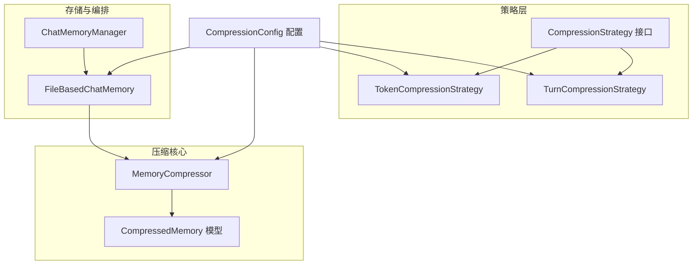
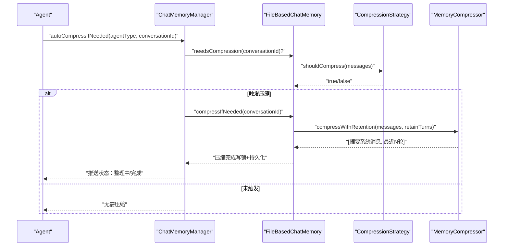
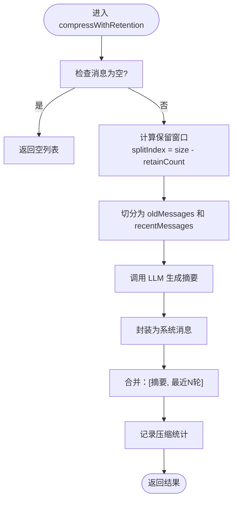
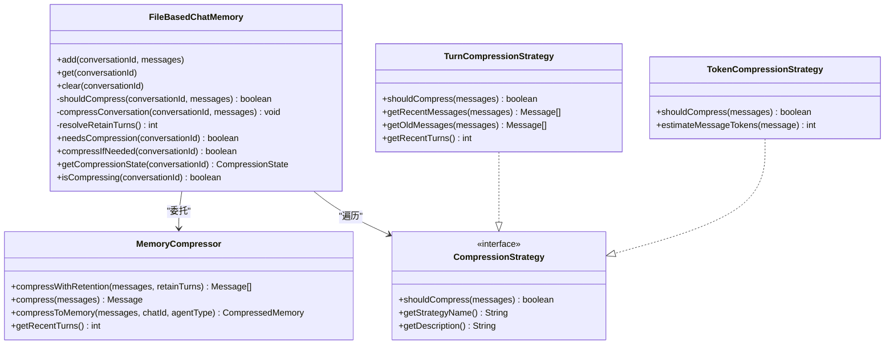
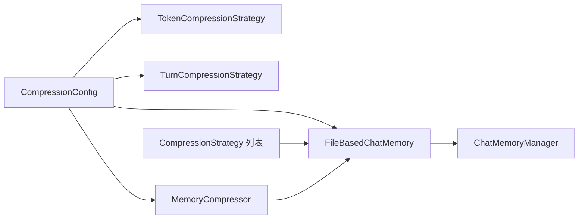

# 记忆压缩策略

<cite>
**本文引用的文件**
- [MemoryCompressor.java](file://src/main/java/com/yupi/yuaiagent/chatmemory/MemoryCompressor.java)
- [CompressionStrategy.java](file://src/main/java/com/yupi/yuaiagent/chatmemory/CompressionStrategy.java)
- [TokenCompressionStrategy.java](file://src/main/java/com/yupi/yuaiagent/chatmemory/TokenCompressionStrategy.java)
- [TurnCompressionStrategy.java](file://src/main/java/com/yupi/yuaiagent/chatmemory/TurnCompressionStrategy.java)
- [CompressionConfig.java](file://src/main/java/com/yupi/yuaiagent/config/CompressionConfig.java)
- [CompressedMemory.java](file://src/main/java/com/yupi/yuaiagent/agent/model/CompressedMemory.java)
- [FileBasedChatMemory.java](file://src/main/java/com/yupi/yuaiagent/chatmemory/FileBasedChatMemory.java)
- [ChatMemoryManager.java](file://src/main/java/com/yupi/yuaiagent/chatmemory/ChatMemoryManager.java)
</cite>

## 目录
1. [引言](#引言)
2. [项目结构](#项目结构)
3. [核心组件](#核心组件)
4. [架构总览](#架构总览)
5. [详细组件分析](#详细组件分析)
6. [依赖分析](#依赖分析)
7. [性能考虑](#性能考虑)
8. [故障排查指南](#故障排查指南)
9. [结论](#结论)
10. [附录](#附录)

## 引言
本文件面向“记忆压缩策略”模块，系统化阐述聊天记忆压缩的必要性、实现原理与工程实践。重点覆盖两类压缩策略：基于 Token 阈值的 TokenCompressionStrategy 与基于对话轮数的 TurnCompressionStrategy；深入解析 MemoryCompressor 的核心算法、结构化摘要产出与降级机制；梳理 CompressionStrategy 接口设计与不同策略的适用场景；给出压缩参数配置、阈值设置与性能影响分析；并提供压缩质量评估指标、用户体验影响与资源节省效果建议，以及策略选择指南与实际应用示例。

## 项目结构
围绕记忆压缩的关键文件组织如下：
- 接口层：CompressionStrategy 定义策略契约
- 策略实现：TokenCompressionStrategy、TurnCompressionStrategy
- 压缩核心：MemoryCompressor（结构化摘要、保留最近 N 轮、降级策略）
- 存储与编排：FileBasedChatMemory（策略触发、压缩执行、状态管理）
- 管理与编排：ChatMemoryManager（统一入口、自动压缩、状态推送）
- 配置：CompressionConfig（集中配置绑定）
- 数据模型：CompressedMemory（结构化摘要载体）

图表来源
- [CompressionStrategy.java:13-55](file://src/main/java/com/yupi/yuaiagent/chatmemory/CompressionStrategy.java#L13-L55)
- [TokenCompressionStrategy.java:18-96](file://src/main/java/com/yupi/yuaiagent/chatmemory/TokenCompressionStrategy.java#L18-L96)
- [TurnCompressionStrategy.java:19-139](file://src/main/java/com/yupi/yuaiagent/chatmemory/TurnCompressionStrategy.java#L19-L139)
- [MemoryCompressor.java:46-417](file://src/main/java/com/yupi/yuaiagent/chatmemory/MemoryCompressor.java#L46-L417)
- [CompressedMemory.java:21-78](file://src/main/java/com/yupi/yuaiagent/agent/model/CompressedMemory.java#L21-L78)
- [FileBasedChatMemory.java:33-339](file://src/main/java/com/yupi/yuaiagent/chatmemory/FileBasedChatMemory.java#L33-L339)
- [ChatMemoryManager.java:38-341](file://src/main/java/com/yupi/yuaiagent/chatmemory/ChatMemoryManager.java#L38-L341)
- [CompressionConfig.java:22-44](file://src/main/java/com/yupi/yuaiagent/config/CompressionConfig.java#L22-L44)

章节来源
- [CompressionStrategy.java:13-55](file://src/main/java/com/yupi/yuaiagent/chatmemory/CompressionStrategy.java#L13-L55)
- [TokenCompressionStrategy.java:18-96](file://src/main/java/com/yupi/yuaiagent/chatmemory/TokenCompressionStrategy.java#L18-L96)
- [TurnCompressionStrategy.java:19-139](file://src/main/java/com/yupi/yuaiagent/chatmemory/TurnCompressionStrategy.java#L19-L139)
- [MemoryCompressor.java:46-417](file://src/main/java/com/yupi/yuaiagent/chatmemory/MemoryCompressor.java#L46-L417)
- [CompressedMemory.java:21-78](file://src/main/java/com/yupi/yuaiagent/agent/model/CompressedMemory.java#L21-L78)
- [FileBasedChatMemory.java:33-339](file://src/main/java/com/yupi/yuaiagent/chatmemory/FileBasedChatMemory.java#L33-L339)
- [ChatMemoryManager.java:38-341](file://src/main/java/com/yupi/yuaiagent/chatmemory/ChatMemoryManager.java#L38-L341)
- [CompressionConfig.java:22-44](file://src/main/java/com/yupi/yuaiagent/config/CompressionConfig.java#L22-L44)

## 核心组件
- CompressionStrategy：定义“是否需要压缩”的判定与元信息（名称、描述、类型枚举）
- TokenCompressionStrategy：基于字符数估算 Token，超过阈值触发压缩
- TurnCompressionStrategy：基于用户消息计数计算轮数，超过阈值触发压缩，并负责保留最近 N 轮
- MemoryCompressor：将历史对话压缩为结构化摘要（五要素），并封装为系统消息；支持保留最近 N 轮完整对话；失败时提供降级摘要
- FileBasedChatMemory：策略触发与压缩执行的落地容器，负责持久化、并发控制与压缩状态管理
- ChatMemoryManager：统一入口，提供自动压缩、状态查询与状态消息推送
- CompressionConfig：集中配置绑定，统一管理阈值与保留窗口
- CompressedMemory：结构化摘要数据模型，承载五要素字段

章节来源
- [CompressionStrategy.java:13-55](file://src/main/java/com/yupi/yuaiagent/chatmemory/CompressionStrategy.java#L13-L55)
- [TokenCompressionStrategy.java:18-96](file://src/main/java/com/yupi/yuaiagent/chatmemory/TokenCompressionStrategy.java#L18-L96)
- [TurnCompressionStrategy.java:19-139](file://src/main/java/com/yupi/yuaiagent/chatmemory/TurnCompressionStrategy.java#L19-L139)
- [MemoryCompressor.java:46-417](file://src/main/java/com/yupi/yuaiagent/chatmemory/MemoryCompressor.java#L46-L417)
- [CompressedMemory.java:21-78](file://src/main/java/com/yupi/yuaiagent/agent/model/CompressedMemory.java#L21-L78)
- [FileBasedChatMemory.java:33-339](file://src/main/java/com/yupi/yuaiagent/chatmemory/FileBasedChatMemory.java#L33-L339)
- [ChatMemoryManager.java:38-341](file://src/main/java/com/yupi/yuaiagent/chatmemory/ChatMemoryManager.java#L38-L341)
- [CompressionConfig.java:22-44](file://src/main/java/com/yupi/yuaiagent/config/CompressionConfig.java#L22-L44)

## 架构总览
整体流程：Agent 在生成响应前调用 ChatMemoryManager.autoCompressIfNeeded，由 FileBasedChatMemory 按策略判定是否需要压缩；若需要，则委托 MemoryCompressor 完成“保留最近 N 轮 + 历史摘要”的组合；完成后通过 SSE 或日志推送状态消息，确保对话连续性。

图表来源
- [ChatMemoryManager.java:156-188](file://src/main/java/com/yupi/yuaiagent/chatmemory/ChatMemoryManager.java#L156-L188)
- [FileBasedChatMemory.java:119-194](file://src/main/java/com/yupi/yuaiagent/chatmemory/FileBasedChatMemory.java#L119-L194)
- [MemoryCompressor.java:138-173](file://src/main/java/com/yupi/yuaiagent/chatmemory/MemoryCompressor.java#L138-L173)
- [CompressionStrategy.java:21-28](file://src/main/java/com/yupi/yuaiagent/chatmemory/CompressionStrategy.java#L21-L28)

## 详细组件分析

### MemoryCompressor：结构化摘要与保留策略
- 功能要点
  - 将历史消息构建为纯文本历史，交由 LLM 生成结构化摘要（五要素：关键需求、已确认信息、未解决问题、重要决策、约定事项）
  - 将摘要封装为系统消息加入上下文，同时保留最近 N 轮完整对话（N 由配置项控制）
  - 失败降级：当 LLM 生成异常时，生成“统计式”降级摘要，仍保留五要素结构，确保上下文一致性
- 关键算法
  - 历史文本构建：遍历消息，按角色与内容拼接
  - 分段解析：根据固定标签定位各段内容，缺失标签填充“无”
  - 保留窗口：按“最近 N 轮 × 2 条消息/轮”计算分割点，旧消息压缩、新消息保留
- 复杂度与性能
  - 字符串拼接与标签扫描：O(M)，M 为消息总字符数
  - 保留窗口切分：O(N)，N 为消息总数
  - LLM 调用成本为主要开销，受历史长度与模型调用耗时影响
- 错误处理
  - 捕获异常并返回降级摘要，保证对话连续性

图表来源
- [MemoryCompressor.java:138-173](file://src/main/java/com/yupi/yuaiagent/chatmemory/MemoryCompressor.java#L138-L173)
- [MemoryCompressor.java:205-232](file://src/main/java/com/yupi/yuaiagent/chatmemory/MemoryCompressor.java#L205-L232)
- [MemoryCompressor.java:237-259](file://src/main/java/com/yupi/yuaiagent/chatmemory/MemoryCompressor.java#L237-L259)
- [MemoryCompressor.java:327-365](file://src/main/java/com/yupi/yuaiagent/chatmemory/MemoryCompressor.java#L327-L365)

章节来源
- [MemoryCompressor.java:46-417](file://src/main/java/com/yupi/yuaiagent/chatmemory/MemoryCompressor.java#L46-L417)
- [CompressedMemory.java:21-78](file://src/main/java/com/yupi/yuaiagent/agent/model/CompressedMemory.java#L21-L78)

### TokenCompressionStrategy：基于 Token 阈值的策略
- 设计要点
  - 通过字符数估算 Token 数（保守系数 1.0），超过阈值触发压缩
  - 阈值默认 4000，可通过配置项调整
- 适用场景
  - 长文本、高密度对话（如文档检索、知识问答）场景
  - 对 Token 成本敏感的任务流
- 参数与配置
  - 配置项：chat.memory.compression.token-threshold
  - 默认值：4000
- 复杂度
  - 单次估算 O(M)，M 为消息总字符数

章节来源
- [TokenCompressionStrategy.java:18-96](file://src/main/java/com/yupi/yuaiagent/chatmemory/TokenCompressionStrategy.java#L18-L96)
- [CompressionConfig.java:32-33](file://src/main/java/com/yupi/yuaiagent/config/CompressionConfig.java#L32-L33)

### TurnCompressionStrategy：基于对话轮数的策略
- 设计要点
  - 以用户消息计数作为轮数，超过阈值触发压缩
  - 与 MemoryCompressor 的“最近 N 轮保留”协同工作，N 默认 5
- 适用场景
  - 长对话、反复确认与澄清的交互（如预约、咨询）
  - 需要保留近期上下文完整性的任务
- 参数与配置
  - 配置项：chat.memory.compression.turn-threshold、chat.memory.compression.recent-turns
  - 默认值：turn-threshold=20，recent-turns=5
- 辅助能力
  - 提供获取最近消息与旧消息的子集方法，便于策略侧按需裁剪

章节来源
- [TurnCompressionStrategy.java:19-139](file://src/main/java/com/yupi/yuaiagent/chatmemory/TurnCompressionStrategy.java#L19-L139)
- [CompressionConfig.java:37-43](file://src/main/java/com/yupi/yuaiagent/config/CompressionConfig.java#L37-L43)

### FileBasedChatMemory：策略触发与压缩执行
- 设计要点
  - 在 add 时检查策略，满足即执行压缩；支持主动 compressIfNeeded
  - 通过读写锁保障并发安全；使用 ThreadLocal 包装 Kryo 避免序列化竞争
  - 维护压缩状态（是否压缩中、压缩次数、累计压缩消息数、错误信息等）
  - 与 MemoryCompressor 协同，解析并应用 TurnCompressionStrategy 的保留轮数
- 关键流程
  - shouldCompress：遍历策略，任一触发即压缩
  - compressConversation：委托 MemoryCompressor 完成“保留 + 摘要”，原地替换并持久化
  - resolveRetainTurns：优先使用 TurnCompressionStrategy 的 N，否则回退到 MemoryCompressor 默认值

图表来源
- [FileBasedChatMemory.java:33-339](file://src/main/java/com/yupi/yuaiagent/chatmemory/FileBasedChatMemory.java#L33-L339)
- [MemoryCompressor.java:46-417](file://src/main/java/com/yupi/yuaiagent/chatmemory/MemoryCompressor.java#L46-L417)
- [CompressionStrategy.java:13-55](file://src/main/java/com/yupi/yuaiagent/chatmemory/CompressionStrategy.java#L13-L55)
- [TurnCompressionStrategy.java:19-139](file://src/main/java/com/yupi/yuaiagent/chatmemory/TurnCompressionStrategy.java#L19-L139)
- [TokenCompressionStrategy.java:18-96](file://src/main/java/com/yupi/yuaiagent/chatmemory/TokenCompressionStrategy.java#L18-L96)

章节来源
- [FileBasedChatMemory.java:33-339](file://src/main/java/com/yupi/yuaiagent/chatmemory/FileBasedChatMemory.java#L33-L339)

### ChatMemoryManager：统一入口与状态推送
- 设计要点
  - 统一管理各 Agent 的 ChatMemory 实例，按 Agent 类型隔离目录
  - 提供 autoCompressIfNeeded：在阈值触发时推送“整理中/完成”状态消息，保证对话连续性
  - 提供 getCompressionStatus 查询压缩状态，便于前端与监控
- 与策略的关系
  - 通过注入 CompressionStrategy 列表进行阈值判定
  - 与 MemoryCompressor、FileBasedChatMemory 协同完成压缩生命周期

章节来源
- [ChatMemoryManager.java:38-341](file://src/main/java/com/yupi/yuaiagent/chatmemory/ChatMemoryManager.java#L38-L341)

## 依赖分析
- 组件耦合
  - FileBasedChatMemory 依赖 CompressionStrategy 列表与 MemoryCompressor
  - MemoryCompressor 依赖 ChatModel（通过 ChatClient）与 CompressedMemory 模型
  - ChatMemoryManager 依赖 FileBasedChatMemory、CompressionStrategy 与 MemoryCompressor
- 配置绑定
  - CompressionConfig 统一绑定 chat.memory.compression.*，与策略与压缩器共享阈值与保留窗口
- 外部依赖
  - Spring AI ChatModel、ChatClient
  - Kryo 序列化（线程局部化避免并发污染）

图表来源
- [CompressionConfig.java:22-44](file://src/main/java/com/yupi/yuaiagent/config/CompressionConfig.java#L22-L44)
- [TokenCompressionStrategy.java:23-24](file://src/main/java/com/yupi/yuaiagent/chatmemory/TokenCompressionStrategy.java#L23-L24)
- [TurnCompressionStrategy.java:24-31](file://src/main/java/com/yupi/yuaiagent/chatmemory/TurnCompressionStrategy.java#L24-L31)
- [MemoryCompressor.java:54-55](file://src/main/java/com/yupi/yuaiagent/chatmemory/MemoryCompressor.java#L54-L55)
- [FileBasedChatMemory.java:56-60](file://src/main/java/com/yupi/yuaiagent/chatmemory/FileBasedChatMemory.java#L56-L60)
- [ChatMemoryManager.java:56-62](file://src/main/java/com/yupi/yuaiagent/chatmemory/ChatMemoryManager.java#L56-L62)

章节来源
- [CompressionConfig.java:22-44](file://src/main/java/com/yupi/yuaiagent/config/CompressionConfig.java#L22-L44)
- [FileBasedChatMemory.java:56-60](file://src/main/java/com/yupi/yuaiagent/chatmemory/FileBasedChatMemory.java#L56-L60)
- [ChatMemoryManager.java:56-62](file://src/main/java/com/yupi/yuaiagent/chatmemory/ChatMemoryManager.java#L56-L62)

## 性能考虑
- Token 估算与阈值
  - TokenCompressionStrategy 使用字符数估算，保守系数为 1.0；实际 Token 与语言密度相关（中文≈1.5，英文≈0.25）。可根据业务语料校准
  - 建议：对长文本密集场景适当降低阈值；对短句高频交互场景提高阈值
- 轮数阈值与保留窗口
  - TurnCompressionStrategy 的 turn-threshold 与 MemoryCompressor 的 recentTurns 共同决定“压缩范围 + 保留范围”
  - 建议：咨询/预约类对话可将 recentTurns 提升至 5~10，以保留更完整的上下文
- LLM 调用成本
  - MemoryCompressor 的摘要生成是主要性能瓶颈；建议：
    - 控制历史长度（通过阈值与轮数）
    - 选择合适模型与推理参数
    - 在批量压缩时合并请求（如策略允许）
- 并发与持久化
  - FileBasedChatMemory 使用读写锁与 ThreadLocal Kryo，避免序列化竞争；建议：
    - 合理划分 Agent 类型目录，减少单文件过大
    - 对频繁写入场景增加批量写入策略

## 故障排查指南
- 压缩失败降级
  - 现象：LLM 生成异常或返回格式不符
  - 行为：MemoryCompressor 返回“统计式”降级摘要，仍保留五要素结构
  - 建议：检查模型可用性、提示词稳定性与输入历史长度
- 策略未触发
  - 现象：消息增长但未压缩
  - 排查：确认 CompressionConfig 阈值配置、策略是否正确注入、消息是否为空
- 压缩状态异常
  - 现象：状态显示“正在压缩”长时间未结束
  - 排查：检查 FileBasedChatMemory 的压缩状态、是否存在异常日志；必要时清理缓存状态
- 持久化失败
  - 现象：写入失败日志
  - 排查：检查磁盘权限、目录是否存在、Kryo 版本兼容性

章节来源
- [MemoryCompressor.java:118-126](file://src/main/java/com/yupi/yuaiagent/chatmemory/MemoryCompressor.java#L118-L126)
- [MemoryCompressor.java:327-365](file://src/main/java/com/yupi/yuaiagent/chatmemory/MemoryCompressor.java#L327-L365)
- [FileBasedChatMemory.java:147-194](file://src/main/java/com/yupi/yuaiagent/chatmemory/FileBasedChatMemory.java#L147-L194)
- [ChatMemoryManager.java:156-188](file://src/main/java/com/yupi/yuaiagent/chatmemory/ChatMemoryManager.java#L156-L188)

## 结论
记忆压缩策略通过“阈值判定 + 结构化摘要 + 保留窗口”的组合，在保证对话连续性的同时显著降低上下文长度与 Token 消耗。TokenCompressionStrategy 适合长文本与高成本场景，TurnCompressionStrategy 适合需要保留近期上下文的交互。MemoryCompressor 的五要素摘要与降级机制确保了鲁棒性。结合 CompressionConfig 的集中配置与 ChatMemoryManager 的自动压缩与状态推送，形成从策略到执行再到可观测性的完整闭环。

## 附录

### 压缩参数配置与阈值设置
- 配置项一览
  - chat.memory.compression.enabled：是否启用压缩（默认启用）
  - chat.memory.compression.token-threshold：Token 阈值（默认 4000）
  - chat.memory.compression.turn-threshold：轮数阈值（默认 20）
  - chat.memory.compression.recent-turns：保留最近轮数（默认 5）
- 配置绑定位置
  - CompressionConfig 统一绑定上述键值，供策略与压缩器共享

章节来源
- [CompressionConfig.java:22-44](file://src/main/java/com/yupi/yuaiagent/config/CompressionConfig.java#L22-L44)
- [TokenCompressionStrategy.java:23-24](file://src/main/java/com/yupi/yuaiagent/chatmemory/TokenCompressionStrategy.java#L23-L24)
- [TurnCompressionStrategy.java:24-31](file://src/main/java/com/yupi/yuaiagent/chatmemory/TurnCompressionStrategy.java#L24-L31)
- [MemoryCompressor.java:54-55](file://src/main/java/com/yupi/yuaiagent/chatmemory/MemoryCompressor.java#L54-L55)

### 压缩质量评估指标与用户体验
- 质量指标
  - 摘要完整性：五要素覆盖率（关键需求、已确认信息、未解决问题、重要决策、约定事项）
  - 上下文连贯性：保留的最近 N 轮是否足以支撑后续回复
  - 信息冗余度：压缩后历史长度与 Token 消耗变化
- 用户体验
  - 压缩触发频率：避免过于频繁导致感知“卡顿”
  - 状态反馈：通过 ChatMemoryManager 推送“整理中/完成”提升透明度
- 资源节省
  - Token 成本下降：通过阈值与轮数控制历史长度
  - 存储与序列化开销下降：减少消息数量与文件体积

### 策略选择指南与场景示例
- 选择指南
  - 高 Token 场景（长文档、检索增强）：优先 TokenCompressionStrategy，配合较低 recentTurns
  - 高交互场景（咨询、预约）：优先 TurnCompressionStrategy，配合较高 recentTurns
  - 混合场景：双策略并行，按任一阈值触发
- 实际场景示例
  - 知识问答：以 Token 阈值为主，recentTurns=3~5
  - 预约咨询：以轮数阈值为主，recentTurns=5~10
  - 多轮澄清：轮数阈值 + 适度降低 token-threshold，平衡上下文与成本