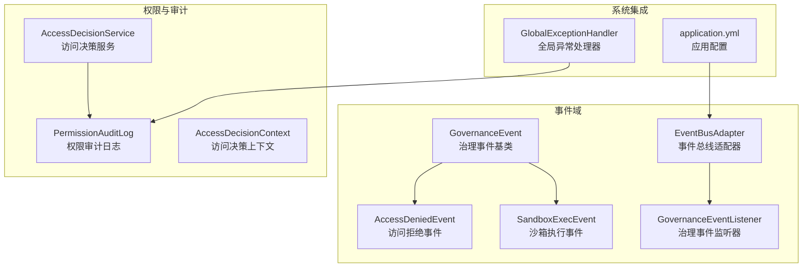
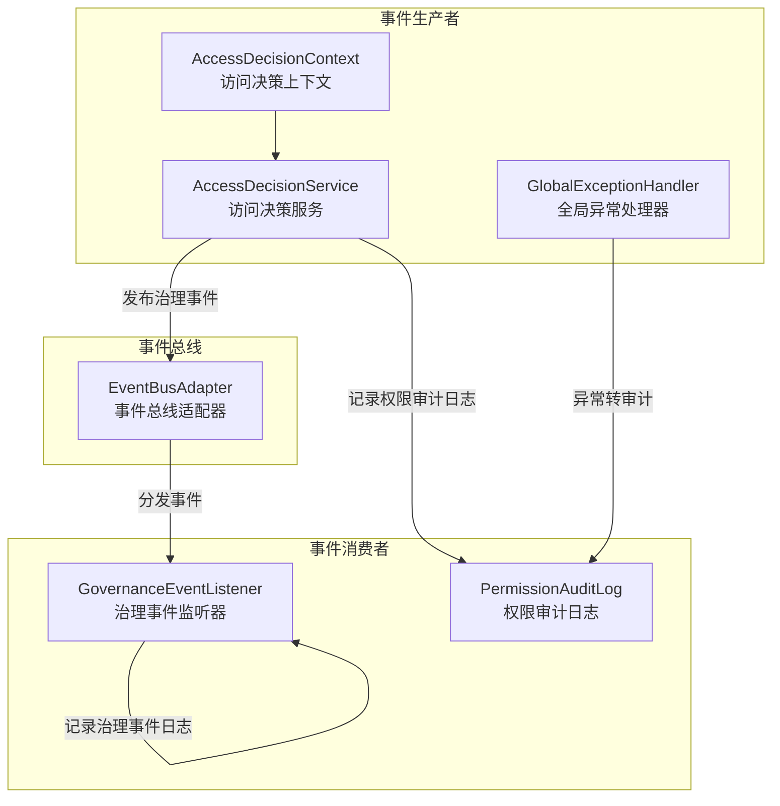
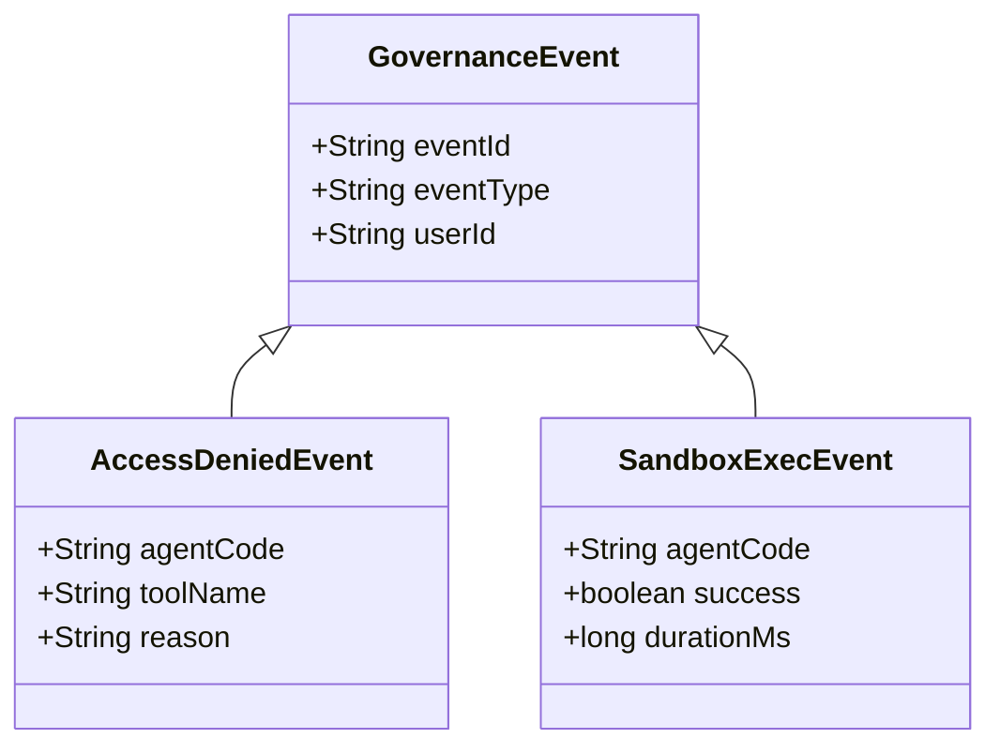
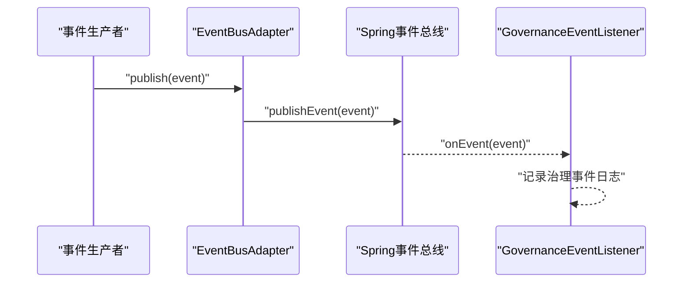
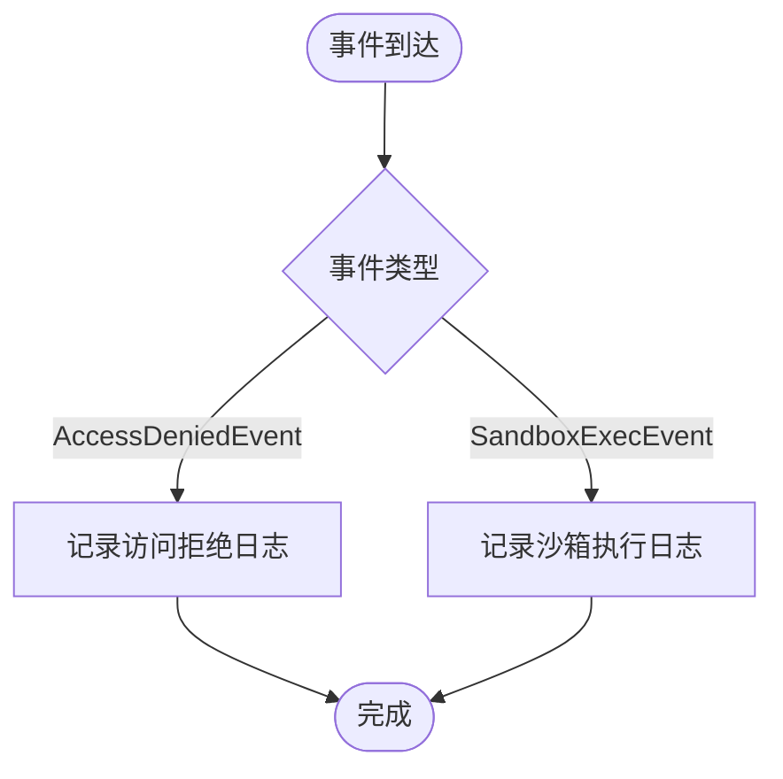
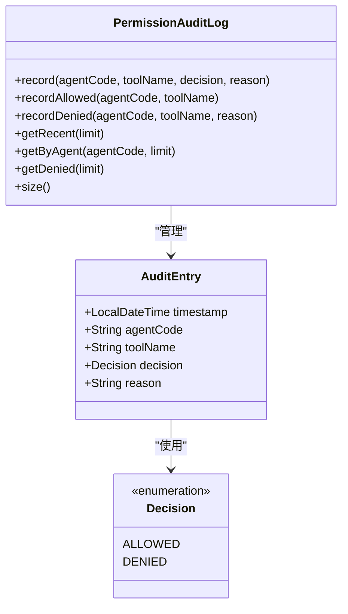
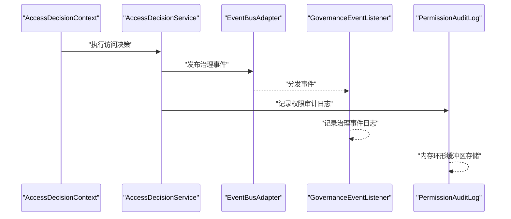
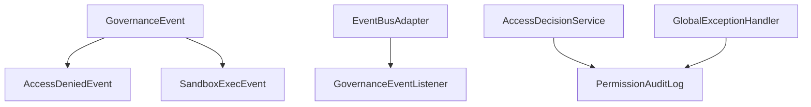

# 审计日志管理

<cite>
**本文引用的文件**
- [GovernanceEvent.java](file://src/main/java/com/yupi/yuaiagent/event/GovernanceEvent.java)
- [AccessDeniedEvent.java](file://src/main/java/com/yupi/yuaiagent/event/AccessDeniedEvent.java)
- [SandboxExecEvent.java](file://src/main/java/com/yupi/yuaiagent/event/SandboxExecEvent.java)
- [EventBusAdapter.java](file://src/main/java/com/yupi/yuaiagent/event/EventBusAdapter.java)
- [GovernanceEventListener.java](file://src/main/java/com/yupi/yuaiagent/event/GovernanceEventListener.java)
- [PermissionAuditLog.java](file://src/main/java/com/yupi/yuaiagent/permission/PermissionAuditLog.java)
- [AccessDecisionService.java](file://src/main/java/com/yupi/yuaiagent/access/AccessDecisionService.java)
- [AccessDecisionContext.java](file://src/main/java/com/yupi/yuaiagent/access/AccessDecisionContext.java)
- [GlobalExceptionHandler.java](file://src/main/java/com/yupi/yuaiagent/exception/GlobalExceptionHandler.java)
- [application.yml](file://src/main/resources/application.yml)
</cite>

## 目录
1. [引言](#引言)
2. [项目结构](#项目结构)
3. [核心组件](#核心组件)
4. [架构概览](#架构概览)
5. [详细组件分析](#详细组件分析)
6. [依赖分析](#依赖分析)
7. [性能考虑](#性能考虑)
8. [故障排查指南](#故障排查指南)
9. [结论](#结论)
10. [附录](#附录)

## 引言
本技术文档围绕审计日志管理系统展开，重点解析治理事件（GovernanceEvent）的类型定义、事件结构与触发条件；阐述事件总线适配器（EventBusAdapter）的实现机制、事件发布订阅模式与异步处理流程；说明治理事件监听器（GovernanceEventListener）的注册机制、事件处理逻辑与错误恢复策略；并提供审计日志的存储方案、查询接口与分析工具，涵盖合规性审计、操作追踪与安全监控的实现方法，以及与质量审查的集成关系与数据流向。最后面向运维人员提供配置、监控与故障排查的技术指导。

## 项目结构
审计日志相关代码主要分布在以下模块：
- 事件域：GovernanceEvent 及其子类（AccessDeniedEvent、SandboxExecEvent）、EventBusAdapter、GovernanceEventListener
- 权限与审计：PermissionAuditLog、AccessDecisionService、AccessDecisionContext
- 全局异常：GlobalExceptionHandler（统一异常转审计）
- 配置：application.yml（日志与事件相关配置）

**图表来源**
- [GovernanceEvent.java:1-24](file://src/main/java/com/yupi/yuaiagent/event/GovernanceEvent.java#L1-L24)
- [AccessDeniedEvent.java:1-50](file://src/main/java/com/yupi/yuaiagent/event/AccessDeniedEvent.java#L1-L50)
- [SandboxExecEvent.java:1-50](file://src/main/java/com/yupi/yuaiagent/event/SandboxExecEvent.java#L1-L50)
- [EventBusAdapter.java:1-100](file://src/main/java/com/yupi/yuaiagent/event/EventBusAdapter.java#L1-L100)
- [GovernanceEventListener.java:1-31](file://src/main/java/com/yupi/yuaiagent/event/GovernanceEventListener.java#L1-L31)
- [PermissionAuditLog.java:1-138](file://src/main/java/com/yupi/yuaiagent/permission/PermissionAuditLog.java#L1-L138)
- [AccessDecisionService.java:1-200](file://src/main/java/com/yupi/yuaiagent/access/AccessDecisionService.java#L1-L200)
- [AccessDecisionContext.java:1-120](file://src/main/java/com/yupi/yuaiagent/access/AccessDecisionContext.java#L1-L120)
- [GlobalExceptionHandler.java:1-150](file://src/main/java/com/yupi/yuaiagent/exception/GlobalExceptionHandler.java#L1-L150)
- [application.yml:1-200](file://src/main/resources/application.yml#L1-L200)

**章节来源**
- [GovernanceEvent.java:1-24](file://src/main/java/com/yupi/yuaiagent/event/GovernanceEvent.java#L1-L24)
- [EventBusAdapter.java:1-100](file://src/main/java/com/yupi/yuaiagent/event/EventBusAdapter.java#L1-L100)
- [GovernanceEventListener.java:1-31](file://src/main/java/com/yupi/yuaiagent/event/GovernanceEventListener.java#L1-L31)
- [PermissionAuditLog.java:1-138](file://src/main/java/com/yupi/yuaiagent/permission/PermissionAuditLog.java#L1-L138)
- [AccessDecisionService.java:1-200](file://src/main/java/com/yupi/yuaiagent/access/AccessDecisionService.java#L1-L200)
- [AccessDecisionContext.java:1-120](file://src/main/java/com/yupi/yuaiagent/access/AccessDecisionContext.java#L1-L120)
- [GlobalExceptionHandler.java:1-150](file://src/main/java/com/yupi/yuaiagent/exception/GlobalExceptionHandler.java#L1-L150)
- [application.yml:1-200](file://src/main/resources/application.yml#L1-L200)

## 核心组件
本节聚焦审计日志系统的核心构件及其职责：
- 治理事件基类：统一事件格式，便于扩展到消息中间件（如 RocketMQ/Kafka）
- 访问拒绝事件与沙箱执行事件：具体治理事件类型
- 事件总线适配器：封装事件发布与订阅机制
- 治理事件监听器：接收并记录治理事件
- 权限审计日志：内存环形缓冲区存储审计记录，支持查询与统计
- 访问决策服务与上下文：触发治理事件与生成审计记录
- 全局异常处理器：兜底记录异常至审计日志

**章节来源**
- [GovernanceEvent.java:1-24](file://src/main/java/com/yupi/yuaiagent/event/GovernanceEvent.java#L1-L24)
- [AccessDeniedEvent.java:1-50](file://src/main/java/com/yupi/yuaiagent/event/AccessDeniedEvent.java#L1-L50)
- [SandboxExecEvent.java:1-50](file://src/main/java/com/yupi/yuaiagent/event/SandboxExecEvent.java#L1-L50)
- [EventBusAdapter.java:1-100](file://src/main/java/com/yupi/yuaiagent/event/EventBusAdapter.java#L1-L100)
- [GovernanceEventListener.java:1-31](file://src/main/java/com/yupi/yuaiagent/event/GovernanceEventListener.java#L1-L31)
- [PermissionAuditLog.java:1-138](file://src/main/java/com/yupi/yuaiagent/permission/PermissionAuditLog.java#L1-L138)
- [AccessDecisionService.java:1-200](file://src/main/java/com/yupi/yuaiagent/access/AccessDecisionService.java#L1-L200)
- [GlobalExceptionHandler.java:1-150](file://src/main/java/com/yupi/yuaiagent/exception/GlobalExceptionHandler.java#L1-L150)

## 架构概览
审计日志系统的整体架构以“事件驱动”为核心，通过治理事件统一承载各类治理行为，借助事件总线进行解耦发布与订阅，监听器负责落地记录，同时结合权限审计日志与全局异常处理形成闭环。

**图表来源**
- [AccessDecisionContext.java:1-120](file://src/main/java/com/yupi/yuaiagent/access/AccessDecisionContext.java#L1-L120)
- [AccessDecisionService.java:1-200](file://src/main/java/com/yupi/yuaiagent/access/AccessDecisionService.java#L1-L200)
- [GlobalExceptionHandler.java:1-150](file://src/main/java/com/yupi/yuaiagent/exception/GlobalExceptionHandler.java#L1-L150)
- [EventBusAdapter.java:1-100](file://src/main/java/com/yupi/yuaiagent/event/EventBusAdapter.java#L1-L100)
- [GovernanceEventListener.java:1-31](file://src/main/java/com/yupi/yuaiagent/event/GovernanceEventListener.java#L1-L31)
- [PermissionAuditLog.java:1-138](file://src/main/java/com/yupi/yuaiagent/permission/PermissionAuditLog.java#L1-L138)

## 详细组件分析

### 治理事件类型与结构
- 基类 GovernanceEvent：继承 Spring ApplicationEvent，统一携带事件 ID、事件类型与用户标识，便于跨系统追踪与扩展到消息中间件。
- 子类 AccessDeniedEvent：表示访问被拒绝事件，包含用户、代理、工具与拒绝原因等关键字段。
- 子类 SandboxExecEvent：表示沙箱执行事件，包含执行状态与耗时等指标，便于安全与性能审计。

**图表来源**
- [GovernanceEvent.java:1-24](file://src/main/java/com/yupi/yuaiagent/event/GovernanceEvent.java#L1-L24)
- [AccessDeniedEvent.java:1-50](file://src/main/java/com/yupi/yuaiagent/event/AccessDeniedEvent.java#L1-L50)
- [SandboxExecEvent.java:1-50](file://src/main/java/com/yupi/yuaiagent/event/SandboxExecEvent.java#L1-L50)

**章节来源**
- [GovernanceEvent.java:1-24](file://src/main/java/com/yupi/yuaiagent/event/GovernanceEvent.java#L1-L24)
- [AccessDeniedEvent.java:1-50](file://src/main/java/com/yupi/yuaiagent/event/AccessDeniedEvent.java#L1-L50)
- [SandboxExecEvent.java:1-50](file://src/main/java/com/yupi/yuaiagent/event/SandboxExecEvent.java#L1-L50)

### 事件总线适配器（EventBusAdapter）
- 实现机制：封装 Spring 事件发布与订阅，提供统一的事件发布入口，支持异步事件处理。
- 发布订阅模式：通过 @EventListener 注解声明监听方法，自动注册到 Spring 事件容器。
- 异步处理流程：建议在监听器或发布侧配置异步任务执行器，避免阻塞业务主流程。

**图表来源**
- [EventBusAdapter.java:1-100](file://src/main/java/com/yupi/yuaiagent/event/EventBusAdapter.java#L1-L100)
- [GovernanceEventListener.java:1-31](file://src/main/java/com/yupi/yuaiagent/event/GovernanceEventListener.java#L1-L31)

**章节来源**
- [EventBusAdapter.java:1-100](file://src/main/java/com/yupi/yuaiagent/event/EventBusAdapter.java#L1-L100)
- [GovernanceEventListener.java:1-31](file://src/main/java/com/yupi/yuaiagent/event/GovernanceEventListener.java#L1-L31)

### 治理事件监听器（GovernanceEventListener）
- 注册机制：通过 @Component 与 @EventListener 自动注册为 Spring 事件监听器。
- 事件处理逻辑：
  - 访问拒绝事件：记录用户、代理、工具与拒绝原因等信息。
  - 沙箱执行事件：记录执行成功状态与耗时等指标。
- 错误恢复策略：基于 SLF4J 日志框架输出，确保异常不影响业务主流程；建议结合外部审计存储与告警系统实现持久化与通知。

**图表来源**
- [GovernanceEventListener.java:18-30](file://src/main/java/com/yupi/yuaiagent/event/GovernanceEventListener.java#L18-L30)

**章节来源**
- [GovernanceEventListener.java:1-31](file://src/main/java/com/yupi/yuaiagent/event/GovernanceEventListener.java#L1-L31)

### 权限审计日志（PermissionAuditLog）
- 存储方案：采用内存环形缓冲区（双端队列）存储审计条目，支持容量上限控制与自动淘汰最旧记录。
- 数据模型：包含时间戳、代理代码、工具名称、决策结果（允许/拒绝）与拒绝原因。
- 查询接口：
  - 获取最近记录：按时间倒序返回指定数量
  - 按代理筛选：返回指定代理的最新记录
  - 拒绝记录：筛选并返回拒绝事件
  - 总记录数：返回当前条目数量
- 分析工具：可通过查询接口进行统计与可视化（如拒绝率、代理使用趋势等）

**图表来源**
- [PermissionAuditLog.java:41-138](file://src/main/java/com/yupi/yuaiagent/permission/PermissionAuditLog.java#L41-L138)

**章节来源**
- [PermissionAuditLog.java:1-138](file://src/main/java/com/yupi/yuaiagent/permission/PermissionAuditLog.java#L1-L138)

### 触发条件与数据流向
- 访问决策触发：AccessDecisionService 在评估权限时，根据策略与规则生成 AccessDeniedEvent 或 SandboxExecEvent，并通过 EventBusAdapter 发布。
- 全局异常触发：GlobalExceptionHandler 将未捕获异常转换为审计记录，写入 PermissionAuditLog。
- 数据流向：事件从生产者经事件总线到达监听器与审计存储，形成闭环。

**图表来源**
- [AccessDecisionContext.java:1-120](file://src/main/java/com/yupi/yuaiagent/access/AccessDecisionContext.java#L1-L120)
- [AccessDecisionService.java:1-200](file://src/main/java/com/yupi/yuaiagent/access/AccessDecisionService.java#L1-L200)
- [EventBusAdapter.java:1-100](file://src/main/java/com/yupi/yuaiagent/event/EventBusAdapter.java#L1-L100)
- [GovernanceEventListener.java:1-31](file://src/main/java/com/yupi/yuaiagent/event/GovernanceEventListener.java#L1-L31)
- [PermissionAuditLog.java:1-138](file://src/main/java/com/yupi/yuaiagent/permission/PermissionAuditLog.java#L1-L138)

**章节来源**
- [AccessDecisionContext.java:1-120](file://src/main/java/com/yupi/yuaiagent/access/AccessDecisionContext.java#L1-L120)
- [AccessDecisionService.java:1-200](file://src/main/java/com/yupi/yuaiagent/access/AccessDecisionService.java#L1-L200)
- [EventBusAdapter.java:1-100](file://src/main/java/com/yupi/yuaiagent/event/EventBusAdapter.java#L1-L100)
- [GovernanceEventListener.java:1-31](file://src/main/java/com/yupi/yuaiagent/event/GovernanceEventListener.java#L1-L31)
- [PermissionAuditLog.java:1-138](file://src/main/java/com/yupi/yuaiagent/permission/PermissionAuditLog.java#L1-L138)

## 依赖分析
- 组件耦合与内聚：治理事件与监听器通过 Spring 事件机制解耦；权限审计日志与访问决策服务紧耦合但职责清晰。
- 外部依赖：Spring ApplicationEvent、SLF4J 日志框架；可扩展到消息中间件（RocketMQ/Kafka）以实现分布式事件流。
- 潜在循环依赖：当前结构无明显循环依赖；扩展消息中间件时需避免双向依赖。

**图表来源**
- [GovernanceEvent.java:1-24](file://src/main/java/com/yupi/yuaiagent/event/GovernanceEvent.java#L1-L24)
- [AccessDeniedEvent.java:1-50](file://src/main/java/com/yupi/yuaiagent/event/AccessDeniedEvent.java#L1-L50)
- [SandboxExecEvent.java:1-50](file://src/main/java/com/yupi/yuaiagent/event/SandboxExecEvent.java#L1-L50)
- [EventBusAdapter.java:1-100](file://src/main/java/com/yupi/yuaiagent/event/EventBusAdapter.java#L1-L100)
- [GovernanceEventListener.java:1-31](file://src/main/java/com/yupi/yuaiagent/event/GovernanceEventListener.java#L1-L31)
- [AccessDecisionService.java:1-200](file://src/main/java/com/yupi/yuaiagent/access/AccessDecisionService.java#L1-L200)
- [PermissionAuditLog.java:1-138](file://src/main/java/com/yupi/yuaiagent/permission/PermissionAuditLog.java#L1-L138)
- [GlobalExceptionHandler.java:1-150](file://src/main/java/com/yupi/yuaiagent/exception/GlobalExceptionHandler.java#L1-L150)

**章节来源**
- [AccessDecisionService.java:1-200](file://src/main/java/com/yupi/yuaiagent/access/AccessDecisionService.java#L1-L200)
- [PermissionAuditLog.java:1-138](file://src/main/java/com/yupi/yuaiagent/permission/PermissionAuditLog.java#L1-L138)
- [GlobalExceptionHandler.java:1-150](file://src/main/java/com/yupi/yuaiagent/exception/GlobalExceptionHandler.java#L1-L150)

## 性能考虑
- 内存环形缓冲区：PermissionAuditLog 使用双端队列实现固定容量存储，淘汰策略简单高效，适合高频审计场景。
- 异步事件处理：建议在 EventBusAdapter 与监听器侧启用异步任务执行器，避免阻塞业务线程。
- 日志级别优化：根据环境调整日志级别，生产环境建议使用 WARN/INFO 级别以降低 I/O 压力。
- 扩展持久化：在高并发与长周期审计需求下，建议将内存审计日志定期落库或推送至消息中间件，实现持久化与横向扩展。

## 故障排查指南
- 事件未被监听：
  - 检查监听器是否标注 @Component 且扫描路径正确
  - 确认 @EventListener 方法签名与事件类型匹配
- 审计日志缺失：
  - 核对 PermissionAuditLog 的容量上限与淘汰逻辑
  - 检查访问决策流程是否正常触发记录
- 异常未审计：
  - 确认 GlobalExceptionHandler 是否生效
  - 检查异常是否被捕获或被吞没
- 配置问题：
  - 检查 application.yml 中的日志与事件相关配置项

**章节来源**
- [GovernanceEventListener.java:1-31](file://src/main/java/com/yupi/yuaiagent/event/GovernanceEventListener.java#L1-L31)
- [PermissionAuditLog.java:1-138](file://src/main/java/com/yupi/yuaiagent/permission/PermissionAuditLog.java#L1-L138)
- [GlobalExceptionHandler.java:1-150](file://src/main/java/com/yupi/yuaiagent/exception/GlobalExceptionHandler.java#L1-L150)
- [application.yml:1-200](file://src/main/resources/application.yml#L1-L200)

## 结论
本审计日志系统以治理事件为核心，结合事件总线与监听器实现解耦的事件驱动架构，并通过权限审计日志与全局异常处理形成完整的审计闭环。系统具备良好的扩展性，可进一步接入消息中间件与持久化存储，满足合规性审计、操作追踪与安全监控的需求。运维人员可依据本文档进行配置、监控与故障排查，确保审计体系稳定可靠。

## 附录
- 合规性审计：通过治理事件与权限审计日志记录关键操作轨迹，满足监管要求
- 操作追踪：结合事件 ID 与用户标识，实现端到端的操作链路追踪
- 安全监控：利用沙箱执行事件与拒绝事件，构建安全态势感知与告警机制
- 与质量审查集成：审计日志可作为质量审查的数据来源，用于回溯与复盘