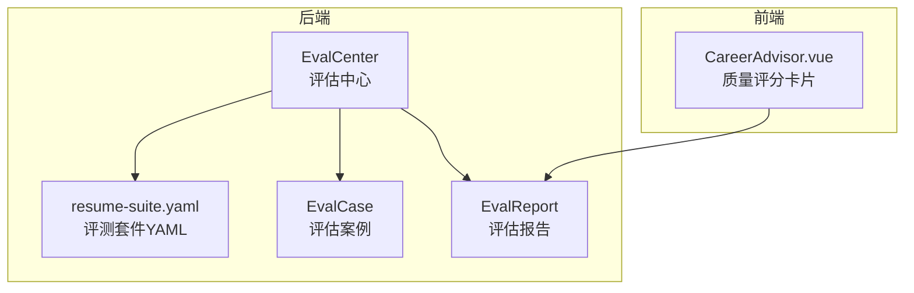
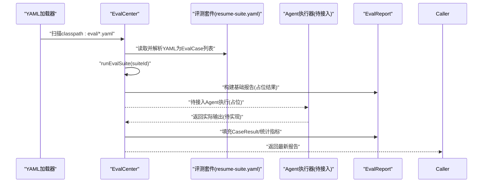
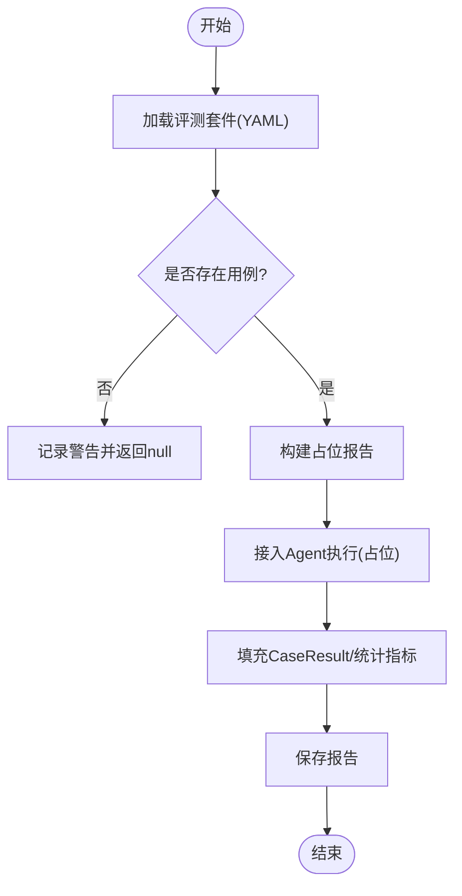
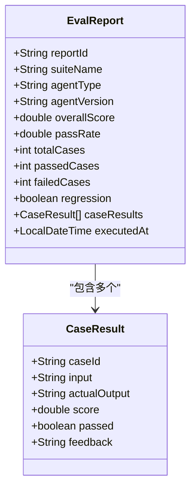
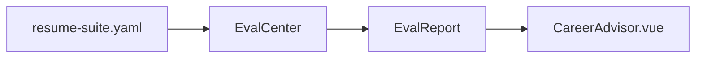

# 测试策略

<cite>
**本文引用的文件**   
- [EvalCase.java](file://src/main/java/com/yupi/yuaiagent/eval/EvalCase.java)
- [EvalCenter.java](file://src/main/java/com/yupi/yuaiagent/eval/EvalCenter.java)
- [EvalReport.java](file://src/main/java/com/yupi/yuaiagent/eval/EvalReport.java)
- [resume-suite.yaml](file://src/main/resources/eval/resume-suite.yaml)
- [plan-quality-guard.md](file://docs/plan-quality-guard.md)
- [TraceIntegrationTest.java](file://src/test/java/com/yupi/yuaiagent/trace/TraceIntegrationTest.java)
- [tasks.md](file://.kiro/specs/agent-execution-trace/tasks.md)
- [CareerAdvisor.vue](file://yu-ai-agent-frontend/src/views/CareerAdvisor.vue)
</cite>

## 目录
1. [简介](#简介)
2. [项目结构](#项目结构)
3. [核心组件](#核心组件)
4. [架构总览](#架构总览)
5. [组件详细分析](#组件详细分析)
6. [依赖关系分析](#依赖关系分析)
7. [性能考量](#性能考量)
8. [故障排查指南](#故障排查指南)
9. [结论](#结论)
10. [附录](#附录)

## 简介
本文件面向测试工程师与开发者，系统化阐述本项目的质量保障测试策略，涵盖以下方面：
- EvalCase 评估案例的设计原则、测试场景与评价标准
- EvalCenter 评估中心的测试执行流程、案例管理与结果统计机制
- EvalReport 评估报告的生成逻辑、指标计算与可视化展示
- 测试用例编写指南、自动化测试脚本与性能基准测试方法
- 质量评估的量化指标、测试覆盖率分析与回归测试策略
- 测试数据准备、测试环境搭建与测试结果解读方法

## 项目结构
质量保障测试相关的关键模块位于后端 Java 工程的 eval 包与资源目录下，同时前端提供了质量审查结果的可视化展示能力。整体结构如下：

图表来源
- [EvalCenter.java:25-112](file://src/main/java/com/yupi/yuaiagent/eval/EvalCenter.java#L25-L112)
- [EvalCase.java:17-26](file://src/main/java/com/yupi/yuaiagent/eval/EvalCase.java#L17-L26)
- [EvalReport.java:20-46](file://src/main/java/com/yupi/yuaiagent/eval/EvalReport.java#L20-L46)
- [resume-suite.yaml:1-19](file://src/main/resources/eval/resume-suite.yaml#L1-L19)
- [CareerAdvisor.vue:592-642](file://yu-ai-agent-frontend/src/views/CareerAdvisor.vue#L592-L642)

章节来源
- [EvalCenter.java:25-112](file://src/main/java/com/yupi/yuaiagent/eval/EvalCenter.java#L25-L112)
- [EvalCase.java:17-26](file://src/main/java/com/yupi/yuaiagent/eval/EvalCase.java#L17-L26)
- [EvalReport.java:20-46](file://src/main/java/com/yupi/yuaiagent/eval/EvalReport.java#L20-L46)
- [resume-suite.yaml:1-19](file://src/main/resources/eval/resume-suite.yaml#L1-L19)
- [CareerAdvisor.vue:592-642](file://yu-ai-agent-frontend/src/views/CareerAdvisor.vue#L592-L642)

## 核心组件
- 评估案例（EvalCase）：定义单个测试用例的输入、期望输出、分类、评分规则与通过阈值。
- 评估中心（EvalCenter）：负责加载评测套件、调度执行、生成报告与历史报告查询。
- 评估报告（EvalReport）：封装整体指标与逐条案例结果，支持后续可视化与回归检测。

章节来源
- [EvalCase.java:17-26](file://src/main/java/com/yupi/yuaiagent/eval/EvalCase.java#L17-L26)
- [EvalCenter.java:25-112](file://src/main/java/com/yupi/yuaiagent/eval/EvalCenter.java#L25-L112)
- [EvalReport.java:20-46](file://src/main/java/com/yupi/yuaiagent/eval/EvalReport.java#L20-L46)

## 架构总览
下图展示了从“评测套件加载”到“报告生成”的端到端流程，以及与前端质量评分卡片的集成点。

图表来源
- [EvalCenter.java:35-97](file://src/main/java/com/yupi/yuaiagent/eval/EvalCenter.java#L35-L97)
- [resume-suite.yaml:1-19](file://src/main/resources/eval/resume-suite.yaml#L1-L19)

章节来源
- [EvalCenter.java:35-97](file://src/main/java/com/yupi/yuaiagent/eval/EvalCenter.java#L35-L97)
- [resume-suite.yaml:1-19](file://src/main/resources/eval/resume-suite.yaml#L1-L19)

## 组件详细分析

### EvalCase 评估案例
- 设计原则
  - 结构简洁：仅包含用例标识、输入、期望输出、分类、评分规则与通过阈值，便于扩展与维护。
  - 可扩展性：评分规则预留多种策略（精确匹配、语义相似度、大模型判别），满足不同场景。
- 测试场景
  - 精确匹配：适用于固定模板输出或可比对的结构化结果。
  - 语义相似度：适用于自然语言生成类任务，允许不同表达但含义一致。
  - 大模型判别：适用于复杂语义与主观判断，通过LLM进行一致性评分。
- 评价标准
  - 通过阈值用于判定案例是否通过；整体通过率与平均分用于衡量套件质量。

章节来源
- [EvalCase.java:17-26](file://src/main/java/com/yupi/yuaiagent/eval/EvalCase.java#L17-L26)
- [resume-suite.yaml:1-19](file://src/main/resources/eval/resume-suite.yaml#L1-L19)

### EvalCenter 评估中心
- 初始化与套件加载
  - 通过资源扫描加载所有 YAML 套件，解析为 EvalCase 列表并缓存。
- 执行流程
  - runEvalSuite：根据套件ID获取用例，生成占位报告；实际 Agent 执行与评分逻辑待接入。
- 报告管理
  - 提供最新报告查询、套件名称列表与全量报告查询接口，便于历史对比与回归检测。

图表来源
- [EvalCenter.java:35-97](file://src/main/java/com/yupi/yuaiagent/eval/EvalCenter.java#L35-L97)

章节来源
- [EvalCenter.java:35-97](file://src/main/java/com/yupi/yuaiagent/eval/EvalCenter.java#L35-L97)

### EvalReport 评估报告
- 报告字段
  - 基本信息：报告ID、套件名、Agent类型/版本、执行时间
  - 指标：总案例数、通过数、失败数、总体得分、通过率、是否回归
  - 案例明细：每条用例的输入、实际输出、得分、是否通过、反馈
- 指标计算
  - 总体得分与通过率可由案例得分聚合得到；通过/失败计数基于阈值判定。
- 可视化集成
  - 前端通过SSE事件接收质量审查结果并在界面卡片中展示。

图表来源
- [EvalReport.java:20-46](file://src/main/java/com/yupi/yuaiagent/eval/EvalReport.java#L20-L46)

章节来源
- [EvalReport.java:20-46](file://src/main/java/com/yupi/yuaiagent/eval/EvalReport.java#L20-L46)
- [CareerAdvisor.vue:592-642](file://yu-ai-agent-frontend/src/views/CareerAdvisor.vue#L592-L642)

### 评测套件示例：resume-suite.yaml
- 示例用例包含三条简历优化相关的测试场景，分别采用不同的评分规则与阈值，体现从“模板优化”到“岗位定向调整”的递进式验证。

章节来源
- [resume-suite.yaml:1-19](file://src/main/resources/eval/resume-suite.yaml#L1-L19)

### 质量守卫（Quality Guard）与轨迹（Trace）的协同
- 质量守卫提供审查维度与风险等级，结合执行轨迹记录审查步骤，形成可观测的质量闭环。
- 前端通过SSE事件接收质量审查事件并在界面展示。

章节来源
- [plan-quality-guard.md:92-251](file://docs/plan-quality-guard.md#L92-L251)
- [CareerAdvisor.vue:592-642](file://yu-ai-agent-frontend/src/views/CareerAdvisor.vue#L592-L642)

## 依赖关系分析
- EvalCenter 依赖 YAML 资源加载与 Jackson YAML 解析，将资源文件映射为 EvalCase 列表。
- EvalReport 作为纯数据载体，被 EvalCenter 用于构建与返回。
- 前端 CareerAdvisor.vue 依赖后端推送的质量审查事件，用于可视化展示。

图表来源
- [EvalCenter.java:35-97](file://src/main/java/com/yupi/yuaiagent/eval/EvalCenter.java#L35-L97)
- [EvalReport.java:20-46](file://src/main/java/com/yupi/yuaiagent/eval/EvalReport.java#L20-L46)
- [CareerAdvisor.vue:592-642](file://yu-ai-agent-frontend/src/views/CareerAdvisor.vue#L592-L642)

章节来源
- [EvalCenter.java:35-97](file://src/main/java/com/yupi/yuaiagent/eval/EvalCenter.java#L35-L97)
- [EvalReport.java:20-46](file://src/main/java/com/yupi/yuaiagent/eval/EvalReport.java#L20-L46)
- [CareerAdvisor.vue:592-642](file://yu-ai-agent-frontend/src/views/CareerAdvisor.vue#L592-L642)

## 性能考量
- 采集性能基线
  - 轨迹采集单事件延迟应小于等于 50ms，确保对主流程的性能影响最小。
- 建议的性能测试方法
  - 使用类似 TraceIntegrationTest 的压测思路，预热后测量批量事件的平均耗时，验证在高并发下的稳定性与延迟上限。
- 评测执行性能
  - 评测套件加载与报告构建为内存操作，主要性能瓶颈在于接入的 Agent 执行与评分逻辑；建议对评分服务进行异步化与缓存优化。

章节来源
- [TraceIntegrationTest.java:114-142](file://src/test/java/com/yupi/yuaiagent/trace/TraceIntegrationTest.java#L114-L142)
- [tasks.md:205-207](file://.kiro/specs/agent-execution-trace/tasks.md#L205-L207)

## 故障排查指南
- 套件加载失败
  - 现象：日志出现“加载评测文件失败”警告。
  - 排查：检查 YAML 文件路径与命名规范，确认文件编码与格式正确。
- 套件为空或不存在
  - 现象：执行返回 null 或警告“评测套件不存在或为空”。
  - 排查：确认 EvalCenter 初始化是否成功加载套件，核对套件名称与大小写。
- 报告统计异常
  - 现象：通过率/平均分与预期不符。
  - 排查：确认案例评分与阈值设置，检查是否正确填充 CaseResult。
- 前端质量评分未显示
  - 现象：界面无质量评分卡片。
  - 排查：确认后端SSE事件推送正常，前端事件监听与JSON解析无异常。

章节来源
- [EvalCenter.java:35-54](file://src/main/java/com/yupi/yuaiagent/eval/EvalCenter.java#L35-L54)
- [EvalCenter.java:60-65](file://src/main/java/com/yupi/yuaiagent/eval/EvalCenter.java#L60-L65)
- [CareerAdvisor.vue:592-642](file://yu-ai-agent-frontend/src/views/CareerAdvisor.vue#L592-L642)

## 结论
本测试策略以 EvalCase/EvalCenter/EvalReport 为核心，构建了可扩展、可观测的质量评估框架。通过 YAML 套件驱动与前端可视化集成，能够快速落地简历优化等典型场景的自动化评测，并为后续接入更复杂的 Agent 执行与评分逻辑提供清晰的扩展路径。建议在接入阶段同步完善性能与稳定性测试，确保评测流程在高负载下仍具备可预测的延迟与吞吐。

## 附录

### 测试用例编写指南
- 用例设计
  - 明确输入与期望输出，区分精确匹配与语义相似度两类场景。
  - 设置合理的评分规则与通过阈值，覆盖边界条件与异常场景。
- 套件组织
  - 将相关用例归档至单一 YAML 文件，命名清晰，便于维护与扩展。
- 质量守卫联动
  - 结合质量守卫的审查维度与风险等级，补充高风险场景的用例。

章节来源
- [EvalCase.java:17-26](file://src/main/java/com/yupi/yuaiagent/eval/EvalCase.java#L17-L26)
- [resume-suite.yaml:1-19](file://src/main/resources/eval/resume-suite.yaml#L1-L19)
- [plan-quality-guard.md:92-251](file://docs/plan-quality-guard.md#L92-L251)

### 自动化测试脚本与回归测试策略
- 自动化脚本
  - 基于 EvalCenter 的接口编写集成测试，模拟加载套件、执行评测与生成报告。
- 回归测试
  - 通过 getLatestReport 与 getAllReports 获取历史报告，比较通过率与关键指标变化，识别回归风险。
- 轨迹与质量事件
  - 结合轨迹采集的性能测试，确保评测过程中的可观测性与稳定性。

章节来源
- [EvalCenter.java:99-111](file://src/main/java/com/yupi/yuaiagent/eval/EvalCenter.java#L99-L111)
- [TraceIntegrationTest.java:114-142](file://src/test/java/com/yupi/yuaiagent/trace/TraceIntegrationTest.java#L114-L142)

### 测试覆盖率分析
- 建议从“用例覆盖度”和“执行路径覆盖度”两个维度评估：
  - 用例覆盖度：按类别与评分规则统计用例分布，确保关键场景均有覆盖。
  - 执行路径覆盖度：结合轨迹记录，验证评测链路中关键步骤均被采集与落盘。

章节来源
- [tasks.md:15-210](file://.kiro/specs/agent-execution-trace/tasks.md#L15-L210)

### 测试数据准备与环境搭建
- 测试数据
  - 使用 YAML 文件组织用例，确保输入与期望输出清晰、可复现。
- 环境搭建
  - 后端：确保资源目录包含 eval 套件文件，启动应用后 EvalCenter 自动加载。
  - 前端：确认SSE事件订阅与质量卡片渲染逻辑正常。

章节来源
- [resume-suite.yaml:1-19](file://src/main/resources/eval/resume-suite.yaml#L1-L19)
- [CareerAdvisor.vue:592-642](file://yu-ai-agent-frontend/src/views/CareerAdvisor.vue#L592-L642)