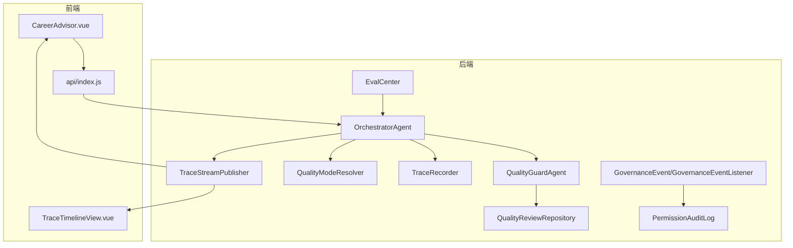
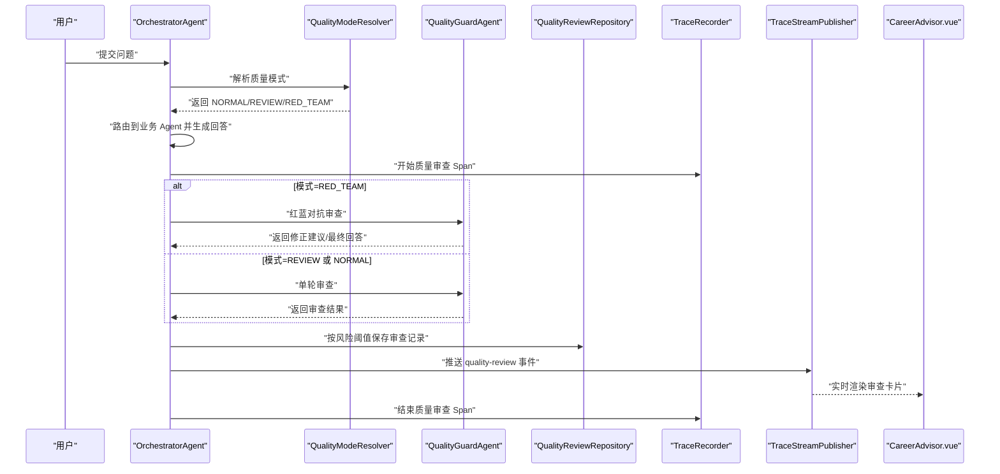
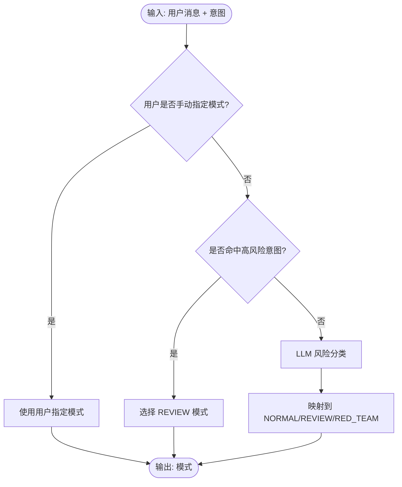
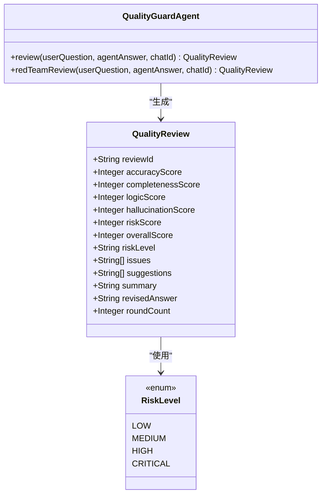
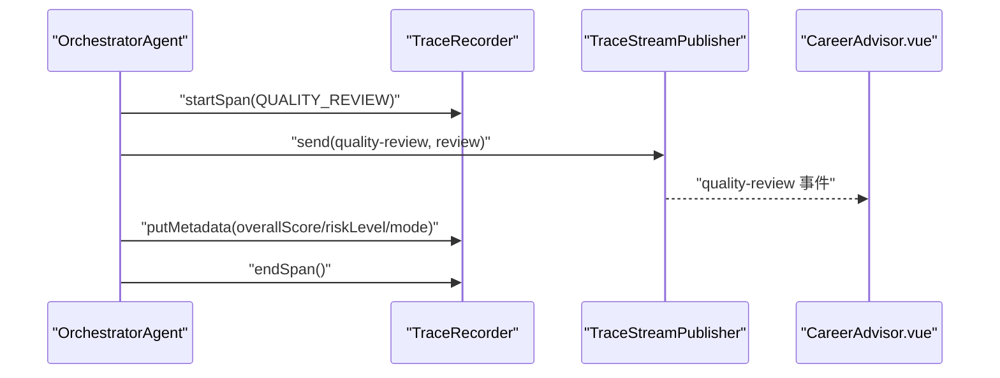
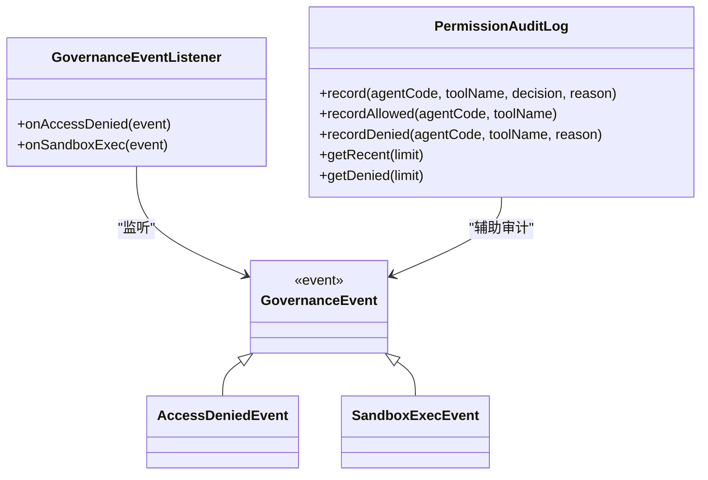
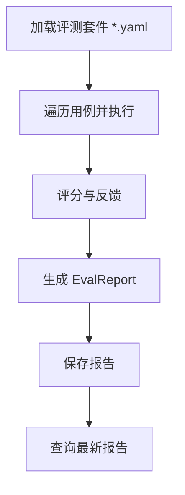
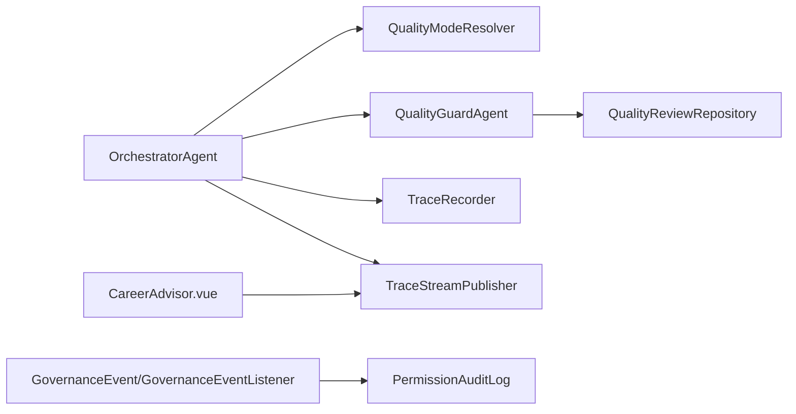

# 质量保障系统

<cite>
**本文引用的文件**
- [plan-quality-guard.md](file://docs/plan-quality-guard.md)
- [OrchestratorAgent.java](file://src/main/java/com/yupi/yuaiagent/agent/OrchestratorAgent.java)
- [QualityGuardAgent.java](file://src/main/java/com/yupi/yuaiagent/quality/QualityGuardAgent.java)
- [QualityModeResolver.java](file://src/main/java/com/yupi/yuaiagent/quality/QualityModeResolver.java)
- [QualityReview.java](file://src/main/java/com/yupi/yuaiagent/quality/QualityReview.java)
- [QualityReviewRepository.java](file://src/main/java/com/yupi/yuaiagent/quality/QualityReviewRepository.java)
- [RiskLevel.java](file://src/main/java/com/yupi/yuaiagent/quality/RiskLevel.java)
- [GovernanceEventListener.java](file://src/main/java/com/yupi/yuaiagent/event/GovernanceEventListener.java)
- [GovernanceEvent.java](file://src/main/java/com/yupi/yuaiagent/event/GovernanceEvent.java)
- [PermissionAuditLog.java](file://src/main/java/com/yupi/yuaiagent/permission/PermissionAuditLog.java)
- [EvalCenter.java](file://src/main/java/com/yupi/yuaiagent/eval/EvalCenter.java)
- [EvalCase.java](file://src/main/java/com/yupi/yuaiagent/eval/EvalCase.java)
- [EvalReport.java](file://src/main/java/com/yupi/yuaiagent/eval/EvalReport.java)
- [TraceStreamPublisher.java](file://src/main/java/com/yupi/yuaiagent/trace/TraceStreamPublisher.java)
- [TraceRecorder.java](file://src/main/java/com/yupi/yuaiagent/trace/TraceRecorder.java)
- [TraceRepository.java](file://src/main/java/com/yupi/yuaiagent/trace/TraceRepository.java)
- [TraceContext.java](file://src/main/java/com/yupi/yuaiagent/trace/TraceContext.java)
- [TraceSpan.java](file://src/main/java/com/yupi/yuaiagent/trace/TraceSpan.java)
- [TraceStepType.java](file://src/main/java/com/yupi/yuaiagent/trace/TraceStepType.java)
- [TraceStatus.java](file://src/main/java/com/yupi/yuaiagent/trace/TraceStatus.java)
- [TraceStepStatus.java](file://src/main/java/com/yupi/yuaiagent/trace/TraceStepStatus.java)
- [TraceProperties.java](file://src/main/java/com/yupi/yuaiagent/trace/TraceProperties.java)
- [CareerAdvisor.vue](file://yu-ai-agent-frontend/src/views/CareerAdvisor.vue)
- [TraceTimelineView.vue](file://yu-ai-agent-frontend/src/components/TraceTimelineView.vue)
- [api/index.js](file://yu-ai-agent-frontend/src/api/index.js)
</cite>

## 目录
1. [引言](#引言)
2. [项目结构](#项目结构)
3. [核心组件](#核心组件)
4. [架构总览](#架构总览)
5. [详细组件分析](#详细组件分析)
6. [依赖关系分析](#依赖关系分析)
7. [性能考量](#性能考量)
8. [故障排查指南](#故障排查指南)
9. [结论](#结论)
10. [附录](#附录)

## 引言
本文件面向开发者与质量工程师，系统化阐述质量保障系统的“质量守卫机制、风险评估体系与输出审查流程”。围绕质量模式解析器、审查标准与评估指标、审计日志与治理事件、合规监控、质量测试策略与报告生成、异常检测与自动告警、质量改进与持续优化等主题，提供从架构到实现、从流程到工具的全景式技术文档。

## 项目结构
质量保障系统以“治理层红蓝对抗 + 质量守卫”为核心理念，将质量审查嵌入到对话编排与执行轨迹中，形成“NORMAL → REVIEW → RED_TEAM”的三层质量模式，并通过前端实时事件流向用户反馈审查结果与轨迹。

图表来源
- [OrchestratorAgent.java:659-704](file://src/main/java/com/yupi/yuaiagent/agent/OrchestratorAgent.java#L659-L704)
- [QualityGuardAgent.java](file://src/main/java/com/yupi/yuaiagent/quality/QualityGuardAgent.java)
- [QualityModeResolver.java:1-33](file://src/main/java/com/yupi/yuaiagent/quality/QualityModeResolver.java#L1-L33)
- [QualityReviewRepository.java](file://src/main/java/com/yupi/yuaiagent/quality/QualityReviewRepository.java)
- [TraceRecorder.java](file://src/main/java/com/yupi/yuaiagent/trace/TraceRecorder.java)
- [TraceStreamPublisher.java](file://src/main/java/com/yupi/yuaiagent/trace/TraceStreamPublisher.java)
- [GovernanceEvent.java](file://src/main/java/com/yupi/yuaiagent/event/GovernanceEvent.java)
- [GovernanceEventListener.java:1-31](file://src/main/java/com/yupi/yuaiagent/event/GovernanceEventListener.java#L1-L31)
- [PermissionAuditLog.java:41-138](file://src/main/java/com/yupi/yuaiagent/permission/PermissionAuditLog.java#L41-L138)
- [EvalCenter.java:1-112](file://src/main/java/com/yupi/yuaiagent/eval/EvalCenter.java#L1-L112)
- [CareerAdvisor.vue:592-642](file://yu-ai-agent-frontend/src/views/CareerAdvisor.vue#L592-L642)
- [TraceTimelineView.vue](file://yu-ai-agent-frontend/src/components/TraceTimelineView.vue)

章节来源
- [plan-quality-guard.md:20-57](file://docs/plan-quality-guard.md#L20-L57)
- [OrchestratorAgent.java:659-704](file://src/main/java/com/yupi/yuaiagent/agent/OrchestratorAgent.java#L659-L704)

## 核心组件
- 质量模式解析器：根据意图与关键词自动判定 NORMAL/REVIEW/RED_TEAM 模式，支持用户手动覆盖。
- 质量守卫代理：对业务 Agent 的回答进行多维评分与风险标注，支持红蓝对抗迭代修正。
- 审查结果模型与持久化：统一的数据结构承载评分、问题、建议、风险等级与摘要，并按风险阈值落库。
- 执行轨迹与事件流：在审查阶段记录轨迹元数据并通过 SSE 推送至前端，支持实时可视化。
- 治理事件与审计日志：统一记录访问拒绝、沙箱执行等治理事件，支持权限决策审计与告警。
- 质量评测中心：提供评测套件加载、执行与报告生成能力，支撑回归与发版评估。

章节来源
- [QualityModeResolver.java:1-33](file://src/main/java/com/yupi/yuaiagent/quality/QualityModeResolver.java#L1-L33)
- [QualityGuardAgent.java](file://src/main/java/com/yupi/yuaiagent/quality/QualityGuardAgent.java)
- [QualityReview.java:161-192](file://src/main/java/com/yupi/yuaiagent/quality/QualityReview.java#L161-L192)
- [QualityReviewRepository.java](file://src/main/java/com/yupi/yuaiagent/quality/QualityReviewRepository.java)
- [TraceStreamPublisher.java](file://src/main/java/com/yupi/yuaiagent/trace/TraceStreamPublisher.java)
- [GovernanceEventListener.java:1-31](file://src/main/java/com/yupi/yuaiagent/event/GovernanceEventListener.java#L1-L31)
- [PermissionAuditLog.java:41-138](file://src/main/java/com/yupi/yuaiagent/permission/PermissionAuditLog.java#L41-L138)
- [EvalCenter.java:1-112](file://src/main/java/com/yupi/yuaiagent/eval/EvalCenter.java#L1-L112)

## 架构总览
质量保障系统采用“编排器路由 + 模式解析 + 守卫审查 + 轨迹记录 + 事件推送 + 审计与评测”的闭环架构。审查流程在编排器中被动态注入，依据模式选择是否阻断、是否保存高风险审查记录，并通过 SSE 将审查结果与轨迹事件实时推送到前端。

图表来源
- [OrchestratorAgent.java:659-704](file://src/main/java/com/yupi/yuaiagent/agent/OrchestratorAgent.java#L659-L704)
- [QualityModeResolver.java:1-33](file://src/main/java/com/yupi/yuaiagent/quality/QualityModeResolver.java#L1-L33)
- [QualityGuardAgent.java](file://src/main/java/com/yupi/yuaiagent/quality/QualityGuardAgent.java)
- [QualityReviewRepository.java](file://src/main/java/com/yupi/yuaiagent/quality/QualityReviewRepository.java)
- [TraceRecorder.java](file://src/main/java/com/yupi/yuaiagent/trace/TraceRecorder.java)
- [TraceStreamPublisher.java](file://src/main/java/com/yupi/yuaiagent/trace/TraceStreamPublisher.java)
- [CareerAdvisor.vue:592-642](file://yu-ai-agent-frontend/src/views/CareerAdvisor.vue#L592-L642)

## 详细组件分析

### 质量模式解析器
- 功能：基于意图集合与 LLM 风险分类，自动选择 NORMAL/REVIEW/RED_TEAM；支持用户手动覆盖。
- 关键点：预设高风险意图集（如简历、谈判、逃避），其余场景通过 LLM 判定风险等级并映射到模式。
- 配置化：可通过配置段扩展意图映射与风险阈值。

图表来源
- [QualityModeResolver.java:1-33](file://src/main/java/com/yupi/yuaiagent/quality/QualityModeResolver.java#L1-L33)

章节来源
- [QualityModeResolver.java:1-33](file://src/main/java/com/yupi/yuaiagent/quality/QualityModeResolver.java#L1-L33)
- [plan-quality-guard.md:58-67](file://docs/plan-quality-guard.md#L58-L67)

### 质量守卫代理与审查流程
- 审查维度：准确性、完整性、逻辑性、幻觉安全度、风险度；输出统一 JSON 结构，包含各维度分数、问题列表、建议、风险等级与摘要。
- 模式差异：
  - NORMAL：直接输出，无审查。
  - REVIEW：单轮审查，输出质量评分与风险提示。
  - RED_TEAM：多轮对抗，生成修正回答，必要时阻断。
- 阻断机制：当风险等级达到阻断级别时，记录阻断轨迹并推送阻断事件。

图表来源
- [QualityGuardAgent.java](file://src/main/java/com/yupi/yuaiagent/quality/QualityGuardAgent.java)
- [QualityReview.java:161-192](file://src/main/java/com/yupi/yuaiagent/quality/QualityReview.java#L161-L192)
- [RiskLevel.java:207-219](file://src/main/java/com/yupi/yuaiagent/quality/RiskLevel.java#L207-L219)

章节来源
- [plan-quality-guard.md:92-135](file://docs/plan-quality-guard.md#L92-L135)
- [plan-quality-guard.md:161-192](file://docs/plan-quality-guard.md#L161-L192)
- [plan-quality-guard.md:223-251](file://docs/plan-quality-guard.md#L223-L251)

### 执行轨迹与事件流
- 轨迹记录：在质量审查阶段开启/结束 Span，写入总体分、风险等级、模式等元数据。
- 事件推送：通过 SSE 推送 quality-review 与 quality-blocked 事件，前端实时渲染。
- 前端集成：CareerAdvisor.vue 与 TraceTimelineView.vue 分别展示审查卡片与轨迹时间线。

图表来源
- [OrchestratorAgent.java:659-704](file://src/main/java/com/yupi/yuaiagent/agent/OrchestratorAgent.java#L659-L704)
- [TraceRecorder.java](file://src/main/java/com/yupi/yuaiagent/trace/TraceRecorder.java)
- [TraceStreamPublisher.java](file://src/main/java/com/yupi/yuaiagent/trace/TraceStreamPublisher.java)
- [CareerAdvisor.vue:592-642](file://yu-ai-agent-frontend/src/views/CareerAdvisor.vue#L592-L642)

章节来源
- [OrchestratorAgent.java:659-704](file://src/main/java/com/yupi/yuaiagent/agent/OrchestratorAgent.java#L659-L704)
- [TraceStreamPublisher.java](file://src/main/java/com/yupi/yuaiagent/trace/TraceStreamPublisher.java)
- [CareerAdvisor.vue:592-642](file://yu-ai-agent-frontend/src/views/CareerAdvisor.vue#L592-L642)

### 审计日志与治理事件
- 治理事件：统一记录访问拒绝、沙箱执行等事件，便于后续扩展为告警与审计数据库。
- 权限审计：PermissionAuditLog 提供内存环形缓冲，记录 ALLOWED/DENIED 决策与原因，支持查询最近 DENIED 记录。
- 日志策略：对 DENIED 决策进行告警级别日志输出，确保可追溯。

图表来源
- [GovernanceEvent.java](file://src/main/java/com/yupi/yuaiagent/event/GovernanceEvent.java)
- [GovernanceEventListener.java:1-31](file://src/main/java/com/yupi/yuaiagent/event/GovernanceEventListener.java#L1-L31)
- [PermissionAuditLog.java:41-138](file://src/main/java/com/yupi/yuaiagent/permission/PermissionAuditLog.java#L41-L138)

章节来源
- [GovernanceEventListener.java:1-31](file://src/main/java/com/yupi/yuaiagent/event/GovernanceEventListener.java#L1-L31)
- [PermissionAuditLog.java:41-138](file://src/main/java/com/yupi/yuaiagent/permission/PermissionAuditLog.java#L41-L138)

### 质量评测中心与报告生成
- 评测套件：从 classpath:eval 目录加载 YAML 格式的评测用例，支持多套件并行管理。
- 执行流程：加载用例 → 调用 Agent → 评分 → 生成报告 → 检测回归。
- 报告字段：包含总用例数、通过数、失败数、整体得分、通过率、逐项结果与执行时间等。

图表来源
- [EvalCenter.java:35-97](file://src/main/java/com/yupi/yuaiagent/eval/EvalCenter.java#L35-L97)
- [EvalCase.java:1-26](file://src/main/java/com/yupi/yuaiagent/eval/EvalCase.java#L1-L26)
- [EvalReport.java:1-46](file://src/main/java/com/yupi/yuaiagent/eval/EvalReport.java#L1-L46)

章节来源
- [EvalCenter.java:1-112](file://src/main/java/com/yupi/yuaiagent/eval/EvalCenter.java#L1-L112)
- [EvalCase.java:1-26](file://src/main/java/com/yupi/yuaiagent/eval/EvalCase.java#L1-L26)
- [EvalReport.java:1-46](file://src/main/java/com/yupi/yuaiagent/eval/EvalReport.java#L1-L46)

## 依赖关系分析
- 编排器依赖模式解析器与质量守卫代理，同时与轨迹记录与事件发布模块耦合。
- 质量守卫代理依赖审查结果模型与持久化仓库。
- 前端通过 SSE 与后端交互，接收审查与轨迹事件。
- 治理事件与权限审计日志相互补充，共同构成合规监控基础。

图表来源
- [OrchestratorAgent.java:659-704](file://src/main/java/com/yupi/yuaiagent/agent/OrchestratorAgent.java#L659-L704)
- [QualityModeResolver.java:1-33](file://src/main/java/com/yupi/yuaiagent/quality/QualityModeResolver.java#L1-L33)
- [QualityGuardAgent.java](file://src/main/java/com/yupi/yuaiagent/quality/QualityGuardAgent.java)
- [QualityReviewRepository.java](file://src/main/java/com/yupi/yuaiagent/quality/QualityReviewRepository.java)
- [TraceRecorder.java](file://src/main/java/com/yupi/yuaiagent/trace/TraceRecorder.java)
- [TraceStreamPublisher.java](file://src/main/java/com/yupi/yuaiagent/trace/TraceStreamPublisher.java)
- [GovernanceEventListener.java:1-31](file://src/main/java/com/yupi/yuaiagent/event/GovernanceEventListener.java#L1-L31)
- [PermissionAuditLog.java:41-138](file://src/main/java/com/yupi/yuaiagent/permission/PermissionAuditLog.java#L41-L138)
- [CareerAdvisor.vue:592-642](file://yu-ai-agent-frontend/src/views/CareerAdvisor.vue#L592-L642)

章节来源
- [plan-quality-guard.md:498-511](file://docs/plan-quality-guard.md#L498-L511)

## 性能考量
- 模式选择延迟：NORMAL 模式无额外审查开销；REVIEW 在业务回答后增加 3-5 秒；RED_TEAM 增加 8-15 秒。
- LLM 调用成本：模式解析与质量审查均依赖 LLM，应结合缓存与批量化策略降低调用次数。
- SSE 事件推送：在高并发下注意连接池与背压控制，避免事件丢失。
- 轨迹存储：审查 Span 元数据写入需考虑数据库写入压力，可采用异步落库或批量写入。

## 故障排查指南
- 审查失败降级：当审查过程抛出异常时，编排器记录失败并继续正常流程，保证系统可用性。
- 阻断事件确认：若出现 quality-blocked 事件，检查审查摘要与风险等级，必要时回溯轨迹定位问题。
- 审计日志核验：通过 PermissionAuditLog 查询 DENIED 记录，定位权限策略误判或规则冲突。
- 评测报告比对：使用 EvalCenter 的最新报告与历史报告对比，发现回归问题。

章节来源
- [OrchestratorAgent.java:700-704](file://src/main/java/com/yupi/yuaiagent/agent/OrchestratorAgent.java#L700-L704)
- [PermissionAuditLog.java:80-107](file://src/main/java/com/yupi/yuaiagent/permission/PermissionAuditLog.java#L80-L107)
- [EvalCenter.java:99-112](file://src/main/java/com/yupi/yuaiagent/eval/EvalCenter.java#L99-L112)

## 结论
质量保障系统通过“模式解析 + 守卫审查 + 轨迹记录 + 事件推送 + 审计与评测”的闭环，实现了对 AI 输出的可信度与合规性保障。系统支持从普通到红蓝对抗的多层级审查，具备阻断与降级容错能力，并提供可视化与可追溯的治理能力，适合在复杂业务场景中持续演进与优化。

## 附录
- 实施顺序与集成点：参考实施计划文档中的阶段划分与集成清单，确保前后端与后端模块协同上线。
- 风险等级与阻断策略：根据 RiskLevel 枚举定义阻断条件，结合业务场景调整阈值与提示文案。
- 前端展示：CareerAdvisor.vue 与 TraceTimelineView.vue 通过 SSE 事件实时更新审查卡片与轨迹时间线。

章节来源
- [plan-quality-guard.md:467-494](file://docs/plan-quality-guard.md#L467-L494)
- [plan-quality-guard.md:498-511](file://docs/plan-quality-guard.md#L498-L511)
- [RiskLevel.java:207-219](file://src/main/java/com/yupi/yuaiagent/quality/RiskLevel.java#L207-L219)
- [CareerAdvisor.vue:592-642](file://yu-ai-agent-frontend/src/views/CareerAdvisor.vue#L592-L642)
- [TraceTimelineView.vue](file://yu-ai-agent-frontend/src/components/TraceTimelineView.vue)