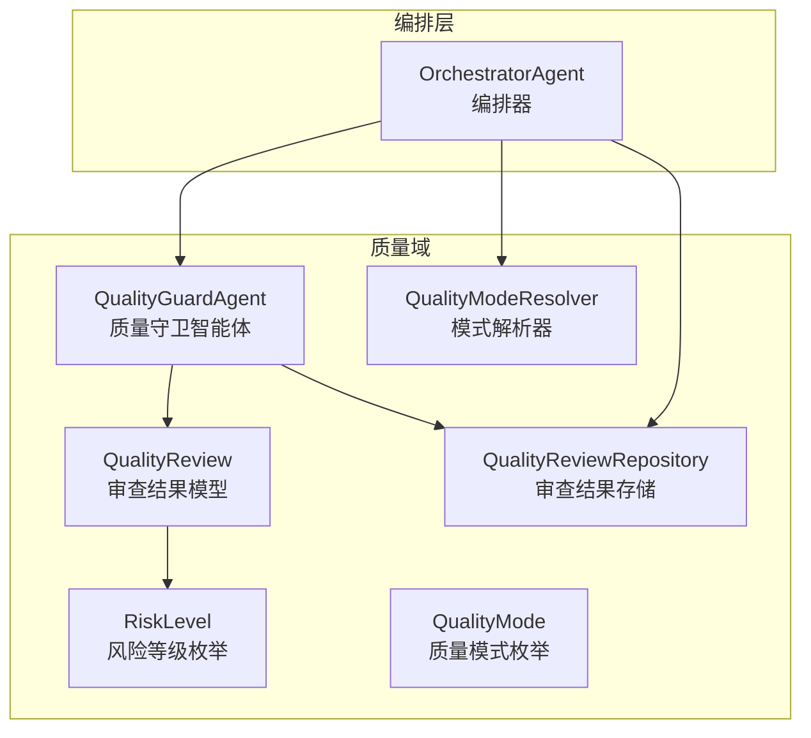
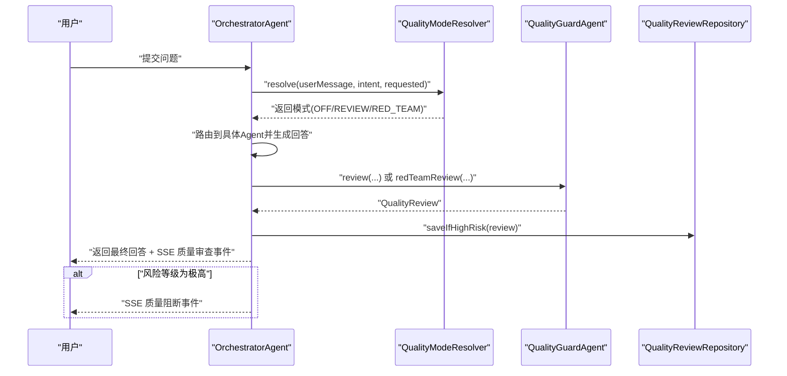
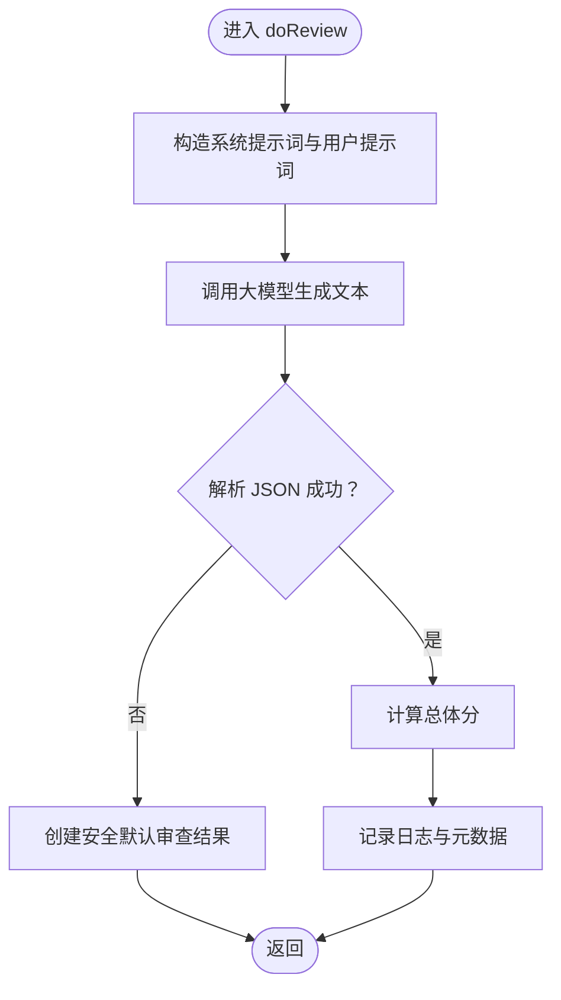
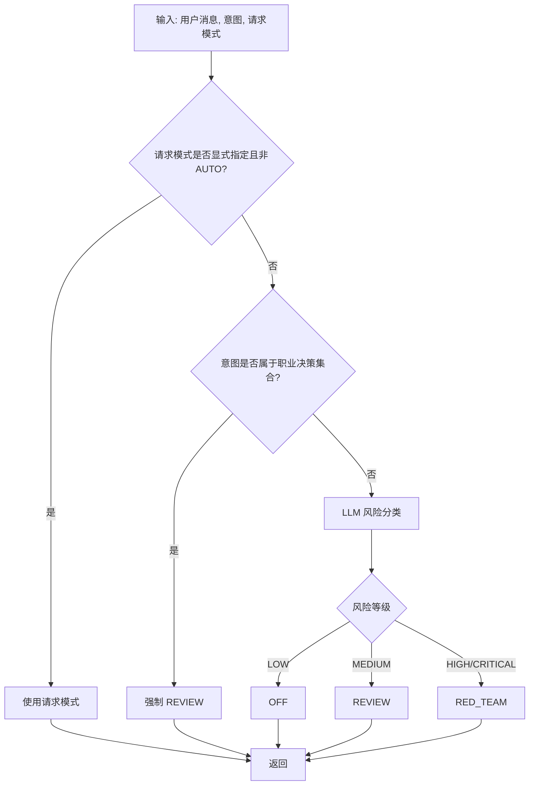
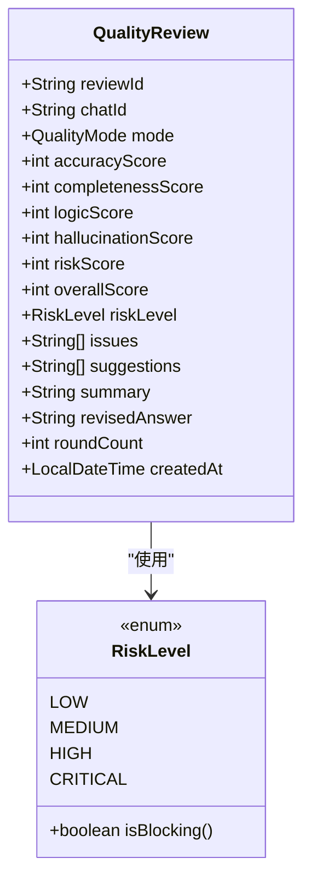
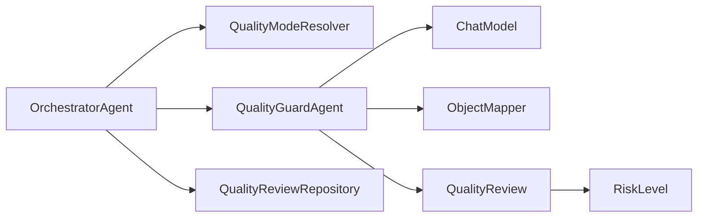

# 质量守卫机制

<cite>
**本文引用的文件**
- [QualityGuardAgent.java](file://src/main/java/com/yupi/yuaiagent/quality/QualityGuardAgent.java)
- [QualityMode.java](file://src/main/java/com/yupi/yuaiagent/quality/QualityMode.java)
- [QualityModeResolver.java](file://src/main/java/com/yupi/yuaiagent/quality/QualityModeResolver.java)
- [QualityReview.java](file://src/main/java/com/yupi/yuaiagent/quality/QualityReview.java)
- [RiskLevel.java](file://src/main/java/com/yupi/yuaiagent/quality/RiskLevel.java)
- [QualityReviewRepository.java](file://src/main/java/com/yupi/yuaiagent/quality/QualityReviewRepository.java)
- [OrchestratorAgent.java](file://src/main/java/com/yupi/yuaiagent/agent/OrchestratorAgent.java)
- [plan-quality-guard.md](file://docs/plan-quality-guard.md)
</cite>

## 目录
1. [简介](#简介)
2. [项目结构](#项目结构)
3. [核心组件](#核心组件)
4. [架构总览](#架构总览)
5. [详细组件分析](#详细组件分析)
6. [依赖关系分析](#依赖关系分析)
7. [性能考量](#性能考量)
8. [故障排查指南](#故障排查指南)
9. [结论](#结论)
10. [附录](#附录)

## 简介
本文件系统化阐述质量守卫机制的设计与实现，聚焦以下目标：
- 深入解释 QualityGuardAgent 的核心职责与工作机制：输出质量检查、内容完整性验证、合规性审核流程
- 详述 QualityMode 枚举的四种模式及其适用场景
- 解析 QualityModeResolver 的模式选择算法与决策逻辑
- 明确质量守卫的触发条件、检查规则与处理策略
- 提供配置示例、自定义质量规则与阈值设置指南
- 总结在不同智能体类型中的应用差异与最佳实践
- 面向开发者给出扩展与定制化的技术指导

## 项目结构
质量守卫相关代码位于质量域包下，围绕“模式解析—质量审查—持久化—轨迹记录—前端事件”形成闭环。

图表来源
- [QualityGuardAgent.java:30-199](file://src/main/java/com/yupi/yuaiagent/quality/QualityGuardAgent.java#L30-L199)
- [QualityModeResolver.java:27-111](file://src/main/java/com/yupi/yuaiagent/quality/QualityModeResolver.java#L27-L111)
- [QualityReview.java:14-43](file://src/main/java/com/yupi/yuaiagent/quality/QualityReview.java#L14-L43)
- [RiskLevel.java:8-35](file://src/main/java/com/yupi/yuaiagent/quality/RiskLevel.java#L8-L35)
- [QualityReviewRepository.java:24-91](file://src/main/java/com/yupi/yuaiagent/quality/QualityReviewRepository.java#L24-L91)
- [QualityMode.java:8-32](file://src/main/java/com/yupi/yuaiagent/quality/QualityMode.java#L8-L32)
- [OrchestratorAgent.java:653-704](file://src/main/java/com/yupi/yuaiagent/agent/OrchestratorAgent.java#L653-L704)

章节来源
- [QualityGuardAgent.java:1-199](file://src/main/java/com/yupi/yuaiagent/quality/QualityGuardAgent.java#L1-L199)
- [QualityModeResolver.java:1-111](file://src/main/java/com/yupi/yuaiagent/quality/QualityModeResolver.java#L1-L111)
- [QualityReviewRepository.java:1-91](file://src/main/java/com/yupi/yuaiagent/quality/QualityReviewRepository.java#L1-L91)
- [OrchestratorAgent.java:653-704](file://src/main/java/com/yupi/yuaiagent/agent/OrchestratorAgent.java#L653-L704)

## 核心组件
- QualityGuardAgent：负责对 Agent 输出进行质量审查，产出多维评分、风险等级、问题清单与改进建议；支持常规审查与红蓝对抗两种模式。
- QualityModeResolver：根据用户意图与请求模式，自动判定应采用的审查模式（OFF/REVIEW/RED_TEAM）。
- QualityReview：审查结果的数据模型，包含各维度分数、总体分、风险等级、问题与建议、创建时间等。
- RiskLevel：风险等级枚举，提供阻断判定能力。
- QualityReviewRepository：将高风险审查结果持久化至本地文件，便于审计与告警。
- QualityMode：质量模式枚举，定义 OFF、AUTO、REVIEW、RED_TEAM 四种模式。

章节来源
- [QualityGuardAgent.java:17-199](file://src/main/java/com/yupi/yuaiagent/quality/QualityGuardAgent.java#L17-L199)
- [QualityModeResolver.java:15-111](file://src/main/java/com/yupi/yuaiagent/quality/QualityModeResolver.java#L15-L111)
- [QualityReview.java:9-43](file://src/main/java/com/yupi/yuaiagent/quality/QualityReview.java#L9-L43)
- [RiskLevel.java:3-35](file://src/main/java/com/yupi/yuaiagent/quality/RiskLevel.java#L3-L35)
- [QualityReviewRepository.java:18-91](file://src/main/java/com/yupi/yuaiagent/quality/QualityReviewRepository.java#L18-L91)
- [QualityMode.java:3-32](file://src/main/java/com/yupi/yuaiagent/quality/QualityMode.java#L3-L32)

## 架构总览
质量守卫在编排层之后介入，贯穿“模式解析—质量审查—轨迹记录—事件推送—阻断控制”的主干流程。

图表来源
- [OrchestratorAgent.java:653-704](file://src/main/java/com/yupi/yuaiagent/agent/OrchestratorAgent.java#L653-L704)
- [QualityModeResolver.java:56-83](file://src/main/java/com/yupi/yuaiagent/quality/QualityModeResolver.java#L56-L83)
- [QualityGuardAgent.java:101-158](file://src/main/java/com/yupi/yuaiagent/quality/QualityGuardAgent.java#L101-L158)
- [QualityReviewRepository.java:47-57](file://src/main/java/com/yupi/yuaiagent/quality/QualityReviewRepository.java#L47-L57)

## 详细组件分析

### QualityGuardAgent：质量审查与合规审核
- 职责边界
  - 对 Agent 输出进行准确性、完整性、逻辑性、幻觉风险与合规风险的综合评估
  - 输出标准化 JSON 结构，包含各维度分数、总体分、风险等级、问题清单、改进建议与摘要
  - 在异常情况下返回安全默认值，确保系统稳健性
- 审查模式
  - REVIEW：单次审查，适用于中等风险场景
  - RED_TEAM：对抗式审查，适用于高风险与合规要求场景
- 关键流程
  - 构造系统提示词与用户提示词
  - 调用大模型生成审查结果文本
  - 解析 JSON（兼容 Markdown 代码块）
  - 计算总体分（加权平均）
  - 记录日志与时间戳
- 异常处理
  - 解析失败或模型调用异常时，回退为安全默认值（中等风险、较低总体分），避免中断服务

图表来源
- [QualityGuardAgent.java:115-198](file://src/main/java/com/yupi/yuaiagent/quality/QualityGuardAgent.java#L115-L198)

章节来源
- [QualityGuardAgent.java:17-199](file://src/main/java/com/yupi/yuaiagent/quality/QualityGuardAgent.java#L17-L199)

### QualityModeResolver：模式选择算法与决策逻辑
- 决策链路
  - 手动覆盖优先：若用户显式指定模式且非 AUTO，则直接采用
  - 意图驱动：针对特定职业决策意图（如简历、谈判、逃离）直接进入 REVIEW
  - LLM 风险分类：对其他问题进行风险等级判断，LOW→OFF，MEDIUM→REVIEW，HIGH/CRITICAL→RED_TEAM
  - 异常兜底：分类失败时默认 OFF，并记录警告日志
- 风险等级映射
  - LOW：日常闲聊、一般建议、学习知识
  - MEDIUM：职业规划、简历优化、面试准备
  - HIGH：财务投资建议、法律咨询、医疗健康
  - CRITICAL：涉及个人隐私解析、可能造成严重财务/法律后果

图表来源
- [QualityModeResolver.java:56-107](file://src/main/java/com/yupi/yuaiagent/quality/QualityModeResolver.java#L56-L107)

章节来源
- [QualityModeResolver.java:15-111](file://src/main/java/com/yupi/yuaiagent/quality/QualityModeResolver.java#L15-L111)

### QualityReview 与 RiskLevel：数据模型与阻断判定
- QualityReview 字段
  - 审查标识、会话标识、消息标识、模式
  - 各维度分数（准确性、完整性、逻辑性、幻觉风险、风险度）、总体分
  - 风险等级、问题清单、建议列表、摘要
  - 红队模式特有：修订回答、对抗轮次
  - 创建时间
- RiskLevel
  - 提供阻断判定方法，极高风险即阻断

图表来源
- [QualityReview.java:14-43](file://src/main/java/com/yupi/yuaiagent/quality/QualityReview.java#L14-L43)
- [RiskLevel.java:8-35](file://src/main/java/com/yupi/yuaiagent/quality/RiskLevel.java#L8-L35)

章节来源
- [QualityReview.java:9-43](file://src/main/java/com/yupi/yuaiagent/quality/QualityReview.java#L9-L43)
- [RiskLevel.java:3-35](file://src/main/java/com/yupi/yuaiagent/quality/RiskLevel.java#L3-L35)

### QualityReviewRepository：高风险持久化与审计
- 仅对 HIGH 与 CRITICAL 的审查结果进行持久化，降低存储压力
- 使用线程安全列表与文件序列化，支持初始化加载与增量写入
- 提供按风险等级查询接口，便于审计与告警

章节来源
- [QualityReviewRepository.java:18-91](file://src/main/java/com/yupi/yuaiagent/quality/QualityReviewRepository.java#L18-L91)

### OrchestratorAgent 集成：触发条件、检查规则与处理策略
- 触发条件
  - 编排层在路由后根据模式决定是否进行质量审查
- 检查规则
  - REVIEW 模式：单次审查，记录总体分与风险等级
  - RED_TEAM 模式：多次对抗与修正，直至验收通过
- 处理策略
  - 将审查结果写入执行轨迹元数据
  - 对 HIGH/CRITICAL 审查结果进行持久化
  - 通过 SSE 推送质量审查事件；当风险等级为极高时推送阻断事件

章节来源
- [OrchestratorAgent.java:653-704](file://src/main/java/com/yupi/yuaiagent/agent/OrchestratorAgent.java#L653-L704)

## 依赖关系分析
- 组件内聚与耦合
  - QualityGuardAgent 依赖大模型服务以完成审查，内部具备解析与容错能力
  - QualityModeResolver 依赖大模型进行风险分类，策略清晰、可扩展
  - OrchestratorAgent 作为编排入口，协调模式解析与质量审查流程
  - QualityReviewRepository 与执行轨迹解耦，仅承担高风险审计职责
- 外部依赖
  - 大模型调用（Spring AI ChatModel）
  - JSON 解析（Jackson）
  - SSE 事件推送（Spring Web MVC）

图表来源
- [OrchestratorAgent.java:653-704](file://src/main/java/com/yupi/yuaiagent/agent/OrchestratorAgent.java#L653-L704)
- [QualityGuardAgent.java:93-99](file://src/main/java/com/yupi/yuaiagent/quality/QualityGuardAgent.java#L93-L99)
- [QualityModeResolver.java:50-54](file://src/main/java/com/yupi/yuaiagent/quality/QualityModeResolver.java#L50-L54)
- [QualityReviewRepository.java:28-36](file://src/main/java/com/yupi/yuaiagent/quality/QualityReviewRepository.java#L28-L36)

## 性能考量
- 模式选择成本
  - OFF：零额外延迟，适合日常闲聊
  - REVIEW：单次模型调用，延迟约数秒
  - RED_TEAM：多轮对抗与修正，延迟较高
- JSON 解析与容错
  - 支持 Markdown 代码块包裹的 JSON，提升鲁棒性
  - 解析失败时快速回退安全默认值，避免长时间等待
- 存储与 I/O
  - 仅持久化高风险审查结果，降低磁盘压力
  - 初始化加载与增量写入，兼顾启动速度与实时性

## 故障排查指南
- 审查失败
  - 现象：返回安全默认值，日志出现错误
  - 排查：检查大模型服务可用性、提示词格式、JSON 解析逻辑
- 风险分类异常
  - 现象：模式解析失败，默认 OFF
  - 排查：确认大模型返回 JSON 结构、字段提取逻辑
- SSE 推送失败
  - 现象：前端未收到质量审查事件
  - 排查：检查事件源连接、网络状况、异常吞吐日志
- 阻断判定
  - 现象：极高风险回答被阻断
  - 排查：核对风险等级映射、阻断逻辑与前端提示

章节来源
- [QualityGuardAgent.java:154-158](file://src/main/java/com/yupi/yuaiagent/quality/QualityGuardAgent.java#L154-L158)
- [QualityModeResolver.java:79-82](file://src/main/java/com/yupi/yuaiagent/quality/QualityModeResolver.java#L79-L82)
- [OrchestratorAgent.java:677-696](file://src/main/java/com/yupi/yuaiagent/agent/OrchestratorAgent.java#L677-L696)

## 结论
质量守卫机制通过“意图与风险驱动的模式选择 + 多维质量审查 + 可视化轨迹与事件”的组合，实现了从“结果可信度”出发的治理闭环。其设计兼顾性能与稳健性，既满足日常低延迟需求，又能在高风险场景提供强化审查与阻断能力。建议在生产环境中结合业务场景灵活启用 RED_TEAM，并配合持久化与告警体系完善审计与改进。

## 附录

### QualityMode 枚举与应用场景
- OFF：日常闲聊、简单问题，无需审查
- REVIEW：重要决策、专业建议（如简历优化、面试准备），单次审查
- RED_TEAM：高风险与合规要求（如财务/法律/隐私），对抗式审查与修正
- AUTO：由解析器自动判断（优先级低于手动覆盖）

章节来源
- [QualityMode.java:8-32](file://src/main/java/com/yupi/yuaiagent/quality/QualityMode.java#L8-L32)
- [plan-quality-guard.md:50-57](file://docs/plan-quality-guard.md#L50-L57)

### 质量守卫触发与处理流程（编排侧）
- 触发时机：编排层路由后
- 处理策略：记录轨迹元数据、持久化高风险、推送 SSE 事件、必要时阻断

章节来源
- [OrchestratorAgent.java:659-704](file://src/main/java/com/yupi/yuaiagent/agent/OrchestratorAgent.java#L659-L704)

### 配置示例与自定义指南
- 配置要点
  - 审查结果存储目录：通过配置项设置存储根路径
  - 模式解析策略：可通过用户参数覆盖 AUTO 模式
- 自定义质量规则
  - 在审查提示词中新增检查维度或调整权重
  - 在模式解析器中扩展意图集合或风险分类逻辑
- 质量阈值设置
  - 总体分阈值：用于决定是否阻断或提示
  - 风险等级阈值：用于阻断判定（极高风险阻断）

章节来源
- [QualityReviewRepository.java:28-36](file://src/main/java/com/yupi/yuaiagent/quality/QualityReviewRepository.java#L28-L36)
- [QualityGuardAgent.java:160-166](file://src/main/java/com/yupi/yuaiagent/quality/QualityGuardAgent.java#L160-L166)
- [RiskLevel.java:31-33](file://src/main/java/com/yupi/yuaiagent/quality/RiskLevel.java#L31-L33)

### 不同智能体类型的差异与最佳实践
- 通用型 Agent：默认 OFF 或 REVIEW，关注用户体验与响应速度
- 专业型 Agent：简历、谈判、职业规划类建议，建议启用 REVIEW
- 高风险 Agent：财务、法律、医疗、隐私相关，建议 RED_TEAM
- 最佳实践
  - 将模式解析与业务意图绑定，减少误判
  - 对高风险场景开启阻断与审计
  - 在前端展示质量评分与问题清单，增强透明度

章节来源
- [plan-quality-guard.md:70-91](file://docs/plan-quality-guard.md#L70-L91)
- [QualityModeResolver.java:31-33](file://src/main/java/com/yupi/yuaiagent/quality/QualityModeResolver.java#L31-L33)