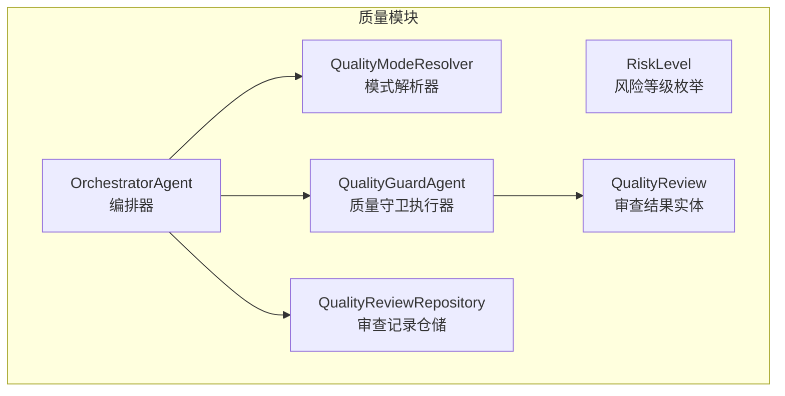
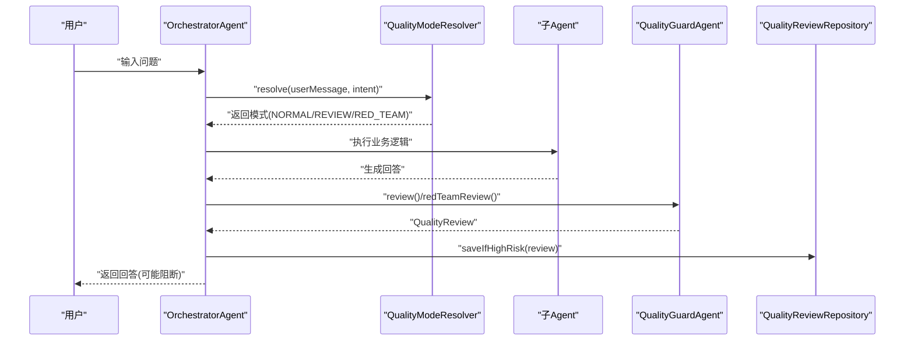
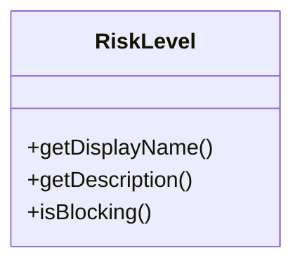
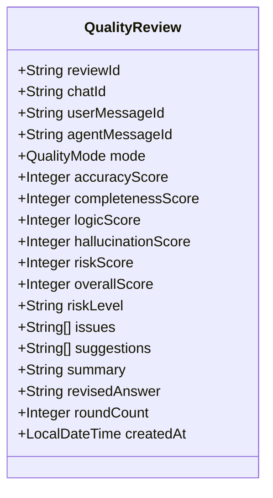
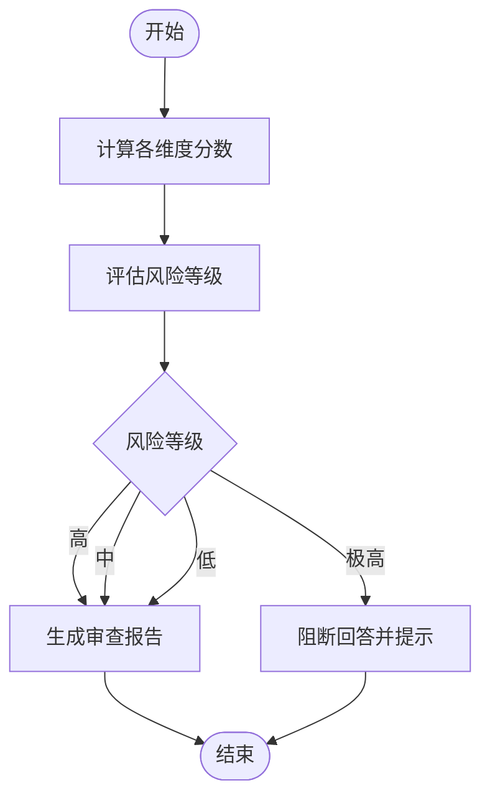
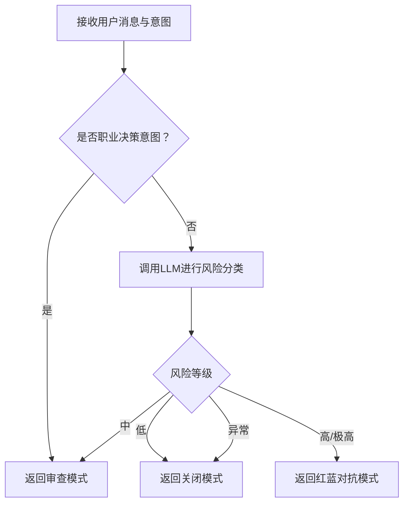
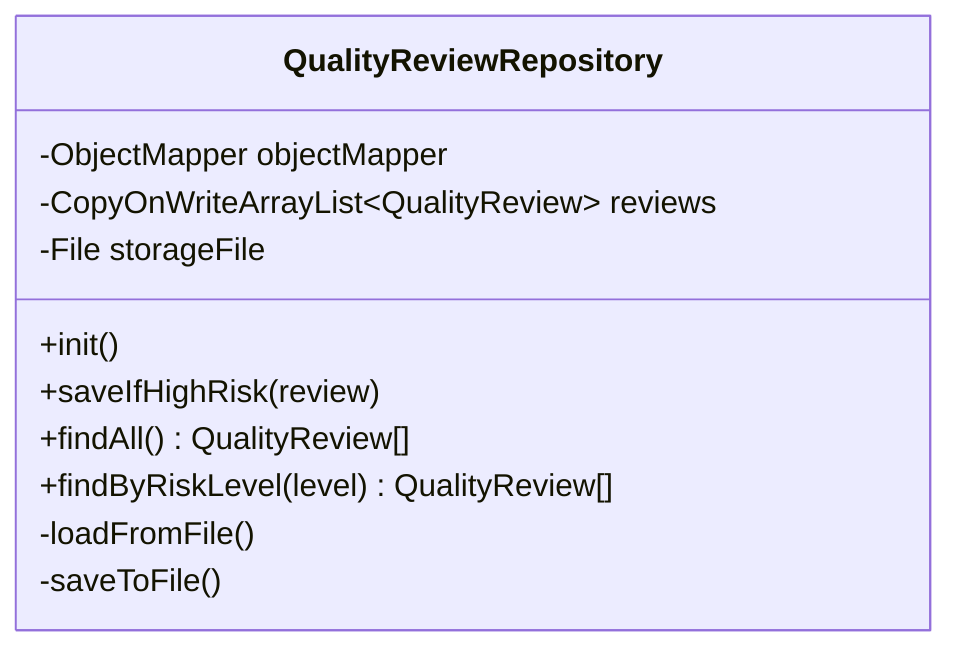
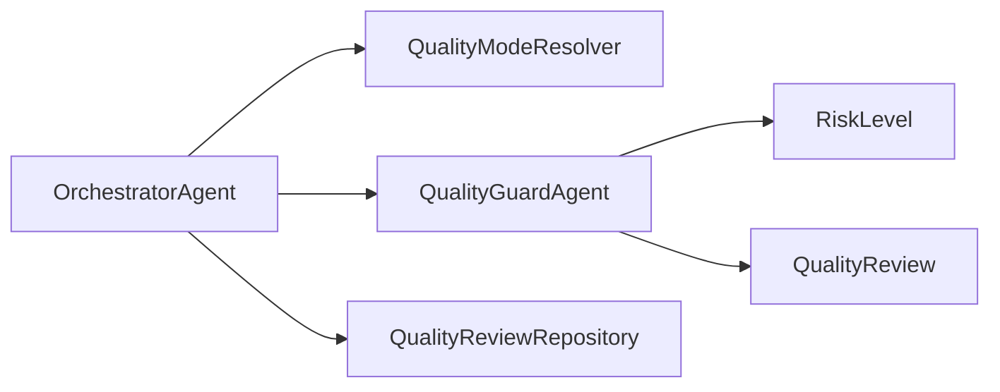

# 风险评估体系

<cite>
**本文引用的文件**
- [RiskLevel.java](file://src/main/java/com/yupi/yuaiagent/quality/RiskLevel.java)
- [QualityReview.java](file://src/main/java/com/yupi/yuaiagent/quality/QualityReview.java)
- [QualityGuardAgent.java](file://src/main/java/com/yupi/yuaiagent/quality/QualityGuardAgent.java)
- [QualityModeResolver.java](file://src/main/java/com/yupi/yuaiagent/quality/QualityModeResolver.java)
- [QualityReviewRepository.java](file://src/main/java/com/yupi/yuaiagent/quality/QualityReviewRepository.java)
- [OrchestratorAgent.java](file://src/main/java/com/yupi/yuaiagent/agent/OrchestratorAgent.java)
- [plan-quality-guard.md](file://docs/plan-quality-guard.md)
- [plan-feature-expansion.md](file://docs/plan-feature-expansion.md)
</cite>

## 目录
1. [引言](#引言)
2. [项目结构](#项目结构)
3. [核心组件](#核心组件)
4. [架构总览](#架构总览)
5. [详细组件分析](#详细组件分析)
6. [依赖分析](#依赖分析)
7. [性能考虑](#性能考虑)
8. [故障排查指南](#故障排查指南)
9. [结论](#结论)
10. [附录](#附录)

## 引言
本技术文档围绕风险评估体系进行系统化梳理，覆盖风险等级划分标准、质量审查实体的数据结构与审查流程、风险评估触发条件与算法、决策机制、存储与查询策略、配置与扩展方法、以及与质量守卫的整体协作流程。文档旨在帮助质量工程师在实际落地与优化过程中，快速理解并高效实施风险评估方案。

## 项目结构
风险评估体系位于质量模块下，核心由以下文件构成：
- 风险等级枚举：RiskLevel
- 审查结果实体：QualityReview
- 质量守卫执行器：QualityGuardAgent
- 模式解析器：QualityModeResolver
- 审查记录仓储：QualityReviewRepository
- 协调编排器：OrchestratorAgent（触发与集成）

图表来源
- [RiskLevel.java:1-34](file://src/main/java/com/yupi/yuaiagent/quality/RiskLevel.java#L1-L34)
- [QualityReview.java:1-200](file://src/main/java/com/yupi/yuaiagent/quality/QualityReview.java#L1-L200)
- [QualityGuardAgent.java:1-200](file://src/main/java/com/yupi/yuaiagent/quality/QualityGuardAgent.java#L1-L200)
- [QualityModeResolver.java:1-120](file://src/main/java/com/yupi/yuaiagent/quality/QualityModeResolver.java#L1-L120)
- [QualityReviewRepository.java:1-90](file://src/main/java/com/yupi/yuaiagent/quality/QualityReviewRepository.java#L1-L90)
- [OrchestratorAgent.java:659-682](file://src/main/java/com/yupi/yuaiagent/agent/OrchestratorAgent.java#L659-L682)

章节来源
- [RiskLevel.java:1-34](file://src/main/java/com/yupi/yuaiagent/quality/RiskLevel.java#L1-L34)
- [QualityReview.java:1-200](file://src/main/java/com/yupi/yuaiagent/quality/QualityReview.java#L1-L200)
- [QualityGuardAgent.java:1-200](file://src/main/java/com/yupi/yuaiagent/quality/QualityGuardAgent.java#L1-L200)
- [QualityModeResolver.java:1-120](file://src/main/java/com/yupi/yuaiagent/quality/QualityModeResolver.java#L1-L120)
- [QualityReviewRepository.java:1-90](file://src/main/java/com/yupi/yuaiagent/quality/QualityReviewRepository.java#L1-L90)
- [OrchestratorAgent.java:659-682](file://src/main/java/com/yupi/yuaiagent/agent/OrchestratorAgent.java#L659-L682)

## 核心组件
- RiskLevel：定义风险等级（低、中、高、极高），并提供阻断判定能力。
- QualityReview：承载审查评分、问题与建议、风险等级、摘要等字段，并支持红队模式下的修订与对抗轮次统计。
- QualityGuardAgent：基于多维评分与风险等级生成审查报告；在红队模式下执行对抗式审查与修正。
- QualityModeResolver：根据意图与LLM风险分类决定执行模式（关闭/审查/红蓝对抗）。
- QualityReviewRepository：按需持久化高风险审查记录，支持查询与文件级I/O。
- OrchestratorAgent：在编排链路中触发质量审查，记录追踪元数据，推送SSE事件，并按风险级别持久化。

章节来源
- [RiskLevel.java:1-34](file://src/main/java/com/yupi/yuaiagent/quality/RiskLevel.java#L1-L34)
- [QualityReview.java:1-200](file://src/main/java/com/yupi/yuaiagent/quality/QualityReview.java#L1-L200)
- [QualityGuardAgent.java:1-200](file://src/main/java/com/yupi/yuaiagent/quality/QualityGuardAgent.java#L1-L200)
- [QualityModeResolver.java:1-120](file://src/main/java/com/yupi/yuaiagent/quality/QualityModeResolver.java#L1-L120)
- [QualityReviewRepository.java:1-90](file://src/main/java/com/yupi/yuaiagent/quality/QualityReviewRepository.java#L1-L90)
- [OrchestratorAgent.java:659-682](file://src/main/java/com/yupi/yuaiagent/agent/OrchestratorAgent.java#L659-L682)

## 架构总览
风险评估贯穿意图识别、模式决策、质量审查、阻断与持久化、追踪与事件推送的全链路。

图表来源
- [QualityModeResolver.java:65-110](file://src/main/java/com/yupi/yuaiagent/quality/QualityModeResolver.java#L65-L110)
- [OrchestratorAgent.java:659-682](file://src/main/java/com/yupi/yuaiagent/agent/OrchestratorAgent.java#L659-L682)
- [QualityGuardAgent.java:1-200](file://src/main/java/com/yupi/yuaiagent/quality/QualityGuardAgent.java#L1-L200)
- [QualityReviewRepository.java:47-57](file://src/main/java/com/yupi/yuaiagent/quality/QualityReviewRepository.java#L47-L57)

## 详细组件分析

### RiskLevel 风险等级与阈值
- 等级定义：低、中、高、极高。
- 描述用途：用于指导用户行为与阻断策略。
- 阻断判定：极高风险具备阻断能力，用于保护用户与系统安全。

图表来源
- [RiskLevel.java:1-34](file://src/main/java/com/yupi/yuaiagent/quality/RiskLevel.java#L1-L34)

章节来源
- [RiskLevel.java:1-34](file://src/main/java/com/yupi/yuaiagent/quality/RiskLevel.java#L1-L34)

### QualityReview 审查结果数据模型
- 关键字段：审查标识、会话与消息ID、审查模式、准确性/完整性/逻辑性/幻觉安全度/风险度/综合分、风险等级、问题列表、建议列表、摘要、红队修订答案与对抗轮次、创建时间。
- 红队模式特有：修订答案与对抗轮次，便于审计与复盘。

图表来源
- [QualityReview.java:1-200](file://src/main/java/com/yupi/yuaiagent/quality/QualityReview.java#L1-L200)

章节来源
- [QualityReview.java:1-200](file://src/main/java/com/yupi/yuaiagent/quality/QualityReview.java#L1-L200)

### QualityGuardAgent 审查算法与决策
- 审查维度：准确性、完整性、逻辑性、幻觉安全度、风险度。
- 输出格式：严格JSON，包含各维度分数、综合分、风险等级、问题与建议、摘要。
- 红队策略：扮演“红队”角色，穷尽攻击点（事实核查、逻辑漏洞、隐含假设、边界情况、合规与隐私风险），并以“宁可误报、不可漏报”的原则输出。
- 阻断机制：当风险等级为极高时，阻断原始回答并返回风险提示，引导用户咨询专业人士。

图表来源
- [QualityGuardAgent.java:65-99](file://src/main/java/com/yupi/yuaiagent/quality/QualityGuardAgent.java#L65-L99)
- [plan-quality-guard.md:92-392](file://docs/plan-quality-guard.md#L92-L392)

章节来源
- [QualityGuardAgent.java:1-200](file://src/main/java/com/yupi/yuaiagent/quality/QualityGuardAgent.java#L1-L200)
- [plan-quality-guard.md:92-392](file://docs/plan-quality-guard.md#L92-L392)

### QualityModeResolver 触发条件与评估算法
- 触发条件：
  - 明确意图：职业决策类意图直接进入审查模式。
  - LLM风险分类：对非明确意图的问题，通过LLM进行风险等级分类，映射到不同执行模式。
- 算法要点：
  - 使用系统提示词限定输出格式，确保可解析性。
  - 采用JSON提取与关键字匹配的方式解析LLM输出。
  - 异常兜底：分类失败时默认关闭模式，保障稳定性。

图表来源
- [QualityModeResolver.java:65-110](file://src/main/java/com/yupi/yuaiagent/quality/QualityModeResolver.java#L65-L110)
- [plan-feature-expansion.md:373-479](file://docs/plan-feature-expansion.md#L373-L479)

章节来源
- [QualityModeResolver.java:1-120](file://src/main/java/com/yupi/yuaiagent/quality/QualityModeResolver.java#L1-L120)
- [plan-feature-expansion.md:373-479](file://docs/plan-feature-expansion.md#L373-L479)

### QualityReviewRepository 存储策略与查询优化
- 存储策略：
  - 仅对高风险与极高风险的审查记录进行持久化，降低存储压力与I/O开销。
  - 使用线程安全的并发列表与文件JSON序列化，支持初始化加载与增量写入。
- 查询接口：
  - 提供全量查询与按风险等级过滤查询，便于审计与统计。
- 文件I/O：
  - 初始化时加载历史数据；保存时采用美化打印，便于人工审计。

图表来源
- [QualityReviewRepository.java:1-90](file://src/main/java/com/yupi/yuaiagent/quality/QualityReviewRepository.java#L1-L90)

章节来源
- [QualityReviewRepository.java:1-90](file://src/main/java/com/yupi/yuaiagent/quality/QualityReviewRepository.java#L1-L90)

### OrchestratorAgent 集成与事件推送
- 在编排链路中触发质量审查，记录审查元数据（综合分、风险等级、模式），并按风险级别持久化。
- 通过SSE向前端推送实时审查事件，便于可视化与监控。

章节来源
- [OrchestratorAgent.java:659-682](file://src/main/java/com/yupi/yuaiagent/agent/OrchestratorAgent.java#L659-L682)

## 依赖分析
- 模块内依赖：
  - OrchestratorAgent 依赖 QualityModeResolver 决策模式，依赖 QualityGuardAgent 执行审查，依赖 QualityReviewRepository 持久化高风险记录。
  - QualityGuardAgent 依赖外部LLM服务进行审查与红队对抗。
  - QualityReviewRepository 依赖文件系统与JSON序列化工具。
- 外部依赖：
  - LLM模型调用（用于意图识别与风险分类）、SSE推送、追踪记录器。

图表来源
- [OrchestratorAgent.java:659-682](file://src/main/java/com/yupi/yuaiagent/agent/OrchestratorAgent.java#L659-L682)
- [QualityModeResolver.java:65-110](file://src/main/java/com/yupi/yuaiagent/quality/QualityModeResolver.java#L65-L110)
- [QualityGuardAgent.java:1-200](file://src/main/java/com/yupi/yuaiagent/quality/QualityGuardAgent.java#L1-L200)
- [QualityReviewRepository.java:1-90](file://src/main/java/com/yupi/yuaiagent/quality/QualityReviewRepository.java#L1-L90)
- [RiskLevel.java:1-34](file://src/main/java/com/yupi/yuaiagent/quality/RiskLevel.java#L1-L34)
- [QualityReview.java:1-200](file://src/main/java/com/yupi/yuaiagent/quality/QualityReview.java#L1-L200)

## 性能考虑
- 模式选择延迟：
  - 关闭模式：无额外延迟。
  - 审查模式：约3-5秒。
  - 红蓝对抗模式：约8-15秒。
- 存储优化：
  - 仅持久化高风险与极高风险记录，避免审查数据膨胀。
  - 使用并发容器与文件级I/O，减少锁竞争与磁盘压力。
- LLM调用：
  - 风险分类采用轻量提示词与JSON约束，缩短响应时间并提升解析稳定性。

章节来源
- [plan-feature-expansion.md:435-448](file://docs/plan-feature-expansion.md#L435-L448)
- [QualityReviewRepository.java:47-57](file://src/main/java/com/yupi/yuaiagent/quality/QualityReviewRepository.java#L47-L57)

## 故障排查指南
- 风险分类失败：
  - 现象：模式解析器抛出异常并回退到关闭模式。
  - 处理：检查LLM可用性与提示词格式，确认输出符合JSON约束。
- 审查阻断：
  - 现象：极高风险时返回风险提示而非原始回答。
  - 处理：核对审查维度与风险等级，必要时调整提示词或阈值。
- 持久化异常：
  - 现象：文件读写失败日志。
  - 处理：检查存储目录权限与磁盘空间，确认JSON序列化配置。
- SSE推送失败：
  - 现象：前端无法接收审查事件。
  - 处理：检查SSE通道状态与网络连通性。

章节来源
- [QualityModeResolver.java:79-82](file://src/main/java/com/yupi/yuaiagent/quality/QualityModeResolver.java#L79-L82)
- [QualityGuardAgent.java:65-99](file://src/main/java/com/yupi/yuaiagent/quality/QualityGuardAgent.java#L65-L99)
- [QualityReviewRepository.java:71-89](file://src/main/java/com/yupi/yuaiagent/quality/QualityReviewRepository.java#L71-L89)
- [OrchestratorAgent.java:677-682](file://src/main/java/com/yupi/yuaiagent/agent/OrchestratorAgent.java#L677-L682)

## 结论
风险评估体系通过意图识别与LLM风险分类实现智能化模式决策，结合多维评分与红队对抗机制，形成从审查到阻断、从追踪到持久化的闭环。其设计兼顾用户体验与风险控制，适合在生产环境中持续演进与优化。

## 附录

### 配置与扩展指南
- 风险阈值调整：
  - 在审查维度评分与风险等级映射处进行阈值微调，以适配业务场景。
- 自定义评估规则：
  - 在质量守卫提示词中增加新的攻击点或评分维度，增强红队对抗能力。
- 模式策略定制：
  - 在模式解析器中扩展意图集合或LLM分类规则，以覆盖更多业务场景。
- 存储与查询：
  - 通过仓储接口扩展查询维度（如按时间范围、会话ID等），满足审计需求。

章节来源
- [plan-quality-guard.md:92-392](file://docs/plan-quality-guard.md#L92-L392)
- [plan-feature-expansion.md:373-479](file://docs/plan-feature-expansion.md#L373-L479)

### 风险识别与缓解策略
- 识别方法：
  - 事实核查、逻辑漏洞、隐含假设、边界情况、合规与隐私风险。
- 缓解策略：
  - 对中高风险问题提供专业建议与外部资源链接；对极高风险阻断并提示用户咨询专业人士。
- 应急处理：
  - 阻断后保留审查元数据，便于追溯与复盘；必要时启用人工复核通道。

章节来源
- [QualityGuardAgent.java:65-99](file://src/main/java/com/yupi/yuaiagent/quality/QualityGuardAgent.java#L65-L99)
- [plan-quality-guard.md:361-392](file://docs/plan-quality-guard.md#L361-L392)