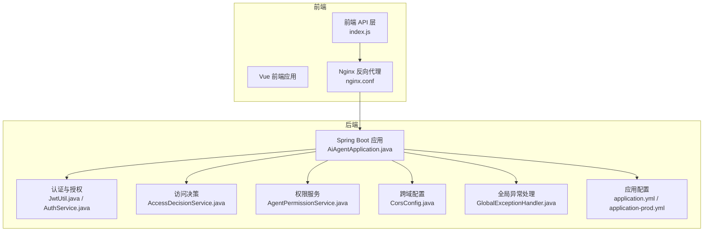
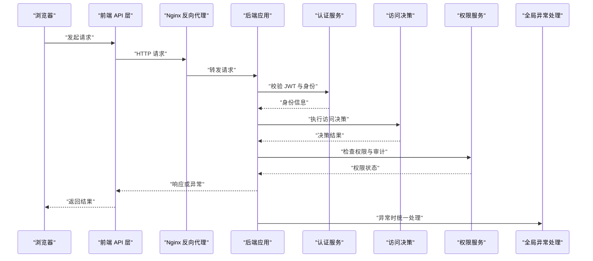
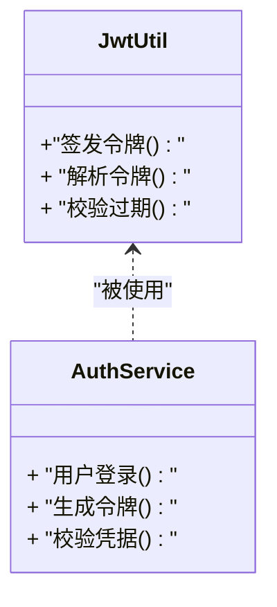
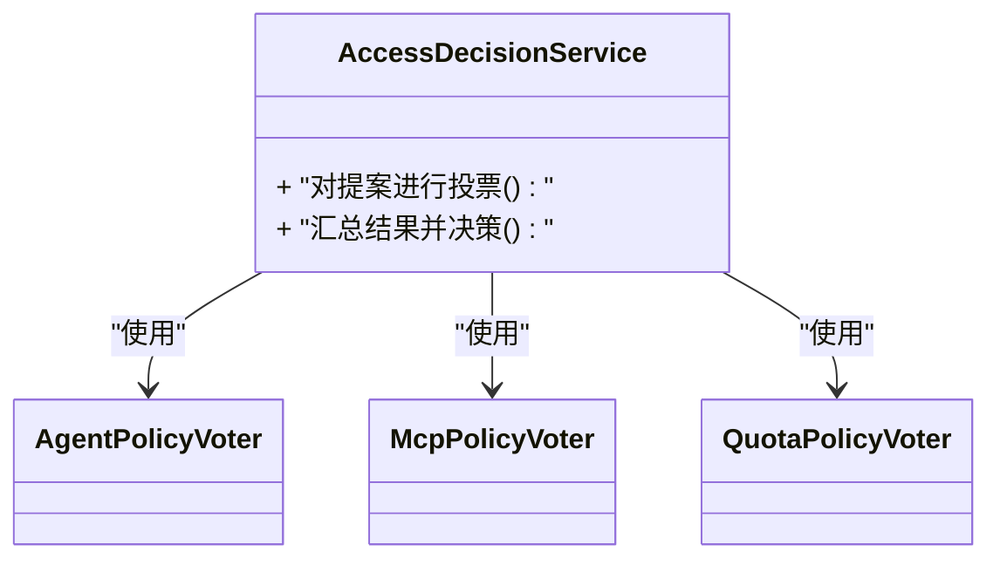
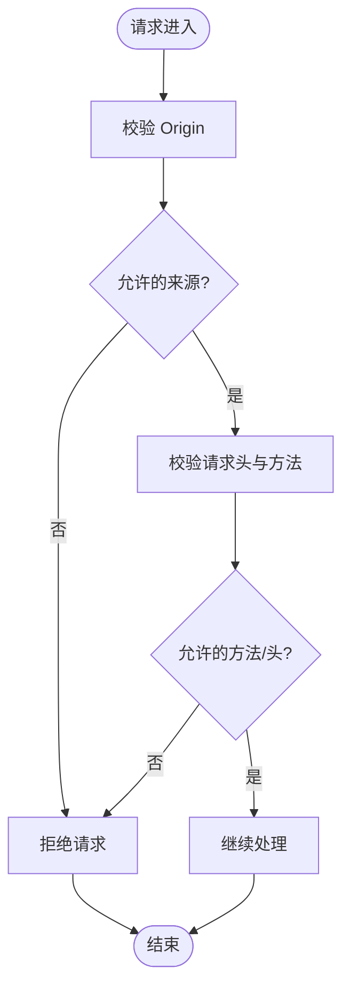
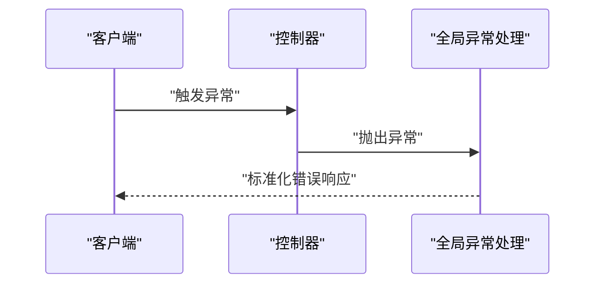
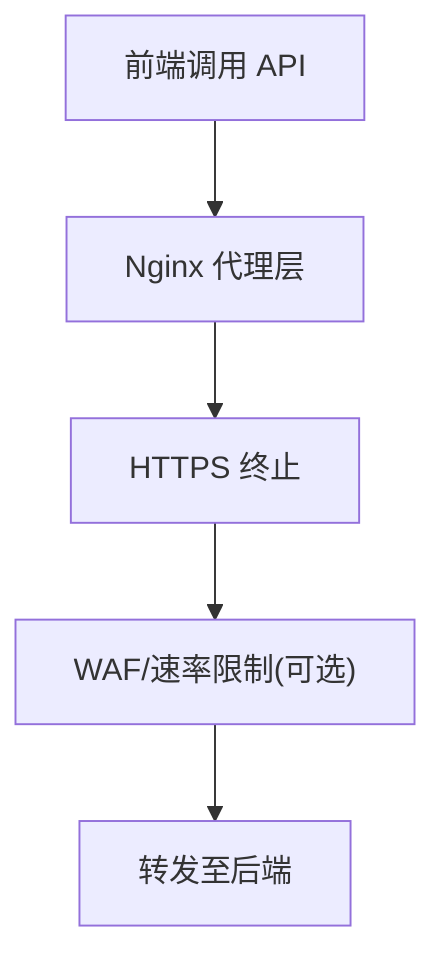
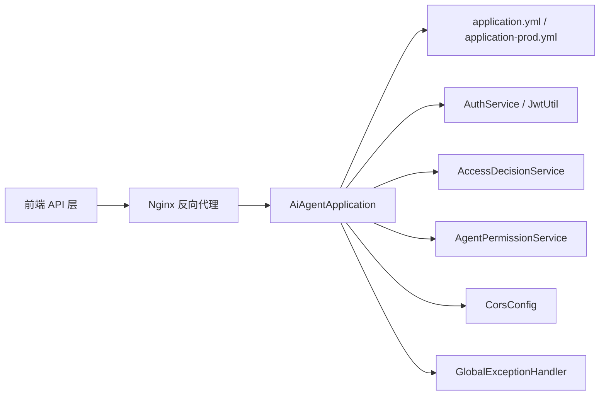

# 安全加固

<cite>
**本文引用的文件**
- [JwtUtil.java](file://src/main/java/com/yupi/yuaiagent/auth/JwtUtil.java)
- [AuthService.java](file://src/main/java/com/yupi/yuaiagent/auth/AuthService.java)
- [AccessDecisionService.java](file://src/main/java/com/yupi/yuaiagent/access/AccessDecisionService.java)
- [AgentPermissionService.java](file://src/main/java/com/yupi/yuaiagent/permission/AgentPermissionService.java)
- [CorsConfig.java](file://src/main/java/com/yupi/yuaiagent/config/CorsConfig.java)
- [GlobalExceptionHandler.java](file://src/main/java/com/yupi/yuaiagent/exception/GlobalExceptionHandler.java)
- [application.yml](file://src/main/resources/application.yml)
- [application-prod.yml](file://src/main/resources/application-prod.yml)
- [Dockerfile](file://Dockerfile)
- [nginx.conf](file://yu-ai-agent-frontend/nginx.conf)
- [index.js](file://yu-ai-agent-frontend/src/api/index.js)
- [AiAgentApplication.java](file://src/main/java/com/yupi/yuaiagent/AiAgentApplication.java)
</cite>

## 目录
1. [引言](#引言)
2. [项目结构](#项目结构)
3. [核心组件](#核心组件)
4. [架构总览](#架构总览)
5. [详细组件分析](#详细组件分析)
6. [依赖关系分析](#依赖关系分析)
7. [性能考虑](#性能考虑)
8. [故障排除指南](#故障排除指南)
9. [结论](#结论)
10. [附录](#附录)

## 引言
本指南面向安全工程师与运维人员，提供针对该多智能体系统的安全加固实施方案。内容涵盖应用安全配置、认证授权机制与访问控制策略，JWT 令牌管理、密码加密存储与敏感数据保护，网络安全配置、防火墙与 DDoS 防护，数据安全与传输加密、审计日志配置，以及安全漏洞扫描、渗透测试与安全事件响应流程。文档基于仓库中的实际代码与配置进行分析，并提供可操作的加固建议。

## 项目结构
系统采用前后端分离架构：后端为基于 Java 的 Spring Boot 应用，前端为 Vue + Vite 构建的单页应用。后端通过控制器暴露 REST 接口，前端通过 API 层与后端交互。生产环境通过 Docker 容器化部署，使用 Nginx 进行反向代理与静态资源服务。

**图表来源**
- [AiAgentApplication.java](file://src/main/java/com/yupi/yuaiagent/AiAgentApplication.java)
- [index.js](file://yu-ai-agent-frontend/src/api/index.js)
- [nginx.conf](file://yu-ai-agent-frontend/nginx.conf)
- [JwtUtil.java](file://src/main/java/com/yupi/yuaiagent/auth/JwtUtil.java)
- [AuthService.java](file://src/main/java/com/yupi/yuaiagent/auth/AuthService.java)
- [AccessDecisionService.java](file://src/main/java/com/yupi/yuaiagent/access/AccessDecisionService.java)
- [AgentPermissionService.java](file://src/main/java/com/yupi/yuaiagent/permission/AgentPermissionService.java)
- [CorsConfig.java](file://src/main/java/com/yupi/yuaiagent/config/CorsConfig.java)
- [GlobalExceptionHandler.java](file://src/main/java/com/yupi/yuaiagent/exception/GlobalExceptionHandler.java)
- [application.yml](file://src/main/resources/application.yml)
- [application-prod.yml](file://src/main/resources/application-prod.yml)

**章节来源**
- [AiAgentApplication.java](file://src/main/java/com/yupi/yuaiagent/AiAgentApplication.java)
- [application.yml](file://src/main/resources/application.yml)
- [application-prod.yml](file://src/main/resources/application-prod.yml)
- [Dockerfile](file://Dockerfile)
- [nginx.conf](file://yu-ai-agent-frontend/nginx.conf)

## 核心组件
- 认证与授权模块：负责 JWT 签发、校验与用户身份验证。
- 访问控制模块：基于策略的访问决策与投票机制。
- 权限服务模块：权限配置与审计日志记录。
- 跨域与安全配置：统一跨域策略与安全头设置。
- 全局异常处理：集中处理业务异常与安全相关错误。
- 前端 API 层与 Nginx：对外暴露接口与反向代理。

**章节来源**
- [JwtUtil.java](file://src/main/java/com/yupi/yuaiagent/auth/JwtUtil.java)
- [AuthService.java](file://src/main/java/com/yupi/yuaiagent/auth/AuthService.java)
- [AccessDecisionService.java](file://src/main/java/com/yupi/yuaiagent/access/AccessDecisionService.java)
- [AgentPermissionService.java](file://src/main/java/com/yupi/yuaiagent/permission/AgentPermissionService.java)
- [CorsConfig.java](file://src/main/java/com/yupi/yuaiagent/config/CorsConfig.java)
- [GlobalExceptionHandler.java](file://src/main/java/com/yupi/yuaiagent/exception/GlobalExceptionHandler.java)

## 架构总览
下图展示从浏览器到后端的典型请求路径，包括认证、授权、访问控制与异常处理的关键节点。

**图表来源**
- [index.js](file://yu-ai-agent-frontend/src/api/index.js)
- [nginx.conf](file://yu-ai-agent-frontend/nginx.conf)
- [AuthService.java](file://src/main/java/com/yupi/yuaiagent/auth/AuthService.java)
- [AccessDecisionService.java](file://src/main/java/com/yupi/yuaiagent/access/AccessDecisionService.java)
- [AgentPermissionService.java](file://src/main/java/com/yupi/yuaiagent/permission/AgentPermissionService.java)
- [GlobalExceptionHandler.java](file://src/main/java/com/yupi/yuaiagent/exception/GlobalExceptionHandler.java)

## 详细组件分析

### 认证与授权（JWT）
- JWT 工具类负责令牌签发、解析与过期校验，确保会话状态无状态化与跨域共享能力。
- 认证服务负责登录流程、用户身份验证与令牌发放，应结合强随机盐值与安全算法生成密钥材料。
- 生产配置中应启用 HTTPS、限制令牌有效期与刷新策略，避免长生命周期令牌带来的风险。

**图表来源**
- [JwtUtil.java](file://src/main/java/com/yupi/yuaiagent/auth/JwtUtil.java)
- [AuthService.java](file://src/main/java/com/yupi/yuaiagent/auth/AuthService.java)

**章节来源**
- [JwtUtil.java](file://src/main/java/com/yupi/yuaiagent/auth/JwtUtil.java)
- [AuthService.java](file://src/main/java/com/yupi/yuaiagent/auth/AuthService.java)
- [application-prod.yml](file://src/main/resources/application-prod.yml)

### 访问控制与权限策略
- 访问决策服务根据多种投票器（如代理策略、MCP 策略、配额策略）综合判定是否允许访问，支持细粒度的资源级控制。
- 权限服务负责权限配置与审计日志记录，便于追踪权限变更与访问行为。

**图表来源**
- [AccessDecisionService.java](file://src/main/java/com/yupi/yuaiagent/access/AccessDecisionService.java)
- [AgentPolicyVoter.java](file://src/main/java/com/yupi/yuaiagent/access/AgentPolicyVoter.java)
- [McpPolicyVoter.java](file://src/main/java/com/yupi/yuaiagent/access/McpPolicyVoter.java)
- [QuotaPolicyVoter.java](file://src/main/java/com/yupi/yuaiagent/access/QuotaPolicyVoter.java)

**章节来源**
- [AccessDecisionService.java](file://src/main/java/com/yupi/yuaiagent/access/AccessDecisionService.java)
- [AgentPermissionService.java](file://src/main/java/com/yupi/yuaiagent/permission/AgentPermissionService.java)

### 跨域与安全头配置
- 统一跨域配置用于限定来源、方法与头部，减少跨站请求伪造与信息泄露风险。
- 建议在生产环境启用严格安全头（如 X-Content-Type-Options、X-Frame-Options、Content-Security-Policy），并仅放行必要来源。

**图表来源**
- [CorsConfig.java](file://src/main/java/com/yupi/yuaiagent/config/CorsConfig.java)

**章节来源**
- [CorsConfig.java](file://src/main/java/com/yupi/yuaiagent/config/CorsConfig.java)
- [application-prod.yml](file://src/main/resources/application-prod.yml)

### 全局异常处理与安全事件
- 全局异常处理器集中捕获业务异常与安全相关错误，统一返回标准化错误码与消息，避免敏感信息泄露。
- 建议结合审计日志记录异常事件，便于后续追踪与取证。

**图表来源**
- [GlobalExceptionHandler.java](file://src/main/java/com/yupi/yuaiagent/exception/GlobalExceptionHandler.java)

**章节来源**
- [GlobalExceptionHandler.java](file://src/main/java/com/yupi/yuaiagent/exception/GlobalExceptionHandler.java)

### 前端 API 与 Nginx 安全
- 前端通过 API 层封装请求，建议在调用前进行参数校验与最小权限原则的数据提交。
- Nginx 作为反向代理，应启用 HTTPS、禁用不必要的 HTTP 方法、限制请求大小与超时时间，并开启 WAF 规则（如需）。

**图表来源**
- [index.js](file://yu-ai-agent-frontend/src/api/index.js)
- [nginx.conf](file://yu-ai-agent-frontend/nginx.conf)

**章节来源**
- [index.js](file://yu-ai-agent-frontend/src/api/index.js)
- [nginx.conf](file://yu-ai-agent-frontend/nginx.conf)

## 依赖关系分析
后端应用启动时加载配置与安全组件，前端通过 API 层与后端交互，Nginx 提供统一入口与安全边界。

**图表来源**
- [AiAgentApplication.java](file://src/main/java/com/yupi/yuaiagent/AiAgentApplication.java)
- [application.yml](file://src/main/resources/application.yml)
- [application-prod.yml](file://src/main/resources/application-prod.yml)
- [AuthService.java](file://src/main/java/com/yupi/yuaiagent/auth/AuthService.java)
- [JwtUtil.java](file://src/main/java/com/yupi/yuaiagent/auth/JwtUtil.java)
- [AccessDecisionService.java](file://src/main/java/com/yupi/yuaiagent/access/AccessDecisionService.java)
- [AgentPermissionService.java](file://src/main/java/com/yupi/yuaiagent/permission/AgentPermissionService.java)
- [CorsConfig.java](file://src/main/java/com/yupi/yuaiagent/config/CorsConfig.java)
- [GlobalExceptionHandler.java](file://src/main/java/com/yupi/yuaiagent/exception/GlobalExceptionHandler.java)
- [index.js](file://yu-ai-agent-frontend/src/api/index.js)
- [nginx.conf](file://yu-ai-agent-frontend/nginx.conf)

**章节来源**
- [AiAgentApplication.java](file://src/main/java/com/yupi/yuaiagent/AiAgentApplication.java)
- [application.yml](file://src/main/resources/application.yml)
- [application-prod.yml](file://src/main/resources/application-prod.yml)

## 性能考虑
- JWT 解析与签名计算应尽量避免在高频路径重复执行，可通过缓存策略与合理的令牌有效期平衡安全与性能。
- 访问决策与权限检查应在保证安全的前提下优化查询与投票逻辑，减少延迟。
- Nginx 层面启用压缩与连接复用，合理设置超时与队列长度，避免成为瓶颈。

## 故障排除指南
- 认证失败：检查令牌格式、签名算法、过期时间与密钥一致性；确认生产配置中的 HTTPS 与安全头设置。
- 跨域失败：核对来源域名、允许方法与头部，确保与前端请求一致。
- 权限拒绝：查看权限配置与审计日志，确认策略投票结果与配额限制。
- 异常响应：通过全局异常处理器的日志定位具体异常类型与堆栈，避免将内部错误细节直接暴露给前端。

**章节来源**
- [GlobalExceptionHandler.java](file://src/main/java/com/yupi/yuaiagent/exception/GlobalExceptionHandler.java)
- [AgentPermissionService.java](file://src/main/java/com/yupi/yuaiagent/permission/AgentPermissionService.java)

## 结论
通过对认证授权、访问控制、跨域与安全头、异常处理等关键模块的安全加固，结合前端与 Nginx 的统一入口治理，可显著提升系统的整体安全性。建议在生产环境中启用 HTTPS、严格的 CORS 与安全头、最小权限原则与审计日志，并定期进行漏洞扫描与渗透测试以持续改进。

## 附录

### 安全加固实施清单
- 应用安全配置
  - 启用 HTTPS 并强制重定向
  - 设置严格安全头（X-Content-Type-Options、X-Frame-Options、Content-Security-Policy）
  - 最小权限原则与最小暴露面
- 认证授权机制
  - 使用强随机盐值与安全算法生成密钥
  - 限制 JWT 有效期与刷新策略
  - 实施双因素认证（可选）
- 访问控制策略
  - 多策略投票与配额控制
  - 权限配置与审计日志
- 网络安全配置
  - Nginx 限制请求大小与超时
  - 开启 WAF 规则（可选）
  - 防火墙仅开放必要端口
- DDoS 防护
  - 限流与熔断
  - CDN 与云厂商 DDoS 防护
- 数据安全保护
  - 传输加密（TLS 1.3+）
  - 存储加密与密钥轮换
  - 敏感数据脱敏与最小化收集
- 审计日志
  - 记录登录、权限变更、异常事件
  - 日志保留与合规要求
- 安全测试与响应
  - 定期漏洞扫描与渗透测试
  - 制定安全事件响应流程与演练