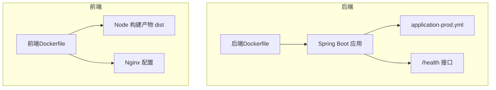
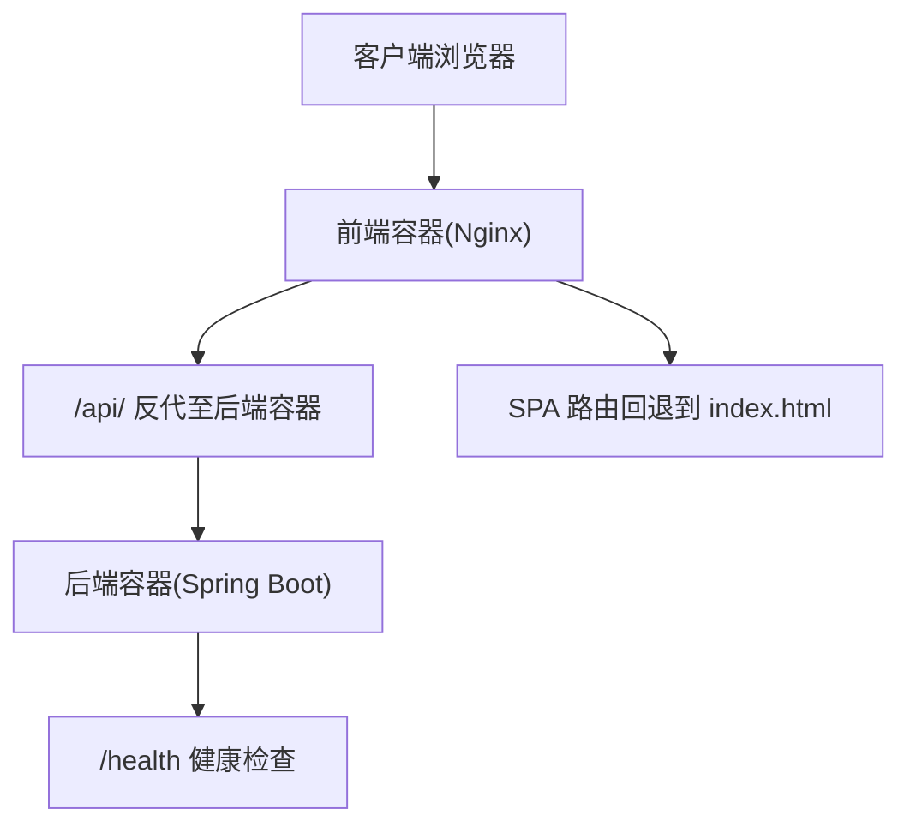
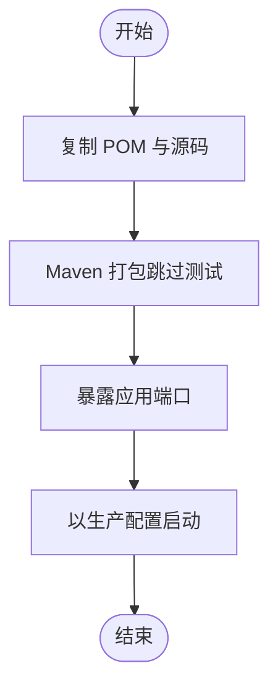
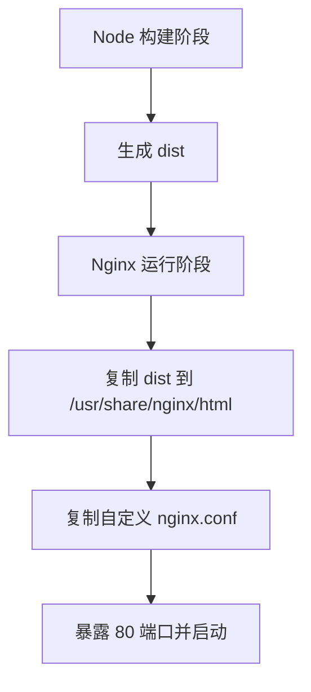
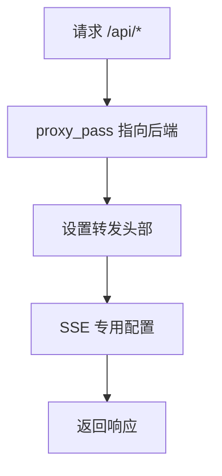
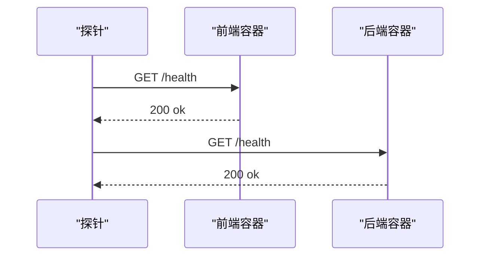
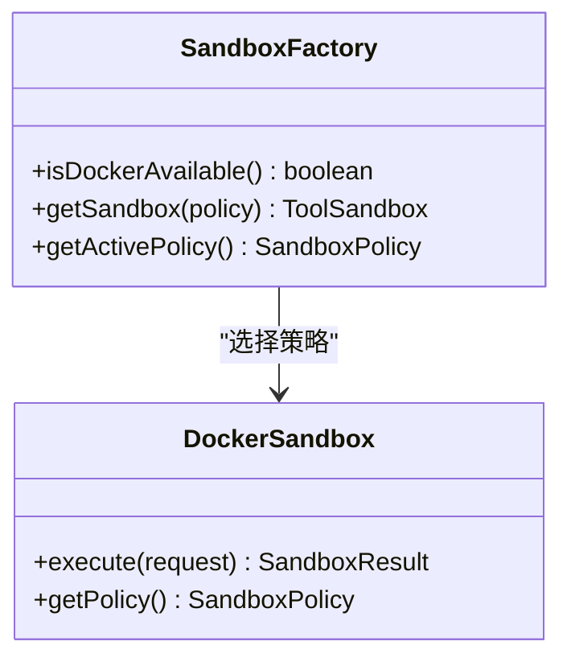
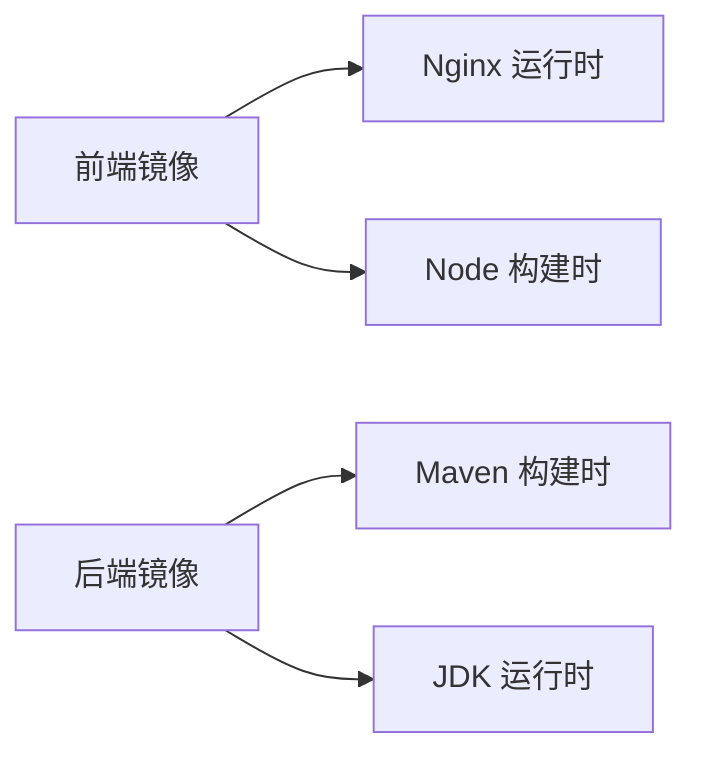

# 容器化部署

<cite>
**本文引用的文件**
- [Dockerfile（后端）](file://Dockerfile)
- [Dockerfile（前端）](file://yu-ai-agent-frontend/Dockerfile)
- [nginx.conf（前端）](file://yu-ai-agent-frontend/nginx.conf)
- [.dockerignore（前端）](file://yu-ai-agent-frontend/.dockerignore)
- [application-prod.yml（后端）](file://src/main/resources/application-prod.yml)
- [HealthController.java（后端）](file://src/main/java/com/yupi/yuaiagent/controller/HealthController.java)
- [SandboxFactory.java（后端）](file://src/main/java/com/yupi/yuaiagent/sandbox/SandboxFactory.java)
- [DockerSandbox.java（后端）](file://src/main/java/com/yupi/yuaiagent/sandbox/DockerSandbox.java)
- [FileOperationTool.java（后端）](file://src/main/java/com/yupi/yuaiagent/tools/FileOperationTool.java)
</cite>

## 目录
1. [简介](#简介)
2. [项目结构](#项目结构)
3. [核心组件](#核心组件)
4. [架构总览](#架构总览)
5. [详细组件分析](#详细组件分析)
6. [依赖关系分析](#依赖关系分析)
7. [性能考量](#性能考量)
8. [故障排查指南](#故障排查指南)
9. [结论](#结论)
10. [附录](#附录)

## 简介
本指南面向DevOps工程师，提供从零开始的容器化部署实施路径，涵盖后端服务与前端静态资源的镜像构建、多阶段优化、安全加固、反向代理、Docker Compose编排、环境变量与卷挂载策略、容器网络与端口映射、健康检查、镜像扫描与漏洞修复建议等。文档基于仓库现有文件进行分析与落地建议，确保可操作性与安全性。

## 项目结构
- 后端服务采用单体Spring Boot应用，通过根目录Dockerfile进行构建。
- 前端采用多阶段构建：Node构建产物，Nginx托管静态资源，并通过自定义nginx.conf实现SPA路由与API反代。
- 生产环境配置位于application-prod.yml，用于覆盖默认配置。

图表来源
- [Dockerfile（后端）:1-16](file://Dockerfile#L1-L16)
- [Dockerfile（前端）:1-17](file://yu-ai-agent-frontend/Dockerfile#L1-L17)
- [nginx.conf（前端）:1-49](file://yu-ai-agent-frontend/nginx.conf#L1-L49)
- [application-prod.yml（后端）:1-2](file://src/main/resources/application-prod.yml#L1-L2)
- [HealthController.java（后端）:1-15](file://src/main/java/com/yupi/yuaiagent/controller/HealthController.java#L1-L15)

章节来源
- [Dockerfile（后端）:1-16](file://Dockerfile#L1-L16)
- [Dockerfile（前端）:1-17](file://yu-ai-agent-frontend/Dockerfile#L1-L17)
- [nginx.conf（前端）:1-49](file://yu-ai-agent-frontend/nginx.conf#L1-L49)
- [application-prod.yml（后端）:1-2](file://src/main/resources/application-prod.yml#L1-L2)

## 核心组件
- 后端镜像构建：基于官方Maven镜像，仅复制必要源码与POM，执行打包并暴露端口，使用生产配置文件启动。
- 前端镜像构建：多阶段构建，第一阶段使用Node安装依赖并构建，第二阶段使用Nginx托管dist，复制自定义nginx.conf并暴露80端口。
- 反向代理：前端Nginx对/api/路径进行反代，保留SSE相关配置，设置常用头部，提升兼容性。
- 健康检查：后端提供/health接口，可用于容器健康探针。
- 安全加固：后端沙箱模块支持Docker沙箱，具备CPU/内存限制、只读根文件系统、网络隔离、临时文件系统等安全能力。

章节来源
- [Dockerfile（后端）:1-16](file://Dockerfile#L1-L16)
- [Dockerfile（前端）:1-17](file://yu-ai-agent-frontend/Dockerfile#L1-L17)
- [nginx.conf（前端）:14-35](file://yu-ai-agent-frontend/nginx.conf#L14-L35)
- [HealthController.java（后端）:11-14](file://src/main/java/com/yupi/yuaiagent/controller/HealthController.java#L11-L14)
- [SandboxFactory.java（后端）:46-115](file://src/main/java/com/yupi/yuaiagent/sandbox/SandboxFactory.java#L46-L115)
- [DockerSandbox.java（后端）:142-191](file://src/main/java/com/yupi/yuaiagent/sandbox/DockerSandbox.java#L142-L191)

## 架构总览
下图展示容器化部署的整体交互：前端容器对外提供静态资源与API反代；后端容器提供业务服务；两者通过容器网络通信；Nginx负责SPA路由与SSE透传。

图表来源
- [nginx.conf（前端）:8-12](file://yu-ai-agent-frontend/nginx.conf#L8-L12)
- [nginx.conf（前端）:14-35](file://yu-ai-agent-frontend/nginx.conf#L14-L35)
- [HealthController.java（后端）:11-14](file://src/main/java/com/yupi/yuaiagent/controller/HealthController.java#L11-L14)

## 详细组件分析

### 后端镜像构建与多阶段优化
- 基础镜像选择：使用预装Maven与JDK21的官方镜像，减少构建时间与体积。
- 最小化复制：仅复制POM与源码，避免无关文件进入缓存层。
- 打包与运行：使用Maven打包生成可执行JAR，暴露应用端口并通过生产配置文件启动。
- 多阶段优化建议：当前为单阶段构建，建议在CI中引入“构建阶段”和“运行阶段”，仅将最终JAR复制到最小运行时镜像，进一步缩小体积。

图表来源
- [Dockerfile（后端）:5-16](file://Dockerfile#L5-L16)

章节来源
- [Dockerfile（后端）:1-16](file://Dockerfile#L1-L16)

### 前端镜像构建与静态资源托管
- 构建阶段：使用Node Alpine镜像，安装依赖并执行构建，生成dist目录。
- 运行阶段：基于Nginx Alpine镜像，复制dist到静态目录，替换默认配置为自定义nginx.conf。
- 端口与启动：暴露80端口，以前台模式启动Nginx。
- Nginx配置要点：SPA路由回退、API反代、SSE透传、静态资源缓存与日志优化。

图表来源
- [Dockerfile（前端）:1-17](file://yu-ai-agent-frontend/Dockerfile#L1-L17)
- [nginx.conf（前端）:1-49](file://yu-ai-agent-frontend/nginx.conf#L1-L49)

章节来源
- [Dockerfile（前端）:1-17](file://yu-ai-agent-frontend/Dockerfile#L1-L17)
- [nginx.conf（前端）:1-49](file://yu-ai-agent-frontend/nginx.conf#L1-L49)
- [.dockerignore（前端）:1-40](file://yu-ai-agent-frontend/.dockerignore#L1-L40)

### 反向代理与API路由
- SPA路由：location / 使用try_files将所有未命中路径回退到index.html，解决前端路由刷新404问题。
- API反代：location ^~ /api/ 将请求转发至指定后端地址，设置Host、X-Real-IP、X-Forwarded-*等常用头部。
- SSE优化：关闭代理缓冲、禁用缓存、设置HTTP 1.1与超时，保证事件流稳定传输。
- 静态资源：对JS/CSS/字体/图标等资源设置一年缓存与公共Cache-Control头。

图表来源
- [nginx.conf（前端）:14-35](file://yu-ai-agent-frontend/nginx.conf#L14-L35)

章节来源
- [nginx.conf（前端）:8-12](file://yu-ai-agent-frontend/nginx.conf#L8-L12)
- [nginx.conf（前端）:14-35](file://yu-ai-agent-frontend/nginx.conf#L14-L35)
- [nginx.conf（前端）:37-42](file://yu-ai-agent-frontend/nginx.conf#L37-L42)

### 健康检查与运行参数
- 健康检查：后端提供/health接口，返回“ok”，可用于Kubernetes readiness/liveness探针。
- 运行参数：后端容器暴露8123端口，通过生产配置文件启动，建议在编排中配置健康检查与重启策略。

图表来源
- [HealthController.java（后端）:11-14](file://src/main/java/com/yupi/yuaiagent/controller/HealthController.java#L11-L14)

章节来源
- [HealthController.java（后端）:1-15](file://src/main/java/com/yupi/yuaiagent/controller/HealthController.java#L1-L15)

### 容器安全与沙箱能力
- Docker沙箱：支持CPU/内存限制、只读根文件系统、网络隔离（可禁用）、临时文件系统、工作目录挂载与环境变量隔离。
- 安全建议：默认启用只读根文件系统与受限网络；对工具执行类场景优先使用Docker沙箱；限制容器权限与用户ID；定期更新基础镜像与依赖。

图表来源
- [SandboxFactory.java（后端）:46-115](file://src/main/java/com/yupi/yuaiagent/sandbox/SandboxFactory.java#L46-L115)
- [DockerSandbox.java（后端）:139-191](file://src/main/java/com/yupi/yuaiagent/sandbox/DockerSandbox.java#L139-L191)

章节来源
- [SandboxFactory.java（后端）:46-115](file://src/main/java/com/yupi/yuaiagent/sandbox/SandboxFactory.java#L46-L115)
- [DockerSandbox.java（后端）:139-191](file://src/main/java/com/yupi/yuaiagent/sandbox/DockerSandbox.java#L139-L191)

### 文件操作与安全边界
- 文件读写工具：对文件读写进行安全校验与异常处理，出现安全异常时返回明确提示，避免越权访问。
- 建议：在容器内限制文件系统可见范围，结合沙箱策略与只读根文件系统，降低文件系统风险。

章节来源
- [FileOperationTool.java（后端）:34-59](file://src/main/java/com/yupi/yuaiagent/tools/FileOperationTool.java#L34-L59)

## 依赖关系分析
- 前端镜像依赖Node与Nginx；后端镜像依赖Maven与JDK21。
- 前端Nginx依赖application-prod.yml中的后端地址（当前为外部示例），需在编排中替换为实际后端服务名。
- 后端容器依赖数据库与外部服务（如日志、存储），需在编排中配置网络与环境变量。

图表来源
- [Dockerfile（前端）:1-17](file://yu-ai-agent-frontend/Dockerfile#L1-L17)
- [Dockerfile（后端）:1-16](file://Dockerfile#L1-L16)

章节来源
- [Dockerfile（前端）:1-17](file://yu-ai-agent-frontend/Dockerfile#L1-L17)
- [Dockerfile（后端）:1-16](file://Dockerfile#L1-L16)

## 性能考量
- 前端缓存：静态资源设置一年缓存与公共Cache-Control头，减少带宽与服务器压力。
- SSE优化：关闭缓冲、禁用代理缓存、设置长超时，保障实时事件流。
- 后端JVM：建议在生产配置中设置合适的堆大小与GC参数，结合容器CPU/内存限制，避免资源争用。
- 镜像体积：采用多阶段构建与精简运行时镜像，缩短拉取与启动时间。

章节来源
- [nginx.conf（前端）:37-42](file://yu-ai-agent-frontend/nginx.conf#L37-L42)
- [Dockerfile（后端）:1-16](file://Dockerfile#L1-L16)

## 故障排查指南
- 健康检查失败：确认/health接口可达，检查后端日志与端口映射是否正确。
- 前端路由404：检查Nginx配置中SPA回退规则与root路径。
- API反代异常：核对proxy_pass目标、Host头与SSE相关配置；检查后端服务连通性。
- 沙箱执行失败：查看Docker可用性检测与容器清理逻辑，确认Docker守护进程状态与权限。
- 文件操作异常：检查工具的安全校验与返回消息，确认容器内文件系统权限与路径。

章节来源
- [HealthController.java（后端）:11-14](file://src/main/java/com/yupi/yuaiagent/controller/HealthController.java#L11-L14)
- [nginx.conf（前端）:8-12](file://yu-ai-agent-frontend/nginx.conf#L8-L12)
- [nginx.conf（前端）:14-35](file://yu-ai-agent-frontend/nginx.conf#L14-L35)
- [SandboxFactory.java（后端）:95-110](file://src/main/java/com/yupi/yuaiagent/sandbox/SandboxFactory.java#L95-L110)
- [DockerSandbox.java（后端）:196-217](file://src/main/java/com/yupi/yuaiagent/sandbox/DockerSandbox.java#L196-L217)
- [FileOperationTool.java（后端）:34-59](file://src/main/java/com/yupi/yuaiagent/tools/FileOperationTool.java#L34-L59)

## 结论
本指南基于仓库现有文件，提供了后端与前端的容器化构建流程、反向代理配置、健康检查与安全加固建议。建议在生产环境中引入多阶段构建、镜像扫描与漏洞修复流程，并通过Docker Compose或Kubernetes进行编排，确保可维护性与安全性。

## 附录

### Docker Compose编排建议
- 服务定义：定义后端与前端两个服务，分别指向各自Dockerfile构建产物。
- 端口映射：前端映射80端口，后端映射8123端口。
- 环境变量：通过环境变量注入后端数据库连接、第三方服务密钥等，避免硬编码。
- 卷挂载：仅在开发环境挂载源码目录；生产环境使用构建产物与只读配置。
- 网络：前后端在同一用户定义网络中，通过服务名互通。
- 健康检查：为后端添加/health探针，设置重启策略与超时。

### 环境变量管理
- 后端：通过application-prod.yml与环境变量组合，覆盖数据库、日志、第三方服务等配置。
- 前端：在编排中注入API反代目标（当前nginx.conf指向外部地址，需替换为后端服务名）。

章节来源
- [application-prod.yml（后端）:1-2](file://src/main/resources/application-prod.yml#L1-L2)
- [nginx.conf（前端）:17-17](file://yu-ai-agent-frontend/nginx.conf#L17-L17)

### 卷挂载策略
- 开发：挂载源码目录，热更新生效；注意排除node_modules与构建产物。
- 生产：仅挂载必要配置文件与日志目录，其余使用只读文件系统。

章节来源
- [.dockerignore（前端）:1-40](file://yu-ai-agent-frontend/.dockerignore#L1-L40)

### 容器网络与端口映射
- 前端：监听80，反代/api/至后端服务。
- 后端：监听8123，提供/health与业务接口。

章节来源
- [Dockerfile（前端）:14-15](file://yu-ai-agent-frontend/Dockerfile#L14-L15)
- [Dockerfile（后端）:12-13](file://Dockerfile#L12-L13)
- [nginx.conf（前端）:1-3](file://yu-ai-agent-frontend/nginx.conf#L1-L3)

### 健康检查设置
- 后端：/health返回“ok”，用于就绪/存活探针。
- 前端：可结合Nginx状态页面或自定义探针。

章节来源
- [HealthController.java（后端）:11-14](file://src/main/java/com/yupi/yuaiagent/controller/HealthController.java#L11-L14)

### 容器安全最佳实践
- 镜像：使用最小化运行时镜像，启用只读根文件系统，限制CPU/内存，禁用网络（必要时）。
- 权限：非root用户运行，移除不必要的包与工具。
- 配置：敏感信息通过环境变量或密钥管理服务注入，不在镜像中保存。
- 扫描：在CI中集成镜像扫描，修复高危漏洞后再发布。
- 漏洞修复：定期更新基础镜像与依赖，关注CVE公告并及时修补。

### 镜像扫描与漏洞修复建议
- CI流水线：在构建完成后执行镜像扫描，记录并阻断高危漏洞。
- 修复策略：优先修复严重与高危漏洞；对中低危漏洞制定修复计划与时间表。
- 版本管理：锁定基础镜像版本，避免自动升级带来的不稳定性。