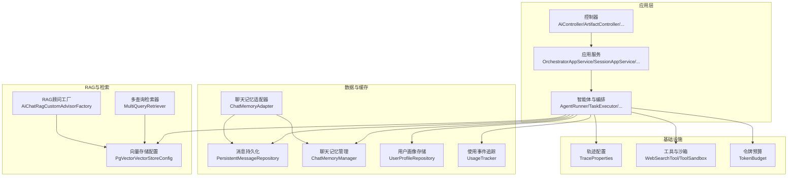
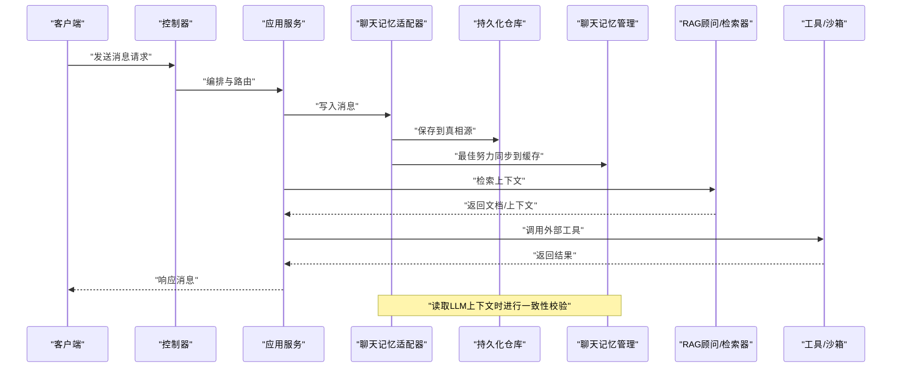
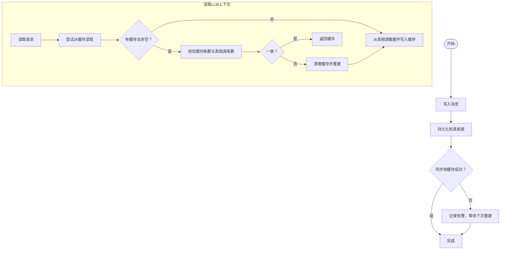
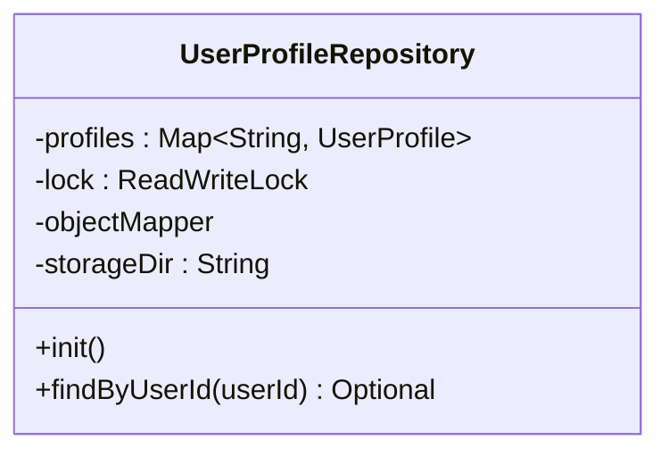
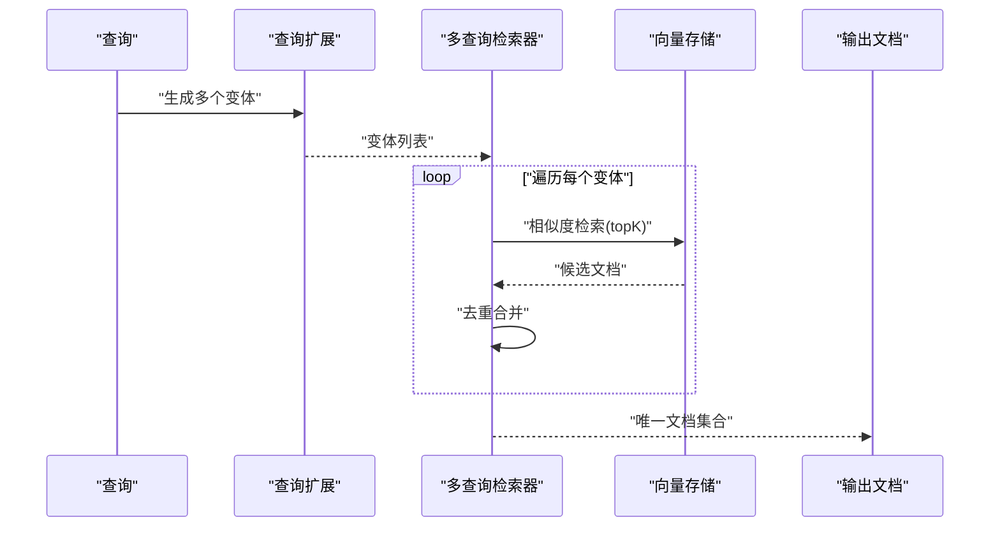
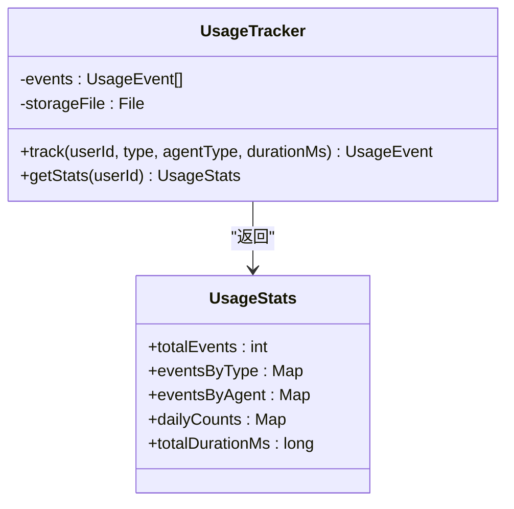
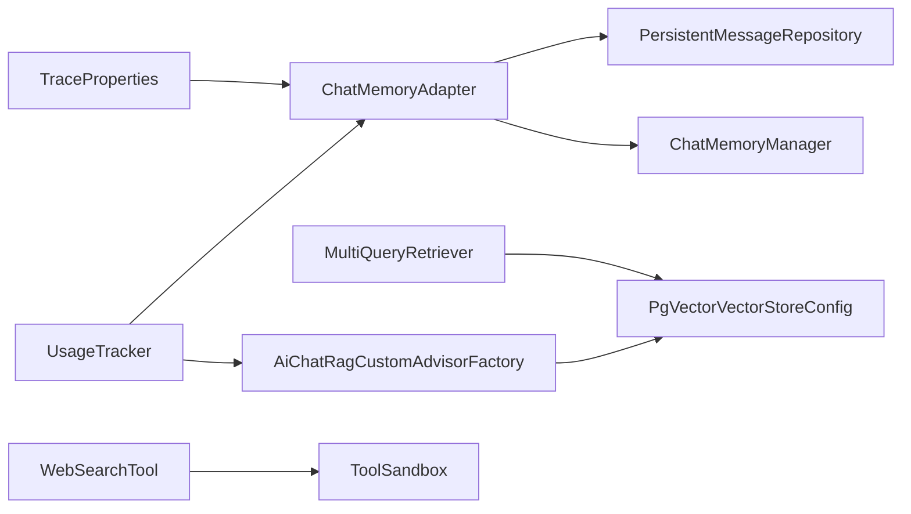

# 性能优化

<cite>
**本文引用的文件**
- [application.yml](file://src/main/resources/application.yml)
- [ChatMemoryAdapter.java](file://src/main/java/com/yupi/yuaiagent/message/ChatMemoryAdapter.java)
- [ChatMemoryManager.java](file://src/main/java/com/yupi/yuaiagent/chatmemory/ChatMemoryManager.java)
- [UserProfileRepository.java](file://src/main/java/com/yupi/yuaiagent/profile/UserProfileRepository.java)
- [PgVectorVectorStoreConfig.java](file://src/main/java/com/yupi/yuaiagent/rag/PgVectorVectorStoreConfig.java)
- [MultiQueryRetriever.java](file://src/main/java/com/yupi/yuaiagent/rag/MultiQueryRetriever.java)
- [AiChatRagCustomAdvisorFactory.java](file://src/main/java/com/yupi/yuaiagent/rag/AiChatRagCustomAdvisorFactory.java)
- [UsageTracker.java](file://src/main/java/com/yupi/yuaiagent/usage/UsageTracker.java)
- [TraceProperties.java](file://src/main/java/com/yupi/yuaiagent/trace/TraceProperties.java)
- [WebSearchTool.java](file://src/main/java/com/yupi/yuaiagent/tools/WebSearchTool.java)
- [ToolSandbox.java](file://src/main/java/com/yupi/yuaiagent/sandbox/ToolSandbox.java)
- [TokenBudget.java](file://src/main/java/com/yupi/yuaiagent/budget/TokenBudget.java)
</cite>

## 目录
1. [简介](#简介)
2. [项目结构](#项目结构)
3. [核心组件](#核心组件)
4. [架构总览](#架构总览)
5. [详细组件分析](#详细组件分析)
6. [依赖关系分析](#依赖关系分析)
7. [性能考虑](#性能考虑)
8. [故障排查指南](#故障排查指南)
9. [结论](#结论)
10. [附录](#附录)

## 简介
本指南面向系统管理员与性能工程师，围绕该AI代理系统在“性能瓶颈识别、内存使用优化、CPU资源调优、数据库查询优化、缓存策略配置、连接池调优、AI模型推理优化、向量检索性能提升、工具调用效率改进、并发与异步调度、资源限制配置、性能测试与容量规划”等方面，提供可落地的优化策略与实操建议。内容基于代码库中的实际实现进行提炼，并辅以可视化图示帮助快速定位优化切入点。

## 项目结构
系统采用分层清晰的Spring Boot应用结构，核心模块包括：
- 控制层与服务层：控制器、应用服务、业务编排与工具调用
- 数据访问层：消息持久化、用户画像、使用统计等
- 消息与缓存：运行时聊天记忆管理与适配器
- RAG与向量检索：向量存储配置、多查询扩展与检索器
- 追踪与度量：执行轨迹与使用事件追踪
- 安全与配额：访问控制、配额与沙箱限制

图表来源
- [ChatMemoryAdapter.java:1-143](file://src/main/java/com/yupi/yuaiagent/message/ChatMemoryAdapter.java#L1-L143)
- [ChatMemoryManager.java](file://src/main/java/com/yupi/yuaiagent/chatmemory/ChatMemoryManager.java)
- [UserProfileRepository.java:1-76](file://src/main/java/com/yupi/yuaiagent/profile/UserProfileRepository.java#L1-L76)
- [PgVectorVectorStoreConfig.java:1-39](file://src/main/java/com/yupi/yuaiagent/rag/PgVectorVectorStoreConfig.java#L1-L39)
- [MultiQueryRetriever.java:40-77](file://src/main/java/com/yupi/yuaiagent/rag/MultiQueryRetriever.java#L40-L77)
- [AiChatRagCustomAdvisorFactory.java:33-61](file://src/main/java/com/yupi/yuaiagent/rag/AiChatRagCustomAdvisorFactory.java#L33-L61)
- [UsageTracker.java:40-143](file://src/main/java/com/yupi/yuaiagent/usage/UsageTracker.java#L40-L143)
- [TraceProperties.java:35-66](file://src/main/java/com/yupi/yuaiagent/trace/TraceProperties.java#L35-L66)
- [WebSearchTool.java](file://src/main/java/com/yupi/yuaiagent/tools/WebSearchTool.java)
- [ToolSandbox.java](file://src/main/java/com/yupi/yuaiagent/sandbox/ToolSandbox.java)
- [TokenBudget.java](file://src/main/java/com/yupi/yuaiagent/budget/TokenBudget.java)

章节来源
- [application.yml](file://src/main/resources/application.yml)

## 核心组件
- 聊天记忆与适配器：通过“真相源（持久化）+运行时缓存（最佳努力同步）”的双写策略，保障LLM上下文一致性与读性能。
- 用户画像存储：基于文件的并发安全存储，支持热加载与读写锁保护。
- 向量检索与RAG：PgVector向量存储配置、HNSW索引、Cosine距离；多查询扩展与去重合并提升召回质量。
- 使用事件追踪：记录用户维度的事件类型、代理类型与耗时，用于容量与成本分析。
- 执行轨迹配置：限制单轨迹最大跨度、元数据长度与用户保留条数，避免无界增长导致的内存与IO压力。
- 工具与沙箱：对外部工具调用进行资源限制与隔离，降低不可控开销。
- 令牌预算：对LLM调用进行预算控制，避免超支与资源浪费。

章节来源
- [ChatMemoryAdapter.java:1-143](file://src/main/java/com/yupi/yuaiagent/message/ChatMemoryAdapter.java#L1-L143)
- [UserProfileRepository.java:1-76](file://src/main/java/com/yupi/yuaiagent/profile/UserProfileRepository.java#L1-L76)
- [PgVectorVectorStoreConfig.java:1-39](file://src/main/java/com/yupi/yuaiagent/rag/PgVectorVectorStoreConfig.java#L1-L39)
- [MultiQueryRetriever.java:40-77](file://src/main/java/com/yupi/yuaiagent/rag/MultiQueryRetriever.java#L40-L77)
- [AiChatRagCustomAdvisorFactory.java:33-61](file://src/main/java/com/yupi/yuaiagent/rag/AiChatRagCustomAdvisorFactory.java#L33-L61)
- [UsageTracker.java:40-143](file://src/main/java/com/yupi/yuaiagent/usage/UsageTracker.java#L40-L143)
- [TraceProperties.java:35-66](file://src/main/java/com/yupi/yuaiagent/trace/TraceProperties.java#L35-L66)
- [ToolSandbox.java](file://src/main/java/com/yupi/yuaiagent/sandbox/ToolSandbox.java)
- [TokenBudget.java](file://src/main/java/com/yupi/yuaiagent/budget/TokenBudget.java)

## 架构总览
下图展示了消息写入、读取与重建的关键流程，以及与向量检索、工具调用和使用追踪的关系。

图表来源
- [ChatMemoryAdapter.java:1-143](file://src/main/java/com/yupi/yuaiagent/message/ChatMemoryAdapter.java#L1-L143)
- [MultiQueryRetriever.java:40-77](file://src/main/java/com/yupi/yuaiagent/rag/MultiQueryRetriever.java#L40-L77)
- [AiChatRagCustomAdvisorFactory.java:33-61](file://src/main/java/com/yupi/yuaiagent/rag/AiChatRagCustomAdvisorFactory.java#L33-L61)
- [WebSearchTool.java](file://src/main/java/com/yupi/yuaiagent/tools/WebSearchTool.java)
- [ToolSandbox.java](file://src/main/java/com/yupi/yuaiagent/sandbox/ToolSandbox.java)

## 详细组件分析

### 聊天记忆与适配器（性能关键路径）
- 写路径：先持久化（真相源），再同步到运行时缓存（最佳努力）。若同步失败，下次读取会自动重建，确保一致性。
- 读路径（LLM）：优先从缓存读取，通过消息计数一致性校验；不一致或缺失则从真相源重建。
- 读路径（前端展示）：直接从真相源读取，保证展示一致性。
- 压缩后重建：压缩完成后强制重建缓存，避免脏数据。

图表来源
- [ChatMemoryAdapter.java:1-143](file://src/main/java/com/yupi/yuaiagent/message/ChatMemoryAdapter.java#L1-L143)

章节来源
- [ChatMemoryAdapter.java:1-143](file://src/main/java/com/yupi/yuaiagent/message/ChatMemoryAdapter.java#L1-L143)
- [ChatMemoryManager.java](file://src/main/java/com/yupi/yuaiagent/chatmemory/ChatMemoryManager.java)

### 用户画像存储（I/O与并发）
- 文件持久化 + JSON序列化，启动时加载，支持目录与文件名配置。
- 内存索引使用并发Map，读写分离锁保护，适合高并发读场景。
- 初始化失败会记录错误日志，避免阻塞启动。

图表来源
- [UserProfileRepository.java:1-76](file://src/main/java/com/yupi/yuaiagent/profile/UserProfileRepository.java#L1-L76)

章节来源
- [UserProfileRepository.java:1-76](file://src/main/java/com/yupi/yuaiagent/profile/UserProfileRepository.java#L1-L76)

### 向量检索与RAG（查询与索引优化）
- 向量存储：PgVector，HNSW索引，Cosine距离，支持批量写入与模式初始化。
- 多查询扩展：对每个变体查询执行相似度检索，合并去重，减少重复文档带来的重复计算。
- 自定义顾问：支持按状态过滤、相似度阈值与TopK参数化，便于针对不同场景调优。

图表来源
- [MultiQueryRetriever.java:40-77](file://src/main/java/com/yupi/yuaiagent/rag/MultiQueryRetriever.java#L40-L77)
- [PgVectorVectorStoreConfig.java:1-39](file://src/main/java/com/yupi/yuaiagent/rag/PgVectorVectorStoreConfig.java#L1-L39)
- [AiChatRagCustomAdvisorFactory.java:33-61](file://src/main/java/com/yupi/yuaiagent/rag/AiChatRagCustomAdvisorFactory.java#L33-L61)

章节来源
- [PgVectorVectorStoreConfig.java:1-39](file://src/main/java/com/yupi/yuaiagent/rag/PgVectorVectorStoreConfig.java#L1-L39)
- [MultiQueryRetriever.java:40-77](file://src/main/java/com/yupi/yuaiagent/rag/MultiQueryRetriever.java#L40-L77)
- [AiChatRagCustomAdvisorFactory.java:33-61](file://src/main/java/com/yupi/yuaiagent/rag/AiChatRagCustomAdvisorFactory.java#L33-L61)

### 使用事件追踪（容量与成本分析）
- 记录事件ID、用户ID、事件类型、代理类型、耗时与时间戳。
- 支持按用户聚合统计、事件类型分布、代理类型分布、近7日趋势与总耗时。
- 文件存储，启动时加载，写入时落盘，便于离线分析与报表生成。

图表来源
- [UsageTracker.java:40-143](file://src/main/java/com/yupi/yuaiagent/usage/UsageTracker.java#L40-L143)

章节来源
- [UsageTracker.java:40-143](file://src/main/java/com/yupi/yuaiagent/usage/UsageTracker.java#L40-L143)

### 执行轨迹配置（资源边界控制）
- 单轨迹最大跨度、元数据单值最大字符数、单用户最大轨迹数等参数均有限制与钳制逻辑。
- 通过范围钳制确保运行时安全，避免无界增长导致的内存与IO压力。

章节来源
- [TraceProperties.java:35-66](file://src/main/java/com/yupi/yuaiagent/trace/TraceProperties.java#L35-L66)

### 工具与沙箱（外部调用稳定性）
- 工具调用通过沙箱进行资源限制与隔离，防止外部调用成为性能瓶颈。
- WebSearchTool等工具需关注网络延迟与超时设置，结合重试与降级策略。

章节来源
- [ToolSandbox.java](file://src/main/java/com/yupi/yuaiagent/sandbox/ToolSandbox.java)
- [WebSearchTool.java](file://src/main/java/com/yupi/yuaiagent/tools/WebSearchTool.java)

### 令牌预算（CPU与成本控制）
- 通过TokenBudget对LLM调用进行预算控制，避免过度消耗CPU与算力。
- 建议结合实际模型参数与业务负载，动态调整预算阈值与报警策略。

章节来源
- [TokenBudget.java](file://src/main/java/com/yupi/yuaiagent/budget/TokenBudget.java)

## 依赖关系分析
- 聊天记忆适配器依赖持久化仓库与运行时聊天记忆管理，形成“真相源 + 缓存”的双写与一致性校验机制。
- RAG链路依赖向量存储配置与检索器，多查询扩展与去重合并显著影响检索性能。
- 使用事件追踪贯穿业务流程，为容量规划与成本分析提供数据基础。
- 执行轨迹配置与工具/沙箱共同约束系统资源边界，避免异常放大。

图表来源
- [ChatMemoryAdapter.java:1-143](file://src/main/java/com/yupi/yuaiagent/message/ChatMemoryAdapter.java#L1-L143)
- [PgVectorVectorStoreConfig.java:1-39](file://src/main/java/com/yupi/yuaiagent/rag/PgVectorVectorStoreConfig.java#L1-L39)
- [MultiQueryRetriever.java:40-77](file://src/main/java/com/yupi/yuaiagent/rag/MultiQueryRetriever.java#L40-L77)
- [AiChatRagCustomAdvisorFactory.java:33-61](file://src/main/java/com/yupi/yuaiagent/rag/AiChatRagCustomAdvisorFactory.java#L33-L61)
- [UsageTracker.java:40-143](file://src/main/java/com/yupi/yuaiagent/usage/UsageTracker.java#L40-L143)
- [TraceProperties.java:35-66](file://src/main/java/com/yupi/yuaiagent/trace/TraceProperties.java#L35-L66)
- [WebSearchTool.java](file://src/main/java/com/yupi/yuaiagent/tools/WebSearchTool.java)
- [ToolSandbox.java](file://src/main/java/com/yupi/yuaiagent/sandbox/ToolSandbox.java)

## 性能考虑

### 系统瓶颈识别
- CPU瓶颈：LLM推理、向量检索、文本压缩与JSON序列化。可通过使用事件追踪与指标埋点定位热点。
- 内存瓶颈：聊天记忆缓存、向量存储批量写入、用户画像内存索引。关注缓存命中率与对象生命周期。
- IO瓶颈：消息持久化、用户画像文件读写、使用事件落盘。关注磁盘吞吐与文件系统延迟。
- 网络瓶颈：外部工具调用（如WebSearchTool）、向量存储连接。关注RTT与超时设置。

### 内存使用优化
- 聊天记忆：优先使用缓存读取，减少重复重建；在压缩后主动重建缓存，避免脏数据占用内存。
- 用户画像：合理设置存储目录与文件大小，避免频繁GC；读写分离锁降低竞争。
- 向量检索：控制TopK与批量大小，避免一次性加载过多文档；使用HNSW索引与合适距离度量。

章节来源
- [ChatMemoryAdapter.java:1-143](file://src/main/java/com/yupi/yuaiagent/message/ChatMemoryAdapter.java#L1-L143)
- [UserProfileRepository.java:1-76](file://src/main/java/com/yupi/yuaiagent/profile/UserProfileRepository.java#L1-L76)
- [MultiQueryRetriever.java:40-77](file://src/main/java/com/yupi/yuaiagent/rag/MultiQueryRetriever.java#L40-L77)
- [PgVectorVectorStoreConfig.java:1-39](file://src/main/java/com/yupi/yuaiagent/rag/PgVectorVectorStoreConfig.java#L1-L39)

### CPU资源调优
- 令牌预算：根据模型参数与业务负载设定预算阈值，避免过度调用。
- 工具调用：在沙箱内设置CPU时间限制与内存上限，防止外部调用拖垮系统。
- 查询优化：减少无效的多查询变体数量，合并相似查询，降低重复检索。

章节来源
- [TokenBudget.java](file://src/main/java/com/yupi/yuaiagent/budget/TokenBudget.java)
- [ToolSandbox.java](file://src/main/java/com/yupi/yuaiagent/sandbox/ToolSandbox.java)
- [MultiQueryRetriever.java:40-77](file://src/main/java/com/yupi/yuaiagent/rag/MultiQueryRetriever.java#L40-L77)

### 数据库查询优化
- 消息持久化：采用计数一致性校验，避免不必要的全量扫描；批量写入与索引设计提升写入吞吐。
- 用户画像：文件存储为主，内存索引为辅；避免频繁序列化/反序列化，必要时进行批量操作。
- 向量存储：启用HNSW索引与合适的距离度量，控制批量大小与TopK，减少IO与CPU开销。

章节来源
- [ChatMemoryAdapter.java:1-143](file://src/main/java/com/yupi/yuaiagent/message/ChatMemoryAdapter.java#L1-L143)
- [UserProfileRepository.java:1-76](file://src/main/java/com/yupi/yuaiagent/profile/UserProfileRepository.java#L1-L76)
- [PgVectorVectorStoreConfig.java:1-39](file://src/main/java/com/yupi/yuaiagent/rag/PgVectorVectorStoreConfig.java#L1-L39)

### 缓存策略配置
- 写路径：真相源优先，缓存为辅；失败不阻塞主流程，下次读取自动修复。
- 读路径：LLM上下文优先缓存，一致性校验失败立即重建；前端展示直接读真相源。
- 压缩后重建：确保压缩后的上下文仍保持一致性与性能。

章节来源
- [ChatMemoryAdapter.java:1-143](file://src/main/java/com/yupi/yuaiagent/message/ChatMemoryAdapter.java#L1-L143)

### 连接池与外部依赖调优
- 向量存储：合理设置批量大小与索引参数，避免过大批次导致内存峰值。
- 外部工具：设置合理的超时、重试与熔断策略，避免阻塞线程池。
- 应用配置：通过全局配置文件统一管理连接超时、线程池大小与队列长度。

章节来源
- [PgVectorVectorStoreConfig.java:1-39](file://src/main/java/com/yupi/yuaiagent/rag/PgVectorVectorStoreConfig.java#L1-L39)
- [WebSearchTool.java](file://src/main/java/com/yupi/yuaiagent/tools/WebSearchTool.java)
- [application.yml](file://src/main/resources/application.yml)

### AI模型推理优化
- 令牌预算：严格控制输入/输出长度与温度等参数，避免不必要的长对话。
- 提示词工程：减少冗余信息，提高上下文密度。
- 分片与批处理：对长文档进行分片处理，结合批处理提升吞吐。

章节来源
- [TokenBudget.java](file://src/main/java/com/yupi/yuaiagent/budget/TokenBudget.java)

### 向量检索性能提升
- 多查询扩展：控制变体数量与TopK，避免重复检索与去重开销过大。
- 去重策略：使用有序去重集合，减少重复文档带来的重复计算。
- 索引与距离：选择合适的索引类型与距离度量，平衡精度与速度。

章节来源
- [MultiQueryRetriever.java:40-77](file://src/main/java/com/yupi/yuaiagent/rag/MultiQueryRetriever.java#L40-L77)
- [PgVectorVectorStoreConfig.java:1-39](file://src/main/java/com/yupi/yuaiagent/rag/PgVectorVectorStoreConfig.java#L1-L39)

### 工具调用效率改进
- 沙箱限制：为工具调用设置CPU时间与内存上限，防止外部依赖成为瓶颈。
- 超时与重试：合理设置超时与重试次数，避免长时间阻塞。
- 结果缓存：对外部调用结果进行短期缓存，减少重复请求。

章节来源
- [ToolSandbox.java](file://src/main/java/com/yupi/yuaiagent/sandbox/ToolSandbox.java)
- [WebSearchTool.java](file://src/main/java/com/yupi/yuaiagent/tools/WebSearchTool.java)

### 并发处理与异步任务调度
- 聊天记忆：读写锁降低竞争，缓存命中优先；重建时采用异步或延迟策略。
- 使用事件：采用追加写与定期落盘，避免阻塞主线程。
- RAG检索：对多查询变体并行检索，但需控制并发度与资源上限。

章节来源
- [ChatMemoryAdapter.java:1-143](file://src/main/java/com/yupi/yuaiagent/message/ChatMemoryAdapter.java#L1-L143)
- [UsageTracker.java:40-143](file://src/main/java/com/yupi/yuaiagent/usage/UsageTracker.java#L40-L143)
- [MultiQueryRetriever.java:40-77](file://src/main/java/com/yupi/yuaiagent/rag/MultiQueryRetriever.java#L40-L77)

### 资源限制配置
- 执行轨迹：限制单轨迹跨度、元数据长度与用户保留条数，避免无界增长。
- 工具调用：在沙箱中设置CPU时间、内存与文件句柄等限制。
- 令牌预算：根据SLA设定预算阈值与报警策略。

章节来源
- [TraceProperties.java:35-66](file://src/main/java/com/yupi/yuaiagent/trace/TraceProperties.java#L35-L66)
- [ToolSandbox.java](file://src/main/java/com/yupi/yuaiagent/sandbox/ToolSandbox.java)
- [TokenBudget.java](file://src/main/java/com/yupi/yuaiagent/budget/TokenBudget.java)

### 性能测试与基准测试
- 基准场景：消息写入/读取延迟、缓存命中率、RAG检索耗时、工具调用成功率与平均耗时。
- 压测方法：逐步增加并发与批量大小，观察CPU、内存、IO与网络的拐点。
- 指标采集：结合使用事件追踪与系统监控，建立基线与告警阈值。

章节来源
- [UsageTracker.java:40-143](file://src/main/java/com/yupi/yuaiagent/usage/UsageTracker.java#L40-L143)

### 容量规划
- 用户画像与聊天记忆：评估消息量与上下文长度，估算内存与磁盘需求。
- 向量存储：根据文档总量与维度，计算索引与查询的资源消耗。
- 工具调用：根据外部依赖的SLA与失败率，预留冗余与降级策略。
- 使用事件：按日/周趋势预测文件大小与IO压力，规划存储与备份策略。

章节来源
- [UserProfileRepository.java:1-76](file://src/main/java/com/yupi/yuaiagent/profile/UserProfileRepository.java#L1-L76)
- [ChatMemoryAdapter.java:1-143](file://src/main/java/com/yupi/yuaiagent/message/ChatMemoryAdapter.java#L1-L143)
- [PgVectorVectorStoreConfig.java:1-39](file://src/main/java/com/yupi/yuaiagent/rag/PgVectorVectorStoreConfig.java#L1-L39)
- [UsageTracker.java:40-143](file://src/main/java/com/yupi/yuaiagent/usage/UsageTracker.java#L40-L143)

## 故障排查指南
- 缓存不一致：检查一致性校验逻辑与重建触发条件，确认真相源与缓存的数据条数是否匹配。
- 写入失败：关注持久化与缓存同步的日志，必要时回滚至纯真相源路径。
- 向量检索异常：检查索引初始化、批量大小与TopK设置，确认变体数量与去重策略。
- 工具调用超时：调整超时与重试策略，必要时在沙箱中收紧资源限制。
- 使用事件异常：检查文件存储权限与磁盘空间，确保落盘成功与读取正确。

章节来源
- [ChatMemoryAdapter.java:1-143](file://src/main/java/com/yupi/yuaiagent/message/ChatMemoryAdapter.java#L1-L143)
- [MultiQueryRetriever.java:40-77](file://src/main/java/com/yupi/yuaiagent/rag/MultiQueryRetriever.java#L40-L77)
- [ToolSandbox.java](file://src/main/java/com/yupi/yuaiagent/sandbox/ToolSandbox.java)
- [UsageTracker.java:40-143](file://src/main/java/com/yupi/yuaiagent/usage/UsageTracker.java#L40-L143)

## 结论
本指南基于代码库的实际实现，提出了覆盖“写入/读取路径优化、缓存策略、向量检索、工具调用、资源限制、容量规划与测试”的完整性能优化策略。建议在生产环境中以“渐进式调优 + 指标监控 + 压测验证”的方式推进，持续迭代以获得稳定且高性能的系统表现。

## 附录
- 关键配置入口：应用配置文件用于统一管理连接、线程池与超时等参数。
- 建议的优化优先级：先解决缓存一致性与写入瓶颈，再优化RAG检索与工具调用，最后完善容量与压测体系。

章节来源
- [application.yml](file://src/main/resources/application.yml)