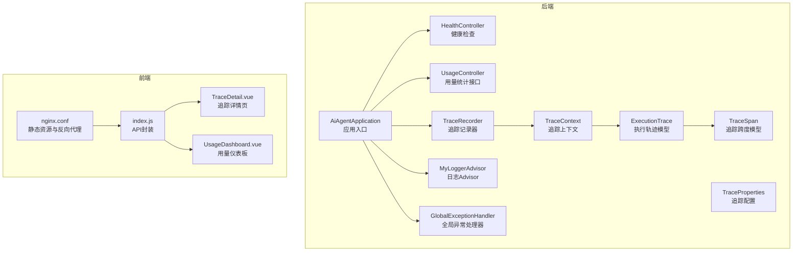
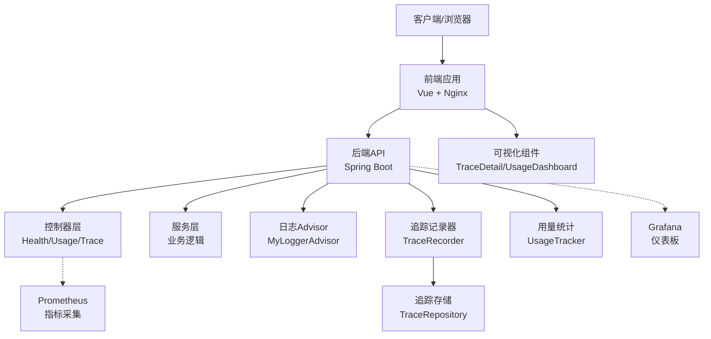
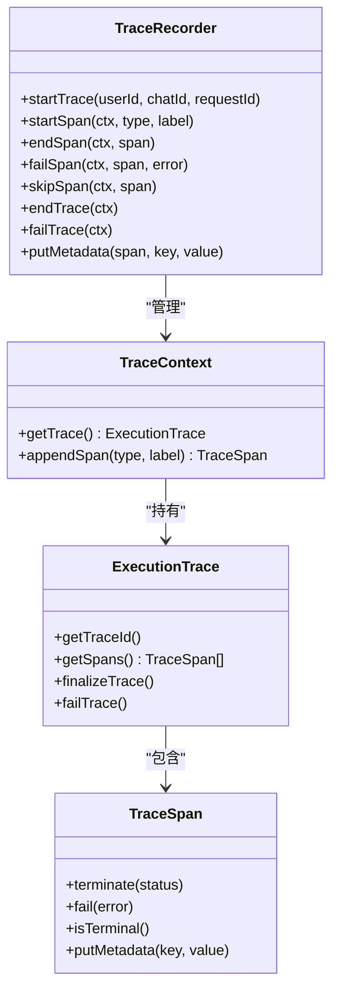
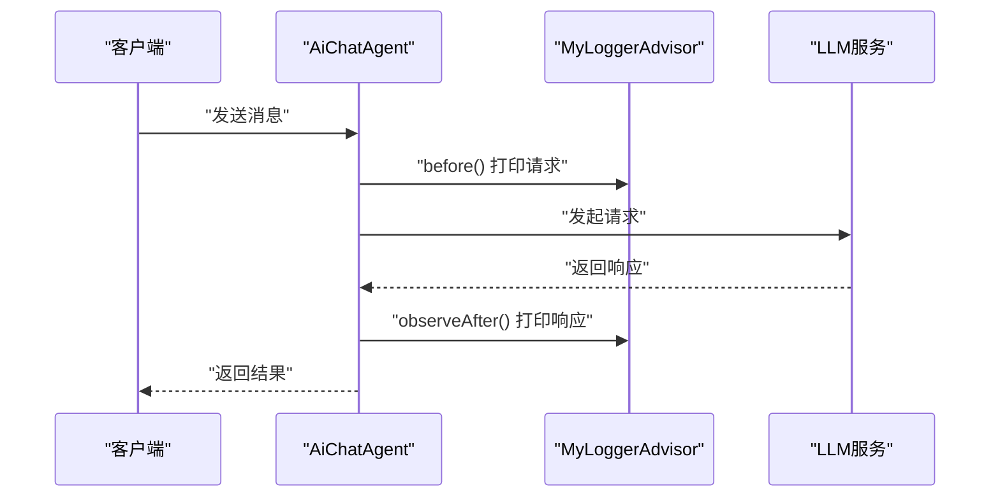
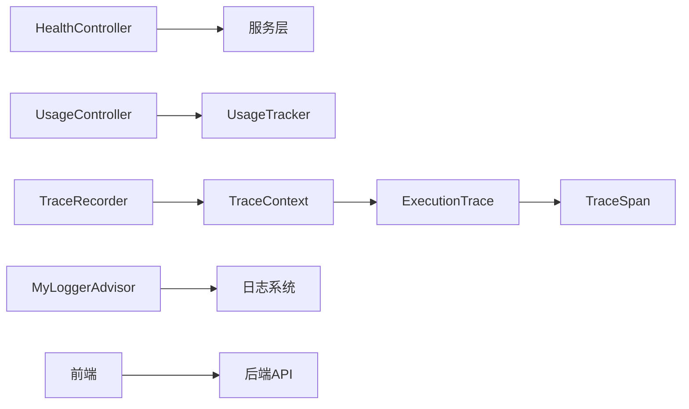

# 监控和日志

<cite>
**本文引用的文件**
- [application.yml](file://src/main/resources/application.yml)
- [application-prod.yml](file://src/main/resources/application-prod.yml)
- [application-local.yml.example](file://src/main/resources/application-local.yml.example)
- [HealthController.java](file://src/main/java/com/yupi/yuaiagent/controller/HealthController.java)
- [UsageController.java](file://src/main/java/com/yupi/yuaiagent/controller/UsageController.java)
- [UsageTracker.java](file://src/main/java/com/yupi/yuaiagent/usage/UsageTracker.java)
- [TraceProperties.java](file://src/main/java/com/yupi/yuaiagent/trace/TraceProperties.java)
- [TraceRecorder.java](file://src/main/java/com/yupi/yuaiagent/trace/TraceRecorder.java)
- [TraceContext.java](file://src/main/java/com/yupi/yuaiagent/trace/TraceContext.java)
- [ExecutionTrace.java](file://src/main/java/com/yupi/yuaiagent/trace/model/ExecutionTrace.java)
- [TraceSpan.java](file://src/main/java/com/yupi/yuaiagent/trace/model/TraceSpan.java)
- [TraceConstants.java](file://src/main/java/com/yupi/yuaiagent/trace/model/TraceConstants.java)
- [TraceRepository.java](file://src/main/java/com/yupi/yuaiagent/trace/TraceRepository.java)
- [TraceStreamPublisher.java](file://src/main/java/com/yupi/yuaiagent/trace/TraceStreamPublisher.java)
- [TraceController.java](file://src/main/java/com/yupi/yuaiagent/controller/TraceController.java)
- [MyLoggerAdvisor.java](file://src/main/java/com/yupi/yuaiagent/advisor/MyLoggerAdvisor.java)
- [AiChatAgent.java](file://src/main/java/com/yupi/yuaiagent/app/AiChatAgent.java)
- [GlobalExceptionHandler.java](file://src/main/java/com/yupi/yuaiagent/exception/GlobalExceptionHandler.java)
- [AiAgentApplication.java](file://src/main/java/com/yupi/yuaiagent/AiAgentApplication.java)
- [Dockerfile](file://Dockerfile)
- [architecture.html](file://docs/architecture.html)
- [TracePropertiesTest.java](file://src/test/java/com/yupi/yuaiagent/trace/TracePropertiesTest.java)
- [TraceRecorderPropertyTest.java](file://src/test/java/com/yupi/yuaiagent/trace/TraceRecorderPropertyTest.java)
- [TraceContextPropertyTest.java](file://src/test/java/com/yupi/yuaiagent/trace/TraceContextPropertyTest.java)
- [TraceIntegrationTest.java](file://src/test/java/com/yupi/yuaiagent/trace/TraceIntegrationTest.java)
- [TraceControllerTest.java](file://src/test/java/com/yupi/yuaiagent/trace/TraceControllerTest.java)
- [nginx.conf](file://yu-ai-agent-frontend/nginx.conf)
- [package.json](file://yu-ai-agent-frontend/package.json)
- [index.html](file://yu-ai-agent-frontend/index.html)
- [index.js](file://yu-ai-agent-frontend/src/api/index.js)
- [TraceDetail.vue](file://yu-ai-agent-frontend/src/views/TraceDetail.vue)
- [UsageDashboard.vue](file://yu-ai-agent-frontend/src/views/UsageDashboard.vue)
</cite>

## 目录
1. [简介](#简介)
2. [项目结构](#项目结构)
3. [核心组件](#核心组件)
4. [架构总览](#架构总览)
5. [详细组件分析](#详细组件分析)
6. [依赖关系分析](#依赖关系分析)
7. [性能考量](#性能考量)
8. [故障排查指南](#故障排查指南)
9. [结论](#结论)
10. [附录](#附录)

## 简介
本指南面向运维团队，提供一套完整的监控与日志管理体系建设方案，覆盖应用性能监控指标配置、关键业务指标跟踪、告警规则设置、分布式追踪集成、链路追踪与性能瓶颈分析、日志收集与轮转策略、日志分析工具使用、监控仪表板设计与可视化展示、实时告警机制，以及 Prometheus 与 Grafana 的集成与最佳实践。文档基于代码库中的实际实现进行梳理，并结合前端可视化组件与配置文件给出可操作的落地建议。

## 项目结构
后端采用 Spring Boot 应用，核心模块包括控制器层、服务层、追踪与日志、使用统计、异常处理等；前端采用 Vue 技术栈，提供追踪详情与用量仪表板等可视化界面；容器化通过 Dockerfile 提供镜像构建；配置文件位于 resources 下，包含本地开发示例与生产配置。

**图表来源**
- [AiAgentApplication.java](file://src/main/java/com/yupi/yuaiagent/AiAgentApplication.java)
- [HealthController.java](file://src/main/java/com/yupi/yuaiagent/controller/HealthController.java)
- [UsageController.java](file://src/main/java/com/yupi/yuaiagent/controller/UsageController.java)
- [TraceRecorder.java](file://src/main/java/com/yupi/yuaiagent/trace/TraceRecorder.java)
- [TraceContext.java](file://src/main/java/com/yupi/yuaiagent/trace/TraceContext.java)
- [TraceProperties.java](file://src/main/java/com/yupi/yuaiagent/trace/TraceProperties.java)
- [ExecutionTrace.java](file://src/main/java/com/yupi/yuaiagent/trace/model/ExecutionTrace.java)
- [TraceSpan.java](file://src/main/java/com/yupi/yuaiagent/trace/model/TraceSpan.java)
- [MyLoggerAdvisor.java](file://src/main/java/com/yupi/yuaiagent/advisor/MyLoggerAdvisor.java)
- [GlobalExceptionHandler.java](file://src/main/java/com/yupi/yuaiagent/exception/GlobalExceptionHandler.java)
- [nginx.conf](file://yu-ai-agent-frontend/nginx.conf)
- [index.js](file://yu-ai-agent-frontend/src/api/index.js)
- [TraceDetail.vue](file://yu-ai-agent-frontend/src/views/TraceDetail.vue)
- [UsageDashboard.vue](file://yu-ai-agent-frontend/src/views/UsageDashboard.vue)

**章节来源**
- [AiAgentApplication.java](file://src/main/java/com/yupi/yuaiagent/AiAgentApplication.java)
- [application.yml](file://src/main/resources/application.yml)
- [Dockerfile](file://Dockerfile)
- [architecture.html](file://docs/architecture.html)

## 核心组件
- 健康检查接口：提供基础可用性探测，便于负载均衡与编排平台进行存活/就绪探针。
- 使用统计接口：暴露用量统计查询，支持按用户维度聚合 token 使用情况，便于计费与配额治理。
- 分布式追踪：TraceRecorder 负责追踪生命周期管理，TraceProperties 提供配置钳制与默认值，TraceContext/ExecutionTrace/TraceSpan 构建完整的链路数据模型。
- 日志记录：MyLoggerAdvisor 对 AI 请求与响应进行轻量日志输出，AiChatAgent 展示如何在对话流程中集成日志。
- 全局异常处理：统一捕获异常并返回标准化响应，保障监控与告警的可观测性。
- 前端可视化：TraceDetail.vue 与 UsageDashboard.vue 提供追踪详情与用量仪表板的前端展示。

**章节来源**
- [HealthController.java](file://src/main/java/com/yupi/yuaiagent/controller/HealthController.java)
- [UsageController.java](file://src/main/java/com/yupi/yuaiagent/controller/UsageController.java)
- [UsageTracker.java](file://src/main/java/com/yupi/yuaiagent/usage/UsageTracker.java)
- [TraceRecorder.java](file://src/main/java/com/yupi/yuaiagent/trace/TraceRecorder.java)
- [TraceProperties.java](file://src/main/java/com/yupi/yuaiagent/trace/TraceProperties.java)
- [TraceContext.java](file://src/main/java/com/yupi/yuaiagent/trace/TraceContext.java)
- [ExecutionTrace.java](file://src/main/java/com/yupi/yuaiagent/trace/model/ExecutionTrace.java)
- [TraceSpan.java](file://src/main/java/com/yupi/yuaiagent/trace/model/TraceSpan.java)
- [MyLoggerAdvisor.java](file://src/main/java/com/yupi/yuaiagent/advisor/MyLoggerAdvisor.java)
- [AiChatAgent.java](file://src/main/java/com/yupi/yuaiagent/app/AiChatAgent.java)
- [GlobalExceptionHandler.java](file://src/main/java/com/yupi/yuaiagent/exception/GlobalExceptionHandler.java)
- [TraceDetail.vue](file://yu-ai-agent-frontend/src/views/TraceDetail.vue)
- [UsageDashboard.vue](file://yu-ai-agent-frontend/src/views/UsageDashboard.vue)

## 架构总览
下图展示了从客户端到后端服务、追踪与日志、前端可视化以及存储的完整链路，体现监控与日志的关键节点与数据流向。

**图表来源**
- [HealthController.java](file://src/main/java/com/yupi/yuaiagent/controller/HealthController.java)
- [UsageController.java](file://src/main/java/com/yupi/yuaiagent/controller/UsageController.java)
- [TraceController.java](file://src/main/java/com/yupi/yuaiagent/controller/TraceController.java)
- [TraceRecorder.java](file://src/main/java/com/yupi/yuaiagent/trace/TraceRecorder.java)
- [TraceRepository.java](file://src/main/java/com/yupi/yuaiagent/trace/TraceRepository.java)
- [UsageTracker.java](file://src/main/java/com/yupi/yuaiagent/usage/UsageTracker.java)
- [MyLoggerAdvisor.java](file://src/main/java/com/yupi/yuaiagent/advisor/MyLoggerAdvisor.java)
- [TraceDetail.vue](file://yu-ai-agent-frontend/src/views/TraceDetail.vue)
- [UsageDashboard.vue](file://yu-ai-agent-frontend/src/views/UsageDashboard.vue)

## 详细组件分析

### 健康检查与可用性监控
- 接口路径：/health
- 作用：提供简单字符串响应，用于容器编排与负载均衡的存活/就绪探针。
- 建议：结合 Prometheus 的 HTTP 抓取与 Grafana 的健康面板，设置告警阈值与恢复通知。

**章节来源**
- [HealthController.java](file://src/main/java/com/yupi/yuaiagent/controller/HealthController.java)

### 使用统计与用量指标
- 接口路径：/usage/stats
- 功能：根据认证信息返回指定用户的用量统计，可用于计费、配额与成本控制。
- 指标建议：
  - 用户级 token 使用总量
  - 时间窗口内的请求速率
  - 失败率与超时率
- 告警建议：用量阈值预警、异常波动检测。

**章节来源**
- [UsageController.java](file://src/main/java/com/yupi/yuaiagent/controller/UsageController.java)
- [UsageTracker.java](file://src/main/java/com/yupi/yuaiagent/usage/UsageTracker.java)

### 分布式追踪系统
- 核心类：
  - TraceRecorder：追踪生命周期管理（开始/结束/失败/跳过），元数据写入与钳制。
  - TraceProperties：追踪配置（如最大跨度数、元数据长度、每用户最大轨迹数）。
  - TraceContext/ExecutionTrace/TraceSpan：追踪上下文与数据模型。
  - TraceRepository：追踪持久化（文件或数据库）。
  - TraceStreamPublisher：追踪事件流发布。
- 关键能力：
  - 跨组件链路追踪：从控制器到服务层再到工具调用的完整链路。
  - 元数据限制与截断：防止过大元数据导致存储与传输压力。
  - 容错设计：记录器对空上下文与空跨度的静默处理，不阻断主流程。

**图表来源**
- [TraceRecorder.java](file://src/main/java/com/yupi/yuaiagent/trace/TraceRecorder.java)
- [TraceContext.java](file://src/main/java/com/yupi/yuaiagent/trace/TraceContext.java)
- [ExecutionTrace.java](file://src/main/java/com/yupi/yuaiagent/trace/model/ExecutionTrace.java)
- [TraceSpan.java](file://src/main/java/com/yupi/yuaiagent/trace/model/TraceSpan.java)

**章节来源**
- [TraceRecorder.java](file://src/main/java/com/yupi/yuaiagent/trace/TraceRecorder.java)
- [TraceProperties.java](file://src/main/java/com/yupi/yuaiagent/trace/TraceProperties.java)
- [TraceContext.java](file://src/main/java/com/yupi/yuaiagent/trace/TraceContext.java)
- [ExecutionTrace.java](file://src/main/java/com/yupi/yuaiagent/trace/model/ExecutionTrace.java)
- [TraceSpan.java](file://src/main/java/com/yupi/yuaiagent/trace/model/TraceSpan.java)
- [TraceRepository.java](file://src/main/java/com/yupi/yuaiagent/trace/TraceRepository.java)
- [TraceStreamPublisher.java](file://src/main/java/com/yupi/yuaiagent/trace/TraceStreamPublisher.java)

### 日志收集与Advisor集成
- MyLoggerAdvisor：在调用前打印用户提示词，在调用后打印 AI 回复文本，便于审计与问题定位。
- AiChatAgent：演示如何在对话流程中集成日志 Advisor，支持同步与流式两种模式。
- 建议：结合 logback 或 log4j2 的文件轮转策略，按大小与时间进行滚动；生产环境建议输出 JSON 结构化日志以便集中采集。

**图表来源**
- [MyLoggerAdvisor.java](file://src/main/java/com/yupi/yuaiagent/advisor/MyLoggerAdvisor.java)
- [AiChatAgent.java](file://src/main/java/com/yupi/yuaiagent/app/AiChatAgent.java)

**章节来源**
- [MyLoggerAdvisor.java](file://src/main/java/com/yupi/yuaiagent/advisor/MyLoggerAdvisor.java)
- [AiChatAgent.java](file://src/main/java/com/yupi/yuaiagent/app/AiChatAgent.java)

### 异常处理与可观测性
- GlobalExceptionHandler：统一捕获异常并返回标准化响应，确保监控系统能稳定采集错误指标。
- 建议：结合追踪系统在异常发生时写入错误元数据，便于定位根因。

**章节来源**
- [GlobalExceptionHandler.java](file://src/main/java/com/yupi/yuaiagent/exception/GlobalExceptionHandler.java)

### 前端可视化与仪表板
- TraceDetail.vue：展示单条追踪的详细信息，便于人工排查与审计。
- UsageDashboard.vue：展示用量趋势与统计，支持时间选择与指标筛选。
- Nginx 配置：提供静态资源托管与反向代理，便于部署与访问。

**章节来源**
- [TraceDetail.vue](file://yu-ai-agent-frontend/src/views/TraceDetail.vue)
- [UsageDashboard.vue](file://yu-ai-agent-frontend/src/views/UsageDashboard.vue)
- [nginx.conf](file://yu-ai-agent-frontend/nginx.conf)

## 依赖关系分析
- 控制器依赖服务层与追踪/日志组件，形成清晰的分层架构。
- 追踪记录器与上下文解耦于具体存储实现，便于替换为数据库或文件存储。
- 前端通过 API 封装与控制器交互，实现可视化展示。

**图表来源**
- [HealthController.java](file://src/main/java/com/yupi/yuaiagent/controller/HealthController.java)
- [UsageController.java](file://src/main/java/com/yupi/yuaiagent/controller/UsageController.java)
- [UsageTracker.java](file://src/main/java/com/yupi/yuaiagent/usage/UsageTracker.java)
- [TraceRecorder.java](file://src/main/java/com/yupi/yuaiagent/trace/TraceRecorder.java)
- [TraceContext.java](file://src/main/java/com/yupi/yuaiagent/trace/TraceContext.java)
- [ExecutionTrace.java](file://src/main/java/com/yupi/yuaiagent/trace/model/ExecutionTrace.java)
- [TraceSpan.java](file://src/main/java/com/yupi/yuaiagent/trace/model/TraceSpan.java)
- [MyLoggerAdvisor.java](file://src/main/java/com/yupi/yuaiagent/advisor/MyLoggerAdvisor.java)

**章节来源**
- [HealthController.java](file://src/main/java/com/yupi/yuaiagent/controller/HealthController.java)
- [UsageController.java](file://src/main/java/com/yupi/yuaiagent/controller/UsageController.java)
- [TraceRecorder.java](file://src/main/java/com/yupi/yuaiagent/trace/TraceRecorder.java)
- [MyLoggerAdvisor.java](file://src/main/java/com/yupi/yuaiagent/advisor/MyLoggerAdvisor.java)

## 性能考量
- 追踪配置钳制：通过 TraceProperties 对最大跨度数、元数据长度、每用户最大轨迹数进行范围钳制，避免内存与存储压力。
- 记录器容错：对空上下文与空跨度的静默处理，确保追踪不影响主业务流程。
- 日志Advisor：仅输出必要字段，减少日志体积与 IO 压力。
- 建议：结合限流与熔断策略，避免在高并发场景下放大追踪与日志开销。

**章节来源**
- [TraceProperties.java](file://src/main/java/com/yupi/yuaiagent/trace/TraceProperties.java)
- [TraceRecorder.java](file://src/main/java/com/yupi/yuaiagent/trace/TraceRecorder.java)
- [TraceRecorderPropertyTest.java](file://src/test/java/com/yupi/yuaiagent/trace/TraceRecorderPropertyTest.java)

## 故障排查指南
- 健康检查失败：确认 /health 返回正常字符串，检查容器编排与网络连通性。
- 追踪缺失：检查 TraceRecorder 是否正确初始化，TraceContext 是否传递，TraceRepository 是否可写。
- 日志异常：确认 MyLoggerAdvisor 是否生效，Advisor 链顺序是否正确，日志级别与输出格式是否符合预期。
- 用量统计异常：核对认证头与令牌，确认 UsageTracker 的聚合逻辑与存储状态。
- 前端无法访问：检查 nginx.conf 的静态资源路径与反向代理配置，确认后端 CORS 设置。

**章节来源**
- [HealthController.java](file://src/main/java/com/yupi/yuaiagent/controller/HealthController.java)
- [TraceRecorder.java](file://src/main/java/com/yupi/yuaiagent/trace/TraceRecorder.java)
- [MyLoggerAdvisor.java](file://src/main/java/com/yupi/yuaiagent/advisor/MyLoggerAdvisor.java)
- [UsageController.java](file://src/main/java/com/yupi/yuaiagent/controller/UsageController.java)
- [nginx.conf](file://yu-ai-agent-frontend/nginx.conf)

## 结论
本指南基于代码库的实际实现，给出了监控与日志体系的完整建设思路：以健康检查与用量统计为基础指标，以分布式追踪为核心链路观测手段，以日志 Advisor 实现轻量审计，以前端可视化组件支撑运营与排障。结合 Prometheus 与 Grafana 的指标采集与仪表板，可形成闭环的可观测性体系，满足运维团队对稳定性与性能的持续治理需求。

## 附录

### 配置文件与部署要点
- application.yml：应用通用配置，建议在此定义日志级别、追踪开关与默认参数。
- application-prod.yml：生产环境专用配置，建议启用更严格的日志与追踪策略。
- application-local.yml.example：本地开发示例，便于快速启动与调试。
- Dockerfile：容器化打包，建议配合 docker-compose 或 Kubernetes 进行编排。
- nginx.conf：静态资源与反向代理配置，建议开启 gzip 与缓存优化。

**章节来源**
- [application.yml](file://src/main/resources/application.yml)
- [application-prod.yml](file://src/main/resources/application-prod.yml)
- [application-local.yml.example](file://src/main/resources/application-local.yml.example)
- [Dockerfile](file://Dockerfile)
- [nginx.conf](file://yu-ai-agent-frontend/nginx.conf)

### 测试与质量保障
- 单元测试与属性测试：覆盖追踪配置默认值、记录器容错与三态状态等关键行为，确保追踪系统在边界条件下稳定运行。
- 集成测试：验证追踪在真实业务流程中的完整性与一致性。

**章节来源**
- [TracePropertiesTest.java](file://src/test/java/com/yupi/yuaiagent/trace/TracePropertiesTest.java)
- [TraceRecorderPropertyTest.java](file://src/test/java/com/yupi/yuaiagent/trace/TraceRecorderPropertyTest.java)
- [TraceContextPropertyTest.java](file://src/test/java/com/yupi/yuaiagent/trace/TraceContextPropertyTest.java)
- [TraceIntegrationTest.java](file://src/test/java/com/yupi/yuaiagent/trace/TraceIntegrationTest.java)
- [TraceControllerTest.java](file://src/test/java/com/yupi/yuaiagent/trace/TraceControllerTest.java)