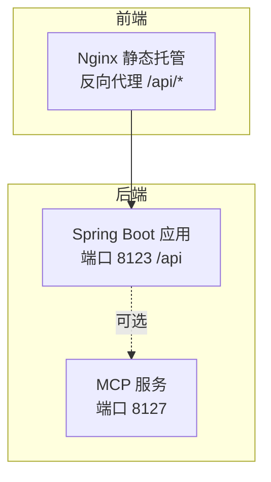
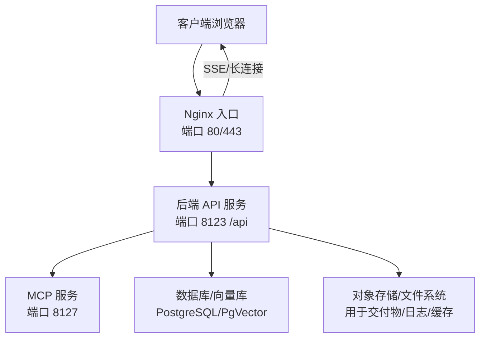
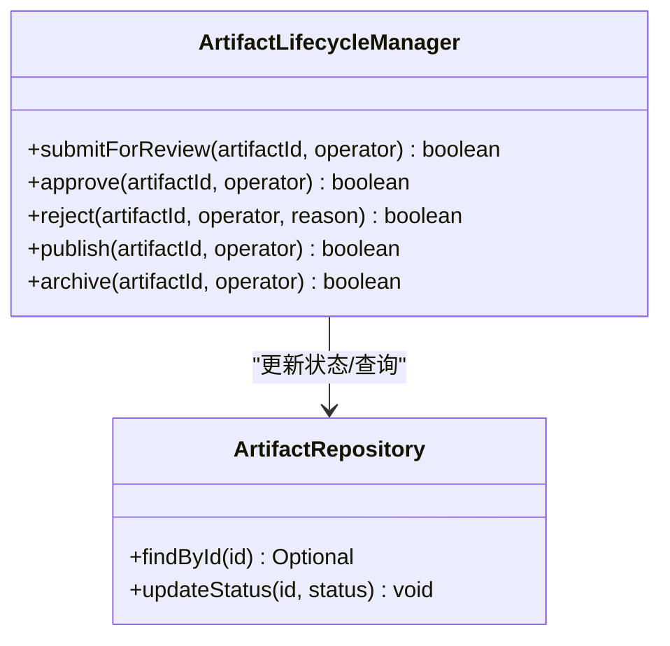
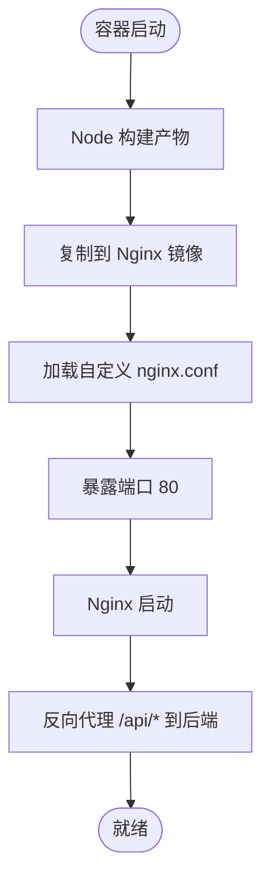
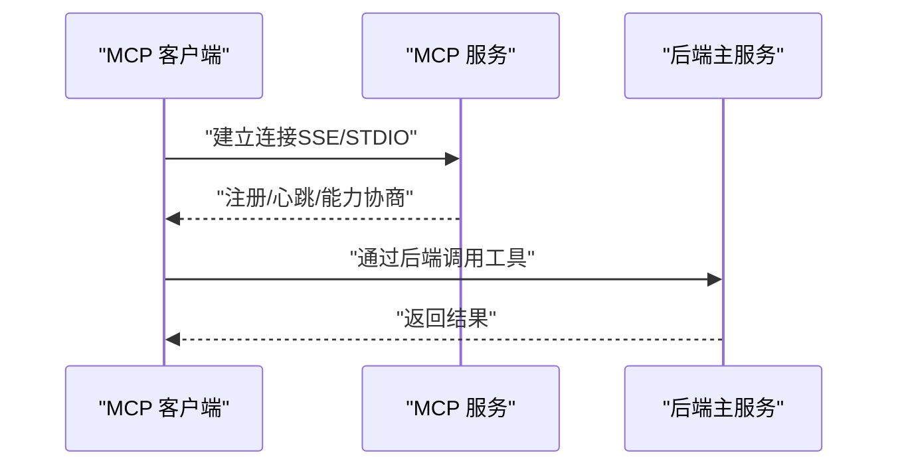
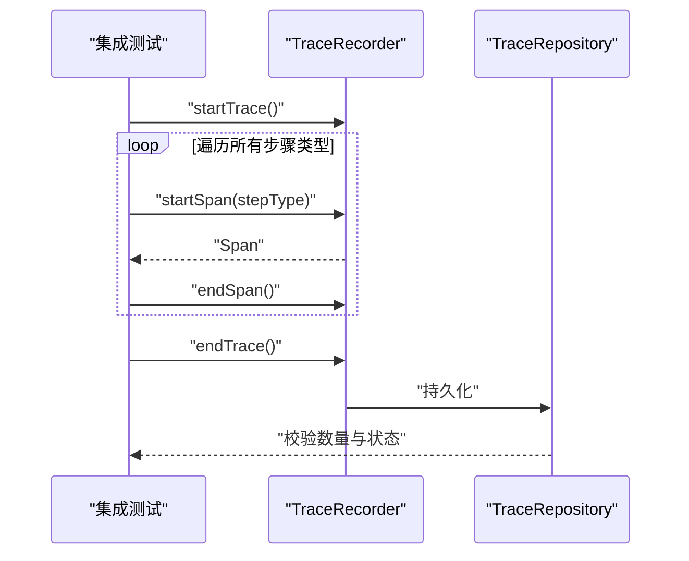
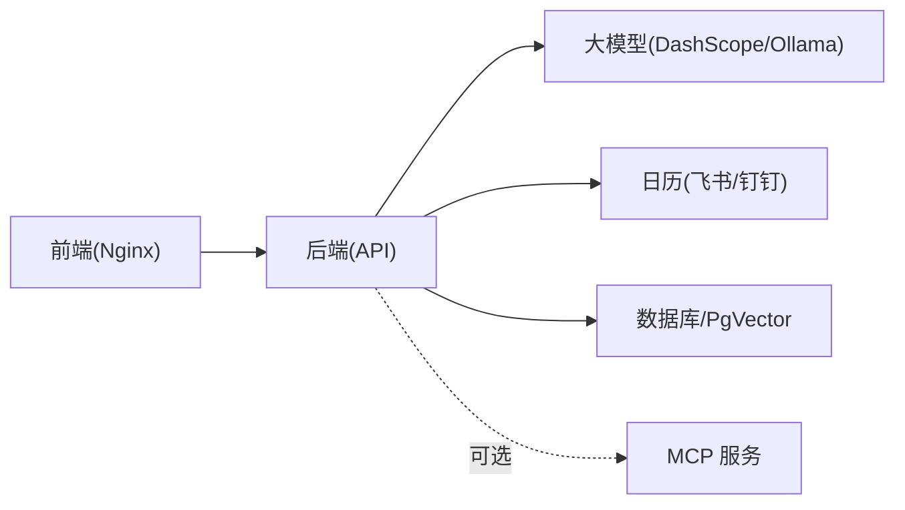

# 部署和运维

<cite>
**本文引用的文件**
- [application.yml](file://src/main/resources/application.yml)
- [application-prod.yml](file://src/main/resources/application-prod.yml)
- [Dockerfile（后端）](file://Dockerfile)
- [Dockerfile（前端）](file://yu-ai-agent-frontend/Dockerfile)
- [nginx.conf（前端）](file://yu-ai-agent-frontend/nginx.conf)
- [package.json（前端）](file://yu-ai-agent-frontend/package.json)
- [application.yml（MCP 服务）](file://yu-image-search-mcp-server/src/main/resources/application.yml)
- [application-sse.yml（MCP 服务）](file://yu-image-search-mcp-server/src/main/resources/application-sse.yml)
- [application-stdio.yml（MCP 服务）](file://yu-image-search-mcp-server/src/main/resources/application-stdio.yml)
- [TraceIntegrationTest.java](file://src/test/java/com/yupi/yuaiagent/trace/TraceIntegrationTest.java)
- [ArtifactLifecycleManager.java](file://src/main/java/com/yupi/yuaiagent/artifact/ArtifactLifecycleManager.java)
</cite>

## 目录
1. [简介](#简介)
2. [项目结构](#项目结构)
3. [核心组件](#核心组件)
4. [架构总览](#架构总览)
5. [详细组件分析](#详细组件分析)
6. [依赖关系分析](#依赖关系分析)
7. [性能考量](#性能考量)
8. [故障排除指南](#故障排除指南)
9. [结论](#结论)
10. [附录](#附录)

## 简介
本指南面向 DevOps 工程师与系统管理员，提供从本地到生产的全栈部署与运维实践，涵盖：
- 生产环境部署方案与容器化配置
- 集群管理与服务编排思路
- 数据库与向量库配置要点
- 负载均衡与高可用策略
- 监控、日志与性能分析
- 备份、灾难恢复与安全加固
- CI/CD 流水线与自动化部署
- 运维最佳实践与故障排除

## 项目结构
系统由三部分组成：
- 后端主服务：基于 Spring Boot 的 Java 应用，提供 API、权限、沙箱、MCP 信任、执行轨迹等能力
- 前端服务：基于 Vue 的 SPA，通过 Nginx 提供静态托管与反向代理
- MCP 图像搜索工具服务：独立的 Spring AI MCP 服务器，支持 SSE/STDIO 两种接入方式

图表来源
- [Dockerfile（前端）:1-17](file://yu-ai-agent-frontend/Dockerfile#L1-L17)
- [nginx.conf（前端）:1-49](file://yu-ai-agent-frontend/nginx.conf#L1-L49)
- [application.yml（MCP 服务）:1-7](file://yu-image-search-mcp-server/src/main/resources/application.yml#L1-L7)
- [application.yml:41-44](file://src/main/resources/application.yml#L41-L44)

章节来源
- [Dockerfile（前端）:1-17](file://yu-ai-agent-frontend/Dockerfile#L1-L17)
- [nginx.conf（前端）:1-49](file://yu-ai-agent-frontend/nginx.conf#L1-L49)
- [application.yml（MCP 服务）:1-7](file://yu-image-search-mcp-server/src/main/resources/application.yml#L1-L7)
- [application.yml:41-44](file://src/main/resources/application.yml#L41-L44)

## 核心组件
- 后端主服务
  - 配置文件：application.yml（含生产 profile 覆盖文件 application-prod.yml）
  - 关键模块：权限与访问控制、沙箱执行、MCP 信任、执行轨迹、用户画像、交付物生命周期管理
- 前端服务
  - 构建于 Node/Vite，产物由 Nginx 托管；通过 /api/* 反代至后端
- MCP 服务
  - 支持 SSE 与 STDIO 两种运行模式，作为外部工具服务被主服务调用

章节来源
- [application.yml:1-154](file://src/main/resources/application.yml#L1-L154)
- [application-prod.yml:1-2](file://src/main/resources/application-prod.yml#L1-L2)
- [application.yml（MCP 服务）:1-7](file://yu-image-search-mcp-server/src/main/resources/application.yml#L1-L7)
- [application-sse.yml（MCP 服务）:1-10](file://yu-image-search-mcp-server/src/main/resources/application-sse.yml#L1-L10)
- [application-stdio.yml（MCP 服务）:1-13](file://yu-image-search-mcp-server/src/main/resources/application-stdio.yml#L1-L13)
- [Dockerfile（前端）:1-17](file://yu-ai-agent-frontend/Dockerfile#L1-L17)
- [nginx.conf（前端）:1-49](file://yu-ai-agent-frontend/nginx.conf#L1-L49)

## 架构总览
下图展示生产环境典型拓扑：Nginx 作为入口与反向代理，后端应用提供 API，MCP 服务按需提供外部工具能力。

图表来源
- [nginx.conf（前端）:14-35](file://yu-ai-agent-frontend/nginx.conf#L14-L35)
- [application.yml:41-44](file://src/main/resources/application.yml#L41-L44)
- [application.yml（MCP 服务）:6-7](file://yu-image-search-mcp-server/src/main/resources/application.yml#L6-L7)

## 详细组件分析

### 后端主服务（Spring Boot）
- 配置与环境变量
  - 通过 profiles.active 切换环境，生产使用 prod profile
  - 关键环境变量：DASHSCOPE_API_KEY、SEARCH_API_KEY、JWT_SECRET、日历提供商参数等
  - 文件存储路径：预约、会话、交付物、用户画像、执行轨迹等均支持通过环境变量配置
- 安全与治理
  - JWT 密钥通过环境变量注入
  - 沙箱默认关闭 Docker 依赖，生产建议开启并限制超时与输出大小
  - MCP 信任等级可配置，建议生产启用信任校验
- 功能模块
  - 权限与访问控制：基于策略的投票器与决策上下文
  - 沙箱：支持 Docker 与本地进程沙箱，限制资源与超时
  - 执行轨迹：可配置最大跨度、元数据长度、每用户最大轨迹数，支持实时事件流
  - 交付物生命周期：DRAFT → REVIEWING → APPROVED → PUBLISHED，或直接归档

图表来源
- [ArtifactLifecycleManager.java:1-78](file://src/main/java/com/yupi/yuaiagent/artifact/ArtifactLifecycleManager.java#L1-L78)

章节来源
- [application.yml:67-154](file://src/main/resources/application.yml#L67-L154)
- [application-prod.yml:1-2](file://src/main/resources/application-prod.yml#L1-L2)
- [ArtifactLifecycleManager.java:1-78](file://src/main/java/com/yupi/yuaiagent/artifact/ArtifactLifecycleManager.java#L1-L78)

### 前端服务（Vue + Nginx）
- 构建与运行
  - 多阶段 Dockerfile：Node 构建产物，Nginx 托管静态文件
  - 暴露端口 80，通过 nginx.conf 将 /api/* 反代至后端
- 路由与静态资源
  - SPA 路由回退到 index.html，适配前端路由
  - 静态资源设置长缓存与缓存头
- SSE 与长连接
  - 开启 proxy_set_header Connection ""、关闭缓冲与缓存，确保 SSE 正常工作

图表来源
- [Dockerfile（前端）:1-17](file://yu-ai-agent-frontend/Dockerfile#L1-L17)
- [nginx.conf（前端）:1-49](file://yu-ai-agent-frontend/nginx.conf#L1-L49)

章节来源
- [Dockerfile（前端）:1-17](file://yu-ai-agent-frontend/Dockerfile#L1-L17)
- [nginx.conf（前端）:1-49](file://yu-ai-agent-frontend/nginx.conf#L1-L49)
- [package.json（前端）:1-23](file://yu-ai-agent-frontend/package.json#L1-L23)

### MCP 服务（图像搜索工具）
- 运行模式
  - SSE 模式：通过 HTTP SSE 接入
  - STDIO 模式：无 Web 应用类型，适合进程内通信
- 配置要点
  - 通过 profiles.active 切换模式
  - MCP 服务名称、版本与类型在对应 profile 中声明

图表来源
- [application.yml（MCP 服务）:1-7](file://yu-image-search-mcp-server/src/main/resources/application.yml#L1-L7)
- [application-sse.yml（MCP 服务）:1-10](file://yu-image-search-mcp-server/src/main/resources/application-sse.yml#L1-L10)
- [application-stdio.yml（MCP 服务）:1-13](file://yu-image-search-mcp-server/src/main/resources/application-stdio.yml#L1-L13)

章节来源
- [application.yml（MCP 服务）:1-7](file://yu-image-search-mcp-server/src/main/resources/application.yml#L1-L7)
- [application-sse.yml（MCP 服务）:1-10](file://yu-image-search-mcp-server/src/main/resources/application-sse.yml#L1-L10)
- [application-stdio.yml（MCP 服务）:1-13](file://yu-image-search-mcp-server/src/main/resources/application-stdio.yml#L1-L13)

### 执行轨迹与测试验证
- 轨迹能力
  - 支持实时事件流、最大跨度、元数据长度、每用户最大轨迹数等配置
  - 单元测试覆盖所有步骤类型的录制与生命周期校验
- 运维意义
  - 便于定位慢点、失败节点与跨组件调用链
  - 为性能分析与容量规划提供数据基础

图表来源
- [TraceIntegrationTest.java:1-43](file://src/test/java/com/yupi/yuaiagent/trace/TraceIntegrationTest.java#L1-L43)
- [application.yml:111-119](file://src/main/resources/application.yml#L111-L119)

章节来源
- [TraceIntegrationTest.java:1-43](file://src/test/java/com/yupi/yuaiagent/trace/TraceIntegrationTest.java#L1-L43)
- [application.yml:111-119](file://src/main/resources/application.yml#L111-L119)

## 依赖关系分析
- 组件耦合
  - 前端仅依赖后端 API；MCP 为可选外部依赖
  - 后端通过环境变量与外部系统解耦（大模型、日历、MCP、向量库）
- 外部依赖
  - 数据库与向量库：通过 application.yml 中的占位符预留配置位置
  - 大模型 API：DashScope 与 Ollama，通过环境变量注入密钥
  - 日历服务：飞书/钉钉，通过环境变量选择提供商与凭证

图表来源
- [application.yml:11-82](file://src/main/resources/application.yml#L11-L82)
- [application.yml（MCP 服务）:1-7](file://yu-image-search-mcp-server/src/main/resources/application.yml#L1-L7)

章节来源
- [application.yml:11-82](file://src/main/resources/application.yml#L11-L82)
- [application.yml（MCP 服务）:1-7](file://yu-image-search-mcp-server/src/main/resources/application.yml#L1-L7)

## 性能考量
- 端口与网络
  - 后端：8123 /api；前端：80；MCP：8127
  - 前端反向代理需开启 SSE 支持（关闭缓冲、保持连接）
- 资源限制
  - 沙箱默认超时与输出大小可调，生产建议收紧
  - 向量检索批处理大小、距离类型与索引类型需结合数据规模调优
- 缓存与静态资源
  - 前端静态资源设置长缓存，减少带宽与延迟
- 日志与追踪
  - 启用 TRACE 实时事件流，结合后端日志进行热点分析

章节来源
- [nginx.conf（前端）:25-31](file://yu-ai-agent-frontend/nginx.conf#L25-L31)
- [application.yml:131-139](file://src/main/resources/application.yml#L131-L139)
- [application.yml:111-119](file://src/main/resources/application.yml#L111-L119)

## 故障排除指南
- 前端无法访问后端 API
  - 检查 nginx.conf 的 proxy_pass 与 /api/ 前缀匹配
  - 确认后端端口与上下文路径一致
- SSE 连接中断
  - 确认已设置 Connection 空字符串、关闭缓冲与缓存、提高读取超时
- 认证失败
  - 检查 JWT_SECRET 是否正确注入
  - 确认前端是否携带正确的 Authorization 头
- MCP 无法连接
  - 根据 profiles.active 选择 SSE 或 STDIO 模式
  - 校验 MCP 服务端口与连通性
- 执行轨迹异常
  - 查看 TRACE 相关配置与存储目录权限
  - 结合集成测试用例定位步骤类型缺失或状态异常

章节来源
- [nginx.conf（前端）:14-35](file://yu-ai-agent-frontend/nginx.conf#L14-L35)
- [application.yml:67-68](file://src/main/resources/application.yml#L67-L68)
- [application.yml（MCP 服务）:4-6](file://yu-image-search-mcp-server/src/main/resources/application.yml#L4-L6)
- [TraceIntegrationTest.java:27-43](file://src/test/java/com/yupi/yuaiagent/trace/TraceIntegrationTest.java#L27-L43)

## 结论
本指南提供了从容器化到集群编排、从数据库与向量库配置到高可用与安全加固的完整运维蓝图。建议在生产环境中：
- 使用环境变量注入敏感配置，禁用明文配置
- 启用 MCP 信任校验与沙箱资源限制
- 配置 SSE/长连接与静态资源缓存
- 建立完善的监控、日志与备份体系，并定期演练灾难恢复

## 附录

### 生产环境部署清单
- 镜像构建
  - 后端：基于 Maven 预装 JDK21 的镜像，打包后以 prod profile 启动
  - 前端：Node 构建 + Nginx 镜像，暴露 80 端口
- 环境变量
  - DASHSCOPE_API_KEY、SEARCH_API_KEY、JWT_SECRET、日历提供商参数
- 存储与持久化
  - 预约/会话/交付物/用户画像/轨迹目录映射到持久卷
- 网络与安全
  - 反向代理开启 SSE、关闭缓冲与缓存
  - 生产启用 HTTPS、严格 CORS 与速率限制
- 高可用与扩展
  - 多副本部署，健康检查与就绪探针
  - 负载均衡器分发流量，MCP 服务独立扩缩容

章节来源
- [Dockerfile（后端）:1-16](file://Dockerfile#L1-L16)
- [Dockerfile（前端）:1-17](file://yu-ai-agent-frontend/Dockerfile#L1-L17)
- [application.yml:67-82](file://src/main/resources/application.yml#L67-L82)
- [nginx.conf（前端）:14-35](file://yu-ai-agent-frontend/nginx.conf#L14-L35)