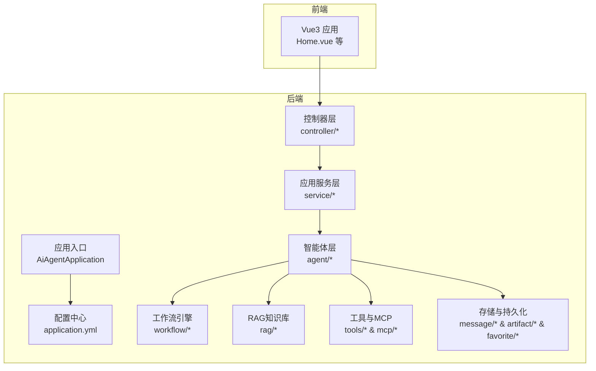
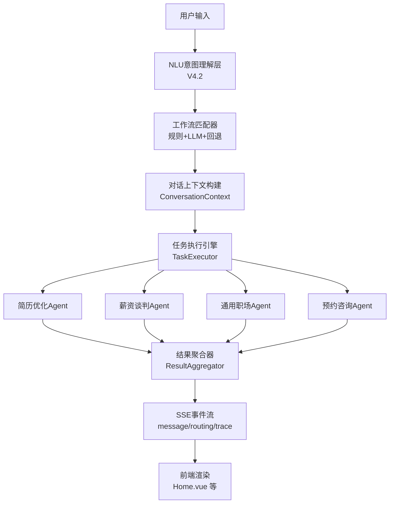
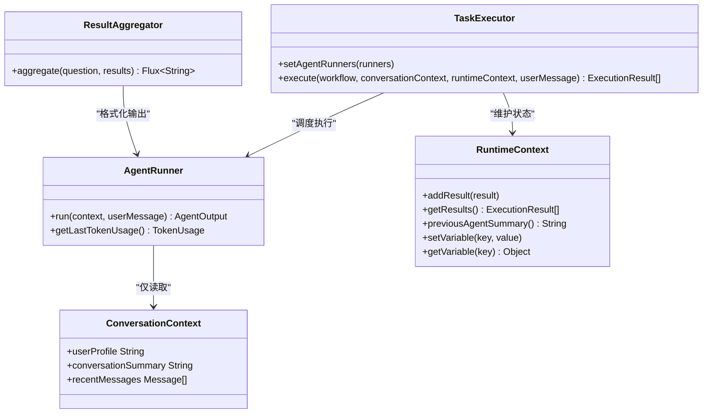
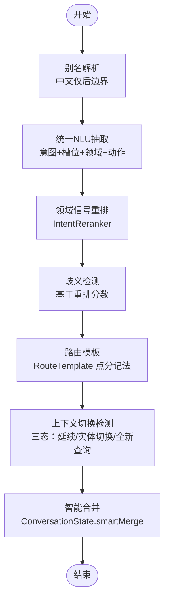
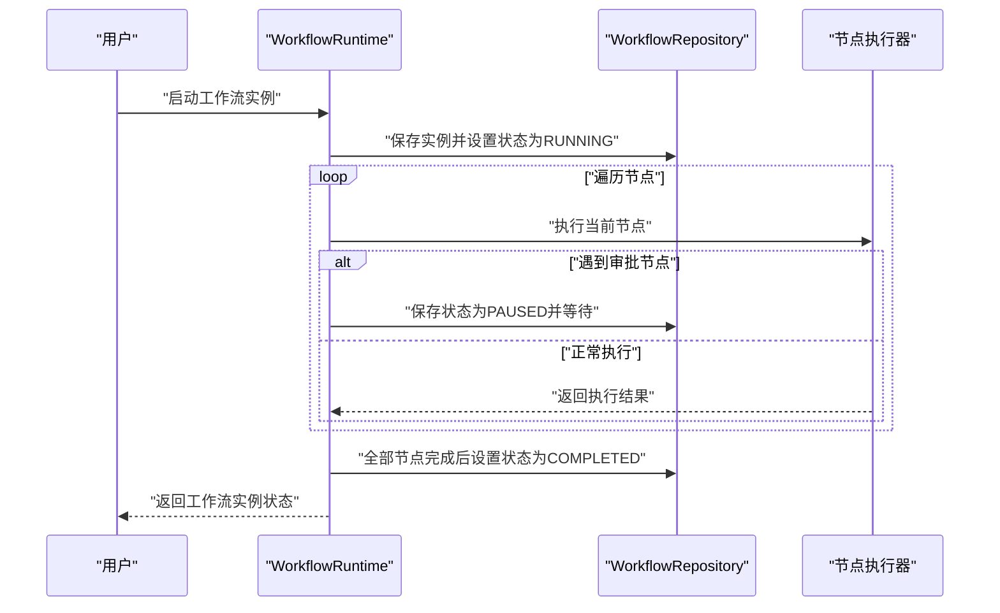
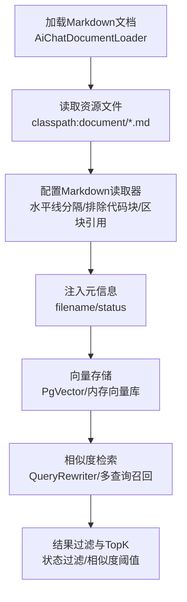
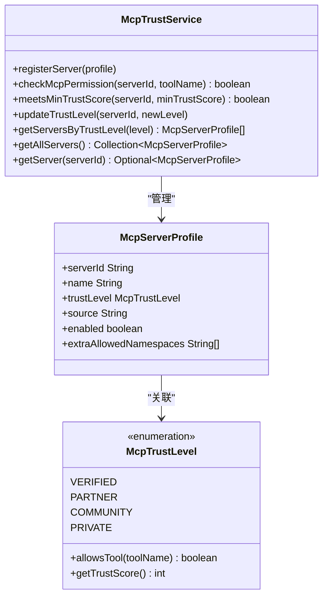
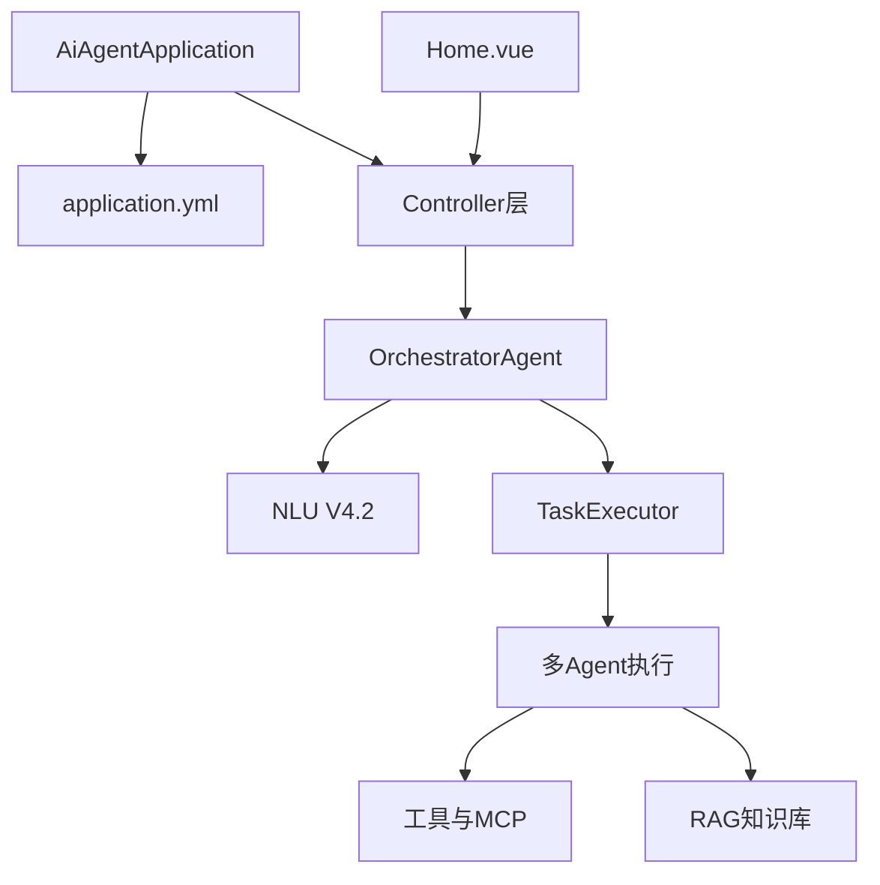

# 项目概述

<cite>
**本文档引用的文件**
- [README.md](file://README.md)
- [AiAgentApplication.java](file://src/main/java/com/yupi/yuaiagent/AiAgentApplication.java)
- [application.yml](file://src/main/resources/application.yml)
- [multi-agent-runtime-architecture.md](file://docs/multi-agent-runtime-architecture.md)
- [nlu-layer-design-v4.2.md](file://docs/nlu-layer-design-v4.2.md)
- [AgentRunner.java](file://src/main/java/com/yupi/yuaiagent/agent/AgentRunner.java)
- [TaskExecutor.java](file://src/main/java/com/yupi/yuaiagent/agent/TaskExecutor.java)
- [ResultAggregator.java](file://src/main/java/com/yupi/yuaiagent/agent/ResultAggregator.java)
- [WorkflowRuntime.java](file://src/main/java/com/yupi/yuaiagent/workflow/runtime/WorkflowRuntime.java)
- [AiChatDocumentLoader.java](file://src/main/java/com/yupi/yuaiagent/rag/AiChatDocumentLoader.java)
- [McpTrustService.java](file://src/main/java/com/yupi/yuaiagent/mcp/McpTrustService.java)
- [WebSearchTool.java](file://src/main/java/com/yupi/yuaiagent/tools/WebSearchTool.java)
- [Home.vue](file://yu-ai-agent-frontend/src/views/Home.vue)
</cite>

## 目录
1. [项目简介](#项目简介)
2. [项目结构](#项目结构)
3. [核心组件](#核心组件)
4. [架构总览](#架构总览)
5. [详细组件分析](#详细组件分析)
6. [依赖关系分析](#依赖关系分析)
7. [性能考量](#性能考量)
8. [故障排查指南](#故障排查指南)
9. [结论](#结论)
10. [附录](#附录)

## 项目简介
本项目是一个融合长链推理与多智能体协作的“全场景职场生存智囊Agent”平台，旨在通过AI大模型与工程化能力，帮助职场用户应对高压力场景（如上下级沟通、高难度汇报、同事甩锅、谈薪离职、饭局应酬等）。平台提供多轮对话、RAG知识库检索、工具调用与MCP服务编排，支持预约咨询、对话记忆压缩、执行轨迹追踪、质量守护、收藏与用量统计等能力。

- 核心价值主张
  - 以“AI开发实战”为主线，将AI核心概念、实用工具、编程技术、框架原理、调优技巧融入真实业务场景，显著提升求职竞争力。
  - 通过多智能体协作与工作流编排，实现从意图识别到任务执行的端到端自动化，降低复杂任务的决策成本与执行门槛。
  - 以RAG知识库与工具调用为支撑，结合日历对接与MCP服务，形成“认知-决策-执行”的闭环。

- 主要功能特性
  - 智能路由与多Agent协作：基于NLU意图理解与工作流匹配，自动路由到简历优化、薪资谈判、离职规划、通用职场等Agent。
  - 预约咨询：智能识别预约意图，自动收集必要信息并通过飞书/钉钉日历对接创建事件。
  - 对话记忆压缩：基于Token阈值与轮数阈值的多策略压缩，保障长对话性能。
  - RAG知识库：内置职场生存文档，支持向量化检索与查询改写增强。
  - 工具与MCP：提供联网搜索、网页抓取、文件操作、PDF生成、终端执行等工具，并通过MCP协议安全编排第三方服务。
  - 质量守护与治理：失败策略、预算控制、执行轨迹、沙箱与信任管理等，确保系统稳定与安全。

- 技术架构亮点
  - 多Agent运行时（V2）：明确分离不可变对话上下文与可变运行时上下文，避免上下文污染；统一的任务执行引擎与结果聚合器，支持流式输出与跨Agent记忆注入。
  - NLU意图理解层（V4.2）：引入三态上下文切换（延续/实体切换/全新查询）、别名解析后边界修正、领域信号重排、点分记法路由模板与Redis Lua CAS，显著提升意图识别准确度与并发安全性。
  - 工作流引擎：支持6种节点类型（Agent/Tool/Condition/Parallel/Loop/Approval），与Agent运行时并存，实现从“决策”到“执行”的解耦。
  - RAG增强：文档加载、文本分割、关键词增强、多查询召回、向量检索与相似度阈值控制，结合状态过滤与TopK选择，提升检索质量。
  - 前后端一体化：后端采用Spring Boot + Spring AI，前端采用Vue3 + Vue Router，提供直观的仪表盘与聊天界面。

- 创新点与竞争优势
  - AI驱动的智能体协作：通过OrchestratorAgent与TaskExecutor，实现规则+LLM混合匹配、预算控制、失败策略与结果聚合，确保复杂任务的可控执行。
  - RAG知识检索：结合状态过滤与相似度阈值，针对不同场景（如简历、薪资、面试）提供精准检索结果。
  - 工作流编排：支持条件分支、并行执行、循环与审批节点，满足企业级复杂业务流程。
  - MCP信任治理：内置MCP服务器注册与信任等级校验，支持动态调整与命名空间授权，保障第三方服务的安全接入。

- 使用场景示例
  - 职场咨询：用户输入“帮我优化简历”，系统自动路由到简历优化Agent，生成分析与建议，并输出可下载的PDF。
  - 薪资谈判：用户输入“帮我准备加薪谈判方案”，系统结合市场数据与个人情况，生成谈判策略与话术。
  - 离职规划：用户输入“我要离职，帮我梳理交接清单”，系统生成证据链与交接清单，支持导出与收藏。
  - 预约咨询：用户输入“我想预约咨询”，系统自动收集姓名、联系方式、时间等信息，对接日历服务创建事件。

**章节来源**
- [README.md:30-144](file://README.md#L30-L144)
- [README.md:414-496](file://README.md#L414-L496)

## 项目结构
项目采用分层与功能域结合的组织方式，后端以Spring Boot为核心，前端采用Vue3，文档与设计说明集中在docs目录，核心代码位于src/main/java/com/yupi/yuaiagent。

**图表来源**
- [AiAgentApplication.java:17-21](file://src/main/java/com/yupi/yuaiagent/AiAgentApplication.java#L17-L21)
- [application.yml:1-154](file://src/main/resources/application.yml#L1-L154)
- [Home.vue:1-340](file://yu-ai-agent-frontend/src/views/Home.vue#L1-L340)

**章节来源**
- [README.md:145-376](file://README.md#L145-L376)

## 核心组件
- 多智能体运行时（V2）
  - AgentRunner接口：定义Agent执行契约，仅接收不可变对话上下文，避免污染运行时状态。
  - TaskExecutor：统一的任务执行引擎，负责预算检查、失败策略、结果收集与Token使用追踪。
  - ResultAggregator：对成功执行的Agent输出进行格式化与合成，支持流式输出。
- NLU意图理解层（V4.2）
  - AliasResolver：中文别名仅做后边界检查，提升匹配准确性。
  - ContextShiftDetector：三态上下文切换（延续/实体切换/全新查询），配合ConversationState.smartMerge实现智能合并。
  - IntentReranker：基于别名领域信号对意图分数进行重排，消除歧义。
  - RouteTemplate：点分记法动态生成路由，支持前缀匹配与大规模扩展。
  - Redis Lua CAS：保证多轮对话状态的并发安全。
- 工作流引擎
  - WorkflowRuntime：支持6种节点类型，异步执行并支持审批暂停/恢复。
- RAG知识库
  - AiChatDocumentLoader：加载内置Markdown文档并注入元信息。
  - 多查询召回、关键词增强、向量检索与相似度阈值控制。
- 工具与MCP
  - WebSearchTool：基于SearchAPI的网页搜索工具。
  - McpTrustService：MCP服务器注册、信任等级校验与动态调整。

**章节来源**
- [AgentRunner.java:12-23](file://src/main/java/com/yupi/yuaiagent/agent/AgentRunner.java#L12-L23)
- [TaskExecutor.java:30-144](file://src/main/java/com/yupi/yuaiagent/agent/TaskExecutor.java#L30-L144)
- [ResultAggregator.java:19-50](file://src/main/java/com/yupi/yuaiagent/agent/ResultAggregator.java#L19-L50)
- [nlu-layer-design-v4.2.md:20-178](file://docs/nlu-layer-design-v4.2.md#L20-L178)
- [nlu-layer-design-v4.2.md:182-261](file://docs/nlu-layer-design-v4.2.md#L182-L261)
- [nlu-layer-design-v4.2.md:265-381](file://docs/nlu-layer-design-v4.2.md#L265-L381)
- [nlu-layer-design-v4.2.md:385-472](file://docs/nlu-layer-design-v4.2.md#L385-L472)
- [WorkflowRuntime.java:23-228](file://src/main/java/com/yupi/yuaiagent/workflow/runtime/WorkflowRuntime.java#L23-L228)
- [AiChatDocumentLoader.java:19-57](file://src/main/java/com/yupi/yuaiagent/rag/AiChatDocumentLoader.java#L19-L57)
- [WebSearchTool.java:18-54](file://src/main/java/com/yupi/yuaiagent/tools/WebSearchTool.java#L18-L54)
- [McpTrustService.java:26-172](file://src/main/java/com/yupi/yuaiagent/mcp/McpTrustService.java#L26-L172)

## 架构总览
系统采用“意图识别—工作流匹配—多Agent执行—结果聚合—持久化与追踪”的整体流程，前后端通过SSE事件流实现实时交互。

**图表来源**
- [multi-agent-runtime-architecture.md:527-579](file://docs/multi-agent-runtime-architecture.md#L527-L579)
- [nlu-layer-design-v4.2.md:532-584](file://docs/nlu-layer-design-v4.2.md#L532-L584)
- [Home.vue:1-340](file://yu-ai-agent-frontend/src/views/Home.vue#L1-L340)

**章节来源**
- [multi-agent-runtime-architecture.md:527-579](file://docs/multi-agent-runtime-architecture.md#L527-L579)
- [nlu-layer-design-v4.2.md:532-584](file://docs/nlu-layer-design-v4.2.md#L532-L584)

## 详细组件分析

### 多智能体运行时（V2）类图

**图表来源**
- [AgentRunner.java:12-23](file://src/main/java/com/yupi/yuaiagent/agent/AgentRunner.java#L12-L23)
- [TaskExecutor.java:30-144](file://src/main/java/com/yupi/yuaiagent/agent/TaskExecutor.java#L30-L144)
- [ResultAggregator.java:19-50](file://src/main/java/com/yupi/yuaiagent/agent/ResultAggregator.java#L19-L50)
- [multi-agent-runtime-architecture.md:308-383](file://docs/multi-agent-runtime-architecture.md#L308-L383)

**章节来源**
- [AgentRunner.java:12-23](file://src/main/java/com/yupi/yuaiagent/agent/AgentRunner.java#L12-L23)
- [TaskExecutor.java:30-144](file://src/main/java/com/yupi/yuaiagent/agent/TaskExecutor.java#L30-L144)
- [ResultAggregator.java:19-50](file://src/main/java/com/yupi/yuaiagent/agent/ResultAggregator.java#L19-L50)
- [multi-agent-runtime-architecture.md:308-383](file://docs/multi-agent-runtime-architecture.md#L308-L383)

### NLU意图理解层（V4.2）流程图

**图表来源**
- [nlu-layer-design-v4.2.md:20-58](file://docs/nlu-layer-design-v4.2.md#L20-L58)
- [nlu-layer-design-v4.2.md:265-381](file://docs/nlu-layer-design-v4.2.md#L265-L381)
- [nlu-layer-design-v4.2.md:385-472](file://docs/nlu-layer-design-v4.2.md#L385-L472)
- [nlu-layer-design-v4.2.md:72-178](file://docs/nlu-layer-design-v4.2.md#L72-L178)
- [nlu-layer-design-v4.2.md:182-261](file://docs/nlu-layer-design-v4.2.md#L182-L261)

**章节来源**
- [nlu-layer-design-v4.2.md:20-58](file://docs/nlu-layer-design-v4.2.md#L20-L58)
- [nlu-layer-design-v4.2.md:265-381](file://docs/nlu-layer-design-v4.2.md#L265-L381)
- [nlu-layer-design-v4.2.md:385-472](file://docs/nlu-layer-design-v4.2.md#L385-L472)
- [nlu-layer-design-v4.2.md:72-178](file://docs/nlu-layer-design-v4.2.md#L72-L178)
- [nlu-layer-design-v4.2.md:182-261](file://docs/nlu-layer-design-v4.2.md#L182-L261)

### 工作流编排（WorkflowRuntime）时序图

**图表来源**
- [WorkflowRuntime.java:31-156](file://src/main/java/com/yupi/yuaiagent/workflow/runtime/WorkflowRuntime.java#L31-L156)

**章节来源**
- [WorkflowRuntime.java:31-156](file://src/main/java/com/yupi/yuaiagent/workflow/runtime/WorkflowRuntime.java#L31-L156)

### RAG知识检索（AiChatDocumentLoader）流程图

**图表来源**
- [AiChatDocumentLoader.java:33-56](file://src/main/java/com/yupi/yuaiagent/rag/AiChatDocumentLoader.java#L33-L56)

**章节来源**
- [AiChatDocumentLoader.java:33-56](file://src/main/java/com/yupi/yuaiagent/rag/AiChatDocumentLoader.java#L33-L56)

### MCP信任治理（McpTrustService）类图

**图表来源**
- [McpTrustService.java:26-172](file://src/main/java/com/yupi/yuaiagent/mcp/McpTrustService.java#L26-L172)

**章节来源**
- [McpTrustService.java:26-172](file://src/main/java/com/yupi/yuaiagent/mcp/McpTrustService.java#L26-L172)

## 依赖关系分析
- 应用启动与配置
  - 应用入口排除数据库自动配置与Ollama自动配置，便于本地开发与DashScope集成。
  - 配置文件集中管理AI模型、日历服务、JWT密钥、会话/交付物存储、执行轨迹、对话记忆压缩、沙箱与MCP信任等参数。
- 技术栈与依赖
  - Spring Boot 3 + Spring AI + LangChain4j，支持多模态模型与SSE事件流。
  - RAG依赖Markdown文档读取、向量存储（PgVector/内存向量库）与检索增强。
  - 工具与MCP依赖SearchAPI、Jsoup、iText、Kryo等第三方库。
- 前后端交互
  - 前端通过SSE订阅后端事件（routing/agent-turn/message/trace/quality-review/error），实现流式响应与可视化展示。

**图表来源**
- [AiAgentApplication.java:11-16](file://src/main/java/com/yupi/yuaiagent/AiAgentApplication.java#L11-L16)
- [application.yml:1-154](file://src/main/resources/application.yml#L1-L154)
- [Home.vue:1-340](file://yu-ai-agent-frontend/src/views/Home.vue#L1-L340)

**章节来源**
- [AiAgentApplication.java:11-16](file://src/main/java/com/yupi/yuaiagent/AiAgentApplication.java#L11-L16)
- [application.yml:1-154](file://src/main/resources/application.yml#L1-L154)
- [Home.vue:1-340](file://yu-ai-agent-frontend/src/views/Home.vue#L1-L340)

## 性能考量
- Token预算控制：通过TokenBudget与TokenUsageTracker在工作流级别进行预算检查与用量统计，避免超限与资源浪费。
- 对话记忆压缩：基于Token阈值与轮数阈值的多策略压缩，保留最近N轮完整对话，降低上下文长度。
- N+1问题优化：PromptContextBuilder在工作流开始时构建共享基础prompt，避免重复拼接与Token计算。
- 并发安全：NLU状态存储采用Redis Lua CAS脚本，防止版本冲突与竞态写入。
- 工具调用与MCP：通过沙箱与信任治理限制工具与服务的访问范围，降低执行开销与安全风险。

[本节为通用指导，无需列出具体文件来源]

## 故障排查指南
- 预算超限与失败策略
  - 检查Token预算配置与实际用量，确认FailurePolicy是否符合预期（FAIL_FAST/RETRY_THEN_SKIP/RETRY_THEN_FAIL/SKIP）。
- NLU歧义与路由问题
  - 核对别名解析规则、领域信号重排与路由模板生成，确保意图识别与工作流匹配正确。
- 工具调用失败
  - 检查SearchAPI密钥、网络连通性与工具参数，确认工具注册与权限配置。
- MCP信任校验失败
  - 核对MCP服务器注册信息、信任等级与命名空间授权，必要时动态调整信任等级。
- 前后端事件流异常
  - 检查SSE事件名称与前端订阅逻辑，确认后端事件发送与前端渲染一致性。

**章节来源**
- [TaskExecutor.java:78-138](file://src/main/java/com/yupi/yuaiagent/agent/TaskExecutor.java#L78-L138)
- [nlu-layer-design-v4.2.md:532-584](file://docs/nlu-layer-design-v4.2.md#L532-L584)
- [McpTrustService.java:80-112](file://src/main/java/com/yupi/yuaiagent/mcp/McpTrustService.java#L80-L112)
- [Home.vue:136-181](file://yu-ai-agent-frontend/src/views/Home.vue#L136-L181)

## 结论
本项目通过多智能体协作与工作流编排，结合RAG知识检索与工具/MCP服务，构建了一个可扩展、可治理、可追踪的职场智能助手平台。其在意图识别、上下文管理、预算控制、质量守护与前端体验方面具备显著优势，能够有效支撑从简历优化、薪资谈判到离职规划等复杂职场场景的自动化处理。

[本节为总结性内容，无需列出具体文件来源]

## 附录
- 项目背景与发展历程
  - 项目以“AI开发实战”为核心，围绕AI大模型接入、Prompt工程、RAG知识库、Tool Calling与MCP服务展开，逐步演进至多Agent运行时与工作流编排。
- 未来规划
  - 扩展数据库支持（MySQL/PostgreSQL）、完善单元测试、细化异常处理与日志规范、补充Swagger文档、引入更多工具与MCP服务、优化前端交互与可视化。

**章节来源**
- [README.md:498-523](file://README.md#L498-L523)