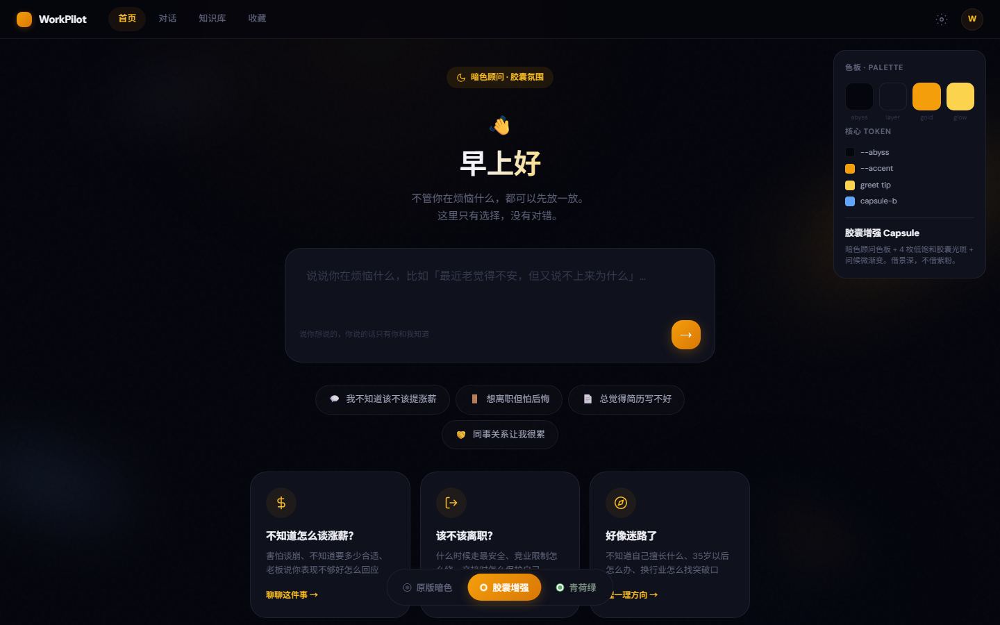

<div align="right">
  <a href="./README.md">🇨🇳 中文</a> | <b>🇺🇸 English</b>
</div>

<div align="center">
  <h1>WorkPilot</h1>
  <h3>🚀 All-Scenario AI Career Coach</h3>
  <p><em>From job seeking → negotiation → growth → consultation → resignation — a full-lifecycle workplace AI assistant</em></p>

  
  
  
  
  
  
</div>

---

## 🎯 Project Introduction

Calling an LLM API is easy. Shipping a real Agent product is harder: how do you route intent, layer memory, audit tool calls, and require human approval for risky actions? **WorkPilot** is a runnable full-stack answer to those questions.

WorkPilot is an **all-scenario AI career coach**. The frontend is a Vue 3 workbench; the backend is Java 21 + Spring Boot + Spring AI. User messages enter `OrchestratorAgent`, go through a keyword fast path / NLU pipeline, and land on specialist agents for resume, salary negotiation, resignation, consultation booking, and general career advice — with 4-layer memory, tool calling, HITL approval, execution traces, and dual storage (`file` / PostgreSQL).

Recent product capabilities also include a **personal career companion**, **digital employees**, **suggested-action chips**, a 👍/👎 feedback loop (Reflexion / Facts — not model fine-tuning), plus engineering upgrades: **document Perception**, **Goal Anchor**, **tool Schema / parallel fan-out / idempotency / Submit-Poll**, **Agent Loop Wrap-up / Replanner / Depth Limit**, a **unified RAG pipeline** (`RetrievalPipeline` + `RagTool`), and a **Knowledge Base admin page** (MD/PDF upload · dual sage/dark themes).

Mapping notes from [mm_agent_tutorial](https://zsc.github.io/mm_agent_tutorial/) to WorkPilot: [docs/mm-agent-tutorial-场景对照总结.md](docs/mm-agent-tutorial-场景对照总结.md) (Chinese; tables & code paths are language-agnostic).

It is a good fit if you want to:

- Build a **demoable Multi-Agent portfolio project**
- Learn how **Orchestrator + sub-agents + Memory + Tools + HITL** land in production-style code
- Practice Chinese workplace scenarios (resume, raise, quit, booking)

---

## 📚 Quick Start

### Prerequisites

- JDK **21+** (on Windows, set `JAVA_HOME` to JDK 21 if the default is 17)
- Node.js **18+**
- [DashScope API Key](https://dashscope.aliyun.com/) (disable “free tier only” or ensure billing quota)

### 1. Clone

```bash
git clone https://github.com/jiasongqi/WorkplaceAIAgent.git
cd WorkplaceAIAgent
git checkout java-v3-db   # or feat/consultation-chat-ux / your target branch
```

### 2. Environment

```powershell
$env:DASHSCOPE_API_KEY = "your-dashscope-key"
$env:JWT_SECRET = "change-me-to-a-long-random-string"
# Optional: $env:STORAGE_TYPE = "file"   # file=./tmp ; jdbc=PostgreSQL
```

> Inject secrets via env vars — **never** commit API keys or DB passwords.

### 3. Backend

```powershell
# Windows: use JDK 21; quote Maven flags in PowerShell
$env:JAVA_HOME = "C:\Program Files\Microsoft\jdk-21.0.10.7-hotspot"   # adjust to your install
mvn spring-boot:run "-Dmaven.test.skip=true"
# → http://localhost:8123/api
# Health: curl http://localhost:8123/api/health
```

```bash
# macOS / Linux
mvn spring-boot:run -Dmaven.test.skip=true
```

### 4. Frontend

```bash
cd yu-ai-agent-frontend
npm install
npm run dev
# → http://localhost:3000
```

### 5. First run

1. Open http://localhost:3000/login  
2. **Register**, or local guest: username `游客` / password `workpilot-local` (or “Guest login”)  
3. Open **Career Advisor** and try: `Help me rewrite a Java backend resume highlight`

### Optional: PostgreSQL via Docker

```bash
docker compose up -d postgres
$env:STORAGE_TYPE = "jdbc"
$env:DB_URL = "jdbc:postgresql://localhost:5432/workpilot"
$env:DB_USERNAME = "workpilot"
$env:DB_PASSWORD = "workpilot123"
mvn spring-boot:run -DskipTests
```

Full stack:

```bash
docker compose up -d
```

---

## ✨ What You Will Get

- 🧭 **Multi-agent routing** — keyword fast path + NLU; 5 specialists (resume / negotiation / escape / consultation / general)
- 🧍 **Personal companion** — name / tone / focus / persona; takes effect on the next turn
- 👥 **Digital employees** — create from templates, customize persona, version rollback, activate for delegation
- 🔁 **Feedback loop** — 👍/👎 writes to Reflexion / Facts; SSE suggested-action chips
- 🧠 **4-layer memory** — sliding window · facts · summary · vector experience
- 🔧 **Tools & MCP** — Schema-as-prompt, parallel fan-out, observation sanitizer, side-effect idempotency, `file_id` chunks, Submit-Poll for long jobs; plus MCP
- 🛡️ **Reliability** — Goal Anchor, consecutive-failure fuse → HITL, max-steps Wrap-up, anti “I have done it” claims, nesting Depth Limit
- 📎 **Document Perception** — resume/offer preprocess bound to SharedState (avoids SSE URL limits) then expert routing; long PDF Map-Reduce summarization
- 📚 **RAG & Knowledge Base** — `RetrievalPipeline` (rewrite → multi-query → rerank with time decay); `/knowledge` page for MD/PDF upload (PDF table MVP); `RagTool` for Super Agent retrieval
- 🙋 **HITL approval** — confirm before high-risk terminal / calendar / file-write actions
- 📊 **Trace & eval** — execution timelines for debugging, demos, and regression
- 🗄️ **Dual storage** — `file` for local demo / `jdbc` PostgreSQL + Flyway
- 🖥️ **Runnable product UI** — login, home, career advisor, super agent, knowledge base

---

## 📖 Content Navigation

| Section | Focus | Status |
|---------|-------|--------|
| **I. Get started & product** | | |
| [Quick Start](#-quick-start) | Env, launch, first chat | ✅ |
| [Screenshots](#-screenshots) | Login / Advisor / Companion / Themes / Manus | ✅ |
| **II. Architecture & capabilities** | | |
| [Architecture](#-architecture) | Layered system + routing diagrams | ✅ |
| [Feature Map](#-feature-map) | Capability overview | ✅ |
| [docs/FEATURES.md](docs/FEATURES.md) | Full L0–L34 feature layers | ✅ |
| [docs/ARCHITECTURE.md](docs/ARCHITECTURE.md) | Architecture notes | ✅ |
| **III. Deep dives** | | |
| [docs/docs-index.md](docs/docs-index.md) | Documentation index | ✅ |
| [docs/WIKI.en.md](docs/WIKI.en.md) | Project wiki (English) | ✅ |
| [docs/WIKI.md](docs/WIKI.md) | Project wiki (Chinese) | ✅ |
| [docs/nlu-layer-design-v4.2.md](docs/nlu-layer-design-v4.2.md) | NLU pipeline design | ✅ |
| [docs/multi-agent-runtime-architecture.md](docs/multi-agent-runtime-architecture.md) | Multi-agent runtime | ✅ |
| [docs/plan-auth-sse-storage.md](docs/plan-auth-sse-storage.md) | Auth · SSE · storage plan | ✅ |
| **IV. Interview** | | |
| [docs/INTERVIEW-DEFENSE.md](docs/INTERVIEW-DEFENSE.md) | Interview defense notes | ✅ |
| [docs/INTERVIEW_QA_SKILL.md](docs/INTERVIEW_QA_SKILL.md) | Interview Q&A skill notes | ✅ |
| [docs/interview-perception-goal-reliability.md](docs/interview-perception-goal-reliability.md) | Perception / Goal / Tools / Loop talking points | ✅ |
| [docs/PROJECT_HIGHLIGHTS.md](docs/PROJECT_HIGHLIGHTS.md) | Project highlights | ✅ |
| **V. Study notes** | | |
| [docs/mm-agent-tutorial-场景对照总结.md](docs/mm-agent-tutorial-场景对照总结.md) | **Tutorial Ch1–Ch10 → WorkPilot scenarios / code / interview** | ✅ |
| [docs/mm-agent-tutorial-ch1-落地.md](docs/mm-agent-tutorial-ch1-落地.md) | Multimodal tutorial Ch1 landing | ✅ |
| [docs/mm-agent-tutorial-ch3-落地.md](docs/mm-agent-tutorial-ch3-落地.md) | Tool Call Ch3 landing | ✅ |
| [docs/mm-agent-tutorial-ch4-落地.md](docs/mm-agent-tutorial-ch4-落地.md) | Agent Loop Ch4 landing | ✅ |
| [docs/mm-agent-tutorial-ch5-落地.md](docs/mm-agent-tutorial-ch5-落地.md) | Memory & RAG · KB PDF · KnowledgeBase UI | ✅ |
| [docs/hello-agents-study.md](docs/hello-agents-study.md) | Hello-Agents study mapping | ✅ |
| [docs/HELLO_AGENTS_SUMMARY.md](docs/HELLO_AGENTS_SUMMARY.md) | Hello-Agents summary | ✅ |

---

## 🖼 Screenshots

<p align="center">
  
</p>
<p align="center"><sub>Sign in / Register · local debug accounts</sub></p>

<p align="center">
  
</p>
<p align="center"><sub>Career Advisor: companion + digital employees · suggested-action chips · SSE streaming</sub></p>

<p align="center">
  
  
</p>
<p align="center"><sub>Left: companion persona settings · Right: digital-employee templates</sub></p>

<p align="center">
  
  
</p>
<p align="center"><sub>Left: Home · Right: Super Agent</sub></p>

<p align="center">
  
</p>
<p align="center"><sub>Knowledge base: MD/PDF upload · categories · filters · sage/dark themes (login required)</sub></p>

### Theme previews (prototype trio)

<p align="center">
  
  
  
</p>
<p align="center"><sub>Left: Original dark · Center: Capsule (default) · Right: Sage healing light</sub></p>

---

## 🏗 Architecture

<p align="center">
  
</p>
<p align="center"><sub>Frontend Vue3 → API / AppService → OrchestratorAgent → sub-agents + Memory / Trace / HITL / Store / LLM</sub></p>

### Agent routing

<p align="center">
  
</p>
<p align="center"><sub>User message → KeywordRouter (fast path) → NLU Pipeline → ReAct / Plan-and-Solve / Reflection → five specialist agents</sub></p>

### Tech stack

| Layer | Tech |
|-------|------|
| Backend | Java 21 · Spring Boot 3.4 · Spring AI 1.0 |
| Models | DashScope (default `qwen3.7-max`) · optional Ollama |
| Frontend | Vue 3 · Vite · Axios · marked |
| Storage | `file` (`./tmp`) or `jdbc` (PostgreSQL + Flyway) |
| Transport | SSE (token in URL) · REST + JWT refresh |

---

## 🗺 Feature Map

| Goal | Where | Who handles it |
|------|--------|----------------|
| Career chat: resume, salary, resignation | **Career Advisor** `/chat/career` | Orchestrator → 5 sub-agents |
| Upload resume / offer then ask | Advisor 📎 upload | Perception bind (**not** the KB document list) |
| Tune “my companion” persona | Advisor top pills / sidebar **My AI Team** | `/companion/me` + ContextInjection |
| Hire specialist digital employees | Advisor “Create” → pick a template | `/digital-employee/*` |
| Rate answers so the system evolves | Message 👍/👎 | Feedback → Reflexion / Facts |
| Persist docs for RAG retrieval | **Knowledge Base** `/knowledge` | `RetrievalPipeline` + `DocumentAppService` |
| Autonomous tool-using agent | **Super Agent** `/chat/super` | YuManus (ReAct + `searchKnowledgeBase`) |
| Inspect routing / execution | Trace / Usage panels | TraceRecorder · Usage |

| Capability | What it does |
|------------|--------------|
| Multi-agent routing | Keyword fast path + NLU; Resume / Negotiation / Escape / Consultation / General |
| Document Perception | Resume/offer → SharedState; perception routing beats vague NLU; long PDF Map-Reduce |
| RAG Knowledge Base | `RetrievalPipeline` · `RagTool` · PDF table MVP · `/knowledge` dual-theme admin UI |
| Goal Anchor | Re-inject turn goal each step against context forgetting |
| Personal companion | Per-user companion injected into Orchestrator context |
| Digital employees | Template create, persona versions, activate, rollback |
| Feedback loop | UP/DOWN → Fact prefs / Reflexion; stats on Usage page |
| Suggested actions | Cold-start chips + SSE `suggested-actions` after replies |
| 4-layer memory | Sliding window · facts · summary · vector experience |
| Tool calling | Schema boundaries · parallel fan-out · sanitizer · idempotency · file_id · Submit-Poll + MCP |
| Agent Loop | maxSteps Wrap-up · P&E Replanner · anti completion hallucination · Depth Limit |
| HITL | Approval for high-risk terminal, calendar & file-write actions |
| Consultation booking | Slot filling → confirm → create (Feishu/DingTalk ready) |
| Trace | Execution timeline for debugging & demos |
| Dual storage | `file` demo / `jdbc` PostgreSQL |
| Quality & ops | QualityGuard · Actuator · Prometheus |

Full layer map: [docs/FEATURES.md](docs/FEATURES.md).

---

## 💡 How to Learn

This repo is **engineering-first**, not a chapter-only tutorial. Suggested path:

1. **Run it** — follow Quick Start, chat a few rounds in Career Advisor  
2. **Watch routing** — use Trace / logs to see KeywordRouter vs NLU pick a sub-agent  
3. **Read core code** — `OrchestratorAgent` → sub-agents → `MemoryCoordinator` → HITL  
4. **Use the docs** — [scenario mapping](docs/mm-agent-tutorial-场景对照总结.md) + `FEATURES.md` + `INTERVIEW-DEFENSE.md`  
5. **Extend one piece** — upload MD/PDF on `/knowledge`, or add a Skill YAML / MCP

Best for people with some Java / frontend background and basic LLM API knowledge. No model-training background required.

### Layout

```
agent_product/
├── src/main/java/com/yupi/yuaiagent/
│   ├── agent/          # Orchestrator + sub-agents + paradigms + loop/
│   ├── perception/     # Document perception preprocess
│   ├── nlu/ memory/    # Intent · 4-layer memory
│   ├── hitl/ auth/     # HITL · JWT / quota
│   ├── tools/ rag/     # Tools · RetrievalPipeline · RagTool
│   ├── document/pdf/   # PDF table structured ingestion
│   ├── guard/ budget/  # Loop detection · observation sanitizer · token budget
│   ├── controller/ service/
├── src/main/resources/
│   ├── application.yml · skills/ · permissions/ · db/migration/
├── yu-ai-agent-frontend/   # KnowledgeBase.vue · dual themes
├── docker-compose.yml
└── docs/               # WIKI · FEATURES · mm-agent scenario map · ch1/3/4/5 · assets
```

---

## ❓ FAQ

**No chat reply?**  
Check logs for `AllocationQuota.FreeTierOnly` — DashScope free quota exhausted.

**Build fails with “release version 21 not supported”?**  
Point `JAVA_HOME` to JDK 21 and restart (see Quick Start PowerShell example).

**Maven flag errors on PowerShell?**  
Use `mvn spring-boot:run "-Dmaven.test.skip=true"` (quote the flag).

**SSE auth fails?**  
EventSource cannot send headers; the frontend passes `token` as a query param. Make sure you are logged in.

---

## 📜 License

[MIT License](LICENSE).

---

<div align="center">
  <p>If this project helps you, a Star ⭐ is appreciated</p>
  <p><em>Built by jsq · Java 21 + Spring AI + Vue 3 + PostgreSQL</em></p>
</div>
