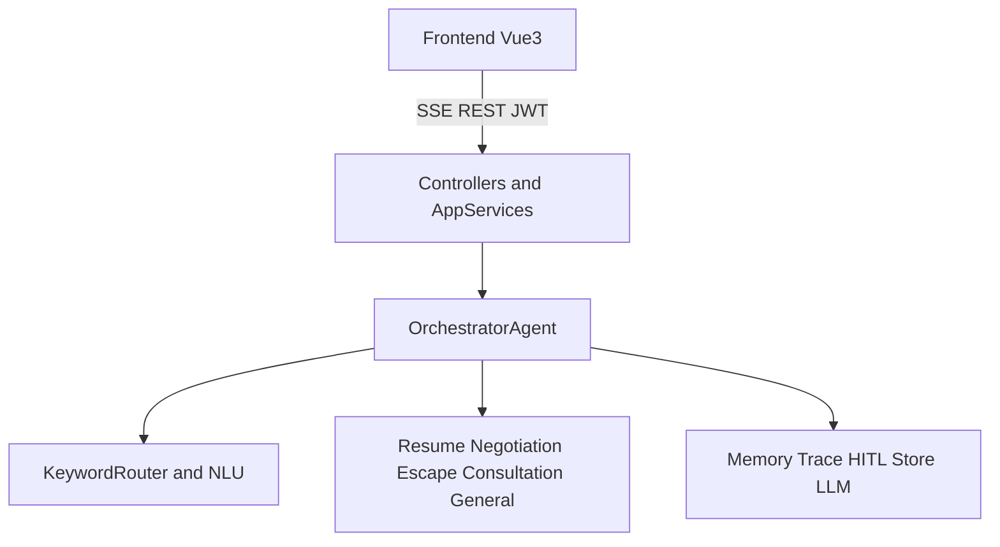
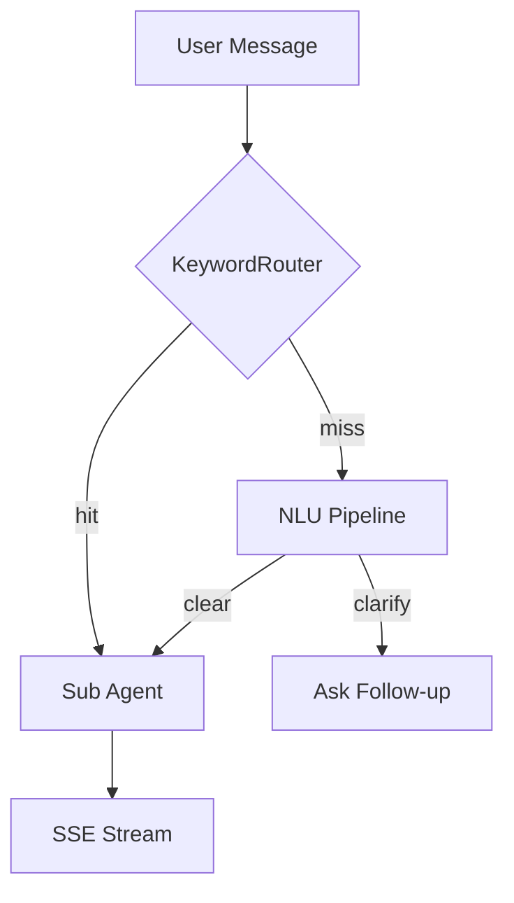

# WorkPilot · 全场景职场 AI 智囊

[](https://openjdk.org/)
[](https://spring.io/projects/spring-boot)
[](https://docs.spring.io/spring-ai/reference/)
[](https://vuejs.org/)
[](https://www.postgresql.org/)
[](LICENSE)

**English:** [README.en.md](README.en.md)

> 覆盖求职 → 谈判 → 在职成长 → 预约咨询 → 离职规划的全生命周期职场 AI 助手。  
> Multi-Agent 路由 + 四层记忆 + HITL 审批 + 可选 PostgreSQL 持久化。

---

## 60 秒看懂产品

| 你想做什么 | 去哪用 | 背后是谁 |
|-----------|--------|---------|
| 聊职场困惑、求职、薪资、离职 | **职场顾问** `/chat/career` | Orchestrator → 5 个子 Agent |
| 让 AI 自己规划并调用工具 | **超级智能体** `/chat/super` | YuManus（ReAct） |
| 检索内置职场知识 | **知识库** `/knowledge` | RAG + 向量检索 |
| 看一次对话怎么被路由/执行 | Trace / 用量面板 | TraceRecorder · Usage |

**专业子 Agent：** Resume（求职）· Negotiation（谈薪）· Escape（离职）· Consultation（预约）· General（通用职场）

---

## 产品截图

<p align="center">
  
</p>
<p align="center"><sub>登录 / 注册 / 游客联调</sub></p>

<p align="center">
  
</p>
<p align="center"><sub>工作台：快捷场景入口</sub></p>

<p align="center">
  
</p>
<p align="center"><sub>职场顾问：SSE 流式对话 + 多 Agent 路由</sub></p>

<p align="center">
  
  
</p>
<p align="center"><sub>左：超级智能体 · 右：知识库</sub></p>

---

## 架构一览

<p align="center">
  
</p>



### Agent 路由

<p align="center">
  
</p>



### 技术栈

| 层 | 技术 |
|----|------|
| 后端 | Java 21 · Spring Boot 3.4 · Spring AI 1.0 |
| 模型 | DashScope（默认 `qwen3.7-max`）· 可选 Ollama |
| 前端 | Vue 3 · Vite · Axios · marked |
| 存储 | `file`（本地 `./tmp`）或 `jdbc`（PostgreSQL + Flyway） |
| 通信 | SSE（token 走 URL 参数）· REST + JWT refresh |

---

## 快速开始

### 1. 前置条件

- JDK **21+**（Windows 若默认是 17，请设置 `JAVA_HOME` 指向 JDK 21）
- Node.js **18+**
- [DashScope API Key](https://dashscope.aliyun.com/)（关闭「仅免费额度」或确保账户有余额）

### 2. 环境变量（PowerShell 示例）

```powershell
$env:DASHSCOPE_API_KEY = "your-dashscope-key"
$env:JWT_SECRET = "change-me-to-a-long-random-string"
# 可选
# $env:STORAGE_TYPE = "file"   # 默认本地文件；jdbc 需 PostgreSQL
# $env:SEARCH_API_KEY = "..."
```

> API Key / 数据库密码请用环境变量注入，**不要**写进仓库。

### 3. 启动后端

```bash
git clone https://github.com/jiasongqi/WorkplaceAIAgent.git
cd WorkplaceAIAgent
git checkout java-v3-db                  # 或 feat/consultation-chat-ux 等目标分支

# Windows 建议显式指定 JDK 21
# $env:JAVA_HOME = "C:\Program Files\Microsoft\jdk-21..."

mvn spring-boot:run -DskipTests
# → http://localhost:8123/api
# 健康检查: curl http://localhost:8123/api/health
```

### 4. 启动前端

```bash
cd yu-ai-agent-frontend
npm install
npm run dev
# → http://localhost:3000
```

### 5. 第一次登录

1. 打开 http://localhost:3000/login  
2. 点 **注册** 创建账号，或  
3. 本地联调：用户名 `游客` / 密码 `workpilot-local`，或点「一键游客登录」  
4. 进入首页 → **职场顾问**，发送例如：`帮我优化一段 Java 后端简历亮点`

### 可选：Docker 起 PostgreSQL

```bash
docker compose up -d postgres
$env:STORAGE_TYPE = "jdbc"
$env:DB_URL = "jdbc:postgresql://localhost:5432/workpilot"
$env:DB_USERNAME = "workpilot"
$env:DB_PASSWORD = "workpilot123"
mvn spring-boot:run -DskipTests
```

一键编排（库 + Redis + App）：

```bash
docker compose up -d
```

---

## 核心功能（精简）

| 能力 | 说明 |
|------|------|
| Multi-Agent 路由 | Keyword 快路径 + NLU；5 个专业子 Agent |
| 四层记忆 | 滑动窗口 · 事实 · 摘要 · 向量经验 |
| 工具调用 | 搜索 / 抓取 / 文件 / 终端 / PDF + MCP |
| HITL 审批 | 终端、日历等高危操作需确认 |
| 预约咨询 | 槽位收集 → 确认 → 创建（可接飞书/钉钉日历） |
| Trace | 执行轨迹可视化，便于联调与答辩 |
| 双存储 | `file` 演示 / `jdbc` 生产向 PostgreSQL |
| 质量与监控 | QualityGuard · Actuator · Prometheus |

完整分层（L0–L33）见 [docs/FEATURES.md](docs/FEATURES.md)。

---

## 目录结构

```
agent_product/
├── src/main/java/com/yupi/yuaiagent/
│   ├── agent/          # Orchestrator + 子 Agent + 范式
│   ├── nlu/ memory/    # 意图理解 · 四层记忆
│   ├── hitl/ auth/     # 人工审批 · JWT/配额
│   ├── tools/ rag/     # 工具 · 知识库
│   ├── controller/ service/
├── src/main/resources/
│   ├── application.yml · skills/ · permissions/ · db/migration/
├── yu-ai-agent-frontend/
├── docker-compose.yml
└── docs/               # WIKI · FEATURES · assets 截图
```

---

## 文档索引

| 文档 | 内容 |
|------|------|
| [README.en.md](README.en.md) | English README |
| [docs/WIKI.md](docs/WIKI.md) | 完整 Wiki |
| [docs/FEATURES.md](docs/FEATURES.md) | 功能分层 L0–L33 |
| [docs/ARCHITECTURE.md](docs/ARCHITECTURE.md) | 架构设计 |
| [docs/INTERVIEW-DEFENSE.md](docs/INTERVIEW-DEFENSE.md) | 面试答辩 |
| [docs/nlu-layer-design-v4.2.md](docs/nlu-layer-design-v4.2.md) | NLU 设计 |

---

## 常见问题

**聊天没有回复？**  
看后端日志是否出现 `AllocationQuota.FreeTierOnly`：DashScope 免费额度耗尽。关闭「仅免费额度」或充值后重试。

**编译报「不支持发行版本 21」？**  
当前 `JAVA_HOME` 不是 JDK 21，请切换后重启后端。

**SSE 鉴权失败？**  
EventSource 不能带 Header，前端已把 token 放在 URL 参数；请确认已登录且 token 未过期。

---

## License

MIT · See [LICENSE](LICENSE)

> Built by jsq · Java 21 + Spring AI + Vue 3 + PostgreSQL
