<div align="right">
  <b>🇨🇳 中文</b> | <a href="./README.en.md">🇺🇸 English</a>
</div>

<div align="center">
  <h1>WorkPilot</h1>
  <h3>🚀 全场景职场 AI 智囊</h3>
  <p><em>覆盖求职 → 谈判 → 在职成长 → 预约咨询 → 离职规划的全生命周期职场助手</em></p>

  
  
  
  
  
  
</div>

---

## 🎯 项目介绍

如果你已经会调 LLM API，却总觉得「真正能上线的 Agent 产品」仍隔着一层：意图怎么路由？记忆怎么分层？工具调用如何审计？高危操作如何人工确认？——**WorkPilot** 就是用一套可运行的全栈工程，把这些问题串成闭环。

WorkPilot 是一个**全场景职场 AI 智囊平台**。前端是 Vue 3 工作台，后端是 Java 21 + Spring Boot + Spring AI。用户消息进入 `OrchestratorAgent` 后，经 Keyword 快路径 / NLU 意图理解，路由到求职、谈薪、离职、预约、通用职场等专业子 Agent；同时具备四层记忆、工具调用、HITL 审批、执行轨迹 Trace、双存储（本地文件 / PostgreSQL）等工程能力。

近期能力还包括：**桌面萌宠小猫**（全局悬浮 · 青荷/暗色主题自适应房间 · 多姿态 · 可收起）、**个人职场伙伴**（可调人设）、**数字员工**（模板创建 + 版本回滚）、**建议动作 chips**、👍/👎 反馈写回 Reflexion / Fact，以及工程向增强——**文档感知层**（简历/Offer 预处理）、**Goal Anchor**、**工具 Schema/并行/幂等/Submit-Poll**、**Agent Loop Wrap-up / Replanner / Depth Limit**、**统一 RAG Pipeline**（`RetrievalPipeline` + `RagTool`）、**知识库管理页**（MD/PDF 上传 · 双主题 sage/dark）、**预约咨询查日程**（区分「有什么可约」与「今天有我的预约吗」）、**平台插件化迁移开关**（`platform.*` 默认走 legacy 路径，可按需灰度）。详见 [docs/workpilot-plugin-platform-refactor-plan.md](docs/workpilot-plugin-platform-refactor-plan.md)（非模型微调）。

学习 [mm_agent_tutorial](https://zsc.github.io/mm_agent_tutorial/) 的对照总结见 [docs/mm-agent-tutorial-场景对照总结.md](docs/mm-agent-tutorial-场景对照总结.md)。

它适合：

- 想做一个**可演示、可联调**的 Multi-Agent 作品集项目
- 想系统理解 **Orchestrator + 子 Agent + Memory + Tool + HITL** 的落地方式
- 需要中文职场场景（简历、涨薪、离职、预约咨询）做产品化练习

---

## 📚 快速开始

### 前置条件

- JDK **21+**（Windows 若默认是 17，请设置 `JAVA_HOME` 指向 JDK 21）
- Node.js **18+**
- [DashScope API Key](https://dashscope.aliyun.com/)（请关闭「仅免费额度」或确保账户有余额）

### 1. 克隆项目

```bash
git clone https://github.com/jiasongqi/WorkplaceAIAgent.git
cd WorkplaceAIAgent
```

### 2. 配置环境变量

仓库默认激活 **`local` 开发配置**（`spring.profiles.active: local`）：内置 H2 文件库（`./tmp/h2/workpilot`）用于伙伴/数字员工/预约等 JPA 表，并开启游客登录。消息与 Trace 仍默认走 **`file` 存储**（`./tmp`）。

```powershell
$env:DASHSCOPE_API_KEY = "your-dashscope-key"
$env:JWT_SECRET = "change-me-to-a-long-random-string"
# 可选：$env:STORAGE_TYPE = "file"   # file=本地 ./tmp；jdbc=PostgreSQL（消息/Trace）
# 可选：$env:WORKFLOW_DAG_ENABLED = "true"   # local profile 已默认开启 DAG
# 可选：$env:SEARCH_API_KEY = "..."          # 联网搜索 Tool
```

| 变量 | 说明 | 默认 |
|------|------|------|
| `DASHSCOPE_API_KEY` | 通义 DashScope API Key | 必填 |
| `JWT_SECRET` | JWT 签名密钥（≥32 字符） | local 有占位值 |
| `STORAGE_TYPE` | 消息/Trace 存储：`file` / `jdbc` | `file` |
| `GUEST_ENABLED` | 是否允许游客登录 | local=`true` |
| `GUEST_PASSWORD` | 游客密码 | `workpilot-local` |
| `WORKFLOW_DAG_ENABLED` | JOB_CHANGE/INTERVIEW DAG 工作流 | local=`true` |
| `SEARCH_API_KEY` | SearchAPI 联网搜索 | 可选 |
| `CALENDAR_PROVIDER` | 预约日历：`mock` / `feishu` / `dingtalk` | `mock` |
| `PLATFORM_*` | 插件平台灰度开关（manifest/runner/permission 等） | 全部 legacy/off |

> API Key / 数据库密码请用环境变量注入，**不要**写进仓库。

### 3. 启动后端

```powershell
# Windows 需 JDK 21；PowerShell 下 skip 参数请加引号
$env:JAVA_HOME = "C:\Program Files\Microsoft\jdk-21.0.10.7-hotspot"   # 按本机路径调整
.\mvnw.cmd spring-boot:run "-Dmaven.test.skip=true"
# → http://localhost:8123/api
# 健康检查：curl http://localhost:8123/api/health
```

> **首次启动较慢**（约 5–10 分钟）：会向量化加载内置知识文档。后续热启动会快很多。

```bash
# macOS / Linux
./mvnw spring-boot:run -Dmaven.test.skip=true
```

### 4. 启动前端

```bash
cd yu-ai-agent-frontend
npm install
npm run dev
# → http://localhost:3000
```

### 5. 第一次使用

1. 打开 http://localhost:3000/login  
2. **注册**账号，或本地游客：用户名 `游客` / 密码 `workpilot-local`（需 `local` profile；也可点「一键游客登录」）  
3. 进入首页 → **职场顾问**，发送例如：`帮我优化一段 Java 后端简历亮点`  
4. 右下角会出现 **桌面萌宠**（默认小猫）：可拖拽、右键菜单、切换青荷/暗色主题时房间配色同步适配  
5. 预约相关：问「有什么可以预约」看服务目录；问「今天有我的预约吗」查已有日程（不会误开填表）

### 可选：Docker 起 PostgreSQL

生产向联调可将 JPA + 消息存储切到 PostgreSQL：

```bash
docker compose up -d postgres
$env:STORAGE_TYPE = "jdbc"
$env:PG_DATASOURCE_URL = "jdbc:postgresql://localhost:5432/workpilot"
$env:PG_USERNAME = "workpilot"
$env:PG_PASSWORD = "workpilot123"
.\mvnw.cmd spring-boot:run "-Dmaven.test.skip=true"
```

一键编排（Postgres + Redis + App）：

```bash
docker compose up -d
```

---

## ✨ 你将收获什么？

- 🐱 **桌面萌宠** — 全局悬浮小猫/领航员皮肤；`PetRoom` 场景随 **sage / dark** 主题切换；SSE 驱动 idle/thinking/celebrate 等姿态
- 🧭 **Multi-Agent 路由** — Keyword 快路径 + NLU，5 个专业子 Agent（求职 / 谈薪 / 离职 / 预约 / 通用）
- 🧍 **个人职场伙伴** — 称呼 / 语气 / 关注方向 / 人设可配置，下一轮对话即生效
- 👥 **数字员工** — 从模板创建专精员工，自定义人设，配置版本回滚，设为当前后对话委托
- 🔁 **反馈闭环** — 回答 👍/👎 写回 Reflexion / Fact；SSE 下发建议动作 chips
- 🧠 **四层记忆系统** — 滑动窗口 · 事实 · 摘要 · 向量经验，理解长期对话如何控 Token
- 🔧 **工具与 MCP** — Schema 契约化描述、同轮并行 Fan-out、Observation 清洗、副作用幂等、大文件 `file_id`、长任务 Submit-Poll；外加 MCP
- 🛡️ **可靠性工程** — Goal Anchor、连续失败熔断→HITL、步数耗尽 Wrap-up、完成态防幻觉、嵌套 Depth Limit
- 📎 **文档感知** — 简历/Offer 预处理绑定 SharedState（规避 SSE URL 限制）再路由专家 Agent；长 PDF Map-Reduce 摘要
- 📚 **RAG 与知识库** — `RetrievalPipeline` 统一改写→多路召回→Rerank（含时间衰减）；`/knowledge` 页上传 MD/PDF（PDF 表格 MVP）；`RagTool` 供超级智能体检索
- 🙋 **HITL 人工审批** — 终端、日历、文件写入等高危操作先确认再执行
- 📅 **预约咨询** — 服务目录介绍 / 查已有日程 / 槽位收集→确认→创建（可接飞书 / 钉钉日历）
- 🧩 **平台插件化（可选）** — `platform.*` 开关控制 Manifest/Runner/Permission 等新路径，默认保留 legacy
- 📊 **Trace 与评测** — 执行轨迹可视化，方便联调、答辩与回归
- 🗄️ **双存储工程实践** — `file` 本地演示 / `jdbc` PostgreSQL + Flyway；local 开发另用 H2 承载 JPA 业务表
- 🖥️ **可运行产品界面** — 登录、工作台、职场顾问、超级智能体、知识库、收藏、用量、Trace 详情
- 🎨 **双主题 UI** — 顶栏一键切换 **青荷绿（sage）** ↔ **暗色（dark）**，全站含萌宠房间同步适配

---

## 📖 内容导航

| 章节 | 关键内容 | 状态 |
|------|----------|------|
| **一、上手与产品体验** | | |
| [快速开始](#-快速开始) | 环境、启动、首次对话 | ✅ |
| [产品截图](#-产品截图) | 登录 / 顾问 / 伙伴 / 主题 sage·dark | ✅ |
| **二、架构与核心能力** | | |
| [系统架构](#-系统架构) | 分层架构与 Agent 路由图 | ✅ |
| [功能地图](#-功能地图) | 核心能力一览 | ✅ |
| [docs/FEATURES.md](docs/FEATURES.md) | L0–L34 完整功能分层 | ✅ |
| [docs/ARCHITECTURE.md](docs/ARCHITECTURE.md) | 架构设计说明 | ✅ |
| **三、深入专题** | | |
| [docs/docs-index.md](docs/docs-index.md) | 文档总索引 | ✅ |
| [docs/WIKI.md](docs/WIKI.md) | 项目完整 Wiki（中文） | ✅ |
| [docs/WIKI.en.md](docs/WIKI.en.md) | Project Wiki (English) | ✅ |
| [docs/nlu-layer-design-v4.2.md](docs/nlu-layer-design-v4.2.md) | NLU 意图理解管道设计 | ✅ |
| [docs/multi-agent-runtime-architecture.md](docs/multi-agent-runtime-architecture.md) | 多 Agent 运行时架构 | ✅ |
| [docs/plan-auth-sse-storage.md](docs/plan-auth-sse-storage.md) | 鉴权 · SSE · 存储方案 | ✅ |
| [docs/workpilot-plugin-platform-refactor-plan.md](docs/workpilot-plugin-platform-refactor-plan.md) | 平台插件化迁移计划（`platform.*`） | ✅ |
| **四、面试与答辩** | | |
| [docs/INTERVIEW-DEFENSE.md](docs/INTERVIEW-DEFENSE.md) | 面试答辩话术 | ✅ |
| [docs/INTERVIEW_QA_SKILL.md](docs/INTERVIEW_QA_SKILL.md) | 面试问答技能整理 | ✅ |
| [docs/interview-perception-goal-reliability.md](docs/interview-perception-goal-reliability.md) | 感知 / Goal / 熔断 / Tool / Loop 口述 | ✅ |
| [docs/PROJECT_HIGHLIGHTS.md](docs/PROJECT_HIGHLIGHTS.md) | 项目亮点提炼 | ✅ |
| **五、学习笔记** | | |
| [docs/mm-agent-tutorial-场景对照总结.md](docs/mm-agent-tutorial-场景对照总结.md) | **教程 Ch1–Ch10 → WorkPilot 场景 / 代码 / 面试** | ✅ |
| [docs/mm-agent-tutorial-ch1-落地.md](docs/mm-agent-tutorial-ch1-落地.md) | 多模态教程 Ch1 落地 | ✅ |
| [docs/mm-agent-tutorial-ch3-落地.md](docs/mm-agent-tutorial-ch3-落地.md) | Tool Call Ch3 落地 | ✅ |
| [docs/mm-agent-tutorial-ch4-落地.md](docs/mm-agent-tutorial-ch4-落地.md) | Agent Loop Ch4 落地 | ✅ |
| [docs/mm-agent-tutorial-ch5-落地.md](docs/mm-agent-tutorial-ch5-落地.md) | 记忆与 RAG · 知识库 PDF · KnowledgeBase 页 | ✅ |
| [docs/hello-agents-study.md](docs/hello-agents-study.md) | Hello-Agents 学习对照 | ✅ |
| [docs/HELLO_AGENTS_SUMMARY.md](docs/HELLO_AGENTS_SUMMARY.md) | Hello-Agents 要点总结 | ✅ |

---

## 🖼 产品截图

<p align="center">
  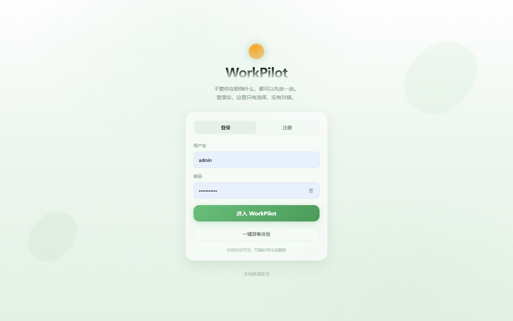
</p>
<p align="center"><sub>登录 / 注册 · 本地联调账号</sub></p>

<p align="center">
  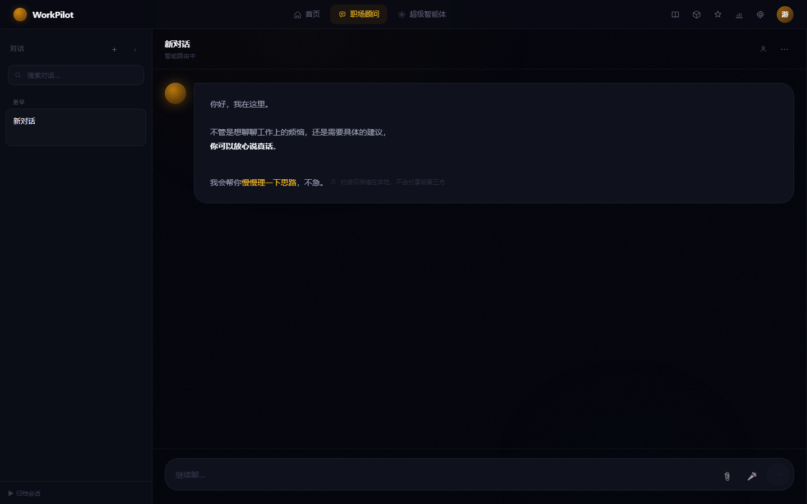
</p>
<p align="center"><sub>职场顾问：个人伙伴 + 数字员工入口 · 建议动作 chips · SSE 流式对话 · 右下角桌面萌宠</sub></p>

<p align="center">
  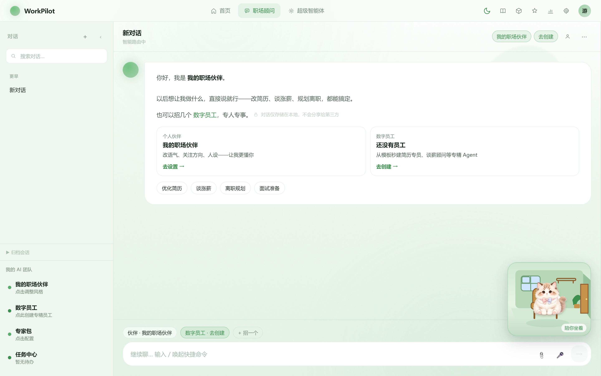
</p>
<p align="center"><sub>桌面萌宠：可拖拽、右键菜单、随 sage / dark 主题切换房间配色</sub></p>

<p align="center">
  
  
  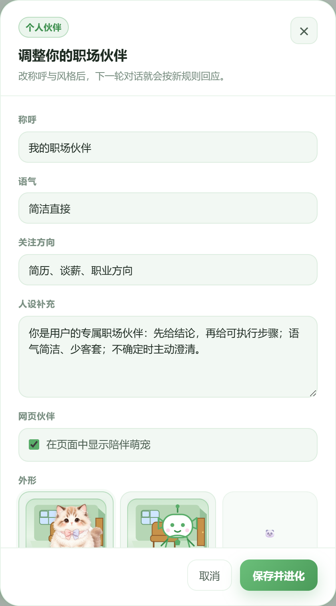
</p>
<p align="center"><sub>左：青荷绿房间 · 中：暗色房间 · 右：伙伴设置里切换小猫/领航员皮肤</sub></p>

<p align="center">
  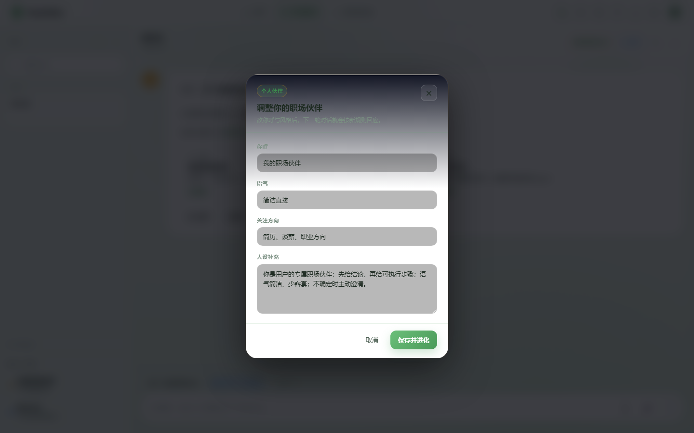
  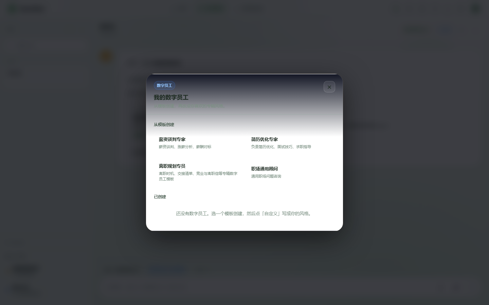
</p>
<p align="center"><sub>左：个人伙伴人设设置 · 右：数字员工模板创建</sub></p>

<p align="center">
  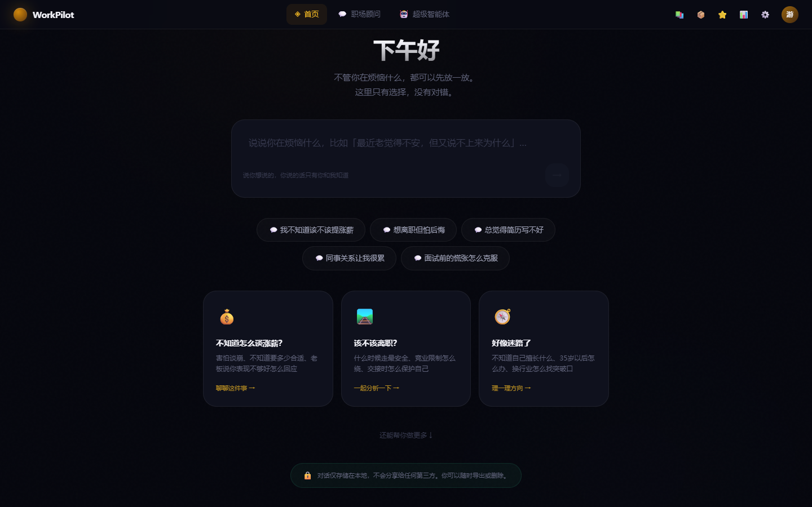
  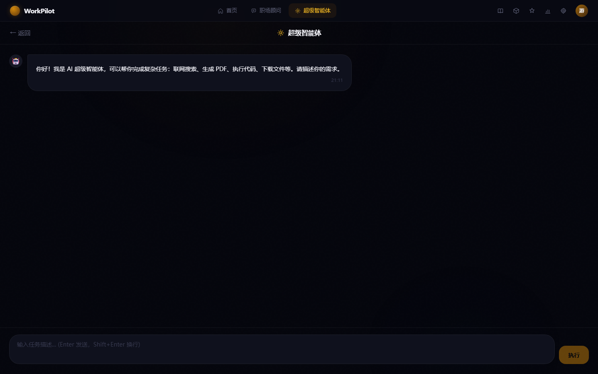
</p>
<p align="center"><sub>左：工作台 · 右：超级智能体</sub></p>

<p align="center">
  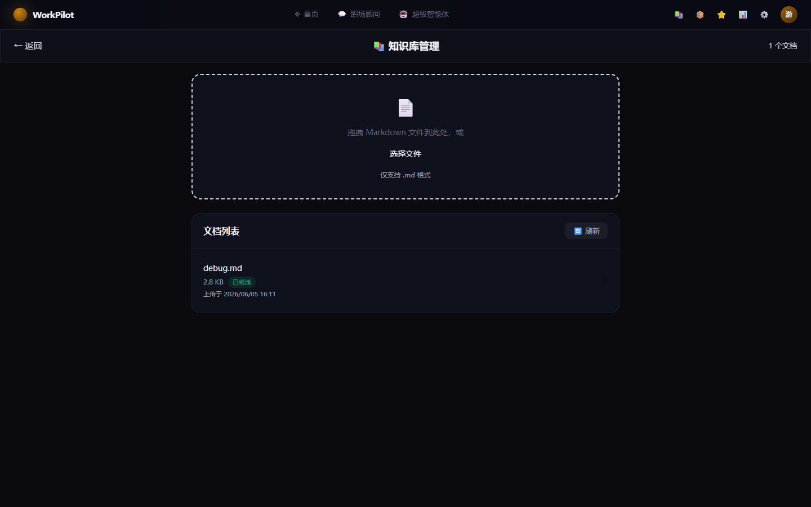
</p>
<p align="center"><sub>知识库：MD/PDF 上传 · 分类 · 筛选 · sage/dark 双主题（需登录）</sub></p>

### 主题预览（sage · dark）

<p align="center">
  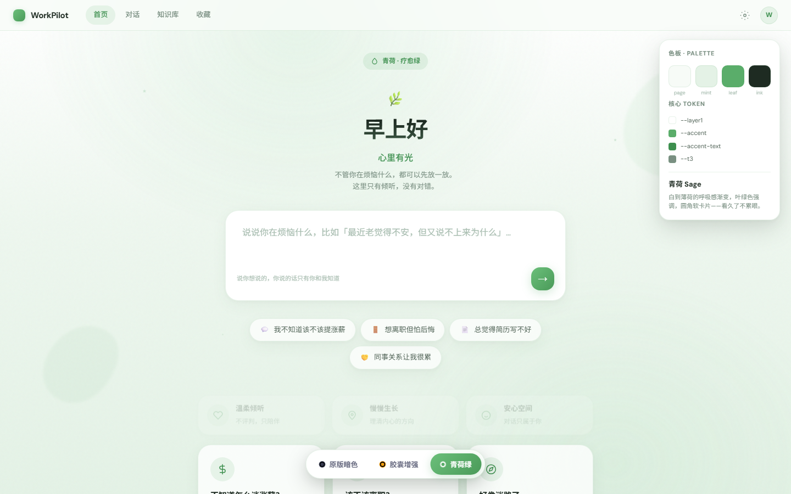
  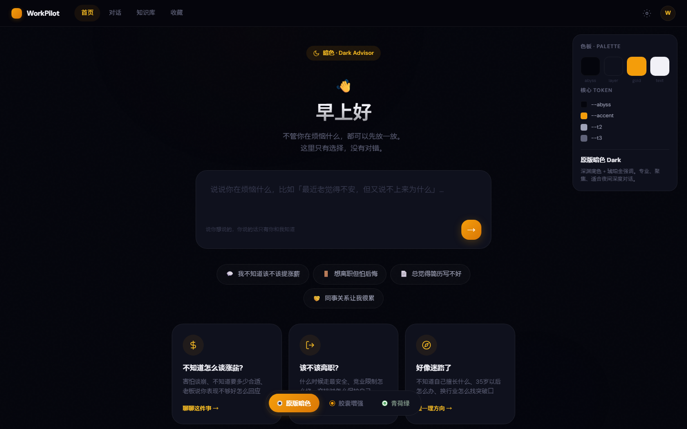
</p>
<p align="center"><sub>顶栏 🌿/🌙 一键切换；萌宠房间、知识库、工作台等全站同步。胶囊主题为设计原型（<code>prototypes/</code>），未接入正式 UI。</sub></p>

---

## 🏗 系统架构

<p align="center">
  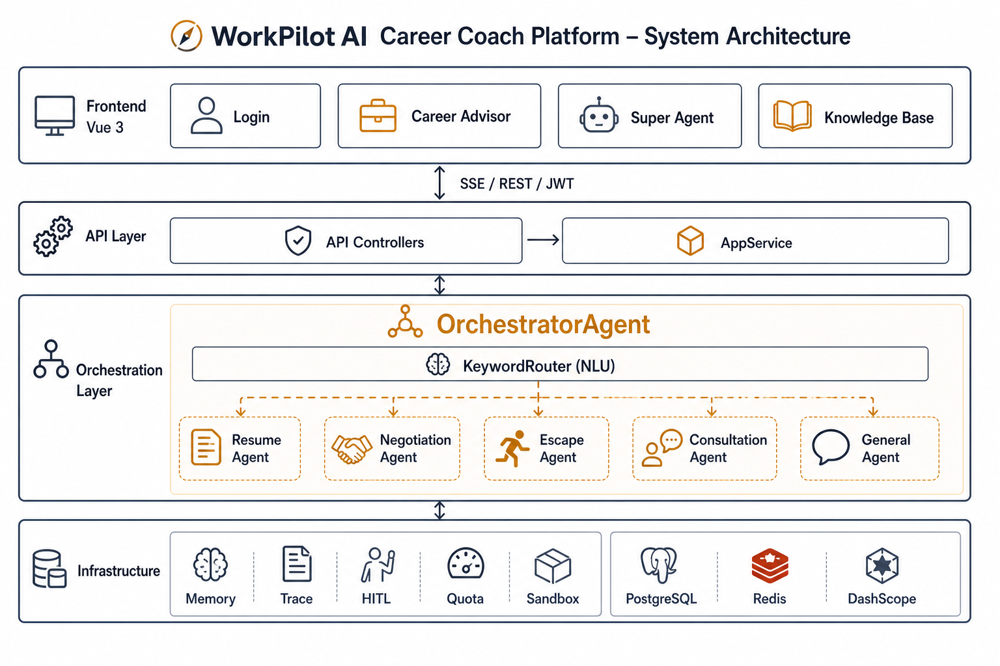
</p>
<p align="center"><sub>Frontend Vue3 → API / AppService → OrchestratorAgent → 子 Agent + Memory / Trace / HITL / Store / LLM</sub></p>

### Agent 路由

<p align="center">
  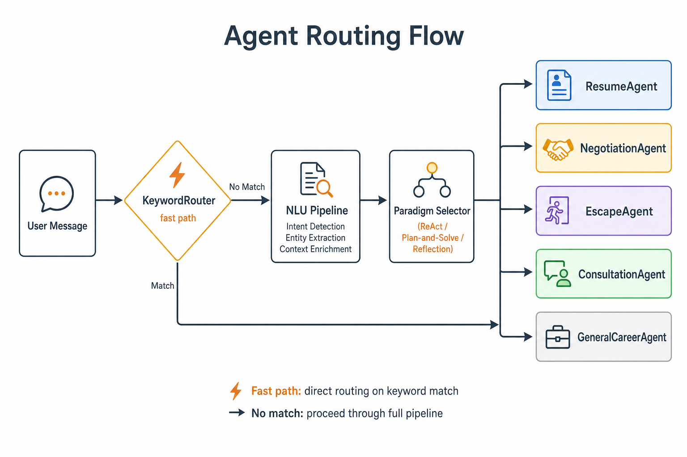
</p>
<p align="center"><sub>用户消息 → KeywordRouter（快路径）→ NLU Pipeline → ReAct / Plan-and-Solve / Reflection → 五个专业子 Agent</sub></p>

### 技术栈

| 层 | 技术 |
|----|------|
| 后端 | Java 21 · Spring Boot 3.4 · Spring AI 1.0 |
| 模型 | DashScope（默认 `qwen3.7-max`）· 可选 Ollama |
| 前端 | Vue 3 · Vite · Axios · marked |
| 存储 | `file`（`./tmp` 消息/Trace）· local 开发 H2（JPA 业务表）· 可选 `jdbc` PostgreSQL |
| 主题 | **sage**（青荷绿，默认）· **dark**（暗色）；`localStorage` 持久化 |
| 通信 | SSE（token 走 URL 参数）· REST + JWT refresh |

---

## 🗺 功能地图

### 前端页面

| 路径 | 页面 | 说明 |
|------|------|------|
| `/login` | 登录 / 注册 | 支持游客一键登录（local profile） |
| `/` | 工作台 | 功能入口聚合 |
| `/chat/career` | 职场顾问 | 主对话 · 伙伴/数字员工抽屉 · Trace 侧栏 · 萌宠 |
| `/chat/super` | 超级智能体 | ReAct + 工具 + RAG |
| `/knowledge` | 知识库 | MD/PDF 上传 · 分类筛选 |
| `/favorites` | 收藏 | 消息快照 |
| `/usage` | 用量 | Token / 反馈统计 |
| `/trace/:traceId` | Trace 详情 | 单次执行轨迹 |
| `/admin` | 管理后台 | 需 ADMIN 角色 |
| `/artifacts` · `/compare` | 交付物 / Agent 对比 | 需 ADMIN 角色 |

> **伙伴人设**与**数字员工**在职场顾问内通过顶栏/侧栏抽屉配置，REST 为 `/api/companion/me`、`/api/digital-employee/*`（非独立 Vue 路由）。

### 能力对照

| 你想做什么 | 去哪用 | 背后是谁 |
|-----------|--------|---------|
| 聊职场困惑、求职、薪资、离职 | **职场顾问** `/chat/career` | Orchestrator → 5 个子 Agent |
| 上传简历 / Offer 再追问 | 职场顾问 📎 上传 | Perception bind（**非**知识库列表） |
| 调整「我的职场伙伴」人设 / 萌宠皮肤 | 职场顾问顶栏「我的伙伴」抽屉 | `/companion/me` + `CompanionPet` |
| 招聘专精数字员工 | 职场顾问「去创建」→ 选模板 | `/digital-employee/*` |
| 对回答点赞/踩，让系统进化 | 消息气泡 👍/👎 | Feedback → Reflexion / Fact |
| 持久化职场文档供 RAG 检索 | **知识库** `/knowledge` | `RetrievalPipeline` + `DocumentAppService` |
| 让 AI 自己规划并调用工具 | **超级智能体** `/chat/super` | YuManus（ReAct + `searchKnowledgeBase`） |
| 看一次对话怎么被路由 / 执行 | Trace / 用量面板 | TraceRecorder · Usage |
| 问「有什么可以预约」 | 职场顾问 | `ConsultationAgent` 服务目录 |
| 问「今天有我的预约吗」 | 职场顾问 | `ConsultationAgent` 查 `AppointmentRepository` |

| 能力 | 说明 |
|------|------|
| Multi-Agent 路由 | Keyword 快路径 + NLU；Resume / Negotiation / Escape / Consultation / General |
| 文档感知 | 简历/Offer 降维绑定 SharedState；感知路由优先于模糊澄清；长 PDF Map-Reduce |
| RAG 知识库 | `RetrievalPipeline` · `RagTool` · PDF 表格 MVP · `/knowledge` 双主题管理页 |
| Goal Anchor | 每轮/每步重插任务目标，抗长 Context 遗忘 |
| 个人职场伙伴 | 每用户一份 companion；注入 Orchestrator 系统上下文 |
| 数字员工 | 模板创建、人设版本、激活委托、可回滚 |
| 反馈闭环 | UP/DOWN → Fact 偏好 / Reflexion；用量页可看反馈统计 |
| 建议动作 | 开场冷启动 chips + 回复后 SSE `suggested-actions` |
| 四层记忆 | 滑动窗口 · 事实 · 摘要 · 向量经验 |
| 工具调用 | Schema 边界 · 并行 Fan-out · 清洗 · 幂等 · file_id · Submit-Poll + MCP |
| Agent Loop | maxSteps Wrap-up · P&E Replanner · 完成态防幻觉 · Depth Limit |
| HITL 审批 | 终端、日历、文件写入等高危操作需确认 |
| 预约咨询 | 目录介绍 · 查日程 · 槽位收集 → 确认 → 创建（Feishu/DingTalk 可接） |
| 桌面萌宠 | `CompanionPet` + `CatPet`/`PilotPet` · 主题自适应 `PetRoom` |
| 平台插件化 | `platform.manifest` / `platform.agent.runner` 等灰度开关（默认 legacy） |
| Trace | 执行轨迹可视化，便于联调与答辩 |
| 双存储 | `file` 演示 / `jdbc` 生产向 PostgreSQL；local H2 承载 JPA |
| 质量与监控 | QualityGuard · Actuator · Prometheus |

完整分层（L0–L34）见 [docs/FEATURES.md](docs/FEATURES.md)。

---

## 💡 建议怎么学

本项目更偏**工程落地**，而不是纯教程章节。推荐路径：

1. **先跑通** — 按「快速开始」起前后端，用游客账号在职场顾问里聊几轮  
2. **看路由** — 对照 Trace / 日志，观察 KeywordRouter 与 NLU 如何选中子 Agent  
3. **读核心代码** — `OrchestratorAgent` → 子 Agent → `MemoryCoordinator` → HITL  
4. **对照文档** — [场景对照总结](docs/mm-agent-tutorial-场景对照总结.md) + `FEATURES.md` + `INTERVIEW-DEFENSE.md`  
5. **扩展一点** — 知识库页上传 PDF/MD，或新增 Skill YAML / MCP

适合有一定 Java / 前端基础、了解 LLM API 的同学；不要求算法训练背景。

### 目录结构

```
agent_product/
├── src/main/java/com/yupi/yuaiagent/
│   ├── agent/          # Orchestrator + 子 Agent + 范式 + loop/
│   ├── perception/     # 文档感知预处理
│   ├── nlu/ memory/    # 意图理解 · 四层记忆
│   ├── hitl/ auth/     # 人工审批 · JWT / 配额
│   ├── tools/ rag/     # 工具 · RetrievalPipeline · RagTool
│   ├── document/pdf/   # PDF 表格结构化入库
│   ├── guard/ budget/  # 循环检测 · Observation 清洗 · Token 预算
│   ├── controller/ service/
├── src/main/resources/
│   ├── application.yml · skills/ · permissions/ · db/migration/
├── yu-ai-agent-frontend/
│   ├── src/components/companion/   # CompanionPet · PetRoom · CatPet · 主题 CSS 变量
│   ├── src/composables/useTheme.js # sage ↔ dark
│   └── src/views/KnowledgeBase.vue
├── docker-compose.yml
└── docs/               # WIKI · FEATURES · 插件平台计划 · mm-agent 场景对照 · assets
```

---

## ❓ 常见问题

**聊天没有回复？**  
看后端日志是否出现 `AllocationQuota.FreeTierOnly`：DashScope 免费额度耗尽。关闭「仅免费额度」或充值后重试。

**后端启动很慢？**  
首次启动会做知识库向量 embedding，约 5–10 分钟属正常；看到 `Started AiAgentApplication` 后即可访问。

**游客登录失败？**  
确认使用仓库默认 `local` profile（`application-local.yml` 中 `guest-enabled: true`）。生产 profile 默认关闭游客。

**编译报「不支持发行版本 21」？**  
当前 `JAVA_HOME` 不是 JDK 21，请切换后重启后端（见「快速开始」PowerShell 示例）。

**PowerShell 下 Maven 参数报错？**  
请使用 `.\mvnw.cmd spring-boot:run "-Dmaven.test.skip=true"`（参数加引号，推荐 Maven Wrapper）。

**SSE 鉴权失败？**  
EventSource 不能带 Header，前端已把 token 放在 URL 参数；请确认已登录且 token 未过期。

**问「今天有预约吗」却弹出可预约目录？**  
已在 `ConsultationAgent` 区分「查日程」与「有什么可约」；请拉最新代码并重启后端。

---

## 📜 开源协议

本项目采用 [MIT License](LICENSE)。

---

<div align="center">
  <p>如果这个项目对你有帮助，欢迎 Star ⭐</p>
  <p><em>Built by jsq · Java 21 + Spring AI + Vue 3 + PostgreSQL</em></p>
</div>
